[](https://xkcd.com/710/)

# Introduction

From [Collatz conjecture, Wikipedia](https://en.wikipedia.org/wiki/Collatz_conjecture):  

"Start with any positive integer n. Then each term is obtained from the previous 
term as follows: if the previous term is even, the next term is one half of the 
previous term. If the previous term is odd, the next term is 3 times the previous 
term plus 1.

**The conjecture is that no matter what value of n, the sequence will always reach 1.**"

## The rules as R functions


```r
collatz_even <- function(even_int){
  return(even_int / 2)
}

collatz_odd <- function(odd_int){
  return(3 * odd_int + 1)
}
```

## Brute force algorithm

First of all, let's decide on a range of starting values for which we would like 
to compute the trajectories of the Collatz sequences, and a maximum number of steps
to compute for any starting value.


```r
seeds <- 1:10000
max_s <- 1000
```

Now let's define a function that computed the trajectories and returns:


```r
collatz_brute_force <- function(start_int, max_steps = 1000){
  new_val <- start_int
  steps <- c(new_val)
  step_count <- 0
  
  # This while statement could never disprove the Collatz conjecture if one start 
  # integer were to lead to infinity, because it has no way of knowing that the 
  # there is no solution, and without a break condition, it would naively keep 
  # running the function ad infinitum. (it has been shown that there are no 
  # starting values that disprove the Collatz conjecture inferior to 2^68)
  
  while(new_val != 1) {
    step_count <- step_count + 1
    if(new_val %% 2 == 0){
      new_val <- collatz_even(new_val)
      steps <- c(steps, new_val)}
    else{
      new_val <- collatz_odd(new_val)
      steps <- c(steps, new_val)}
    if(step_count > max_steps){
      break
    }
  }
  return(list(steps))
}
```

## Brute force data collection


```r
# collecting the data
collatz_data <- data.frame(seed = seeds)

collatz_data <- collatz_data %>% 
  rowwise() %>% 
  mutate(sequence = list(collatz_brute_force(seed, max_steps = max_s))) %>% 
  unnest(sequence) %>% 
  rowwise() %>% 
  mutate(max_val = max(sequence),
         n_steps = length(sequence)) %>% 
  mutate(step_index = list(1:n_steps))

collatz_data
```

<div data-pagedtable="false">
  <script data-pagedtable-source type="application/json">
{"columns":[{"label":["seed"],"name":[1],"type":["int"],"align":["right"]},{"label":["sequence"],"name":[2],"type":["list"],"align":["right"]},{"label":["max_val"],"name":[3],"type":["dbl"],"align":["right"]},{"label":["n_steps"],"name":[4],"type":["int"],"align":["right"]},{"label":["step_index"],"name":[5],"type":["list"],"align":["right"]}],"data":[{"1":"1","2":"<int [1]>","3":"1","4":"1","5":"<int [1]>"},{"1":"2","2":"<dbl [2]>","3":"2","4":"2","5":"<int [2]>"},{"1":"3","2":"<dbl [8]>","3":"16","4":"8","5":"<int [8]>"},{"1":"4","2":"<dbl [3]>","3":"4","4":"3","5":"<int [3]>"},{"1":"5","2":"<dbl [6]>","3":"16","4":"6","5":"<int [6]>"},{"1":"6","2":"<dbl [9]>","3":"16","4":"9","5":"<int [9]>"},{"1":"7","2":"<dbl [17]>","3":"52","4":"17","5":"<int [17]>"},{"1":"8","2":"<dbl [4]>","3":"8","4":"4","5":"<int [4]>"},{"1":"9","2":"<dbl [20]>","3":"52","4":"20","5":"<int [20]>"},{"1":"10","2":"<dbl [7]>","3":"16","4":"7","5":"<int [7]>"},{"1":"11","2":"<dbl [15]>","3":"52","4":"15","5":"<int [15]>"},{"1":"12","2":"<dbl [10]>","3":"16","4":"10","5":"<int [10]>"},{"1":"13","2":"<dbl [10]>","3":"40","4":"10","5":"<int [10]>"},{"1":"14","2":"<dbl [18]>","3":"52","4":"18","5":"<int [18]>"},{"1":"15","2":"<dbl [18]>","3":"160","4":"18","5":"<int [18]>"},{"1":"16","2":"<dbl [5]>","3":"16","4":"5","5":"<int [5]>"},{"1":"17","2":"<dbl [13]>","3":"52","4":"13","5":"<int [13]>"},{"1":"18","2":"<dbl [21]>","3":"52","4":"21","5":"<int [21]>"},{"1":"19","2":"<dbl [21]>","3":"88","4":"21","5":"<int [21]>"},{"1":"20","2":"<dbl [8]>","3":"20","4":"8","5":"<int [8]>"},{"1":"21","2":"<dbl [8]>","3":"64","4":"8","5":"<int [8]>"},{"1":"22","2":"<dbl [16]>","3":"52","4":"16","5":"<int [16]>"},{"1":"23","2":"<dbl [16]>","3":"160","4":"16","5":"<int [16]>"},{"1":"24","2":"<dbl [11]>","3":"24","4":"11","5":"<int [11]>"},{"1":"25","2":"<dbl [24]>","3":"88","4":"24","5":"<int [24]>"},{"1":"26","2":"<dbl [11]>","3":"40","4":"11","5":"<int [11]>"},{"1":"27","2":"<dbl [112]>","3":"9232","4":"112","5":"<int [112]>"},{"1":"28","2":"<dbl [19]>","3":"52","4":"19","5":"<int [19]>"},{"1":"29","2":"<dbl [19]>","3":"88","4":"19","5":"<int [19]>"},{"1":"30","2":"<dbl [19]>","3":"160","4":"19","5":"<int [19]>"},{"1":"31","2":"<dbl [107]>","3":"9232","4":"107","5":"<int [107]>"},{"1":"32","2":"<dbl [6]>","3":"32","4":"6","5":"<int [6]>"},{"1":"33","2":"<dbl [27]>","3":"100","4":"27","5":"<int [27]>"},{"1":"34","2":"<dbl [14]>","3":"52","4":"14","5":"<int [14]>"},{"1":"35","2":"<dbl [14]>","3":"160","4":"14","5":"<int [14]>"},{"1":"36","2":"<dbl [22]>","3":"52","4":"22","5":"<int [22]>"},{"1":"37","2":"<dbl [22]>","3":"112","4":"22","5":"<int [22]>"},{"1":"38","2":"<dbl [22]>","3":"88","4":"22","5":"<int [22]>"},{"1":"39","2":"<dbl [35]>","3":"304","4":"35","5":"<int [35]>"},{"1":"40","2":"<dbl [9]>","3":"40","4":"9","5":"<int [9]>"},{"1":"41","2":"<dbl [110]>","3":"9232","4":"110","5":"<int [110]>"},{"1":"42","2":"<dbl [9]>","3":"64","4":"9","5":"<int [9]>"},{"1":"43","2":"<dbl [30]>","3":"196","4":"30","5":"<int [30]>"},{"1":"44","2":"<dbl [17]>","3":"52","4":"17","5":"<int [17]>"},{"1":"45","2":"<dbl [17]>","3":"136","4":"17","5":"<int [17]>"},{"1":"46","2":"<dbl [17]>","3":"160","4":"17","5":"<int [17]>"},{"1":"47","2":"<dbl [105]>","3":"9232","4":"105","5":"<int [105]>"},{"1":"48","2":"<dbl [12]>","3":"48","4":"12","5":"<int [12]>"},{"1":"49","2":"<dbl [25]>","3":"148","4":"25","5":"<int [25]>"},{"1":"50","2":"<dbl [25]>","3":"88","4":"25","5":"<int [25]>"},{"1":"51","2":"<dbl [25]>","3":"232","4":"25","5":"<int [25]>"},{"1":"52","2":"<dbl [12]>","3":"52","4":"12","5":"<int [12]>"},{"1":"53","2":"<dbl [12]>","3":"160","4":"12","5":"<int [12]>"},{"1":"54","2":"<dbl [113]>","3":"9232","4":"113","5":"<int [113]>"},{"1":"55","2":"<dbl [113]>","3":"9232","4":"113","5":"<int [113]>"},{"1":"56","2":"<dbl [20]>","3":"56","4":"20","5":"<int [20]>"},{"1":"57","2":"<dbl [33]>","3":"196","4":"33","5":"<int [33]>"},{"1":"58","2":"<dbl [20]>","3":"88","4":"20","5":"<int [20]>"},{"1":"59","2":"<dbl [33]>","3":"304","4":"33","5":"<int [33]>"},{"1":"60","2":"<dbl [20]>","3":"160","4":"20","5":"<int [20]>"},{"1":"61","2":"<dbl [20]>","3":"184","4":"20","5":"<int [20]>"},{"1":"62","2":"<dbl [108]>","3":"9232","4":"108","5":"<int [108]>"},{"1":"63","2":"<dbl [108]>","3":"9232","4":"108","5":"<int [108]>"},{"1":"64","2":"<dbl [7]>","3":"64","4":"7","5":"<int [7]>"},{"1":"65","2":"<dbl [28]>","3":"196","4":"28","5":"<int [28]>"},{"1":"66","2":"<dbl [28]>","3":"100","4":"28","5":"<int [28]>"},{"1":"67","2":"<dbl [28]>","3":"304","4":"28","5":"<int [28]>"},{"1":"68","2":"<dbl [15]>","3":"68","4":"15","5":"<int [15]>"},{"1":"69","2":"<dbl [15]>","3":"208","4":"15","5":"<int [15]>"},{"1":"70","2":"<dbl [15]>","3":"160","4":"15","5":"<int [15]>"},{"1":"71","2":"<dbl [103]>","3":"9232","4":"103","5":"<int [103]>"},{"1":"72","2":"<dbl [23]>","3":"72","4":"23","5":"<int [23]>"},{"1":"73","2":"<dbl [116]>","3":"9232","4":"116","5":"<int [116]>"},{"1":"74","2":"<dbl [23]>","3":"112","4":"23","5":"<int [23]>"},{"1":"75","2":"<dbl [15]>","3":"340","4":"15","5":"<int [15]>"},{"1":"76","2":"<dbl [23]>","3":"88","4":"23","5":"<int [23]>"},{"1":"77","2":"<dbl [23]>","3":"232","4":"23","5":"<int [23]>"},{"1":"78","2":"<dbl [36]>","3":"304","4":"36","5":"<int [36]>"},{"1":"79","2":"<dbl [36]>","3":"808","4":"36","5":"<int [36]>"},{"1":"80","2":"<dbl [10]>","3":"80","4":"10","5":"<int [10]>"},{"1":"81","2":"<dbl [23]>","3":"244","4":"23","5":"<int [23]>"},{"1":"82","2":"<dbl [111]>","3":"9232","4":"111","5":"<int [111]>"},{"1":"83","2":"<dbl [111]>","3":"9232","4":"111","5":"<int [111]>"},{"1":"84","2":"<dbl [10]>","3":"84","4":"10","5":"<int [10]>"},{"1":"85","2":"<dbl [10]>","3":"256","4":"10","5":"<int [10]>"},{"1":"86","2":"<dbl [31]>","3":"196","4":"31","5":"<int [31]>"},{"1":"87","2":"<dbl [31]>","3":"592","4":"31","5":"<int [31]>"},{"1":"88","2":"<dbl [18]>","3":"88","4":"18","5":"<int [18]>"},{"1":"89","2":"<dbl [31]>","3":"304","4":"31","5":"<int [31]>"},{"1":"90","2":"<dbl [18]>","3":"136","4":"18","5":"<int [18]>"},{"1":"91","2":"<dbl [93]>","3":"9232","4":"93","5":"<int [93]>"},{"1":"92","2":"<dbl [18]>","3":"160","4":"18","5":"<int [18]>"},{"1":"93","2":"<dbl [18]>","3":"280","4":"18","5":"<int [18]>"},{"1":"94","2":"<dbl [106]>","3":"9232","4":"106","5":"<int [106]>"},{"1":"95","2":"<dbl [106]>","3":"9232","4":"106","5":"<int [106]>"},{"1":"96","2":"<dbl [13]>","3":"96","4":"13","5":"<int [13]>"},{"1":"97","2":"<dbl [119]>","3":"9232","4":"119","5":"<int [119]>"},{"1":"98","2":"<dbl [26]>","3":"148","4":"26","5":"<int [26]>"},{"1":"99","2":"<dbl [26]>","3":"448","4":"26","5":"<int [26]>"},{"1":"100","2":"<dbl [26]>","3":"100","4":"26","5":"<int [26]>"},{"1":"101","2":"<dbl [26]>","3":"304","4":"26","5":"<int [26]>"},{"1":"102","2":"<dbl [26]>","3":"232","4":"26","5":"<int [26]>"},{"1":"103","2":"<dbl [88]>","3":"9232","4":"88","5":"<int [88]>"},{"1":"104","2":"<dbl [13]>","3":"104","4":"13","5":"<int [13]>"},{"1":"105","2":"<dbl [39]>","3":"808","4":"39","5":"<int [39]>"},{"1":"106","2":"<dbl [13]>","3":"160","4":"13","5":"<int [13]>"},{"1":"107","2":"<dbl [101]>","3":"9232","4":"101","5":"<int [101]>"},{"1":"108","2":"<dbl [114]>","3":"9232","4":"114","5":"<int [114]>"},{"1":"109","2":"<dbl [114]>","3":"9232","4":"114","5":"<int [114]>"},{"1":"110","2":"<dbl [114]>","3":"9232","4":"114","5":"<int [114]>"},{"1":"111","2":"<dbl [70]>","3":"9232","4":"70","5":"<int [70]>"},{"1":"112","2":"<dbl [21]>","3":"112","4":"21","5":"<int [21]>"},{"1":"113","2":"<dbl [13]>","3":"340","4":"13","5":"<int [13]>"},{"1":"114","2":"<dbl [34]>","3":"196","4":"34","5":"<int [34]>"},{"1":"115","2":"<dbl [34]>","3":"520","4":"34","5":"<int [34]>"},{"1":"116","2":"<dbl [21]>","3":"116","4":"21","5":"<int [21]>"},{"1":"117","2":"<dbl [21]>","3":"352","4":"21","5":"<int [21]>"},{"1":"118","2":"<dbl [34]>","3":"304","4":"34","5":"<int [34]>"},{"1":"119","2":"<dbl [34]>","3":"808","4":"34","5":"<int [34]>"},{"1":"120","2":"<dbl [21]>","3":"160","4":"21","5":"<int [21]>"},{"1":"121","2":"<dbl [96]>","3":"9232","4":"96","5":"<int [96]>"},{"1":"122","2":"<dbl [21]>","3":"184","4":"21","5":"<int [21]>"},{"1":"123","2":"<dbl [47]>","3":"628","4":"47","5":"<int [47]>"},{"1":"124","2":"<dbl [109]>","3":"9232","4":"109","5":"<int [109]>"},{"1":"125","2":"<dbl [109]>","3":"9232","4":"109","5":"<int [109]>"},{"1":"126","2":"<dbl [109]>","3":"9232","4":"109","5":"<int [109]>"},{"1":"127","2":"<dbl [47]>","3":"4372","4":"47","5":"<int [47]>"},{"1":"128","2":"<dbl [8]>","3":"128","4":"8","5":"<int [8]>"},{"1":"129","2":"<dbl [122]>","3":"9232","4":"122","5":"<int [122]>"},{"1":"130","2":"<dbl [29]>","3":"196","4":"29","5":"<int [29]>"},{"1":"131","2":"<dbl [29]>","3":"592","4":"29","5":"<int [29]>"},{"1":"132","2":"<dbl [29]>","3":"132","4":"29","5":"<int [29]>"},{"1":"133","2":"<dbl [29]>","3":"400","4":"29","5":"<int [29]>"},{"1":"134","2":"<dbl [29]>","3":"304","4":"29","5":"<int [29]>"},{"1":"135","2":"<dbl [42]>","3":"916","4":"42","5":"<int [42]>"},{"1":"136","2":"<dbl [16]>","3":"136","4":"16","5":"<int [16]>"},{"1":"137","2":"<dbl [91]>","3":"9232","4":"91","5":"<int [91]>"},{"1":"138","2":"<dbl [16]>","3":"208","4":"16","5":"<int [16]>"},{"1":"139","2":"<dbl [42]>","3":"628","4":"42","5":"<int [42]>"},{"1":"140","2":"<dbl [16]>","3":"160","4":"16","5":"<int [16]>"},{"1":"141","2":"<dbl [16]>","3":"424","4":"16","5":"<int [16]>"},{"1":"142","2":"<dbl [104]>","3":"9232","4":"104","5":"<int [104]>"},{"1":"143","2":"<dbl [104]>","3":"9232","4":"104","5":"<int [104]>"},{"1":"144","2":"<dbl [24]>","3":"144","4":"24","5":"<int [24]>"},{"1":"145","2":"<dbl [117]>","3":"9232","4":"117","5":"<int [117]>"},{"1":"146","2":"<dbl [117]>","3":"9232","4":"117","5":"<int [117]>"},{"1":"147","2":"<dbl [117]>","3":"9232","4":"117","5":"<int [117]>"},{"1":"148","2":"<dbl [24]>","3":"148","4":"24","5":"<int [24]>"},{"1":"149","2":"<dbl [24]>","3":"448","4":"24","5":"<int [24]>"},{"1":"150","2":"<dbl [16]>","3":"340","4":"16","5":"<int [16]>"},{"1":"151","2":"<dbl [16]>","3":"1024","4":"16","5":"<int [16]>"},{"1":"152","2":"<dbl [24]>","3":"152","4":"24","5":"<int [24]>"},{"1":"153","2":"<dbl [37]>","3":"520","4":"37","5":"<int [37]>"},{"1":"154","2":"<dbl [24]>","3":"232","4":"24","5":"<int [24]>"},{"1":"155","2":"<dbl [86]>","3":"9232","4":"86","5":"<int [86]>"},{"1":"156","2":"<dbl [37]>","3":"304","4":"37","5":"<int [37]>"},{"1":"157","2":"<dbl [37]>","3":"472","4":"37","5":"<int [37]>"},{"1":"158","2":"<dbl [37]>","3":"808","4":"37","5":"<int [37]>"},{"1":"159","2":"<dbl [55]>","3":"9232","4":"55","5":"<int [55]>"},{"1":"160","2":"<dbl [11]>","3":"160","4":"11","5":"<int [11]>"},{"1":"161","2":"<dbl [99]>","3":"9232","4":"99","5":"<int [99]>"},{"1":"162","2":"<dbl [24]>","3":"244","4":"24","5":"<int [24]>"},{"1":"163","2":"<dbl [24]>","3":"736","4":"24","5":"<int [24]>"},{"1":"164","2":"<dbl [112]>","3":"9232","4":"112","5":"<int [112]>"},{"1":"165","2":"<dbl [112]>","3":"9232","4":"112","5":"<int [112]>"},{"1":"166","2":"<dbl [112]>","3":"9232","4":"112","5":"<int [112]>"},{"1":"167","2":"<dbl [68]>","3":"9232","4":"68","5":"<int [68]>"},{"1":"168","2":"<dbl [11]>","3":"168","4":"11","5":"<int [11]>"},{"1":"169","2":"<dbl [50]>","3":"4372","4":"50","5":"<int [50]>"},{"1":"170","2":"<dbl [11]>","3":"256","4":"11","5":"<int [11]>"},{"1":"171","2":"<dbl [125]>","3":"9232","4":"125","5":"<int [125]>"},{"1":"172","2":"<dbl [32]>","3":"196","4":"32","5":"<int [32]>"},{"1":"173","2":"<dbl [32]>","3":"520","4":"32","5":"<int [32]>"},{"1":"174","2":"<dbl [32]>","3":"592","4":"32","5":"<int [32]>"},{"1":"175","2":"<dbl [81]>","3":"9232","4":"81","5":"<int [81]>"},{"1":"176","2":"<dbl [19]>","3":"176","4":"19","5":"<int [19]>"},{"1":"177","2":"<dbl [32]>","3":"532","4":"32","5":"<int [32]>"},{"1":"178","2":"<dbl [32]>","3":"304","4":"32","5":"<int [32]>"},{"1":"179","2":"<dbl [32]>","3":"808","4":"32","5":"<int [32]>"},{"1":"180","2":"<dbl [19]>","3":"180","4":"19","5":"<int [19]>"},{"1":"181","2":"<dbl [19]>","3":"544","4":"19","5":"<int [19]>"},{"1":"182","2":"<dbl [94]>","3":"9232","4":"94","5":"<int [94]>"},{"1":"183","2":"<dbl [94]>","3":"9232","4":"94","5":"<int [94]>"},{"1":"184","2":"<dbl [19]>","3":"184","4":"19","5":"<int [19]>"},{"1":"185","2":"<dbl [45]>","3":"628","4":"45","5":"<int [45]>"},{"1":"186","2":"<dbl [19]>","3":"280","4":"19","5":"<int [19]>"},{"1":"187","2":"<dbl [45]>","3":"952","4":"45","5":"<int [45]>"},{"1":"188","2":"<dbl [107]>","3":"9232","4":"107","5":"<int [107]>"},{"1":"189","2":"<dbl [107]>","3":"9232","4":"107","5":"<int [107]>"},{"1":"190","2":"<dbl [107]>","3":"9232","4":"107","5":"<int [107]>"},{"1":"191","2":"<dbl [45]>","3":"4372","4":"45","5":"<int [45]>"},{"1":"192","2":"<dbl [14]>","3":"192","4":"14","5":"<int [14]>"},{"1":"193","2":"<dbl [120]>","3":"9232","4":"120","5":"<int [120]>"},{"1":"194","2":"<dbl [120]>","3":"9232","4":"120","5":"<int [120]>"},{"1":"195","2":"<dbl [120]>","3":"9232","4":"120","5":"<int [120]>"},{"1":"196","2":"<dbl [27]>","3":"196","4":"27","5":"<int [27]>"},{"1":"197","2":"<dbl [27]>","3":"592","4":"27","5":"<int [27]>"},{"1":"198","2":"<dbl [27]>","3":"448","4":"27","5":"<int [27]>"},{"1":"199","2":"<dbl [120]>","3":"9232","4":"120","5":"<int [120]>"},{"1":"200","2":"<dbl [27]>","3":"200","4":"27","5":"<int [27]>"},{"1":"201","2":"<dbl [19]>","3":"1024","4":"19","5":"<int [19]>"},{"1":"202","2":"<dbl [27]>","3":"304","4":"27","5":"<int [27]>"},{"1":"203","2":"<dbl [40]>","3":"916","4":"40","5":"<int [40]>"},{"1":"204","2":"<dbl [27]>","3":"232","4":"27","5":"<int [27]>"},{"1":"205","2":"<dbl [27]>","3":"616","4":"27","5":"<int [27]>"},{"1":"206","2":"<dbl [89]>","3":"9232","4":"89","5":"<int [89]>"},{"1":"207","2":"<dbl [89]>","3":"9232","4":"89","5":"<int [89]>"},{"1":"208","2":"<dbl [14]>","3":"208","4":"14","5":"<int [14]>"},{"1":"209","2":"<dbl [40]>","3":"628","4":"40","5":"<int [40]>"},{"1":"210","2":"<dbl [40]>","3":"808","4":"40","5":"<int [40]>"},{"1":"211","2":"<dbl [40]>","3":"952","4":"40","5":"<int [40]>"},{"1":"212","2":"<dbl [14]>","3":"212","4":"14","5":"<int [14]>"},{"1":"213","2":"<dbl [14]>","3":"640","4":"14","5":"<int [14]>"},{"1":"214","2":"<dbl [102]>","3":"9232","4":"102","5":"<int [102]>"},{"1":"215","2":"<dbl [102]>","3":"9232","4":"102","5":"<int [102]>"},{"1":"216","2":"<dbl [115]>","3":"9232","4":"115","5":"<int [115]>"},{"1":"217","2":"<dbl [27]>","3":"736","4":"27","5":"<int [27]>"},{"1":"218","2":"<dbl [115]>","3":"9232","4":"115","5":"<int [115]>"},{"1":"219","2":"<dbl [53]>","3":"1672","4":"53","5":"<int [53]>"},{"1":"220","2":"<dbl [115]>","3":"9232","4":"115","5":"<int [115]>"},{"1":"221","2":"<dbl [115]>","3":"9232","4":"115","5":"<int [115]>"},{"1":"222","2":"<dbl [71]>","3":"9232","4":"71","5":"<int [71]>"},{"1":"223","2":"<dbl [71]>","3":"9232","4":"71","5":"<int [71]>"},{"1":"224","2":"<dbl [22]>","3":"224","4":"22","5":"<int [22]>"},{"1":"225","2":"<dbl [53]>","3":"4372","4":"53","5":"<int [53]>"},{"1":"226","2":"<dbl [14]>","3":"340","4":"14","5":"<int [14]>"},{"1":"227","2":"<dbl [14]>","3":"1024","4":"14","5":"<int [14]>"},{"1":"228","2":"<dbl [35]>","3":"228","4":"35","5":"<int [35]>"},{"1":"229","2":"<dbl [35]>","3":"688","4":"35","5":"<int [35]>"},{"1":"230","2":"<dbl [35]>","3":"520","4":"35","5":"<int [35]>"},{"1":"231","2":"<dbl [128]>","3":"9232","4":"128","5":"<int [128]>"},{"1":"232","2":"<dbl [22]>","3":"232","4":"22","5":"<int [22]>"},{"1":"233","2":"<dbl [84]>","3":"9232","4":"84","5":"<int [84]>"},{"1":"234","2":"<dbl [22]>","3":"352","4":"22","5":"<int [22]>"},{"1":"235","2":"<dbl [128]>","3":"9232","4":"128","5":"<int [128]>"},{"1":"236","2":"<dbl [35]>","3":"304","4":"35","5":"<int [35]>"},{"1":"237","2":"<dbl [35]>","3":"712","4":"35","5":"<int [35]>"},{"1":"238","2":"<dbl [35]>","3":"808","4":"35","5":"<int [35]>"},{"1":"239","2":"<dbl [53]>","3":"9232","4":"53","5":"<int [53]>"},{"1":"240","2":"<dbl [22]>","3":"240","4":"22","5":"<int [22]>"},{"1":"241","2":"<dbl [22]>","3":"724","4":"22","5":"<int [22]>"},{"1":"242","2":"<dbl [97]>","3":"9232","4":"97","5":"<int [97]>"},{"1":"243","2":"<dbl [97]>","3":"9232","4":"97","5":"<int [97]>"},{"1":"244","2":"<dbl [22]>","3":"244","4":"22","5":"<int [22]>"},{"1":"245","2":"<dbl [22]>","3":"736","4":"22","5":"<int [22]>"},{"1":"246","2":"<dbl [48]>","3":"628","4":"48","5":"<int [48]>"},{"1":"247","2":"<dbl [48]>","3":"1672","4":"48","5":"<int [48]>"},{"1":"248","2":"<dbl [110]>","3":"9232","4":"110","5":"<int [110]>"},{"1":"249","2":"<dbl [48]>","3":"952","4":"48","5":"<int [48]>"},{"1":"250","2":"<dbl [110]>","3":"9232","4":"110","5":"<int [110]>"},{"1":"251","2":"<dbl [66]>","3":"9232","4":"66","5":"<int [66]>"},{"1":"252","2":"<dbl [110]>","3":"9232","4":"110","5":"<int [110]>"},{"1":"253","2":"<dbl [110]>","3":"9232","4":"110","5":"<int [110]>"},{"1":"254","2":"<dbl [48]>","3":"4372","4":"48","5":"<int [48]>"},{"1":"255","2":"<dbl [48]>","3":"13120","4":"48","5":"<int [48]>"},{"1":"256","2":"<dbl [9]>","3":"256","4":"9","5":"<int [9]>"},{"1":"257","2":"<dbl [123]>","3":"9232","4":"123","5":"<int [123]>"},{"1":"258","2":"<dbl [123]>","3":"9232","4":"123","5":"<int [123]>"},{"1":"259","2":"<dbl [123]>","3":"9232","4":"123","5":"<int [123]>"},{"1":"260","2":"<dbl [30]>","3":"260","4":"30","5":"<int [30]>"},{"1":"261","2":"<dbl [30]>","3":"784","4":"30","5":"<int [30]>"},{"1":"262","2":"<dbl [30]>","3":"592","4":"30","5":"<int [30]>"},{"1":"263","2":"<dbl [79]>","3":"9232","4":"79","5":"<int [79]>"},{"1":"264","2":"<dbl [30]>","3":"264","4":"30","5":"<int [30]>"},{"1":"265","2":"<dbl [123]>","3":"9232","4":"123","5":"<int [123]>"},{"1":"266","2":"<dbl [30]>","3":"400","4":"30","5":"<int [30]>"},{"1":"267","2":"<dbl [22]>","3":"1204","4":"22","5":"<int [22]>"},{"1":"268","2":"<dbl [30]>","3":"304","4":"30","5":"<int [30]>"},{"1":"269","2":"<dbl [30]>","3":"808","4":"30","5":"<int [30]>"},{"1":"270","2":"<dbl [43]>","3":"916","4":"43","5":"<int [43]>"},{"1":"271","2":"<dbl [43]>","3":"2752","4":"43","5":"<int [43]>"},{"1":"272","2":"<dbl [17]>","3":"272","4":"17","5":"<int [17]>"},{"1":"273","2":"<dbl [30]>","3":"820","4":"30","5":"<int [30]>"},{"1":"274","2":"<dbl [92]>","3":"9232","4":"92","5":"<int [92]>"},{"1":"275","2":"<dbl [92]>","3":"9232","4":"92","5":"<int [92]>"},{"1":"276","2":"<dbl [17]>","3":"276","4":"17","5":"<int [17]>"},{"1":"277","2":"<dbl [17]>","3":"832","4":"17","5":"<int [17]>"},{"1":"278","2":"<dbl [43]>","3":"628","4":"43","5":"<int [43]>"},{"1":"279","2":"<dbl [43]>","3":"1888","4":"43","5":"<int [43]>"},{"1":"280","2":"<dbl [17]>","3":"280","4":"17","5":"<int [17]>"},{"1":"281","2":"<dbl [43]>","3":"952","4":"43","5":"<int [43]>"},{"1":"282","2":"<dbl [17]>","3":"424","4":"17","5":"<int [17]>"},{"1":"283","2":"<dbl [61]>","3":"9232","4":"61","5":"<int [61]>"},{"1":"284","2":"<dbl [105]>","3":"9232","4":"105","5":"<int [105]>"},{"1":"285","2":"<dbl [105]>","3":"9232","4":"105","5":"<int [105]>"},{"1":"286","2":"<dbl [105]>","3":"9232","4":"105","5":"<int [105]>"},{"1":"287","2":"<dbl [43]>","3":"4372","4":"43","5":"<int [43]>"},{"1":"288","2":"<dbl [25]>","3":"288","4":"25","5":"<int [25]>"},{"1":"289","2":"<dbl [30]>","3":"868","4":"30","5":"<int [30]>"},{"1":"290","2":"<dbl [118]>","3":"9232","4":"118","5":"<int [118]>"},{"1":"291","2":"<dbl [118]>","3":"9232","4":"118","5":"<int [118]>"},{"1":"292","2":"<dbl [118]>","3":"9232","4":"118","5":"<int [118]>"},{"1":"293","2":"<dbl [118]>","3":"9232","4":"118","5":"<int [118]>"},{"1":"294","2":"<dbl [118]>","3":"9232","4":"118","5":"<int [118]>"},{"1":"295","2":"<dbl [56]>","3":"2248","4":"56","5":"<int [56]>"},{"1":"296","2":"<dbl [25]>","3":"296","4":"25","5":"<int [25]>"},{"1":"297","2":"<dbl [74]>","3":"9232","4":"74","5":"<int [74]>"},{"1":"298","2":"<dbl [25]>","3":"448","4":"25","5":"<int [25]>"},{"1":"299","2":"<dbl [118]>","3":"9232","4":"118","5":"<int [118]>"},{"1":"300","2":"<dbl [17]>","3":"340","4":"17","5":"<int [17]>"},{"1":"301","2":"<dbl [17]>","3":"904","4":"17","5":"<int [17]>"},{"1":"302","2":"<dbl [17]>","3":"1024","4":"17","5":"<int [17]>"},{"1":"303","2":"<dbl [43]>","3":"3076","4":"43","5":"<int [43]>"},{"1":"304","2":"<dbl [25]>","3":"304","4":"25","5":"<int [25]>"},{"1":"305","2":"<dbl [38]>","3":"916","4":"38","5":"<int [38]>"},{"1":"306","2":"<dbl [38]>","3":"520","4":"38","5":"<int [38]>"},{"1":"307","2":"<dbl [38]>","3":"1384","4":"38","5":"<int [38]>"},{"1":"308","2":"<dbl [25]>","3":"308","4":"25","5":"<int [25]>"},{"1":"309","2":"<dbl [25]>","3":"928","4":"25","5":"<int [25]>"},{"1":"310","2":"<dbl [87]>","3":"9232","4":"87","5":"<int [87]>"},{"1":"311","2":"<dbl [87]>","3":"9232","4":"87","5":"<int [87]>"},{"1":"312","2":"<dbl [38]>","3":"312","4":"38","5":"<int [38]>"},{"1":"313","2":"<dbl [131]>","3":"9232","4":"131","5":"<int [131]>"},{"1":"314","2":"<dbl [38]>","3":"472","4":"38","5":"<int [38]>"},{"1":"315","2":"<dbl [38]>","3":"1600","4":"38","5":"<int [38]>"},{"1":"316","2":"<dbl [38]>","3":"808","4":"38","5":"<int [38]>"},{"1":"317","2":"<dbl [38]>","3":"952","4":"38","5":"<int [38]>"},{"1":"318","2":"<dbl [56]>","3":"9232","4":"56","5":"<int [56]>"},{"1":"319","2":"<dbl [56]>","3":"9232","4":"56","5":"<int [56]>"},{"1":"320","2":"<dbl [12]>","3":"320","4":"12","5":"<int [12]>"},{"1":"321","2":"<dbl [25]>","3":"964","4":"25","5":"<int [25]>"},{"1":"322","2":"<dbl [100]>","3":"9232","4":"100","5":"<int [100]>"},{"1":"323","2":"<dbl [100]>","3":"9232","4":"100","5":"<int [100]>"},{"1":"324","2":"<dbl [25]>","3":"324","4":"25","5":"<int [25]>"},{"1":"325","2":"<dbl [25]>","3":"976","4":"25","5":"<int [25]>"},{"1":"326","2":"<dbl [25]>","3":"736","4":"25","5":"<int [25]>"},{"1":"327","2":"<dbl [144]>","3":"9232","4":"144","5":"<int [144]>"},{"1":"328","2":"<dbl [113]>","3":"9232","4":"113","5":"<int [113]>"},{"1":"329","2":"<dbl [51]>","3":"1672","4":"51","5":"<int [51]>"},{"1":"330","2":"<dbl [113]>","3":"9232","4":"113","5":"<int [113]>"},{"1":"331","2":"<dbl [25]>","3":"1492","4":"25","5":"<int [25]>"},{"1":"332","2":"<dbl [113]>","3":"9232","4":"113","5":"<int [113]>"},{"1":"333","2":"<dbl [113]>","3":"9232","4":"113","5":"<int [113]>"},{"1":"334","2":"<dbl [69]>","3":"9232","4":"69","5":"<int [69]>"},{"1":"335","2":"<dbl [69]>","3":"9232","4":"69","5":"<int [69]>"},{"1":"336","2":"<dbl [12]>","3":"336","4":"12","5":"<int [12]>"},{"1":"337","2":"<dbl [113]>","3":"9232","4":"113","5":"<int [113]>"},{"1":"338","2":"<dbl [51]>","3":"4372","4":"51","5":"<int [51]>"},{"1":"339","2":"<dbl [51]>","3":"4372","4":"51","5":"<int [51]>"},{"1":"340","2":"<dbl [12]>","3":"340","4":"12","5":"<int [12]>"},{"1":"341","2":"<dbl [12]>","3":"1024","4":"12","5":"<int [12]>"},{"1":"342","2":"<dbl [126]>","3":"9232","4":"126","5":"<int [126]>"},{"1":"343","2":"<dbl [126]>","3":"9232","4":"126","5":"<int [126]>"},{"1":"344","2":"<dbl [33]>","3":"344","4":"33","5":"<int [33]>"},{"1":"345","2":"<dbl [126]>","3":"9232","4":"126","5":"<int [126]>"},{"1":"346","2":"<dbl [33]>","3":"520","4":"33","5":"<int [33]>"},{"1":"347","2":"<dbl [126]>","3":"9232","4":"126","5":"<int [126]>"},{"1":"348","2":"<dbl [33]>","3":"592","4":"33","5":"<int [33]>"},{"1":"349","2":"<dbl [33]>","3":"1048","4":"33","5":"<int [33]>"},{"1":"350","2":"<dbl [82]>","3":"9232","4":"82","5":"<int [82]>"},{"1":"351","2":"<dbl [82]>","3":"9232","4":"82","5":"<int [82]>"},{"1":"352","2":"<dbl [20]>","3":"352","4":"20","5":"<int [20]>"},{"1":"353","2":"<dbl [126]>","3":"9232","4":"126","5":"<int [126]>"},{"1":"354","2":"<dbl [33]>","3":"532","4":"33","5":"<int [33]>"},{"1":"355","2":"<dbl [33]>","3":"1600","4":"33","5":"<int [33]>"},{"1":"356","2":"<dbl [33]>","3":"356","4":"33","5":"<int [33]>"},{"1":"357","2":"<dbl [33]>","3":"1072","4":"33","5":"<int [33]>"},{"1":"358","2":"<dbl [33]>","3":"808","4":"33","5":"<int [33]>"},{"1":"359","2":"<dbl [51]>","3":"9232","4":"51","5":"<int [51]>"},{"1":"360","2":"<dbl [20]>","3":"360","4":"20","5":"<int [20]>"},{"1":"361","2":"<dbl [46]>","3":"2752","4":"46","5":"<int [46]>"},{"1":"362","2":"<dbl [20]>","3":"544","4":"20","5":"<int [20]>"},{"1":"363","2":"<dbl [46]>","3":"1636","4":"46","5":"<int [46]>"},{"1":"364","2":"<dbl [95]>","3":"9232","4":"95","5":"<int [95]>"},{"1":"365","2":"<dbl [95]>","3":"9232","4":"95","5":"<int [95]>"},{"1":"366","2":"<dbl [95]>","3":"9232","4":"95","5":"<int [95]>"},{"1":"367","2":"<dbl [46]>","3":"4192","4":"46","5":"<int [46]>"},{"1":"368","2":"<dbl [20]>","3":"368","4":"20","5":"<int [20]>"},{"1":"369","2":"<dbl [20]>","3":"1108","4":"20","5":"<int [20]>"},{"1":"370","2":"<dbl [46]>","3":"628","4":"46","5":"<int [46]>"},{"1":"371","2":"<dbl [46]>","3":"1672","4":"46","5":"<int [46]>"},{"1":"372","2":"<dbl [20]>","3":"372","4":"20","5":"<int [20]>"},{"1":"373","2":"<dbl [20]>","3":"1120","4":"20","5":"<int [20]>"},{"1":"374","2":"<dbl [46]>","3":"952","4":"46","5":"<int [46]>"},{"1":"375","2":"<dbl [46]>","3":"2536","4":"46","5":"<int [46]>"},{"1":"376","2":"<dbl [108]>","3":"9232","4":"108","5":"<int [108]>"},{"1":"377","2":"<dbl [64]>","3":"9232","4":"64","5":"<int [64]>"},{"1":"378","2":"<dbl [108]>","3":"9232","4":"108","5":"<int [108]>"},{"1":"379","2":"<dbl [59]>","3":"2752","4":"59","5":"<int [59]>"},{"1":"380","2":"<dbl [108]>","3":"9232","4":"108","5":"<int [108]>"},{"1":"381","2":"<dbl [108]>","3":"9232","4":"108","5":"<int [108]>"},{"1":"382","2":"<dbl [46]>","3":"4372","4":"46","5":"<int [46]>"},{"1":"383","2":"<dbl [46]>","3":"13120","4":"46","5":"<int [46]>"},{"1":"384","2":"<dbl [15]>","3":"384","4":"15","5":"<int [15]>"},{"1":"385","2":"<dbl [33]>","3":"1156","4":"33","5":"<int [33]>"},{"1":"386","2":"<dbl [121]>","3":"9232","4":"121","5":"<int [121]>"},{"1":"387","2":"<dbl [121]>","3":"9232","4":"121","5":"<int [121]>"},{"1":"388","2":"<dbl [121]>","3":"9232","4":"121","5":"<int [121]>"},{"1":"389","2":"<dbl [121]>","3":"9232","4":"121","5":"<int [121]>"},{"1":"390","2":"<dbl [121]>","3":"9232","4":"121","5":"<int [121]>"},{"1":"391","2":"<dbl [121]>","3":"9232","4":"121","5":"<int [121]>"},{"1":"392","2":"<dbl [28]>","3":"392","4":"28","5":"<int [28]>"},{"1":"393","2":"<dbl [59]>","3":"2248","4":"59","5":"<int [59]>"},{"1":"394","2":"<dbl [28]>","3":"592","4":"28","5":"<int [28]>"},{"1":"395","2":"<dbl [77]>","3":"9232","4":"77","5":"<int [77]>"},{"1":"396","2":"<dbl [28]>","3":"448","4":"28","5":"<int [28]>"},{"1":"397","2":"<dbl [28]>","3":"1192","4":"28","5":"<int [28]>"},{"1":"398","2":"<dbl [121]>","3":"9232","4":"121","5":"<int [121]>"},{"1":"399","2":"<dbl [121]>","3":"9232","4":"121","5":"<int [121]>"},{"1":"400","2":"<dbl [28]>","3":"400","4":"28","5":"<int [28]>"},{"1":"401","2":"<dbl [20]>","3":"1204","4":"20","5":"<int [20]>"},{"1":"402","2":"<dbl [20]>","3":"1024","4":"20","5":"<int [20]>"},{"1":"403","2":"<dbl [20]>","3":"1816","4":"20","5":"<int [20]>"},{"1":"404","2":"<dbl [28]>","3":"404","4":"28","5":"<int [28]>"},{"1":"405","2":"<dbl [28]>","3":"1216","4":"28","5":"<int [28]>"},{"1":"406","2":"<dbl [41]>","3":"916","4":"41","5":"<int [41]>"},{"1":"407","2":"<dbl [41]>","3":"2752","4":"41","5":"<int [41]>"},{"1":"408","2":"<dbl [28]>","3":"408","4":"28","5":"<int [28]>"},{"1":"409","2":"<dbl [41]>","3":"1384","4":"41","5":"<int [41]>"},{"1":"410","2":"<dbl [28]>","3":"616","4":"28","5":"<int [28]>"},{"1":"411","2":"<dbl [134]>","3":"9232","4":"134","5":"<int [134]>"},{"1":"412","2":"<dbl [90]>","3":"9232","4":"90","5":"<int [90]>"},{"1":"413","2":"<dbl [90]>","3":"9232","4":"90","5":"<int [90]>"},{"1":"414","2":"<dbl [90]>","3":"9232","4":"90","5":"<int [90]>"},{"1":"415","2":"<dbl [134]>","3":"9232","4":"134","5":"<int [134]>"},{"1":"416","2":"<dbl [15]>","3":"416","4":"15","5":"<int [15]>"},{"1":"417","2":"<dbl [134]>","3":"9232","4":"134","5":"<int [134]>"},{"1":"418","2":"<dbl [41]>","3":"628","4":"41","5":"<int [41]>"},{"1":"419","2":"<dbl [41]>","3":"1888","4":"41","5":"<int [41]>"},{"1":"420","2":"<dbl [41]>","3":"808","4":"41","5":"<int [41]>"},{"1":"421","2":"<dbl [41]>","3":"1264","4":"41","5":"<int [41]>"},{"1":"422","2":"<dbl [41]>","3":"952","4":"41","5":"<int [41]>"},{"1":"423","2":"<dbl [33]>","3":"3220","4":"33","5":"<int [33]>"},{"1":"424","2":"<dbl [15]>","3":"424","4":"15","5":"<int [15]>"},{"1":"425","2":"<dbl [59]>","3":"9232","4":"59","5":"<int [59]>"},{"1":"426","2":"<dbl [15]>","3":"640","4":"15","5":"<int [15]>"},{"1":"427","2":"<dbl [54]>","3":"2752","4":"54","5":"<int [54]>"},{"1":"428","2":"<dbl [103]>","3":"9232","4":"103","5":"<int [103]>"},{"1":"429","2":"<dbl [103]>","3":"9232","4":"103","5":"<int [103]>"},{"1":"430","2":"<dbl [103]>","3":"9232","4":"103","5":"<int [103]>"},{"1":"431","2":"<dbl [41]>","3":"4372","4":"41","5":"<int [41]>"},{"1":"432","2":"<dbl [116]>","3":"9232","4":"116","5":"<int [116]>"},{"1":"433","2":"<dbl [28]>","3":"1300","4":"28","5":"<int [28]>"},{"1":"434","2":"<dbl [28]>","3":"736","4":"28","5":"<int [28]>"},{"1":"435","2":"<dbl [28]>","3":"1960","4":"28","5":"<int [28]>"},{"1":"436","2":"<dbl [116]>","3":"9232","4":"116","5":"<int [116]>"},{"1":"437","2":"<dbl [116]>","3":"9232","4":"116","5":"<int [116]>"},{"1":"438","2":"<dbl [54]>","3":"1672","4":"54","5":"<int [54]>"},{"1":"439","2":"<dbl [54]>","3":"2968","4":"54","5":"<int [54]>"},{"1":"440","2":"<dbl [116]>","3":"9232","4":"116","5":"<int [116]>"},{"1":"441","2":"<dbl [28]>","3":"1492","4":"28","5":"<int [28]>"},{"1":"442","2":"<dbl [116]>","3":"9232","4":"116","5":"<int [116]>"},{"1":"443","2":"<dbl [54]>","3":"2248","4":"54","5":"<int [54]>"},{"1":"444","2":"<dbl [72]>","3":"9232","4":"72","5":"<int [72]>"},{"1":"445","2":"<dbl [72]>","3":"9232","4":"72","5":"<int [72]>"},{"1":"446","2":"<dbl [72]>","3":"9232","4":"72","5":"<int [72]>"},{"1":"447","2":"<dbl [98]>","3":"39364","4":"98","5":"<int [98]>"},{"1":"448","2":"<dbl [23]>","3":"448","4":"23","5":"<int [23]>"},{"1":"449","2":"<dbl [116]>","3":"9232","4":"116","5":"<int [116]>"},{"1":"450","2":"<dbl [54]>","3":"4372","4":"54","5":"<int [54]>"},{"1":"451","2":"<dbl [54]>","3":"4372","4":"54","5":"<int [54]>"},{"1":"452","2":"<dbl [15]>","3":"452","4":"15","5":"<int [15]>"},{"1":"453","2":"<dbl [15]>","3":"1360","4":"15","5":"<int [15]>"},{"1":"454","2":"<dbl [15]>","3":"1024","4":"15","5":"<int [15]>"},{"1":"455","2":"<dbl [41]>","3":"3076","4":"41","5":"<int [41]>"},{"1":"456","2":"<dbl [36]>","3":"456","4":"36","5":"<int [36]>"},{"1":"457","2":"<dbl [129]>","3":"9232","4":"129","5":"<int [129]>"},{"1":"458","2":"<dbl [36]>","3":"688","4":"36","5":"<int [36]>"},{"1":"459","2":"<dbl [129]>","3":"9232","4":"129","5":"<int [129]>"},{"1":"460","2":"<dbl [36]>","3":"520","4":"36","5":"<int [36]>"},{"1":"461","2":"<dbl [36]>","3":"1384","4":"36","5":"<int [36]>"},{"1":"462","2":"<dbl [129]>","3":"9232","4":"129","5":"<int [129]>"},{"1":"463","2":"<dbl [129]>","3":"9232","4":"129","5":"<int [129]>"},{"1":"464","2":"<dbl [23]>","3":"464","4":"23","5":"<int [23]>"},{"1":"465","2":"<dbl [36]>","3":"1396","4":"36","5":"<int [36]>"},{"1":"466","2":"<dbl [85]>","3":"9232","4":"85","5":"<int [85]>"},{"1":"467","2":"<dbl [85]>","3":"9232","4":"85","5":"<int [85]>"},{"1":"468","2":"<dbl [23]>","3":"468","4":"23","5":"<int [23]>"},{"1":"469","2":"<dbl [23]>","3":"1408","4":"23","5":"<int [23]>"},{"1":"470","2":"<dbl [129]>","3":"9232","4":"129","5":"<int [129]>"},{"1":"471","2":"<dbl [129]>","3":"9232","4":"129","5":"<int [129]>"},{"1":"472","2":"<dbl [36]>","3":"472","4":"36","5":"<int [36]>"},{"1":"473","2":"<dbl [36]>","3":"1600","4":"36","5":"<int [36]>"},{"1":"474","2":"<dbl [36]>","3":"712","4":"36","5":"<int [36]>"},{"1":"475","2":"<dbl [28]>","3":"3616","4":"28","5":"<int [28]>"},{"1":"476","2":"<dbl [36]>","3":"808","4":"36","5":"<int [36]>"},{"1":"477","2":"<dbl [36]>","3":"1432","4":"36","5":"<int [36]>"},{"1":"478","2":"<dbl [54]>","3":"9232","4":"54","5":"<int [54]>"},{"1":"479","2":"<dbl [54]>","3":"9232","4":"54","5":"<int [54]>"},{"1":"480","2":"<dbl [23]>","3":"480","4":"23","5":"<int [23]>"},{"1":"481","2":"<dbl [49]>","3":"2752","4":"49","5":"<int [49]>"},{"1":"482","2":"<dbl [23]>","3":"724","4":"23","5":"<int [23]>"},{"1":"483","2":"<dbl [23]>","3":"2176","4":"23","5":"<int [23]>"},{"1":"484","2":"<dbl [98]>","3":"9232","4":"98","5":"<int [98]>"},{"1":"485","2":"<dbl [98]>","3":"9232","4":"98","5":"<int [98]>"},{"1":"486","2":"<dbl [98]>","3":"9232","4":"98","5":"<int [98]>"},{"1":"487","2":"<dbl [142]>","3":"9232","4":"142","5":"<int [142]>"},{"1":"488","2":"<dbl [23]>","3":"488","4":"23","5":"<int [23]>"},{"1":"489","2":"<dbl [49]>","3":"4192","4":"49","5":"<int [49]>"},{"1":"490","2":"<dbl [23]>","3":"736","4":"23","5":"<int [23]>"},{"1":"491","2":"<dbl [142]>","3":"9232","4":"142","5":"<int [142]>"},{"1":"492","2":"<dbl [49]>","3":"628","4":"49","5":"<int [49]>"},{"1":"493","2":"<dbl [49]>","3":"1480","4":"49","5":"<int [49]>"},{"1":"494","2":"<dbl [49]>","3":"1672","4":"49","5":"<int [49]>"},{"1":"495","2":"<dbl [98]>","3":"14308","4":"98","5":"<int [98]>"},{"1":"496","2":"<dbl [111]>","3":"9232","4":"111","5":"<int [111]>"},{"1":"497","2":"<dbl [23]>","3":"1492","4":"23","5":"<int [23]>"},{"1":"498","2":"<dbl [49]>","3":"952","4":"49","5":"<int [49]>"},{"1":"499","2":"<dbl [49]>","3":"2248","4":"49","5":"<int [49]>"},{"1":"500","2":"<dbl [111]>","3":"9232","4":"111","5":"<int [111]>"},{"1":"501","2":"<dbl [111]>","3":"9232","4":"111","5":"<int [111]>"},{"1":"502","2":"<dbl [67]>","3":"9232","4":"67","5":"<int [67]>"},{"1":"503","2":"<dbl [67]>","3":"9232","4":"67","5":"<int [67]>"},{"1":"504","2":"<dbl [111]>","3":"9232","4":"111","5":"<int [111]>"},{"1":"505","2":"<dbl [62]>","3":"2752","4":"62","5":"<int [62]>"},{"1":"506","2":"<dbl [111]>","3":"9232","4":"111","5":"<int [111]>"},{"1":"507","2":"<dbl [36]>","3":"2896","4":"36","5":"<int [36]>"},{"1":"508","2":"<dbl [49]>","3":"4372","4":"49","5":"<int [49]>"},{"1":"509","2":"<dbl [49]>","3":"4372","4":"49","5":"<int [49]>"},{"1":"510","2":"<dbl [49]>","3":"13120","4":"49","5":"<int [49]>"},{"1":"511","2":"<dbl [62]>","3":"39364","4":"62","5":"<int [62]>"},{"1":"512","2":"<dbl [10]>","3":"512","4":"10","5":"<int [10]>"},{"1":"513","2":"<dbl [36]>","3":"1540","4":"36","5":"<int [36]>"},{"1":"514","2":"<dbl [124]>","3":"9232","4":"124","5":"<int [124]>"},{"1":"515","2":"<dbl [124]>","3":"9232","4":"124","5":"<int [124]>"},{"1":"516","2":"<dbl [124]>","3":"9232","4":"124","5":"<int [124]>"},{"1":"517","2":"<dbl [124]>","3":"9232","4":"124","5":"<int [124]>"},{"1":"518","2":"<dbl [124]>","3":"9232","4":"124","5":"<int [124]>"},{"1":"519","2":"<dbl [62]>","3":"3508","4":"62","5":"<int [62]>"},{"1":"520","2":"<dbl [31]>","3":"520","4":"31","5":"<int [31]>"},{"1":"521","2":"<dbl [124]>","3":"9232","4":"124","5":"<int [124]>"},{"1":"522","2":"<dbl [31]>","3":"784","4":"31","5":"<int [31]>"},{"1":"523","2":"<dbl [124]>","3":"9232","4":"124","5":"<int [124]>"},{"1":"524","2":"<dbl [31]>","3":"592","4":"31","5":"<int [31]>"},{"1":"525","2":"<dbl [31]>","3":"1576","4":"31","5":"<int [31]>"},{"1":"526","2":"<dbl [80]>","3":"9232","4":"80","5":"<int [80]>"},{"1":"527","2":"<dbl [80]>","3":"9232","4":"80","5":"<int [80]>"},{"1":"528","2":"<dbl [31]>","3":"528","4":"31","5":"<int [31]>"},{"1":"529","2":"<dbl [31]>","3":"1588","4":"31","5":"<int [31]>"},{"1":"530","2":"<dbl [124]>","3":"9232","4":"124","5":"<int [124]>"},{"1":"531","2":"<dbl [124]>","3":"9232","4":"124","5":"<int [124]>"},{"1":"532","2":"<dbl [31]>","3":"532","4":"31","5":"<int [31]>"},{"1":"533","2":"<dbl [31]>","3":"1600","4":"31","5":"<int [31]>"},{"1":"534","2":"<dbl [23]>","3":"1204","4":"23","5":"<int [23]>"},{"1":"535","2":"<dbl [23]>","3":"3616","4":"23","5":"<int [23]>"},{"1":"536","2":"<dbl [31]>","3":"536","4":"31","5":"<int [31]>"},{"1":"537","2":"<dbl [23]>","3":"1816","4":"23","5":"<int [23]>"},{"1":"538","2":"<dbl [31]>","3":"808","4":"31","5":"<int [31]>"},{"1":"539","2":"<dbl [49]>","3":"9232","4":"49","5":"<int [49]>"},{"1":"540","2":"<dbl [44]>","3":"916","4":"44","5":"<int [44]>"},{"1":"541","2":"<dbl [44]>","3":"1624","4":"44","5":"<int [44]>"},{"1":"542","2":"<dbl [44]>","3":"2752","4":"44","5":"<int [44]>"},{"1":"543","2":"<dbl [137]>","3":"9232","4":"137","5":"<int [137]>"},{"1":"544","2":"<dbl [18]>","3":"544","4":"18","5":"<int [18]>"},{"1":"545","2":"<dbl [44]>","3":"1636","4":"44","5":"<int [44]>"},{"1":"546","2":"<dbl [31]>","3":"820","4":"31","5":"<int [31]>"},{"1":"547","2":"<dbl [31]>","3":"2464","4":"31","5":"<int [31]>"},{"1":"548","2":"<dbl [93]>","3":"9232","4":"93","5":"<int [93]>"},{"1":"549","2":"<dbl [93]>","3":"9232","4":"93","5":"<int [93]>"},{"1":"550","2":"<dbl [93]>","3":"9232","4":"93","5":"<int [93]>"},{"1":"551","2":"<dbl [44]>","3":"4192","4":"44","5":"<int [44]>"},{"1":"552","2":"<dbl [18]>","3":"552","4":"18","5":"<int [18]>"},{"1":"553","2":"<dbl [137]>","3":"9232","4":"137","5":"<int [137]>"},{"1":"554","2":"<dbl [18]>","3":"832","4":"18","5":"<int [18]>"},{"1":"555","2":"<dbl [31]>","3":"2500","4":"31","5":"<int [31]>"},{"1":"556","2":"<dbl [44]>","3":"628","4":"44","5":"<int [44]>"},{"1":"557","2":"<dbl [44]>","3":"1672","4":"44","5":"<int [44]>"},{"1":"558","2":"<dbl [44]>","3":"1888","4":"44","5":"<int [44]>"},{"1":"559","2":"<dbl [88]>","3":"8080","4":"88","5":"<int [88]>"},{"1":"560","2":"<dbl [18]>","3":"560","4":"18","5":"<int [18]>"},{"1":"561","2":"<dbl [44]>","3":"1684","4":"44","5":"<int [44]>"},{"1":"562","2":"<dbl [44]>","3":"952","4":"44","5":"<int [44]>"},{"1":"563","2":"<dbl [44]>","3":"2536","4":"44","5":"<int [44]>"},{"1":"564","2":"<dbl [18]>","3":"564","4":"18","5":"<int [18]>"},{"1":"565","2":"<dbl [18]>","3":"1696","4":"18","5":"<int [18]>"},{"1":"566","2":"<dbl [62]>","3":"9232","4":"62","5":"<int [62]>"},{"1":"567","2":"<dbl [62]>","3":"9232","4":"62","5":"<int [62]>"},{"1":"568","2":"<dbl [106]>","3":"9232","4":"106","5":"<int [106]>"},{"1":"569","2":"<dbl [57]>","3":"2752","4":"57","5":"<int [57]>"},{"1":"570","2":"<dbl [106]>","3":"9232","4":"106","5":"<int [106]>"},{"1":"571","2":"<dbl [31]>","3":"2896","4":"31","5":"<int [31]>"},{"1":"572","2":"<dbl [106]>","3":"9232","4":"106","5":"<int [106]>"},{"1":"573","2":"<dbl [106]>","3":"9232","4":"106","5":"<int [106]>"},{"1":"574","2":"<dbl [44]>","3":"4372","4":"44","5":"<int [44]>"},{"1":"575","2":"<dbl [44]>","3":"13120","4":"44","5":"<int [44]>"},{"1":"576","2":"<dbl [26]>","3":"576","4":"26","5":"<int [26]>"},{"1":"577","2":"<dbl [31]>","3":"1732","4":"31","5":"<int [31]>"},{"1":"578","2":"<dbl [31]>","3":"868","4":"31","5":"<int [31]>"},{"1":"579","2":"<dbl [31]>","3":"2608","4":"31","5":"<int [31]>"},{"1":"580","2":"<dbl [119]>","3":"9232","4":"119","5":"<int [119]>"},{"1":"581","2":"<dbl [119]>","3":"9232","4":"119","5":"<int [119]>"},{"1":"582","2":"<dbl [119]>","3":"9232","4":"119","5":"<int [119]>"},{"1":"583","2":"<dbl [31]>","3":"3940","4":"31","5":"<int [31]>"},{"1":"584","2":"<dbl [119]>","3":"9232","4":"119","5":"<int [119]>"},{"1":"585","2":"<dbl [57]>","3":"2968","4":"57","5":"<int [57]>"},{"1":"586","2":"<dbl [119]>","3":"9232","4":"119","5":"<int [119]>"},{"1":"587","2":"<dbl [119]>","3":"9232","4":"119","5":"<int [119]>"},{"1":"588","2":"<dbl [119]>","3":"9232","4":"119","5":"<int [119]>"},{"1":"589","2":"<dbl [119]>","3":"9232","4":"119","5":"<int [119]>"},{"1":"590","2":"<dbl [57]>","3":"2248","4":"57","5":"<int [57]>"},{"1":"591","2":"<dbl [57]>","3":"5992","4":"57","5":"<int [57]>"},{"1":"592","2":"<dbl [26]>","3":"592","4":"26","5":"<int [26]>"},{"1":"593","2":"<dbl [75]>","3":"9232","4":"75","5":"<int [75]>"},{"1":"594","2":"<dbl [75]>","3":"9232","4":"75","5":"<int [75]>"},{"1":"595","2":"<dbl [75]>","3":"9232","4":"75","5":"<int [75]>"},{"1":"596","2":"<dbl [26]>","3":"596","4":"26","5":"<int [26]>"},{"1":"597","2":"<dbl [26]>","3":"1792","4":"26","5":"<int [26]>"},{"1":"598","2":"<dbl [119]>","3":"9232","4":"119","5":"<int [119]>"},{"1":"599","2":"<dbl [119]>","3":"9232","4":"119","5":"<int [119]>"},{"1":"600","2":"<dbl [18]>","3":"600","4":"18","5":"<int [18]>"},{"1":"601","2":"<dbl [57]>","3":"4372","4":"57","5":"<int [57]>"},{"1":"602","2":"<dbl [18]>","3":"904","4":"18","5":"<int [18]>"},{"1":"603","2":"<dbl [70]>","3":"5812","4":"70","5":"<int [70]>"},{"1":"604","2":"<dbl [18]>","3":"1024","4":"18","5":"<int [18]>"},{"1":"605","2":"<dbl [18]>","3":"1816","4":"18","5":"<int [18]>"},{"1":"606","2":"<dbl [44]>","3":"3076","4":"44","5":"<int [44]>"},{"1":"607","2":"<dbl [44]>","3":"9232","4":"44","5":"<int [44]>"},{"1":"608","2":"<dbl [26]>","3":"608","4":"26","5":"<int [26]>"},{"1":"609","2":"<dbl [132]>","3":"9232","4":"132","5":"<int [132]>"},{"1":"610","2":"<dbl [39]>","3":"916","4":"39","5":"<int [39]>"},{"1":"611","2":"<dbl [39]>","3":"2752","4":"39","5":"<int [39]>"},{"1":"612","2":"<dbl [39]>","3":"612","4":"39","5":"<int [39]>"},{"1":"613","2":"<dbl [39]>","3":"1840","4":"39","5":"<int [39]>"},{"1":"614","2":"<dbl [39]>","3":"1384","4":"39","5":"<int [39]>"},{"1":"615","2":"<dbl [70]>","3":"10528","4":"70","5":"<int [70]>"},{"1":"616","2":"<dbl [26]>","3":"616","4":"26","5":"<int [26]>"},{"1":"617","2":"<dbl [132]>","3":"9232","4":"132","5":"<int [132]>"},{"1":"618","2":"<dbl [26]>","3":"928","4":"26","5":"<int [26]>"},{"1":"619","2":"<dbl [132]>","3":"9232","4":"132","5":"<int [132]>"},{"1":"620","2":"<dbl [88]>","3":"9232","4":"88","5":"<int [88]>"},{"1":"621","2":"<dbl [88]>","3":"9232","4":"88","5":"<int [88]>"},{"1":"622","2":"<dbl [88]>","3":"9232","4":"88","5":"<int [88]>"},{"1":"623","2":"<dbl [132]>","3":"9232","4":"132","5":"<int [132]>"},{"1":"624","2":"<dbl [39]>","3":"624","4":"39","5":"<int [39]>"},{"1":"625","2":"<dbl [26]>","3":"1876","4":"26","5":"<int [26]>"},{"1":"626","2":"<dbl [132]>","3":"9232","4":"132","5":"<int [132]>"},{"1":"627","2":"<dbl [132]>","3":"9232","4":"132","5":"<int [132]>"},{"1":"628","2":"<dbl [39]>","3":"628","4":"39","5":"<int [39]>"},{"1":"629","2":"<dbl [39]>","3":"1888","4":"39","5":"<int [39]>"},{"1":"630","2":"<dbl [39]>","3":"1600","4":"39","5":"<int [39]>"},{"1":"631","2":"<dbl [39]>","3":"4264","4":"39","5":"<int [39]>"},{"1":"632","2":"<dbl [39]>","3":"808","4":"39","5":"<int [39]>"},{"1":"633","2":"<dbl [31]>","3":"3616","4":"31","5":"<int [31]>"},{"1":"634","2":"<dbl [39]>","3":"952","4":"39","5":"<int [39]>"},{"1":"635","2":"<dbl [31]>","3":"3220","4":"31","5":"<int [31]>"},{"1":"636","2":"<dbl [57]>","3":"9232","4":"57","5":"<int [57]>"},{"1":"637","2":"<dbl [57]>","3":"9232","4":"57","5":"<int [57]>"},{"1":"638","2":"<dbl [57]>","3":"9232","4":"57","5":"<int [57]>"},{"1":"639","2":"<dbl [132]>","3":"41524","4":"132","5":"<int [132]>"},{"1":"640","2":"<dbl [13]>","3":"640","4":"13","5":"<int [13]>"},{"1":"641","2":"<dbl [52]>","3":"2752","4":"52","5":"<int [52]>"},{"1":"642","2":"<dbl [26]>","3":"964","4":"26","5":"<int [26]>"},{"1":"643","2":"<dbl [26]>","3":"2896","4":"26","5":"<int [26]>"},{"1":"644","2":"<dbl [101]>","3":"9232","4":"101","5":"<int [101]>"},{"1":"645","2":"<dbl [101]>","3":"9232","4":"101","5":"<int [101]>"},{"1":"646","2":"<dbl [101]>","3":"9232","4":"101","5":"<int [101]>"},{"1":"647","2":"<dbl [39]>","3":"4372","4":"39","5":"<int [39]>"},{"1":"648","2":"<dbl [26]>","3":"648","4":"26","5":"<int [26]>"},{"1":"649","2":"<dbl [145]>","3":"9232","4":"145","5":"<int [145]>"},{"1":"650","2":"<dbl [26]>","3":"976","4":"26","5":"<int [26]>"},{"1":"651","2":"<dbl [101]>","3":"9232","4":"101","5":"<int [101]>"},{"1":"652","2":"<dbl [26]>","3":"736","4":"26","5":"<int [26]>"},{"1":"653","2":"<dbl [26]>","3":"1960","4":"26","5":"<int [26]>"},{"1":"654","2":"<dbl [145]>","3":"9232","4":"145","5":"<int [145]>"},{"1":"655","2":"<dbl [145]>","3":"9232","4":"145","5":"<int [145]>"},{"1":"656","2":"<dbl [114]>","3":"9232","4":"114","5":"<int [114]>"},{"1":"657","2":"<dbl [52]>","3":"1972","4":"52","5":"<int [52]>"},{"1":"658","2":"<dbl [52]>","3":"1672","4":"52","5":"<int [52]>"},{"1":"659","2":"<dbl [52]>","3":"2968","4":"52","5":"<int [52]>"},{"1":"660","2":"<dbl [114]>","3":"9232","4":"114","5":"<int [114]>"},{"1":"661","2":"<dbl [114]>","3":"9232","4":"114","5":"<int [114]>"},{"1":"662","2":"<dbl [26]>","3":"1492","4":"26","5":"<int [26]>"},{"1":"663","2":"<dbl [26]>","3":"4480","4":"26","5":"<int [26]>"},{"1":"664","2":"<dbl [114]>","3":"9232","4":"114","5":"<int [114]>"},{"1":"665","2":"<dbl [52]>","3":"2248","4":"52","5":"<int [52]>"},{"1":"666","2":"<dbl [114]>","3":"9232","4":"114","5":"<int [114]>"},{"1":"667","2":"<dbl [145]>","3":"21688","4":"145","5":"<int [145]>"},{"1":"668","2":"<dbl [70]>","3":"9232","4":"70","5":"<int [70]>"},{"1":"669","2":"<dbl [70]>","3":"9232","4":"70","5":"<int [70]>"},{"1":"670","2":"<dbl [70]>","3":"9232","4":"70","5":"<int [70]>"},{"1":"671","2":"<dbl [96]>","3":"39364","4":"96","5":"<int [96]>"},{"1":"672","2":"<dbl [13]>","3":"672","4":"13","5":"<int [13]>"},{"1":"673","2":"<dbl [65]>","3":"2752","4":"65","5":"<int [65]>"},{"1":"674","2":"<dbl [114]>","3":"9232","4":"114","5":"<int [114]>"},{"1":"675","2":"<dbl [114]>","3":"9232","4":"114","5":"<int [114]>"},{"1":"676","2":"<dbl [52]>","3":"4372","4":"52","5":"<int [52]>"},{"1":"677","2":"<dbl [52]>","3":"4372","4":"52","5":"<int [52]>"},{"1":"678","2":"<dbl [52]>","3":"4372","4":"52","5":"<int [52]>"},{"1":"679","2":"<dbl [65]>","3":"5812","4":"65","5":"<int [65]>"},{"1":"680","2":"<dbl [13]>","3":"680","4":"13","5":"<int [13]>"},{"1":"681","2":"<dbl [65]>","3":"39364","4":"65","5":"<int [65]>"},{"1":"682","2":"<dbl [13]>","3":"1024","4":"13","5":"<int [13]>"},{"1":"683","2":"<dbl [39]>","3":"3076","4":"39","5":"<int [39]>"},{"1":"684","2":"<dbl [127]>","3":"9232","4":"127","5":"<int [127]>"},{"1":"685","2":"<dbl [127]>","3":"9232","4":"127","5":"<int [127]>"},{"1":"686","2":"<dbl [127]>","3":"9232","4":"127","5":"<int [127]>"},{"1":"687","2":"<dbl [39]>","3":"6964","4":"39","5":"<int [39]>"},{"1":"688","2":"<dbl [34]>","3":"688","4":"34","5":"<int [34]>"},{"1":"689","2":"<dbl [127]>","3":"9232","4":"127","5":"<int [127]>"},{"1":"690","2":"<dbl [127]>","3":"9232","4":"127","5":"<int [127]>"},{"1":"691","2":"<dbl [127]>","3":"9232","4":"127","5":"<int [127]>"},{"1":"692","2":"<dbl [34]>","3":"692","4":"34","5":"<int [34]>"},{"1":"693","2":"<dbl [34]>","3":"2080","4":"34","5":"<int [34]>"},{"1":"694","2":"<dbl [127]>","3":"9232","4":"127","5":"<int [127]>"},{"1":"695","2":"<dbl [127]>","3":"9232","4":"127","5":"<int [127]>"},{"1":"696","2":"<dbl [34]>","3":"696","4":"34","5":"<int [34]>"},{"1":"697","2":"<dbl [127]>","3":"9232","4":"127","5":"<int [127]>"},{"1":"698","2":"<dbl [34]>","3":"1048","4":"34","5":"<int [34]>"},{"1":"699","2":"<dbl [65]>","3":"3544","4":"65","5":"<int [65]>"},{"1":"700","2":"<dbl [83]>","3":"9232","4":"83","5":"<int [83]>"},{"1":"701","2":"<dbl [83]>","3":"9232","4":"83","5":"<int [83]>"},{"1":"702","2":"<dbl [83]>","3":"9232","4":"83","5":"<int [83]>"},{"1":"703","2":"<dbl [171]>","3":"250504","4":"171","5":"<int [171]>"},{"1":"704","2":"<dbl [21]>","3":"704","4":"21","5":"<int [21]>"},{"1":"705","2":"<dbl [34]>","3":"2116","4":"34","5":"<int [34]>"},{"1":"706","2":"<dbl [127]>","3":"9232","4":"127","5":"<int [127]>"},{"1":"707","2":"<dbl [127]>","3":"9232","4":"127","5":"<int [127]>"},{"1":"708","2":"<dbl [34]>","3":"708","4":"34","5":"<int [34]>"},{"1":"709","2":"<dbl [34]>","3":"2128","4":"34","5":"<int [34]>"},{"1":"710","2":"<dbl [34]>","3":"1600","4":"34","5":"<int [34]>"},{"1":"711","2":"<dbl [65]>","3":"4804","4":"65","5":"<int [65]>"},{"1":"712","2":"<dbl [34]>","3":"712","4":"34","5":"<int [34]>"},{"1":"713","2":"<dbl [26]>","3":"3616","4":"26","5":"<int [26]>"},{"1":"714","2":"<dbl [34]>","3":"1072","4":"34","5":"<int [34]>"},{"1":"715","2":"<dbl [26]>","3":"3220","4":"26","5":"<int [26]>"},{"1":"716","2":"<dbl [34]>","3":"808","4":"34","5":"<int [34]>"},{"1":"717","2":"<dbl [34]>","3":"2152","4":"34","5":"<int [34]>"},{"1":"718","2":"<dbl [52]>","3":"9232","4":"52","5":"<int [52]>"},{"1":"719","2":"<dbl [52]>","3":"9232","4":"52","5":"<int [52]>"},{"1":"720","2":"<dbl [21]>","3":"720","4":"21","5":"<int [21]>"},{"1":"721","2":"<dbl [47]>","3":"2164","4":"47","5":"<int [47]>"},{"1":"722","2":"<dbl [47]>","3":"2752","4":"47","5":"<int [47]>"},{"1":"723","2":"<dbl [47]>","3":"3256","4":"47","5":"<int [47]>"},{"1":"724","2":"<dbl [21]>","3":"724","4":"21","5":"<int [21]>"},{"1":"725","2":"<dbl [21]>","3":"2176","4":"21","5":"<int [21]>"},{"1":"726","2":"<dbl [47]>","3":"1636","4":"47","5":"<int [47]>"},{"1":"727","2":"<dbl [47]>","3":"4912","4":"47","5":"<int [47]>"},{"1":"728","2":"<dbl [96]>","3":"9232","4":"96","5":"<int [96]>"},{"1":"729","2":"<dbl [34]>","3":"2464","4":"34","5":"<int [34]>"},{"1":"730","2":"<dbl [96]>","3":"9232","4":"96","5":"<int [96]>"},{"1":"731","2":"<dbl [140]>","3":"9232","4":"140","5":"<int [140]>"},{"1":"732","2":"<dbl [96]>","3":"9232","4":"96","5":"<int [96]>"},{"1":"733","2":"<dbl [96]>","3":"9232","4":"96","5":"<int [96]>"},{"1":"734","2":"<dbl [47]>","3":"4192","4":"47","5":"<int [47]>"},{"1":"735","2":"<dbl [47]>","3":"11176","4":"47","5":"<int [47]>"},{"1":"736","2":"<dbl [21]>","3":"736","4":"21","5":"<int [21]>"},{"1":"737","2":"<dbl [140]>","3":"9232","4":"140","5":"<int [140]>"},{"1":"738","2":"<dbl [21]>","3":"1108","4":"21","5":"<int [21]>"},{"1":"739","2":"<dbl [21]>","3":"3328","4":"21","5":"<int [21]>"},{"1":"740","2":"<dbl [47]>","3":"740","4":"47","5":"<int [47]>"},{"1":"741","2":"<dbl [47]>","3":"2224","4":"47","5":"<int [47]>"},{"1":"742","2":"<dbl [47]>","3":"1672","4":"47","5":"<int [47]>"},{"1":"743","2":"<dbl [96]>","3":"14308","4":"96","5":"<int [96]>"},{"1":"744","2":"<dbl [21]>","3":"744","4":"21","5":"<int [21]>"},{"1":"745","2":"<dbl [91]>","3":"8080","4":"91","5":"<int [91]>"},{"1":"746","2":"<dbl [21]>","3":"1120","4":"21","5":"<int [21]>"},{"1":"747","2":"<dbl [47]>","3":"4264","4":"47","5":"<int [47]>"},{"1":"748","2":"<dbl [47]>","3":"952","4":"47","5":"<int [47]>"},{"1":"749","2":"<dbl [47]>","3":"2248","4":"47","5":"<int [47]>"},{"1":"750","2":"<dbl [47]>","3":"2536","4":"47","5":"<int [47]>"},{"1":"751","2":"<dbl [140]>","3":"21688","4":"140","5":"<int [140]>"},{"1":"752","2":"<dbl [109]>","3":"9232","4":"109","5":"<int [109]>"},{"1":"753","2":"<dbl [21]>","3":"2260","4":"21","5":"<int [21]>"},{"1":"754","2":"<dbl [65]>","3":"9232","4":"65","5":"<int [65]>"},{"1":"755","2":"<dbl [65]>","3":"9232","4":"65","5":"<int [65]>"},{"1":"756","2":"<dbl [109]>","3":"9232","4":"109","5":"<int [109]>"},{"1":"757","2":"<dbl [109]>","3":"9232","4":"109","5":"<int [109]>"},{"1":"758","2":"<dbl [60]>","3":"2752","4":"60","5":"<int [60]>"},{"1":"759","2":"<dbl [60]>","3":"5128","4":"60","5":"<int [60]>"},{"1":"760","2":"<dbl [109]>","3":"9232","4":"109","5":"<int [109]>"},{"1":"761","2":"<dbl [34]>","3":"2896","4":"34","5":"<int [34]>"},{"1":"762","2":"<dbl [109]>","3":"9232","4":"109","5":"<int [109]>"},{"1":"763","2":"<dbl [153]>","3":"9232","4":"153","5":"<int [153]>"},{"1":"764","2":"<dbl [47]>","3":"4372","4":"47","5":"<int [47]>"},{"1":"765","2":"<dbl [47]>","3":"4372","4":"47","5":"<int [47]>"},{"1":"766","2":"<dbl [47]>","3":"13120","4":"47","5":"<int [47]>"},{"1":"767","2":"<dbl [60]>","3":"39364","4":"60","5":"<int [60]>"},{"1":"768","2":"<dbl [16]>","3":"768","4":"16","5":"<int [16]>"},{"1":"769","2":"<dbl [34]>","3":"2308","4":"34","5":"<int [34]>"},{"1":"770","2":"<dbl [34]>","3":"1156","4":"34","5":"<int [34]>"},{"1":"771","2":"<dbl [34]>","3":"3472","4":"34","5":"<int [34]>"},{"1":"772","2":"<dbl [122]>","3":"9232","4":"122","5":"<int [122]>"},{"1":"773","2":"<dbl [122]>","3":"9232","4":"122","5":"<int [122]>"},{"1":"774","2":"<dbl [122]>","3":"9232","4":"122","5":"<int [122]>"},{"1":"775","2":"<dbl [153]>","3":"9232","4":"153","5":"<int [153]>"},{"1":"776","2":"<dbl [122]>","3":"9232","4":"122","5":"<int [122]>"},{"1":"777","2":"<dbl [34]>","3":"3940","4":"34","5":"<int [34]>"},{"1":"778","2":"<dbl [122]>","3":"9232","4":"122","5":"<int [122]>"},{"1":"779","2":"<dbl [60]>","3":"3508","4":"60","5":"<int [60]>"},{"1":"780","2":"<dbl [122]>","3":"9232","4":"122","5":"<int [122]>"},{"1":"781","2":"<dbl [122]>","3":"9232","4":"122","5":"<int [122]>"},{"1":"782","2":"<dbl [122]>","3":"9232","4":"122","5":"<int [122]>"},{"1":"783","2":"<dbl [122]>","3":"9232","4":"122","5":"<int [122]>"},{"1":"784","2":"<dbl [29]>","3":"784","4":"29","5":"<int [29]>"},{"1":"785","2":"<dbl [122]>","3":"9232","4":"122","5":"<int [122]>"},{"1":"786","2":"<dbl [60]>","3":"2248","4":"60","5":"<int [60]>"},{"1":"787","2":"<dbl [60]>","3":"3544","4":"60","5":"<int [60]>"},{"1":"788","2":"<dbl [29]>","3":"788","4":"29","5":"<int [29]>"},{"1":"789","2":"<dbl [29]>","3":"2368","4":"29","5":"<int [29]>"},{"1":"790","2":"<dbl [78]>","3":"9232","4":"78","5":"<int [78]>"},{"1":"791","2":"<dbl [78]>","3":"9232","4":"78","5":"<int [78]>"},{"1":"792","2":"<dbl [29]>","3":"792","4":"29","5":"<int [29]>"},{"1":"793","2":"<dbl [78]>","3":"9232","4":"78","5":"<int [78]>"},{"1":"794","2":"<dbl [29]>","3":"1192","4":"29","5":"<int [29]>"},{"1":"795","2":"<dbl [104]>","3":"39364","4":"104","5":"<int [104]>"},{"1":"796","2":"<dbl [122]>","3":"9232","4":"122","5":"<int [122]>"},{"1":"797","2":"<dbl [122]>","3":"9232","4":"122","5":"<int [122]>"},{"1":"798","2":"<dbl [122]>","3":"9232","4":"122","5":"<int [122]>"},{"1":"799","2":"<dbl [73]>","3":"12148","4":"73","5":"<int [73]>"},{"1":"800","2":"<dbl [29]>","3":"800","4":"29","5":"<int [29]>"},{"1":"801","2":"<dbl [60]>","3":"4372","4":"60","5":"<int [60]>"},{"1":"802","2":"<dbl [21]>","3":"1204","4":"21","5":"<int [21]>"},{"1":"803","2":"<dbl [21]>","3":"3616","4":"21","5":"<int [21]>"},{"1":"804","2":"<dbl [21]>","3":"1024","4":"21","5":"<int [21]>"},{"1":"805","2":"<dbl [21]>","3":"2416","4":"21","5":"<int [21]>"},{"1":"806","2":"<dbl [21]>","3":"1816","4":"21","5":"<int [21]>"},{"1":"807","2":"<dbl [73]>","3":"39364","4":"73","5":"<int [73]>"},{"1":"808","2":"<dbl [29]>","3":"808","4":"29","5":"<int [29]>"},{"1":"809","2":"<dbl [47]>","3":"9232","4":"47","5":"<int [47]>"},{"1":"810","2":"<dbl [29]>","3":"1216","4":"29","5":"<int [29]>"},{"1":"811","2":"<dbl [135]>","3":"9232","4":"135","5":"<int [135]>"},{"1":"812","2":"<dbl [42]>","3":"916","4":"42","5":"<int [42]>"},{"1":"813","2":"<dbl [42]>","3":"2440","4":"42","5":"<int [42]>"},{"1":"814","2":"<dbl [42]>","3":"2752","4":"42","5":"<int [42]>"},{"1":"815","2":"<dbl [135]>","3":"9232","4":"135","5":"<int [135]>"},{"1":"816","2":"<dbl [29]>","3":"816","4":"29","5":"<int [29]>"},{"1":"817","2":"<dbl [42]>","3":"2452","4":"42","5":"<int [42]>"},{"1":"818","2":"<dbl [42]>","3":"1384","4":"42","5":"<int [42]>"},{"1":"819","2":"<dbl [42]>","3":"3688","4":"42","5":"<int [42]>"},{"1":"820","2":"<dbl [29]>","3":"820","4":"29","5":"<int [29]>"},{"1":"821","2":"<dbl [29]>","3":"2464","4":"29","5":"<int [29]>"},{"1":"822","2":"<dbl [135]>","3":"9232","4":"135","5":"<int [135]>"},{"1":"823","2":"<dbl [135]>","3":"9232","4":"135","5":"<int [135]>"},{"1":"824","2":"<dbl [91]>","3":"9232","4":"91","5":"<int [91]>"},{"1":"825","2":"<dbl [135]>","3":"9232","4":"135","5":"<int [135]>"},{"1":"826","2":"<dbl [91]>","3":"9232","4":"91","5":"<int [91]>"},{"1":"827","2":"<dbl [42]>","3":"4192","4":"42","5":"<int [42]>"},{"1":"828","2":"<dbl [91]>","3":"9232","4":"91","5":"<int [91]>"},{"1":"829","2":"<dbl [91]>","3":"9232","4":"91","5":"<int [91]>"},{"1":"830","2":"<dbl [135]>","3":"9232","4":"135","5":"<int [135]>"},{"1":"831","2":"<dbl [135]>","3":"18952","4":"135","5":"<int [135]>"},{"1":"832","2":"<dbl [16]>","3":"832","4":"16","5":"<int [16]>"},{"1":"833","2":"<dbl [29]>","3":"2500","4":"29","5":"<int [29]>"},{"1":"834","2":"<dbl [135]>","3":"9232","4":"135","5":"<int [135]>"},{"1":"835","2":"<dbl [135]>","3":"9232","4":"135","5":"<int [135]>"},{"1":"836","2":"<dbl [42]>","3":"836","4":"42","5":"<int [42]>"},{"1":"837","2":"<dbl [42]>","3":"2512","4":"42","5":"<int [42]>"},{"1":"838","2":"<dbl [42]>","3":"1888","4":"42","5":"<int [42]>"},{"1":"839","2":"<dbl [86]>","3":"8080","4":"86","5":"<int [86]>"},{"1":"840","2":"<dbl [42]>","3":"840","4":"42","5":"<int [42]>"},{"1":"841","2":"<dbl [42]>","3":"4264","4":"42","5":"<int [42]>"},{"1":"842","2":"<dbl [42]>","3":"1264","4":"42","5":"<int [42]>"},{"1":"843","2":"<dbl [42]>","3":"3796","4":"42","5":"<int [42]>"},{"1":"844","2":"<dbl [42]>","3":"952","4":"42","5":"<int [42]>"},{"1":"845","2":"<dbl [42]>","3":"2536","4":"42","5":"<int [42]>"},{"1":"846","2":"<dbl [34]>","3":"3220","4":"34","5":"<int [34]>"},{"1":"847","2":"<dbl [34]>","3":"8584","4":"34","5":"<int [34]>"},{"1":"848","2":"<dbl [16]>","3":"848","4":"16","5":"<int [16]>"},{"1":"849","2":"<dbl [60]>","3":"9232","4":"60","5":"<int [60]>"},{"1":"850","2":"<dbl [60]>","3":"9232","4":"60","5":"<int [60]>"},{"1":"851","2":"<dbl [60]>","3":"9232","4":"60","5":"<int [60]>"},{"1":"852","2":"<dbl [16]>","3":"852","4":"16","5":"<int [16]>"},{"1":"853","2":"<dbl [16]>","3":"2560","4":"16","5":"<int [16]>"},{"1":"854","2":"<dbl [55]>","3":"2752","4":"55","5":"<int [55]>"},{"1":"855","2":"<dbl [55]>","3":"5776","4":"55","5":"<int [55]>"},{"1":"856","2":"<dbl [104]>","3":"9232","4":"104","5":"<int [104]>"},{"1":"857","2":"<dbl [29]>","3":"2896","4":"29","5":"<int [29]>"},{"1":"858","2":"<dbl [104]>","3":"9232","4":"104","5":"<int [104]>"},{"1":"859","2":"<dbl [148]>","3":"9232","4":"148","5":"<int [148]>"},{"1":"860","2":"<dbl [104]>","3":"9232","4":"104","5":"<int [104]>"},{"1":"861","2":"<dbl [104]>","3":"9232","4":"104","5":"<int [104]>"},{"1":"862","2":"<dbl [42]>","3":"4372","4":"42","5":"<int [42]>"},{"1":"863","2":"<dbl [42]>","3":"13120","4":"42","5":"<int [42]>"},{"1":"864","2":"<dbl [117]>","3":"9232","4":"117","5":"<int [117]>"},{"1":"865","2":"<dbl [148]>","3":"9232","4":"148","5":"<int [148]>"},{"1":"866","2":"<dbl [29]>","3":"1300","4":"29","5":"<int [29]>"},{"1":"867","2":"<dbl [29]>","3":"3904","4":"29","5":"<int [29]>"},{"1":"868","2":"<dbl [29]>","3":"868","4":"29","5":"<int [29]>"},{"1":"869","2":"<dbl [29]>","3":"2608","4":"29","5":"<int [29]>"},{"1":"870","2":"<dbl [29]>","3":"1960","4":"29","5":"<int [29]>"},{"1":"871","2":"<dbl [179]>","3":"190996","4":"179","5":"<int [179]>"},{"1":"872","2":"<dbl [117]>","3":"9232","4":"117","5":"<int [117]>"},{"1":"873","2":"<dbl [148]>","3":"9232","4":"148","5":"<int [148]>"},{"1":"874","2":"<dbl [117]>","3":"9232","4":"117","5":"<int [117]>"},{"1":"875","2":"<dbl [29]>","3":"3940","4":"29","5":"<int [29]>"},{"1":"876","2":"<dbl [55]>","3":"1672","4":"55","5":"<int [55]>"},{"1":"877","2":"<dbl [55]>","3":"2632","4":"55","5":"<int [55]>"},{"1":"878","2":"<dbl [55]>","3":"2968","4":"55","5":"<int [55]>"},{"1":"879","2":"<dbl [148]>","3":"10024","4":"148","5":"<int [148]>"},{"1":"880","2":"<dbl [117]>","3":"9232","4":"117","5":"<int [117]>"},{"1":"881","2":"<dbl [117]>","3":"9232","4":"117","5":"<int [117]>"},{"1":"882","2":"<dbl [29]>","3":"1492","4":"29","5":"<int [29]>"},{"1":"883","2":"<dbl [29]>","3":"3976","4":"29","5":"<int [29]>"},{"1":"884","2":"<dbl [117]>","3":"9232","4":"117","5":"<int [117]>"},{"1":"885","2":"<dbl [117]>","3":"9232","4":"117","5":"<int [117]>"},{"1":"886","2":"<dbl [55]>","3":"2248","4":"55","5":"<int [55]>"},{"1":"887","2":"<dbl [55]>","3":"5992","4":"55","5":"<int [55]>"},{"1":"888","2":"<dbl [73]>","3":"9232","4":"73","5":"<int [73]>"},{"1":"889","2":"<dbl [148]>","3":"21688","4":"148","5":"<int [148]>"},{"1":"890","2":"<dbl [73]>","3":"9232","4":"73","5":"<int [73]>"},{"1":"891","2":"<dbl [47]>","3":"8584","4":"47","5":"<int [47]>"},{"1":"892","2":"<dbl [73]>","3":"9232","4":"73","5":"<int [73]>"},{"1":"893","2":"<dbl [73]>","3":"9232","4":"73","5":"<int [73]>"},{"1":"894","2":"<dbl [99]>","3":"39364","4":"99","5":"<int [99]>"},{"1":"895","2":"<dbl [99]>","3":"39364","4":"99","5":"<int [99]>"},{"1":"896","2":"<dbl [24]>","3":"896","4":"24","5":"<int [24]>"},{"1":"897","2":"<dbl [68]>","3":"2752","4":"68","5":"<int [68]>"},{"1":"898","2":"<dbl [117]>","3":"9232","4":"117","5":"<int [117]>"},{"1":"899","2":"<dbl [117]>","3":"9232","4":"117","5":"<int [117]>"},{"1":"900","2":"<dbl [55]>","3":"4372","4":"55","5":"<int [55]>"},{"1":"901","2":"<dbl [55]>","3":"4372","4":"55","5":"<int [55]>"},{"1":"902","2":"<dbl [55]>","3":"4372","4":"55","5":"<int [55]>"},{"1":"903","2":"<dbl [117]>","3":"9232","4":"117","5":"<int [117]>"},{"1":"904","2":"<dbl [16]>","3":"904","4":"16","5":"<int [16]>"},{"1":"905","2":"<dbl [68]>","3":"5812","4":"68","5":"<int [68]>"},{"1":"906","2":"<dbl [16]>","3":"1360","4":"16","5":"<int [16]>"},{"1":"907","2":"<dbl [55]>","3":"13120","4":"55","5":"<int [55]>"},{"1":"908","2":"<dbl [16]>","3":"1024","4":"16","5":"<int [16]>"},{"1":"909","2":"<dbl [16]>","3":"2728","4":"16","5":"<int [16]>"},{"1":"910","2":"<dbl [42]>","3":"3076","4":"42","5":"<int [42]>"},{"1":"911","2":"<dbl [42]>","3":"9232","4":"42","5":"<int [42]>"},{"1":"912","2":"<dbl [37]>","3":"912","4":"37","5":"<int [37]>"},{"1":"913","2":"<dbl [130]>","3":"9232","4":"130","5":"<int [130]>"},{"1":"914","2":"<dbl [130]>","3":"9232","4":"130","5":"<int [130]>"},{"1":"915","2":"<dbl [130]>","3":"9232","4":"130","5":"<int [130]>"},{"1":"916","2":"<dbl [37]>","3":"916","4":"37","5":"<int [37]>"},{"1":"917","2":"<dbl [37]>","3":"2752","4":"37","5":"<int [37]>"},{"1":"918","2":"<dbl [130]>","3":"9232","4":"130","5":"<int [130]>"},{"1":"919","2":"<dbl [130]>","3":"9232","4":"130","5":"<int [130]>"},{"1":"920","2":"<dbl [37]>","3":"920","4":"37","5":"<int [37]>"},{"1":"921","2":"<dbl [130]>","3":"9232","4":"130","5":"<int [130]>"},{"1":"922","2":"<dbl [37]>","3":"1384","4":"37","5":"<int [37]>"},{"1":"923","2":"<dbl [68]>","3":"10528","4":"68","5":"<int [68]>"},{"1":"924","2":"<dbl [130]>","3":"9232","4":"130","5":"<int [130]>"},{"1":"925","2":"<dbl [130]>","3":"9232","4":"130","5":"<int [130]>"},{"1":"926","2":"<dbl [130]>","3":"9232","4":"130","5":"<int [130]>"},{"1":"927","2":"<dbl [117]>","3":"15856","4":"117","5":"<int [117]>"},{"1":"928","2":"<dbl [24]>","3":"928","4":"24","5":"<int [24]>"},{"1":"929","2":"<dbl [130]>","3":"9232","4":"130","5":"<int [130]>"},{"1":"930","2":"<dbl [37]>","3":"1396","4":"37","5":"<int [37]>"},{"1":"931","2":"<dbl [37]>","3":"4192","4":"37","5":"<int [37]>"},{"1":"932","2":"<dbl [86]>","3":"9232","4":"86","5":"<int [86]>"},{"1":"933","2":"<dbl [86]>","3":"9232","4":"86","5":"<int [86]>"},{"1":"934","2":"<dbl [86]>","3":"9232","4":"86","5":"<int [86]>"},{"1":"935","2":"<dbl [130]>","3":"9232","4":"130","5":"<int [130]>"},{"1":"936","2":"<dbl [24]>","3":"936","4":"24","5":"<int [24]>"},{"1":"937","2":"<dbl [174]>","3":"250504","4":"174","5":"<int [174]>"},{"1":"938","2":"<dbl [24]>","3":"1408","4":"24","5":"<int [24]>"},{"1":"939","2":"<dbl [86]>","3":"9232","4":"86","5":"<int [86]>"},{"1":"940","2":"<dbl [130]>","3":"9232","4":"130","5":"<int [130]>"},{"1":"941","2":"<dbl [130]>","3":"9232","4":"130","5":"<int [130]>"},{"1":"942","2":"<dbl [130]>","3":"9232","4":"130","5":"<int [130]>"},{"1":"943","2":"<dbl [37]>","3":"9556","4":"37","5":"<int [37]>"},{"1":"944","2":"<dbl [37]>","3":"944","4":"37","5":"<int [37]>"},{"1":"945","2":"<dbl [37]>","3":"2836","4":"37","5":"<int [37]>"},{"1":"946","2":"<dbl [37]>","3":"1600","4":"37","5":"<int [37]>"},{"1":"947","2":"<dbl [37]>","3":"4264","4":"37","5":"<int [37]>"},{"1":"948","2":"<dbl [37]>","3":"948","4":"37","5":"<int [37]>"},{"1":"949","2":"<dbl [37]>","3":"2848","4":"37","5":"<int [37]>"},{"1":"950","2":"<dbl [29]>","3":"3616","4":"29","5":"<int [29]>"},{"1":"951","2":"<dbl [29]>","3":"6424","4":"29","5":"<int [29]>"},{"1":"952","2":"<dbl [37]>","3":"952","4":"37","5":"<int [37]>"},{"1":"953","2":"<dbl [29]>","3":"3220","4":"29","5":"<int [29]>"},{"1":"954","2":"<dbl [37]>","3":"1432","4":"37","5":"<int [37]>"},{"1":"955","2":"<dbl [29]>","3":"4840","4":"29","5":"<int [29]>"},{"1":"956","2":"<dbl [55]>","3":"9232","4":"55","5":"<int [55]>"},{"1":"957","2":"<dbl [55]>","3":"9232","4":"55","5":"<int [55]>"},{"1":"958","2":"<dbl [55]>","3":"9232","4":"55","5":"<int [55]>"},{"1":"959","2":"<dbl [130]>","3":"41524","4":"130","5":"<int [130]>"},{"1":"960","2":"<dbl [24]>","3":"960","4":"24","5":"<int [24]>"},{"1":"961","2":"<dbl [50]>","3":"2884","4":"50","5":"<int [50]>"},{"1":"962","2":"<dbl [50]>","3":"2752","4":"50","5":"<int [50]>"},{"1":"963","2":"<dbl [50]>","3":"4336","4":"50","5":"<int [50]>"},{"1":"964","2":"<dbl [24]>","3":"964","4":"24","5":"<int [24]>"},{"1":"965","2":"<dbl [24]>","3":"2896","4":"24","5":"<int [24]>"},{"1":"966","2":"<dbl [24]>","3":"2176","4":"24","5":"<int [24]>"},{"1":"967","2":"<dbl [143]>","3":"9232","4":"143","5":"<int [143]>"},{"1":"968","2":"<dbl [99]>","3":"9232","4":"99","5":"<int [99]>"},{"1":"969","2":"<dbl [50]>","3":"4912","4":"50","5":"<int [50]>"},{"1":"970","2":"<dbl [99]>","3":"9232","4":"99","5":"<int [99]>"},{"1":"971","2":"<dbl [37]>","3":"4372","4":"37","5":"<int [37]>"},{"1":"972","2":"<dbl [99]>","3":"9232","4":"99","5":"<int [99]>"},{"1":"973","2":"<dbl [99]>","3":"9232","4":"99","5":"<int [99]>"},{"1":"974","2":"<dbl [143]>","3":"9232","4":"143","5":"<int [143]>"},{"1":"975","2":"<dbl [143]>","3":"9880","4":"143","5":"<int [143]>"},{"1":"976","2":"<dbl [24]>","3":"976","4":"24","5":"<int [24]>"},{"1":"977","2":"<dbl [99]>","3":"9232","4":"99","5":"<int [99]>"},{"1":"978","2":"<dbl [50]>","3":"4192","4":"50","5":"<int [50]>"},{"1":"979","2":"<dbl [50]>","3":"4408","4":"50","5":"<int [50]>"},{"1":"980","2":"<dbl [24]>","3":"980","4":"24","5":"<int [24]>"},{"1":"981","2":"<dbl [24]>","3":"2944","4":"24","5":"<int [24]>"},{"1":"982","2":"<dbl [143]>","3":"9232","4":"143","5":"<int [143]>"},{"1":"983","2":"<dbl [143]>","3":"9232","4":"143","5":"<int [143]>"},{"1":"984","2":"<dbl [50]>","3":"984","4":"50","5":"<int [50]>"},{"1":"985","2":"<dbl [24]>","3":"3328","4":"24","5":"<int [24]>"},{"1":"986","2":"<dbl [50]>","3":"1480","4":"50","5":"<int [50]>"},{"1":"987","2":"<dbl [37]>","3":"7504","4":"37","5":"<int [37]>"},{"1":"988","2":"<dbl [50]>","3":"1672","4":"50","5":"<int [50]>"},{"1":"989","2":"<dbl [50]>","3":"2968","4":"50","5":"<int [50]>"},{"1":"990","2":"<dbl [99]>","3":"14308","4":"99","5":"<int [99]>"},{"1":"991","2":"<dbl [99]>","3":"15064","4":"99","5":"<int [99]>"},{"1":"992","2":"<dbl [112]>","3":"9232","4":"112","5":"<int [112]>"},{"1":"993","2":"<dbl [94]>","3":"8080","4":"94","5":"<int [94]>"},{"1":"994","2":"<dbl [24]>","3":"1492","4":"24","5":"<int [24]>"},{"1":"995","2":"<dbl [24]>","3":"4480","4":"24","5":"<int [24]>"},{"1":"996","2":"<dbl [50]>","3":"996","4":"50","5":"<int [50]>"},{"1":"997","2":"<dbl [50]>","3":"2992","4":"50","5":"<int [50]>"},{"1":"998","2":"<dbl [50]>","3":"2248","4":"50","5":"<int [50]>"},{"1":"999","2":"<dbl [50]>","3":"11392","4":"50","5":"<int [50]>"},{"1":"1000","2":"<dbl [112]>","3":"9232","4":"112","5":"<int [112]>"},{"1":"1001","2":"<dbl [143]>","3":"21688","4":"143","5":"<int [143]>"},{"1":"1002","2":"<dbl [112]>","3":"9232","4":"112","5":"<int [112]>"},{"1":"1003","2":"<dbl [42]>","3":"8584","4":"42","5":"<int [42]>"},{"1":"1004","2":"<dbl [68]>","3":"9232","4":"68","5":"<int [68]>"},{"1":"1005","2":"<dbl [68]>","3":"9232","4":"68","5":"<int [68]>"},{"1":"1006","2":"<dbl [68]>","3":"9232","4":"68","5":"<int [68]>"},{"1":"1007","2":"<dbl [94]>","3":"39364","4":"94","5":"<int [94]>"},{"1":"1008","2":"<dbl [112]>","3":"9232","4":"112","5":"<int [112]>"},{"1":"1009","2":"<dbl [112]>","3":"9232","4":"112","5":"<int [112]>"},{"1":"1010","2":"<dbl [63]>","3":"2752","4":"63","5":"<int [63]>"},{"1":"1011","2":"<dbl [63]>","3":"4552","4":"63","5":"<int [63]>"},{"1":"1012","2":"<dbl [112]>","3":"9232","4":"112","5":"<int [112]>"},{"1":"1013","2":"<dbl [112]>","3":"9232","4":"112","5":"<int [112]>"},{"1":"1014","2":"<dbl [37]>","3":"2896","4":"37","5":"<int [37]>"},{"1":"1015","2":"<dbl [37]>","3":"6856","4":"37","5":"<int [37]>"},{"1":"1016","2":"<dbl [50]>","3":"4372","4":"50","5":"<int [50]>"},{"1":"1017","2":"<dbl [156]>","3":"9232","4":"156","5":"<int [156]>"},{"1":"1018","2":"<dbl [50]>","3":"4372","4":"50","5":"<int [50]>"},{"1":"1019","2":"<dbl [63]>","3":"5812","4":"63","5":"<int [63]>"},{"1":"1020","2":"<dbl [50]>","3":"13120","4":"50","5":"<int [50]>"},{"1":"1021","2":"<dbl [50]>","3":"13120","4":"50","5":"<int [50]>"},{"1":"1022","2":"<dbl [63]>","3":"39364","4":"63","5":"<int [63]>"},{"1":"1023","2":"<dbl [63]>","3":"118096","4":"63","5":"<int [63]>"},{"1":"1024","2":"<dbl [11]>","3":"1024","4":"11","5":"<int [11]>"},{"1":"1025","2":"<dbl [37]>","3":"3076","4":"37","5":"<int [37]>"},{"1":"1026","2":"<dbl [37]>","3":"1540","4":"37","5":"<int [37]>"},{"1":"1027","2":"<dbl [37]>","3":"4624","4":"37","5":"<int [37]>"},{"1":"1028","2":"<dbl [125]>","3":"9232","4":"125","5":"<int [125]>"},{"1":"1029","2":"<dbl [125]>","3":"9232","4":"125","5":"<int [125]>"},{"1":"1030","2":"<dbl [125]>","3":"9232","4":"125","5":"<int [125]>"},{"1":"1031","2":"<dbl [37]>","3":"6964","4":"37","5":"<int [37]>"},{"1":"1032","2":"<dbl [125]>","3":"9232","4":"125","5":"<int [125]>"},{"1":"1033","2":"<dbl [156]>","3":"9232","4":"156","5":"<int [156]>"},{"1":"1034","2":"<dbl [125]>","3":"9232","4":"125","5":"<int [125]>"},{"1":"1035","2":"<dbl [125]>","3":"9232","4":"125","5":"<int [125]>"},{"1":"1036","2":"<dbl [125]>","3":"9232","4":"125","5":"<int [125]>"},{"1":"1037","2":"<dbl [125]>","3":"9232","4":"125","5":"<int [125]>"},{"1":"1038","2":"<dbl [63]>","3":"3508","4":"63","5":"<int [63]>"},{"1":"1039","2":"<dbl [63]>","3":"10528","4":"63","5":"<int [63]>"},{"1":"1040","2":"<dbl [32]>","3":"1040","4":"32","5":"<int [32]>"},{"1":"1041","2":"<dbl [125]>","3":"9232","4":"125","5":"<int [125]>"},{"1":"1042","2":"<dbl [125]>","3":"9232","4":"125","5":"<int [125]>"},{"1":"1043","2":"<dbl [125]>","3":"9232","4":"125","5":"<int [125]>"},{"1":"1044","2":"<dbl [32]>","3":"1044","4":"32","5":"<int [32]>"},{"1":"1045","2":"<dbl [32]>","3":"3136","4":"32","5":"<int [32]>"},{"1":"1046","2":"<dbl [125]>","3":"9232","4":"125","5":"<int [125]>"},{"1":"1047","2":"<dbl [125]>","3":"9232","4":"125","5":"<int [125]>"},{"1":"1048","2":"<dbl [32]>","3":"1048","4":"32","5":"<int [32]>"},{"1":"1049","2":"<dbl [63]>","3":"3544","4":"63","5":"<int [63]>"},{"1":"1050","2":"<dbl [32]>","3":"1576","4":"32","5":"<int [32]>"},{"1":"1051","2":"<dbl [94]>","3":"45520","4":"94","5":"<int [94]>"},{"1":"1052","2":"<dbl [81]>","3":"9232","4":"81","5":"<int [81]>"},{"1":"1053","2":"<dbl [81]>","3":"9232","4":"81","5":"<int [81]>"},{"1":"1054","2":"<dbl [81]>","3":"9232","4":"81","5":"<int [81]>"},{"1":"1055","2":"<dbl [169]>","3":"250504","4":"169","5":"<int [169]>"},{"1":"1056","2":"<dbl [32]>","3":"1056","4":"32","5":"<int [32]>"},{"1":"1057","2":"<dbl [81]>","3":"9232","4":"81","5":"<int [81]>"},{"1":"1058","2":"<dbl [32]>","3":"1588","4":"32","5":"<int [32]>"},{"1":"1059","2":"<dbl [32]>","3":"4768","4":"32","5":"<int [32]>"},{"1":"1060","2":"<dbl [125]>","3":"9232","4":"125","5":"<int [125]>"},{"1":"1061","2":"<dbl [125]>","3":"9232","4":"125","5":"<int [125]>"},{"1":"1062","2":"<dbl [125]>","3":"9232","4":"125","5":"<int [125]>"},{"1":"1063","2":"<dbl [76]>","3":"8080","4":"76","5":"<int [76]>"},{"1":"1064","2":"<dbl [32]>","3":"1064","4":"32","5":"<int [32]>"},{"1":"1065","2":"<dbl [76]>","3":"12148","4":"76","5":"<int [76]>"},{"1":"1066","2":"<dbl [32]>","3":"1600","4":"32","5":"<int [32]>"},{"1":"1067","2":"<dbl [63]>","3":"4804","4":"63","5":"<int [63]>"},{"1":"1068","2":"<dbl [24]>","3":"1204","4":"24","5":"<int [24]>"},{"1":"1069","2":"<dbl [24]>","3":"3208","4":"24","5":"<int [24]>"},{"1":"1070","2":"<dbl [24]>","3":"3616","4":"24","5":"<int [24]>"},{"1":"1071","2":"<dbl [169]>","3":"10852","4":"169","5":"<int [169]>"},{"1":"1072","2":"<dbl [32]>","3":"1072","4":"32","5":"<int [32]>"},{"1":"1073","2":"<dbl [24]>","3":"3220","4":"24","5":"<int [24]>"},{"1":"1074","2":"<dbl [24]>","3":"1816","4":"24","5":"<int [24]>"},{"1":"1075","2":"<dbl [24]>","3":"4840","4":"24","5":"<int [24]>"},{"1":"1076","2":"<dbl [32]>","3":"1076","4":"32","5":"<int [32]>"},{"1":"1077","2":"<dbl [32]>","3":"3232","4":"32","5":"<int [32]>"},{"1":"1078","2":"<dbl [50]>","3":"9232","4":"50","5":"<int [50]>"},{"1":"1079","2":"<dbl [50]>","3":"9232","4":"50","5":"<int [50]>"},{"1":"1080","2":"<dbl [45]>","3":"1080","4":"45","5":"<int [45]>"},{"1":"1081","2":"<dbl [138]>","3":"9232","4":"138","5":"<int [138]>"},{"1":"1082","2":"<dbl [45]>","3":"1624","4":"45","5":"<int [45]>"},{"1":"1083","2":"<dbl [138]>","3":"9232","4":"138","5":"<int [138]>"},{"1":"1084","2":"<dbl [45]>","3":"2752","4":"45","5":"<int [45]>"},{"1":"1085","2":"<dbl [45]>","3":"3256","4":"45","5":"<int [45]>"},{"1":"1086","2":"<dbl [138]>","3":"9232","4":"138","5":"<int [138]>"},{"1":"1087","2":"<dbl [138]>","3":"24784","4":"138","5":"<int [138]>"},{"1":"1088","2":"<dbl [19]>","3":"1088","4":"19","5":"<int [19]>"},{"1":"1089","2":"<dbl [45]>","3":"3268","4":"45","5":"<int [45]>"},{"1":"1090","2":"<dbl [45]>","3":"1636","4":"45","5":"<int [45]>"},{"1":"1091","2":"<dbl [45]>","3":"4912","4":"45","5":"<int [45]>"},{"1":"1092","2":"<dbl [32]>","3":"1092","4":"32","5":"<int [32]>"},{"1":"1093","2":"<dbl [32]>","3":"3280","4":"32","5":"<int [32]>"},{"1":"1094","2":"<dbl [32]>","3":"2464","4":"32","5":"<int [32]>"},{"1":"1095","2":"<dbl [76]>","3":"7396","4":"76","5":"<int [76]>"},{"1":"1096","2":"<dbl [94]>","3":"9232","4":"94","5":"<int [94]>"},{"1":"1097","2":"<dbl [138]>","3":"9232","4":"138","5":"<int [138]>"},{"1":"1098","2":"<dbl [94]>","3":"9232","4":"94","5":"<int [94]>"},{"1":"1099","2":"<dbl [32]>","3":"4948","4":"32","5":"<int [32]>"},{"1":"1100","2":"<dbl [94]>","3":"9232","4":"94","5":"<int [94]>"},{"1":"1101","2":"<dbl [94]>","3":"9232","4":"94","5":"<int [94]>"},{"1":"1102","2":"<dbl [45]>","3":"4192","4":"45","5":"<int [45]>"},{"1":"1103","2":"<dbl [45]>","3":"11176","4":"45","5":"<int [45]>"},{"1":"1104","2":"<dbl [19]>","3":"1104","4":"19","5":"<int [19]>"},{"1":"1105","2":"<dbl [94]>","3":"9232","4":"94","5":"<int [94]>"},{"1":"1106","2":"<dbl [138]>","3":"9232","4":"138","5":"<int [138]>"},{"1":"1107","2":"<dbl [138]>","3":"9232","4":"138","5":"<int [138]>"},{"1":"1108","2":"<dbl [19]>","3":"1108","4":"19","5":"<int [19]>"},{"1":"1109","2":"<dbl [19]>","3":"3328","4":"19","5":"<int [19]>"},{"1":"1110","2":"<dbl [32]>","3":"2500","4":"32","5":"<int [32]>"},{"1":"1111","2":"<dbl [32]>","3":"7504","4":"32","5":"<int [32]>"},{"1":"1112","2":"<dbl [45]>","3":"1112","4":"45","5":"<int [45]>"},{"1":"1113","2":"<dbl [138]>","3":"9232","4":"138","5":"<int [138]>"},{"1":"1114","2":"<dbl [45]>","3":"1672","4":"45","5":"<int [45]>"},{"1":"1115","2":"<dbl [94]>","3":"14308","4":"94","5":"<int [94]>"},{"1":"1116","2":"<dbl [45]>","3":"1888","4":"45","5":"<int [45]>"},{"1":"1117","2":"<dbl [45]>","3":"3352","4":"45","5":"<int [45]>"},{"1":"1118","2":"<dbl [89]>","3":"8080","4":"89","5":"<int [89]>"},{"1":"1119","2":"<dbl [89]>","3":"17008","4":"89","5":"<int [89]>"},{"1":"1120","2":"<dbl [19]>","3":"1120","4":"19","5":"<int [19]>"},{"1":"1121","2":"<dbl [45]>","3":"4264","4":"45","5":"<int [45]>"},{"1":"1122","2":"<dbl [45]>","3":"1684","4":"45","5":"<int [45]>"},{"1":"1123","2":"<dbl [45]>","3":"5056","4":"45","5":"<int [45]>"},{"1":"1124","2":"<dbl [45]>","3":"1124","4":"45","5":"<int [45]>"},{"1":"1125","2":"<dbl [45]>","3":"3376","4":"45","5":"<int [45]>"},{"1":"1126","2":"<dbl [45]>","3":"2536","4":"45","5":"<int [45]>"},{"1":"1127","2":"<dbl [138]>","3":"21688","4":"138","5":"<int [138]>"},{"1":"1128","2":"<dbl [19]>","3":"1128","4":"19","5":"<int [19]>"},{"1":"1129","2":"<dbl [37]>","3":"8584","4":"37","5":"<int [37]>"},{"1":"1130","2":"<dbl [19]>","3":"1696","4":"19","5":"<int [19]>"},{"1":"1131","2":"<dbl [37]>","3":"5092","4":"37","5":"<int [37]>"},{"1":"1132","2":"<dbl [63]>","3":"9232","4":"63","5":"<int [63]>"},{"1":"1133","2":"<dbl [63]>","3":"9232","4":"63","5":"<int [63]>"},{"1":"1134","2":"<dbl [63]>","3":"9232","4":"63","5":"<int [63]>"},{"1":"1135","2":"<dbl [63]>","3":"14560","4":"63","5":"<int [63]>"},{"1":"1136","2":"<dbl [107]>","3":"9232","4":"107","5":"<int [107]>"},{"1":"1137","2":"<dbl [19]>","3":"3412","4":"19","5":"<int [19]>"},{"1":"1138","2":"<dbl [58]>","3":"2752","4":"58","5":"<int [58]>"},{"1":"1139","2":"<dbl [58]>","3":"5128","4":"58","5":"<int [58]>"},{"1":"1140","2":"<dbl [107]>","3":"9232","4":"107","5":"<int [107]>"},{"1":"1141","2":"<dbl [107]>","3":"9232","4":"107","5":"<int [107]>"},{"1":"1142","2":"<dbl [32]>","3":"2896","4":"32","5":"<int [32]>"},{"1":"1143","2":"<dbl [32]>","3":"7720","4":"32","5":"<int [32]>"},{"1":"1144","2":"<dbl [107]>","3":"9232","4":"107","5":"<int [107]>"},{"1":"1145","2":"<dbl [151]>","3":"9232","4":"151","5":"<int [151]>"},{"1":"1146","2":"<dbl [107]>","3":"9232","4":"107","5":"<int [107]>"},{"1":"1147","2":"<dbl [58]>","3":"5812","4":"58","5":"<int [58]>"},{"1":"1148","2":"<dbl [45]>","3":"4372","4":"45","5":"<int [45]>"},{"1":"1149","2":"<dbl [45]>","3":"4372","4":"45","5":"<int [45]>"},{"1":"1150","2":"<dbl [45]>","3":"13120","4":"45","5":"<int [45]>"},{"1":"1151","2":"<dbl [58]>","3":"39364","4":"58","5":"<int [58]>"},{"1":"1152","2":"<dbl [27]>","3":"1152","4":"27","5":"<int [27]>"},{"1":"1153","2":"<dbl [151]>","3":"9232","4":"151","5":"<int [151]>"},{"1":"1154","2":"<dbl [32]>","3":"1732","4":"32","5":"<int [32]>"},{"1":"1155","2":"<dbl [32]>","3":"5200","4":"32","5":"<int [32]>"},{"1":"1156","2":"<dbl [32]>","3":"1156","4":"32","5":"<int [32]>"},{"1":"1157","2":"<dbl [32]>","3":"3472","4":"32","5":"<int [32]>"},{"1":"1158","2":"<dbl [32]>","3":"2608","4":"32","5":"<int [32]>"},{"1":"1159","2":"<dbl [58]>","3":"7828","4":"58","5":"<int [58]>"},{"1":"1160","2":"<dbl [120]>","3":"9232","4":"120","5":"<int [120]>"},{"1":"1161","2":"<dbl [182]>","3":"190996","4":"182","5":"<int [182]>"},{"1":"1162","2":"<dbl [120]>","3":"9232","4":"120","5":"<int [120]>"},{"1":"1163","2":"<dbl [151]>","3":"9232","4":"151","5":"<int [151]>"},{"1":"1164","2":"<dbl [120]>","3":"9232","4":"120","5":"<int [120]>"},{"1":"1165","2":"<dbl [120]>","3":"9232","4":"120","5":"<int [120]>"},{"1":"1166","2":"<dbl [32]>","3":"3940","4":"32","5":"<int [32]>"},{"1":"1167","2":"<dbl [32]>","3":"11824","4":"32","5":"<int [32]>"},{"1":"1168","2":"<dbl [120]>","3":"9232","4":"120","5":"<int [120]>"},{"1":"1169","2":"<dbl [58]>","3":"3508","4":"58","5":"<int [58]>"},{"1":"1170","2":"<dbl [58]>","3":"2968","4":"58","5":"<int [58]>"},{"1":"1171","2":"<dbl [58]>","3":"5272","4":"58","5":"<int [58]>"},{"1":"1172","2":"<dbl [120]>","3":"9232","4":"120","5":"<int [120]>"},{"1":"1173","2":"<dbl [120]>","3":"9232","4":"120","5":"<int [120]>"},{"1":"1174","2":"<dbl [120]>","3":"9232","4":"120","5":"<int [120]>"},{"1":"1175","2":"<dbl [120]>","3":"9232","4":"120","5":"<int [120]>"},{"1":"1176","2":"<dbl [120]>","3":"9232","4":"120","5":"<int [120]>"},{"1":"1177","2":"<dbl [32]>","3":"3976","4":"32","5":"<int [32]>"},{"1":"1178","2":"<dbl [120]>","3":"9232","4":"120","5":"<int [120]>"},{"1":"1179","2":"<dbl [58]>","3":"13444","4":"58","5":"<int [58]>"},{"1":"1180","2":"<dbl [58]>","3":"2248","4":"58","5":"<int [58]>"},{"1":"1181","2":"<dbl [58]>","3":"3544","4":"58","5":"<int [58]>"},{"1":"1182","2":"<dbl [58]>","3":"5992","4":"58","5":"<int [58]>"},{"1":"1183","2":"<dbl [89]>","3":"45520","4":"89","5":"<int [89]>"},{"1":"1184","2":"<dbl [27]>","3":"1184","4":"27","5":"<int [27]>"},{"1":"1185","2":"<dbl [151]>","3":"21688","4":"151","5":"<int [151]>"},{"1":"1186","2":"<dbl [76]>","3":"9232","4":"76","5":"<int [76]>"},{"1":"1187","2":"<dbl [76]>","3":"9232","4":"76","5":"<int [76]>"},{"1":"1188","2":"<dbl [76]>","3":"9232","4":"76","5":"<int [76]>"},{"1":"1189","2":"<dbl [76]>","3":"9232","4":"76","5":"<int [76]>"},{"1":"1190","2":"<dbl [76]>","3":"9232","4":"76","5":"<int [76]>"},{"1":"1191","2":"<dbl [50]>","3":"15280","4":"50","5":"<int [50]>"},{"1":"1192","2":"<dbl [27]>","3":"1192","4":"27","5":"<int [27]>"},{"1":"1193","2":"<dbl [102]>","3":"39364","4":"102","5":"<int [102]>"},{"1":"1194","2":"<dbl [27]>","3":"1792","4":"27","5":"<int [27]>"},{"1":"1195","2":"<dbl [120]>","3":"9232","4":"120","5":"<int [120]>"},{"1":"1196","2":"<dbl [120]>","3":"9232","4":"120","5":"<int [120]>"},{"1":"1197","2":"<dbl [120]>","3":"9232","4":"120","5":"<int [120]>"},{"1":"1198","2":"<dbl [120]>","3":"9232","4":"120","5":"<int [120]>"},{"1":"1199","2":"<dbl [71]>","3":"12148","4":"71","5":"<int [71]>"},{"1":"1200","2":"<dbl [19]>","3":"1200","4":"19","5":"<int [19]>"},{"1":"1201","2":"<dbl [58]>","3":"4372","4":"58","5":"<int [58]>"},{"1":"1202","2":"<dbl [58]>","3":"4372","4":"58","5":"<int [58]>"},{"1":"1203","2":"<dbl [58]>","3":"5416","4":"58","5":"<int [58]>"},{"1":"1204","2":"<dbl [19]>","3":"1204","4":"19","5":"<int [19]>"},{"1":"1205","2":"<dbl [19]>","3":"3616","4":"19","5":"<int [19]>"},{"1":"1206","2":"<dbl [71]>","3":"5812","4":"71","5":"<int [71]>"},{"1":"1207","2":"<dbl [71]>","3":"8152","4":"71","5":"<int [71]>"},{"1":"1208","2":"<dbl [19]>","3":"1208","4":"19","5":"<int [19]>"},{"1":"1209","2":"<dbl [58]>","3":"13120","4":"58","5":"<int [58]>"},{"1":"1210","2":"<dbl [19]>","3":"1816","4":"19","5":"<int [19]>"},{"1":"1211","2":"<dbl [71]>","3":"39364","4":"71","5":"<int [71]>"},{"1":"1212","2":"<dbl [45]>","3":"3076","4":"45","5":"<int [45]>"},{"1":"1213","2":"<dbl [45]>","3":"3640","4":"45","5":"<int [45]>"},{"1":"1214","2":"<dbl [45]>","3":"9232","4":"45","5":"<int [45]>"},{"1":"1215","2":"<dbl [164]>","3":"27700","4":"164","5":"<int [164]>"},{"1":"1216","2":"<dbl [27]>","3":"1216","4":"27","5":"<int [27]>"},{"1":"1217","2":"<dbl [133]>","3":"9232","4":"133","5":"<int [133]>"},{"1":"1218","2":"<dbl [133]>","3":"9232","4":"133","5":"<int [133]>"},{"1":"1219","2":"<dbl [133]>","3":"9232","4":"133","5":"<int [133]>"},{"1":"1220","2":"<dbl [40]>","3":"1220","4":"40","5":"<int [40]>"},{"1":"1221","2":"<dbl [40]>","3":"3664","4":"40","5":"<int [40]>"},{"1":"1222","2":"<dbl [40]>","3":"2752","4":"40","5":"<int [40]>"},{"1":"1223","2":"<dbl [133]>","3":"9232","4":"133","5":"<int [133]>"},{"1":"1224","2":"<dbl [40]>","3":"1224","4":"40","5":"<int [40]>"},{"1":"1225","2":"<dbl [133]>","3":"9232","4":"133","5":"<int [133]>"},{"1":"1226","2":"<dbl [40]>","3":"1840","4":"40","5":"<int [40]>"},{"1":"1227","2":"<dbl [133]>","3":"9232","4":"133","5":"<int [133]>"},{"1":"1228","2":"<dbl [40]>","3":"1384","4":"40","5":"<int [40]>"},{"1":"1229","2":"<dbl [40]>","3":"3688","4":"40","5":"<int [40]>"},{"1":"1230","2":"<dbl [71]>","3":"10528","4":"71","5":"<int [71]>"},{"1":"1231","2":"<dbl [71]>","3":"12472","4":"71","5":"<int [71]>"},{"1":"1232","2":"<dbl [27]>","3":"1232","4":"27","5":"<int [27]>"},{"1":"1233","2":"<dbl [133]>","3":"9232","4":"133","5":"<int [133]>"},{"1":"1234","2":"<dbl [133]>","3":"9232","4":"133","5":"<int [133]>"},{"1":"1235","2":"<dbl [133]>","3":"9232","4":"133","5":"<int [133]>"},{"1":"1236","2":"<dbl [27]>","3":"1236","4":"27","5":"<int [27]>"},{"1":"1237","2":"<dbl [27]>","3":"3712","4":"27","5":"<int [27]>"},{"1":"1238","2":"<dbl [133]>","3":"9232","4":"133","5":"<int [133]>"},{"1":"1239","2":"<dbl [133]>","3":"9232","4":"133","5":"<int [133]>"},{"1":"1240","2":"<dbl [89]>","3":"9232","4":"89","5":"<int [89]>"},{"1":"1241","2":"<dbl [40]>","3":"4192","4":"40","5":"<int [40]>"},{"1":"1242","2":"<dbl [89]>","3":"9232","4":"89","5":"<int [89]>"},{"1":"1243","2":"<dbl [71]>","3":"9448","4":"71","5":"<int [71]>"},{"1":"1244","2":"<dbl [89]>","3":"9232","4":"89","5":"<int [89]>"},{"1":"1245","2":"<dbl [89]>","3":"9232","4":"89","5":"<int [89]>"},{"1":"1246","2":"<dbl [133]>","3":"9232","4":"133","5":"<int [133]>"},{"1":"1247","2":"<dbl [133]>","3":"18952","4":"133","5":"<int [133]>"},{"1":"1248","2":"<dbl [40]>","3":"1248","4":"40","5":"<int [40]>"},{"1":"1249","2":"<dbl [177]>","3":"250504","4":"177","5":"<int [177]>"},{"1":"1250","2":"<dbl [27]>","3":"1876","4":"27","5":"<int [27]>"},{"1":"1251","2":"<dbl [27]>","3":"5632","4":"27","5":"<int [27]>"},{"1":"1252","2":"<dbl [133]>","3":"9232","4":"133","5":"<int [133]>"},{"1":"1253","2":"<dbl [133]>","3":"9232","4":"133","5":"<int [133]>"},{"1":"1254","2":"<dbl [133]>","3":"9232","4":"133","5":"<int [133]>"},{"1":"1255","2":"<dbl [89]>","3":"14308","4":"89","5":"<int [89]>"},{"1":"1256","2":"<dbl [40]>","3":"1256","4":"40","5":"<int [40]>"},{"1":"1257","2":"<dbl [40]>","3":"9556","4":"40","5":"<int [40]>"},{"1":"1258","2":"<dbl [40]>","3":"1888","4":"40","5":"<int [40]>"},{"1":"1259","2":"<dbl [84]>","3":"8080","4":"84","5":"<int [84]>"},{"1":"1260","2":"<dbl [40]>","3":"1600","4":"40","5":"<int [40]>"},{"1":"1261","2":"<dbl [40]>","3":"3784","4":"40","5":"<int [40]>"},{"1":"1262","2":"<dbl [40]>","3":"4264","4":"40","5":"<int [40]>"},{"1":"1263","2":"<dbl [177]>","3":"138400","4":"177","5":"<int [177]>"},{"1":"1264","2":"<dbl [40]>","3":"1264","4":"40","5":"<int [40]>"},{"1":"1265","2":"<dbl [40]>","3":"3796","4":"40","5":"<int [40]>"},{"1":"1266","2":"<dbl [32]>","3":"3616","4":"32","5":"<int [32]>"},{"1":"1267","2":"<dbl [32]>","3":"5704","4":"32","5":"<int [32]>"},{"1":"1268","2":"<dbl [40]>","3":"1268","4":"40","5":"<int [40]>"},{"1":"1269","2":"<dbl [40]>","3":"3808","4":"40","5":"<int [40]>"},{"1":"1270","2":"<dbl [32]>","3":"3220","4":"32","5":"<int [32]>"},{"1":"1271","2":"<dbl [32]>","3":"8584","4":"32","5":"<int [32]>"},{"1":"1272","2":"<dbl [58]>","3":"9232","4":"58","5":"<int [58]>"},{"1":"1273","2":"<dbl [32]>","3":"4840","4":"32","5":"<int [32]>"},{"1":"1274","2":"<dbl [58]>","3":"9232","4":"58","5":"<int [58]>"},{"1":"1275","2":"<dbl [84]>","3":"39364","4":"84","5":"<int [84]>"},{"1":"1276","2":"<dbl [58]>","3":"9232","4":"58","5":"<int [58]>"},{"1":"1277","2":"<dbl [58]>","3":"9232","4":"58","5":"<int [58]>"},{"1":"1278","2":"<dbl [133]>","3":"41524","4":"133","5":"<int [133]>"},{"1":"1279","2":"<dbl [133]>","3":"65608","4":"133","5":"<int [133]>"},{"1":"1280","2":"<dbl [14]>","3":"1280","4":"14","5":"<int [14]>"},{"1":"1281","2":"<dbl [53]>","3":"3844","4":"53","5":"<int [53]>"},{"1":"1282","2":"<dbl [53]>","3":"2752","4":"53","5":"<int [53]>"},{"1":"1283","2":"<dbl [53]>","3":"5776","4":"53","5":"<int [53]>"},{"1":"1284","2":"<dbl [27]>","3":"1284","4":"27","5":"<int [27]>"},{"1":"1285","2":"<dbl [27]>","3":"3856","4":"27","5":"<int [27]>"},{"1":"1286","2":"<dbl [27]>","3":"2896","4":"27","5":"<int [27]>"},{"1":"1287","2":"<dbl [146]>","3":"9232","4":"146","5":"<int [146]>"},{"1":"1288","2":"<dbl [102]>","3":"9232","4":"102","5":"<int [102]>"},{"1":"1289","2":"<dbl [146]>","3":"9232","4":"146","5":"<int [146]>"},{"1":"1290","2":"<dbl [102]>","3":"9232","4":"102","5":"<int [102]>"},{"1":"1291","2":"<dbl [53]>","3":"5812","4":"53","5":"<int [53]>"},{"1":"1292","2":"<dbl [102]>","3":"9232","4":"102","5":"<int [102]>"},{"1":"1293","2":"<dbl [102]>","3":"9232","4":"102","5":"<int [102]>"},{"1":"1294","2":"<dbl [40]>","3":"4372","4":"40","5":"<int [40]>"},{"1":"1295","2":"<dbl [40]>","3":"13120","4":"40","5":"<int [40]>"},{"1":"1296","2":"<dbl [27]>","3":"1296","4":"27","5":"<int [27]>"},{"1":"1297","2":"<dbl [102]>","3":"9232","4":"102","5":"<int [102]>"},{"1":"1298","2":"<dbl [146]>","3":"9232","4":"146","5":"<int [146]>"},{"1":"1299","2":"<dbl [146]>","3":"9232","4":"146","5":"<int [146]>"},{"1":"1300","2":"<dbl [27]>","3":"1300","4":"27","5":"<int [27]>"},{"1":"1301","2":"<dbl [27]>","3":"3904","4":"27","5":"<int [27]>"},{"1":"1302","2":"<dbl [102]>","3":"9232","4":"102","5":"<int [102]>"},{"1":"1303","2":"<dbl [102]>","3":"9232","4":"102","5":"<int [102]>"},{"1":"1304","2":"<dbl [27]>","3":"1304","4":"27","5":"<int [27]>"},{"1":"1305","2":"<dbl [53]>","3":"4408","4":"53","5":"<int [53]>"},{"1":"1306","2":"<dbl [27]>","3":"1960","4":"27","5":"<int [27]>"},{"1":"1307","2":"<dbl [177]>","3":"190996","4":"177","5":"<int [177]>"},{"1":"1308","2":"<dbl [146]>","3":"9232","4":"146","5":"<int [146]>"},{"1":"1309","2":"<dbl [146]>","3":"9232","4":"146","5":"<int [146]>"},{"1":"1310","2":"<dbl [146]>","3":"9232","4":"146","5":"<int [146]>"},{"1":"1311","2":"<dbl [102]>","3":"19924","4":"102","5":"<int [102]>"},{"1":"1312","2":"<dbl [115]>","3":"9232","4":"115","5":"<int [115]>"},{"1":"1313","2":"<dbl [27]>","3":"3940","4":"27","5":"<int [27]>"},{"1":"1314","2":"<dbl [53]>","3":"1972","4":"53","5":"<int [53]>"},{"1":"1315","2":"<dbl [53]>","3":"5920","4":"53","5":"<int [53]>"},{"1":"1316","2":"<dbl [53]>","3":"1672","4":"53","5":"<int [53]>"},{"1":"1317","2":"<dbl [53]>","3":"3952","4":"53","5":"<int [53]>"},{"1":"1318","2":"<dbl [53]>","3":"2968","4":"53","5":"<int [53]>"},{"1":"1319","2":"<dbl [146]>","3":"10024","4":"146","5":"<int [146]>"},{"1":"1320","2":"<dbl [115]>","3":"9232","4":"115","5":"<int [115]>"},{"1":"1321","2":"<dbl [102]>","3":"15064","4":"102","5":"<int [102]>"},{"1":"1322","2":"<dbl [115]>","3":"9232","4":"115","5":"<int [115]>"},{"1":"1323","2":"<dbl [53]>","3":"5956","4":"53","5":"<int [53]>"},{"1":"1324","2":"<dbl [27]>","3":"1492","4":"27","5":"<int [27]>"},{"1":"1325","2":"<dbl [27]>","3":"3976","4":"27","5":"<int [27]>"},{"1":"1326","2":"<dbl [27]>","3":"4480","4":"27","5":"<int [27]>"},{"1":"1327","2":"<dbl [53]>","3":"13444","4":"53","5":"<int [53]>"},{"1":"1328","2":"<dbl [115]>","3":"9232","4":"115","5":"<int [115]>"},{"1":"1329","2":"<dbl [53]>","3":"3988","4":"53","5":"<int [53]>"},{"1":"1330","2":"<dbl [53]>","3":"2248","4":"53","5":"<int [53]>"},{"1":"1331","2":"<dbl [53]>","3":"5992","4":"53","5":"<int [53]>"},{"1":"1332","2":"<dbl [115]>","3":"9232","4":"115","5":"<int [115]>"},{"1":"1333","2":"<dbl [115]>","3":"9232","4":"115","5":"<int [115]>"},{"1":"1334","2":"<dbl [146]>","3":"21688","4":"146","5":"<int [146]>"},{"1":"1335","2":"<dbl [146]>","3":"21688","4":"146","5":"<int [146]>"},{"1":"1336","2":"<dbl [71]>","3":"9232","4":"71","5":"<int [71]>"},{"1":"1337","2":"<dbl [45]>","3":"8584","4":"45","5":"<int [45]>"},{"1":"1338","2":"<dbl [71]>","3":"9232","4":"71","5":"<int [71]>"},{"1":"1339","2":"<dbl [27]>","3":"6784","4":"27","5":"<int [27]>"},{"1":"1340","2":"<dbl [71]>","3":"9232","4":"71","5":"<int [71]>"},{"1":"1341","2":"<dbl [71]>","3":"9232","4":"71","5":"<int [71]>"},{"1":"1342","2":"<dbl [97]>","3":"39364","4":"97","5":"<int [97]>"},{"1":"1343","2":"<dbl [97]>","3":"39364","4":"97","5":"<int [97]>"},{"1":"1344","2":"<dbl [14]>","3":"1344","4":"14","5":"<int [14]>"},{"1":"1345","2":"<dbl [115]>","3":"9232","4":"115","5":"<int [115]>"},{"1":"1346","2":"<dbl [66]>","3":"2752","4":"66","5":"<int [66]>"},{"1":"1347","2":"<dbl [66]>","3":"6064","4":"66","5":"<int [66]>"},{"1":"1348","2":"<dbl [115]>","3":"9232","4":"115","5":"<int [115]>"},{"1":"1349","2":"<dbl [115]>","3":"9232","4":"115","5":"<int [115]>"},{"1":"1350","2":"<dbl [115]>","3":"9232","4":"115","5":"<int [115]>"},{"1":"1351","2":"<dbl [159]>","3":"17332","4":"159","5":"<int [159]>"},{"1":"1352","2":"<dbl [53]>","3":"4372","4":"53","5":"<int [53]>"},{"1":"1353","2":"<dbl [40]>","3":"6856","4":"40","5":"<int [40]>"},{"1":"1354","2":"<dbl [53]>","3":"4372","4":"53","5":"<int [53]>"},{"1":"1355","2":"<dbl [115]>","3":"9232","4":"115","5":"<int [115]>"},{"1":"1356","2":"<dbl [53]>","3":"4372","4":"53","5":"<int [53]>"},{"1":"1357","2":"<dbl [53]>","3":"4372","4":"53","5":"<int [53]>"},{"1":"1358","2":"<dbl [66]>","3":"5812","4":"66","5":"<int [66]>"},{"1":"1359","2":"<dbl [66]>","3":"13768","4":"66","5":"<int [66]>"},{"1":"1360","2":"<dbl [14]>","3":"1360","4":"14","5":"<int [14]>"},{"1":"1361","2":"<dbl [53]>","3":"13120","4":"53","5":"<int [53]>"},{"1":"1362","2":"<dbl [66]>","3":"39364","4":"66","5":"<int [66]>"},{"1":"1363","2":"<dbl [66]>","3":"39364","4":"66","5":"<int [66]>"},{"1":"1364","2":"<dbl [14]>","3":"1364","4":"14","5":"<int [14]>"},{"1":"1365","2":"<dbl [14]>","3":"4096","4":"14","5":"<int [14]>"},{"1":"1366","2":"<dbl [40]>","3":"3076","4":"40","5":"<int [40]>"},{"1":"1367","2":"<dbl [40]>","3":"9232","4":"40","5":"<int [40]>"},{"1":"1368","2":"<dbl [128]>","3":"9232","4":"128","5":"<int [128]>"},{"1":"1369","2":"<dbl [40]>","3":"4624","4":"40","5":"<int [40]>"},{"1":"1370","2":"<dbl [128]>","3":"9232","4":"128","5":"<int [128]>"},{"1":"1371","2":"<dbl [115]>","3":"10420","4":"115","5":"<int [115]>"},{"1":"1372","2":"<dbl [128]>","3":"9232","4":"128","5":"<int [128]>"},{"1":"1373","2":"<dbl [128]>","3":"9232","4":"128","5":"<int [128]>"},{"1":"1374","2":"<dbl [40]>","3":"6964","4":"40","5":"<int [40]>"},{"1":"1375","2":"<dbl [40]>","3":"20896","4":"40","5":"<int [40]>"},{"1":"1376","2":"<dbl [35]>","3":"1376","4":"35","5":"<int [35]>"},{"1":"1377","2":"<dbl [159]>","3":"9232","4":"159","5":"<int [159]>"},{"1":"1378","2":"<dbl [128]>","3":"9232","4":"128","5":"<int [128]>"},{"1":"1379","2":"<dbl [128]>","3":"9232","4":"128","5":"<int [128]>"},{"1":"1380","2":"<dbl [128]>","3":"9232","4":"128","5":"<int [128]>"},{"1":"1381","2":"<dbl [128]>","3":"9232","4":"128","5":"<int [128]>"},{"1":"1382","2":"<dbl [128]>","3":"9232","4":"128","5":"<int [128]>"},{"1":"1383","2":"<dbl [97]>","3":"95956","4":"97","5":"<int [97]>"},{"1":"1384","2":"<dbl [35]>","3":"1384","4":"35","5":"<int [35]>"},{"1":"1385","2":"<dbl [66]>","3":"10528","4":"66","5":"<int [66]>"},{"1":"1386","2":"<dbl [35]>","3":"2080","4":"35","5":"<int [35]>"},{"1":"1387","2":"<dbl [66]>","3":"6244","4":"66","5":"<int [66]>"},{"1":"1388","2":"<dbl [128]>","3":"9232","4":"128","5":"<int [128]>"},{"1":"1389","2":"<dbl [128]>","3":"9232","4":"128","5":"<int [128]>"},{"1":"1390","2":"<dbl [128]>","3":"9232","4":"128","5":"<int [128]>"},{"1":"1391","2":"<dbl [115]>","3":"15856","4":"115","5":"<int [115]>"},{"1":"1392","2":"<dbl [35]>","3":"1392","4":"35","5":"<int [35]>"},{"1":"1393","2":"<dbl [35]>","3":"4180","4":"35","5":"<int [35]>"},{"1":"1394","2":"<dbl [128]>","3":"9232","4":"128","5":"<int [128]>"},{"1":"1395","2":"<dbl [128]>","3":"9232","4":"128","5":"<int [128]>"},{"1":"1396","2":"<dbl [35]>","3":"1396","4":"35","5":"<int [35]>"},{"1":"1397","2":"<dbl [35]>","3":"4192","4":"35","5":"<int [35]>"},{"1":"1398","2":"<dbl [66]>","3":"3544","4":"66","5":"<int [66]>"},{"1":"1399","2":"<dbl [66]>","3":"9448","4":"66","5":"<int [66]>"},{"1":"1400","2":"<dbl [84]>","3":"9232","4":"84","5":"<int [84]>"},{"1":"1401","2":"<dbl [97]>","3":"45520","4":"97","5":"<int [97]>"},{"1":"1402","2":"<dbl [84]>","3":"9232","4":"84","5":"<int [84]>"},{"1":"1403","2":"<dbl [128]>","3":"9232","4":"128","5":"<int [128]>"},{"1":"1404","2":"<dbl [84]>","3":"9232","4":"84","5":"<int [84]>"},{"1":"1405","2":"<dbl [84]>","3":"9232","4":"84","5":"<int [84]>"},{"1":"1406","2":"<dbl [172]>","3":"250504","4":"172","5":"<int [172]>"},{"1":"1407","2":"<dbl [172]>","3":"250504","4":"172","5":"<int [172]>"},{"1":"1408","2":"<dbl [22]>","3":"1408","4":"22","5":"<int [22]>"},{"1":"1409","2":"<dbl [84]>","3":"9232","4":"84","5":"<int [84]>"},{"1":"1410","2":"<dbl [35]>","3":"2116","4":"35","5":"<int [35]>"},{"1":"1411","2":"<dbl [35]>","3":"6352","4":"35","5":"<int [35]>"},{"1":"1412","2":"<dbl [128]>","3":"9232","4":"128","5":"<int [128]>"},{"1":"1413","2":"<dbl [128]>","3":"9232","4":"128","5":"<int [128]>"},{"1":"1414","2":"<dbl [128]>","3":"9232","4":"128","5":"<int [128]>"},{"1":"1415","2":"<dbl [35]>","3":"9556","4":"35","5":"<int [35]>"},{"1":"1416","2":"<dbl [35]>","3":"1416","4":"35","5":"<int [35]>"},{"1":"1417","2":"<dbl [79]>","3":"8080","4":"79","5":"<int [79]>"},{"1":"1418","2":"<dbl [35]>","3":"2128","4":"35","5":"<int [35]>"},{"1":"1419","2":"<dbl [128]>","3":"9232","4":"128","5":"<int [128]>"},{"1":"1420","2":"<dbl [35]>","3":"1600","4":"35","5":"<int [35]>"},{"1":"1421","2":"<dbl [35]>","3":"4264","4":"35","5":"<int [35]>"},{"1":"1422","2":"<dbl [66]>","3":"4804","4":"66","5":"<int [66]>"},{"1":"1423","2":"<dbl [66]>","3":"14416","4":"66","5":"<int [66]>"},{"1":"1424","2":"<dbl [35]>","3":"1424","4":"35","5":"<int [35]>"},{"1":"1425","2":"<dbl [27]>","3":"4276","4":"27","5":"<int [27]>"},{"1":"1426","2":"<dbl [27]>","3":"3616","4":"27","5":"<int [27]>"},{"1":"1427","2":"<dbl [27]>","3":"6424","4":"27","5":"<int [27]>"},{"1":"1428","2":"<dbl [35]>","3":"1428","4":"35","5":"<int [35]>"},{"1":"1429","2":"<dbl [35]>","3":"4288","4":"35","5":"<int [35]>"},{"1":"1430","2":"<dbl [27]>","3":"3220","4":"27","5":"<int [27]>"},{"1":"1431","2":"<dbl [27]>","3":"9664","4":"27","5":"<int [27]>"},{"1":"1432","2":"<dbl [35]>","3":"1432","4":"35","5":"<int [35]>"},{"1":"1433","2":"<dbl [27]>","3":"4840","4":"27","5":"<int [27]>"},{"1":"1434","2":"<dbl [35]>","3":"2152","4":"35","5":"<int [35]>"},{"1":"1435","2":"<dbl [79]>","3":"39364","4":"79","5":"<int [79]>"},{"1":"1436","2":"<dbl [53]>","3":"9232","4":"53","5":"<int [53]>"},{"1":"1437","2":"<dbl [53]>","3":"9232","4":"53","5":"<int [53]>"},{"1":"1438","2":"<dbl [53]>","3":"9232","4":"53","5":"<int [53]>"},{"1":"1439","2":"<dbl [128]>","3":"41524","4":"128","5":"<int [128]>"},{"1":"1440","2":"<dbl [22]>","3":"1440","4":"22","5":"<int [22]>"},{"1":"1441","2":"<dbl [141]>","3":"9232","4":"141","5":"<int [141]>"},{"1":"1442","2":"<dbl [48]>","3":"2164","4":"48","5":"<int [48]>"},{"1":"1443","2":"<dbl [48]>","3":"6496","4":"48","5":"<int [48]>"},{"1":"1444","2":"<dbl [48]>","3":"2752","4":"48","5":"<int [48]>"},{"1":"1445","2":"<dbl [48]>","3":"4336","4":"48","5":"<int [48]>"},{"1":"1446","2":"<dbl [48]>","3":"3256","4":"48","5":"<int [48]>"},{"1":"1447","2":"<dbl [53]>","3":"10996","4":"53","5":"<int [53]>"},{"1":"1448","2":"<dbl [22]>","3":"1448","4":"22","5":"<int [22]>"},{"1":"1449","2":"<dbl [141]>","3":"24784","4":"141","5":"<int [141]>"},{"1":"1450","2":"<dbl [22]>","3":"2176","4":"22","5":"<int [22]>"},{"1":"1451","2":"<dbl [141]>","3":"9232","4":"141","5":"<int [141]>"},{"1":"1452","2":"<dbl [48]>","3":"1636","4":"48","5":"<int [48]>"},{"1":"1453","2":"<dbl [48]>","3":"4360","4":"48","5":"<int [48]>"},{"1":"1454","2":"<dbl [48]>","3":"4912","4":"48","5":"<int [48]>"},{"1":"1455","2":"<dbl [141]>","3":"14740","4":"141","5":"<int [141]>"},{"1":"1456","2":"<dbl [97]>","3":"9232","4":"97","5":"<int [97]>"},{"1":"1457","2":"<dbl [35]>","3":"4372","4":"35","5":"<int [35]>"},{"1":"1458","2":"<dbl [35]>","3":"2464","4":"35","5":"<int [35]>"},{"1":"1459","2":"<dbl [35]>","3":"6568","4":"35","5":"<int [35]>"},{"1":"1460","2":"<dbl [97]>","3":"9232","4":"97","5":"<int [97]>"},{"1":"1461","2":"<dbl [97]>","3":"9232","4":"97","5":"<int [97]>"},{"1":"1462","2":"<dbl [141]>","3":"9232","4":"141","5":"<int [141]>"},{"1":"1463","2":"<dbl [141]>","3":"9880","4":"141","5":"<int [141]>"},{"1":"1464","2":"<dbl [97]>","3":"9232","4":"97","5":"<int [97]>"},{"1":"1465","2":"<dbl [35]>","3":"4948","4":"35","5":"<int [35]>"},{"1":"1466","2":"<dbl [97]>","3":"9232","4":"97","5":"<int [97]>"},{"1":"1467","2":"<dbl [141]>","3":"9232","4":"141","5":"<int [141]>"},{"1":"1468","2":"<dbl [48]>","3":"4192","4":"48","5":"<int [48]>"},{"1":"1469","2":"<dbl [48]>","3":"4408","4":"48","5":"<int [48]>"},{"1":"1470","2":"<dbl [48]>","3":"11176","4":"48","5":"<int [48]>"},{"1":"1471","2":"<dbl [172]>","3":"190996","4":"172","5":"<int [172]>"},{"1":"1472","2":"<dbl [22]>","3":"1472","4":"22","5":"<int [22]>"},{"1":"1473","2":"<dbl [97]>","3":"9232","4":"97","5":"<int [97]>"},{"1":"1474","2":"<dbl [141]>","3":"9232","4":"141","5":"<int [141]>"},{"1":"1475","2":"<dbl [141]>","3":"9232","4":"141","5":"<int [141]>"},{"1":"1476","2":"<dbl [22]>","3":"1476","4":"22","5":"<int [22]>"},{"1":"1477","2":"<dbl [22]>","3":"4432","4":"22","5":"<int [22]>"},{"1":"1478","2":"<dbl [22]>","3":"3328","4":"22","5":"<int [22]>"},{"1":"1479","2":"<dbl [97]>","3":"9988","4":"97","5":"<int [97]>"},{"1":"1480","2":"<dbl [48]>","3":"1480","4":"48","5":"<int [48]>"},{"1":"1481","2":"<dbl [35]>","3":"7504","4":"35","5":"<int [35]>"},{"1":"1482","2":"<dbl [48]>","3":"2224","4":"48","5":"<int [48]>"},{"1":"1483","2":"<dbl [141]>","3":"9232","4":"141","5":"<int [141]>"},{"1":"1484","2":"<dbl [48]>","3":"1672","4":"48","5":"<int [48]>"},{"1":"1485","2":"<dbl [48]>","3":"4456","4":"48","5":"<int [48]>"},{"1":"1486","2":"<dbl [97]>","3":"14308","4":"97","5":"<int [97]>"},{"1":"1487","2":"<dbl [97]>","3":"15064","4":"97","5":"<int [97]>"},{"1":"1488","2":"<dbl [22]>","3":"1488","4":"22","5":"<int [22]>"},{"1":"1489","2":"<dbl [48]>","3":"4468","4":"48","5":"<int [48]>"},{"1":"1490","2":"<dbl [92]>","3":"8080","4":"92","5":"<int [92]>"},{"1":"1491","2":"<dbl [92]>","3":"8080","4":"92","5":"<int [92]>"},{"1":"1492","2":"<dbl [22]>","3":"1492","4":"22","5":"<int [22]>"},{"1":"1493","2":"<dbl [22]>","3":"4480","4":"22","5":"<int [22]>"},{"1":"1494","2":"<dbl [48]>","3":"4264","4":"48","5":"<int [48]>"},{"1":"1495","2":"<dbl [48]>","3":"10096","4":"48","5":"<int [48]>"},{"1":"1496","2":"<dbl [48]>","3":"1496","4":"48","5":"<int [48]>"},{"1":"1497","2":"<dbl [48]>","3":"5056","4":"48","5":"<int [48]>"},{"1":"1498","2":"<dbl [48]>","3":"2248","4":"48","5":"<int [48]>"},{"1":"1499","2":"<dbl [48]>","3":"11392","4":"48","5":"<int [48]>"},{"1":"1500","2":"<dbl [48]>","3":"2536","4":"48","5":"<int [48]>"},{"1":"1501","2":"<dbl [48]>","3":"4504","4":"48","5":"<int [48]>"},{"1":"1502","2":"<dbl [141]>","3":"21688","4":"141","5":"<int [141]>"},{"1":"1503","2":"<dbl [141]>","3":"22840","4":"141","5":"<int [141]>"},{"1":"1504","2":"<dbl [110]>","3":"9232","4":"110","5":"<int [110]>"},{"1":"1505","2":"<dbl [40]>","3":"8584","4":"40","5":"<int [40]>"},{"1":"1506","2":"<dbl [22]>","3":"2260","4":"22","5":"<int [22]>"},{"1":"1507","2":"<dbl [22]>","3":"6784","4":"22","5":"<int [22]>"},{"1":"1508","2":"<dbl [66]>","3":"9232","4":"66","5":"<int [66]>"},{"1":"1509","2":"<dbl [66]>","3":"9232","4":"66","5":"<int [66]>"},{"1":"1510","2":"<dbl [66]>","3":"9232","4":"66","5":"<int [66]>"},{"1":"1511","2":"<dbl [92]>","3":"39364","4":"92","5":"<int [92]>"},{"1":"1512","2":"<dbl [110]>","3":"9232","4":"110","5":"<int [110]>"},{"1":"1513","2":"<dbl [66]>","3":"14560","4":"66","5":"<int [66]>"},{"1":"1514","2":"<dbl [110]>","3":"9232","4":"110","5":"<int [110]>"},{"1":"1515","2":"<dbl [141]>","3":"65608","4":"141","5":"<int [141]>"},{"1":"1516","2":"<dbl [61]>","3":"2752","4":"61","5":"<int [61]>"},{"1":"1517","2":"<dbl [61]>","3":"4552","4":"61","5":"<int [61]>"},{"1":"1518","2":"<dbl [61]>","3":"5128","4":"61","5":"<int [61]>"},{"1":"1519","2":"<dbl [154]>","3":"25972","4":"154","5":"<int [154]>"},{"1":"1520","2":"<dbl [110]>","3":"9232","4":"110","5":"<int [110]>"},{"1":"1521","2":"<dbl [110]>","3":"9232","4":"110","5":"<int [110]>"},{"1":"1522","2":"<dbl [35]>","3":"2896","4":"35","5":"<int [35]>"},{"1":"1523","2":"<dbl [35]>","3":"6856","4":"35","5":"<int [35]>"},{"1":"1524","2":"<dbl [110]>","3":"9232","4":"110","5":"<int [110]>"},{"1":"1525","2":"<dbl [110]>","3":"9232","4":"110","5":"<int [110]>"},{"1":"1526","2":"<dbl [154]>","3":"9232","4":"154","5":"<int [154]>"},{"1":"1527","2":"<dbl [154]>","3":"10312","4":"154","5":"<int [154]>"},{"1":"1528","2":"<dbl [48]>","3":"4372","4":"48","5":"<int [48]>"},{"1":"1529","2":"<dbl [61]>","3":"5812","4":"61","5":"<int [61]>"},{"1":"1530","2":"<dbl [48]>","3":"4372","4":"48","5":"<int [48]>"},{"1":"1531","2":"<dbl [61]>","3":"8728","4":"61","5":"<int [61]>"},{"1":"1532","2":"<dbl [48]>","3":"13120","4":"48","5":"<int [48]>"},{"1":"1533","2":"<dbl [48]>","3":"13120","4":"48","5":"<int [48]>"},{"1":"1534","2":"<dbl [61]>","3":"39364","4":"61","5":"<int [61]>"},{"1":"1535","2":"<dbl [61]>","3":"118096","4":"61","5":"<int [61]>"},{"1":"1536","2":"<dbl [17]>","3":"1536","4":"17","5":"<int [17]>"},{"1":"1537","2":"<dbl [154]>","3":"9232","4":"154","5":"<int [154]>"},{"1":"1538","2":"<dbl [35]>","3":"2308","4":"35","5":"<int [35]>"},{"1":"1539","2":"<dbl [35]>","3":"6928","4":"35","5":"<int [35]>"},{"1":"1540","2":"<dbl [35]>","3":"1540","4":"35","5":"<int [35]>"},{"1":"1541","2":"<dbl [35]>","3":"4624","4":"35","5":"<int [35]>"},{"1":"1542","2":"<dbl [35]>","3":"3472","4":"35","5":"<int [35]>"},{"1":"1543","2":"<dbl [110]>","3":"10420","4":"110","5":"<int [110]>"},{"1":"1544","2":"<dbl [123]>","3":"9232","4":"123","5":"<int [123]>"},{"1":"1545","2":"<dbl [61]>","3":"7828","4":"61","5":"<int [61]>"},{"1":"1546","2":"<dbl [123]>","3":"9232","4":"123","5":"<int [123]>"},{"1":"1547","2":"<dbl [35]>","3":"6964","4":"35","5":"<int [35]>"},{"1":"1548","2":"<dbl [123]>","3":"9232","4":"123","5":"<int [123]>"},{"1":"1549","2":"<dbl [123]>","3":"9232","4":"123","5":"<int [123]>"},{"1":"1550","2":"<dbl [154]>","3":"9232","4":"154","5":"<int [154]>"},{"1":"1551","2":"<dbl [154]>","3":"15712","4":"154","5":"<int [154]>"},{"1":"1552","2":"<dbl [123]>","3":"9232","4":"123","5":"<int [123]>"},{"1":"1553","2":"<dbl [123]>","3":"9232","4":"123","5":"<int [123]>"},{"1":"1554","2":"<dbl [35]>","3":"3940","4":"35","5":"<int [35]>"},{"1":"1555","2":"<dbl [35]>","3":"7000","4":"35","5":"<int [35]>"},{"1":"1556","2":"<dbl [123]>","3":"9232","4":"123","5":"<int [123]>"},{"1":"1557","2":"<dbl [123]>","3":"9232","4":"123","5":"<int [123]>"},{"1":"1558","2":"<dbl [61]>","3":"3508","4":"61","5":"<int [61]>"},{"1":"1559","2":"<dbl [61]>","3":"10528","4":"61","5":"<int [61]>"},{"1":"1560","2":"<dbl [123]>","3":"9232","4":"123","5":"<int [123]>"},{"1":"1561","2":"<dbl [61]>","3":"5272","4":"61","5":"<int [61]>"},{"1":"1562","2":"<dbl [123]>","3":"9232","4":"123","5":"<int [123]>"},{"1":"1563","2":"<dbl [154]>","3":"26728","4":"154","5":"<int [154]>"},{"1":"1564","2":"<dbl [123]>","3":"9232","4":"123","5":"<int [123]>"},{"1":"1565","2":"<dbl [123]>","3":"9232","4":"123","5":"<int [123]>"},{"1":"1566","2":"<dbl [123]>","3":"9232","4":"123","5":"<int [123]>"},{"1":"1567","2":"<dbl [61]>","3":"23812","4":"61","5":"<int [61]>"},{"1":"1568","2":"<dbl [30]>","3":"1568","4":"30","5":"<int [30]>"},{"1":"1569","2":"<dbl [35]>","3":"4708","4":"35","5":"<int [35]>"},{"1":"1570","2":"<dbl [123]>","3":"9232","4":"123","5":"<int [123]>"},{"1":"1571","2":"<dbl [123]>","3":"9232","4":"123","5":"<int [123]>"},{"1":"1572","2":"<dbl [61]>","3":"2248","4":"61","5":"<int [61]>"},{"1":"1573","2":"<dbl [61]>","3":"4720","4":"61","5":"<int [61]>"},{"1":"1574","2":"<dbl [61]>","3":"3544","4":"61","5":"<int [61]>"},{"1":"1575","2":"<dbl [61]>","3":"11968","4":"61","5":"<int [61]>"},{"1":"1576","2":"<dbl [30]>","3":"1576","4":"30","5":"<int [30]>"},{"1":"1577","2":"<dbl [92]>","3":"45520","4":"92","5":"<int [92]>"},{"1":"1578","2":"<dbl [30]>","3":"2368","4":"30","5":"<int [30]>"},{"1":"1579","2":"<dbl [123]>","3":"9232","4":"123","5":"<int [123]>"},{"1":"1580","2":"<dbl [79]>","3":"9232","4":"79","5":"<int [79]>"},{"1":"1581","2":"<dbl [79]>","3":"9232","4":"79","5":"<int [79]>"},{"1":"1582","2":"<dbl [79]>","3":"9232","4":"79","5":"<int [79]>"},{"1":"1583","2":"<dbl [167]>","3":"250504","4":"167","5":"<int [167]>"},{"1":"1584","2":"<dbl [30]>","3":"1584","4":"30","5":"<int [30]>"},{"1":"1585","2":"<dbl [79]>","3":"9232","4":"79","5":"<int [79]>"},{"1":"1586","2":"<dbl [79]>","3":"9232","4":"79","5":"<int [79]>"},{"1":"1587","2":"<dbl [79]>","3":"9232","4":"79","5":"<int [79]>"},{"1":"1588","2":"<dbl [30]>","3":"1588","4":"30","5":"<int [30]>"},{"1":"1589","2":"<dbl [30]>","3":"4768","4":"30","5":"<int [30]>"},{"1":"1590","2":"<dbl [105]>","3":"39364","4":"105","5":"<int [105]>"},{"1":"1591","2":"<dbl [105]>","3":"39364","4":"105","5":"<int [105]>"},{"1":"1592","2":"<dbl [123]>","3":"9232","4":"123","5":"<int [123]>"},{"1":"1593","2":"<dbl [123]>","3":"9232","4":"123","5":"<int [123]>"},{"1":"1594","2":"<dbl [123]>","3":"9232","4":"123","5":"<int [123]>"},{"1":"1595","2":"<dbl [74]>","3":"8080","4":"74","5":"<int [74]>"},{"1":"1596","2":"<dbl [123]>","3":"9232","4":"123","5":"<int [123]>"},{"1":"1597","2":"<dbl [123]>","3":"9232","4":"123","5":"<int [123]>"},{"1":"1598","2":"<dbl [74]>","3":"12148","4":"74","5":"<int [74]>"},{"1":"1599","2":"<dbl [74]>","3":"36448","4":"74","5":"<int [74]>"},{"1":"1600","2":"<dbl [30]>","3":"1600","4":"30","5":"<int [30]>"},{"1":"1601","2":"<dbl [61]>","3":"4804","4":"61","5":"<int [61]>"},{"1":"1602","2":"<dbl [61]>","3":"4372","4":"61","5":"<int [61]>"},{"1":"1603","2":"<dbl [61]>","3":"7216","4":"61","5":"<int [61]>"},{"1":"1604","2":"<dbl [22]>","3":"1604","4":"22","5":"<int [22]>"},{"1":"1605","2":"<dbl [22]>","3":"4816","4":"22","5":"<int [22]>"},{"1":"1606","2":"<dbl [22]>","3":"3616","4":"22","5":"<int [22]>"},{"1":"1607","2":"<dbl [167]>","3":"10852","4":"167","5":"<int [167]>"},{"1":"1608","2":"<dbl [22]>","3":"1608","4":"22","5":"<int [22]>"},{"1":"1609","2":"<dbl [74]>","3":"8152","4":"74","5":"<int [74]>"},{"1":"1610","2":"<dbl [22]>","3":"2416","4":"22","5":"<int [22]>"},{"1":"1611","2":"<dbl [22]>","3":"7252","4":"22","5":"<int [22]>"},{"1":"1612","2":"<dbl [22]>","3":"1816","4":"22","5":"<int [22]>"},{"1":"1613","2":"<dbl [22]>","3":"4840","4":"22","5":"<int [22]>"},{"1":"1614","2":"<dbl [74]>","3":"39364","4":"74","5":"<int [74]>"},{"1":"1615","2":"<dbl [74]>","3":"39364","4":"74","5":"<int [74]>"},{"1":"1616","2":"<dbl [30]>","3":"1616","4":"30","5":"<int [30]>"},{"1":"1617","2":"<dbl [48]>","3":"4852","4":"48","5":"<int [48]>"},{"1":"1618","2":"<dbl [48]>","3":"9232","4":"48","5":"<int [48]>"},{"1":"1619","2":"<dbl [48]>","3":"9232","4":"48","5":"<int [48]>"},{"1":"1620","2":"<dbl [30]>","3":"1620","4":"30","5":"<int [30]>"},{"1":"1621","2":"<dbl [30]>","3":"4864","4":"30","5":"<int [30]>"},{"1":"1622","2":"<dbl [136]>","3":"9232","4":"136","5":"<int [136]>"},{"1":"1623","2":"<dbl [136]>","3":"10960","4":"136","5":"<int [136]>"},{"1":"1624","2":"<dbl [43]>","3":"1624","4":"43","5":"<int [43]>"},{"1":"1625","2":"<dbl [136]>","3":"9232","4":"136","5":"<int [136]>"},{"1":"1626","2":"<dbl [43]>","3":"2440","4":"43","5":"<int [43]>"},{"1":"1627","2":"<dbl [74]>","3":"13912","4":"74","5":"<int [74]>"},{"1":"1628","2":"<dbl [43]>","3":"2752","4":"43","5":"<int [43]>"},{"1":"1629","2":"<dbl [43]>","3":"4888","4":"43","5":"<int [43]>"},{"1":"1630","2":"<dbl [136]>","3":"9232","4":"136","5":"<int [136]>"},{"1":"1631","2":"<dbl [136]>","3":"24784","4":"136","5":"<int [136]>"},{"1":"1632","2":"<dbl [30]>","3":"1632","4":"30","5":"<int [30]>"},{"1":"1633","2":"<dbl [136]>","3":"9232","4":"136","5":"<int [136]>"},{"1":"1634","2":"<dbl [43]>","3":"2452","4":"43","5":"<int [43]>"},{"1":"1635","2":"<dbl [43]>","3":"7360","4":"43","5":"<int [43]>"},{"1":"1636","2":"<dbl [43]>","3":"1636","4":"43","5":"<int [43]>"},{"1":"1637","2":"<dbl [43]>","3":"4912","4":"43","5":"<int [43]>"},{"1":"1638","2":"<dbl [43]>","3":"3688","4":"43","5":"<int [43]>"},{"1":"1639","2":"<dbl [105]>","3":"95956","4":"105","5":"<int [105]>"},{"1":"1640","2":"<dbl [30]>","3":"1640","4":"30","5":"<int [30]>"},{"1":"1641","2":"<dbl [74]>","3":"12472","4":"74","5":"<int [74]>"},{"1":"1642","2":"<dbl [30]>","3":"2464","4":"30","5":"<int [30]>"},{"1":"1643","2":"<dbl [74]>","3":"7396","4":"74","5":"<int [74]>"},{"1":"1644","2":"<dbl [136]>","3":"9232","4":"136","5":"<int [136]>"},{"1":"1645","2":"<dbl [136]>","3":"9232","4":"136","5":"<int [136]>"},{"1":"1646","2":"<dbl [136]>","3":"9232","4":"136","5":"<int [136]>"},{"1":"1647","2":"<dbl [136]>","3":"18772","4":"136","5":"<int [136]>"},{"1":"1648","2":"<dbl [92]>","3":"9232","4":"92","5":"<int [92]>"},{"1":"1649","2":"<dbl [30]>","3":"4948","4":"30","5":"<int [30]>"},{"1":"1650","2":"<dbl [136]>","3":"9232","4":"136","5":"<int [136]>"},{"1":"1651","2":"<dbl [136]>","3":"9232","4":"136","5":"<int [136]>"},{"1":"1652","2":"<dbl [92]>","3":"9232","4":"92","5":"<int [92]>"},{"1":"1653","2":"<dbl [92]>","3":"9232","4":"92","5":"<int [92]>"},{"1":"1654","2":"<dbl [43]>","3":"4192","4":"43","5":"<int [43]>"},{"1":"1655","2":"<dbl [43]>","3":"11176","4":"43","5":"<int [43]>"},{"1":"1656","2":"<dbl [92]>","3":"9232","4":"92","5":"<int [92]>"},{"1":"1657","2":"<dbl [74]>","3":"9448","4":"74","5":"<int [74]>"},{"1":"1658","2":"<dbl [92]>","3":"9232","4":"92","5":"<int [92]>"},{"1":"1659","2":"<dbl [43]>","3":"8404","4":"43","5":"<int [43]>"},{"1":"1660","2":"<dbl [136]>","3":"9232","4":"136","5":"<int [136]>"},{"1":"1661","2":"<dbl [136]>","3":"9232","4":"136","5":"<int [136]>"},{"1":"1662","2":"<dbl [136]>","3":"18952","4":"136","5":"<int [136]>"},{"1":"1663","2":"<dbl [74]>","3":"95956","4":"74","5":"<int [74]>"},{"1":"1664","2":"<dbl [17]>","3":"1664","4":"17","5":"<int [17]>"},{"1":"1665","2":"<dbl [180]>","3":"250504","4":"180","5":"<int [180]>"},{"1":"1666","2":"<dbl [30]>","3":"2500","4":"30","5":"<int [30]>"},{"1":"1667","2":"<dbl [30]>","3":"7504","4":"30","5":"<int [30]>"},{"1":"1668","2":"<dbl [136]>","3":"9232","4":"136","5":"<int [136]>"},{"1":"1669","2":"<dbl [136]>","3":"9232","4":"136","5":"<int [136]>"},{"1":"1670","2":"<dbl [136]>","3":"9232","4":"136","5":"<int [136]>"},{"1":"1671","2":"<dbl [43]>","3":"11284","4":"43","5":"<int [43]>"},{"1":"1672","2":"<dbl [43]>","3":"1672","4":"43","5":"<int [43]>"},{"1":"1673","2":"<dbl [92]>","3":"14308","4":"92","5":"<int [92]>"},{"1":"1674","2":"<dbl [43]>","3":"2512","4":"43","5":"<int [43]>"},{"1":"1675","2":"<dbl [136]>","3":"9232","4":"136","5":"<int [136]>"},{"1":"1676","2":"<dbl [43]>","3":"1888","4":"43","5":"<int [43]>"},{"1":"1677","2":"<dbl [43]>","3":"5032","4":"43","5":"<int [43]>"},{"1":"1678","2":"<dbl [87]>","3":"8080","4":"87","5":"<int [87]>"},{"1":"1679","2":"<dbl [87]>","3":"17008","4":"87","5":"<int [87]>"},{"1":"1680","2":"<dbl [43]>","3":"1680","4":"43","5":"<int [43]>"},{"1":"1681","2":"<dbl [43]>","3":"5044","4":"43","5":"<int [43]>"},{"1":"1682","2":"<dbl [43]>","3":"4264","4":"43","5":"<int [43]>"},{"1":"1683","2":"<dbl [43]>","3":"7576","4":"43","5":"<int [43]>"},{"1":"1684","2":"<dbl [43]>","3":"1684","4":"43","5":"<int [43]>"},{"1":"1685","2":"<dbl [43]>","3":"5056","4":"43","5":"<int [43]>"},{"1":"1686","2":"<dbl [43]>","3":"3796","4":"43","5":"<int [43]>"},{"1":"1687","2":"<dbl [43]>","3":"11392","4":"43","5":"<int [43]>"},{"1":"1688","2":"<dbl [43]>","3":"1688","4":"43","5":"<int [43]>"},{"1":"1689","2":"<dbl [35]>","3":"5704","4":"35","5":"<int [35]>"},{"1":"1690","2":"<dbl [43]>","3":"2536","4":"43","5":"<int [43]>"},{"1":"1691","2":"<dbl [136]>","3":"21688","4":"136","5":"<int [136]>"},{"1":"1692","2":"<dbl [35]>","3":"3220","4":"35","5":"<int [35]>"},{"1":"1693","2":"<dbl [35]>","3":"5080","4":"35","5":"<int [35]>"},{"1":"1694","2":"<dbl [35]>","3":"8584","4":"35","5":"<int [35]>"},{"1":"1695","2":"<dbl [180]>","3":"48904","4":"180","5":"<int [180]>"},{"1":"1696","2":"<dbl [17]>","3":"1696","4":"17","5":"<int [17]>"},{"1":"1697","2":"<dbl [35]>","3":"5092","4":"35","5":"<int [35]>"},{"1":"1698","2":"<dbl [61]>","3":"9232","4":"61","5":"<int [61]>"},{"1":"1699","2":"<dbl [61]>","3":"9232","4":"61","5":"<int [61]>"},{"1":"1700","2":"<dbl [61]>","3":"9232","4":"61","5":"<int [61]>"},{"1":"1701","2":"<dbl [61]>","3":"9232","4":"61","5":"<int [61]>"},{"1":"1702","2":"<dbl [61]>","3":"9232","4":"61","5":"<int [61]>"},{"1":"1703","2":"<dbl [61]>","3":"14560","4":"61","5":"<int [61]>"},{"1":"1704","2":"<dbl [17]>","3":"1704","4":"17","5":"<int [17]>"},{"1":"1705","2":"<dbl [136]>","3":"65608","4":"136","5":"<int [136]>"},{"1":"1706","2":"<dbl [17]>","3":"2560","4":"17","5":"<int [17]>"},{"1":"1707","2":"<dbl [149]>","3":"9232","4":"149","5":"<int [149]>"},{"1":"1708","2":"<dbl [56]>","3":"2752","4":"56","5":"<int [56]>"},{"1":"1709","2":"<dbl [56]>","3":"5128","4":"56","5":"<int [56]>"},{"1":"1710","2":"<dbl [56]>","3":"5776","4":"56","5":"<int [56]>"},{"1":"1711","2":"<dbl [149]>","3":"17332","4":"149","5":"<int [149]>"},{"1":"1712","2":"<dbl [105]>","3":"9232","4":"105","5":"<int [105]>"},{"1":"1713","2":"<dbl [30]>","3":"5140","4":"30","5":"<int [30]>"},{"1":"1714","2":"<dbl [30]>","3":"2896","4":"30","5":"<int [30]>"},{"1":"1715","2":"<dbl [30]>","3":"7720","4":"30","5":"<int [30]>"},{"1":"1716","2":"<dbl [105]>","3":"9232","4":"105","5":"<int [105]>"},{"1":"1717","2":"<dbl [105]>","3":"9232","4":"105","5":"<int [105]>"},{"1":"1718","2":"<dbl [149]>","3":"9232","4":"149","5":"<int [149]>"},{"1":"1719","2":"<dbl [149]>","3":"11608","4":"149","5":"<int [149]>"},{"1":"1720","2":"<dbl [105]>","3":"9232","4":"105","5":"<int [105]>"},{"1":"1721","2":"<dbl [56]>","3":"5812","4":"56","5":"<int [56]>"},{"1":"1722","2":"<dbl [105]>","3":"9232","4":"105","5":"<int [105]>"},{"1":"1723","2":"<dbl [56]>","3":"8728","4":"56","5":"<int [56]>"},{"1":"1724","2":"<dbl [43]>","3":"4372","4":"43","5":"<int [43]>"},{"1":"1725","2":"<dbl [43]>","3":"5176","4":"43","5":"<int [43]>"},{"1":"1726","2":"<dbl [43]>","3":"13120","4":"43","5":"<int [43]>"},{"1":"1727","2":"<dbl [56]>","3":"39364","4":"56","5":"<int [56]>"},{"1":"1728","2":"<dbl [118]>","3":"9232","4":"118","5":"<int [118]>"},{"1":"1729","2":"<dbl [105]>","3":"9232","4":"105","5":"<int [105]>"},{"1":"1730","2":"<dbl [149]>","3":"9232","4":"149","5":"<int [149]>"},{"1":"1731","2":"<dbl [149]>","3":"9232","4":"149","5":"<int [149]>"},{"1":"1732","2":"<dbl [30]>","3":"1732","4":"30","5":"<int [30]>"},{"1":"1733","2":"<dbl [30]>","3":"5200","4":"30","5":"<int [30]>"},{"1":"1734","2":"<dbl [30]>","3":"3904","4":"30","5":"<int [30]>"},{"1":"1735","2":"<dbl [105]>","3":"11716","4":"105","5":"<int [105]>"},{"1":"1736","2":"<dbl [30]>","3":"1736","4":"30","5":"<int [30]>"},{"1":"1737","2":"<dbl [105]>","3":"9232","4":"105","5":"<int [105]>"},{"1":"1738","2":"<dbl [30]>","3":"2608","4":"30","5":"<int [30]>"},{"1":"1739","2":"<dbl [56]>","3":"7828","4":"56","5":"<int [56]>"},{"1":"1740","2":"<dbl [30]>","3":"1960","4":"30","5":"<int [30]>"},{"1":"1741","2":"<dbl [30]>","3":"5224","4":"30","5":"<int [30]>"},{"1":"1742","2":"<dbl [180]>","3":"190996","4":"180","5":"<int [180]>"},{"1":"1743","2":"<dbl [180]>","3":"190996","4":"180","5":"<int [180]>"},{"1":"1744","2":"<dbl [118]>","3":"9232","4":"118","5":"<int [118]>"},{"1":"1745","2":"<dbl [149]>","3":"9232","4":"149","5":"<int [149]>"},{"1":"1746","2":"<dbl [149]>","3":"9232","4":"149","5":"<int [149]>"},{"1":"1747","2":"<dbl [149]>","3":"9232","4":"149","5":"<int [149]>"},{"1":"1748","2":"<dbl [118]>","3":"9232","4":"118","5":"<int [118]>"},{"1":"1749","2":"<dbl [118]>","3":"9232","4":"118","5":"<int [118]>"},{"1":"1750","2":"<dbl [30]>","3":"3940","4":"30","5":"<int [30]>"},{"1":"1751","2":"<dbl [30]>","3":"11824","4":"30","5":"<int [30]>"},{"1":"1752","2":"<dbl [56]>","3":"1752","4":"56","5":"<int [56]>"},{"1":"1753","2":"<dbl [56]>","3":"5920","4":"56","5":"<int [56]>"},{"1":"1754","2":"<dbl [56]>","3":"2632","4":"56","5":"<int [56]>"},{"1":"1755","2":"<dbl [43]>","3":"13336","4":"43","5":"<int [43]>"},{"1":"1756","2":"<dbl [56]>","3":"2968","4":"56","5":"<int [56]>"},{"1":"1757","2":"<dbl [56]>","3":"5272","4":"56","5":"<int [56]>"},{"1":"1758","2":"<dbl [149]>","3":"10024","4":"149","5":"<int [149]>"},{"1":"1759","2":"<dbl [149]>","3":"26728","4":"149","5":"<int [149]>"},{"1":"1760","2":"<dbl [118]>","3":"9232","4":"118","5":"<int [118]>"},{"1":"1761","2":"<dbl [105]>","3":"15064","4":"105","5":"<int [105]>"},{"1":"1762","2":"<dbl [118]>","3":"9232","4":"118","5":"<int [118]>"},{"1":"1763","2":"<dbl [118]>","3":"9232","4":"118","5":"<int [118]>"},{"1":"1764","2":"<dbl [30]>","3":"1764","4":"30","5":"<int [30]>"},{"1":"1765","2":"<dbl [30]>","3":"5296","4":"30","5":"<int [30]>"},{"1":"1766","2":"<dbl [30]>","3":"3976","4":"30","5":"<int [30]>"},{"1":"1767","2":"<dbl [149]>","3":"22660","4":"149","5":"<int [149]>"},{"1":"1768","2":"<dbl [118]>","3":"9232","4":"118","5":"<int [118]>"},{"1":"1769","2":"<dbl [56]>","3":"13444","4":"56","5":"<int [56]>"},{"1":"1770","2":"<dbl [118]>","3":"9232","4":"118","5":"<int [118]>"},{"1":"1771","2":"<dbl [56]>","3":"10096","4":"56","5":"<int [56]>"},{"1":"1772","2":"<dbl [56]>","3":"2248","4":"56","5":"<int [56]>"},{"1":"1773","2":"<dbl [56]>","3":"5320","4":"56","5":"<int [56]>"},{"1":"1774","2":"<dbl [56]>","3":"5992","4":"56","5":"<int [56]>"},{"1":"1775","2":"<dbl [87]>","3":"45520","4":"87","5":"<int [87]>"},{"1":"1776","2":"<dbl [74]>","3":"9232","4":"74","5":"<int [74]>"},{"1":"1777","2":"<dbl [118]>","3":"9232","4":"118","5":"<int [118]>"},{"1":"1778","2":"<dbl [149]>","3":"21688","4":"149","5":"<int [149]>"},{"1":"1779","2":"<dbl [149]>","3":"21688","4":"149","5":"<int [149]>"},{"1":"1780","2":"<dbl [74]>","3":"9232","4":"74","5":"<int [74]>"},{"1":"1781","2":"<dbl [74]>","3":"9232","4":"74","5":"<int [74]>"},{"1":"1782","2":"<dbl [48]>","3":"8584","4":"48","5":"<int [48]>"},{"1":"1783","2":"<dbl [48]>","3":"12040","4":"48","5":"<int [48]>"},{"1":"1784","2":"<dbl [74]>","3":"9232","4":"74","5":"<int [74]>"},{"1":"1785","2":"<dbl [30]>","3":"6784","4":"30","5":"<int [30]>"},{"1":"1786","2":"<dbl [74]>","3":"9232","4":"74","5":"<int [74]>"},{"1":"1787","2":"<dbl [48]>","3":"15280","4":"48","5":"<int [48]>"},{"1":"1788","2":"<dbl [100]>","3":"39364","4":"100","5":"<int [100]>"},{"1":"1789","2":"<dbl [100]>","3":"39364","4":"100","5":"<int [100]>"},{"1":"1790","2":"<dbl [100]>","3":"39364","4":"100","5":"<int [100]>"},{"1":"1791","2":"<dbl [100]>","3":"103336","4":"100","5":"<int [100]>"},{"1":"1792","2":"<dbl [25]>","3":"1792","4":"25","5":"<int [25]>"},{"1":"1793","2":"<dbl [118]>","3":"9232","4":"118","5":"<int [118]>"},{"1":"1794","2":"<dbl [69]>","3":"2752","4":"69","5":"<int [69]>"},{"1":"1795","2":"<dbl [69]>","3":"8080","4":"69","5":"<int [69]>"},{"1":"1796","2":"<dbl [118]>","3":"9232","4":"118","5":"<int [118]>"},{"1":"1797","2":"<dbl [118]>","3":"9232","4":"118","5":"<int [118]>"},{"1":"1798","2":"<dbl [118]>","3":"9232","4":"118","5":"<int [118]>"},{"1":"1799","2":"<dbl [69]>","3":"12148","4":"69","5":"<int [69]>"},{"1":"1800","2":"<dbl [56]>","3":"4372","4":"56","5":"<int [56]>"},{"1":"1801","2":"<dbl [162]>","3":"17332","4":"162","5":"<int [162]>"},{"1":"1802","2":"<dbl [56]>","3":"4372","4":"56","5":"<int [56]>"},{"1":"1803","2":"<dbl [43]>","3":"8116","4":"43","5":"<int [43]>"},{"1":"1804","2":"<dbl [56]>","3":"4372","4":"56","5":"<int [56]>"},{"1":"1805","2":"<dbl [56]>","3":"5416","4":"56","5":"<int [56]>"},{"1":"1806","2":"<dbl [118]>","3":"9232","4":"118","5":"<int [118]>"},{"1":"1807","2":"<dbl [118]>","3":"18304","4":"118","5":"<int [118]>"},{"1":"1808","2":"<dbl [17]>","3":"1808","4":"17","5":"<int [17]>"},{"1":"1809","2":"<dbl [56]>","3":"5428","4":"56","5":"<int [56]>"},{"1":"1810","2":"<dbl [69]>","3":"5812","4":"69","5":"<int [69]>"},{"1":"1811","2":"<dbl [69]>","3":"8152","4":"69","5":"<int [69]>"},{"1":"1812","2":"<dbl [17]>","3":"1812","4":"17","5":"<int [17]>"},{"1":"1813","2":"<dbl [17]>","3":"5440","4":"17","5":"<int [17]>"},{"1":"1814","2":"<dbl [56]>","3":"13120","4":"56","5":"<int [56]>"},{"1":"1815","2":"<dbl [56]>","3":"13120","4":"56","5":"<int [56]>"},{"1":"1816","2":"<dbl [17]>","3":"1816","4":"17","5":"<int [17]>"},{"1":"1817","2":"<dbl [69]>","3":"39364","4":"69","5":"<int [69]>"},{"1":"1818","2":"<dbl [17]>","3":"2728","4":"17","5":"<int [17]>"},{"1":"1819","2":"<dbl [162]>","3":"1276936","4":"162","5":"<int [162]>"},{"1":"1820","2":"<dbl [43]>","3":"3076","4":"43","5":"<int [43]>"},{"1":"1821","2":"<dbl [43]>","3":"5464","4":"43","5":"<int [43]>"},{"1":"1822","2":"<dbl [43]>","3":"9232","4":"43","5":"<int [43]>"},{"1":"1823","2":"<dbl [162]>","3":"27700","4":"162","5":"<int [162]>"},{"1":"1824","2":"<dbl [38]>","3":"1824","4":"38","5":"<int [38]>"},{"1":"1825","2":"<dbl [43]>","3":"5476","4":"43","5":"<int [43]>"},{"1":"1826","2":"<dbl [131]>","3":"9232","4":"131","5":"<int [131]>"},{"1":"1827","2":"<dbl [131]>","3":"9232","4":"131","5":"<int [131]>"},{"1":"1828","2":"<dbl [131]>","3":"9232","4":"131","5":"<int [131]>"},{"1":"1829","2":"<dbl [131]>","3":"9232","4":"131","5":"<int [131]>"},{"1":"1830","2":"<dbl [131]>","3":"9232","4":"131","5":"<int [131]>"},{"1":"1831","2":"<dbl [69]>","3":"13912","4":"69","5":"<int [69]>"},{"1":"1832","2":"<dbl [38]>","3":"1832","4":"38","5":"<int [38]>"},{"1":"1833","2":"<dbl [43]>","3":"20896","4":"43","5":"<int [43]>"},{"1":"1834","2":"<dbl [38]>","3":"2752","4":"38","5":"<int [38]>"},{"1":"1835","2":"<dbl [131]>","3":"9232","4":"131","5":"<int [131]>"},{"1":"1836","2":"<dbl [131]>","3":"9232","4":"131","5":"<int [131]>"},{"1":"1837","2":"<dbl [131]>","3":"9232","4":"131","5":"<int [131]>"},{"1":"1838","2":"<dbl [131]>","3":"9232","4":"131","5":"<int [131]>"},{"1":"1839","2":"<dbl [162]>","3":"18628","4":"162","5":"<int [162]>"},{"1":"1840","2":"<dbl [38]>","3":"1840","4":"38","5":"<int [38]>"},{"1":"1841","2":"<dbl [131]>","3":"9232","4":"131","5":"<int [131]>"},{"1":"1842","2":"<dbl [131]>","3":"9232","4":"131","5":"<int [131]>"},{"1":"1843","2":"<dbl [131]>","3":"9232","4":"131","5":"<int [131]>"},{"1":"1844","2":"<dbl [38]>","3":"1844","4":"38","5":"<int [38]>"},{"1":"1845","2":"<dbl [38]>","3":"5536","4":"38","5":"<int [38]>"},{"1":"1846","2":"<dbl [69]>","3":"10528","4":"69","5":"<int [69]>"},{"1":"1847","2":"<dbl [69]>","3":"12472","4":"69","5":"<int [69]>"},{"1":"1848","2":"<dbl [131]>","3":"9232","4":"131","5":"<int [131]>"},{"1":"1849","2":"<dbl [69]>","3":"6244","4":"69","5":"<int [69]>"},{"1":"1850","2":"<dbl [131]>","3":"9232","4":"131","5":"<int [131]>"},{"1":"1851","2":"<dbl [131]>","3":"9376","4":"131","5":"<int [131]>"},{"1":"1852","2":"<dbl [131]>","3":"9232","4":"131","5":"<int [131]>"},{"1":"1853","2":"<dbl [131]>","3":"9232","4":"131","5":"<int [131]>"},{"1":"1854","2":"<dbl [118]>","3":"15856","4":"118","5":"<int [118]>"},{"1":"1855","2":"<dbl [118]>","3":"42280","4":"118","5":"<int [118]>"},{"1":"1856","2":"<dbl [25]>","3":"1856","4":"25","5":"<int [25]>"},{"1":"1857","2":"<dbl [38]>","3":"5572","4":"38","5":"<int [38]>"},{"1":"1858","2":"<dbl [131]>","3":"9232","4":"131","5":"<int [131]>"},{"1":"1859","2":"<dbl [131]>","3":"9232","4":"131","5":"<int [131]>"},{"1":"1860","2":"<dbl [38]>","3":"1860","4":"38","5":"<int [38]>"},{"1":"1861","2":"<dbl [38]>","3":"5584","4":"38","5":"<int [38]>"},{"1":"1862","2":"<dbl [38]>","3":"4192","4":"38","5":"<int [38]>"},{"1":"1863","2":"<dbl [69]>","3":"15928","4":"69","5":"<int [69]>"},{"1":"1864","2":"<dbl [87]>","3":"9232","4":"87","5":"<int [87]>"},{"1":"1865","2":"<dbl [69]>","3":"9448","4":"69","5":"<int [69]>"},{"1":"1866","2":"<dbl [87]>","3":"9232","4":"87","5":"<int [87]>"},{"1":"1867","2":"<dbl [38]>","3":"8404","4":"38","5":"<int [38]>"},{"1":"1868","2":"<dbl [87]>","3":"9232","4":"87","5":"<int [87]>"},{"1":"1869","2":"<dbl [87]>","3":"9232","4":"87","5":"<int [87]>"},{"1":"1870","2":"<dbl [131]>","3":"9232","4":"131","5":"<int [131]>"},{"1":"1871","2":"<dbl [131]>","3":"18952","4":"131","5":"<int [131]>"},{"1":"1872","2":"<dbl [25]>","3":"1872","4":"25","5":"<int [25]>"},{"1":"1873","2":"<dbl [87]>","3":"9232","4":"87","5":"<int [87]>"},{"1":"1874","2":"<dbl [175]>","3":"250504","4":"175","5":"<int [175]>"},{"1":"1875","2":"<dbl [175]>","3":"250504","4":"175","5":"<int [175]>"},{"1":"1876","2":"<dbl [25]>","3":"1876","4":"25","5":"<int [25]>"},{"1":"1877","2":"<dbl [25]>","3":"5632","4":"25","5":"<int [25]>"},{"1":"1878","2":"<dbl [87]>","3":"9232","4":"87","5":"<int [87]>"},{"1":"1879","2":"<dbl [87]>","3":"12688","4":"87","5":"<int [87]>"},{"1":"1880","2":"<dbl [131]>","3":"9232","4":"131","5":"<int [131]>"},{"1":"1881","2":"<dbl [38]>","3":"6352","4":"38","5":"<int [38]>"},{"1":"1882","2":"<dbl [131]>","3":"9232","4":"131","5":"<int [131]>"},{"1":"1883","2":"<dbl [87]>","3":"14308","4":"87","5":"<int [87]>"},{"1":"1884","2":"<dbl [131]>","3":"9232","4":"131","5":"<int [131]>"},{"1":"1885","2":"<dbl [131]>","3":"9232","4":"131","5":"<int [131]>"},{"1":"1886","2":"<dbl [38]>","3":"9556","4":"38","5":"<int [38]>"},{"1":"1887","2":"<dbl [38]>","3":"28672","4":"38","5":"<int [38]>"},{"1":"1888","2":"<dbl [38]>","3":"1888","4":"38","5":"<int [38]>"},{"1":"1889","2":"<dbl [82]>","3":"8080","4":"82","5":"<int [82]>"},{"1":"1890","2":"<dbl [38]>","3":"2836","4":"38","5":"<int [38]>"},{"1":"1891","2":"<dbl [38]>","3":"8512","4":"38","5":"<int [38]>"},{"1":"1892","2":"<dbl [38]>","3":"1892","4":"38","5":"<int [38]>"},{"1":"1893","2":"<dbl [38]>","3":"5680","4":"38","5":"<int [38]>"},{"1":"1894","2":"<dbl [38]>","3":"4264","4":"38","5":"<int [38]>"},{"1":"1895","2":"<dbl [175]>","3":"138400","4":"175","5":"<int [175]>"},{"1":"1896","2":"<dbl [38]>","3":"1896","4":"38","5":"<int [38]>"},{"1":"1897","2":"<dbl [69]>","3":"14416","4":"69","5":"<int [69]>"},{"1":"1898","2":"<dbl [38]>","3":"2848","4":"38","5":"<int [38]>"},{"1":"1899","2":"<dbl [69]>","3":"8548","4":"69","5":"<int [69]>"},{"1":"1900","2":"<dbl [30]>","3":"3616","4":"30","5":"<int [30]>"},{"1":"1901","2":"<dbl [30]>","3":"5704","4":"30","5":"<int [30]>"},{"1":"1902","2":"<dbl [30]>","3":"6424","4":"30","5":"<int [30]>"},{"1":"1903","2":"<dbl [131]>","3":"21688","4":"131","5":"<int [131]>"},{"1":"1904","2":"<dbl [38]>","3":"1904","4":"38","5":"<int [38]>"},{"1":"1905","2":"<dbl [38]>","3":"5716","4":"38","5":"<int [38]>"},{"1":"1906","2":"<dbl [30]>","3":"3220","4":"30","5":"<int [30]>"},{"1":"1907","2":"<dbl [30]>","3":"8584","4":"30","5":"<int [30]>"},{"1":"1908","2":"<dbl [38]>","3":"1908","4":"38","5":"<int [38]>"},{"1":"1909","2":"<dbl [38]>","3":"5728","4":"38","5":"<int [38]>"},{"1":"1910","2":"<dbl [30]>","3":"4840","4":"30","5":"<int [30]>"},{"1":"1911","2":"<dbl [30]>","3":"12904","4":"30","5":"<int [30]>"},{"1":"1912","2":"<dbl [56]>","3":"9232","4":"56","5":"<int [56]>"},{"1":"1913","2":"<dbl [82]>","3":"39364","4":"82","5":"<int [82]>"},{"1":"1914","2":"<dbl [56]>","3":"9232","4":"56","5":"<int [56]>"},{"1":"1915","2":"<dbl [175]>","3":"1276936","4":"175","5":"<int [175]>"},{"1":"1916","2":"<dbl [56]>","3":"9232","4":"56","5":"<int [56]>"},{"1":"1917","2":"<dbl [56]>","3":"9232","4":"56","5":"<int [56]>"},{"1":"1918","2":"<dbl [131]>","3":"41524","4":"131","5":"<int [131]>"},{"1":"1919","2":"<dbl [131]>","3":"65608","4":"131","5":"<int [131]>"},{"1":"1920","2":"<dbl [25]>","3":"1920","4":"25","5":"<int [25]>"},{"1":"1921","2":"<dbl [144]>","3":"9232","4":"144","5":"<int [144]>"},{"1":"1922","2":"<dbl [51]>","3":"2884","4":"51","5":"<int [51]>"},{"1":"1923","2":"<dbl [51]>","3":"8656","4":"51","5":"<int [51]>"},{"1":"1924","2":"<dbl [51]>","3":"2752","4":"51","5":"<int [51]>"},{"1":"1925","2":"<dbl [51]>","3":"5776","4":"51","5":"<int [51]>"},{"1":"1926","2":"<dbl [51]>","3":"4336","4":"51","5":"<int [51]>"},{"1":"1927","2":"<dbl [51]>","3":"13012","4":"51","5":"<int [51]>"},{"1":"1928","2":"<dbl [25]>","3":"1928","4":"25","5":"<int [25]>"},{"1":"1929","2":"<dbl [56]>","3":"10996","4":"56","5":"<int [56]>"},{"1":"1930","2":"<dbl [25]>","3":"2896","4":"25","5":"<int [25]>"},{"1":"1931","2":"<dbl [144]>","3":"9232","4":"144","5":"<int [144]>"},{"1":"1932","2":"<dbl [25]>","3":"2176","4":"25","5":"<int [25]>"},{"1":"1933","2":"<dbl [25]>","3":"5800","4":"25","5":"<int [25]>"},{"1":"1934","2":"<dbl [144]>","3":"9232","4":"144","5":"<int [144]>"},{"1":"1935","2":"<dbl [144]>","3":"19600","4":"144","5":"<int [144]>"},{"1":"1936","2":"<dbl [100]>","3":"9232","4":"100","5":"<int [100]>"},{"1":"1937","2":"<dbl [51]>","3":"5812","4":"51","5":"<int [51]>"},{"1":"1938","2":"<dbl [51]>","3":"4912","4":"51","5":"<int [51]>"},{"1":"1939","2":"<dbl [51]>","3":"8728","4":"51","5":"<int [51]>"},{"1":"1940","2":"<dbl [100]>","3":"9232","4":"100","5":"<int [100]>"},{"1":"1941","2":"<dbl [100]>","3":"9232","4":"100","5":"<int [100]>"},{"1":"1942","2":"<dbl [38]>","3":"4372","4":"38","5":"<int [38]>"},{"1":"1943","2":"<dbl [38]>","3":"13120","4":"38","5":"<int [38]>"},{"1":"1944","2":"<dbl [100]>","3":"9232","4":"100","5":"<int [100]>"},{"1":"1945","2":"<dbl [38]>","3":"6568","4":"38","5":"<int [38]>"},{"1":"1946","2":"<dbl [100]>","3":"9232","4":"100","5":"<int [100]>"},{"1":"1947","2":"<dbl [82]>","3":"22192","4":"82","5":"<int [82]>"},{"1":"1948","2":"<dbl [144]>","3":"9232","4":"144","5":"<int [144]>"},{"1":"1949","2":"<dbl [144]>","3":"9232","4":"144","5":"<int [144]>"},{"1":"1950","2":"<dbl [144]>","3":"9880","4":"144","5":"<int [144]>"},{"1":"1951","2":"<dbl [175]>","3":"33352","4":"175","5":"<int [175]>"},{"1":"1952","2":"<dbl [25]>","3":"1952","4":"25","5":"<int [25]>"},{"1":"1953","2":"<dbl [38]>","3":"5860","4":"38","5":"<int [38]>"},{"1":"1954","2":"<dbl [100]>","3":"9232","4":"100","5":"<int [100]>"},{"1":"1955","2":"<dbl [100]>","3":"9232","4":"100","5":"<int [100]>"},{"1":"1956","2":"<dbl [51]>","3":"4192","4":"51","5":"<int [51]>"},{"1":"1957","2":"<dbl [51]>","3":"5872","4":"51","5":"<int [51]>"},{"1":"1958","2":"<dbl [51]>","3":"4408","4":"51","5":"<int [51]>"},{"1":"1959","2":"<dbl [82]>","3":"80512","4":"82","5":"<int [82]>"},{"1":"1960","2":"<dbl [25]>","3":"1960","4":"25","5":"<int [25]>"},{"1":"1961","2":"<dbl [175]>","3":"190996","4":"175","5":"<int [175]>"},{"1":"1962","2":"<dbl [25]>","3":"2944","4":"25","5":"<int [25]>"},{"1":"1963","2":"<dbl [82]>","3":"9448","4":"82","5":"<int [82]>"},{"1":"1964","2":"<dbl [144]>","3":"9232","4":"144","5":"<int [144]>"},{"1":"1965","2":"<dbl [144]>","3":"9232","4":"144","5":"<int [144]>"},{"1":"1966","2":"<dbl [144]>","3":"9232","4":"144","5":"<int [144]>"},{"1":"1967","2":"<dbl [100]>","3":"19924","4":"100","5":"<int [100]>"},{"1":"1968","2":"<dbl [51]>","3":"1968","4":"51","5":"<int [51]>"},{"1":"1969","2":"<dbl [25]>","3":"5908","4":"25","5":"<int [25]>"},{"1":"1970","2":"<dbl [25]>","3":"3328","4":"25","5":"<int [25]>"},{"1":"1971","2":"<dbl [25]>","3":"8872","4":"25","5":"<int [25]>"},{"1":"1972","2":"<dbl [51]>","3":"1972","4":"51","5":"<int [51]>"},{"1":"1973","2":"<dbl [51]>","3":"5920","4":"51","5":"<int [51]>"},{"1":"1974","2":"<dbl [38]>","3":"7504","4":"38","5":"<int [38]>"},{"1":"1975","2":"<dbl [38]>","3":"13336","4":"38","5":"<int [38]>"},{"1":"1976","2":"<dbl [51]>","3":"1976","4":"51","5":"<int [51]>"},{"1":"1977","2":"<dbl [144]>","3":"9232","4":"144","5":"<int [144]>"},{"1":"1978","2":"<dbl [51]>","3":"2968","4":"51","5":"<int [51]>"},{"1":"1979","2":"<dbl [144]>","3":"10024","4":"144","5":"<int [144]>"},{"1":"1980","2":"<dbl [100]>","3":"14308","4":"100","5":"<int [100]>"},{"1":"1981","2":"<dbl [100]>","3":"14308","4":"100","5":"<int [100]>"},{"1":"1982","2":"<dbl [100]>","3":"15064","4":"100","5":"<int [100]>"},{"1":"1983","2":"<dbl [51]>","3":"50848","4":"51","5":"<int [51]>"},{"1":"1984","2":"<dbl [113]>","3":"9232","4":"113","5":"<int [113]>"},{"1":"1985","2":"<dbl [51]>","3":"5956","4":"51","5":"<int [51]>"},{"1":"1986","2":"<dbl [95]>","3":"8080","4":"95","5":"<int [95]>"},{"1":"1987","2":"<dbl [95]>","3":"8944","4":"95","5":"<int [95]>"},{"1":"1988","2":"<dbl [25]>","3":"1988","4":"25","5":"<int [25]>"},{"1":"1989","2":"<dbl [25]>","3":"5968","4":"25","5":"<int [25]>"},{"1":"1990","2":"<dbl [25]>","3":"4480","4":"25","5":"<int [25]>"},{"1":"1991","2":"<dbl [51]>","3":"13444","4":"51","5":"<int [51]>"},{"1":"1992","2":"<dbl [51]>","3":"1992","4":"51","5":"<int [51]>"},{"1":"1993","2":"<dbl [51]>","3":"10096","4":"51","5":"<int [51]>"},{"1":"1994","2":"<dbl [51]>","3":"2992","4":"51","5":"<int [51]>"},{"1":"1995","2":"<dbl [51]>","3":"8980","4":"51","5":"<int [51]>"},{"1":"1996","2":"<dbl [51]>","3":"2248","4":"51","5":"<int [51]>"},{"1":"1997","2":"<dbl [51]>","3":"5992","4":"51","5":"<int [51]>"},{"1":"1998","2":"<dbl [51]>","3":"11392","4":"51","5":"<int [51]>"},{"1":"1999","2":"<dbl [51]>","3":"20248","4":"51","5":"<int [51]>"},{"1":"2000","2":"<dbl [113]>","3":"9232","4":"113","5":"<int [113]>"},{"1":"2001","2":"<dbl [51]>","3":"6004","4":"51","5":"<int [51]>"},{"1":"2002","2":"<dbl [144]>","3":"21688","4":"144","5":"<int [144]>"},{"1":"2003","2":"<dbl [144]>","3":"21688","4":"144","5":"<int [144]>"},{"1":"2004","2":"<dbl [113]>","3":"9232","4":"113","5":"<int [113]>"},{"1":"2005","2":"<dbl [113]>","3":"9232","4":"113","5":"<int [113]>"},{"1":"2006","2":"<dbl [43]>","3":"8584","4":"43","5":"<int [43]>"},{"1":"2007","2":"<dbl [43]>","3":"13552","4":"43","5":"<int [43]>"},{"1":"2008","2":"<dbl [69]>","3":"9232","4":"69","5":"<int [69]>"},{"1":"2009","2":"<dbl [25]>","3":"6784","4":"25","5":"<int [25]>"},{"1":"2010","2":"<dbl [69]>","3":"9232","4":"69","5":"<int [69]>"},{"1":"2011","2":"<dbl [43]>","3":"15280","4":"43","5":"<int [43]>"},{"1":"2012","2":"<dbl [69]>","3":"9232","4":"69","5":"<int [69]>"},{"1":"2013","2":"<dbl [69]>","3":"9232","4":"69","5":"<int [69]>"},{"1":"2014","2":"<dbl [95]>","3":"39364","4":"95","5":"<int [95]>"},{"1":"2015","2":"<dbl [95]>","3":"39364","4":"95","5":"<int [95]>"},{"1":"2016","2":"<dbl [113]>","3":"9232","4":"113","5":"<int [113]>"},{"1":"2017","2":"<dbl [69]>","3":"14560","4":"69","5":"<int [69]>"},{"1":"2018","2":"<dbl [113]>","3":"9232","4":"113","5":"<int [113]>"},{"1":"2019","2":"<dbl [113]>","3":"9232","4":"113","5":"<int [113]>"},{"1":"2020","2":"<dbl [64]>","3":"2752","4":"64","5":"<int [64]>"},{"1":"2021","2":"<dbl [64]>","3":"6064","4":"64","5":"<int [64]>"},{"1":"2022","2":"<dbl [64]>","3":"4552","4":"64","5":"<int [64]>"},{"1":"2023","2":"<dbl [157]>","3":"23056","4":"157","5":"<int [157]>"},{"1":"2024","2":"<dbl [113]>","3":"9232","4":"113","5":"<int [113]>"},{"1":"2025","2":"<dbl [157]>","3":"25972","4":"157","5":"<int [157]>"},{"1":"2026","2":"<dbl [113]>","3":"9232","4":"113","5":"<int [113]>"},{"1":"2027","2":"<dbl [157]>","3":"17332","4":"157","5":"<int [157]>"},{"1":"2028","2":"<dbl [38]>","3":"2896","4":"38","5":"<int [38]>"},{"1":"2029","2":"<dbl [38]>","3":"6088","4":"38","5":"<int [38]>"},{"1":"2030","2":"<dbl [38]>","3":"6856","4":"38","5":"<int [38]>"},{"1":"2031","2":"<dbl [64]>","3":"34720","4":"64","5":"<int [64]>"},{"1":"2032","2":"<dbl [51]>","3":"4372","4":"51","5":"<int [51]>"},{"1":"2033","2":"<dbl [113]>","3":"9232","4":"113","5":"<int [113]>"},{"1":"2034","2":"<dbl [157]>","3":"9232","4":"157","5":"<int [157]>"},{"1":"2035","2":"<dbl [157]>","3":"9232","4":"157","5":"<int [157]>"},{"1":"2036","2":"<dbl [51]>","3":"4372","4":"51","5":"<int [51]>"},{"1":"2037","2":"<dbl [51]>","3":"6112","4":"51","5":"<int [51]>"},{"1":"2038","2":"<dbl [64]>","3":"5812","4":"64","5":"<int [64]>"},{"1":"2039","2":"<dbl [64]>","3":"13768","4":"64","5":"<int [64]>"},{"1":"2040","2":"<dbl [51]>","3":"13120","4":"51","5":"<int [51]>"},{"1":"2041","2":"<dbl [64]>","3":"8728","4":"64","5":"<int [64]>"},{"1":"2042","2":"<dbl [51]>","3":"13120","4":"51","5":"<int [51]>"},{"1":"2043","2":"<dbl [157]>","3":"44224","4":"157","5":"<int [157]>"},{"1":"2044","2":"<dbl [64]>","3":"39364","4":"64","5":"<int [64]>"},{"1":"2045","2":"<dbl [64]>","3":"39364","4":"64","5":"<int [64]>"},{"1":"2046","2":"<dbl [64]>","3":"118096","4":"64","5":"<int [64]>"},{"1":"2047","2":"<dbl [157]>","3":"1276936","4":"157","5":"<int [157]>"},{"1":"2048","2":"<dbl [12]>","3":"2048","4":"12","5":"<int [12]>"},{"1":"2049","2":"<dbl [157]>","3":"9232","4":"157","5":"<int [157]>"},{"1":"2050","2":"<dbl [38]>","3":"3076","4":"38","5":"<int [38]>"},{"1":"2051","2":"<dbl [38]>","3":"9232","4":"38","5":"<int [38]>"},{"1":"2052","2":"<dbl [38]>","3":"2052","4":"38","5":"<int [38]>"},{"1":"2053","2":"<dbl [38]>","3":"6160","4":"38","5":"<int [38]>"},{"1":"2054","2":"<dbl [38]>","3":"4624","4":"38","5":"<int [38]>"},{"1":"2055","2":"<dbl [38]>","3":"13876","4":"38","5":"<int [38]>"},{"1":"2056","2":"<dbl [126]>","3":"9232","4":"126","5":"<int [126]>"},{"1":"2057","2":"<dbl [113]>","3":"10420","4":"113","5":"<int [113]>"},{"1":"2058","2":"<dbl [126]>","3":"9232","4":"126","5":"<int [126]>"},{"1":"2059","2":"<dbl [38]>","3":"9268","4":"38","5":"<int [38]>"},{"1":"2060","2":"<dbl [126]>","3":"9232","4":"126","5":"<int [126]>"},{"1":"2061","2":"<dbl [126]>","3":"9232","4":"126","5":"<int [126]>"},{"1":"2062","2":"<dbl [38]>","3":"6964","4":"38","5":"<int [38]>"},{"1":"2063","2":"<dbl [38]>","3":"20896","4":"38","5":"<int [38]>"},{"1":"2064","2":"<dbl [126]>","3":"9232","4":"126","5":"<int [126]>"},{"1":"2065","2":"<dbl [126]>","3":"9232","4":"126","5":"<int [126]>"},{"1":"2066","2":"<dbl [157]>","3":"9232","4":"157","5":"<int [157]>"},{"1":"2067","2":"<dbl [157]>","3":"9304","4":"157","5":"<int [157]>"},{"1":"2068","2":"<dbl [126]>","3":"9232","4":"126","5":"<int [126]>"},{"1":"2069","2":"<dbl [126]>","3":"9232","4":"126","5":"<int [126]>"},{"1":"2070","2":"<dbl [126]>","3":"9232","4":"126","5":"<int [126]>"},{"1":"2071","2":"<dbl [126]>","3":"13984","4":"126","5":"<int [126]>"},{"1":"2072","2":"<dbl [126]>","3":"9232","4":"126","5":"<int [126]>"},{"1":"2073","2":"<dbl [38]>","3":"7000","4":"38","5":"<int [38]>"},{"1":"2074","2":"<dbl [126]>","3":"9232","4":"126","5":"<int [126]>"},{"1":"2075","2":"<dbl [95]>","3":"95956","4":"95","5":"<int [95]>"},{"1":"2076","2":"<dbl [64]>","3":"3508","4":"64","5":"<int [64]>"},{"1":"2077","2":"<dbl [64]>","3":"6232","4":"64","5":"<int [64]>"},{"1":"2078","2":"<dbl [64]>","3":"10528","4":"64","5":"<int [64]>"},{"1":"2079","2":"<dbl [51]>","3":"31588","4":"51","5":"<int [51]>"},{"1":"2080","2":"<dbl [33]>","3":"2080","4":"33","5":"<int [33]>"},{"1":"2081","2":"<dbl [64]>","3":"6244","4":"64","5":"<int [64]>"},{"1":"2082","2":"<dbl [126]>","3":"9232","4":"126","5":"<int [126]>"},{"1":"2083","2":"<dbl [126]>","3":"9376","4":"126","5":"<int [126]>"},{"1":"2084","2":"<dbl [126]>","3":"9232","4":"126","5":"<int [126]>"},{"1":"2085","2":"<dbl [126]>","3":"9232","4":"126","5":"<int [126]>"},{"1":"2086","2":"<dbl [126]>","3":"9232","4":"126","5":"<int [126]>"},{"1":"2087","2":"<dbl [113]>","3":"15856","4":"113","5":"<int [113]>"},{"1":"2088","2":"<dbl [33]>","3":"2088","4":"33","5":"<int [33]>"},{"1":"2089","2":"<dbl [64]>","3":"23812","4":"64","5":"<int [64]>"},{"1":"2090","2":"<dbl [33]>","3":"3136","4":"33","5":"<int [33]>"},{"1":"2091","2":"<dbl [38]>","3":"9412","4":"38","5":"<int [38]>"},{"1":"2092","2":"<dbl [126]>","3":"9232","4":"126","5":"<int [126]>"},{"1":"2093","2":"<dbl [126]>","3":"9232","4":"126","5":"<int [126]>"},{"1":"2094","2":"<dbl [126]>","3":"9232","4":"126","5":"<int [126]>"},{"1":"2095","2":"<dbl [108]>","3":"21220","4":"108","5":"<int [108]>"},{"1":"2096","2":"<dbl [33]>","3":"2096","4":"33","5":"<int [33]>"},{"1":"2097","2":"<dbl [64]>","3":"6292","4":"64","5":"<int [64]>"},{"1":"2098","2":"<dbl [64]>","3":"3544","4":"64","5":"<int [64]>"},{"1":"2099","2":"<dbl [64]>","3":"9448","4":"64","5":"<int [64]>"},{"1":"2100","2":"<dbl [33]>","3":"2100","4":"33","5":"<int [33]>"},{"1":"2101","2":"<dbl [33]>","3":"6304","4":"33","5":"<int [33]>"},{"1":"2102","2":"<dbl [95]>","3":"45520","4":"95","5":"<int [95]>"},{"1":"2103","2":"<dbl [95]>","3":"45520","4":"95","5":"<int [95]>"},{"1":"2104","2":"<dbl [82]>","3":"9232","4":"82","5":"<int [82]>"},{"1":"2105","2":"<dbl [126]>","3":"9232","4":"126","5":"<int [126]>"},{"1":"2106","2":"<dbl [82]>","3":"9232","4":"82","5":"<int [82]>"},{"1":"2107","2":"<dbl [157]>","3":"21688","4":"157","5":"<int [157]>"},{"1":"2108","2":"<dbl [82]>","3":"9232","4":"82","5":"<int [82]>"},{"1":"2109","2":"<dbl [82]>","3":"9232","4":"82","5":"<int [82]>"},{"1":"2110","2":"<dbl [170]>","3":"250504","4":"170","5":"<int [170]>"},{"1":"2111","2":"<dbl [170]>","3":"250504","4":"170","5":"<int [170]>"},{"1":"2112","2":"<dbl [33]>","3":"2112","4":"33","5":"<int [33]>"},{"1":"2113","2":"<dbl [82]>","3":"9232","4":"82","5":"<int [82]>"},{"1":"2114","2":"<dbl [82]>","3":"9232","4":"82","5":"<int [82]>"},{"1":"2115","2":"<dbl [82]>","3":"9520","4":"82","5":"<int [82]>"},{"1":"2116","2":"<dbl [33]>","3":"2116","4":"33","5":"<int [33]>"},{"1":"2117","2":"<dbl [33]>","3":"6352","4":"33","5":"<int [33]>"},{"1":"2118","2":"<dbl [33]>","3":"4768","4":"33","5":"<int [33]>"},{"1":"2119","2":"<dbl [82]>","3":"14308","4":"82","5":"<int [82]>"},{"1":"2120","2":"<dbl [126]>","3":"9232","4":"126","5":"<int [126]>"},{"1":"2121","2":"<dbl [108]>","3":"39364","4":"108","5":"<int [108]>"},{"1":"2122","2":"<dbl [126]>","3":"9232","4":"126","5":"<int [126]>"},{"1":"2123","2":"<dbl [33]>","3":"9556","4":"33","5":"<int [33]>"},{"1":"2124","2":"<dbl [126]>","3":"9232","4":"126","5":"<int [126]>"},{"1":"2125","2":"<dbl [126]>","3":"9232","4":"126","5":"<int [126]>"},{"1":"2126","2":"<dbl [77]>","3":"8080","4":"77","5":"<int [77]>"},{"1":"2127","2":"<dbl [77]>","3":"21544","4":"77","5":"<int [77]>"},{"1":"2128","2":"<dbl [33]>","3":"2128","4":"33","5":"<int [33]>"},{"1":"2129","2":"<dbl [126]>","3":"9232","4":"126","5":"<int [126]>"},{"1":"2130","2":"<dbl [77]>","3":"12148","4":"77","5":"<int [77]>"},{"1":"2131","2":"<dbl [77]>","3":"12148","4":"77","5":"<int [77]>"},{"1":"2132","2":"<dbl [33]>","3":"2132","4":"33","5":"<int [33]>"},{"1":"2133","2":"<dbl [33]>","3":"6400","4":"33","5":"<int [33]>"},{"1":"2134","2":"<dbl [64]>","3":"4804","4":"64","5":"<int [64]>"},{"1":"2135","2":"<dbl [64]>","3":"14416","4":"64","5":"<int [64]>"},{"1":"2136","2":"<dbl [25]>","3":"2136","4":"25","5":"<int [25]>"},{"1":"2137","2":"<dbl [64]>","3":"7216","4":"64","5":"<int [64]>"},{"1":"2138","2":"<dbl [25]>","3":"3208","4":"25","5":"<int [25]>"},{"1":"2139","2":"<dbl [77]>","3":"61720","4":"77","5":"<int [77]>"},{"1":"2140","2":"<dbl [25]>","3":"3616","4":"25","5":"<int [25]>"},{"1":"2141","2":"<dbl [25]>","3":"6424","4":"25","5":"<int [25]>"},{"1":"2142","2":"<dbl [170]>","3":"10852","4":"170","5":"<int [170]>"},{"1":"2143","2":"<dbl [170]>","3":"32560","4":"170","5":"<int [170]>"},{"1":"2144","2":"<dbl [33]>","3":"2144","4":"33","5":"<int [33]>"},{"1":"2145","2":"<dbl [77]>","3":"8152","4":"77","5":"<int [77]>"},{"1":"2146","2":"<dbl [25]>","3":"3220","4":"25","5":"<int [25]>"},{"1":"2147","2":"<dbl [25]>","3":"9664","4":"25","5":"<int [25]>"},{"1":"2148","2":"<dbl [25]>","3":"2148","4":"25","5":"<int [25]>"},{"1":"2149","2":"<dbl [25]>","3":"6448","4":"25","5":"<int [25]>"},{"1":"2150","2":"<dbl [25]>","3":"4840","4":"25","5":"<int [25]>"},{"1":"2151","2":"<dbl [108]>","3":"176740","4":"108","5":"<int [108]>"},{"1":"2152","2":"<dbl [33]>","3":"2152","4":"33","5":"<int [33]>"},{"1":"2153","2":"<dbl [77]>","3":"39364","4":"77","5":"<int [77]>"},{"1":"2154","2":"<dbl [33]>","3":"3232","4":"33","5":"<int [33]>"},{"1":"2155","2":"<dbl [170]>","3":"1276936","4":"170","5":"<int [170]>"},{"1":"2156","2":"<dbl [51]>","3":"9232","4":"51","5":"<int [51]>"},{"1":"2157","2":"<dbl [51]>","3":"9232","4":"51","5":"<int [51]>"},{"1":"2158","2":"<dbl [51]>","3":"9232","4":"51","5":"<int [51]>"},{"1":"2159","2":"<dbl [126]>","3":"41524","4":"126","5":"<int [126]>"},{"1":"2160","2":"<dbl [46]>","3":"2160","4":"46","5":"<int [46]>"},{"1":"2161","2":"<dbl [33]>","3":"6484","4":"33","5":"<int [33]>"},{"1":"2162","2":"<dbl [139]>","3":"9232","4":"139","5":"<int [139]>"},{"1":"2163","2":"<dbl [139]>","3":"9736","4":"139","5":"<int [139]>"},{"1":"2164","2":"<dbl [46]>","3":"2164","4":"46","5":"<int [46]>"},{"1":"2165","2":"<dbl [46]>","3":"6496","4":"46","5":"<int [46]>"},{"1":"2166","2":"<dbl [139]>","3":"9232","4":"139","5":"<int [139]>"},{"1":"2167","2":"<dbl [139]>","3":"14632","4":"139","5":"<int [139]>"},{"1":"2168","2":"<dbl [46]>","3":"2752","4":"46","5":"<int [46]>"},{"1":"2169","2":"<dbl [77]>","3":"13912","4":"77","5":"<int [77]>"},{"1":"2170","2":"<dbl [46]>","3":"3256","4":"46","5":"<int [46]>"},{"1":"2171","2":"<dbl [51]>","3":"10996","4":"51","5":"<int [51]>"},{"1":"2172","2":"<dbl [139]>","3":"9232","4":"139","5":"<int [139]>"},{"1":"2173","2":"<dbl [139]>","3":"9232","4":"139","5":"<int [139]>"},{"1":"2174","2":"<dbl [139]>","3":"24784","4":"139","5":"<int [139]>"},{"1":"2175","2":"<dbl [77]>","3":"74356","4":"77","5":"<int [77]>"},{"1":"2176","2":"<dbl [20]>","3":"2176","4":"20","5":"<int [20]>"},{"1":"2177","2":"<dbl [139]>","3":"9232","4":"139","5":"<int [139]>"},{"1":"2178","2":"<dbl [46]>","3":"3268","4":"46","5":"<int [46]>"},{"1":"2179","2":"<dbl [46]>","3":"9808","4":"46","5":"<int [46]>"},{"1":"2180","2":"<dbl [46]>","3":"2180","4":"46","5":"<int [46]>"},{"1":"2181","2":"<dbl [46]>","3":"6544","4":"46","5":"<int [46]>"},{"1":"2182","2":"<dbl [46]>","3":"4912","4":"46","5":"<int [46]>"},{"1":"2183","2":"<dbl [139]>","3":"14740","4":"139","5":"<int [139]>"},{"1":"2184","2":"<dbl [33]>","3":"2184","4":"33","5":"<int [33]>"},{"1":"2185","2":"<dbl [108]>","3":"95956","4":"108","5":"<int [108]>"},{"1":"2186","2":"<dbl [33]>","3":"3280","4":"33","5":"<int [33]>"},{"1":"2187","2":"<dbl [77]>","3":"10528","4":"77","5":"<int [77]>"},{"1":"2188","2":"<dbl [33]>","3":"2464","4":"33","5":"<int [33]>"},{"1":"2189","2":"<dbl [33]>","3":"6568","4":"33","5":"<int [33]>"},{"1":"2190","2":"<dbl [77]>","3":"7396","4":"77","5":"<int [77]>"},{"1":"2191","2":"<dbl [77]>","3":"22192","4":"77","5":"<int [77]>"},{"1":"2192","2":"<dbl [95]>","3":"9232","4":"95","5":"<int [95]>"},{"1":"2193","2":"<dbl [139]>","3":"9232","4":"139","5":"<int [139]>"},{"1":"2194","2":"<dbl [139]>","3":"9232","4":"139","5":"<int [139]>"},{"1":"2195","2":"<dbl [139]>","3":"9880","4":"139","5":"<int [139]>"},{"1":"2196","2":"<dbl [95]>","3":"9232","4":"95","5":"<int [95]>"},{"1":"2197","2":"<dbl [95]>","3":"9232","4":"95","5":"<int [95]>"},{"1":"2198","2":"<dbl [33]>","3":"4948","4":"33","5":"<int [33]>"},{"1":"2199","2":"<dbl [33]>","3":"14848","4":"33","5":"<int [33]>"},{"1":"2200","2":"<dbl [95]>","3":"9232","4":"95","5":"<int [95]>"},{"1":"2201","2":"<dbl [139]>","3":"9232","4":"139","5":"<int [139]>"},{"1":"2202","2":"<dbl [95]>","3":"9232","4":"95","5":"<int [95]>"},{"1":"2203","2":"<dbl [51]>","3":"25108","4":"51","5":"<int [51]>"},{"1":"2204","2":"<dbl [46]>","3":"4192","4":"46","5":"<int [46]>"},{"1":"2205","2":"<dbl [46]>","3":"6616","4":"46","5":"<int [46]>"},{"1":"2206","2":"<dbl [46]>","3":"11176","4":"46","5":"<int [46]>"},{"1":"2207","2":"<dbl [170]>","3":"190996","4":"170","5":"<int [170]>"},{"1":"2208","2":"<dbl [20]>","3":"2208","4":"20","5":"<int [20]>"},{"1":"2209","2":"<dbl [77]>","3":"9448","4":"77","5":"<int [77]>"},{"1":"2210","2":"<dbl [95]>","3":"9232","4":"95","5":"<int [95]>"},{"1":"2211","2":"<dbl [95]>","3":"9952","4":"95","5":"<int [95]>"},{"1":"2212","2":"<dbl [139]>","3":"9232","4":"139","5":"<int [139]>"},{"1":"2213","2":"<dbl [139]>","3":"9232","4":"139","5":"<int [139]>"},{"1":"2214","2":"<dbl [139]>","3":"9232","4":"139","5":"<int [139]>"},{"1":"2215","2":"<dbl [121]>","3":"345544","4":"121","5":"<int [121]>"},{"1":"2216","2":"<dbl [20]>","3":"2216","4":"20","5":"<int [20]>"},{"1":"2217","2":"<dbl [77]>","3":"95956","4":"77","5":"<int [77]>"},{"1":"2218","2":"<dbl [20]>","3":"3328","4":"20","5":"<int [20]>"},{"1":"2219","2":"<dbl [95]>","3":"9988","4":"95","5":"<int [95]>"},{"1":"2220","2":"<dbl [33]>","3":"2500","4":"33","5":"<int [33]>"},{"1":"2221","2":"<dbl [33]>","3":"6664","4":"33","5":"<int [33]>"},{"1":"2222","2":"<dbl [33]>","3":"7504","4":"33","5":"<int [33]>"},{"1":"2223","2":"<dbl [183]>","3":"250504","4":"183","5":"<int [183]>"},{"1":"2224","2":"<dbl [46]>","3":"2224","4":"46","5":"<int [46]>"},{"1":"2225","2":"<dbl [139]>","3":"9232","4":"139","5":"<int [139]>"},{"1":"2226","2":"<dbl [139]>","3":"9232","4":"139","5":"<int [139]>"},{"1":"2227","2":"<dbl [139]>","3":"10024","4":"139","5":"<int [139]>"},{"1":"2228","2":"<dbl [46]>","3":"2228","4":"46","5":"<int [46]>"},{"1":"2229","2":"<dbl [46]>","3":"6688","4":"46","5":"<int [46]>"},{"1":"2230","2":"<dbl [95]>","3":"14308","4":"95","5":"<int [95]>"},{"1":"2231","2":"<dbl [95]>","3":"15064","4":"95","5":"<int [95]>"},{"1":"2232","2":"<dbl [46]>","3":"2232","4":"46","5":"<int [46]>"},{"1":"2233","2":"<dbl [139]>","3":"9232","4":"139","5":"<int [139]>"},{"1":"2234","2":"<dbl [46]>","3":"3352","4":"46","5":"<int [46]>"},{"1":"2235","2":"<dbl [46]>","3":"11320","4":"46","5":"<int [46]>"},{"1":"2236","2":"<dbl [90]>","3":"8080","4":"90","5":"<int [90]>"},{"1":"2237","2":"<dbl [90]>","3":"8080","4":"90","5":"<int [90]>"},{"1":"2238","2":"<dbl [90]>","3":"17008","4":"90","5":"<int [90]>"},{"1":"2239","2":"<dbl [139]>","3":"51028","4":"139","5":"<int [139]>"},{"1":"2240","2":"<dbl [20]>","3":"2240","4":"20","5":"<int [20]>"},{"1":"2241","2":"<dbl [46]>","3":"6724","4":"46","5":"<int [46]>"},{"1":"2242","2":"<dbl [46]>","3":"4264","4":"46","5":"<int [46]>"},{"1":"2243","2":"<dbl [46]>","3":"10096","4":"46","5":"<int [46]>"},{"1":"2244","2":"<dbl [46]>","3":"2244","4":"46","5":"<int [46]>"},{"1":"2245","2":"<dbl [46]>","3":"6736","4":"46","5":"<int [46]>"},{"1":"2246","2":"<dbl [46]>","3":"5056","4":"46","5":"<int [46]>"},{"1":"2247","2":"<dbl [77]>","3":"15172","4":"77","5":"<int [77]>"},{"1":"2248","2":"<dbl [46]>","3":"2248","4":"46","5":"<int [46]>"},{"1":"2249","2":"<dbl [46]>","3":"11392","4":"46","5":"<int [46]>"},{"1":"2250","2":"<dbl [46]>","3":"3376","4":"46","5":"<int [46]>"},{"1":"2251","2":"<dbl [38]>","3":"10132","4":"38","5":"<int [38]>"},{"1":"2252","2":"<dbl [46]>","3":"2536","4":"46","5":"<int [46]>"},{"1":"2253","2":"<dbl [46]>","3":"6760","4":"46","5":"<int [46]>"},{"1":"2254","2":"<dbl [139]>","3":"21688","4":"139","5":"<int [139]>"},{"1":"2255","2":"<dbl [139]>","3":"22840","4":"139","5":"<int [139]>"},{"1":"2256","2":"<dbl [20]>","3":"2256","4":"20","5":"<int [20]>"},{"1":"2257","2":"<dbl [38]>","3":"6772","4":"38","5":"<int [38]>"},{"1":"2258","2":"<dbl [38]>","3":"8584","4":"38","5":"<int [38]>"},{"1":"2259","2":"<dbl [38]>","3":"10168","4":"38","5":"<int [38]>"},{"1":"2260","2":"<dbl [20]>","3":"2260","4":"20","5":"<int [20]>"},{"1":"2261","2":"<dbl [20]>","3":"6784","4":"20","5":"<int [20]>"},{"1":"2262","2":"<dbl [38]>","3":"5092","4":"38","5":"<int [38]>"},{"1":"2263","2":"<dbl [38]>","3":"15280","4":"38","5":"<int [38]>"},{"1":"2264","2":"<dbl [64]>","3":"9232","4":"64","5":"<int [64]>"},{"1":"2265","2":"<dbl [64]>","3":"9232","4":"64","5":"<int [64]>"},{"1":"2266","2":"<dbl [64]>","3":"9232","4":"64","5":"<int [64]>"},{"1":"2267","2":"<dbl [90]>","3":"39364","4":"90","5":"<int [90]>"},{"1":"2268","2":"<dbl [64]>","3":"9232","4":"64","5":"<int [64]>"},{"1":"2269","2":"<dbl [64]>","3":"9232","4":"64","5":"<int [64]>"},{"1":"2270","2":"<dbl [64]>","3":"14560","4":"64","5":"<int [64]>"},{"1":"2271","2":"<dbl [64]>","3":"34504","4":"64","5":"<int [64]>"},{"1":"2272","2":"<dbl [108]>","3":"9232","4":"108","5":"<int [108]>"},{"1":"2273","2":"<dbl [139]>","3":"65608","4":"139","5":"<int [139]>"},{"1":"2274","2":"<dbl [20]>","3":"3412","4":"20","5":"<int [20]>"},{"1":"2275","2":"<dbl [20]>","3":"10240","4":"20","5":"<int [20]>"},{"1":"2276","2":"<dbl [59]>","3":"2752","4":"59","5":"<int [59]>"},{"1":"2277","2":"<dbl [59]>","3":"6832","4":"59","5":"<int [59]>"},{"1":"2278","2":"<dbl [59]>","3":"5128","4":"59","5":"<int [59]>"},{"1":"2279","2":"<dbl [152]>","3":"25972","4":"152","5":"<int [152]>"},{"1":"2280","2":"<dbl [108]>","3":"9232","4":"108","5":"<int [108]>"},{"1":"2281","2":"<dbl [152]>","3":"17332","4":"152","5":"<int [152]>"},{"1":"2282","2":"<dbl [108]>","3":"9232","4":"108","5":"<int [108]>"},{"1":"2283","2":"<dbl [59]>","3":"13012","4":"59","5":"<int [59]>"},{"1":"2284","2":"<dbl [33]>","3":"2896","4":"33","5":"<int [33]>"},{"1":"2285","2":"<dbl [33]>","3":"6856","4":"33","5":"<int [33]>"},{"1":"2286","2":"<dbl [33]>","3":"7720","4":"33","5":"<int [33]>"},{"1":"2287","2":"<dbl [121]>","3":"250504","4":"121","5":"<int [121]>"},{"1":"2288","2":"<dbl [108]>","3":"9232","4":"108","5":"<int [108]>"},{"1":"2289","2":"<dbl [108]>","3":"9232","4":"108","5":"<int [108]>"},{"1":"2290","2":"<dbl [152]>","3":"9232","4":"152","5":"<int [152]>"},{"1":"2291","2":"<dbl [152]>","3":"10312","4":"152","5":"<int [152]>"},{"1":"2292","2":"<dbl [108]>","3":"9232","4":"108","5":"<int [108]>"},{"1":"2293","2":"<dbl [108]>","3":"9232","4":"108","5":"<int [108]>"},{"1":"2294","2":"<dbl [59]>","3":"5812","4":"59","5":"<int [59]>"},{"1":"2295","2":"<dbl [59]>","3":"15496","4":"59","5":"<int [59]>"},{"1":"2296","2":"<dbl [46]>","3":"4372","4":"46","5":"<int [46]>"},{"1":"2297","2":"<dbl [59]>","3":"8728","4":"59","5":"<int [59]>"},{"1":"2298","2":"<dbl [46]>","3":"4372","4":"46","5":"<int [46]>"},{"1":"2299","2":"<dbl [152]>","3":"44224","4":"152","5":"<int [152]>"},{"1":"2300","2":"<dbl [46]>","3":"13120","4":"46","5":"<int [46]>"},{"1":"2301","2":"<dbl [46]>","3":"13120","4":"46","5":"<int [46]>"},{"1":"2302","2":"<dbl [59]>","3":"39364","4":"59","5":"<int [59]>"},{"1":"2303","2":"<dbl [59]>","3":"118096","4":"59","5":"<int [59]>"},{"1":"2304","2":"<dbl [28]>","3":"2304","4":"28","5":"<int [28]>"},{"1":"2305","2":"<dbl [108]>","3":"9232","4":"108","5":"<int [108]>"},{"1":"2306","2":"<dbl [152]>","3":"9232","4":"152","5":"<int [152]>"},{"1":"2307","2":"<dbl [152]>","3":"10384","4":"152","5":"<int [152]>"},{"1":"2308","2":"<dbl [33]>","3":"2308","4":"33","5":"<int [33]>"},{"1":"2309","2":"<dbl [33]>","3":"6928","4":"33","5":"<int [33]>"},{"1":"2310","2":"<dbl [33]>","3":"5200","4":"33","5":"<int [33]>"},{"1":"2311","2":"<dbl [152]>","3":"15604","4":"152","5":"<int [152]>"},{"1":"2312","2":"<dbl [33]>","3":"2312","4":"33","5":"<int [33]>"},{"1":"2313","2":"<dbl [108]>","3":"11716","4":"108","5":"<int [108]>"},{"1":"2314","2":"<dbl [33]>","3":"3472","4":"33","5":"<int [33]>"},{"1":"2315","2":"<dbl [108]>","3":"10420","4":"108","5":"<int [108]>"},{"1":"2316","2":"<dbl [33]>","3":"2608","4":"33","5":"<int [33]>"},{"1":"2317","2":"<dbl [33]>","3":"6952","4":"33","5":"<int [33]>"},{"1":"2318","2":"<dbl [59]>","3":"7828","4":"59","5":"<int [59]>"},{"1":"2319","2":"<dbl [59]>","3":"23488","4":"59","5":"<int [59]>"},{"1":"2320","2":"<dbl [121]>","3":"9232","4":"121","5":"<int [121]>"},{"1":"2321","2":"<dbl [33]>","3":"6964","4":"33","5":"<int [33]>"},{"1":"2322","2":"<dbl [183]>","3":"190996","4":"183","5":"<int [183]>"},{"1":"2323","2":"<dbl [183]>","3":"190996","4":"183","5":"<int [183]>"},{"1":"2324","2":"<dbl [121]>","3":"9232","4":"121","5":"<int [121]>"},{"1":"2325","2":"<dbl [121]>","3":"9232","4":"121","5":"<int [121]>"},{"1":"2326","2":"<dbl [152]>","3":"9232","4":"152","5":"<int [152]>"},{"1":"2327","2":"<dbl [152]>","3":"15712","4":"152","5":"<int [152]>"},{"1":"2328","2":"<dbl [121]>","3":"9232","4":"121","5":"<int [121]>"},{"1":"2329","2":"<dbl [152]>","3":"9232","4":"152","5":"<int [152]>"},{"1":"2330","2":"<dbl [121]>","3":"9232","4":"121","5":"<int [121]>"},{"1":"2331","2":"<dbl [108]>","3":"59776","4":"108","5":"<int [108]>"},{"1":"2332","2":"<dbl [33]>","3":"3940","4":"33","5":"<int [33]>"},{"1":"2333","2":"<dbl [33]>","3":"7000","4":"33","5":"<int [33]>"},{"1":"2334","2":"<dbl [33]>","3":"11824","4":"33","5":"<int [33]>"},{"1":"2335","2":"<dbl [90]>","3":"95956","4":"90","5":"<int [90]>"},{"1":"2336","2":"<dbl [121]>","3":"9232","4":"121","5":"<int [121]>"},{"1":"2337","2":"<dbl [59]>","3":"7012","4":"59","5":"<int [59]>"},{"1":"2338","2":"<dbl [59]>","3":"3508","4":"59","5":"<int [59]>"},{"1":"2339","2":"<dbl [59]>","3":"10528","4":"59","5":"<int [59]>"},{"1":"2340","2":"<dbl [59]>","3":"2968","4":"59","5":"<int [59]>"},{"1":"2341","2":"<dbl [59]>","3":"7024","4":"59","5":"<int [59]>"},{"1":"2342","2":"<dbl [59]>","3":"5272","4":"59","5":"<int [59]>"},{"1":"2343","2":"<dbl [152]>","3":"17800","4":"152","5":"<int [152]>"},{"1":"2344","2":"<dbl [121]>","3":"9232","4":"121","5":"<int [121]>"},{"1":"2345","2":"<dbl [152]>","3":"26728","4":"152","5":"<int [152]>"},{"1":"2346","2":"<dbl [121]>","3":"9232","4":"121","5":"<int [121]>"},{"1":"2347","2":"<dbl [108]>","3":"14308","4":"108","5":"<int [108]>"},{"1":"2348","2":"<dbl [121]>","3":"9232","4":"121","5":"<int [121]>"},{"1":"2349","2":"<dbl [121]>","3":"9232","4":"121","5":"<int [121]>"},{"1":"2350","2":"<dbl [121]>","3":"9232","4":"121","5":"<int [121]>"},{"1":"2351","2":"<dbl [59]>","3":"23812","4":"59","5":"<int [59]>"},{"1":"2352","2":"<dbl [121]>","3":"9232","4":"121","5":"<int [121]>"},{"1":"2353","2":"<dbl [33]>","3":"7060","4":"33","5":"<int [33]>"},{"1":"2354","2":"<dbl [33]>","3":"3976","4":"33","5":"<int [33]>"},{"1":"2355","2":"<dbl [33]>","3":"10600","4":"33","5":"<int [33]>"},{"1":"2356","2":"<dbl [121]>","3":"9232","4":"121","5":"<int [121]>"},{"1":"2357","2":"<dbl [121]>","3":"9232","4":"121","5":"<int [121]>"},{"1":"2358","2":"<dbl [59]>","3":"13444","4":"59","5":"<int [59]>"},{"1":"2359","2":"<dbl [59]>","3":"15928","4":"59","5":"<int [59]>"},{"1":"2360","2":"<dbl [59]>","3":"2360","4":"59","5":"<int [59]>"},{"1":"2361","2":"<dbl [59]>","3":"10096","4":"59","5":"<int [59]>"},{"1":"2362","2":"<dbl [59]>","3":"3544","4":"59","5":"<int [59]>"},{"1":"2363","2":"<dbl [59]>","3":"11968","4":"59","5":"<int [59]>"},{"1":"2364","2":"<dbl [59]>","3":"5992","4":"59","5":"<int [59]>"},{"1":"2365","2":"<dbl [59]>","3":"7096","4":"59","5":"<int [59]>"},{"1":"2366","2":"<dbl [90]>","3":"45520","4":"90","5":"<int [90]>"},{"1":"2367","2":"<dbl [90]>","3":"53944","4":"90","5":"<int [90]>"},{"1":"2368","2":"<dbl [28]>","3":"2368","4":"28","5":"<int [28]>"},{"1":"2369","2":"<dbl [121]>","3":"9232","4":"121","5":"<int [121]>"},{"1":"2370","2":"<dbl [152]>","3":"21688","4":"152","5":"<int [152]>"},{"1":"2371","2":"<dbl [152]>","3":"21688","4":"152","5":"<int [152]>"},{"1":"2372","2":"<dbl [77]>","3":"9232","4":"77","5":"<int [77]>"},{"1":"2373","2":"<dbl [77]>","3":"9232","4":"77","5":"<int [77]>"},{"1":"2374","2":"<dbl [77]>","3":"9232","4":"77","5":"<int [77]>"},{"1":"2375","2":"<dbl [165]>","3":"250504","4":"165","5":"<int [165]>"},{"1":"2376","2":"<dbl [77]>","3":"9232","4":"77","5":"<int [77]>"},{"1":"2377","2":"<dbl [51]>","3":"12040","4":"51","5":"<int [51]>"},{"1":"2378","2":"<dbl [77]>","3":"9232","4":"77","5":"<int [77]>"},{"1":"2379","2":"<dbl [77]>","3":"10708","4":"77","5":"<int [77]>"},{"1":"2380","2":"<dbl [77]>","3":"9232","4":"77","5":"<int [77]>"},{"1":"2381","2":"<dbl [77]>","3":"9232","4":"77","5":"<int [77]>"},{"1":"2382","2":"<dbl [51]>","3":"15280","4":"51","5":"<int [51]>"},{"1":"2383","2":"<dbl [51]>","3":"24136","4":"51","5":"<int [51]>"},{"1":"2384","2":"<dbl [28]>","3":"2384","4":"28","5":"<int [28]>"},{"1":"2385","2":"<dbl [103]>","3":"39364","4":"103","5":"<int [103]>"},{"1":"2386","2":"<dbl [103]>","3":"39364","4":"103","5":"<int [103]>"},{"1":"2387","2":"<dbl [103]>","3":"39364","4":"103","5":"<int [103]>"},{"1":"2388","2":"<dbl [28]>","3":"2388","4":"28","5":"<int [28]>"},{"1":"2389","2":"<dbl [28]>","3":"7168","4":"28","5":"<int [28]>"},{"1":"2390","2":"<dbl [121]>","3":"9232","4":"121","5":"<int [121]>"},{"1":"2391","2":"<dbl [121]>","3":"16144","4":"121","5":"<int [121]>"},{"1":"2392","2":"<dbl [121]>","3":"9232","4":"121","5":"<int [121]>"},{"1":"2393","2":"<dbl [72]>","3":"8080","4":"72","5":"<int [72]>"},{"1":"2394","2":"<dbl [121]>","3":"9232","4":"121","5":"<int [121]>"},{"1":"2395","2":"<dbl [33]>","3":"18196","4":"33","5":"<int [33]>"},{"1":"2396","2":"<dbl [121]>","3":"9232","4":"121","5":"<int [121]>"},{"1":"2397","2":"<dbl [121]>","3":"9232","4":"121","5":"<int [121]>"},{"1":"2398","2":"<dbl [72]>","3":"12148","4":"72","5":"<int [72]>"},{"1":"2399","2":"<dbl [72]>","3":"36448","4":"72","5":"<int [72]>"},{"1":"2400","2":"<dbl [20]>","3":"2400","4":"20","5":"<int [20]>"},{"1":"2401","2":"<dbl [165]>","3":"17332","4":"165","5":"<int [165]>"},{"1":"2402","2":"<dbl [59]>","3":"4372","4":"59","5":"<int [59]>"},{"1":"2403","2":"<dbl [59]>","3":"10816","4":"59","5":"<int [59]>"},{"1":"2404","2":"<dbl [59]>","3":"4372","4":"59","5":"<int [59]>"},{"1":"2405","2":"<dbl [59]>","3":"7216","4":"59","5":"<int [59]>"},{"1":"2406","2":"<dbl [59]>","3":"5416","4":"59","5":"<int [59]>"},{"1":"2407","2":"<dbl [72]>","3":"61720","4":"72","5":"<int [72]>"},{"1":"2408","2":"<dbl [20]>","3":"2408","4":"20","5":"<int [20]>"},{"1":"2409","2":"<dbl [121]>","3":"18304","4":"121","5":"<int [121]>"},{"1":"2410","2":"<dbl [20]>","3":"3616","4":"20","5":"<int [20]>"},{"1":"2411","2":"<dbl [165]>","3":"10852","4":"165","5":"<int [165]>"},{"1":"2412","2":"<dbl [72]>","3":"5812","4":"72","5":"<int [72]>"},{"1":"2413","2":"<dbl [72]>","3":"7240","4":"72","5":"<int [72]>"},{"1":"2414","2":"<dbl [72]>","3":"8152","4":"72","5":"<int [72]>"},{"1":"2415","2":"<dbl [121]>","3":"27520","4":"121","5":"<int [121]>"},{"1":"2416","2":"<dbl [20]>","3":"2416","4":"20","5":"<int [20]>"},{"1":"2417","2":"<dbl [20]>","3":"7252","4":"20","5":"<int [20]>"},{"1":"2418","2":"<dbl [59]>","3":"13120","4":"59","5":"<int [59]>"},{"1":"2419","2":"<dbl [59]>","3":"13120","4":"59","5":"<int [59]>"},{"1":"2420","2":"<dbl [20]>","3":"2420","4":"20","5":"<int [20]>"},{"1":"2421","2":"<dbl [20]>","3":"7264","4":"20","5":"<int [20]>"},{"1":"2422","2":"<dbl [72]>","3":"39364","4":"72","5":"<int [72]>"},{"1":"2423","2":"<dbl [72]>","3":"39364","4":"72","5":"<int [72]>"},{"1":"2424","2":"<dbl [46]>","3":"3076","4":"46","5":"<int [46]>"},{"1":"2425","2":"<dbl [165]>","3":"1276936","4":"165","5":"<int [165]>"},{"1":"2426","2":"<dbl [46]>","3":"3640","4":"46","5":"<int [46]>"},{"1":"2427","2":"<dbl [121]>","3":"12292","4":"121","5":"<int [121]>"},{"1":"2428","2":"<dbl [46]>","3":"9232","4":"46","5":"<int [46]>"},{"1":"2429","2":"<dbl [46]>","3":"9232","4":"46","5":"<int [46]>"},{"1":"2430","2":"<dbl [165]>","3":"27700","4":"165","5":"<int [165]>"},{"1":"2431","2":"<dbl [165]>","3":"83104","4":"165","5":"<int [165]>"},{"1":"2432","2":"<dbl [28]>","3":"2432","4":"28","5":"<int [28]>"},{"1":"2433","2":"<dbl [46]>","3":"7300","4":"46","5":"<int [46]>"},{"1":"2434","2":"<dbl [134]>","3":"9232","4":"134","5":"<int [134]>"},{"1":"2435","2":"<dbl [134]>","3":"10960","4":"134","5":"<int [134]>"},{"1":"2436","2":"<dbl [134]>","3":"9232","4":"134","5":"<int [134]>"},{"1":"2437","2":"<dbl [134]>","3":"9232","4":"134","5":"<int [134]>"},{"1":"2438","2":"<dbl [134]>","3":"9232","4":"134","5":"<int [134]>"},{"1":"2439","2":"<dbl [134]>","3":"16468","4":"134","5":"<int [134]>"},{"1":"2440","2":"<dbl [41]>","3":"2440","4":"41","5":"<int [41]>"},{"1":"2441","2":"<dbl [72]>","3":"13912","4":"72","5":"<int [72]>"},{"1":"2442","2":"<dbl [41]>","3":"3664","4":"41","5":"<int [41]>"},{"1":"2443","2":"<dbl [46]>","3":"10996","4":"46","5":"<int [46]>"},{"1":"2444","2":"<dbl [41]>","3":"2752","4":"41","5":"<int [41]>"},{"1":"2445","2":"<dbl [41]>","3":"7336","4":"41","5":"<int [41]>"},{"1":"2446","2":"<dbl [134]>","3":"9232","4":"134","5":"<int [134]>"},{"1":"2447","2":"<dbl [134]>","3":"24784","4":"134","5":"<int [134]>"},{"1":"2448","2":"<dbl [41]>","3":"2448","4":"41","5":"<int [41]>"},{"1":"2449","2":"<dbl [134]>","3":"9232","4":"134","5":"<int [134]>"},{"1":"2450","2":"<dbl [134]>","3":"9232","4":"134","5":"<int [134]>"},{"1":"2451","2":"<dbl [134]>","3":"11032","4":"134","5":"<int [134]>"},{"1":"2452","2":"<dbl [41]>","3":"2452","4":"41","5":"<int [41]>"},{"1":"2453","2":"<dbl [41]>","3":"7360","4":"41","5":"<int [41]>"},{"1":"2454","2":"<dbl [134]>","3":"9232","4":"134","5":"<int [134]>"},{"1":"2455","2":"<dbl [134]>","3":"16576","4":"134","5":"<int [134]>"},{"1":"2456","2":"<dbl [41]>","3":"2456","4":"41","5":"<int [41]>"},{"1":"2457","2":"<dbl [134]>","3":"9232","4":"134","5":"<int [134]>"},{"1":"2458","2":"<dbl [41]>","3":"3688","4":"41","5":"<int [41]>"},{"1":"2459","2":"<dbl [103]>","3":"95956","4":"103","5":"<int [103]>"},{"1":"2460","2":"<dbl [72]>","3":"10528","4":"72","5":"<int [72]>"},{"1":"2461","2":"<dbl [72]>","3":"10528","4":"72","5":"<int [72]>"},{"1":"2462","2":"<dbl [72]>","3":"12472","4":"72","5":"<int [72]>"},{"1":"2463","2":"<dbl [209]>","3":"250504","4":"209","5":"<int [209]>"},{"1":"2464","2":"<dbl [28]>","3":"2464","4":"28","5":"<int [28]>"},{"1":"2465","2":"<dbl [72]>","3":"7396","4":"72","5":"<int [72]>"},{"1":"2466","2":"<dbl [134]>","3":"9232","4":"134","5":"<int [134]>"},{"1":"2467","2":"<dbl [134]>","3":"11104","4":"134","5":"<int [134]>"},{"1":"2468","2":"<dbl [134]>","3":"9232","4":"134","5":"<int [134]>"},{"1":"2469","2":"<dbl [134]>","3":"9232","4":"134","5":"<int [134]>"},{"1":"2470","2":"<dbl [134]>","3":"9232","4":"134","5":"<int [134]>"},{"1":"2471","2":"<dbl [134]>","3":"18772","4":"134","5":"<int [134]>"},{"1":"2472","2":"<dbl [28]>","3":"2472","4":"28","5":"<int [28]>"},{"1":"2473","2":"<dbl [121]>","3":"42280","4":"121","5":"<int [121]>"},{"1":"2474","2":"<dbl [28]>","3":"3712","4":"28","5":"<int [28]>"},{"1":"2475","2":"<dbl [72]>","3":"23812","4":"72","5":"<int [72]>"},{"1":"2476","2":"<dbl [134]>","3":"9232","4":"134","5":"<int [134]>"},{"1":"2477","2":"<dbl [134]>","3":"9232","4":"134","5":"<int [134]>"},{"1":"2478","2":"<dbl [134]>","3":"9232","4":"134","5":"<int [134]>"},{"1":"2479","2":"<dbl [46]>","3":"25108","4":"46","5":"<int [46]>"},{"1":"2480","2":"<dbl [90]>","3":"9232","4":"90","5":"<int [90]>"},{"1":"2481","2":"<dbl [41]>","3":"7444","4":"41","5":"<int [41]>"},{"1":"2482","2":"<dbl [41]>","3":"4192","4":"41","5":"<int [41]>"},{"1":"2483","2":"<dbl [41]>","3":"11176","4":"41","5":"<int [41]>"},{"1":"2484","2":"<dbl [90]>","3":"9232","4":"90","5":"<int [90]>"},{"1":"2485","2":"<dbl [90]>","3":"9232","4":"90","5":"<int [90]>"},{"1":"2486","2":"<dbl [72]>","3":"9448","4":"72","5":"<int [72]>"},{"1":"2487","2":"<dbl [72]>","3":"16792","4":"72","5":"<int [72]>"},{"1":"2488","2":"<dbl [90]>","3":"9232","4":"90","5":"<int [90]>"},{"1":"2489","2":"<dbl [41]>","3":"8404","4":"41","5":"<int [41]>"},{"1":"2490","2":"<dbl [90]>","3":"9232","4":"90","5":"<int [90]>"},{"1":"2491","2":"<dbl [103]>","3":"45520","4":"103","5":"<int [103]>"},{"1":"2492","2":"<dbl [134]>","3":"9232","4":"134","5":"<int [134]>"},{"1":"2493","2":"<dbl [134]>","3":"9232","4":"134","5":"<int [134]>"},{"1":"2494","2":"<dbl [134]>","3":"18952","4":"134","5":"<int [134]>"},{"1":"2495","2":"<dbl [72]>","3":"95956","4":"72","5":"<int [72]>"},{"1":"2496","2":"<dbl [41]>","3":"2496","4":"41","5":"<int [41]>"},{"1":"2497","2":"<dbl [90]>","3":"9232","4":"90","5":"<int [90]>"},{"1":"2498","2":"<dbl [178]>","3":"250504","4":"178","5":"<int [178]>"},{"1":"2499","2":"<dbl [178]>","3":"250504","4":"178","5":"<int [178]>"},{"1":"2500","2":"<dbl [28]>","3":"2500","4":"28","5":"<int [28]>"},{"1":"2501","2":"<dbl [28]>","3":"7504","4":"28","5":"<int [28]>"},{"1":"2502","2":"<dbl [28]>","3":"5632","4":"28","5":"<int [28]>"},{"1":"2503","2":"<dbl [64]>","3":"16900","4":"64","5":"<int [64]>"},{"1":"2504","2":"<dbl [134]>","3":"9232","4":"134","5":"<int [134]>"},{"1":"2505","2":"<dbl [90]>","3":"12688","4":"90","5":"<int [90]>"},{"1":"2506","2":"<dbl [134]>","3":"9232","4":"134","5":"<int [134]>"},{"1":"2507","2":"<dbl [41]>","3":"11284","4":"41","5":"<int [41]>"},{"1":"2508","2":"<dbl [134]>","3":"9232","4":"134","5":"<int [134]>"},{"1":"2509","2":"<dbl [134]>","3":"9232","4":"134","5":"<int [134]>"},{"1":"2510","2":"<dbl [90]>","3":"14308","4":"90","5":"<int [90]>"},{"1":"2511","2":"<dbl [90]>","3":"25432","4":"90","5":"<int [90]>"},{"1":"2512","2":"<dbl [41]>","3":"2512","4":"41","5":"<int [41]>"},{"1":"2513","2":"<dbl [134]>","3":"9232","4":"134","5":"<int [134]>"},{"1":"2514","2":"<dbl [41]>","3":"9556","4":"41","5":"<int [41]>"},{"1":"2515","2":"<dbl [41]>","3":"11320","4":"41","5":"<int [41]>"},{"1":"2516","2":"<dbl [41]>","3":"2516","4":"41","5":"<int [41]>"},{"1":"2517","2":"<dbl [41]>","3":"7552","4":"41","5":"<int [41]>"},{"1":"2518","2":"<dbl [85]>","3":"8080","4":"85","5":"<int [85]>"},{"1":"2519","2":"<dbl [85]>","3":"17008","4":"85","5":"<int [85]>"},{"1":"2520","2":"<dbl [41]>","3":"2520","4":"41","5":"<int [41]>"},{"1":"2521","2":"<dbl [41]>","3":"8512","4":"41","5":"<int [41]>"},{"1":"2522","2":"<dbl [41]>","3":"3784","4":"41","5":"<int [41]>"},{"1":"2523","2":"<dbl [134]>","3":"19168","4":"134","5":"<int [134]>"},{"1":"2524","2":"<dbl [41]>","3":"4264","4":"41","5":"<int [41]>"},{"1":"2525","2":"<dbl [41]>","3":"7576","4":"41","5":"<int [41]>"},{"1":"2526","2":"<dbl [178]>","3":"138400","4":"178","5":"<int [178]>"},{"1":"2527","2":"<dbl [178]>","3":"138400","4":"178","5":"<int [178]>"},{"1":"2528","2":"<dbl [41]>","3":"2528","4":"41","5":"<int [41]>"},{"1":"2529","2":"<dbl [72]>","3":"14416","4":"72","5":"<int [72]>"},{"1":"2530","2":"<dbl [41]>","3":"3796","4":"41","5":"<int [41]>"},{"1":"2531","2":"<dbl [41]>","3":"11392","4":"41","5":"<int [41]>"},{"1":"2532","2":"<dbl [33]>","3":"3616","4":"33","5":"<int [33]>"},{"1":"2533","2":"<dbl [33]>","3":"7600","4":"33","5":"<int [33]>"},{"1":"2534","2":"<dbl [33]>","3":"5704","4":"33","5":"<int [33]>"},{"1":"2535","2":"<dbl [85]>","3":"61720","4":"85","5":"<int [85]>"},{"1":"2536","2":"<dbl [41]>","3":"2536","4":"41","5":"<int [41]>"},{"1":"2537","2":"<dbl [134]>","3":"21688","4":"134","5":"<int [134]>"},{"1":"2538","2":"<dbl [41]>","3":"3808","4":"41","5":"<int [41]>"},{"1":"2539","2":"<dbl [178]>","3":"32560","4":"178","5":"<int [178]>"},{"1":"2540","2":"<dbl [33]>","3":"3220","4":"33","5":"<int [33]>"},{"1":"2541","2":"<dbl [33]>","3":"7624","4":"33","5":"<int [33]>"},{"1":"2542","2":"<dbl [33]>","3":"8584","4":"33","5":"<int [33]>"},{"1":"2543","2":"<dbl [178]>","3":"48904","4":"178","5":"<int [178]>"},{"1":"2544","2":"<dbl [59]>","3":"9232","4":"59","5":"<int [59]>"},{"1":"2545","2":"<dbl [41]>","3":"7636","4":"41","5":"<int [41]>"},{"1":"2546","2":"<dbl [33]>","3":"4840","4":"33","5":"<int [33]>"},{"1":"2547","2":"<dbl [33]>","3":"11464","4":"33","5":"<int [33]>"},{"1":"2548","2":"<dbl [59]>","3":"9232","4":"59","5":"<int [59]>"},{"1":"2549","2":"<dbl [59]>","3":"9232","4":"59","5":"<int [59]>"},{"1":"2550","2":"<dbl [85]>","3":"39364","4":"85","5":"<int [85]>"},{"1":"2551","2":"<dbl [85]>","3":"39364","4":"85","5":"<int [85]>"},{"1":"2552","2":"<dbl [59]>","3":"9232","4":"59","5":"<int [59]>"},{"1":"2553","2":"<dbl [178]>","3":"1276936","4":"178","5":"<int [178]>"},{"1":"2554","2":"<dbl [59]>","3":"9232","4":"59","5":"<int [59]>"},{"1":"2555","2":"<dbl [59]>","3":"14560","4":"59","5":"<int [59]>"},{"1":"2556","2":"<dbl [134]>","3":"41524","4":"134","5":"<int [134]>"},{"1":"2557","2":"<dbl [134]>","3":"41524","4":"134","5":"<int [134]>"},{"1":"2558","2":"<dbl [134]>","3":"65608","4":"134","5":"<int [134]>"},{"1":"2559","2":"<dbl [116]>","3":"897856","4":"116","5":"<int [116]>"},{"1":"2560","2":"<dbl [15]>","3":"2560","4":"15","5":"<int [15]>"},{"1":"2561","2":"<dbl [147]>","3":"9232","4":"147","5":"<int [147]>"},{"1":"2562","2":"<dbl [54]>","3":"3844","4":"54","5":"<int [54]>"},{"1":"2563","2":"<dbl [54]>","3":"11536","4":"54","5":"<int [54]>"},{"1":"2564","2":"<dbl [54]>","3":"2752","4":"54","5":"<int [54]>"},{"1":"2565","2":"<dbl [54]>","3":"7696","4":"54","5":"<int [54]>"},{"1":"2566","2":"<dbl [54]>","3":"5776","4":"54","5":"<int [54]>"},{"1":"2567","2":"<dbl [147]>","3":"17332","4":"147","5":"<int [147]>"},{"1":"2568","2":"<dbl [28]>","3":"2568","4":"28","5":"<int [28]>"},{"1":"2569","2":"<dbl [54]>","3":"13012","4":"54","5":"<int [54]>"},{"1":"2570","2":"<dbl [28]>","3":"3856","4":"28","5":"<int [28]>"},{"1":"2571","2":"<dbl [54]>","3":"11572","4":"54","5":"<int [54]>"},{"1":"2572","2":"<dbl [28]>","3":"2896","4":"28","5":"<int [28]>"},{"1":"2573","2":"<dbl [28]>","3":"7720","4":"28","5":"<int [28]>"},{"1":"2574","2":"<dbl [147]>","3":"9232","4":"147","5":"<int [147]>"},{"1":"2575","2":"<dbl [147]>","3":"26080","4":"147","5":"<int [147]>"},{"1":"2576","2":"<dbl [103]>","3":"9232","4":"103","5":"<int [103]>"},{"1":"2577","2":"<dbl [28]>","3":"7732","4":"28","5":"<int [28]>"},{"1":"2578","2":"<dbl [147]>","3":"9232","4":"147","5":"<int [147]>"},{"1":"2579","2":"<dbl [147]>","3":"11608","4":"147","5":"<int [147]>"},{"1":"2580","2":"<dbl [103]>","3":"9232","4":"103","5":"<int [103]>"},{"1":"2581","2":"<dbl [103]>","3":"9232","4":"103","5":"<int [103]>"},{"1":"2582","2":"<dbl [54]>","3":"5812","4":"54","5":"<int [54]>"},{"1":"2583","2":"<dbl [54]>","3":"17440","4":"54","5":"<int [54]>"},{"1":"2584","2":"<dbl [103]>","3":"9232","4":"103","5":"<int [103]>"},{"1":"2585","2":"<dbl [54]>","3":"8728","4":"54","5":"<int [54]>"},{"1":"2586","2":"<dbl [103]>","3":"9232","4":"103","5":"<int [103]>"},{"1":"2587","2":"<dbl [147]>","3":"44224","4":"147","5":"<int [147]>"},{"1":"2588","2":"<dbl [41]>","3":"4372","4":"41","5":"<int [41]>"},{"1":"2589","2":"<dbl [41]>","3":"7768","4":"41","5":"<int [41]>"},{"1":"2590","2":"<dbl [41]>","3":"13120","4":"41","5":"<int [41]>"},{"1":"2591","2":"<dbl [54]>","3":"39364","4":"54","5":"<int [54]>"},{"1":"2592","2":"<dbl [28]>","3":"2592","4":"28","5":"<int [28]>"},{"1":"2593","2":"<dbl [41]>","3":"7780","4":"41","5":"<int [41]>"},{"1":"2594","2":"<dbl [103]>","3":"9232","4":"103","5":"<int [103]>"},{"1":"2595","2":"<dbl [103]>","3":"11680","4":"103","5":"<int [103]>"},{"1":"2596","2":"<dbl [147]>","3":"9232","4":"147","5":"<int [147]>"},{"1":"2597","2":"<dbl [147]>","3":"9232","4":"147","5":"<int [147]>"},{"1":"2598","2":"<dbl [147]>","3":"9232","4":"147","5":"<int [147]>"},{"1":"2599","2":"<dbl [147]>","3":"19744","4":"147","5":"<int [147]>"},{"1":"2600","2":"<dbl [28]>","3":"2600","4":"28","5":"<int [28]>"},{"1":"2601","2":"<dbl [178]>","3":"33352","4":"178","5":"<int [178]>"},{"1":"2602","2":"<dbl [28]>","3":"3904","4":"28","5":"<int [28]>"},{"1":"2603","2":"<dbl [103]>","3":"11716","4":"103","5":"<int [103]>"},{"1":"2604","2":"<dbl [103]>","3":"9232","4":"103","5":"<int [103]>"},{"1":"2605","2":"<dbl [103]>","3":"9232","4":"103","5":"<int [103]>"},{"1":"2606","2":"<dbl [103]>","3":"9232","4":"103","5":"<int [103]>"},{"1":"2607","2":"<dbl [85]>","3":"33424","4":"85","5":"<int [85]>"},{"1":"2608","2":"<dbl [28]>","3":"2608","4":"28","5":"<int [28]>"},{"1":"2609","2":"<dbl [54]>","3":"7828","4":"54","5":"<int [54]>"},{"1":"2610","2":"<dbl [54]>","3":"4408","4":"54","5":"<int [54]>"},{"1":"2611","2":"<dbl [54]>","3":"11752","4":"54","5":"<int [54]>"},{"1":"2612","2":"<dbl [28]>","3":"2612","4":"28","5":"<int [28]>"},{"1":"2613","2":"<dbl [28]>","3":"7840","4":"28","5":"<int [28]>"},{"1":"2614","2":"<dbl [178]>","3":"190996","4":"178","5":"<int [178]>"},{"1":"2615","2":"<dbl [178]>","3":"190996","4":"178","5":"<int [178]>"},{"1":"2616","2":"<dbl [147]>","3":"9232","4":"147","5":"<int [147]>"},{"1":"2617","2":"<dbl [85]>","3":"9448","4":"85","5":"<int [85]>"},{"1":"2618","2":"<dbl [147]>","3":"9232","4":"147","5":"<int [147]>"},{"1":"2619","2":"<dbl [103]>","3":"13264","4":"103","5":"<int [103]>"},{"1":"2620","2":"<dbl [147]>","3":"9232","4":"147","5":"<int [147]>"},{"1":"2621","2":"<dbl [147]>","3":"9232","4":"147","5":"<int [147]>"},{"1":"2622","2":"<dbl [103]>","3":"19924","4":"103","5":"<int [103]>"},{"1":"2623","2":"<dbl [103]>","3":"59776","4":"103","5":"<int [103]>"},{"1":"2624","2":"<dbl [116]>","3":"9232","4":"116","5":"<int [116]>"},{"1":"2625","2":"<dbl [28]>","3":"7876","4":"28","5":"<int [28]>"},{"1":"2626","2":"<dbl [28]>","3":"3940","4":"28","5":"<int [28]>"},{"1":"2627","2":"<dbl [28]>","3":"11824","4":"28","5":"<int [28]>"},{"1":"2628","2":"<dbl [54]>","3":"2628","4":"54","5":"<int [54]>"},{"1":"2629","2":"<dbl [54]>","3":"7888","4":"54","5":"<int [54]>"},{"1":"2630","2":"<dbl [54]>","3":"5920","4":"54","5":"<int [54]>"},{"1":"2631","2":"<dbl [191]>","3":"250504","4":"191","5":"<int [191]>"},{"1":"2632","2":"<dbl [54]>","3":"2632","4":"54","5":"<int [54]>"},{"1":"2633","2":"<dbl [41]>","3":"13336","4":"41","5":"<int [41]>"},{"1":"2634","2":"<dbl [54]>","3":"3952","4":"54","5":"<int [54]>"},{"1":"2635","2":"<dbl [54]>","3":"11860","4":"54","5":"<int [54]>"},{"1":"2636","2":"<dbl [54]>","3":"2968","4":"54","5":"<int [54]>"},{"1":"2637","2":"<dbl [54]>","3":"7912","4":"54","5":"<int [54]>"},{"1":"2638","2":"<dbl [147]>","3":"10024","4":"147","5":"<int [147]>"},{"1":"2639","2":"<dbl [147]>","3":"26728","4":"147","5":"<int [147]>"},{"1":"2640","2":"<dbl [116]>","3":"9232","4":"116","5":"<int [116]>"},{"1":"2641","2":"<dbl [103]>","3":"14308","4":"103","5":"<int [103]>"},{"1":"2642","2":"<dbl [103]>","3":"15064","4":"103","5":"<int [103]>"},{"1":"2643","2":"<dbl [103]>","3":"15064","4":"103","5":"<int [103]>"},{"1":"2644","2":"<dbl [116]>","3":"9232","4":"116","5":"<int [116]>"},{"1":"2645","2":"<dbl [116]>","3":"9232","4":"116","5":"<int [116]>"},{"1":"2646","2":"<dbl [54]>","3":"5956","4":"54","5":"<int [54]>"},{"1":"2647","2":"<dbl [54]>","3":"17872","4":"54","5":"<int [54]>"},{"1":"2648","2":"<dbl [28]>","3":"2648","4":"28","5":"<int [28]>"},{"1":"2649","2":"<dbl [98]>","3":"8944","4":"98","5":"<int [98]>"},{"1":"2650","2":"<dbl [28]>","3":"3976","4":"28","5":"<int [28]>"},{"1":"2651","2":"<dbl [147]>","3":"22660","4":"147","5":"<int [147]>"},{"1":"2652","2":"<dbl [28]>","3":"4480","4":"28","5":"<int [28]>"},{"1":"2653","2":"<dbl [28]>","3":"7960","4":"28","5":"<int [28]>"},{"1":"2654","2":"<dbl [54]>","3":"13444","4":"54","5":"<int [54]>"},{"1":"2655","2":"<dbl [54]>","3":"40336","4":"54","5":"<int [54]>"},{"1":"2656","2":"<dbl [116]>","3":"9232","4":"116","5":"<int [116]>"},{"1":"2657","2":"<dbl [54]>","3":"10096","4":"54","5":"<int [54]>"},{"1":"2658","2":"<dbl [54]>","3":"3988","4":"54","5":"<int [54]>"},{"1":"2659","2":"<dbl [54]>","3":"11968","4":"54","5":"<int [54]>"},{"1":"2660","2":"<dbl [54]>","3":"2660","4":"54","5":"<int [54]>"},{"1":"2661","2":"<dbl [54]>","3":"7984","4":"54","5":"<int [54]>"},{"1":"2662","2":"<dbl [54]>","3":"5992","4":"54","5":"<int [54]>"},{"1":"2663","2":"<dbl [85]>","3":"45520","4":"85","5":"<int [85]>"},{"1":"2664","2":"<dbl [116]>","3":"9232","4":"116","5":"<int [116]>"},{"1":"2665","2":"<dbl [54]>","3":"20248","4":"54","5":"<int [54]>"},{"1":"2666","2":"<dbl [116]>","3":"9232","4":"116","5":"<int [116]>"},{"1":"2667","2":"<dbl [46]>","3":"12004","4":"46","5":"<int [46]>"},{"1":"2668","2":"<dbl [147]>","3":"21688","4":"147","5":"<int [147]>"},{"1":"2669","2":"<dbl [147]>","3":"21688","4":"147","5":"<int [147]>"},{"1":"2670","2":"<dbl [147]>","3":"21688","4":"147","5":"<int [147]>"},{"1":"2671","2":"<dbl [46]>","3":"30436","4":"46","5":"<int [46]>"},{"1":"2672","2":"<dbl [72]>","3":"9232","4":"72","5":"<int [72]>"},{"1":"2673","2":"<dbl [116]>","3":"9232","4":"116","5":"<int [116]>"},{"1":"2674","2":"<dbl [46]>","3":"8584","4":"46","5":"<int [46]>"},{"1":"2675","2":"<dbl [46]>","3":"12040","4":"46","5":"<int [46]>"},{"1":"2676","2":"<dbl [72]>","3":"9232","4":"72","5":"<int [72]>"},{"1":"2677","2":"<dbl [72]>","3":"9232","4":"72","5":"<int [72]>"},{"1":"2678","2":"<dbl [28]>","3":"6784","4":"28","5":"<int [28]>"},{"1":"2679","2":"<dbl [28]>","3":"18088","4":"28","5":"<int [28]>"},{"1":"2680","2":"<dbl [72]>","3":"9232","4":"72","5":"<int [72]>"},{"1":"2681","2":"<dbl [46]>","3":"15280","4":"46","5":"<int [46]>"},{"1":"2682","2":"<dbl [72]>","3":"9232","4":"72","5":"<int [72]>"},{"1":"2683","2":"<dbl [72]>","3":"13588","4":"72","5":"<int [72]>"},{"1":"2684","2":"<dbl [98]>","3":"39364","4":"98","5":"<int [98]>"},{"1":"2685","2":"<dbl [98]>","3":"39364","4":"98","5":"<int [98]>"},{"1":"2686","2":"<dbl [98]>","3":"39364","4":"98","5":"<int [98]>"},{"1":"2687","2":"<dbl [98]>","3":"103336","4":"98","5":"<int [98]>"},{"1":"2688","2":"<dbl [15]>","3":"2688","4":"15","5":"<int [15]>"},{"1":"2689","2":"<dbl [72]>","3":"14560","4":"72","5":"<int [72]>"},{"1":"2690","2":"<dbl [116]>","3":"9232","4":"116","5":"<int [116]>"},{"1":"2691","2":"<dbl [116]>","3":"12112","4":"116","5":"<int [116]>"},{"1":"2692","2":"<dbl [67]>","3":"2752","4":"67","5":"<int [67]>"},{"1":"2693","2":"<dbl [67]>","3":"8080","4":"67","5":"<int [67]>"},{"1":"2694","2":"<dbl [67]>","3":"6064","4":"67","5":"<int [67]>"},{"1":"2695","2":"<dbl [28]>","3":"18196","4":"28","5":"<int [28]>"},{"1":"2696","2":"<dbl [116]>","3":"9232","4":"116","5":"<int [116]>"},{"1":"2697","2":"<dbl [160]>","3":"23056","4":"160","5":"<int [160]>"},{"1":"2698","2":"<dbl [116]>","3":"9232","4":"116","5":"<int [116]>"},{"1":"2699","2":"<dbl [67]>","3":"12148","4":"67","5":"<int [67]>"},{"1":"2700","2":"<dbl [116]>","3":"9232","4":"116","5":"<int [116]>"},{"1":"2701","2":"<dbl [116]>","3":"9232","4":"116","5":"<int [116]>"},{"1":"2702","2":"<dbl [160]>","3":"17332","4":"160","5":"<int [160]>"},{"1":"2703","2":"<dbl [160]>","3":"27376","4":"160","5":"<int [160]>"},{"1":"2704","2":"<dbl [54]>","3":"4372","4":"54","5":"<int [54]>"},{"1":"2705","2":"<dbl [41]>","3":"8116","4":"41","5":"<int [41]>"},{"1":"2706","2":"<dbl [41]>","3":"6856","4":"41","5":"<int [41]>"},{"1":"2707","2":"<dbl [41]>","3":"12184","4":"41","5":"<int [41]>"},{"1":"2708","2":"<dbl [54]>","3":"4372","4":"54","5":"<int [54]>"},{"1":"2709","2":"<dbl [54]>","3":"8128","4":"54","5":"<int [54]>"},{"1":"2710","2":"<dbl [116]>","3":"9232","4":"116","5":"<int [116]>"},{"1":"2711","2":"<dbl [116]>","3":"18304","4":"116","5":"<int [116]>"},{"1":"2712","2":"<dbl [54]>","3":"4372","4":"54","5":"<int [54]>"},{"1":"2713","2":"<dbl [160]>","3":"9232","4":"160","5":"<int [160]>"},{"1":"2714","2":"<dbl [54]>","3":"4372","4":"54","5":"<int [54]>"},{"1":"2715","2":"<dbl [98]>","3":"223072","4":"98","5":"<int [98]>"},{"1":"2716","2":"<dbl [67]>","3":"5812","4":"67","5":"<int [67]>"},{"1":"2717","2":"<dbl [67]>","3":"8152","4":"67","5":"<int [67]>"},{"1":"2718","2":"<dbl [67]>","3":"13768","4":"67","5":"<int [67]>"},{"1":"2719","2":"<dbl [67]>","3":"69712","4":"67","5":"<int [67]>"},{"1":"2720","2":"<dbl [15]>","3":"2720","4":"15","5":"<int [15]>"},{"1":"2721","2":"<dbl [67]>","3":"8728","4":"67","5":"<int [67]>"},{"1":"2722","2":"<dbl [54]>","3":"13120","4":"54","5":"<int [54]>"},{"1":"2723","2":"<dbl [54]>","3":"13120","4":"54","5":"<int [54]>"},{"1":"2724","2":"<dbl [67]>","3":"39364","4":"67","5":"<int [67]>"},{"1":"2725","2":"<dbl [67]>","3":"39364","4":"67","5":"<int [67]>"},{"1":"2726","2":"<dbl [67]>","3":"39364","4":"67","5":"<int [67]>"},{"1":"2727","2":"<dbl [129]>","3":"95956","4":"129","5":"<int [129]>"},{"1":"2728","2":"<dbl [15]>","3":"2728","4":"15","5":"<int [15]>"},{"1":"2729","2":"<dbl [160]>","3":"1276936","4":"160","5":"<int [160]>"},{"1":"2730","2":"<dbl [15]>","3":"4096","4":"15","5":"<int [15]>"},{"1":"2731","2":"<dbl [116]>","3":"12292","4":"116","5":"<int [116]>"},{"1":"2732","2":"<dbl [41]>","3":"3076","4":"41","5":"<int [41]>"},{"1":"2733","2":"<dbl [41]>","3":"8200","4":"41","5":"<int [41]>"},{"1":"2734","2":"<dbl [41]>","3":"9232","4":"41","5":"<int [41]>"},{"1":"2735","2":"<dbl [160]>","3":"27700","4":"160","5":"<int [160]>"},{"1":"2736","2":"<dbl [129]>","3":"9232","4":"129","5":"<int [129]>"},{"1":"2737","2":"<dbl [41]>","3":"8212","4":"41","5":"<int [41]>"},{"1":"2738","2":"<dbl [41]>","3":"4624","4":"41","5":"<int [41]>"},{"1":"2739","2":"<dbl [41]>","3":"12328","4":"41","5":"<int [41]>"},{"1":"2740","2":"<dbl [129]>","3":"9232","4":"129","5":"<int [129]>"},{"1":"2741","2":"<dbl [129]>","3":"9232","4":"129","5":"<int [129]>"},{"1":"2742","2":"<dbl [116]>","3":"10420","4":"116","5":"<int [116]>"},{"1":"2743","2":"<dbl [116]>","3":"18520","4":"116","5":"<int [116]>"},{"1":"2744","2":"<dbl [129]>","3":"9232","4":"129","5":"<int [129]>"},{"1":"2745","2":"<dbl [41]>","3":"9268","4":"41","5":"<int [41]>"},{"1":"2746","2":"<dbl [129]>","3":"9232","4":"129","5":"<int [129]>"},{"1":"2747","2":"<dbl [67]>","3":"13912","4":"67","5":"<int [67]>"},{"1":"2748","2":"<dbl [41]>","3":"6964","4":"41","5":"<int [41]>"},{"1":"2749","2":"<dbl [41]>","3":"8248","4":"41","5":"<int [41]>"},{"1":"2750","2":"<dbl [41]>","3":"20896","4":"41","5":"<int [41]>"},{"1":"2751","2":"<dbl [173]>","3":"225988","4":"173","5":"<int [173]>"},{"1":"2752","2":"<dbl [36]>","3":"2752","4":"36","5":"<int [36]>"},{"1":"2753","2":"<dbl [129]>","3":"9232","4":"129","5":"<int [129]>"},{"1":"2754","2":"<dbl [160]>","3":"9232","4":"160","5":"<int [160]>"},{"1":"2755","2":"<dbl [160]>","3":"12400","4":"160","5":"<int [160]>"},{"1":"2756","2":"<dbl [129]>","3":"9232","4":"129","5":"<int [129]>"},{"1":"2757","2":"<dbl [129]>","3":"9232","4":"129","5":"<int [129]>"},{"1":"2758","2":"<dbl [129]>","3":"9232","4":"129","5":"<int [129]>"},{"1":"2759","2":"<dbl [160]>","3":"18628","4":"160","5":"<int [160]>"},{"1":"2760","2":"<dbl [129]>","3":"9232","4":"129","5":"<int [129]>"},{"1":"2761","2":"<dbl [129]>","3":"13984","4":"129","5":"<int [129]>"},{"1":"2762","2":"<dbl [129]>","3":"9232","4":"129","5":"<int [129]>"},{"1":"2763","2":"<dbl [41]>","3":"12436","4":"41","5":"<int [41]>"},{"1":"2764","2":"<dbl [129]>","3":"9232","4":"129","5":"<int [129]>"},{"1":"2765","2":"<dbl [129]>","3":"9232","4":"129","5":"<int [129]>"},{"1":"2766","2":"<dbl [98]>","3":"95956","4":"98","5":"<int [98]>"},{"1":"2767","2":"<dbl [98]>","3":"95956","4":"98","5":"<int [98]>"},{"1":"2768","2":"<dbl [36]>","3":"2768","4":"36","5":"<int [36]>"},{"1":"2769","2":"<dbl [67]>","3":"8308","4":"67","5":"<int [67]>"},{"1":"2770","2":"<dbl [67]>","3":"10528","4":"67","5":"<int [67]>"},{"1":"2771","2":"<dbl [67]>","3":"12472","4":"67","5":"<int [67]>"},{"1":"2772","2":"<dbl [36]>","3":"2772","4":"36","5":"<int [36]>"},{"1":"2773","2":"<dbl [36]>","3":"8320","4":"36","5":"<int [36]>"},{"1":"2774","2":"<dbl [67]>","3":"6244","4":"67","5":"<int [67]>"},{"1":"2775","2":"<dbl [67]>","3":"18736","4":"67","5":"<int [67]>"},{"1":"2776","2":"<dbl [129]>","3":"9232","4":"129","5":"<int [129]>"},{"1":"2777","2":"<dbl [129]>","3":"9376","4":"129","5":"<int [129]>"},{"1":"2778","2":"<dbl [129]>","3":"9232","4":"129","5":"<int [129]>"},{"1":"2779","2":"<dbl [160]>","3":"26728","4":"160","5":"<int [160]>"},{"1":"2780","2":"<dbl [129]>","3":"9232","4":"129","5":"<int [129]>"},{"1":"2781","2":"<dbl [129]>","3":"9232","4":"129","5":"<int [129]>"},{"1":"2782","2":"<dbl [116]>","3":"15856","4":"116","5":"<int [116]>"},{"1":"2783","2":"<dbl [116]>","3":"42280","4":"116","5":"<int [116]>"},{"1":"2784","2":"<dbl [36]>","3":"2784","4":"36","5":"<int [36]>"},{"1":"2785","2":"<dbl [67]>","3":"23812","4":"67","5":"<int [67]>"},{"1":"2786","2":"<dbl [36]>","3":"4180","4":"36","5":"<int [36]>"},{"1":"2787","2":"<dbl [36]>","3":"12544","4":"36","5":"<int [36]>"},{"1":"2788","2":"<dbl [129]>","3":"9232","4":"129","5":"<int [129]>"},{"1":"2789","2":"<dbl [129]>","3":"9232","4":"129","5":"<int [129]>"},{"1":"2790","2":"<dbl [129]>","3":"9232","4":"129","5":"<int [129]>"},{"1":"2791","2":"<dbl [67]>","3":"80512","4":"67","5":"<int [67]>"},{"1":"2792","2":"<dbl [36]>","3":"2792","4":"36","5":"<int [36]>"},{"1":"2793","2":"<dbl [111]>","3":"21220","4":"111","5":"<int [111]>"},{"1":"2794","2":"<dbl [36]>","3":"4192","4":"36","5":"<int [36]>"},{"1":"2795","2":"<dbl [67]>","3":"15928","4":"67","5":"<int [67]>"},{"1":"2796","2":"<dbl [67]>","3":"3544","4":"67","5":"<int [67]>"},{"1":"2797","2":"<dbl [67]>","3":"8392","4":"67","5":"<int [67]>"},{"1":"2798","2":"<dbl [67]>","3":"9448","4":"67","5":"<int [67]>"},{"1":"2799","2":"<dbl [67]>","3":"71764","4":"67","5":"<int [67]>"},{"1":"2800","2":"<dbl [85]>","3":"9232","4":"85","5":"<int [85]>"},{"1":"2801","2":"<dbl [36]>","3":"8404","4":"36","5":"<int [36]>"},{"1":"2802","2":"<dbl [98]>","3":"45520","4":"98","5":"<int [98]>"},{"1":"2803","2":"<dbl [98]>","3":"45520","4":"98","5":"<int [98]>"},{"1":"2804","2":"<dbl [85]>","3":"9232","4":"85","5":"<int [85]>"},{"1":"2805","2":"<dbl [85]>","3":"9232","4":"85","5":"<int [85]>"},{"1":"2806","2":"<dbl [129]>","3":"9232","4":"129","5":"<int [129]>"},{"1":"2807","2":"<dbl [129]>","3":"18952","4":"129","5":"<int [129]>"},{"1":"2808","2":"<dbl [85]>","3":"9232","4":"85","5":"<int [85]>"},{"1":"2809","2":"<dbl [160]>","3":"21688","4":"160","5":"<int [160]>"},{"1":"2810","2":"<dbl [85]>","3":"9232","4":"85","5":"<int [85]>"},{"1":"2811","2":"<dbl [59]>","3":"40552","4":"59","5":"<int [59]>"},{"1":"2812","2":"<dbl [173]>","3":"250504","4":"173","5":"<int [173]>"},{"1":"2813","2":"<dbl [173]>","3":"250504","4":"173","5":"<int [173]>"},{"1":"2814","2":"<dbl [173]>","3":"250504","4":"173","5":"<int [173]>"},{"1":"2815","2":"<dbl [160]>","3":"144340","4":"160","5":"<int [160]>"},{"1":"2816","2":"<dbl [23]>","3":"2816","4":"23","5":"<int [23]>"},{"1":"2817","2":"<dbl [85]>","3":"9232","4":"85","5":"<int [85]>"},{"1":"2818","2":"<dbl [85]>","3":"9232","4":"85","5":"<int [85]>"},{"1":"2819","2":"<dbl [85]>","3":"12688","4":"85","5":"<int [85]>"},{"1":"2820","2":"<dbl [36]>","3":"2820","4":"36","5":"<int [36]>"},{"1":"2821","2":"<dbl [36]>","3":"8464","4":"36","5":"<int [36]>"},{"1":"2822","2":"<dbl [36]>","3":"6352","4":"36","5":"<int [36]>"},{"1":"2823","2":"<dbl [59]>","3":"19060","4":"59","5":"<int [59]>"},{"1":"2824","2":"<dbl [129]>","3":"9232","4":"129","5":"<int [129]>"},{"1":"2825","2":"<dbl [85]>","3":"14308","4":"85","5":"<int [85]>"},{"1":"2826","2":"<dbl [129]>","3":"9232","4":"129","5":"<int [129]>"},{"1":"2827","2":"<dbl [111]>","3":"39364","4":"111","5":"<int [111]>"},{"1":"2828","2":"<dbl [129]>","3":"9232","4":"129","5":"<int [129]>"},{"1":"2829","2":"<dbl [129]>","3":"9232","4":"129","5":"<int [129]>"},{"1":"2830","2":"<dbl [36]>","3":"9556","4":"36","5":"<int [36]>"},{"1":"2831","2":"<dbl [36]>","3":"28672","4":"36","5":"<int [36]>"},{"1":"2832","2":"<dbl [36]>","3":"2832","4":"36","5":"<int [36]>"},{"1":"2833","2":"<dbl [129]>","3":"9232","4":"129","5":"<int [129]>"},{"1":"2834","2":"<dbl [80]>","3":"8080","4":"80","5":"<int [80]>"},{"1":"2835","2":"<dbl [80]>","3":"12760","4":"80","5":"<int [80]>"},{"1":"2836","2":"<dbl [36]>","3":"2836","4":"36","5":"<int [36]>"},{"1":"2837","2":"<dbl [36]>","3":"8512","4":"36","5":"<int [36]>"},{"1":"2838","2":"<dbl [129]>","3":"9232","4":"129","5":"<int [129]>"},{"1":"2839","2":"<dbl [129]>","3":"19168","4":"129","5":"<int [129]>"},{"1":"2840","2":"<dbl [36]>","3":"2840","4":"36","5":"<int [36]>"},{"1":"2841","2":"<dbl [80]>","3":"12148","4":"80","5":"<int [80]>"},{"1":"2842","2":"<dbl [36]>","3":"4264","4":"36","5":"<int [36]>"},{"1":"2843","2":"<dbl [173]>","3":"138400","4":"173","5":"<int [173]>"},{"1":"2844","2":"<dbl [67]>","3":"4804","4":"67","5":"<int [67]>"},{"1":"2845","2":"<dbl [67]>","3":"8536","4":"67","5":"<int [67]>"},{"1":"2846","2":"<dbl [67]>","3":"14416","4":"67","5":"<int [67]>"},{"1":"2847","2":"<dbl [173]>","3":"43252","4":"173","5":"<int [173]>"},{"1":"2848","2":"<dbl [36]>","3":"2848","4":"36","5":"<int [36]>"},{"1":"2849","2":"<dbl [67]>","3":"8548","4":"67","5":"<int [67]>"},{"1":"2850","2":"<dbl [28]>","3":"4276","4":"28","5":"<int [28]>"},{"1":"2851","2":"<dbl [28]>","3":"12832","4":"28","5":"<int [28]>"},{"1":"2852","2":"<dbl [28]>","3":"3616","4":"28","5":"<int [28]>"},{"1":"2853","2":"<dbl [28]>","3":"8560","4":"28","5":"<int [28]>"},{"1":"2854","2":"<dbl [28]>","3":"6424","4":"28","5":"<int [28]>"},{"1":"2855","2":"<dbl [129]>","3":"21688","4":"129","5":"<int [129]>"},{"1":"2856","2":"<dbl [36]>","3":"2856","4":"36","5":"<int [36]>"},{"1":"2857","2":"<dbl [173]>","3":"32560","4":"173","5":"<int [173]>"},{"1":"2858","2":"<dbl [36]>","3":"4288","4":"36","5":"<int [36]>"},{"1":"2859","2":"<dbl [80]>","3":"12868","4":"80","5":"<int [80]>"},{"1":"2860","2":"<dbl [28]>","3":"3220","4":"28","5":"<int [28]>"},{"1":"2861","2":"<dbl [28]>","3":"8584","4":"28","5":"<int [28]>"},{"1":"2862","2":"<dbl [28]>","3":"9664","4":"28","5":"<int [28]>"},{"1":"2863","2":"<dbl [80]>","3":"28996","4":"80","5":"<int [80]>"},{"1":"2864","2":"<dbl [36]>","3":"2864","4":"36","5":"<int [36]>"},{"1":"2865","2":"<dbl [28]>","3":"8596","4":"28","5":"<int [28]>"},{"1":"2866","2":"<dbl [28]>","3":"4840","4":"28","5":"<int [28]>"},{"1":"2867","2":"<dbl [28]>","3":"12904","4":"28","5":"<int [28]>"},{"1":"2868","2":"<dbl [36]>","3":"2868","4":"36","5":"<int [36]>"},{"1":"2869","2":"<dbl [36]>","3":"8608","4":"36","5":"<int [36]>"},{"1":"2870","2":"<dbl [80]>","3":"39364","4":"80","5":"<int [80]>"},{"1":"2871","2":"<dbl [80]>","3":"39364","4":"80","5":"<int [80]>"},{"1":"2872","2":"<dbl [54]>","3":"9232","4":"54","5":"<int [54]>"},{"1":"2873","2":"<dbl [173]>","3":"1276936","4":"173","5":"<int [173]>"},{"1":"2874","2":"<dbl [54]>","3":"9232","4":"54","5":"<int [54]>"},{"1":"2875","2":"<dbl [54]>","3":"14560","4":"54","5":"<int [54]>"},{"1":"2876","2":"<dbl [54]>","3":"9232","4":"54","5":"<int [54]>"},{"1":"2877","2":"<dbl [54]>","3":"9232","4":"54","5":"<int [54]>"},{"1":"2878","2":"<dbl [129]>","3":"41524","4":"129","5":"<int [129]>"},{"1":"2879","2":"<dbl [129]>","3":"65608","4":"129","5":"<int [129]>"},{"1":"2880","2":"<dbl [23]>","3":"2880","4":"23","5":"<int [23]>"},{"1":"2881","2":"<dbl [36]>","3":"8644","4":"36","5":"<int [36]>"},{"1":"2882","2":"<dbl [142]>","3":"9232","4":"142","5":"<int [142]>"},{"1":"2883","2":"<dbl [142]>","3":"12976","4":"142","5":"<int [142]>"},{"1":"2884","2":"<dbl [49]>","3":"2884","4":"49","5":"<int [49]>"},{"1":"2885","2":"<dbl [49]>","3":"8656","4":"49","5":"<int [49]>"},{"1":"2886","2":"<dbl [49]>","3":"6496","4":"49","5":"<int [49]>"},{"1":"2887","2":"<dbl [129]>","3":"24676","4":"129","5":"<int [129]>"},{"1":"2888","2":"<dbl [49]>","3":"2888","4":"49","5":"<int [49]>"},{"1":"2889","2":"<dbl [142]>","3":"14632","4":"142","5":"<int [142]>"},{"1":"2890","2":"<dbl [49]>","3":"4336","4":"49","5":"<int [49]>"},{"1":"2891","2":"<dbl [49]>","3":"13012","4":"49","5":"<int [49]>"},{"1":"2892","2":"<dbl [49]>","3":"3256","4":"49","5":"<int [49]>"},{"1":"2893","2":"<dbl [49]>","3":"8680","4":"49","5":"<int [49]>"},{"1":"2894","2":"<dbl [54]>","3":"10996","4":"54","5":"<int [54]>"},{"1":"2895","2":"<dbl [54]>","3":"29320","4":"54","5":"<int [54]>"},{"1":"2896","2":"<dbl [23]>","3":"2896","4":"23","5":"<int [23]>"},{"1":"2897","2":"<dbl [142]>","3":"9232","4":"142","5":"<int [142]>"},{"1":"2898","2":"<dbl [142]>","3":"24784","4":"142","5":"<int [142]>"},{"1":"2899","2":"<dbl [142]>","3":"24784","4":"142","5":"<int [142]>"},{"1":"2900","2":"<dbl [23]>","3":"2900","4":"23","5":"<int [23]>"},{"1":"2901","2":"<dbl [23]>","3":"8704","4":"23","5":"<int [23]>"},{"1":"2902","2":"<dbl [142]>","3":"9232","4":"142","5":"<int [142]>"},{"1":"2903","2":"<dbl [142]>","3":"19600","4":"142","5":"<int [142]>"},{"1":"2904","2":"<dbl [49]>","3":"2904","4":"49","5":"<int [49]>"},{"1":"2905","2":"<dbl [49]>","3":"9808","4":"49","5":"<int [49]>"},{"1":"2906","2":"<dbl [49]>","3":"4360","4":"49","5":"<int [49]>"},{"1":"2907","2":"<dbl [142]>","3":"22084","4":"142","5":"<int [142]>"},{"1":"2908","2":"<dbl [49]>","3":"4912","4":"49","5":"<int [49]>"},{"1":"2909","2":"<dbl [49]>","3":"8728","4":"49","5":"<int [49]>"},{"1":"2910","2":"<dbl [142]>","3":"14740","4":"142","5":"<int [142]>"},{"1":"2911","2":"<dbl [142]>","3":"44224","4":"142","5":"<int [142]>"},{"1":"2912","2":"<dbl [98]>","3":"9232","4":"98","5":"<int [98]>"},{"1":"2913","2":"<dbl [111]>","3":"95956","4":"111","5":"<int [111]>"},{"1":"2914","2":"<dbl [36]>","3":"4372","4":"36","5":"<int [36]>"},{"1":"2915","2":"<dbl [36]>","3":"13120","4":"36","5":"<int [36]>"},{"1":"2916","2":"<dbl [36]>","3":"2916","4":"36","5":"<int [36]>"},{"1":"2917","2":"<dbl [36]>","3":"8752","4":"36","5":"<int [36]>"},{"1":"2918","2":"<dbl [36]>","3":"6568","4":"36","5":"<int [36]>"},{"1":"2919","2":"<dbl [217]>","3":"250504","4":"217","5":"<int [217]>"},{"1":"2920","2":"<dbl [98]>","3":"9232","4":"98","5":"<int [98]>"},{"1":"2921","2":"<dbl [80]>","3":"22192","4":"80","5":"<int [80]>"},{"1":"2922","2":"<dbl [98]>","3":"9232","4":"98","5":"<int [98]>"},{"1":"2923","2":"<dbl [142]>","3":"13156","4":"142","5":"<int [142]>"},{"1":"2924","2":"<dbl [142]>","3":"9232","4":"142","5":"<int [142]>"},{"1":"2925","2":"<dbl [142]>","3":"9232","4":"142","5":"<int [142]>"},{"1":"2926","2":"<dbl [142]>","3":"9880","4":"142","5":"<int [142]>"},{"1":"2927","2":"<dbl [173]>","3":"33352","4":"173","5":"<int [173]>"},{"1":"2928","2":"<dbl [98]>","3":"9232","4":"98","5":"<int [98]>"},{"1":"2929","2":"<dbl [98]>","3":"9232","4":"98","5":"<int [98]>"},{"1":"2930","2":"<dbl [36]>","3":"4948","4":"36","5":"<int [36]>"},{"1":"2931","2":"<dbl [36]>","3":"13192","4":"36","5":"<int [36]>"},{"1":"2932","2":"<dbl [98]>","3":"9232","4":"98","5":"<int [98]>"},{"1":"2933","2":"<dbl [98]>","3":"9232","4":"98","5":"<int [98]>"},{"1":"2934","2":"<dbl [142]>","3":"9232","4":"142","5":"<int [142]>"},{"1":"2935","2":"<dbl [142]>","3":"19816","4":"142","5":"<int [142]>"},{"1":"2936","2":"<dbl [49]>","3":"4192","4":"49","5":"<int [49]>"},{"1":"2937","2":"<dbl [54]>","3":"25108","4":"54","5":"<int [54]>"},{"1":"2938","2":"<dbl [49]>","3":"4408","4":"49","5":"<int [49]>"},{"1":"2939","2":"<dbl [80]>","3":"80512","4":"80","5":"<int [80]>"},{"1":"2940","2":"<dbl [49]>","3":"11176","4":"49","5":"<int [49]>"},{"1":"2941","2":"<dbl [49]>","3":"11176","4":"49","5":"<int [49]>"},{"1":"2942","2":"<dbl [173]>","3":"190996","4":"173","5":"<int [173]>"},{"1":"2943","2":"<dbl [173]>","3":"190996","4":"173","5":"<int [173]>"},{"1":"2944","2":"<dbl [23]>","3":"2944","4":"23","5":"<int [23]>"},{"1":"2945","2":"<dbl [80]>","3":"9448","4":"80","5":"<int [80]>"},{"1":"2946","2":"<dbl [98]>","3":"9232","4":"98","5":"<int [98]>"},{"1":"2947","2":"<dbl [98]>","3":"13264","4":"98","5":"<int [98]>"},{"1":"2948","2":"<dbl [142]>","3":"9232","4":"142","5":"<int [142]>"},{"1":"2949","2":"<dbl [142]>","3":"9232","4":"142","5":"<int [142]>"},{"1":"2950","2":"<dbl [142]>","3":"9232","4":"142","5":"<int [142]>"},{"1":"2951","2":"<dbl [98]>","3":"19924","4":"98","5":"<int [98]>"},{"1":"2952","2":"<dbl [23]>","3":"2952","4":"23","5":"<int [23]>"},{"1":"2953","2":"<dbl [124]>","3":"345544","4":"124","5":"<int [124]>"},{"1":"2954","2":"<dbl [23]>","3":"4432","4":"23","5":"<int [23]>"},{"1":"2955","2":"<dbl [142]>","3":"18952","4":"142","5":"<int [142]>"},{"1":"2956","2":"<dbl [23]>","3":"3328","4":"23","5":"<int [23]>"},{"1":"2957","2":"<dbl [23]>","3":"8872","4":"23","5":"<int [23]>"},{"1":"2958","2":"<dbl [98]>","3":"9988","4":"98","5":"<int [98]>"},{"1":"2959","2":"<dbl [98]>","3":"29968","4":"98","5":"<int [98]>"},{"1":"2960","2":"<dbl [49]>","3":"2960","4":"49","5":"<int [49]>"},{"1":"2961","2":"<dbl [36]>","3":"8884","4":"36","5":"<int [36]>"},{"1":"2962","2":"<dbl [36]>","3":"7504","4":"36","5":"<int [36]>"},{"1":"2963","2":"<dbl [36]>","3":"13336","4":"36","5":"<int [36]>"},{"1":"2964","2":"<dbl [49]>","3":"2964","4":"49","5":"<int [49]>"},{"1":"2965","2":"<dbl [49]>","3":"8896","4":"49","5":"<int [49]>"},{"1":"2966","2":"<dbl [142]>","3":"9232","4":"142","5":"<int [142]>"},{"1":"2967","2":"<dbl [142]>","3":"20032","4":"142","5":"<int [142]>"},{"1":"2968","2":"<dbl [49]>","3":"2968","4":"49","5":"<int [49]>"},{"1":"2969","2":"<dbl [142]>","3":"10024","4":"142","5":"<int [142]>"},{"1":"2970","2":"<dbl [49]>","3":"4456","4":"49","5":"<int [49]>"},{"1":"2971","2":"<dbl [49]>","3":"33856","4":"49","5":"<int [49]>"},{"1":"2972","2":"<dbl [98]>","3":"14308","4":"98","5":"<int [98]>"},{"1":"2973","2":"<dbl [98]>","3":"14308","4":"98","5":"<int [98]>"},{"1":"2974","2":"<dbl [98]>","3":"15064","4":"98","5":"<int [98]>"},{"1":"2975","2":"<dbl [49]>","3":"50848","4":"49","5":"<int [49]>"},{"1":"2976","2":"<dbl [23]>","3":"2976","4":"23","5":"<int [23]>"},{"1":"2977","2":"<dbl [142]>","3":"9232","4":"142","5":"<int [142]>"},{"1":"2978","2":"<dbl [49]>","3":"4468","4":"49","5":"<int [49]>"},{"1":"2979","2":"<dbl [49]>","3":"13408","4":"49","5":"<int [49]>"},{"1":"2980","2":"<dbl [93]>","3":"8080","4":"93","5":"<int [93]>"},{"1":"2981","2":"<dbl [93]>","3":"8944","4":"93","5":"<int [93]>"},{"1":"2982","2":"<dbl [93]>","3":"8080","4":"93","5":"<int [93]>"},{"1":"2983","2":"<dbl [142]>","3":"22660","4":"142","5":"<int [142]>"},{"1":"2984","2":"<dbl [23]>","3":"2984","4":"23","5":"<int [23]>"},{"1":"2985","2":"<dbl [142]>","3":"51028","4":"142","5":"<int [142]>"},{"1":"2986","2":"<dbl [23]>","3":"4480","4":"23","5":"<int [23]>"},{"1":"2987","2":"<dbl [49]>","3":"13444","4":"49","5":"<int [49]>"},{"1":"2988","2":"<dbl [49]>","3":"4264","4":"49","5":"<int [49]>"},{"1":"2989","2":"<dbl [49]>","3":"8968","4":"49","5":"<int [49]>"},{"1":"2990","2":"<dbl [49]>","3":"10096","4":"49","5":"<int [49]>"},{"1":"2991","2":"<dbl [49]>","3":"30292","4":"49","5":"<int [49]>"},{"1":"2992","2":"<dbl [49]>","3":"2992","4":"49","5":"<int [49]>"},{"1":"2993","2":"<dbl [49]>","3":"8980","4":"49","5":"<int [49]>"},{"1":"2994","2":"<dbl [49]>","3":"5056","4":"49","5":"<int [49]>"},{"1":"2995","2":"<dbl [49]>","3":"13480","4":"49","5":"<int [49]>"},{"1":"2996","2":"<dbl [49]>","3":"2996","4":"49","5":"<int [49]>"},{"1":"2997","2":"<dbl [49]>","3":"8992","4":"49","5":"<int [49]>"},{"1":"2998","2":"<dbl [49]>","3":"11392","4":"49","5":"<int [49]>"},{"1":"2999","2":"<dbl [49]>","3":"20248","4":"49","5":"<int [49]>"},{"1":"3000","2":"<dbl [49]>","3":"3000","4":"49","5":"<int [49]>"},{"1":"3001","2":"<dbl [41]>","3":"10132","4":"41","5":"<int [41]>"},{"1":"3002","2":"<dbl [49]>","3":"4504","4":"49","5":"<int [49]>"},{"1":"3003","2":"<dbl [41]>","3":"15208","4":"41","5":"<int [41]>"},{"1":"3004","2":"<dbl [142]>","3":"21688","4":"142","5":"<int [142]>"},{"1":"3005","2":"<dbl [142]>","3":"21688","4":"142","5":"<int [142]>"},{"1":"3006","2":"<dbl [142]>","3":"22840","4":"142","5":"<int [142]>"},{"1":"3007","2":"<dbl [155]>","3":"250504","4":"155","5":"<int [155]>"},{"1":"3008","2":"<dbl [111]>","3":"9232","4":"111","5":"<int [111]>"},{"1":"3009","2":"<dbl [41]>","3":"9028","4":"41","5":"<int [41]>"},{"1":"3010","2":"<dbl [41]>","3":"8584","4":"41","5":"<int [41]>"},{"1":"3011","2":"<dbl [41]>","3":"13552","4":"41","5":"<int [41]>"},{"1":"3012","2":"<dbl [23]>","3":"3012","4":"23","5":"<int [23]>"},{"1":"3013","2":"<dbl [23]>","3":"9040","4":"23","5":"<int [23]>"},{"1":"3014","2":"<dbl [23]>","3":"6784","4":"23","5":"<int [23]>"},{"1":"3015","2":"<dbl [93]>","3":"28996","4":"93","5":"<int [93]>"},{"1":"3016","2":"<dbl [67]>","3":"9232","4":"67","5":"<int [67]>"},{"1":"3017","2":"<dbl [41]>","3":"15280","4":"41","5":"<int [41]>"},{"1":"3018","2":"<dbl [67]>","3":"9232","4":"67","5":"<int [67]>"},{"1":"3019","2":"<dbl [67]>","3":"13588","4":"67","5":"<int [67]>"},{"1":"3020","2":"<dbl [67]>","3":"9232","4":"67","5":"<int [67]>"},{"1":"3021","2":"<dbl [67]>","3":"9232","4":"67","5":"<int [67]>"},{"1":"3022","2":"<dbl [93]>","3":"39364","4":"93","5":"<int [93]>"},{"1":"3023","2":"<dbl [93]>","3":"39364","4":"93","5":"<int [93]>"},{"1":"3024","2":"<dbl [111]>","3":"9232","4":"111","5":"<int [111]>"},{"1":"3025","2":"<dbl [67]>","3":"9232","4":"67","5":"<int [67]>"},{"1":"3026","2":"<dbl [67]>","3":"14560","4":"67","5":"<int [67]>"},{"1":"3027","2":"<dbl [67]>","3":"14560","4":"67","5":"<int [67]>"},{"1":"3028","2":"<dbl [111]>","3":"9232","4":"111","5":"<int [111]>"},{"1":"3029","2":"<dbl [111]>","3":"9232","4":"111","5":"<int [111]>"},{"1":"3030","2":"<dbl [142]>","3":"65608","4":"142","5":"<int [142]>"},{"1":"3031","2":"<dbl [142]>","3":"65608","4":"142","5":"<int [142]>"},{"1":"3032","2":"<dbl [62]>","3":"3032","4":"62","5":"<int [62]>"},{"1":"3033","2":"<dbl [23]>","3":"10240","4":"23","5":"<int [23]>"},{"1":"3034","2":"<dbl [62]>","3":"4552","4":"62","5":"<int [62]>"},{"1":"3035","2":"<dbl [155]>","3":"23056","4":"155","5":"<int [155]>"},{"1":"3036","2":"<dbl [62]>","3":"5128","4":"62","5":"<int [62]>"},{"1":"3037","2":"<dbl [62]>","3":"9112","4":"62","5":"<int [62]>"},{"1":"3038","2":"<dbl [155]>","3":"25972","4":"155","5":"<int [155]>"},{"1":"3039","2":"<dbl [155]>","3":"46168","4":"155","5":"<int [155]>"},{"1":"3040","2":"<dbl [111]>","3":"9232","4":"111","5":"<int [111]>"},{"1":"3041","2":"<dbl [155]>","3":"17332","4":"155","5":"<int [155]>"},{"1":"3042","2":"<dbl [111]>","3":"9232","4":"111","5":"<int [111]>"},{"1":"3043","2":"<dbl [111]>","3":"13696","4":"111","5":"<int [111]>"},{"1":"3044","2":"<dbl [36]>","3":"3044","4":"36","5":"<int [36]>"},{"1":"3045","2":"<dbl [36]>","3":"9136","4":"36","5":"<int [36]>"},{"1":"3046","2":"<dbl [36]>","3":"6856","4":"36","5":"<int [36]>"},{"1":"3047","2":"<dbl [62]>","3":"34720","4":"62","5":"<int [62]>"},{"1":"3048","2":"<dbl [111]>","3":"9232","4":"111","5":"<int [111]>"},{"1":"3049","2":"<dbl [124]>","3":"250504","4":"124","5":"<int [124]>"},{"1":"3050","2":"<dbl [111]>","3":"9232","4":"111","5":"<int [111]>"},{"1":"3051","2":"<dbl [155]>","3":"26080","4":"155","5":"<int [155]>"},{"1":"3052","2":"<dbl [155]>","3":"9232","4":"155","5":"<int [155]>"},{"1":"3053","2":"<dbl [155]>","3":"9232","4":"155","5":"<int [155]>"},{"1":"3054","2":"<dbl [155]>","3":"10312","4":"155","5":"<int [155]>"},{"1":"3055","2":"<dbl [93]>","3":"223072","4":"93","5":"<int [93]>"},{"1":"3056","2":"<dbl [49]>","3":"4372","4":"49","5":"<int [49]>"},{"1":"3057","2":"<dbl [111]>","3":"9232","4":"111","5":"<int [111]>"},{"1":"3058","2":"<dbl [62]>","3":"5812","4":"62","5":"<int [62]>"},{"1":"3059","2":"<dbl [62]>","3":"13768","4":"62","5":"<int [62]>"},{"1":"3060","2":"<dbl [49]>","3":"4372","4":"49","5":"<int [49]>"},{"1":"3061","2":"<dbl [49]>","3":"9184","4":"49","5":"<int [49]>"},{"1":"3062","2":"<dbl [62]>","3":"8728","4":"62","5":"<int [62]>"},{"1":"3063","2":"<dbl [62]>","3":"20680","4":"62","5":"<int [62]>"},{"1":"3064","2":"<dbl [49]>","3":"13120","4":"49","5":"<int [49]>"},{"1":"3065","2":"<dbl [155]>","3":"44224","4":"155","5":"<int [155]>"},{"1":"3066","2":"<dbl [49]>","3":"13120","4":"49","5":"<int [49]>"},{"1":"3067","2":"<dbl [62]>","3":"17476","4":"62","5":"<int [62]>"},{"1":"3068","2":"<dbl [62]>","3":"39364","4":"62","5":"<int [62]>"},{"1":"3069","2":"<dbl [62]>","3":"39364","4":"62","5":"<int [62]>"},{"1":"3070","2":"<dbl [62]>","3":"118096","4":"62","5":"<int [62]>"},{"1":"3071","2":"<dbl [155]>","3":"1276936","4":"155","5":"<int [155]>"},{"1":"3072","2":"<dbl [18]>","3":"3072","4":"18","5":"<int [18]>"},{"1":"3073","2":"<dbl [111]>","3":"9232","4":"111","5":"<int [111]>"},{"1":"3074","2":"<dbl [155]>","3":"9232","4":"155","5":"<int [155]>"},{"1":"3075","2":"<dbl [155]>","3":"13840","4":"155","5":"<int [155]>"},{"1":"3076","2":"<dbl [36]>","3":"3076","4":"36","5":"<int [36]>"},{"1":"3077","2":"<dbl [36]>","3":"9232","4":"36","5":"<int [36]>"},{"1":"3078","2":"<dbl [36]>","3":"6928","4":"36","5":"<int [36]>"},{"1":"3079","2":"<dbl [155]>","3":"20788","4":"155","5":"<int [155]>"},{"1":"3080","2":"<dbl [36]>","3":"3080","4":"36","5":"<int [36]>"},{"1":"3081","2":"<dbl [155]>","3":"15604","4":"155","5":"<int [155]>"},{"1":"3082","2":"<dbl [36]>","3":"4624","4":"36","5":"<int [36]>"},{"1":"3083","2":"<dbl [36]>","3":"13876","4":"36","5":"<int [36]>"},{"1":"3084","2":"<dbl [36]>","3":"3472","4":"36","5":"<int [36]>"},{"1":"3085","2":"<dbl [36]>","3":"9256","4":"36","5":"<int [36]>"},{"1":"3086","2":"<dbl [111]>","3":"10420","4":"111","5":"<int [111]>"},{"1":"3087","2":"<dbl [111]>","3":"31264","4":"111","5":"<int [111]>"},{"1":"3088","2":"<dbl [124]>","3":"9232","4":"124","5":"<int [124]>"},{"1":"3089","2":"<dbl [36]>","3":"9268","4":"36","5":"<int [36]>"},{"1":"3090","2":"<dbl [62]>","3":"7828","4":"62","5":"<int [62]>"},{"1":"3091","2":"<dbl [62]>","3":"13912","4":"62","5":"<int [62]>"},{"1":"3092","2":"<dbl [124]>","3":"9232","4":"124","5":"<int [124]>"},{"1":"3093","2":"<dbl [124]>","3":"9280","4":"124","5":"<int [124]>"},{"1":"3094","2":"<dbl [36]>","3":"6964","4":"36","5":"<int [36]>"},{"1":"3095","2":"<dbl [36]>","3":"20896","4":"36","5":"<int [36]>"},{"1":"3096","2":"<dbl [124]>","3":"9232","4":"124","5":"<int [124]>"},{"1":"3097","2":"<dbl [186]>","3":"190996","4":"186","5":"<int [186]>"},{"1":"3098","2":"<dbl [124]>","3":"9232","4":"124","5":"<int [124]>"},{"1":"3099","2":"<dbl [137]>","3":"67048","4":"137","5":"<int [137]>"},{"1":"3100","2":"<dbl [155]>","3":"9232","4":"155","5":"<int [155]>"},{"1":"3101","2":"<dbl [155]>","3":"9304","4":"155","5":"<int [155]>"},{"1":"3102","2":"<dbl [155]>","3":"15712","4":"155","5":"<int [155]>"},{"1":"3103","2":"<dbl [93]>","3":"59668","4":"93","5":"<int [93]>"},{"1":"3104","2":"<dbl [124]>","3":"9232","4":"124","5":"<int [124]>"},{"1":"3105","2":"<dbl [155]>","3":"9316","4":"155","5":"<int [155]>"},{"1":"3106","2":"<dbl [124]>","3":"9232","4":"124","5":"<int [124]>"},{"1":"3107","2":"<dbl [124]>","3":"13984","4":"124","5":"<int [124]>"},{"1":"3108","2":"<dbl [36]>","3":"3940","4":"36","5":"<int [36]>"},{"1":"3109","2":"<dbl [36]>","3":"9328","4":"36","5":"<int [36]>"},{"1":"3110","2":"<dbl [36]>","3":"7000","4":"36","5":"<int [36]>"},{"1":"3111","2":"<dbl [36]>","3":"23632","4":"36","5":"<int [36]>"},{"1":"3112","2":"<dbl [124]>","3":"9232","4":"124","5":"<int [124]>"},{"1":"3113","2":"<dbl [93]>","3":"95956","4":"93","5":"<int [93]>"},{"1":"3114","2":"<dbl [124]>","3":"9232","4":"124","5":"<int [124]>"},{"1":"3115","2":"<dbl [62]>","3":"14020","4":"62","5":"<int [62]>"},{"1":"3116","2":"<dbl [62]>","3":"3508","4":"62","5":"<int [62]>"},{"1":"3117","2":"<dbl [62]>","3":"9352","4":"62","5":"<int [62]>"},{"1":"3118","2":"<dbl [62]>","3":"10528","4":"62","5":"<int [62]>"},{"1":"3119","2":"<dbl [49]>","3":"31588","4":"49","5":"<int [49]>"},{"1":"3120","2":"<dbl [124]>","3":"9232","4":"124","5":"<int [124]>"},{"1":"3121","2":"<dbl [62]>","3":"9364","4":"62","5":"<int [62]>"},{"1":"3122","2":"<dbl [62]>","3":"5272","4":"62","5":"<int [62]>"},{"1":"3123","2":"<dbl [62]>","3":"14056","4":"62","5":"<int [62]>"},{"1":"3124","2":"<dbl [124]>","3":"9232","4":"124","5":"<int [124]>"},{"1":"3125","2":"<dbl [124]>","3":"9376","4":"124","5":"<int [124]>"},{"1":"3126","2":"<dbl [155]>","3":"26728","4":"155","5":"<int [155]>"},{"1":"3127","2":"<dbl [155]>","3":"26728","4":"155","5":"<int [155]>"},{"1":"3128","2":"<dbl [124]>","3":"9232","4":"124","5":"<int [124]>"},{"1":"3129","2":"<dbl [111]>","3":"14308","4":"111","5":"<int [111]>"},{"1":"3130","2":"<dbl [124]>","3":"9232","4":"124","5":"<int [124]>"},{"1":"3131","2":"<dbl [111]>","3":"15856","4":"111","5":"<int [111]>"},{"1":"3132","2":"<dbl [124]>","3":"9232","4":"124","5":"<int [124]>"},{"1":"3133","2":"<dbl [124]>","3":"9400","4":"124","5":"<int [124]>"},{"1":"3134","2":"<dbl [62]>","3":"23812","4":"62","5":"<int [62]>"},{"1":"3135","2":"<dbl [62]>","3":"71440","4":"62","5":"<int [62]>"},{"1":"3136","2":"<dbl [31]>","3":"3136","4":"31","5":"<int [31]>"},{"1":"3137","2":"<dbl [36]>","3":"9412","4":"36","5":"<int [36]>"},{"1":"3138","2":"<dbl [36]>","3":"4708","4":"36","5":"<int [36]>"},{"1":"3139","2":"<dbl [36]>","3":"14128","4":"36","5":"<int [36]>"},{"1":"3140","2":"<dbl [124]>","3":"9232","4":"124","5":"<int [124]>"},{"1":"3141","2":"<dbl [124]>","3":"9424","4":"124","5":"<int [124]>"},{"1":"3142","2":"<dbl [124]>","3":"9232","4":"124","5":"<int [124]>"},{"1":"3143","2":"<dbl [106]>","3":"21220","4":"106","5":"<int [106]>"},{"1":"3144","2":"<dbl [62]>","3":"3144","4":"62","5":"<int [62]>"},{"1":"3145","2":"<dbl [62]>","3":"15928","4":"62","5":"<int [62]>"},{"1":"3146","2":"<dbl [62]>","3":"4720","4":"62","5":"<int [62]>"},{"1":"3147","2":"<dbl [124]>","3":"14164","4":"124","5":"<int [124]>"},{"1":"3148","2":"<dbl [62]>","3":"3544","4":"62","5":"<int [62]>"},{"1":"3149","2":"<dbl [62]>","3":"9448","4":"62","5":"<int [62]>"},{"1":"3150","2":"<dbl [62]>","3":"11968","4":"62","5":"<int [62]>"},{"1":"3151","2":"<dbl [62]>","3":"31912","4":"62","5":"<int [62]>"},{"1":"3152","2":"<dbl [31]>","3":"3152","4":"31","5":"<int [31]>"},{"1":"3153","2":"<dbl [62]>","3":"9460","4":"62","5":"<int [62]>"},{"1":"3154","2":"<dbl [93]>","3":"45520","4":"93","5":"<int [93]>"},{"1":"3155","2":"<dbl [93]>","3":"45520","4":"93","5":"<int [93]>"},{"1":"3156","2":"<dbl [31]>","3":"3156","4":"31","5":"<int [31]>"},{"1":"3157","2":"<dbl [31]>","3":"9472","4":"31","5":"<int [31]>"},{"1":"3158","2":"<dbl [124]>","3":"9232","4":"124","5":"<int [124]>"},{"1":"3159","2":"<dbl [124]>","3":"21328","4":"124","5":"<int [124]>"},{"1":"3160","2":"<dbl [80]>","3":"9232","4":"80","5":"<int [80]>"},{"1":"3161","2":"<dbl [155]>","3":"21688","4":"155","5":"<int [155]>"},{"1":"3162","2":"<dbl [80]>","3":"9232","4":"80","5":"<int [80]>"},{"1":"3163","2":"<dbl [54]>","3":"40552","4":"54","5":"<int [54]>"},{"1":"3164","2":"<dbl [80]>","3":"9232","4":"80","5":"<int [80]>"},{"1":"3165","2":"<dbl [80]>","3":"9496","4":"80","5":"<int [80]>"},{"1":"3166","2":"<dbl [168]>","3":"250504","4":"168","5":"<int [168]>"},{"1":"3167","2":"<dbl [168]>","3":"250504","4":"168","5":"<int [168]>"},{"1":"3168","2":"<dbl [31]>","3":"3168","4":"31","5":"<int [31]>"},{"1":"3169","2":"<dbl [54]>","3":"12040","4":"54","5":"<int [54]>"},{"1":"3170","2":"<dbl [80]>","3":"9232","4":"80","5":"<int [80]>"},{"1":"3171","2":"<dbl [80]>","3":"14272","4":"80","5":"<int [80]>"},{"1":"3172","2":"<dbl [80]>","3":"9232","4":"80","5":"<int [80]>"},{"1":"3173","2":"<dbl [80]>","3":"9520","4":"80","5":"<int [80]>"},{"1":"3174","2":"<dbl [80]>","3":"9232","4":"80","5":"<int [80]>"},{"1":"3175","2":"<dbl [199]>","3":"695464","4":"199","5":"<int [199]>"},{"1":"3176","2":"<dbl [31]>","3":"3176","4":"31","5":"<int [31]>"},{"1":"3177","2":"<dbl [54]>","3":"24136","4":"54","5":"<int [54]>"},{"1":"3178","2":"<dbl [31]>","3":"4768","4":"31","5":"<int [31]>"},{"1":"3179","2":"<dbl [80]>","3":"14308","4":"80","5":"<int [80]>"},{"1":"3180","2":"<dbl [106]>","3":"39364","4":"106","5":"<int [106]>"},{"1":"3181","2":"<dbl [106]>","3":"39364","4":"106","5":"<int [106]>"},{"1":"3182","2":"<dbl [106]>","3":"39364","4":"106","5":"<int [106]>"},{"1":"3183","2":"<dbl [62]>","3":"40804","4":"62","5":"<int [62]>"},{"1":"3184","2":"<dbl [124]>","3":"9232","4":"124","5":"<int [124]>"},{"1":"3185","2":"<dbl [31]>","3":"9556","4":"31","5":"<int [31]>"},{"1":"3186","2":"<dbl [124]>","3":"9232","4":"124","5":"<int [124]>"},{"1":"3187","2":"<dbl [124]>","3":"14344","4":"124","5":"<int [124]>"},{"1":"3188","2":"<dbl [124]>","3":"9232","4":"124","5":"<int [124]>"},{"1":"3189","2":"<dbl [124]>","3":"9568","4":"124","5":"<int [124]>"},{"1":"3190","2":"<dbl [75]>","3":"8080","4":"75","5":"<int [75]>"},{"1":"3191","2":"<dbl [75]>","3":"21544","4":"75","5":"<int [75]>"},{"1":"3192","2":"<dbl [124]>","3":"9232","4":"124","5":"<int [124]>"},{"1":"3193","2":"<dbl [36]>","3":"18196","4":"36","5":"<int [36]>"},{"1":"3194","2":"<dbl [124]>","3":"9232","4":"124","5":"<int [124]>"},{"1":"3195","2":"<dbl [75]>","3":"16180","4":"75","5":"<int [75]>"},{"1":"3196","2":"<dbl [75]>","3":"12148","4":"75","5":"<int [75]>"},{"1":"3197","2":"<dbl [75]>","3":"12148","4":"75","5":"<int [75]>"},{"1":"3198","2":"<dbl [75]>","3":"36448","4":"75","5":"<int [75]>"},{"1":"3199","2":"<dbl [168]>","3":"138400","4":"168","5":"<int [168]>"},{"1":"3200","2":"<dbl [31]>","3":"3200","4":"31","5":"<int [31]>"},{"1":"3201","2":"<dbl [168]>","3":"17332","4":"168","5":"<int [168]>"},{"1":"3202","2":"<dbl [62]>","3":"4804","4":"62","5":"<int [62]>"},{"1":"3203","2":"<dbl [62]>","3":"14416","4":"62","5":"<int [62]>"},{"1":"3204","2":"<dbl [62]>","3":"4372","4":"62","5":"<int [62]>"},{"1":"3205","2":"<dbl [62]>","3":"9616","4":"62","5":"<int [62]>"},{"1":"3206","2":"<dbl [62]>","3":"7216","4":"62","5":"<int [62]>"},{"1":"3207","2":"<dbl [49]>","3":"21652","4":"49","5":"<int [49]>"},{"1":"3208","2":"<dbl [23]>","3":"3208","4":"23","5":"<int [23]>"},{"1":"3209","2":"<dbl [75]>","3":"61720","4":"75","5":"<int [75]>"},{"1":"3210","2":"<dbl [23]>","3":"4816","4":"23","5":"<int [23]>"},{"1":"3211","2":"<dbl [124]>","3":"14452","4":"124","5":"<int [124]>"},{"1":"3212","2":"<dbl [23]>","3":"3616","4":"23","5":"<int [23]>"},{"1":"3213","2":"<dbl [23]>","3":"9640","4":"23","5":"<int [23]>"},{"1":"3214","2":"<dbl [168]>","3":"10852","4":"168","5":"<int [168]>"},{"1":"3215","2":"<dbl [168]>","3":"32560","4":"168","5":"<int [168]>"},{"1":"3216","2":"<dbl [23]>","3":"3216","4":"23","5":"<int [23]>"},{"1":"3217","2":"<dbl [75]>","3":"9652","4":"75","5":"<int [75]>"},{"1":"3218","2":"<dbl [75]>","3":"8152","4":"75","5":"<int [75]>"},{"1":"3219","2":"<dbl [75]>","3":"14488","4":"75","5":"<int [75]>"},{"1":"3220","2":"<dbl [23]>","3":"3220","4":"23","5":"<int [23]>"},{"1":"3221","2":"<dbl [23]>","3":"9664","4":"23","5":"<int [23]>"},{"1":"3222","2":"<dbl [23]>","3":"7252","4":"23","5":"<int [23]>"},{"1":"3223","2":"<dbl [23]>","3":"21760","4":"23","5":"<int [23]>"},{"1":"3224","2":"<dbl [23]>","3":"3224","4":"23","5":"<int [23]>"},{"1":"3225","2":"<dbl [62]>","3":"13120","4":"62","5":"<int [62]>"},{"1":"3226","2":"<dbl [23]>","3":"4840","4":"23","5":"<int [23]>"},{"1":"3227","2":"<dbl [106]>","3":"176740","4":"106","5":"<int [106]>"},{"1":"3228","2":"<dbl [75]>","3":"39364","4":"75","5":"<int [75]>"},{"1":"3229","2":"<dbl [75]>","3":"39364","4":"75","5":"<int [75]>"},{"1":"3230","2":"<dbl [75]>","3":"39364","4":"75","5":"<int [75]>"},{"1":"3231","2":"<dbl [168]>","3":"209680","4":"168","5":"<int [168]>"},{"1":"3232","2":"<dbl [31]>","3":"3232","4":"31","5":"<int [31]>"},{"1":"3233","2":"<dbl [168]>","3":"1276936","4":"168","5":"<int [168]>"},{"1":"3234","2":"<dbl [49]>","3":"4852","4":"49","5":"<int [49]>"},{"1":"3235","2":"<dbl [49]>","3":"14560","4":"49","5":"<int [49]>"},{"1":"3236","2":"<dbl [49]>","3":"9232","4":"49","5":"<int [49]>"},{"1":"3237","2":"<dbl [49]>","3":"9712","4":"49","5":"<int [49]>"},{"1":"3238","2":"<dbl [49]>","3":"9232","4":"49","5":"<int [49]>"},{"1":"3239","2":"<dbl [124]>","3":"41524","4":"124","5":"<int [124]>"},{"1":"3240","2":"<dbl [31]>","3":"3240","4":"31","5":"<int [31]>"},{"1":"3241","2":"<dbl [168]>","3":"83104","4":"168","5":"<int [168]>"},{"1":"3242","2":"<dbl [31]>","3":"4864","4":"31","5":"<int [31]>"},{"1":"3243","2":"<dbl [49]>","3":"14596","4":"49","5":"<int [49]>"},{"1":"3244","2":"<dbl [137]>","3":"9232","4":"137","5":"<int [137]>"},{"1":"3245","2":"<dbl [137]>","3":"9736","4":"137","5":"<int [137]>"},{"1":"3246","2":"<dbl [137]>","3":"10960","4":"137","5":"<int [137]>"},{"1":"3247","2":"<dbl [49]>","3":"32884","4":"49","5":"<int [49]>"},{"1":"3248","2":"<dbl [44]>","3":"3248","4":"44","5":"<int [44]>"},{"1":"3249","2":"<dbl [137]>","3":"9748","4":"137","5":"<int [137]>"},{"1":"3250","2":"<dbl [137]>","3":"9232","4":"137","5":"<int [137]>"},{"1":"3251","2":"<dbl [137]>","3":"14632","4":"137","5":"<int [137]>"},{"1":"3252","2":"<dbl [44]>","3":"3252","4":"44","5":"<int [44]>"},{"1":"3253","2":"<dbl [44]>","3":"9760","4":"44","5":"<int [44]>"},{"1":"3254","2":"<dbl [75]>","3":"13912","4":"75","5":"<int [75]>"},{"1":"3255","2":"<dbl [75]>","3":"21976","4":"75","5":"<int [75]>"},{"1":"3256","2":"<dbl [44]>","3":"3256","4":"44","5":"<int [44]>"},{"1":"3257","2":"<dbl [49]>","3":"10996","4":"49","5":"<int [49]>"},{"1":"3258","2":"<dbl [44]>","3":"4888","4":"44","5":"<int [44]>"},{"1":"3259","2":"<dbl [49]>","3":"20896","4":"49","5":"<int [49]>"},{"1":"3260","2":"<dbl [137]>","3":"9232","4":"137","5":"<int [137]>"},{"1":"3261","2":"<dbl [137]>","3":"9784","4":"137","5":"<int [137]>"},{"1":"3262","2":"<dbl [137]>","3":"24784","4":"137","5":"<int [137]>"},{"1":"3263","2":"<dbl [75]>","3":"74356","4":"75","5":"<int [75]>"},{"1":"3264","2":"<dbl [31]>","3":"3264","4":"31","5":"<int [31]>"},{"1":"3265","2":"<dbl [137]>","3":"9796","4":"137","5":"<int [137]>"},{"1":"3266","2":"<dbl [137]>","3":"9232","4":"137","5":"<int [137]>"},{"1":"3267","2":"<dbl [137]>","3":"14704","4":"137","5":"<int [137]>"},{"1":"3268","2":"<dbl [44]>","3":"3268","4":"44","5":"<int [44]>"},{"1":"3269","2":"<dbl [44]>","3":"9808","4":"44","5":"<int [44]>"},{"1":"3270","2":"<dbl [44]>","3":"7360","4":"44","5":"<int [44]>"},{"1":"3271","2":"<dbl [137]>","3":"22084","4":"137","5":"<int [137]>"},{"1":"3272","2":"<dbl [44]>","3":"3272","4":"44","5":"<int [44]>"},{"1":"3273","2":"<dbl [137]>","3":"16576","4":"137","5":"<int [137]>"},{"1":"3274","2":"<dbl [44]>","3":"4912","4":"44","5":"<int [44]>"},{"1":"3275","2":"<dbl [137]>","3":"14740","4":"137","5":"<int [137]>"},{"1":"3276","2":"<dbl [44]>","3":"3688","4":"44","5":"<int [44]>"},{"1":"3277","2":"<dbl [44]>","3":"9832","4":"44","5":"<int [44]>"},{"1":"3278","2":"<dbl [106]>","3":"95956","4":"106","5":"<int [106]>"},{"1":"3279","2":"<dbl [106]>","3":"95956","4":"106","5":"<int [106]>"},{"1":"3280","2":"<dbl [31]>","3":"3280","4":"31","5":"<int [31]>"},{"1":"3281","2":"<dbl [75]>","3":"10528","4":"75","5":"<int [75]>"},{"1":"3282","2":"<dbl [75]>","3":"12472","4":"75","5":"<int [75]>"},{"1":"3283","2":"<dbl [75]>","3":"14776","4":"75","5":"<int [75]>"},{"1":"3284","2":"<dbl [31]>","3":"3284","4":"31","5":"<int [31]>"},{"1":"3285","2":"<dbl [31]>","3":"9856","4":"31","5":"<int [31]>"},{"1":"3286","2":"<dbl [75]>","3":"7396","4":"75","5":"<int [75]>"},{"1":"3287","2":"<dbl [75]>","3":"22192","4":"75","5":"<int [75]>"},{"1":"3288","2":"<dbl [137]>","3":"9232","4":"137","5":"<int [137]>"},{"1":"3289","2":"<dbl [137]>","3":"11104","4":"137","5":"<int [137]>"},{"1":"3290","2":"<dbl [137]>","3":"9232","4":"137","5":"<int [137]>"},{"1":"3291","2":"<dbl [137]>","3":"25000","4":"137","5":"<int [137]>"},{"1":"3292","2":"<dbl [137]>","3":"9232","4":"137","5":"<int [137]>"},{"1":"3293","2":"<dbl [137]>","3":"9880","4":"137","5":"<int [137]>"},{"1":"3294","2":"<dbl [137]>","3":"18772","4":"137","5":"<int [137]>"},{"1":"3295","2":"<dbl [137]>","3":"50056","4":"137","5":"<int [137]>"},{"1":"3296","2":"<dbl [93]>","3":"9232","4":"93","5":"<int [93]>"},{"1":"3297","2":"<dbl [124]>","3":"42280","4":"124","5":"<int [124]>"},{"1":"3298","2":"<dbl [31]>","3":"4948","4":"31","5":"<int [31]>"},{"1":"3299","2":"<dbl [31]>","3":"14848","4":"31","5":"<int [31]>"},{"1":"3300","2":"<dbl [137]>","3":"9232","4":"137","5":"<int [137]>"},{"1":"3301","2":"<dbl [137]>","3":"9904","4":"137","5":"<int [137]>"},{"1":"3302","2":"<dbl [137]>","3":"9232","4":"137","5":"<int [137]>"},{"1":"3303","2":"<dbl [75]>","3":"37636","4":"75","5":"<int [75]>"},{"1":"3304","2":"<dbl [93]>","3":"9232","4":"93","5":"<int [93]>"},{"1":"3305","2":"<dbl [49]>","3":"25108","4":"49","5":"<int [49]>"},{"1":"3306","2":"<dbl [93]>","3":"9232","4":"93","5":"<int [93]>"},{"1":"3307","2":"<dbl [75]>","3":"80512","4":"75","5":"<int [75]>"},{"1":"3308","2":"<dbl [44]>","3":"4192","4":"44","5":"<int [44]>"},{"1":"3309","2":"<dbl [44]>","3":"9928","4":"44","5":"<int [44]>"},{"1":"3310","2":"<dbl [44]>","3":"11176","4":"44","5":"<int [44]>"},{"1":"3311","2":"<dbl [168]>","3":"190996","4":"168","5":"<int [168]>"},{"1":"3312","2":"<dbl [93]>","3":"9232","4":"93","5":"<int [93]>"},{"1":"3313","2":"<dbl [93]>","3":"9940","4":"93","5":"<int [93]>"},{"1":"3314","2":"<dbl [75]>","3":"9448","4":"75","5":"<int [75]>"},{"1":"3315","2":"<dbl [75]>","3":"14920","4":"75","5":"<int [75]>"},{"1":"3316","2":"<dbl [93]>","3":"9232","4":"93","5":"<int [93]>"},{"1":"3317","2":"<dbl [93]>","3":"9952","4":"93","5":"<int [93]>"},{"1":"3318","2":"<dbl [44]>","3":"8404","4":"44","5":"<int [44]>"},{"1":"3319","2":"<dbl [44]>","3":"22408","4":"44","5":"<int [44]>"},{"1":"3320","2":"<dbl [137]>","3":"9232","4":"137","5":"<int [137]>"},{"1":"3321","2":"<dbl [106]>","3":"45520","4":"106","5":"<int [106]>"},{"1":"3322","2":"<dbl [137]>","3":"9232","4":"137","5":"<int [137]>"},{"1":"3323","2":"<dbl [119]>","3":"345544","4":"119","5":"<int [119]>"},{"1":"3324","2":"<dbl [137]>","3":"18952","4":"137","5":"<int [137]>"},{"1":"3325","2":"<dbl [137]>","3":"18952","4":"137","5":"<int [137]>"},{"1":"3326","2":"<dbl [75]>","3":"95956","4":"75","5":"<int [75]>"},{"1":"3327","2":"<dbl [75]>","3":"170584","4":"75","5":"<int [75]>"},{"1":"3328","2":"<dbl [18]>","3":"3328","4":"18","5":"<int [18]>"},{"1":"3329","2":"<dbl [93]>","3":"9988","4":"93","5":"<int [93]>"},{"1":"3330","2":"<dbl [181]>","3":"250504","4":"181","5":"<int [181]>"},{"1":"3331","2":"<dbl [181]>","3":"250504","4":"181","5":"<int [181]>"},{"1":"3332","2":"<dbl [31]>","3":"3332","4":"31","5":"<int [31]>"},{"1":"3333","2":"<dbl [31]>","3":"10000","4":"31","5":"<int [31]>"},{"1":"3334","2":"<dbl [31]>","3":"7504","4":"31","5":"<int [31]>"},{"1":"3335","2":"<dbl [181]>","3":"250504","4":"181","5":"<int [181]>"},{"1":"3336","2":"<dbl [137]>","3":"9232","4":"137","5":"<int [137]>"},{"1":"3337","2":"<dbl [67]>","3":"16900","4":"67","5":"<int [67]>"},{"1":"3338","2":"<dbl [137]>","3":"9232","4":"137","5":"<int [137]>"},{"1":"3339","2":"<dbl [93]>","3":"15028","4":"93","5":"<int [93]>"},{"1":"3340","2":"<dbl [137]>","3":"9232","4":"137","5":"<int [137]>"},{"1":"3341","2":"<dbl [137]>","3":"10024","4":"137","5":"<int [137]>"},{"1":"3342","2":"<dbl [44]>","3":"11284","4":"44","5":"<int [44]>"},{"1":"3343","2":"<dbl [44]>","3":"33856","4":"44","5":"<int [44]>"},{"1":"3344","2":"<dbl [44]>","3":"3344","4":"44","5":"<int [44]>"},{"1":"3345","2":"<dbl [137]>","3":"10036","4":"137","5":"<int [137]>"},{"1":"3346","2":"<dbl [93]>","3":"14308","4":"93","5":"<int [93]>"},{"1":"3347","2":"<dbl [93]>","3":"15064","4":"93","5":"<int [93]>"},{"1":"3348","2":"<dbl [44]>","3":"3348","4":"44","5":"<int [44]>"},{"1":"3349","2":"<dbl [44]>","3":"10048","4":"44","5":"<int [44]>"},{"1":"3350","2":"<dbl [137]>","3":"9232","4":"137","5":"<int [137]>"},{"1":"3351","2":"<dbl [137]>","3":"22624","4":"137","5":"<int [137]>"},{"1":"3352","2":"<dbl [44]>","3":"3352","4":"44","5":"<int [44]>"},{"1":"3353","2":"<dbl [44]>","3":"11320","4":"44","5":"<int [44]>"},{"1":"3354","2":"<dbl [44]>","3":"5032","4":"44","5":"<int [44]>"},{"1":"3355","2":"<dbl [93]>","3":"86020","4":"93","5":"<int [93]>"},{"1":"3356","2":"<dbl [88]>","3":"8080","4":"88","5":"<int [88]>"},{"1":"3357","2":"<dbl [88]>","3":"10072","4":"88","5":"<int [88]>"},{"1":"3358","2":"<dbl [88]>","3":"17008","4":"88","5":"<int [88]>"},{"1":"3359","2":"<dbl [137]>","3":"51028","4":"137","5":"<int [137]>"},{"1":"3360","2":"<dbl [44]>","3":"3360","4":"44","5":"<int [44]>"},{"1":"3361","2":"<dbl [44]>","3":"10084","4":"44","5":"<int [44]>"},{"1":"3362","2":"<dbl [44]>","3":"5044","4":"44","5":"<int [44]>"},{"1":"3363","2":"<dbl [44]>","3":"15136","4":"44","5":"<int [44]>"},{"1":"3364","2":"<dbl [44]>","3":"4264","4":"44","5":"<int [44]>"},{"1":"3365","2":"<dbl [44]>","3":"10096","4":"44","5":"<int [44]>"},{"1":"3366","2":"<dbl [44]>","3":"7576","4":"44","5":"<int [44]>"},{"1":"3367","2":"<dbl [88]>","3":"25576","4":"88","5":"<int [88]>"},{"1":"3368","2":"<dbl [44]>","3":"3368","4":"44","5":"<int [44]>"},{"1":"3369","2":"<dbl [181]>","3":"138400","4":"181","5":"<int [181]>"},{"1":"3370","2":"<dbl [44]>","3":"5056","4":"44","5":"<int [44]>"},{"1":"3371","2":"<dbl [75]>","3":"15172","4":"75","5":"<int [75]>"},{"1":"3372","2":"<dbl [44]>","3":"3796","4":"44","5":"<int [44]>"},{"1":"3373","2":"<dbl [44]>","3":"10120","4":"44","5":"<int [44]>"},{"1":"3374","2":"<dbl [44]>","3":"11392","4":"44","5":"<int [44]>"},{"1":"3375","2":"<dbl [137]>","3":"34180","4":"137","5":"<int [137]>"},{"1":"3376","2":"<dbl [44]>","3":"3376","4":"44","5":"<int [44]>"},{"1":"3377","2":"<dbl [36]>","3":"10132","4":"36","5":"<int [36]>"},{"1":"3378","2":"<dbl [36]>","3":"5704","4":"36","5":"<int [36]>"},{"1":"3379","2":"<dbl [36]>","3":"15208","4":"36","5":"<int [36]>"},{"1":"3380","2":"<dbl [44]>","3":"3380","4":"44","5":"<int [44]>"},{"1":"3381","2":"<dbl [44]>","3":"10144","4":"44","5":"<int [44]>"},{"1":"3382","2":"<dbl [137]>","3":"21688","4":"137","5":"<int [137]>"},{"1":"3383","2":"<dbl [137]>","3":"22840","4":"137","5":"<int [137]>"},{"1":"3384","2":"<dbl [36]>","3":"3384","4":"36","5":"<int [36]>"},{"1":"3385","2":"<dbl [181]>","3":"32560","4":"181","5":"<int [181]>"},{"1":"3386","2":"<dbl [36]>","3":"5080","4":"36","5":"<int [36]>"},{"1":"3387","2":"<dbl [44]>","3":"17152","4":"44","5":"<int [44]>"},{"1":"3388","2":"<dbl [36]>","3":"8584","4":"36","5":"<int [36]>"},{"1":"3389","2":"<dbl [36]>","3":"10168","4":"36","5":"<int [36]>"},{"1":"3390","2":"<dbl [181]>","3":"48904","4":"181","5":"<int [181]>"},{"1":"3391","2":"<dbl [181]>","3":"77272","4":"181","5":"<int [181]>"},{"1":"3392","2":"<dbl [18]>","3":"3392","4":"18","5":"<int [18]>"},{"1":"3393","2":"<dbl [44]>","3":"10180","4":"44","5":"<int [44]>"},{"1":"3394","2":"<dbl [36]>","3":"5092","4":"36","5":"<int [36]>"},{"1":"3395","2":"<dbl [36]>","3":"15280","4":"36","5":"<int [36]>"},{"1":"3396","2":"<dbl [62]>","3":"9232","4":"62","5":"<int [62]>"},{"1":"3397","2":"<dbl [62]>","3":"10192","4":"62","5":"<int [62]>"},{"1":"3398","2":"<dbl [62]>","3":"9232","4":"62","5":"<int [62]>"},{"1":"3399","2":"<dbl [119]>","3":"176740","4":"119","5":"<int [119]>"},{"1":"3400","2":"<dbl [62]>","3":"9232","4":"62","5":"<int [62]>"},{"1":"3401","2":"<dbl [88]>","3":"39364","4":"88","5":"<int [88]>"},{"1":"3402","2":"<dbl [62]>","3":"9232","4":"62","5":"<int [62]>"},{"1":"3403","2":"<dbl [62]>","3":"15316","4":"62","5":"<int [62]>"},{"1":"3404","2":"<dbl [62]>","3":"9232","4":"62","5":"<int [62]>"},{"1":"3405","2":"<dbl [62]>","3":"10216","4":"62","5":"<int [62]>"},{"1":"3406","2":"<dbl [62]>","3":"14560","4":"62","5":"<int [62]>"},{"1":"3407","2":"<dbl [62]>","3":"34504","4":"62","5":"<int [62]>"},{"1":"3408","2":"<dbl [18]>","3":"3408","4":"18","5":"<int [18]>"},{"1":"3409","2":"<dbl [137]>","3":"41524","4":"137","5":"<int [137]>"},{"1":"3410","2":"<dbl [137]>","3":"65608","4":"137","5":"<int [137]>"},{"1":"3411","2":"<dbl [137]>","3":"65608","4":"137","5":"<int [137]>"},{"1":"3412","2":"<dbl [18]>","3":"3412","4":"18","5":"<int [18]>"},{"1":"3413","2":"<dbl [18]>","3":"10240","4":"18","5":"<int [18]>"},{"1":"3414","2":"<dbl [150]>","3":"9232","4":"150","5":"<int [150]>"},{"1":"3415","2":"<dbl [150]>","3":"23056","4":"150","5":"<int [150]>"},{"1":"3416","2":"<dbl [57]>","3":"3416","4":"57","5":"<int [57]>"},{"1":"3417","2":"<dbl [57]>","3":"11536","4":"57","5":"<int [57]>"},{"1":"3418","2":"<dbl [57]>","3":"5128","4":"57","5":"<int [57]>"},{"1":"3419","2":"<dbl [150]>","3":"25972","4":"150","5":"<int [150]>"},{"1":"3420","2":"<dbl [57]>","3":"5776","4":"57","5":"<int [57]>"},{"1":"3421","2":"<dbl [57]>","3":"10264","4":"57","5":"<int [57]>"},{"1":"3422","2":"<dbl [150]>","3":"17332","4":"150","5":"<int [150]>"},{"1":"3423","2":"<dbl [150]>","3":"52000","4":"150","5":"<int [150]>"},{"1":"3424","2":"<dbl [106]>","3":"9232","4":"106","5":"<int [106]>"},{"1":"3425","2":"<dbl [57]>","3":"13012","4":"57","5":"<int [57]>"},{"1":"3426","2":"<dbl [31]>","3":"5140","4":"31","5":"<int [31]>"},{"1":"3427","2":"<dbl [31]>","3":"15424","4":"31","5":"<int [31]>"},{"1":"3428","2":"<dbl [31]>","3":"3428","4":"31","5":"<int [31]>"},{"1":"3429","2":"<dbl [31]>","3":"10288","4":"31","5":"<int [31]>"},{"1":"3430","2":"<dbl [31]>","3":"7720","4":"31","5":"<int [31]>"},{"1":"3431","2":"<dbl [119]>","3":"250504","4":"119","5":"<int [119]>"},{"1":"3432","2":"<dbl [106]>","3":"9232","4":"106","5":"<int [106]>"},{"1":"3433","2":"<dbl [150]>","3":"26080","4":"150","5":"<int [150]>"},{"1":"3434","2":"<dbl [106]>","3":"9232","4":"106","5":"<int [106]>"},{"1":"3435","2":"<dbl [150]>","3":"24784","4":"150","5":"<int [150]>"},{"1":"3436","2":"<dbl [150]>","3":"9232","4":"150","5":"<int [150]>"},{"1":"3437","2":"<dbl [150]>","3":"10312","4":"150","5":"<int [150]>"},{"1":"3438","2":"<dbl [150]>","3":"11608","4":"150","5":"<int [150]>"},{"1":"3439","2":"<dbl [150]>","3":"39184","4":"150","5":"<int [150]>"},{"1":"3440","2":"<dbl [106]>","3":"9232","4":"106","5":"<int [106]>"},{"1":"3441","2":"<dbl [106]>","3":"10324","4":"106","5":"<int [106]>"},{"1":"3442","2":"<dbl [57]>","3":"5812","4":"57","5":"<int [57]>"},{"1":"3443","2":"<dbl [57]>","3":"15496","4":"57","5":"<int [57]>"},{"1":"3444","2":"<dbl [106]>","3":"9232","4":"106","5":"<int [106]>"},{"1":"3445","2":"<dbl [106]>","3":"10336","4":"106","5":"<int [106]>"},{"1":"3446","2":"<dbl [57]>","3":"8728","4":"57","5":"<int [57]>"},{"1":"3447","2":"<dbl [57]>","3":"23272","4":"57","5":"<int [57]>"},{"1":"3448","2":"<dbl [44]>","3":"4372","4":"44","5":"<int [44]>"},{"1":"3449","2":"<dbl [150]>","3":"44224","4":"150","5":"<int [150]>"},{"1":"3450","2":"<dbl [44]>","3":"5176","4":"44","5":"<int [44]>"},{"1":"3451","2":"<dbl [57]>","3":"17476","4":"57","5":"<int [57]>"},{"1":"3452","2":"<dbl [44]>","3":"13120","4":"44","5":"<int [44]>"},{"1":"3453","2":"<dbl [44]>","3":"13120","4":"44","5":"<int [44]>"},{"1":"3454","2":"<dbl [57]>","3":"39364","4":"57","5":"<int [57]>"},{"1":"3455","2":"<dbl [57]>","3":"118096","4":"57","5":"<int [57]>"},{"1":"3456","2":"<dbl [119]>","3":"9232","4":"119","5":"<int [119]>"},{"1":"3457","2":"<dbl [44]>","3":"10372","4":"44","5":"<int [44]>"},{"1":"3458","2":"<dbl [106]>","3":"9232","4":"106","5":"<int [106]>"},{"1":"3459","2":"<dbl [106]>","3":"15568","4":"106","5":"<int [106]>"},{"1":"3460","2":"<dbl [150]>","3":"9232","4":"150","5":"<int [150]>"},{"1":"3461","2":"<dbl [150]>","3":"10384","4":"150","5":"<int [150]>"},{"1":"3462","2":"<dbl [150]>","3":"9232","4":"150","5":"<int [150]>"},{"1":"3463","2":"<dbl [106]>","3":"23380","4":"106","5":"<int [106]>"},{"1":"3464","2":"<dbl [31]>","3":"3464","4":"31","5":"<int [31]>"},{"1":"3465","2":"<dbl [150]>","3":"19744","4":"150","5":"<int [150]>"},{"1":"3466","2":"<dbl [31]>","3":"5200","4":"31","5":"<int [31]>"},{"1":"3467","2":"<dbl [150]>","3":"15604","4":"150","5":"<int [150]>"},{"1":"3468","2":"<dbl [31]>","3":"3904","4":"31","5":"<int [31]>"},{"1":"3469","2":"<dbl [31]>","3":"10408","4":"31","5":"<int [31]>"},{"1":"3470","2":"<dbl [106]>","3":"11716","4":"106","5":"<int [106]>"},{"1":"3471","2":"<dbl [106]>","3":"35152","4":"106","5":"<int [106]>"},{"1":"3472","2":"<dbl [31]>","3":"3472","4":"31","5":"<int [31]>"},{"1":"3473","2":"<dbl [106]>","3":"10420","4":"106","5":"<int [106]>"},{"1":"3474","2":"<dbl [106]>","3":"9232","4":"106","5":"<int [106]>"},{"1":"3475","2":"<dbl [106]>","3":"15640","4":"106","5":"<int [106]>"},{"1":"3476","2":"<dbl [31]>","3":"3476","4":"31","5":"<int [31]>"},{"1":"3477","2":"<dbl [31]>","3":"10432","4":"31","5":"<int [31]>"},{"1":"3478","2":"<dbl [57]>","3":"7828","4":"57","5":"<int [57]>"},{"1":"3479","2":"<dbl [57]>","3":"23488","4":"57","5":"<int [57]>"},{"1":"3480","2":"<dbl [31]>","3":"3480","4":"31","5":"<int [31]>"},{"1":"3481","2":"<dbl [57]>","3":"11752","4":"57","5":"<int [57]>"},{"1":"3482","2":"<dbl [31]>","3":"5224","4":"31","5":"<int [31]>"},{"1":"3483","2":"<dbl [88]>","3":"80512","4":"88","5":"<int [88]>"},{"1":"3484","2":"<dbl [181]>","3":"190996","4":"181","5":"<int [181]>"},{"1":"3485","2":"<dbl [181]>","3":"190996","4":"181","5":"<int [181]>"},{"1":"3486","2":"<dbl [181]>","3":"190996","4":"181","5":"<int [181]>"},{"1":"3487","2":"<dbl [132]>","3":"67048","4":"132","5":"<int [132]>"},{"1":"3488","2":"<dbl [119]>","3":"9232","4":"119","5":"<int [119]>"},{"1":"3489","2":"<dbl [88]>","3":"10468","4":"88","5":"<int [88]>"},{"1":"3490","2":"<dbl [150]>","3":"9232","4":"150","5":"<int [150]>"},{"1":"3491","2":"<dbl [150]>","3":"15712","4":"150","5":"<int [150]>"},{"1":"3492","2":"<dbl [150]>","3":"9232","4":"150","5":"<int [150]>"},{"1":"3493","2":"<dbl [150]>","3":"10480","4":"150","5":"<int [150]>"},{"1":"3494","2":"<dbl [150]>","3":"9232","4":"150","5":"<int [150]>"},{"1":"3495","2":"<dbl [57]>","3":"26548","4":"57","5":"<int [57]>"},{"1":"3496","2":"<dbl [119]>","3":"9232","4":"119","5":"<int [119]>"},{"1":"3497","2":"<dbl [106]>","3":"59776","4":"106","5":"<int [106]>"},{"1":"3498","2":"<dbl [119]>","3":"9232","4":"119","5":"<int [119]>"},{"1":"3499","2":"<dbl [132]>","3":"345544","4":"132","5":"<int [132]>"},{"1":"3500","2":"<dbl [31]>","3":"3940","4":"31","5":"<int [31]>"},{"1":"3501","2":"<dbl [31]>","3":"10504","4":"31","5":"<int [31]>"},{"1":"3502","2":"<dbl [31]>","3":"11824","4":"31","5":"<int [31]>"},{"1":"3503","2":"<dbl [88]>","3":"95956","4":"88","5":"<int [88]>"},{"1":"3504","2":"<dbl [57]>","3":"3504","4":"57","5":"<int [57]>"},{"1":"3505","2":"<dbl [57]>","3":"10516","4":"57","5":"<int [57]>"},{"1":"3506","2":"<dbl [57]>","3":"5920","4":"57","5":"<int [57]>"},{"1":"3507","2":"<dbl [57]>","3":"15784","4":"57","5":"<int [57]>"},{"1":"3508","2":"<dbl [57]>","3":"3508","4":"57","5":"<int [57]>"},{"1":"3509","2":"<dbl [57]>","3":"10528","4":"57","5":"<int [57]>"},{"1":"3510","2":"<dbl [44]>","3":"13336","4":"44","5":"<int [44]>"},{"1":"3511","2":"<dbl [44]>","3":"23704","4":"44","5":"<int [44]>"},{"1":"3512","2":"<dbl [57]>","3":"3512","4":"57","5":"<int [57]>"},{"1":"3513","2":"<dbl [57]>","3":"11860","4":"57","5":"<int [57]>"},{"1":"3514","2":"<dbl [57]>","3":"5272","4":"57","5":"<int [57]>"},{"1":"3515","2":"<dbl [150]>","3":"17800","4":"150","5":"<int [150]>"},{"1":"3516","2":"<dbl [150]>","3":"10024","4":"150","5":"<int [150]>"},{"1":"3517","2":"<dbl [150]>","3":"10552","4":"150","5":"<int [150]>"},{"1":"3518","2":"<dbl [150]>","3":"26728","4":"150","5":"<int [150]>"},{"1":"3519","2":"<dbl [80]>","3":"202984","4":"80","5":"<int [80]>"},{"1":"3520","2":"<dbl [119]>","3":"9232","4":"119","5":"<int [119]>"},{"1":"3521","2":"<dbl [106]>","3":"14308","4":"106","5":"<int [106]>"},{"1":"3522","2":"<dbl [106]>","3":"15064","4":"106","5":"<int [106]>"},{"1":"3523","2":"<dbl [106]>","3":"15856","4":"106","5":"<int [106]>"},{"1":"3524","2":"<dbl [119]>","3":"9232","4":"119","5":"<int [119]>"},{"1":"3525","2":"<dbl [119]>","3":"10576","4":"119","5":"<int [119]>"},{"1":"3526","2":"<dbl [119]>","3":"9232","4":"119","5":"<int [119]>"},{"1":"3527","2":"<dbl [57]>","3":"23812","4":"57","5":"<int [57]>"},{"1":"3528","2":"<dbl [31]>","3":"3528","4":"31","5":"<int [31]>"},{"1":"3529","2":"<dbl [57]>","3":"17872","4":"57","5":"<int [57]>"},{"1":"3530","2":"<dbl [31]>","3":"5296","4":"31","5":"<int [31]>"},{"1":"3531","2":"<dbl [101]>","3":"15892","4":"101","5":"<int [101]>"},{"1":"3532","2":"<dbl [31]>","3":"3976","4":"31","5":"<int [31]>"},{"1":"3533","2":"<dbl [31]>","3":"10600","4":"31","5":"<int [31]>"},{"1":"3534","2":"<dbl [150]>","3":"22660","4":"150","5":"<int [150]>"},{"1":"3535","2":"<dbl [150]>","3":"35800","4":"150","5":"<int [150]>"},{"1":"3536","2":"<dbl [119]>","3":"9232","4":"119","5":"<int [119]>"},{"1":"3537","2":"<dbl [31]>","3":"10612","4":"31","5":"<int [31]>"},{"1":"3538","2":"<dbl [57]>","3":"13444","4":"57","5":"<int [57]>"},{"1":"3539","2":"<dbl [57]>","3":"15928","4":"57","5":"<int [57]>"},{"1":"3540","2":"<dbl [119]>","3":"9232","4":"119","5":"<int [119]>"},{"1":"3541","2":"<dbl [119]>","3":"10624","4":"119","5":"<int [119]>"},{"1":"3542","2":"<dbl [57]>","3":"10096","4":"57","5":"<int [57]>"},{"1":"3543","2":"<dbl [57]>","3":"23920","4":"57","5":"<int [57]>"},{"1":"3544","2":"<dbl [57]>","3":"3544","4":"57","5":"<int [57]>"},{"1":"3545","2":"<dbl [57]>","3":"11968","4":"57","5":"<int [57]>"},{"1":"3546","2":"<dbl [57]>","3":"5320","4":"57","5":"<int [57]>"},{"1":"3547","2":"<dbl [57]>","3":"26944","4":"57","5":"<int [57]>"},{"1":"3548","2":"<dbl [57]>","3":"5992","4":"57","5":"<int [57]>"},{"1":"3549","2":"<dbl [57]>","3":"10648","4":"57","5":"<int [57]>"},{"1":"3550","2":"<dbl [88]>","3":"45520","4":"88","5":"<int [88]>"},{"1":"3551","2":"<dbl [88]>","3":"53944","4":"88","5":"<int [88]>"},{"1":"3552","2":"<dbl [75]>","3":"9232","4":"75","5":"<int [75]>"},{"1":"3553","2":"<dbl [57]>","3":"20248","4":"57","5":"<int [57]>"},{"1":"3554","2":"<dbl [119]>","3":"9232","4":"119","5":"<int [119]>"},{"1":"3555","2":"<dbl [119]>","3":"16000","4":"119","5":"<int [119]>"},{"1":"3556","2":"<dbl [150]>","3":"21688","4":"150","5":"<int [150]>"},{"1":"3557","2":"<dbl [150]>","3":"21688","4":"150","5":"<int [150]>"},{"1":"3558","2":"<dbl [150]>","3":"21688","4":"150","5":"<int [150]>"},{"1":"3559","2":"<dbl [49]>","3":"40552","4":"49","5":"<int [49]>"},{"1":"3560","2":"<dbl [75]>","3":"9232","4":"75","5":"<int [75]>"},{"1":"3561","2":"<dbl [49]>","3":"30436","4":"49","5":"<int [49]>"},{"1":"3562","2":"<dbl [75]>","3":"9232","4":"75","5":"<int [75]>"},{"1":"3563","2":"<dbl [163]>","3":"250504","4":"163","5":"<int [163]>"},{"1":"3564","2":"<dbl [49]>","3":"8584","4":"49","5":"<int [49]>"},{"1":"3565","2":"<dbl [49]>","3":"10696","4":"49","5":"<int [49]>"},{"1":"3566","2":"<dbl [49]>","3":"12040","4":"49","5":"<int [49]>"},{"1":"3567","2":"<dbl [194]>","3":"146500","4":"194","5":"<int [194]>"},{"1":"3568","2":"<dbl [75]>","3":"9232","4":"75","5":"<int [75]>"},{"1":"3569","2":"<dbl [75]>","3":"10708","4":"75","5":"<int [75]>"},{"1":"3570","2":"<dbl [31]>","3":"6784","4":"31","5":"<int [31]>"},{"1":"3571","2":"<dbl [31]>","3":"16072","4":"31","5":"<int [31]>"},{"1":"3572","2":"<dbl [75]>","3":"9232","4":"75","5":"<int [75]>"},{"1":"3573","2":"<dbl [75]>","3":"10720","4":"75","5":"<int [75]>"},{"1":"3574","2":"<dbl [49]>","3":"15280","4":"49","5":"<int [49]>"},{"1":"3575","2":"<dbl [49]>","3":"24136","4":"49","5":"<int [49]>"},{"1":"3576","2":"<dbl [101]>","3":"39364","4":"101","5":"<int [101]>"},{"1":"3577","2":"<dbl [75]>","3":"13588","4":"75","5":"<int [75]>"},{"1":"3578","2":"<dbl [101]>","3":"39364","4":"101","5":"<int [101]>"},{"1":"3579","2":"<dbl [75]>","3":"20392","4":"75","5":"<int [75]>"},{"1":"3580","2":"<dbl [101]>","3":"39364","4":"101","5":"<int [101]>"},{"1":"3581","2":"<dbl [101]>","3":"39364","4":"101","5":"<int [101]>"},{"1":"3582","2":"<dbl [101]>","3":"103336","4":"101","5":"<int [101]>"},{"1":"3583","2":"<dbl [101]>","3":"275560","4":"101","5":"<int [101]>"},{"1":"3584","2":"<dbl [26]>","3":"3584","4":"26","5":"<int [26]>"},{"1":"3585","2":"<dbl [75]>","3":"14560","4":"75","5":"<int [75]>"},{"1":"3586","2":"<dbl [119]>","3":"9232","4":"119","5":"<int [119]>"},{"1":"3587","2":"<dbl [119]>","3":"16144","4":"119","5":"<int [119]>"},{"1":"3588","2":"<dbl [70]>","3":"3588","4":"70","5":"<int [70]>"},{"1":"3589","2":"<dbl [70]>","3":"10768","4":"70","5":"<int [70]>"},{"1":"3590","2":"<dbl [70]>","3":"8080","4":"70","5":"<int [70]>"},{"1":"3591","2":"<dbl [150]>","3":"65608","4":"150","5":"<int [150]>"},{"1":"3592","2":"<dbl [119]>","3":"9232","4":"119","5":"<int [119]>"},{"1":"3593","2":"<dbl [31]>","3":"18196","4":"31","5":"<int [31]>"},{"1":"3594","2":"<dbl [119]>","3":"9232","4":"119","5":"<int [119]>"},{"1":"3595","2":"<dbl [70]>","3":"16180","4":"70","5":"<int [70]>"},{"1":"3596","2":"<dbl [119]>","3":"9232","4":"119","5":"<int [119]>"},{"1":"3597","2":"<dbl [119]>","3":"10792","4":"119","5":"<int [119]>"},{"1":"3598","2":"<dbl [70]>","3":"12148","4":"70","5":"<int [70]>"},{"1":"3599","2":"<dbl [70]>","3":"36448","4":"70","5":"<int [70]>"},{"1":"3600","2":"<dbl [57]>","3":"4372","4":"57","5":"<int [57]>"},{"1":"3601","2":"<dbl [119]>","3":"10804","4":"119","5":"<int [119]>"},{"1":"3602","2":"<dbl [163]>","3":"17332","4":"163","5":"<int [163]>"},{"1":"3603","2":"<dbl [163]>","3":"17332","4":"163","5":"<int [163]>"},{"1":"3604","2":"<dbl [57]>","3":"4372","4":"57","5":"<int [57]>"},{"1":"3605","2":"<dbl [57]>","3":"10816","4":"57","5":"<int [57]>"},{"1":"3606","2":"<dbl [44]>","3":"8116","4":"44","5":"<int [44]>"},{"1":"3607","2":"<dbl [44]>","3":"24352","4":"44","5":"<int [44]>"},{"1":"3608","2":"<dbl [57]>","3":"4372","4":"57","5":"<int [57]>"},{"1":"3609","2":"<dbl [44]>","3":"12184","4":"44","5":"<int [44]>"},{"1":"3610","2":"<dbl [57]>","3":"5416","4":"57","5":"<int [57]>"},{"1":"3611","2":"<dbl [70]>","3":"61720","4":"70","5":"<int [70]>"},{"1":"3612","2":"<dbl [119]>","3":"9232","4":"119","5":"<int [119]>"},{"1":"3613","2":"<dbl [119]>","3":"10840","4":"119","5":"<int [119]>"},{"1":"3614","2":"<dbl [119]>","3":"18304","4":"119","5":"<int [119]>"},{"1":"3615","2":"<dbl [70]>","3":"54916","4":"70","5":"<int [70]>"},{"1":"3616","2":"<dbl [18]>","3":"3616","4":"18","5":"<int [18]>"},{"1":"3617","2":"<dbl [163]>","3":"10852","4":"163","5":"<int [163]>"},{"1":"3618","2":"<dbl [57]>","3":"5428","4":"57","5":"<int [57]>"},{"1":"3619","2":"<dbl [57]>","3":"16288","4":"57","5":"<int [57]>"},{"1":"3620","2":"<dbl [70]>","3":"5812","4":"70","5":"<int [70]>"},{"1":"3621","2":"<dbl [70]>","3":"10864","4":"70","5":"<int [70]>"},{"1":"3622","2":"<dbl [70]>","3":"8152","4":"70","5":"<int [70]>"},{"1":"3623","2":"<dbl [119]>","3":"27520","4":"119","5":"<int [119]>"},{"1":"3624","2":"<dbl [18]>","3":"3624","4":"18","5":"<int [18]>"},{"1":"3625","2":"<dbl [70]>","3":"69712","4":"70","5":"<int [70]>"},{"1":"3626","2":"<dbl [18]>","3":"5440","4":"18","5":"<int [18]>"},{"1":"3627","2":"<dbl [57]>","3":"16324","4":"57","5":"<int [57]>"},{"1":"3628","2":"<dbl [57]>","3":"13120","4":"57","5":"<int [57]>"},{"1":"3629","2":"<dbl [57]>","3":"13120","4":"57","5":"<int [57]>"},{"1":"3630","2":"<dbl [57]>","3":"13120","4":"57","5":"<int [57]>"},{"1":"3631","2":"<dbl [101]>","3":"176740","4":"101","5":"<int [101]>"},{"1":"3632","2":"<dbl [18]>","3":"3632","4":"18","5":"<int [18]>"},{"1":"3633","2":"<dbl [70]>","3":"39364","4":"70","5":"<int [70]>"},{"1":"3634","2":"<dbl [70]>","3":"39364","4":"70","5":"<int [70]>"},{"1":"3635","2":"<dbl [70]>","3":"39364","4":"70","5":"<int [70]>"},{"1":"3636","2":"<dbl [18]>","3":"3636","4":"18","5":"<int [18]>"},{"1":"3637","2":"<dbl [18]>","3":"10912","4":"18","5":"<int [18]>"},{"1":"3638","2":"<dbl [163]>","3":"1276936","4":"163","5":"<int [163]>"},{"1":"3639","2":"<dbl [163]>","3":"1276936","4":"163","5":"<int [163]>"},{"1":"3640","2":"<dbl [44]>","3":"3640","4":"44","5":"<int [44]>"},{"1":"3641","2":"<dbl [119]>","3":"12292","4":"119","5":"<int [119]>"},{"1":"3642","2":"<dbl [44]>","3":"5464","4":"44","5":"<int [44]>"},{"1":"3643","2":"<dbl [163]>","3":"18448","4":"163","5":"<int [163]>"},{"1":"3644","2":"<dbl [44]>","3":"9232","4":"44","5":"<int [44]>"},{"1":"3645","2":"<dbl [44]>","3":"10936","4":"44","5":"<int [44]>"},{"1":"3646","2":"<dbl [163]>","3":"27700","4":"163","5":"<int [163]>"},{"1":"3647","2":"<dbl [163]>","3":"83104","4":"163","5":"<int [163]>"},{"1":"3648","2":"<dbl [39]>","3":"3648","4":"39","5":"<int [39]>"},{"1":"3649","2":"<dbl [44]>","3":"10948","4":"44","5":"<int [44]>"},{"1":"3650","2":"<dbl [44]>","3":"5476","4":"44","5":"<int [44]>"},{"1":"3651","2":"<dbl [44]>","3":"16432","4":"44","5":"<int [44]>"},{"1":"3652","2":"<dbl [132]>","3":"9232","4":"132","5":"<int [132]>"},{"1":"3653","2":"<dbl [132]>","3":"10960","4":"132","5":"<int [132]>"},{"1":"3654","2":"<dbl [132]>","3":"9232","4":"132","5":"<int [132]>"},{"1":"3655","2":"<dbl [119]>","3":"24676","4":"119","5":"<int [119]>"},{"1":"3656","2":"<dbl [132]>","3":"9232","4":"132","5":"<int [132]>"},{"1":"3657","2":"<dbl [119]>","3":"18520","4":"119","5":"<int [119]>"},{"1":"3658","2":"<dbl [132]>","3":"9232","4":"132","5":"<int [132]>"},{"1":"3659","2":"<dbl [132]>","3":"16468","4":"132","5":"<int [132]>"},{"1":"3660","2":"<dbl [132]>","3":"9232","4":"132","5":"<int [132]>"},{"1":"3661","2":"<dbl [132]>","3":"10984","4":"132","5":"<int [132]>"},{"1":"3662","2":"<dbl [70]>","3":"13912","4":"70","5":"<int [70]>"},{"1":"3663","2":"<dbl [70]>","3":"37096","4":"70","5":"<int [70]>"},{"1":"3664","2":"<dbl [39]>","3":"3664","4":"39","5":"<int [39]>"},{"1":"3665","2":"<dbl [44]>","3":"10996","4":"44","5":"<int [44]>"},{"1":"3666","2":"<dbl [44]>","3":"20896","4":"44","5":"<int [44]>"},{"1":"3667","2":"<dbl [44]>","3":"20896","4":"44","5":"<int [44]>"},{"1":"3668","2":"<dbl [39]>","3":"3668","4":"39","5":"<int [39]>"},{"1":"3669","2":"<dbl [39]>","3":"11008","4":"39","5":"<int [39]>"},{"1":"3670","2":"<dbl [132]>","3":"9232","4":"132","5":"<int [132]>"},{"1":"3671","2":"<dbl [132]>","3":"24784","4":"132","5":"<int [132]>"},{"1":"3672","2":"<dbl [132]>","3":"9232","4":"132","5":"<int [132]>"},{"1":"3673","2":"<dbl [163]>","3":"12400","4":"163","5":"<int [163]>"},{"1":"3674","2":"<dbl [132]>","3":"9232","4":"132","5":"<int [132]>"},{"1":"3675","2":"<dbl [101]>","3":"31408","4":"101","5":"<int [101]>"},{"1":"3676","2":"<dbl [132]>","3":"9232","4":"132","5":"<int [132]>"},{"1":"3677","2":"<dbl [132]>","3":"11032","4":"132","5":"<int [132]>"},{"1":"3678","2":"<dbl [163]>","3":"18628","4":"163","5":"<int [163]>"},{"1":"3679","2":"<dbl [163]>","3":"55888","4":"163","5":"<int [163]>"},{"1":"3680","2":"<dbl [39]>","3":"3680","4":"39","5":"<int [39]>"},{"1":"3681","2":"<dbl [132]>","3":"13984","4":"132","5":"<int [132]>"},{"1":"3682","2":"<dbl [132]>","3":"9232","4":"132","5":"<int [132]>"},{"1":"3683","2":"<dbl [132]>","3":"16576","4":"132","5":"<int [132]>"},{"1":"3684","2":"<dbl [132]>","3":"9232","4":"132","5":"<int [132]>"},{"1":"3685","2":"<dbl [132]>","3":"11056","4":"132","5":"<int [132]>"},{"1":"3686","2":"<dbl [132]>","3":"9232","4":"132","5":"<int [132]>"},{"1":"3687","2":"<dbl [44]>","3":"63016","4":"44","5":"<int [44]>"},{"1":"3688","2":"<dbl [39]>","3":"3688","4":"39","5":"<int [39]>"},{"1":"3689","2":"<dbl [101]>","3":"95956","4":"101","5":"<int [101]>"},{"1":"3690","2":"<dbl [39]>","3":"5536","4":"39","5":"<int [39]>"},{"1":"3691","2":"<dbl [70]>","3":"16612","4":"70","5":"<int [70]>"},{"1":"3692","2":"<dbl [70]>","3":"10528","4":"70","5":"<int [70]>"},{"1":"3693","2":"<dbl [70]>","3":"11080","4":"70","5":"<int [70]>"},{"1":"3694","2":"<dbl [70]>","3":"12472","4":"70","5":"<int [70]>"},{"1":"3695","2":"<dbl [207]>","3":"250504","4":"207","5":"<int [207]>"},{"1":"3696","2":"<dbl [132]>","3":"9232","4":"132","5":"<int [132]>"},{"1":"3697","2":"<dbl [39]>","3":"11092","4":"39","5":"<int [39]>"},{"1":"3698","2":"<dbl [70]>","3":"6244","4":"70","5":"<int [70]>"},{"1":"3699","2":"<dbl [70]>","3":"16648","4":"70","5":"<int [70]>"},{"1":"3700","2":"<dbl [132]>","3":"9232","4":"132","5":"<int [132]>"},{"1":"3701","2":"<dbl [132]>","3":"11104","4":"132","5":"<int [132]>"},{"1":"3702","2":"<dbl [132]>","3":"9376","4":"132","5":"<int [132]>"},{"1":"3703","2":"<dbl [132]>","3":"25000","4":"132","5":"<int [132]>"},{"1":"3704","2":"<dbl [132]>","3":"9232","4":"132","5":"<int [132]>"},{"1":"3705","2":"<dbl [163]>","3":"26728","4":"163","5":"<int [163]>"},{"1":"3706","2":"<dbl [132]>","3":"9232","4":"132","5":"<int [132]>"},{"1":"3707","2":"<dbl [132]>","3":"18772","4":"132","5":"<int [132]>"},{"1":"3708","2":"<dbl [119]>","3":"15856","4":"119","5":"<int [119]>"},{"1":"3709","2":"<dbl [119]>","3":"15856","4":"119","5":"<int [119]>"},{"1":"3710","2":"<dbl [119]>","3":"42280","4":"119","5":"<int [119]>"},{"1":"3711","2":"<dbl [238]>","3":"481624","4":"238","5":"<int [238]>"},{"1":"3712","2":"<dbl [26]>","3":"3712","4":"26","5":"<int [26]>"},{"1":"3713","2":"<dbl [70]>","3":"23812","4":"70","5":"<int [70]>"},{"1":"3714","2":"<dbl [39]>","3":"5572","4":"39","5":"<int [39]>"},{"1":"3715","2":"<dbl [39]>","3":"16720","4":"39","5":"<int [39]>"},{"1":"3716","2":"<dbl [132]>","3":"9232","4":"132","5":"<int [132]>"},{"1":"3717","2":"<dbl [132]>","3":"11152","4":"132","5":"<int [132]>"},{"1":"3718","2":"<dbl [132]>","3":"9232","4":"132","5":"<int [132]>"},{"1":"3719","2":"<dbl [44]>","3":"25108","4":"44","5":"<int [44]>"},{"1":"3720","2":"<dbl [39]>","3":"3720","4":"39","5":"<int [39]>"},{"1":"3721","2":"<dbl [70]>","3":"80512","4":"70","5":"<int [70]>"},{"1":"3722","2":"<dbl [39]>","3":"5584","4":"39","5":"<int [39]>"},{"1":"3723","2":"<dbl [132]>","3":"16756","4":"132","5":"<int [132]>"},{"1":"3724","2":"<dbl [39]>","3":"4192","4":"39","5":"<int [39]>"},{"1":"3725","2":"<dbl [39]>","3":"11176","4":"39","5":"<int [39]>"},{"1":"3726","2":"<dbl [70]>","3":"15928","4":"70","5":"<int [70]>"},{"1":"3727","2":"<dbl [70]>","3":"37744","4":"70","5":"<int [70]>"},{"1":"3728","2":"<dbl [88]>","3":"9232","4":"88","5":"<int [88]>"},{"1":"3729","2":"<dbl [70]>","3":"11188","4":"70","5":"<int [70]>"},{"1":"3730","2":"<dbl [70]>","3":"9448","4":"70","5":"<int [70]>"},{"1":"3731","2":"<dbl [70]>","3":"16792","4":"70","5":"<int [70]>"},{"1":"3732","2":"<dbl [88]>","3":"9232","4":"88","5":"<int [88]>"},{"1":"3733","2":"<dbl [88]>","3":"11200","4":"88","5":"<int [88]>"},{"1":"3734","2":"<dbl [39]>","3":"8404","4":"39","5":"<int [39]>"},{"1":"3735","2":"<dbl [39]>","3":"25216","4":"39","5":"<int [39]>"},{"1":"3736","2":"<dbl [88]>","3":"9232","4":"88","5":"<int [88]>"},{"1":"3737","2":"<dbl [101]>","3":"45520","4":"101","5":"<int [101]>"},{"1":"3738","2":"<dbl [88]>","3":"9232","4":"88","5":"<int [88]>"},{"1":"3739","2":"<dbl [114]>","3":"345544","4":"114","5":"<int [114]>"},{"1":"3740","2":"<dbl [132]>","3":"9232","4":"132","5":"<int [132]>"},{"1":"3741","2":"<dbl [132]>","3":"11224","4":"132","5":"<int [132]>"},{"1":"3742","2":"<dbl [132]>","3":"18952","4":"132","5":"<int [132]>"},{"1":"3743","2":"<dbl [70]>","3":"95956","4":"70","5":"<int [70]>"},{"1":"3744","2":"<dbl [26]>","3":"3744","4":"26","5":"<int [26]>"},{"1":"3745","2":"<dbl [163]>","3":"21688","4":"163","5":"<int [163]>"},{"1":"3746","2":"<dbl [88]>","3":"9232","4":"88","5":"<int [88]>"},{"1":"3747","2":"<dbl [88]>","3":"16864","4":"88","5":"<int [88]>"},{"1":"3748","2":"<dbl [176]>","3":"250504","4":"176","5":"<int [176]>"},{"1":"3749","2":"<dbl [176]>","3":"250504","4":"176","5":"<int [176]>"},{"1":"3750","2":"<dbl [176]>","3":"250504","4":"176","5":"<int [176]>"},{"1":"3751","2":"<dbl [62]>","3":"32056","4":"62","5":"<int [62]>"},{"1":"3752","2":"<dbl [26]>","3":"3752","4":"26","5":"<int [26]>"},{"1":"3753","2":"<dbl [163]>","3":"144340","4":"163","5":"<int [163]>"},{"1":"3754","2":"<dbl [26]>","3":"5632","4":"26","5":"<int [26]>"},{"1":"3755","2":"<dbl [62]>","3":"16900","4":"62","5":"<int [62]>"},{"1":"3756","2":"<dbl [88]>","3":"9232","4":"88","5":"<int [88]>"},{"1":"3757","2":"<dbl [88]>","3":"11272","4":"88","5":"<int [88]>"},{"1":"3758","2":"<dbl [88]>","3":"12688","4":"88","5":"<int [88]>"},{"1":"3759","2":"<dbl [88]>","3":"38068","4":"88","5":"<int [88]>"},{"1":"3760","2":"<dbl [132]>","3":"9232","4":"132","5":"<int [132]>"},{"1":"3761","2":"<dbl [39]>","3":"11284","4":"39","5":"<int [39]>"},{"1":"3762","2":"<dbl [39]>","3":"6352","4":"39","5":"<int [39]>"},{"1":"3763","2":"<dbl [39]>","3":"16936","4":"39","5":"<int [39]>"},{"1":"3764","2":"<dbl [132]>","3":"9232","4":"132","5":"<int [132]>"},{"1":"3765","2":"<dbl [132]>","3":"11296","4":"132","5":"<int [132]>"},{"1":"3766","2":"<dbl [88]>","3":"14308","4":"88","5":"<int [88]>"},{"1":"3767","2":"<dbl [88]>","3":"25432","4":"88","5":"<int [88]>"},{"1":"3768","2":"<dbl [132]>","3":"9232","4":"132","5":"<int [132]>"},{"1":"3769","2":"<dbl [114]>","3":"39364","4":"114","5":"<int [114]>"},{"1":"3770","2":"<dbl [132]>","3":"9232","4":"132","5":"<int [132]>"},{"1":"3771","2":"<dbl [114]>","3":"39364","4":"114","5":"<int [114]>"},{"1":"3772","2":"<dbl [39]>","3":"9556","4":"39","5":"<int [39]>"},{"1":"3773","2":"<dbl [39]>","3":"11320","4":"39","5":"<int [39]>"},{"1":"3774","2":"<dbl [39]>","3":"28672","4":"39","5":"<int [39]>"},{"1":"3775","2":"<dbl [88]>","3":"86020","4":"88","5":"<int [88]>"},{"1":"3776","2":"<dbl [39]>","3":"3776","4":"39","5":"<int [39]>"},{"1":"3777","2":"<dbl [132]>","3":"11332","4":"132","5":"<int [132]>"},{"1":"3778","2":"<dbl [83]>","3":"8080","4":"83","5":"<int [83]>"},{"1":"3779","2":"<dbl [83]>","3":"17008","4":"83","5":"<int [83]>"},{"1":"3780","2":"<dbl [39]>","3":"3780","4":"39","5":"<int [39]>"},{"1":"3781","2":"<dbl [39]>","3":"11344","4":"39","5":"<int [39]>"},{"1":"3782","2":"<dbl [39]>","3":"8512","4":"39","5":"<int [39]>"},{"1":"3783","2":"<dbl [132]>","3":"25540","4":"132","5":"<int [132]>"},{"1":"3784","2":"<dbl [39]>","3":"3784","4":"39","5":"<int [39]>"},{"1":"3785","2":"<dbl [132]>","3":"19168","4":"132","5":"<int [132]>"},{"1":"3786","2":"<dbl [39]>","3":"5680","4":"39","5":"<int [39]>"},{"1":"3787","2":"<dbl [83]>","3":"17044","4":"83","5":"<int [83]>"},{"1":"3788","2":"<dbl [39]>","3":"4264","4":"39","5":"<int [39]>"},{"1":"3789","2":"<dbl [39]>","3":"11368","4":"39","5":"<int [39]>"},{"1":"3790","2":"<dbl [176]>","3":"138400","4":"176","5":"<int [176]>"},{"1":"3791","2":"<dbl [176]>","3":"138400","4":"176","5":"<int [176]>"},{"1":"3792","2":"<dbl [39]>","3":"3792","4":"39","5":"<int [39]>"},{"1":"3793","2":"<dbl [70]>","3":"11380","4":"70","5":"<int [70]>"},{"1":"3794","2":"<dbl [70]>","3":"14416","4":"70","5":"<int [70]>"},{"1":"3795","2":"<dbl [70]>","3":"17080","4":"70","5":"<int [70]>"},{"1":"3796","2":"<dbl [39]>","3":"3796","4":"39","5":"<int [39]>"},{"1":"3797","2":"<dbl [39]>","3":"11392","4":"39","5":"<int [39]>"},{"1":"3798","2":"<dbl [70]>","3":"8548","4":"70","5":"<int [70]>"},{"1":"3799","2":"<dbl [70]>","3":"25648","4":"70","5":"<int [70]>"},{"1":"3800","2":"<dbl [31]>","3":"3800","4":"31","5":"<int [31]>"},{"1":"3801","2":"<dbl [31]>","3":"12832","4":"31","5":"<int [31]>"},{"1":"3802","2":"<dbl [31]>","3":"5704","4":"31","5":"<int [31]>"},{"1":"3803","2":"<dbl [83]>","3":"61720","4":"83","5":"<int [83]>"},{"1":"3804","2":"<dbl [31]>","3":"6424","4":"31","5":"<int [31]>"},{"1":"3805","2":"<dbl [31]>","3":"11416","4":"31","5":"<int [31]>"},{"1":"3806","2":"<dbl [132]>","3":"21688","4":"132","5":"<int [132]>"},{"1":"3807","2":"<dbl [132]>","3":"57832","4":"132","5":"<int [132]>"},{"1":"3808","2":"<dbl [39]>","3":"3808","4":"39","5":"<int [39]>"},{"1":"3809","2":"<dbl [176]>","3":"32560","4":"176","5":"<int [176]>"},{"1":"3810","2":"<dbl [39]>","3":"5716","4":"39","5":"<int [39]>"},{"1":"3811","2":"<dbl [39]>","3":"17152","4":"39","5":"<int [39]>"},{"1":"3812","2":"<dbl [31]>","3":"3812","4":"31","5":"<int [31]>"},{"1":"3813","2":"<dbl [31]>","3":"11440","4":"31","5":"<int [31]>"},{"1":"3814","2":"<dbl [31]>","3":"8584","4":"31","5":"<int [31]>"},{"1":"3815","2":"<dbl [176]>","3":"48904","4":"176","5":"<int [176]>"},{"1":"3816","2":"<dbl [39]>","3":"3816","4":"39","5":"<int [39]>"},{"1":"3817","2":"<dbl [83]>","3":"28996","4":"83","5":"<int [83]>"},{"1":"3818","2":"<dbl [39]>","3":"5728","4":"39","5":"<int [39]>"},{"1":"3819","2":"<dbl [31]>","3":"21760","4":"31","5":"<int [31]>"},{"1":"3820","2":"<dbl [31]>","3":"4840","4":"31","5":"<int [31]>"},{"1":"3821","2":"<dbl [31]>","3":"11464","4":"31","5":"<int [31]>"},{"1":"3822","2":"<dbl [31]>","3":"12904","4":"31","5":"<int [31]>"},{"1":"3823","2":"<dbl [176]>","3":"98008","4":"176","5":"<int [176]>"},{"1":"3824","2":"<dbl [57]>","3":"9232","4":"57","5":"<int [57]>"},{"1":"3825","2":"<dbl [39]>","3":"11476","4":"39","5":"<int [39]>"},{"1":"3826","2":"<dbl [83]>","3":"39364","4":"83","5":"<int [83]>"},{"1":"3827","2":"<dbl [83]>","3":"39364","4":"83","5":"<int [83]>"},{"1":"3828","2":"<dbl [57]>","3":"9232","4":"57","5":"<int [57]>"},{"1":"3829","2":"<dbl [57]>","3":"11488","4":"57","5":"<int [57]>"},{"1":"3830","2":"<dbl [176]>","3":"1276936","4":"176","5":"<int [176]>"},{"1":"3831","2":"<dbl [176]>","3":"1276936","4":"176","5":"<int [176]>"},{"1":"3832","2":"<dbl [57]>","3":"9232","4":"57","5":"<int [57]>"},{"1":"3833","2":"<dbl [57]>","3":"14560","4":"57","5":"<int [57]>"},{"1":"3834","2":"<dbl [57]>","3":"9232","4":"57","5":"<int [57]>"},{"1":"3835","2":"<dbl [132]>","3":"32776","4":"132","5":"<int [132]>"},{"1":"3836","2":"<dbl [132]>","3":"41524","4":"132","5":"<int [132]>"},{"1":"3837","2":"<dbl [132]>","3":"41524","4":"132","5":"<int [132]>"},{"1":"3838","2":"<dbl [132]>","3":"65608","4":"132","5":"<int [132]>"},{"1":"3839","2":"<dbl [114]>","3":"897856","4":"114","5":"<int [114]>"},{"1":"3840","2":"<dbl [26]>","3":"3840","4":"26","5":"<int [26]>"},{"1":"3841","2":"<dbl [39]>","3":"11524","4":"39","5":"<int [39]>"},{"1":"3842","2":"<dbl [145]>","3":"9232","4":"145","5":"<int [145]>"},{"1":"3843","2":"<dbl [145]>","3":"17296","4":"145","5":"<int [145]>"},{"1":"3844","2":"<dbl [52]>","3":"3844","4":"52","5":"<int [52]>"},{"1":"3845","2":"<dbl [52]>","3":"11536","4":"52","5":"<int [52]>"},{"1":"3846","2":"<dbl [52]>","3":"8656","4":"52","5":"<int [52]>"},{"1":"3847","2":"<dbl [145]>","3":"25972","4":"145","5":"<int [145]>"},{"1":"3848","2":"<dbl [52]>","3":"3848","4":"52","5":"<int [52]>"},{"1":"3849","2":"<dbl [132]>","3":"24676","4":"132","5":"<int [132]>"},{"1":"3850","2":"<dbl [52]>","3":"5776","4":"52","5":"<int [52]>"},{"1":"3851","2":"<dbl [145]>","3":"17332","4":"145","5":"<int [145]>"},{"1":"3852","2":"<dbl [52]>","3":"4336","4":"52","5":"<int [52]>"},{"1":"3853","2":"<dbl [52]>","3":"11560","4":"52","5":"<int [52]>"},{"1":"3854","2":"<dbl [52]>","3":"13012","4":"52","5":"<int [52]>"},{"1":"3855","2":"<dbl [52]>","3":"39040","4":"52","5":"<int [52]>"},{"1":"3856","2":"<dbl [26]>","3":"3856","4":"26","5":"<int [26]>"},{"1":"3857","2":"<dbl [52]>","3":"11572","4":"52","5":"<int [52]>"},{"1":"3858","2":"<dbl [57]>","3":"10996","4":"57","5":"<int [57]>"},{"1":"3859","2":"<dbl [57]>","3":"17368","4":"57","5":"<int [57]>"},{"1":"3860","2":"<dbl [26]>","3":"3860","4":"26","5":"<int [26]>"},{"1":"3861","2":"<dbl [26]>","3":"11584","4":"26","5":"<int [26]>"},{"1":"3862","2":"<dbl [145]>","3":"9232","4":"145","5":"<int [145]>"},{"1":"3863","2":"<dbl [145]>","3":"26080","4":"145","5":"<int [145]>"},{"1":"3864","2":"<dbl [26]>","3":"3864","4":"26","5":"<int [26]>"},{"1":"3865","2":"<dbl [145]>","3":"24784","4":"145","5":"<int [145]>"},{"1":"3866","2":"<dbl [26]>","3":"5800","4":"26","5":"<int [26]>"},{"1":"3867","2":"<dbl [83]>","3":"223072","4":"83","5":"<int [83]>"},{"1":"3868","2":"<dbl [145]>","3":"9232","4":"145","5":"<int [145]>"},{"1":"3869","2":"<dbl [145]>","3":"11608","4":"145","5":"<int [145]>"},{"1":"3870","2":"<dbl [145]>","3":"19600","4":"145","5":"<int [145]>"},{"1":"3871","2":"<dbl [114]>","3":"58804","4":"114","5":"<int [114]>"},{"1":"3872","2":"<dbl [101]>","3":"9232","4":"101","5":"<int [101]>"},{"1":"3873","2":"<dbl [52]>","3":"11620","4":"52","5":"<int [52]>"},{"1":"3874","2":"<dbl [52]>","3":"5812","4":"52","5":"<int [52]>"},{"1":"3875","2":"<dbl [52]>","3":"17440","4":"52","5":"<int [52]>"},{"1":"3876","2":"<dbl [52]>","3":"4912","4":"52","5":"<int [52]>"},{"1":"3877","2":"<dbl [52]>","3":"11632","4":"52","5":"<int [52]>"},{"1":"3878","2":"<dbl [52]>","3":"8728","4":"52","5":"<int [52]>"},{"1":"3879","2":"<dbl [145]>","3":"29464","4":"145","5":"<int [145]>"},{"1":"3880","2":"<dbl [101]>","3":"9232","4":"101","5":"<int [101]>"},{"1":"3881","2":"<dbl [145]>","3":"44224","4":"145","5":"<int [145]>"},{"1":"3882","2":"<dbl [101]>","3":"9232","4":"101","5":"<int [101]>"},{"1":"3883","2":"<dbl [52]>","3":"17476","4":"52","5":"<int [52]>"},{"1":"3884","2":"<dbl [39]>","3":"4372","4":"39","5":"<int [39]>"},{"1":"3885","2":"<dbl [39]>","3":"11656","4":"39","5":"<int [39]>"},{"1":"3886","2":"<dbl [39]>","3":"13120","4":"39","5":"<int [39]>"},{"1":"3887","2":"<dbl [52]>","3":"39364","4":"52","5":"<int [52]>"},{"1":"3888","2":"<dbl [101]>","3":"9232","4":"101","5":"<int [101]>"},{"1":"3889","2":"<dbl [39]>","3":"11668","4":"39","5":"<int [39]>"},{"1":"3890","2":"<dbl [39]>","3":"6568","4":"39","5":"<int [39]>"},{"1":"3891","2":"<dbl [39]>","3":"17512","4":"39","5":"<int [39]>"},{"1":"3892","2":"<dbl [101]>","3":"9232","4":"101","5":"<int [101]>"},{"1":"3893","2":"<dbl [101]>","3":"11680","4":"101","5":"<int [101]>"},{"1":"3894","2":"<dbl [83]>","3":"22192","4":"83","5":"<int [83]>"},{"1":"3895","2":"<dbl [83]>","3":"26296","4":"83","5":"<int [83]>"},{"1":"3896","2":"<dbl [145]>","3":"9232","4":"145","5":"<int [145]>"},{"1":"3897","2":"<dbl [145]>","3":"13156","4":"145","5":"<int [145]>"},{"1":"3898","2":"<dbl [145]>","3":"9232","4":"145","5":"<int [145]>"},{"1":"3899","2":"<dbl [145]>","3":"19744","4":"145","5":"<int [145]>"},{"1":"3900","2":"<dbl [145]>","3":"9880","4":"145","5":"<int [145]>"},{"1":"3901","2":"<dbl [145]>","3":"11704","4":"145","5":"<int [145]>"},{"1":"3902","2":"<dbl [176]>","3":"33352","4":"176","5":"<int [176]>"},{"1":"3903","2":"<dbl [176]>","3":"88936","4":"176","5":"<int [176]>"},{"1":"3904","2":"<dbl [26]>","3":"3904","4":"26","5":"<int [26]>"},{"1":"3905","2":"<dbl [101]>","3":"11716","4":"101","5":"<int [101]>"},{"1":"3906","2":"<dbl [39]>","3":"5860","4":"39","5":"<int [39]>"},{"1":"3907","2":"<dbl [39]>","3":"17584","4":"39","5":"<int [39]>"},{"1":"3908","2":"<dbl [101]>","3":"9232","4":"101","5":"<int [101]>"},{"1":"3909","2":"<dbl [101]>","3":"11728","4":"101","5":"<int [101]>"},{"1":"3910","2":"<dbl [101]>","3":"9232","4":"101","5":"<int [101]>"},{"1":"3911","2":"<dbl [83]>","3":"33424","4":"83","5":"<int [83]>"},{"1":"3912","2":"<dbl [52]>","3":"4192","4":"52","5":"<int [52]>"},{"1":"3913","2":"<dbl [145]>","3":"19816","4":"145","5":"<int [145]>"},{"1":"3914","2":"<dbl [52]>","3":"5872","4":"52","5":"<int [52]>"},{"1":"3915","2":"<dbl [101]>","3":"17620","4":"101","5":"<int [101]>"},{"1":"3916","2":"<dbl [52]>","3":"4408","4":"52","5":"<int [52]>"},{"1":"3917","2":"<dbl [52]>","3":"11752","4":"52","5":"<int [52]>"},{"1":"3918","2":"<dbl [83]>","3":"80512","4":"83","5":"<int [83]>"},{"1":"3919","2":"<dbl [83]>","3":"80512","4":"83","5":"<int [83]>"},{"1":"3920","2":"<dbl [26]>","3":"3920","4":"26","5":"<int [26]>"},{"1":"3921","2":"<dbl [52]>","3":"11764","4":"52","5":"<int [52]>"},{"1":"3922","2":"<dbl [176]>","3":"190996","4":"176","5":"<int [176]>"},{"1":"3923","2":"<dbl [176]>","3":"190996","4":"176","5":"<int [176]>"},{"1":"3924","2":"<dbl [26]>","3":"3924","4":"26","5":"<int [26]>"},{"1":"3925","2":"<dbl [26]>","3":"11776","4":"26","5":"<int [26]>"},{"1":"3926","2":"<dbl [83]>","3":"9448","4":"83","5":"<int [83]>"},{"1":"3927","2":"<dbl [83]>","3":"26512","4":"83","5":"<int [83]>"},{"1":"3928","2":"<dbl [145]>","3":"9232","4":"145","5":"<int [145]>"},{"1":"3929","2":"<dbl [101]>","3":"13264","4":"101","5":"<int [101]>"},{"1":"3930","2":"<dbl [145]>","3":"9232","4":"145","5":"<int [145]>"},{"1":"3931","2":"<dbl [83]>","3":"85048","4":"83","5":"<int [83]>"},{"1":"3932","2":"<dbl [145]>","3":"9232","4":"145","5":"<int [145]>"},{"1":"3933","2":"<dbl [145]>","3":"11800","4":"145","5":"<int [145]>"},{"1":"3934","2":"<dbl [101]>","3":"19924","4":"101","5":"<int [101]>"},{"1":"3935","2":"<dbl [101]>","3":"59776","4":"101","5":"<int [101]>"},{"1":"3936","2":"<dbl [52]>","3":"3936","4":"52","5":"<int [52]>"},{"1":"3937","2":"<dbl [127]>","3":"345544","4":"127","5":"<int [127]>"},{"1":"3938","2":"<dbl [26]>","3":"5908","4":"26","5":"<int [26]>"},{"1":"3939","2":"<dbl [26]>","3":"17728","4":"26","5":"<int [26]>"},{"1":"3940","2":"<dbl [26]>","3":"3940","4":"26","5":"<int [26]>"},{"1":"3941","2":"<dbl [26]>","3":"11824","4":"26","5":"<int [26]>"},{"1":"3942","2":"<dbl [26]>","3":"8872","4":"26","5":"<int [26]>"},{"1":"3943","2":"<dbl [176]>","3":"575728","4":"176","5":"<int [176]>"},{"1":"3944","2":"<dbl [52]>","3":"3944","4":"52","5":"<int [52]>"},{"1":"3945","2":"<dbl [101]>","3":"29968","4":"101","5":"<int [101]>"},{"1":"3946","2":"<dbl [52]>","3":"5920","4":"52","5":"<int [52]>"},{"1":"3947","2":"<dbl [189]>","3":"250504","4":"189","5":"<int [189]>"},{"1":"3948","2":"<dbl [39]>","3":"7504","4":"39","5":"<int [39]>"},{"1":"3949","2":"<dbl [39]>","3":"11848","4":"39","5":"<int [39]>"},{"1":"3950","2":"<dbl [39]>","3":"13336","4":"39","5":"<int [39]>"},{"1":"3951","2":"<dbl [75]>","3":"45016","4":"75","5":"<int [75]>"},{"1":"3952","2":"<dbl [52]>","3":"3952","4":"52","5":"<int [52]>"},{"1":"3953","2":"<dbl [52]>","3":"11860","4":"52","5":"<int [52]>"},{"1":"3954","2":"<dbl [145]>","3":"9232","4":"145","5":"<int [145]>"},{"1":"3955","2":"<dbl [145]>","3":"17800","4":"145","5":"<int [145]>"},{"1":"3956","2":"<dbl [52]>","3":"3956","4":"52","5":"<int [52]>"},{"1":"3957","2":"<dbl [52]>","3":"11872","4":"52","5":"<int [52]>"},{"1":"3958","2":"<dbl [145]>","3":"10024","4":"145","5":"<int [145]>"},{"1":"3959","2":"<dbl [145]>","3":"26728","4":"145","5":"<int [145]>"},{"1":"3960","2":"<dbl [101]>","3":"14308","4":"101","5":"<int [101]>"},{"1":"3961","2":"<dbl [52]>","3":"33856","4":"52","5":"<int [52]>"},{"1":"3962","2":"<dbl [101]>","3":"14308","4":"101","5":"<int [101]>"},{"1":"3963","2":"<dbl [52]>","3":"20068","4":"52","5":"<int [52]>"},{"1":"3964","2":"<dbl [101]>","3":"15064","4":"101","5":"<int [101]>"},{"1":"3965","2":"<dbl [101]>","3":"15064","4":"101","5":"<int [101]>"},{"1":"3966","2":"<dbl [52]>","3":"50848","4":"52","5":"<int [52]>"},{"1":"3967","2":"<dbl [52]>","3":"135592","4":"52","5":"<int [52]>"},{"1":"3968","2":"<dbl [114]>","3":"9232","4":"114","5":"<int [114]>"},{"1":"3969","2":"<dbl [145]>","3":"11908","4":"145","5":"<int [145]>"},{"1":"3970","2":"<dbl [52]>","3":"5956","4":"52","5":"<int [52]>"},{"1":"3971","2":"<dbl [52]>","3":"17872","4":"52","5":"<int [52]>"},{"1":"3972","2":"<dbl [96]>","3":"8080","4":"96","5":"<int [96]>"},{"1":"3973","2":"<dbl [96]>","3":"11920","4":"96","5":"<int [96]>"},{"1":"3974","2":"<dbl [96]>","3":"8944","4":"96","5":"<int [96]>"},{"1":"3975","2":"<dbl [52]>","3":"26836","4":"52","5":"<int [52]>"},{"1":"3976","2":"<dbl [26]>","3":"3976","4":"26","5":"<int [26]>"},{"1":"3977","2":"<dbl [145]>","3":"22660","4":"145","5":"<int [145]>"},{"1":"3978","2":"<dbl [26]>","3":"5968","4":"26","5":"<int [26]>"},{"1":"3979","2":"<dbl [96]>","3":"17908","4":"96","5":"<int [96]>"},{"1":"3980","2":"<dbl [26]>","3":"4480","4":"26","5":"<int [26]>"},{"1":"3981","2":"<dbl [26]>","3":"11944","4":"26","5":"<int [26]>"},{"1":"3982","2":"<dbl [52]>","3":"13444","4":"52","5":"<int [52]>"},{"1":"3983","2":"<dbl [52]>","3":"40336","4":"52","5":"<int [52]>"},{"1":"3984","2":"<dbl [52]>","3":"3984","4":"52","5":"<int [52]>"},{"1":"3985","2":"<dbl [52]>","3":"11956","4":"52","5":"<int [52]>"},{"1":"3986","2":"<dbl [52]>","3":"10096","4":"52","5":"<int [52]>"},{"1":"3987","2":"<dbl [52]>","3":"17944","4":"52","5":"<int [52]>"},{"1":"3988","2":"<dbl [52]>","3":"3988","4":"52","5":"<int [52]>"},{"1":"3989","2":"<dbl [52]>","3":"11968","4":"52","5":"<int [52]>"},{"1":"3990","2":"<dbl [52]>","3":"8980","4":"52","5":"<int [52]>"},{"1":"3991","2":"<dbl [52]>","3":"26944","4":"52","5":"<int [52]>"},{"1":"3992","2":"<dbl [52]>","3":"3992","4":"52","5":"<int [52]>"},{"1":"3993","2":"<dbl [52]>","3":"13480","4":"52","5":"<int [52]>"},{"1":"3994","2":"<dbl [52]>","3":"5992","4":"52","5":"<int [52]>"},{"1":"3995","2":"<dbl [83]>","3":"45520","4":"83","5":"<int [83]>"},{"1":"3996","2":"<dbl [52]>","3":"11392","4":"52","5":"<int [52]>"},{"1":"3997","2":"<dbl [52]>","3":"11992","4":"52","5":"<int [52]>"},{"1":"3998","2":"<dbl [52]>","3":"20248","4":"52","5":"<int [52]>"},{"1":"3999","2":"<dbl [189]>","3":"129760","4":"189","5":"<int [189]>"},{"1":"4000","2":"<dbl [114]>","3":"9232","4":"114","5":"<int [114]>"},{"1":"4001","2":"<dbl [44]>","3":"12004","4":"44","5":"<int [44]>"},{"1":"4002","2":"<dbl [52]>","3":"6004","4":"52","5":"<int [52]>"},{"1":"4003","2":"<dbl [52]>","3":"18016","4":"52","5":"<int [52]>"},{"1":"4004","2":"<dbl [145]>","3":"21688","4":"145","5":"<int [145]>"},{"1":"4005","2":"<dbl [145]>","3":"21688","4":"145","5":"<int [145]>"},{"1":"4006","2":"<dbl [145]>","3":"21688","4":"145","5":"<int [145]>"},{"1":"4007","2":"<dbl [44]>","3":"30436","4":"44","5":"<int [44]>"},{"1":"4008","2":"<dbl [114]>","3":"9232","4":"114","5":"<int [114]>"},{"1":"4009","2":"<dbl [158]>","3":"250504","4":"158","5":"<int [158]>"},{"1":"4010","2":"<dbl [114]>","3":"9232","4":"114","5":"<int [114]>"},{"1":"4011","2":"<dbl [189]>","3":"32560","4":"189","5":"<int [189]>"},{"1":"4012","2":"<dbl [44]>","3":"8584","4":"44","5":"<int [44]>"},{"1":"4013","2":"<dbl [44]>","3":"12040","4":"44","5":"<int [44]>"},{"1":"4014","2":"<dbl [44]>","3":"13552","4":"44","5":"<int [44]>"},{"1":"4015","2":"<dbl [44]>","3":"40660","4":"44","5":"<int [44]>"},{"1":"4016","2":"<dbl [70]>","3":"9232","4":"70","5":"<int [70]>"},{"1":"4017","2":"<dbl [26]>","3":"12052","4":"26","5":"<int [26]>"},{"1":"4018","2":"<dbl [26]>","3":"6784","4":"26","5":"<int [26]>"},{"1":"4019","2":"<dbl [26]>","3":"18088","4":"26","5":"<int [26]>"},{"1":"4020","2":"<dbl [70]>","3":"9232","4":"70","5":"<int [70]>"},{"1":"4021","2":"<dbl [70]>","3":"12064","4":"70","5":"<int [70]>"},{"1":"4022","2":"<dbl [44]>","3":"15280","4":"44","5":"<int [44]>"},{"1":"4023","2":"<dbl [44]>","3":"27160","4":"44","5":"<int [44]>"},{"1":"4024","2":"<dbl [70]>","3":"9232","4":"70","5":"<int [70]>"},{"1":"4025","2":"<dbl [70]>","3":"13588","4":"70","5":"<int [70]>"},{"1":"4026","2":"<dbl [70]>","3":"9232","4":"70","5":"<int [70]>"},{"1":"4027","2":"<dbl [70]>","3":"20392","4":"70","5":"<int [70]>"},{"1":"4028","2":"<dbl [96]>","3":"39364","4":"96","5":"<int [96]>"},{"1":"4029","2":"<dbl [96]>","3":"39364","4":"96","5":"<int [96]>"},{"1":"4030","2":"<dbl [96]>","3":"39364","4":"96","5":"<int [96]>"},{"1":"4031","2":"<dbl [96]>","3":"103336","4":"96","5":"<int [96]>"},{"1":"4032","2":"<dbl [114]>","3":"9232","4":"114","5":"<int [114]>"},{"1":"4033","2":"<dbl [70]>","3":"12100","4":"70","5":"<int [70]>"},{"1":"4034","2":"<dbl [70]>","3":"14560","4":"70","5":"<int [70]>"},{"1":"4035","2":"<dbl [70]>","3":"18160","4":"70","5":"<int [70]>"},{"1":"4036","2":"<dbl [114]>","3":"9232","4":"114","5":"<int [114]>"},{"1":"4037","2":"<dbl [114]>","3":"12112","4":"114","5":"<int [114]>"},{"1":"4038","2":"<dbl [114]>","3":"9232","4":"114","5":"<int [114]>"},{"1":"4039","2":"<dbl [145]>","3":"32776","4":"145","5":"<int [145]>"},{"1":"4040","2":"<dbl [65]>","3":"4040","4":"65","5":"<int [65]>"},{"1":"4041","2":"<dbl [145]>","3":"65608","4":"145","5":"<int [145]>"},{"1":"4042","2":"<dbl [65]>","3":"6064","4":"65","5":"<int [65]>"},{"1":"4043","2":"<dbl [26]>","3":"18196","4":"26","5":"<int [26]>"},{"1":"4044","2":"<dbl [65]>","3":"4552","4":"65","5":"<int [65]>"},{"1":"4045","2":"<dbl [65]>","3":"12136","4":"65","5":"<int [65]>"},{"1":"4046","2":"<dbl [158]>","3":"23056","4":"158","5":"<int [158]>"},{"1":"4047","2":"<dbl [158]>","3":"40984","4":"158","5":"<int [158]>"},{"1":"4048","2":"<dbl [114]>","3":"9232","4":"114","5":"<int [114]>"},{"1":"4049","2":"<dbl [65]>","3":"12148","4":"65","5":"<int [65]>"},{"1":"4050","2":"<dbl [158]>","3":"25972","4":"158","5":"<int [158]>"},{"1":"4051","2":"<dbl [158]>","3":"25972","4":"158","5":"<int [158]>"},{"1":"4052","2":"<dbl [114]>","3":"9232","4":"114","5":"<int [114]>"},{"1":"4053","2":"<dbl [114]>","3":"12160","4":"114","5":"<int [114]>"},{"1":"4054","2":"<dbl [158]>","3":"17332","4":"158","5":"<int [158]>"},{"1":"4055","2":"<dbl [158]>","3":"27376","4":"158","5":"<int [158]>"},{"1":"4056","2":"<dbl [39]>","3":"4056","4":"39","5":"<int [39]>"},{"1":"4057","2":"<dbl [114]>","3":"13696","4":"114","5":"<int [114]>"},{"1":"4058","2":"<dbl [39]>","3":"6088","4":"39","5":"<int [39]>"},{"1":"4059","2":"<dbl [65]>","3":"30832","4":"65","5":"<int [65]>"},{"1":"4060","2":"<dbl [39]>","3":"6856","4":"39","5":"<int [39]>"},{"1":"4061","2":"<dbl [39]>","3":"12184","4":"39","5":"<int [39]>"},{"1":"4062","2":"<dbl [65]>","3":"34720","4":"65","5":"<int [65]>"},{"1":"4063","2":"<dbl [65]>","3":"61720","4":"65","5":"<int [65]>"},{"1":"4064","2":"<dbl [52]>","3":"4372","4":"52","5":"<int [52]>"},{"1":"4065","2":"<dbl [127]>","3":"250504","4":"127","5":"<int [127]>"},{"1":"4066","2":"<dbl [114]>","3":"9232","4":"114","5":"<int [114]>"},{"1":"4067","2":"<dbl [114]>","3":"18304","4":"114","5":"<int [114]>"},{"1":"4068","2":"<dbl [158]>","3":"9232","4":"158","5":"<int [158]>"},{"1":"4069","2":"<dbl [158]>","3":"12208","4":"158","5":"<int [158]>"},{"1":"4070","2":"<dbl [158]>","3":"9232","4":"158","5":"<int [158]>"},{"1":"4071","2":"<dbl [158]>","3":"46384","4":"158","5":"<int [158]>"},{"1":"4072","2":"<dbl [52]>","3":"4372","4":"52","5":"<int [52]>"},{"1":"4073","2":"<dbl [96]>","3":"223072","4":"96","5":"<int [96]>"},{"1":"4074","2":"<dbl [52]>","3":"6112","4":"52","5":"<int [52]>"},{"1":"4075","2":"<dbl [158]>","3":"39184","4":"158","5":"<int [158]>"},{"1":"4076","2":"<dbl [65]>","3":"5812","4":"65","5":"<int [65]>"},{"1":"4077","2":"<dbl [65]>","3":"12232","4":"65","5":"<int [65]>"},{"1":"4078","2":"<dbl [65]>","3":"13768","4":"65","5":"<int [65]>"},{"1":"4079","2":"<dbl [65]>","3":"69712","4":"65","5":"<int [65]>"},{"1":"4080","2":"<dbl [52]>","3":"13120","4":"52","5":"<int [52]>"},{"1":"4081","2":"<dbl [52]>","3":"12244","4":"52","5":"<int [52]>"},{"1":"4082","2":"<dbl [65]>","3":"8728","4":"65","5":"<int [65]>"},{"1":"4083","2":"<dbl [65]>","3":"18376","4":"65","5":"<int [65]>"},{"1":"4084","2":"<dbl [52]>","3":"13120","4":"52","5":"<int [52]>"},{"1":"4085","2":"<dbl [52]>","3":"13120","4":"52","5":"<int [52]>"},{"1":"4086","2":"<dbl [158]>","3":"44224","4":"158","5":"<int [158]>"},{"1":"4087","2":"<dbl [158]>","3":"44224","4":"158","5":"<int [158]>"},{"1":"4088","2":"<dbl [65]>","3":"39364","4":"65","5":"<int [65]>"},{"1":"4089","2":"<dbl [65]>","3":"17476","4":"65","5":"<int [65]>"},{"1":"4090","2":"<dbl [65]>","3":"39364","4":"65","5":"<int [65]>"},{"1":"4091","2":"<dbl [127]>","3":"95956","4":"127","5":"<int [127]>"},{"1":"4092","2":"<dbl [65]>","3":"118096","4":"65","5":"<int [65]>"},{"1":"4093","2":"<dbl [65]>","3":"118096","4":"65","5":"<int [65]>"},{"1":"4094","2":"<dbl [158]>","3":"1276936","4":"158","5":"<int [158]>"},{"1":"4095","2":"<dbl [158]>","3":"1276936","4":"158","5":"<int [158]>"},{"1":"4096","2":"<dbl [13]>","3":"4096","4":"13","5":"<int [13]>"},{"1":"4097","2":"<dbl [114]>","3":"12292","4":"114","5":"<int [114]>"},{"1":"4098","2":"<dbl [158]>","3":"9232","4":"158","5":"<int [158]>"},{"1":"4099","2":"<dbl [158]>","3":"18448","4":"158","5":"<int [158]>"},{"1":"4100","2":"<dbl [39]>","3":"4100","4":"39","5":"<int [39]>"},{"1":"4101","2":"<dbl [39]>","3":"12304","4":"39","5":"<int [39]>"},{"1":"4102","2":"<dbl [39]>","3":"9232","4":"39","5":"<int [39]>"},{"1":"4103","2":"<dbl [158]>","3":"27700","4":"158","5":"<int [158]>"},{"1":"4104","2":"<dbl [39]>","3":"4104","4":"39","5":"<int [39]>"},{"1":"4105","2":"<dbl [158]>","3":"20788","4":"158","5":"<int [158]>"},{"1":"4106","2":"<dbl [39]>","3":"6160","4":"39","5":"<int [39]>"},{"1":"4107","2":"<dbl [39]>","3":"18484","4":"39","5":"<int [39]>"},{"1":"4108","2":"<dbl [39]>","3":"4624","4":"39","5":"<int [39]>"},{"1":"4109","2":"<dbl [39]>","3":"12328","4":"39","5":"<int [39]>"},{"1":"4110","2":"<dbl [39]>","3":"13876","4":"39","5":"<int [39]>"},{"1":"4111","2":"<dbl [39]>","3":"41632","4":"39","5":"<int [39]>"},{"1":"4112","2":"<dbl [127]>","3":"9232","4":"127","5":"<int [127]>"},{"1":"4113","2":"<dbl [39]>","3":"12340","4":"39","5":"<int [39]>"},{"1":"4114","2":"<dbl [114]>","3":"10420","4":"114","5":"<int [114]>"},{"1":"4115","2":"<dbl [114]>","3":"18520","4":"114","5":"<int [114]>"},{"1":"4116","2":"<dbl [127]>","3":"9232","4":"127","5":"<int [127]>"},{"1":"4117","2":"<dbl [127]>","3":"12352","4":"127","5":"<int [127]>"},{"1":"4118","2":"<dbl [39]>","3":"9268","4":"39","5":"<int [39]>"},{"1":"4119","2":"<dbl [39]>","3":"27808","4":"39","5":"<int [39]>"},{"1":"4120","2":"<dbl [127]>","3":"9232","4":"127","5":"<int [127]>"},{"1":"4121","2":"<dbl [65]>","3":"13912","4":"65","5":"<int [65]>"},{"1":"4122","2":"<dbl [127]>","3":"9232","4":"127","5":"<int [127]>"},{"1":"4123","2":"<dbl [96]>","3":"70468","4":"96","5":"<int [96]>"},{"1":"4124","2":"<dbl [39]>","3":"6964","4":"39","5":"<int [39]>"},{"1":"4125","2":"<dbl [39]>","3":"12376","4":"39","5":"<int [39]>"},{"1":"4126","2":"<dbl [39]>","3":"20896","4":"39","5":"<int [39]>"},{"1":"4127","2":"<dbl [171]>","3":"225988","4":"171","5":"<int [171]>"},{"1":"4128","2":"<dbl [127]>","3":"9232","4":"127","5":"<int [127]>"},{"1":"4129","2":"<dbl [189]>","3":"190996","4":"189","5":"<int [189]>"},{"1":"4130","2":"<dbl [127]>","3":"9232","4":"127","5":"<int [127]>"},{"1":"4131","2":"<dbl [127]>","3":"18592","4":"127","5":"<int [127]>"},{"1":"4132","2":"<dbl [158]>","3":"9232","4":"158","5":"<int [158]>"},{"1":"4133","2":"<dbl [158]>","3":"12400","4":"158","5":"<int [158]>"},{"1":"4134","2":"<dbl [158]>","3":"9304","4":"158","5":"<int [158]>"},{"1":"4135","2":"<dbl [96]>","3":"31408","4":"96","5":"<int [96]>"},{"1":"4136","2":"<dbl [127]>","3":"9232","4":"127","5":"<int [127]>"},{"1":"4137","2":"<dbl [96]>","3":"59668","4":"96","5":"<int [96]>"},{"1":"4138","2":"<dbl [127]>","3":"9232","4":"127","5":"<int [127]>"},{"1":"4139","2":"<dbl [158]>","3":"18628","4":"158","5":"<int [158]>"},{"1":"4140","2":"<dbl [127]>","3":"9232","4":"127","5":"<int [127]>"},{"1":"4141","2":"<dbl [127]>","3":"12424","4":"127","5":"<int [127]>"},{"1":"4142","2":"<dbl [127]>","3":"13984","4":"127","5":"<int [127]>"},{"1":"4143","2":"<dbl [65]>","3":"41956","4":"65","5":"<int [65]>"},{"1":"4144","2":"<dbl [127]>","3":"9232","4":"127","5":"<int [127]>"},{"1":"4145","2":"<dbl [39]>","3":"12436","4":"39","5":"<int [39]>"},{"1":"4146","2":"<dbl [39]>","3":"7000","4":"39","5":"<int [39]>"},{"1":"4147","2":"<dbl [39]>","3":"18664","4":"39","5":"<int [39]>"},{"1":"4148","2":"<dbl [127]>","3":"9232","4":"127","5":"<int [127]>"},{"1":"4149","2":"<dbl [127]>","3":"12448","4":"127","5":"<int [127]>"},{"1":"4150","2":"<dbl [96]>","3":"95956","4":"96","5":"<int [96]>"},{"1":"4151","2":"<dbl [96]>","3":"95956","4":"96","5":"<int [96]>"},{"1":"4152","2":"<dbl [65]>","3":"4152","4":"65","5":"<int [65]>"},{"1":"4153","2":"<dbl [65]>","3":"14020","4":"65","5":"<int [65]>"},{"1":"4154","2":"<dbl [65]>","3":"6232","4":"65","5":"<int [65]>"},{"1":"4155","2":"<dbl [65]>","3":"21040","4":"65","5":"<int [65]>"},{"1":"4156","2":"<dbl [65]>","3":"10528","4":"65","5":"<int [65]>"},{"1":"4157","2":"<dbl [65]>","3":"12472","4":"65","5":"<int [65]>"},{"1":"4158","2":"<dbl [52]>","3":"31588","4":"52","5":"<int [52]>"},{"1":"4159","2":"<dbl [52]>","3":"94768","4":"52","5":"<int [52]>"},{"1":"4160","2":"<dbl [34]>","3":"4160","4":"34","5":"<int [34]>"},{"1":"4161","2":"<dbl [65]>","3":"12484","4":"65","5":"<int [65]>"},{"1":"4162","2":"<dbl [65]>","3":"6244","4":"65","5":"<int [65]>"},{"1":"4163","2":"<dbl [65]>","3":"18736","4":"65","5":"<int [65]>"},{"1":"4164","2":"<dbl [127]>","3":"9232","4":"127","5":"<int [127]>"},{"1":"4165","2":"<dbl [127]>","3":"12496","4":"127","5":"<int [127]>"},{"1":"4166","2":"<dbl [127]>","3":"9376","4":"127","5":"<int [127]>"},{"1":"4167","2":"<dbl [114]>","3":"60100","4":"114","5":"<int [114]>"},{"1":"4168","2":"<dbl [127]>","3":"9232","4":"127","5":"<int [127]>"},{"1":"4169","2":"<dbl [158]>","3":"26728","4":"158","5":"<int [158]>"},{"1":"4170","2":"<dbl [127]>","3":"9232","4":"127","5":"<int [127]>"},{"1":"4171","2":"<dbl [127]>","3":"18772","4":"127","5":"<int [127]>"},{"1":"4172","2":"<dbl [127]>","3":"9232","4":"127","5":"<int [127]>"},{"1":"4173","2":"<dbl [127]>","3":"12520","4":"127","5":"<int [127]>"},{"1":"4174","2":"<dbl [114]>","3":"15856","4":"114","5":"<int [114]>"},{"1":"4175","2":"<dbl [114]>","3":"42280","4":"114","5":"<int [114]>"},{"1":"4176","2":"<dbl [34]>","3":"4176","4":"34","5":"<int [34]>"},{"1":"4177","2":"<dbl [127]>","3":"12532","4":"127","5":"<int [127]>"},{"1":"4178","2":"<dbl [65]>","3":"23812","4":"65","5":"<int [65]>"},{"1":"4179","2":"<dbl [65]>","3":"23812","4":"65","5":"<int [65]>"},{"1":"4180","2":"<dbl [34]>","3":"4180","4":"34","5":"<int [34]>"},{"1":"4181","2":"<dbl [34]>","3":"12544","4":"34","5":"<int [34]>"},{"1":"4182","2":"<dbl [39]>","3":"9412","4":"39","5":"<int [39]>"},{"1":"4183","2":"<dbl [39]>","3":"28240","4":"39","5":"<int [39]>"},{"1":"4184","2":"<dbl [127]>","3":"9232","4":"127","5":"<int [127]>"},{"1":"4185","2":"<dbl [39]>","3":"14128","4":"39","5":"<int [39]>"},{"1":"4186","2":"<dbl [127]>","3":"9232","4":"127","5":"<int [127]>"},{"1":"4187","2":"<dbl [65]>","3":"80512","4":"65","5":"<int [65]>"},{"1":"4188","2":"<dbl [127]>","3":"9232","4":"127","5":"<int [127]>"},{"1":"4189","2":"<dbl [127]>","3":"12568","4":"127","5":"<int [127]>"},{"1":"4190","2":"<dbl [109]>","3":"21220","4":"109","5":"<int [109]>"},{"1":"4191","2":"<dbl [109]>","3":"63664","4":"109","5":"<int [109]>"},{"1":"4192","2":"<dbl [34]>","3":"4192","4":"34","5":"<int [34]>"},{"1":"4193","2":"<dbl [65]>","3":"15928","4":"65","5":"<int [65]>"},{"1":"4194","2":"<dbl [65]>","3":"6292","4":"65","5":"<int [65]>"},{"1":"4195","2":"<dbl [65]>","3":"18880","4":"65","5":"<int [65]>"},{"1":"4196","2":"<dbl [65]>","3":"4196","4":"65","5":"<int [65]>"},{"1":"4197","2":"<dbl [65]>","3":"12592","4":"65","5":"<int [65]>"},{"1":"4198","2":"<dbl [65]>","3":"9448","4":"65","5":"<int [65]>"},{"1":"4199","2":"<dbl [65]>","3":"71764","4":"65","5":"<int [65]>"},{"1":"4200","2":"<dbl [34]>","3":"4200","4":"34","5":"<int [34]>"},{"1":"4201","2":"<dbl [65]>","3":"31912","4":"65","5":"<int [65]>"},{"1":"4202","2":"<dbl [34]>","3":"6304","4":"34","5":"<int [34]>"},{"1":"4203","2":"<dbl [65]>","3":"26944","4":"65","5":"<int [65]>"},{"1":"4204","2":"<dbl [96]>","3":"45520","4":"96","5":"<int [96]>"},{"1":"4205","2":"<dbl [96]>","3":"45520","4":"96","5":"<int [96]>"},{"1":"4206","2":"<dbl [96]>","3":"45520","4":"96","5":"<int [96]>"},{"1":"4207","2":"<dbl [109]>","3":"345544","4":"109","5":"<int [109]>"},{"1":"4208","2":"<dbl [83]>","3":"9232","4":"83","5":"<int [83]>"},{"1":"4209","2":"<dbl [34]>","3":"12628","4":"34","5":"<int [34]>"},{"1":"4210","2":"<dbl [127]>","3":"9232","4":"127","5":"<int [127]>"},{"1":"4211","2":"<dbl [127]>","3":"18952","4":"127","5":"<int [127]>"},{"1":"4212","2":"<dbl [83]>","3":"9232","4":"83","5":"<int [83]>"},{"1":"4213","2":"<dbl [83]>","3":"12640","4":"83","5":"<int [83]>"},{"1":"4214","2":"<dbl [158]>","3":"21688","4":"158","5":"<int [158]>"},{"1":"4215","2":"<dbl [158]>","3":"28456","4":"158","5":"<int [158]>"},{"1":"4216","2":"<dbl [83]>","3":"9232","4":"83","5":"<int [83]>"},{"1":"4217","2":"<dbl [57]>","3":"40552","4":"57","5":"<int [57]>"},{"1":"4218","2":"<dbl [83]>","3":"9232","4":"83","5":"<int [83]>"},{"1":"4219","2":"<dbl [158]>","3":"21688","4":"158","5":"<int [158]>"},{"1":"4220","2":"<dbl [171]>","3":"250504","4":"171","5":"<int [171]>"},{"1":"4221","2":"<dbl [171]>","3":"250504","4":"171","5":"<int [171]>"},{"1":"4222","2":"<dbl [171]>","3":"250504","4":"171","5":"<int [171]>"},{"1":"4223","2":"<dbl [158]>","3":"144340","4":"158","5":"<int [158]>"},{"1":"4224","2":"<dbl [34]>","3":"4224","4":"34","5":"<int [34]>"},{"1":"4225","2":"<dbl [57]>","3":"12676","4":"57","5":"<int [57]>"},{"1":"4226","2":"<dbl [83]>","3":"9232","4":"83","5":"<int [83]>"},{"1":"4227","2":"<dbl [83]>","3":"19024","4":"83","5":"<int [83]>"},{"1":"4228","2":"<dbl [83]>","3":"9232","4":"83","5":"<int [83]>"},{"1":"4229","2":"<dbl [83]>","3":"12688","4":"83","5":"<int [83]>"},{"1":"4230","2":"<dbl [83]>","3":"9520","4":"83","5":"<int [83]>"},{"1":"4231","2":"<dbl [39]>","3":"28564","4":"39","5":"<int [39]>"},{"1":"4232","2":"<dbl [34]>","3":"4232","4":"34","5":"<int [34]>"},{"1":"4233","2":"<dbl [202]>","3":"695464","4":"202","5":"<int [202]>"},{"1":"4234","2":"<dbl [34]>","3":"6352","4":"34","5":"<int [34]>"},{"1":"4235","2":"<dbl [57]>","3":"19060","4":"57","5":"<int [57]>"},{"1":"4236","2":"<dbl [34]>","3":"4768","4":"34","5":"<int [34]>"},{"1":"4237","2":"<dbl [34]>","3":"12712","4":"34","5":"<int [34]>"},{"1":"4238","2":"<dbl [83]>","3":"14308","4":"83","5":"<int [83]>"},{"1":"4239","2":"<dbl [83]>","3":"42928","4":"83","5":"<int [83]>"},{"1":"4240","2":"<dbl [127]>","3":"9232","4":"127","5":"<int [127]>"},{"1":"4241","2":"<dbl [109]>","3":"39364","4":"109","5":"<int [109]>"},{"1":"4242","2":"<dbl [109]>","3":"39364","4":"109","5":"<int [109]>"},{"1":"4243","2":"<dbl [109]>","3":"39364","4":"109","5":"<int [109]>"},{"1":"4244","2":"<dbl [127]>","3":"9232","4":"127","5":"<int [127]>"},{"1":"4245","2":"<dbl [127]>","3":"12736","4":"127","5":"<int [127]>"},{"1":"4246","2":"<dbl [34]>","3":"9556","4":"34","5":"<int [34]>"},{"1":"4247","2":"<dbl [34]>","3":"28672","4":"34","5":"<int [34]>"},{"1":"4248","2":"<dbl [127]>","3":"9232","4":"127","5":"<int [127]>"},{"1":"4249","2":"<dbl [127]>","3":"14344","4":"127","5":"<int [127]>"},{"1":"4250","2":"<dbl [127]>","3":"9232","4":"127","5":"<int [127]>"},{"1":"4251","2":"<dbl [83]>","3":"48436","4":"83","5":"<int [83]>"},{"1":"4252","2":"<dbl [78]>","3":"8080","4":"78","5":"<int [78]>"},{"1":"4253","2":"<dbl [78]>","3":"12760","4":"78","5":"<int [78]>"},{"1":"4254","2":"<dbl [78]>","3":"21544","4":"78","5":"<int [78]>"},{"1":"4255","2":"<dbl [202]>","3":"6810136","4":"202","5":"<int [202]>"},{"1":"4256","2":"<dbl [34]>","3":"4256","4":"34","5":"<int [34]>"},{"1":"4257","2":"<dbl [39]>","3":"18196","4":"39","5":"<int [39]>"},{"1":"4258","2":"<dbl [127]>","3":"9232","4":"127","5":"<int [127]>"},{"1":"4259","2":"<dbl [127]>","3":"19168","4":"127","5":"<int [127]>"},{"1":"4260","2":"<dbl [78]>","3":"12148","4":"78","5":"<int [78]>"},{"1":"4261","2":"<dbl [78]>","3":"12784","4":"78","5":"<int [78]>"},{"1":"4262","2":"<dbl [78]>","3":"12148","4":"78","5":"<int [78]>"},{"1":"4263","2":"<dbl [127]>","3":"599056","4":"127","5":"<int [127]>"},{"1":"4264","2":"<dbl [34]>","3":"4264","4":"34","5":"<int [34]>"},{"1":"4265","2":"<dbl [171]>","3":"138400","4":"171","5":"<int [171]>"},{"1":"4266","2":"<dbl [34]>","3":"6400","4":"34","5":"<int [34]>"},{"1":"4267","2":"<dbl [127]>","3":"19204","4":"127","5":"<int [127]>"},{"1":"4268","2":"<dbl [65]>","3":"4804","4":"65","5":"<int [65]>"},{"1":"4269","2":"<dbl [65]>","3":"12808","4":"65","5":"<int [65]>"},{"1":"4270","2":"<dbl [65]>","3":"14416","4":"65","5":"<int [65]>"},{"1":"4271","2":"<dbl [171]>","3":"43252","4":"171","5":"<int [171]>"},{"1":"4272","2":"<dbl [26]>","3":"4272","4":"26","5":"<int [26]>"},{"1":"4273","2":"<dbl [65]>","3":"12820","4":"65","5":"<int [65]>"},{"1":"4274","2":"<dbl [65]>","3":"7216","4":"65","5":"<int [65]>"},{"1":"4275","2":"<dbl [65]>","3":"19240","4":"65","5":"<int [65]>"},{"1":"4276","2":"<dbl [26]>","3":"4276","4":"26","5":"<int [26]>"},{"1":"4277","2":"<dbl [26]>","3":"12832","4":"26","5":"<int [26]>"},{"1":"4278","2":"<dbl [78]>","3":"61720","4":"78","5":"<int [78]>"},{"1":"4279","2":"<dbl [78]>","3":"61720","4":"78","5":"<int [78]>"},{"1":"4280","2":"<dbl [26]>","3":"4280","4":"26","5":"<int [26]>"},{"1":"4281","2":"<dbl [127]>","3":"14452","4":"127","5":"<int [127]>"},{"1":"4282","2":"<dbl [26]>","3":"6424","4":"26","5":"<int [26]>"},{"1":"4283","2":"<dbl [127]>","3":"21688","4":"127","5":"<int [127]>"},{"1":"4284","2":"<dbl [171]>","3":"10852","4":"171","5":"<int [171]>"},{"1":"4285","2":"<dbl [171]>","3":"12856","4":"171","5":"<int [171]>"},{"1":"4286","2":"<dbl [171]>","3":"32560","4":"171","5":"<int [171]>"},{"1":"4287","2":"<dbl [127]>","3":"97684","4":"127","5":"<int [127]>"},{"1":"4288","2":"<dbl [34]>","3":"4288","4":"34","5":"<int [34]>"},{"1":"4289","2":"<dbl [78]>","3":"12868","4":"78","5":"<int [78]>"},{"1":"4290","2":"<dbl [78]>","3":"8152","4":"78","5":"<int [78]>"},{"1":"4291","2":"<dbl [78]>","3":"19312","4":"78","5":"<int [78]>"},{"1":"4292","2":"<dbl [26]>","3":"4292","4":"26","5":"<int [26]>"},{"1":"4293","2":"<dbl [26]>","3":"12880","4":"26","5":"<int [26]>"},{"1":"4294","2":"<dbl [26]>","3":"9664","4":"26","5":"<int [26]>"},{"1":"4295","2":"<dbl [78]>","3":"28996","4":"78","5":"<int [78]>"},{"1":"4296","2":"<dbl [26]>","3":"4296","4":"26","5":"<int [26]>"},{"1":"4297","2":"<dbl [26]>","3":"21760","4":"26","5":"<int [26]>"},{"1":"4298","2":"<dbl [26]>","3":"6448","4":"26","5":"<int [26]>"},{"1":"4299","2":"<dbl [65]>","3":"19348","4":"65","5":"<int [65]>"},{"1":"4300","2":"<dbl [26]>","3":"4840","4":"26","5":"<int [26]>"},{"1":"4301","2":"<dbl [26]>","3":"12904","4":"26","5":"<int [26]>"},{"1":"4302","2":"<dbl [109]>","3":"176740","4":"109","5":"<int [109]>"},{"1":"4303","2":"<dbl [109]>","3":"176740","4":"109","5":"<int [109]>"},{"1":"4304","2":"<dbl [34]>","3":"4304","4":"34","5":"<int [34]>"},{"1":"4305","2":"<dbl [78]>","3":"39364","4":"78","5":"<int [78]>"},{"1":"4306","2":"<dbl [78]>","3":"39364","4":"78","5":"<int [78]>"},{"1":"4307","2":"<dbl [78]>","3":"39364","4":"78","5":"<int [78]>"},{"1":"4308","2":"<dbl [34]>","3":"4308","4":"34","5":"<int [34]>"},{"1":"4309","2":"<dbl [34]>","3":"12928","4":"34","5":"<int [34]>"},{"1":"4310","2":"<dbl [171]>","3":"1276936","4":"171","5":"<int [171]>"},{"1":"4311","2":"<dbl [171]>","3":"1276936","4":"171","5":"<int [171]>"},{"1":"4312","2":"<dbl [52]>","3":"9232","4":"52","5":"<int [52]>"},{"1":"4313","2":"<dbl [52]>","3":"14560","4":"52","5":"<int [52]>"},{"1":"4314","2":"<dbl [52]>","3":"9232","4":"52","5":"<int [52]>"},{"1":"4315","2":"<dbl [127]>","3":"32776","4":"127","5":"<int [127]>"},{"1":"4316","2":"<dbl [52]>","3":"9232","4":"52","5":"<int [52]>"},{"1":"4317","2":"<dbl [52]>","3":"12952","4":"52","5":"<int [52]>"},{"1":"4318","2":"<dbl [127]>","3":"41524","4":"127","5":"<int [127]>"},{"1":"4319","2":"<dbl [127]>","3":"65608","4":"127","5":"<int [127]>"},{"1":"4320","2":"<dbl [47]>","3":"4320","4":"47","5":"<int [47]>"},{"1":"4321","2":"<dbl [171]>","3":"83104","4":"171","5":"<int [171]>"},{"1":"4322","2":"<dbl [34]>","3":"6484","4":"34","5":"<int [34]>"},{"1":"4323","2":"<dbl [34]>","3":"19456","4":"34","5":"<int [34]>"},{"1":"4324","2":"<dbl [140]>","3":"9232","4":"140","5":"<int [140]>"},{"1":"4325","2":"<dbl [140]>","3":"12976","4":"140","5":"<int [140]>"},{"1":"4326","2":"<dbl [140]>","3":"9736","4":"140","5":"<int [140]>"},{"1":"4327","2":"<dbl [171]>","3":"49300","4":"171","5":"<int [171]>"},{"1":"4328","2":"<dbl [47]>","3":"4328","4":"47","5":"<int [47]>"},{"1":"4329","2":"<dbl [52]>","3":"32884","4":"52","5":"<int [52]>"},{"1":"4330","2":"<dbl [47]>","3":"6496","4":"47","5":"<int [47]>"},{"1":"4331","2":"<dbl [127]>","3":"24676","4":"127","5":"<int [127]>"},{"1":"4332","2":"<dbl [140]>","3":"9232","4":"140","5":"<int [140]>"},{"1":"4333","2":"<dbl [140]>","3":"13000","4":"140","5":"<int [140]>"},{"1":"4334","2":"<dbl [140]>","3":"14632","4":"140","5":"<int [140]>"},{"1":"4335","2":"<dbl [65]>","3":"166696","4":"65","5":"<int [65]>"},{"1":"4336","2":"<dbl [47]>","3":"4336","4":"47","5":"<int [47]>"},{"1":"4337","2":"<dbl [47]>","3":"13012","4":"47","5":"<int [47]>"},{"1":"4338","2":"<dbl [78]>","3":"13912","4":"78","5":"<int [78]>"},{"1":"4339","2":"<dbl [78]>","3":"19528","4":"78","5":"<int [78]>"},{"1":"4340","2":"<dbl [47]>","3":"4340","4":"47","5":"<int [47]>"},{"1":"4341","2":"<dbl [47]>","3":"13024","4":"47","5":"<int [47]>"},{"1":"4342","2":"<dbl [52]>","3":"10996","4":"52","5":"<int [52]>"},{"1":"4343","2":"<dbl [52]>","3":"29320","4":"52","5":"<int [52]>"},{"1":"4344","2":"<dbl [140]>","3":"9232","4":"140","5":"<int [140]>"},{"1":"4345","2":"<dbl [52]>","3":"20896","4":"52","5":"<int [52]>"},{"1":"4346","2":"<dbl [140]>","3":"9232","4":"140","5":"<int [140]>"},{"1":"4347","2":"<dbl [184]>","3":"225988","4":"184","5":"<int [184]>"},{"1":"4348","2":"<dbl [140]>","3":"24784","4":"140","5":"<int [140]>"},{"1":"4349","2":"<dbl [140]>","3":"24784","4":"140","5":"<int [140]>"},{"1":"4350","2":"<dbl [78]>","3":"74356","4":"78","5":"<int [78]>"},{"1":"4351","2":"<dbl [78]>","3":"223072","4":"78","5":"<int [78]>"},{"1":"4352","2":"<dbl [21]>","3":"4352","4":"21","5":"<int [21]>"},{"1":"4353","2":"<dbl [140]>","3":"13060","4":"140","5":"<int [140]>"},{"1":"4354","2":"<dbl [140]>","3":"9232","4":"140","5":"<int [140]>"},{"1":"4355","2":"<dbl [140]>","3":"19600","4":"140","5":"<int [140]>"},{"1":"4356","2":"<dbl [47]>","3":"4356","4":"47","5":"<int [47]>"},{"1":"4357","2":"<dbl [47]>","3":"13072","4":"47","5":"<int [47]>"},{"1":"4358","2":"<dbl [47]>","3":"9808","4":"47","5":"<int [47]>"},{"1":"4359","2":"<dbl [171]>","3":"29428","4":"171","5":"<int [171]>"},{"1":"4360","2":"<dbl [47]>","3":"4360","4":"47","5":"<int [47]>"},{"1":"4361","2":"<dbl [140]>","3":"22084","4":"140","5":"<int [140]>"},{"1":"4362","2":"<dbl [47]>","3":"6544","4":"47","5":"<int [47]>"},{"1":"4363","2":"<dbl [140]>","3":"19636","4":"140","5":"<int [140]>"},{"1":"4364","2":"<dbl [47]>","3":"4912","4":"47","5":"<int [47]>"},{"1":"4365","2":"<dbl [47]>","3":"13096","4":"47","5":"<int [47]>"},{"1":"4366","2":"<dbl [140]>","3":"14740","4":"140","5":"<int [140]>"},{"1":"4367","2":"<dbl [140]>","3":"44224","4":"140","5":"<int [140]>"},{"1":"4368","2":"<dbl [34]>","3":"4368","4":"34","5":"<int [34]>"},{"1":"4369","2":"<dbl [47]>","3":"13108","4":"47","5":"<int [47]>"},{"1":"4370","2":"<dbl [109]>","3":"95956","4":"109","5":"<int [109]>"},{"1":"4371","2":"<dbl [109]>","3":"95956","4":"109","5":"<int [109]>"},{"1":"4372","2":"<dbl [34]>","3":"4372","4":"34","5":"<int [34]>"},{"1":"4373","2":"<dbl [34]>","3":"13120","4":"34","5":"<int [34]>"},{"1":"4374","2":"<dbl [78]>","3":"10528","4":"78","5":"<int [78]>"},{"1":"4375","2":"<dbl [78]>","3":"29536","4":"78","5":"<int [78]>"},{"1":"4376","2":"<dbl [34]>","3":"4376","4":"34","5":"<int [34]>"},{"1":"4377","2":"<dbl [78]>","3":"14776","4":"78","5":"<int [78]>"},{"1":"4378","2":"<dbl [34]>","3":"6568","4":"34","5":"<int [34]>"},{"1":"4379","2":"<dbl [215]>","3":"250504","4":"215","5":"<int [215]>"},{"1":"4380","2":"<dbl [78]>","3":"7396","4":"78","5":"<int [78]>"},{"1":"4381","2":"<dbl [78]>","3":"13144","4":"78","5":"<int [78]>"},{"1":"4382","2":"<dbl [78]>","3":"22192","4":"78","5":"<int [78]>"},{"1":"4383","2":"<dbl [78]>","3":"66580","4":"78","5":"<int [78]>"},{"1":"4384","2":"<dbl [96]>","3":"9232","4":"96","5":"<int [96]>"},{"1":"4385","2":"<dbl [140]>","3":"13156","4":"140","5":"<int [140]>"},{"1":"4386","2":"<dbl [140]>","3":"9232","4":"140","5":"<int [140]>"},{"1":"4387","2":"<dbl [140]>","3":"19744","4":"140","5":"<int [140]>"},{"1":"4388","2":"<dbl [140]>","3":"9232","4":"140","5":"<int [140]>"},{"1":"4389","2":"<dbl [140]>","3":"13168","4":"140","5":"<int [140]>"},{"1":"4390","2":"<dbl [140]>","3":"9880","4":"140","5":"<int [140]>"},{"1":"4391","2":"<dbl [171]>","3":"33352","4":"171","5":"<int [171]>"},{"1":"4392","2":"<dbl [96]>","3":"9232","4":"96","5":"<int [96]>"},{"1":"4393","2":"<dbl [140]>","3":"50056","4":"140","5":"<int [140]>"},{"1":"4394","2":"<dbl [96]>","3":"9232","4":"96","5":"<int [96]>"},{"1":"4395","2":"<dbl [127]>","3":"19780","4":"127","5":"<int [127]>"},{"1":"4396","2":"<dbl [34]>","3":"4948","4":"34","5":"<int [34]>"},{"1":"4397","2":"<dbl [34]>","3":"13192","4":"34","5":"<int [34]>"},{"1":"4398","2":"<dbl [34]>","3":"14848","4":"34","5":"<int [34]>"},{"1":"4399","2":"<dbl [101]>","3":"67768","4":"101","5":"<int [101]>"},{"1":"4400","2":"<dbl [96]>","3":"9232","4":"96","5":"<int [96]>"},{"1":"4401","2":"<dbl [140]>","3":"13204","4":"140","5":"<int [140]>"},{"1":"4402","2":"<dbl [140]>","3":"9232","4":"140","5":"<int [140]>"},{"1":"4403","2":"<dbl [140]>","3":"19816","4":"140","5":"<int [140]>"},{"1":"4404","2":"<dbl [96]>","3":"9232","4":"96","5":"<int [96]>"},{"1":"4405","2":"<dbl [96]>","3":"13216","4":"96","5":"<int [96]>"},{"1":"4406","2":"<dbl [52]>","3":"25108","4":"52","5":"<int [52]>"},{"1":"4407","2":"<dbl [52]>","3":"29752","4":"52","5":"<int [52]>"},{"1":"4408","2":"<dbl [47]>","3":"4408","4":"47","5":"<int [47]>"},{"1":"4409","2":"<dbl [78]>","3":"80512","4":"78","5":"<int [78]>"},{"1":"4410","2":"<dbl [47]>","3":"6616","4":"47","5":"<int [47]>"},{"1":"4411","2":"<dbl [47]>","3":"22336","4":"47","5":"<int [47]>"},{"1":"4412","2":"<dbl [47]>","3":"11176","4":"47","5":"<int [47]>"},{"1":"4413","2":"<dbl [47]>","3":"13240","4":"47","5":"<int [47]>"},{"1":"4414","2":"<dbl [171]>","3":"190996","4":"171","5":"<int [171]>"},{"1":"4415","2":"<dbl [171]>","3":"190996","4":"171","5":"<int [171]>"},{"1":"4416","2":"<dbl [21]>","3":"4416","4":"21","5":"<int [21]>"},{"1":"4417","2":"<dbl [96]>","3":"13252","4":"96","5":"<int [96]>"},{"1":"4418","2":"<dbl [78]>","3":"9448","4":"78","5":"<int [78]>"},{"1":"4419","2":"<dbl [78]>","3":"19888","4":"78","5":"<int [78]>"},{"1":"4420","2":"<dbl [96]>","3":"9232","4":"96","5":"<int [96]>"},{"1":"4421","2":"<dbl [96]>","3":"13264","4":"96","5":"<int [96]>"},{"1":"4422","2":"<dbl [96]>","3":"9952","4":"96","5":"<int [96]>"},{"1":"4423","2":"<dbl [78]>","3":"85048","4":"78","5":"<int [78]>"},{"1":"4424","2":"<dbl [140]>","3":"9232","4":"140","5":"<int [140]>"},{"1":"4425","2":"<dbl [47]>","3":"22408","4":"47","5":"<int [47]>"},{"1":"4426","2":"<dbl [140]>","3":"9232","4":"140","5":"<int [140]>"},{"1":"4427","2":"<dbl [96]>","3":"19924","4":"96","5":"<int [96]>"},{"1":"4428","2":"<dbl [140]>","3":"9232","4":"140","5":"<int [140]>"},{"1":"4429","2":"<dbl [140]>","3":"13288","4":"140","5":"<int [140]>"},{"1":"4430","2":"<dbl [122]>","3":"345544","4":"122","5":"<int [122]>"},{"1":"4431","2":"<dbl [122]>","3":"345544","4":"122","5":"<int [122]>"},{"1":"4432","2":"<dbl [21]>","3":"4432","4":"21","5":"<int [21]>"},{"1":"4433","2":"<dbl [140]>","3":"18952","4":"140","5":"<int [140]>"},{"1":"4434","2":"<dbl [78]>","3":"95956","4":"78","5":"<int [78]>"},{"1":"4435","2":"<dbl [78]>","3":"95956","4":"78","5":"<int [78]>"},{"1":"4436","2":"<dbl [21]>","3":"4436","4":"21","5":"<int [21]>"},{"1":"4437","2":"<dbl [21]>","3":"13312","4":"21","5":"<int [21]>"},{"1":"4438","2":"<dbl [96]>","3":"9988","4":"96","5":"<int [96]>"},{"1":"4439","2":"<dbl [96]>","3":"29968","4":"96","5":"<int [96]>"},{"1":"4440","2":"<dbl [34]>","3":"4440","4":"34","5":"<int [34]>"},{"1":"4441","2":"<dbl [184]>","3":"250504","4":"184","5":"<int [184]>"},{"1":"4442","2":"<dbl [34]>","3":"6664","4":"34","5":"<int [34]>"},{"1":"4443","2":"<dbl [96]>","3":"33748","4":"96","5":"<int [96]>"},{"1":"4444","2":"<dbl [34]>","3":"7504","4":"34","5":"<int [34]>"},{"1":"4445","2":"<dbl [34]>","3":"13336","4":"34","5":"<int [34]>"},{"1":"4446","2":"<dbl [184]>","3":"250504","4":"184","5":"<int [184]>"},{"1":"4447","2":"<dbl [184]>","3":"250504","4":"184","5":"<int [184]>"},{"1":"4448","2":"<dbl [47]>","3":"4448","4":"47","5":"<int [47]>"},{"1":"4449","2":"<dbl [70]>","3":"16900","4":"70","5":"<int [70]>"},{"1":"4450","2":"<dbl [140]>","3":"9232","4":"140","5":"<int [140]>"},{"1":"4451","2":"<dbl [140]>","3":"20032","4":"140","5":"<int [140]>"},{"1":"4452","2":"<dbl [140]>","3":"9232","4":"140","5":"<int [140]>"},{"1":"4453","2":"<dbl [140]>","3":"13360","4":"140","5":"<int [140]>"},{"1":"4454","2":"<dbl [140]>","3":"10024","4":"140","5":"<int [140]>"},{"1":"4455","2":"<dbl [96]>","3":"114208","4":"96","5":"<int [96]>"},{"1":"4456","2":"<dbl [47]>","3":"4456","4":"47","5":"<int [47]>"},{"1":"4457","2":"<dbl [47]>","3":"33856","4":"47","5":"<int [47]>"},{"1":"4458","2":"<dbl [47]>","3":"6688","4":"47","5":"<int [47]>"},{"1":"4459","2":"<dbl [47]>","3":"20068","4":"47","5":"<int [47]>"},{"1":"4460","2":"<dbl [96]>","3":"14308","4":"96","5":"<int [96]>"},{"1":"4461","2":"<dbl [96]>","3":"14308","4":"96","5":"<int [96]>"},{"1":"4462","2":"<dbl [96]>","3":"15064","4":"96","5":"<int [96]>"},{"1":"4463","2":"<dbl [47]>","3":"50848","4":"47","5":"<int [47]>"},{"1":"4464","2":"<dbl [47]>","3":"4464","4":"47","5":"<int [47]>"},{"1":"4465","2":"<dbl [47]>","3":"13396","4":"47","5":"<int [47]>"},{"1":"4466","2":"<dbl [140]>","3":"9232","4":"140","5":"<int [140]>"},{"1":"4467","2":"<dbl [140]>","3":"20104","4":"140","5":"<int [140]>"},{"1":"4468","2":"<dbl [47]>","3":"4468","4":"47","5":"<int [47]>"},{"1":"4469","2":"<dbl [47]>","3":"13408","4":"47","5":"<int [47]>"},{"1":"4470","2":"<dbl [47]>","3":"11320","4":"47","5":"<int [47]>"},{"1":"4471","2":"<dbl [47]>","3":"30184","4":"47","5":"<int [47]>"},{"1":"4472","2":"<dbl [91]>","3":"8080","4":"91","5":"<int [91]>"},{"1":"4473","2":"<dbl [96]>","3":"86020","4":"96","5":"<int [96]>"},{"1":"4474","2":"<dbl [91]>","3":"8080","4":"91","5":"<int [91]>"},{"1":"4475","2":"<dbl [140]>","3":"22660","4":"140","5":"<int [140]>"},{"1":"4476","2":"<dbl [91]>","3":"17008","4":"91","5":"<int [91]>"},{"1":"4477","2":"<dbl [91]>","3":"17008","4":"91","5":"<int [91]>"},{"1":"4478","2":"<dbl [140]>","3":"51028","4":"140","5":"<int [140]>"},{"1":"4479","2":"<dbl [140]>","3":"153088","4":"140","5":"<int [140]>"},{"1":"4480","2":"<dbl [21]>","3":"4480","4":"21","5":"<int [21]>"},{"1":"4481","2":"<dbl [47]>","3":"13444","4":"47","5":"<int [47]>"},{"1":"4482","2":"<dbl [47]>","3":"6724","4":"47","5":"<int [47]>"},{"1":"4483","2":"<dbl [47]>","3":"20176","4":"47","5":"<int [47]>"},{"1":"4484","2":"<dbl [47]>","3":"4484","4":"47","5":"<int [47]>"},{"1":"4485","2":"<dbl [47]>","3":"13456","4":"47","5":"<int [47]>"},{"1":"4486","2":"<dbl [47]>","3":"10096","4":"47","5":"<int [47]>"},{"1":"4487","2":"<dbl [47]>","3":"30292","4":"47","5":"<int [47]>"},{"1":"4488","2":"<dbl [47]>","3":"4488","4":"47","5":"<int [47]>"},{"1":"4489","2":"<dbl [91]>","3":"25576","4":"91","5":"<int [91]>"},{"1":"4490","2":"<dbl [47]>","3":"6736","4":"47","5":"<int [47]>"},{"1":"4491","2":"<dbl [184]>","3":"138400","4":"184","5":"<int [184]>"},{"1":"4492","2":"<dbl [47]>","3":"5056","4":"47","5":"<int [47]>"},{"1":"4493","2":"<dbl [47]>","3":"13480","4":"47","5":"<int [47]>"},{"1":"4494","2":"<dbl [78]>","3":"15172","4":"78","5":"<int [78]>"},{"1":"4495","2":"<dbl [78]>","3":"45520","4":"78","5":"<int [78]>"},{"1":"4496","2":"<dbl [47]>","3":"4496","4":"47","5":"<int [47]>"},{"1":"4497","2":"<dbl [47]>","3":"13492","4":"47","5":"<int [47]>"},{"1":"4498","2":"<dbl [47]>","3":"11392","4":"47","5":"<int [47]>"},{"1":"4499","2":"<dbl [47]>","3":"20248","4":"47","5":"<int [47]>"},{"1":"4500","2":"<dbl [47]>","3":"4500","4":"47","5":"<int [47]>"},{"1":"4501","2":"<dbl [47]>","3":"13504","4":"47","5":"<int [47]>"},{"1":"4502","2":"<dbl [39]>","3":"10132","4":"39","5":"<int [39]>"},{"1":"4503","2":"<dbl [39]>","3":"30400","4":"39","5":"<int [39]>"},{"1":"4504","2":"<dbl [47]>","3":"4504","4":"47","5":"<int [47]>"},{"1":"4505","2":"<dbl [39]>","3":"15208","4":"39","5":"<int [39]>"},{"1":"4506","2":"<dbl [47]>","3":"6760","4":"47","5":"<int [47]>"},{"1":"4507","2":"<dbl [91]>","3":"61720","4":"91","5":"<int [91]>"},{"1":"4508","2":"<dbl [140]>","3":"21688","4":"140","5":"<int [140]>"},{"1":"4509","2":"<dbl [140]>","3":"21688","4":"140","5":"<int [140]>"},{"1":"4510","2":"<dbl [140]>","3":"22840","4":"140","5":"<int [140]>"},{"1":"4511","2":"<dbl [153]>","3":"250504","4":"153","5":"<int [153]>"},{"1":"4512","2":"<dbl [21]>","3":"4512","4":"21","5":"<int [21]>"},{"1":"4513","2":"<dbl [184]>","3":"32560","4":"184","5":"<int [184]>"},{"1":"4514","2":"<dbl [39]>","3":"6772","4":"39","5":"<int [39]>"},{"1":"4515","2":"<dbl [39]>","3":"20320","4":"39","5":"<int [39]>"},{"1":"4516","2":"<dbl [39]>","3":"8584","4":"39","5":"<int [39]>"},{"1":"4517","2":"<dbl [39]>","3":"13552","4":"39","5":"<int [39]>"},{"1":"4518","2":"<dbl [39]>","3":"10168","4":"39","5":"<int [39]>"},{"1":"4519","2":"<dbl [91]>","3":"34324","4":"91","5":"<int [91]>"},{"1":"4520","2":"<dbl [21]>","3":"4520","4":"21","5":"<int [21]>"},{"1":"4521","2":"<dbl [184]>","3":"77272","4":"184","5":"<int [184]>"},{"1":"4522","2":"<dbl [21]>","3":"6784","4":"21","5":"<int [21]>"},{"1":"4523","2":"<dbl [91]>","3":"28996","4":"91","5":"<int [91]>"},{"1":"4524","2":"<dbl [39]>","3":"5092","4":"39","5":"<int [39]>"},{"1":"4525","2":"<dbl [39]>","3":"13576","4":"39","5":"<int [39]>"},{"1":"4526","2":"<dbl [39]>","3":"15280","4":"39","5":"<int [39]>"},{"1":"4527","2":"<dbl [39]>","3":"45844","4":"39","5":"<int [39]>"},{"1":"4528","2":"<dbl [65]>","3":"9232","4":"65","5":"<int [65]>"},{"1":"4529","2":"<dbl [65]>","3":"13588","4":"65","5":"<int [65]>"},{"1":"4530","2":"<dbl [65]>","3":"9232","4":"65","5":"<int [65]>"},{"1":"4531","2":"<dbl [65]>","3":"20392","4":"65","5":"<int [65]>"},{"1":"4532","2":"<dbl [65]>","3":"9232","4":"65","5":"<int [65]>"},{"1":"4533","2":"<dbl [65]>","3":"13600","4":"65","5":"<int [65]>"},{"1":"4534","2":"<dbl [91]>","3":"39364","4":"91","5":"<int [91]>"},{"1":"4535","2":"<dbl [91]>","3":"39364","4":"91","5":"<int [91]>"},{"1":"4536","2":"<dbl [65]>","3":"9232","4":"65","5":"<int [65]>"},{"1":"4537","2":"<dbl [65]>","3":"15316","4":"65","5":"<int [65]>"},{"1":"4538","2":"<dbl [65]>","3":"9232","4":"65","5":"<int [65]>"},{"1":"4539","2":"<dbl [184]>","3":"1276936","4":"184","5":"<int [184]>"},{"1":"4540","2":"<dbl [65]>","3":"14560","4":"65","5":"<int [65]>"},{"1":"4541","2":"<dbl [65]>","3":"14560","4":"65","5":"<int [65]>"},{"1":"4542","2":"<dbl [65]>","3":"34504","4":"65","5":"<int [65]>"},{"1":"4543","2":"<dbl [184]>","3":"1276936","4":"184","5":"<int [184]>"},{"1":"4544","2":"<dbl [109]>","3":"9232","4":"109","5":"<int [109]>"},{"1":"4545","2":"<dbl [140]>","3":"41524","4":"140","5":"<int [140]>"},{"1":"4546","2":"<dbl [140]>","3":"65608","4":"140","5":"<int [140]>"},{"1":"4547","2":"<dbl [140]>","3":"65608","4":"140","5":"<int [140]>"},{"1":"4548","2":"<dbl [21]>","3":"4548","4":"21","5":"<int [21]>"},{"1":"4549","2":"<dbl [21]>","3":"13648","4":"21","5":"<int [21]>"},{"1":"4550","2":"<dbl [21]>","3":"10240","4":"21","5":"<int [21]>"},{"1":"4551","2":"<dbl [184]>","3":"83104","4":"184","5":"<int [184]>"},{"1":"4552","2":"<dbl [60]>","3":"4552","4":"60","5":"<int [60]>"},{"1":"4553","2":"<dbl [153]>","3":"23056","4":"153","5":"<int [153]>"},{"1":"4554","2":"<dbl [60]>","3":"6832","4":"60","5":"<int [60]>"},{"1":"4555","2":"<dbl [60]>","3":"20500","4":"60","5":"<int [60]>"},{"1":"4556","2":"<dbl [60]>","3":"5128","4":"60","5":"<int [60]>"},{"1":"4557","2":"<dbl [60]>","3":"13672","4":"60","5":"<int [60]>"},{"1":"4558","2":"<dbl [153]>","3":"25972","4":"153","5":"<int [153]>"},{"1":"4559","2":"<dbl [153]>","3":"46168","4":"153","5":"<int [153]>"},{"1":"4560","2":"<dbl [109]>","3":"9232","4":"109","5":"<int [109]>"},{"1":"4561","2":"<dbl [60]>","3":"13684","4":"60","5":"<int [60]>"},{"1":"4562","2":"<dbl [153]>","3":"17332","4":"153","5":"<int [153]>"},{"1":"4563","2":"<dbl [153]>","3":"20536","4":"153","5":"<int [153]>"},{"1":"4564","2":"<dbl [109]>","3":"9232","4":"109","5":"<int [109]>"},{"1":"4565","2":"<dbl [109]>","3":"13696","4":"109","5":"<int [109]>"},{"1":"4566","2":"<dbl [60]>","3":"13012","4":"60","5":"<int [60]>"},{"1":"4567","2":"<dbl [60]>","3":"30832","4":"60","5":"<int [60]>"},{"1":"4568","2":"<dbl [34]>","3":"4568","4":"34","5":"<int [34]>"},{"1":"4569","2":"<dbl [34]>","3":"15424","4":"34","5":"<int [34]>"},{"1":"4570","2":"<dbl [34]>","3":"6856","4":"34","5":"<int [34]>"},{"1":"4571","2":"<dbl [60]>","3":"34720","4":"60","5":"<int [60]>"},{"1":"4572","2":"<dbl [34]>","3":"7720","4":"34","5":"<int [34]>"},{"1":"4573","2":"<dbl [34]>","3":"13720","4":"34","5":"<int [34]>"},{"1":"4574","2":"<dbl [122]>","3":"250504","4":"122","5":"<int [122]>"},{"1":"4575","2":"<dbl [122]>","3":"250504","4":"122","5":"<int [122]>"},{"1":"4576","2":"<dbl [109]>","3":"9232","4":"109","5":"<int [109]>"},{"1":"4577","2":"<dbl [153]>","3":"26080","4":"153","5":"<int [153]>"},{"1":"4578","2":"<dbl [109]>","3":"9232","4":"109","5":"<int [109]>"},{"1":"4579","2":"<dbl [109]>","3":"20608","4":"109","5":"<int [109]>"},{"1":"4580","2":"<dbl [153]>","3":"9232","4":"153","5":"<int [153]>"},{"1":"4581","2":"<dbl [153]>","3":"13744","4":"153","5":"<int [153]>"},{"1":"4582","2":"<dbl [153]>","3":"10312","4":"153","5":"<int [153]>"},{"1":"4583","2":"<dbl [91]>","3":"223072","4":"91","5":"<int [91]>"},{"1":"4584","2":"<dbl [109]>","3":"9232","4":"109","5":"<int [109]>"},{"1":"4585","2":"<dbl [153]>","3":"39184","4":"153","5":"<int [153]>"},{"1":"4586","2":"<dbl [109]>","3":"9232","4":"109","5":"<int [109]>"},{"1":"4587","2":"<dbl [122]>","3":"58804","4":"122","5":"<int [122]>"},{"1":"4588","2":"<dbl [60]>","3":"5812","4":"60","5":"<int [60]>"},{"1":"4589","2":"<dbl [60]>","3":"13768","4":"60","5":"<int [60]>"},{"1":"4590","2":"<dbl [60]>","3":"15496","4":"60","5":"<int [60]>"},{"1":"4591","2":"<dbl [171]>","3":"8153620","4":"171","5":"<int [171]>"},{"1":"4592","2":"<dbl [47]>","3":"4592","4":"47","5":"<int [47]>"},{"1":"4593","2":"<dbl [109]>","3":"13780","4":"109","5":"<int [109]>"},{"1":"4594","2":"<dbl [60]>","3":"8728","4":"60","5":"<int [60]>"},{"1":"4595","2":"<dbl [60]>","3":"20680","4":"60","5":"<int [60]>"},{"1":"4596","2":"<dbl [47]>","3":"4596","4":"47","5":"<int [47]>"},{"1":"4597","2":"<dbl [47]>","3":"13792","4":"47","5":"<int [47]>"},{"1":"4598","2":"<dbl [153]>","3":"44224","4":"153","5":"<int [153]>"},{"1":"4599","2":"<dbl [153]>","3":"44224","4":"153","5":"<int [153]>"},{"1":"4600","2":"<dbl [47]>","3":"13120","4":"47","5":"<int [47]>"},{"1":"4601","2":"<dbl [60]>","3":"17476","4":"60","5":"<int [60]>"},{"1":"4602","2":"<dbl [47]>","3":"13120","4":"47","5":"<int [47]>"},{"1":"4603","2":"<dbl [122]>","3":"95956","4":"122","5":"<int [122]>"},{"1":"4604","2":"<dbl [60]>","3":"39364","4":"60","5":"<int [60]>"},{"1":"4605","2":"<dbl [60]>","3":"39364","4":"60","5":"<int [60]>"},{"1":"4606","2":"<dbl [60]>","3":"118096","4":"60","5":"<int [60]>"},{"1":"4607","2":"<dbl [153]>","3":"1276936","4":"153","5":"<int [153]>"},{"1":"4608","2":"<dbl [29]>","3":"4608","4":"29","5":"<int [29]>"},{"1":"4609","2":"<dbl [47]>","3":"13828","4":"47","5":"<int [47]>"},{"1":"4610","2":"<dbl [109]>","3":"9232","4":"109","5":"<int [109]>"},{"1":"4611","2":"<dbl [109]>","3":"20752","4":"109","5":"<int [109]>"},{"1":"4612","2":"<dbl [153]>","3":"9232","4":"153","5":"<int [153]>"},{"1":"4613","2":"<dbl [153]>","3":"13840","4":"153","5":"<int [153]>"},{"1":"4614","2":"<dbl [153]>","3":"10384","4":"153","5":"<int [153]>"},{"1":"4615","2":"<dbl [91]>","3":"31156","4":"91","5":"<int [91]>"},{"1":"4616","2":"<dbl [34]>","3":"4616","4":"34","5":"<int [34]>"},{"1":"4617","2":"<dbl [109]>","3":"23380","4":"109","5":"<int [109]>"},{"1":"4618","2":"<dbl [34]>","3":"6928","4":"34","5":"<int [34]>"},{"1":"4619","2":"<dbl [153]>","3":"20788","4":"153","5":"<int [153]>"},{"1":"4620","2":"<dbl [34]>","3":"5200","4":"34","5":"<int [34]>"},{"1":"4621","2":"<dbl [34]>","3":"13864","4":"34","5":"<int [34]>"},{"1":"4622","2":"<dbl [153]>","3":"15604","4":"153","5":"<int [153]>"},{"1":"4623","2":"<dbl [153]>","3":"46816","4":"153","5":"<int [153]>"},{"1":"4624","2":"<dbl [34]>","3":"4624","4":"34","5":"<int [34]>"},{"1":"4625","2":"<dbl [34]>","3":"13876","4":"34","5":"<int [34]>"},{"1":"4626","2":"<dbl [109]>","3":"11716","4":"109","5":"<int [109]>"},{"1":"4627","2":"<dbl [109]>","3":"20824","4":"109","5":"<int [109]>"},{"1":"4628","2":"<dbl [34]>","3":"4628","4":"34","5":"<int [34]>"},{"1":"4629","2":"<dbl [34]>","3":"13888","4":"34","5":"<int [34]>"},{"1":"4630","2":"<dbl [109]>","3":"10420","4":"109","5":"<int [109]>"},{"1":"4631","2":"<dbl [109]>","3":"31264","4":"109","5":"<int [109]>"},{"1":"4632","2":"<dbl [34]>","3":"4632","4":"34","5":"<int [34]>"},{"1":"4633","2":"<dbl [109]>","3":"15640","4":"109","5":"<int [109]>"},{"1":"4634","2":"<dbl [34]>","3":"6952","4":"34","5":"<int [34]>"},{"1":"4635","2":"<dbl [91]>","3":"79216","4":"91","5":"<int [91]>"},{"1":"4636","2":"<dbl [60]>","3":"7828","4":"60","5":"<int [60]>"},{"1":"4637","2":"<dbl [60]>","3":"13912","4":"60","5":"<int [60]>"},{"1":"4638","2":"<dbl [60]>","3":"23488","4":"60","5":"<int [60]>"},{"1":"4639","2":"<dbl [91]>","3":"70468","4":"91","5":"<int [91]>"},{"1":"4640","2":"<dbl [122]>","3":"9232","4":"122","5":"<int [122]>"},{"1":"4641","2":"<dbl [60]>","3":"13924","4":"60","5":"<int [60]>"},{"1":"4642","2":"<dbl [34]>","3":"6964","4":"34","5":"<int [34]>"},{"1":"4643","2":"<dbl [34]>","3":"20896","4":"34","5":"<int [34]>"},{"1":"4644","2":"<dbl [184]>","3":"190996","4":"184","5":"<int [184]>"},{"1":"4645","2":"<dbl [184]>","3":"190996","4":"184","5":"<int [184]>"},{"1":"4646","2":"<dbl [184]>","3":"190996","4":"184","5":"<int [184]>"},{"1":"4647","2":"<dbl [60]>","3":"35296","4":"60","5":"<int [60]>"},{"1":"4648","2":"<dbl [122]>","3":"9232","4":"122","5":"<int [122]>"},{"1":"4649","2":"<dbl [135]>","3":"67048","4":"135","5":"<int [135]>"},{"1":"4650","2":"<dbl [122]>","3":"9232","4":"122","5":"<int [122]>"},{"1":"4651","2":"<dbl [34]>","3":"20932","4":"34","5":"<int [34]>"},{"1":"4652","2":"<dbl [153]>","3":"9232","4":"153","5":"<int [153]>"},{"1":"4653","2":"<dbl [153]>","3":"13960","4":"153","5":"<int [153]>"},{"1":"4654","2":"<dbl [153]>","3":"15712","4":"153","5":"<int [153]>"},{"1":"4655","2":"<dbl [91]>","3":"59668","4":"91","5":"<int [91]>"},{"1":"4656","2":"<dbl [122]>","3":"9232","4":"122","5":"<int [122]>"},{"1":"4657","2":"<dbl [153]>","3":"13972","4":"153","5":"<int [153]>"},{"1":"4658","2":"<dbl [153]>","3":"9232","4":"153","5":"<int [153]>"},{"1":"4659","2":"<dbl [153]>","3":"20968","4":"153","5":"<int [153]>"},{"1":"4660","2":"<dbl [122]>","3":"9232","4":"122","5":"<int [122]>"},{"1":"4661","2":"<dbl [122]>","3":"13984","4":"122","5":"<int [122]>"},{"1":"4662","2":"<dbl [109]>","3":"59776","4":"109","5":"<int [109]>"},{"1":"4663","2":"<dbl [109]>","3":"59776","4":"109","5":"<int [109]>"},{"1":"4664","2":"<dbl [34]>","3":"4664","4":"34","5":"<int [34]>"},{"1":"4665","2":"<dbl [135]>","3":"345544","4":"135","5":"<int [135]>"},{"1":"4666","2":"<dbl [34]>","3":"7000","4":"34","5":"<int [34]>"},{"1":"4667","2":"<dbl [34]>","3":"23632","4":"34","5":"<int [34]>"},{"1":"4668","2":"<dbl [34]>","3":"11824","4":"34","5":"<int [34]>"},{"1":"4669","2":"<dbl [34]>","3":"14008","4":"34","5":"<int [34]>"},{"1":"4670","2":"<dbl [91]>","3":"95956","4":"91","5":"<int [91]>"},{"1":"4671","2":"<dbl [91]>","3":"106432","4":"91","5":"<int [91]>"},{"1":"4672","2":"<dbl [122]>","3":"9232","4":"122","5":"<int [122]>"},{"1":"4673","2":"<dbl [60]>","3":"14020","4":"60","5":"<int [60]>"},{"1":"4674","2":"<dbl [60]>","3":"7012","4":"60","5":"<int [60]>"},{"1":"4675","2":"<dbl [60]>","3":"21040","4":"60","5":"<int [60]>"},{"1":"4676","2":"<dbl [60]>","3":"4676","4":"60","5":"<int [60]>"},{"1":"4677","2":"<dbl [60]>","3":"14032","4":"60","5":"<int [60]>"},{"1":"4678","2":"<dbl [60]>","3":"10528","4":"60","5":"<int [60]>"},{"1":"4679","2":"<dbl [47]>","3":"31588","4":"47","5":"<int [47]>"},{"1":"4680","2":"<dbl [60]>","3":"4680","4":"60","5":"<int [60]>"},{"1":"4681","2":"<dbl [47]>","3":"23704","4":"47","5":"<int [47]>"},{"1":"4682","2":"<dbl [60]>","3":"7024","4":"60","5":"<int [60]>"},{"1":"4683","2":"<dbl [60]>","3":"21076","4":"60","5":"<int [60]>"},{"1":"4684","2":"<dbl [60]>","3":"5272","4":"60","5":"<int [60]>"},{"1":"4685","2":"<dbl [60]>","3":"14056","4":"60","5":"<int [60]>"},{"1":"4686","2":"<dbl [153]>","3":"17800","4":"153","5":"<int [153]>"},{"1":"4687","2":"<dbl [153]>","3":"47464","4":"153","5":"<int [153]>"},{"1":"4688","2":"<dbl [122]>","3":"9232","4":"122","5":"<int [122]>"},{"1":"4689","2":"<dbl [153]>","3":"14068","4":"153","5":"<int [153]>"},{"1":"4690","2":"<dbl [153]>","3":"26728","4":"153","5":"<int [153]>"},{"1":"4691","2":"<dbl [153]>","3":"26728","4":"153","5":"<int [153]>"},{"1":"4692","2":"<dbl [122]>","3":"9232","4":"122","5":"<int [122]>"},{"1":"4693","2":"<dbl [122]>","3":"14080","4":"122","5":"<int [122]>"},{"1":"4694","2":"<dbl [109]>","3":"14308","4":"109","5":"<int [109]>"},{"1":"4695","2":"<dbl [109]>","3":"31696","4":"109","5":"<int [109]>"},{"1":"4696","2":"<dbl [122]>","3":"9232","4":"122","5":"<int [122]>"},{"1":"4697","2":"<dbl [109]>","3":"15856","4":"109","5":"<int [109]>"},{"1":"4698","2":"<dbl [122]>","3":"9232","4":"122","5":"<int [122]>"},{"1":"4699","2":"<dbl [83]>","3":"67768","4":"83","5":"<int [83]>"},{"1":"4700","2":"<dbl [122]>","3":"9232","4":"122","5":"<int [122]>"},{"1":"4701","2":"<dbl [122]>","3":"14104","4":"122","5":"<int [122]>"},{"1":"4702","2":"<dbl [60]>","3":"23812","4":"60","5":"<int [60]>"},{"1":"4703","2":"<dbl [60]>","3":"71440","4":"60","5":"<int [60]>"},{"1":"4704","2":"<dbl [122]>","3":"9232","4":"122","5":"<int [122]>"},{"1":"4705","2":"<dbl [60]>","3":"17872","4":"60","5":"<int [60]>"},{"1":"4706","2":"<dbl [34]>","3":"7060","4":"34","5":"<int [34]>"},{"1":"4707","2":"<dbl [34]>","3":"21184","4":"34","5":"<int [34]>"},{"1":"4708","2":"<dbl [34]>","3":"4708","4":"34","5":"<int [34]>"},{"1":"4709","2":"<dbl [34]>","3":"14128","4":"34","5":"<int [34]>"},{"1":"4710","2":"<dbl [34]>","3":"10600","4":"34","5":"<int [34]>"},{"1":"4711","2":"<dbl [60]>","3":"80512","4":"60","5":"<int [60]>"},{"1":"4712","2":"<dbl [122]>","3":"9232","4":"122","5":"<int [122]>"},{"1":"4713","2":"<dbl [153]>","3":"35800","4":"153","5":"<int [153]>"},{"1":"4714","2":"<dbl [122]>","3":"9232","4":"122","5":"<int [122]>"},{"1":"4715","2":"<dbl [104]>","3":"21220","4":"104","5":"<int [104]>"},{"1":"4716","2":"<dbl [60]>","3":"13444","4":"60","5":"<int [60]>"},{"1":"4717","2":"<dbl [60]>","3":"14152","4":"60","5":"<int [60]>"},{"1":"4718","2":"<dbl [60]>","3":"15928","4":"60","5":"<int [60]>"},{"1":"4719","2":"<dbl [104]>","3":"53764","4":"104","5":"<int [104]>"},{"1":"4720","2":"<dbl [60]>","3":"4720","4":"60","5":"<int [60]>"},{"1":"4721","2":"<dbl [122]>","3":"14164","4":"122","5":"<int [122]>"},{"1":"4722","2":"<dbl [60]>","3":"10096","4":"60","5":"<int [60]>"},{"1":"4723","2":"<dbl [60]>","3":"21256","4":"60","5":"<int [60]>"},{"1":"4724","2":"<dbl [60]>","3":"4724","4":"60","5":"<int [60]>"},{"1":"4725","2":"<dbl [60]>","3":"14176","4":"60","5":"<int [60]>"},{"1":"4726","2":"<dbl [60]>","3":"11968","4":"60","5":"<int [60]>"},{"1":"4727","2":"<dbl [60]>","3":"31912","4":"60","5":"<int [60]>"},{"1":"4728","2":"<dbl [60]>","3":"5992","4":"60","5":"<int [60]>"},{"1":"4729","2":"<dbl [60]>","3":"26944","4":"60","5":"<int [60]>"},{"1":"4730","2":"<dbl [60]>","3":"7096","4":"60","5":"<int [60]>"},{"1":"4731","2":"<dbl [60]>","3":"23956","4":"60","5":"<int [60]>"},{"1":"4732","2":"<dbl [91]>","3":"45520","4":"91","5":"<int [91]>"},{"1":"4733","2":"<dbl [91]>","3":"45520","4":"91","5":"<int [91]>"},{"1":"4734","2":"<dbl [91]>","3":"53944","4":"91","5":"<int [91]>"},{"1":"4735","2":"<dbl [153]>","3":"182068","4":"153","5":"<int [153]>"},{"1":"4736","2":"<dbl [29]>","3":"4736","4":"29","5":"<int [29]>"},{"1":"4737","2":"<dbl [60]>","3":"20248","4":"60","5":"<int [60]>"},{"1":"4738","2":"<dbl [122]>","3":"9232","4":"122","5":"<int [122]>"},{"1":"4739","2":"<dbl [122]>","3":"21328","4":"122","5":"<int [122]>"},{"1":"4740","2":"<dbl [153]>","3":"21688","4":"153","5":"<int [153]>"},{"1":"4741","2":"<dbl [153]>","3":"21688","4":"153","5":"<int [153]>"},{"1":"4742","2":"<dbl [153]>","3":"21688","4":"153","5":"<int [153]>"},{"1":"4743","2":"<dbl [60]>","3":"32020","4":"60","5":"<int [60]>"},{"1":"4744","2":"<dbl [78]>","3":"9232","4":"78","5":"<int [78]>"},{"1":"4745","2":"<dbl [52]>","3":"40552","4":"52","5":"<int [52]>"},{"1":"4746","2":"<dbl [78]>","3":"9232","4":"78","5":"<int [78]>"},{"1":"4747","2":"<dbl [153]>","3":"21688","4":"153","5":"<int [153]>"},{"1":"4748","2":"<dbl [78]>","3":"9232","4":"78","5":"<int [78]>"},{"1":"4749","2":"<dbl [78]>","3":"14248","4":"78","5":"<int [78]>"},{"1":"4750","2":"<dbl [166]>","3":"250504","4":"166","5":"<int [166]>"},{"1":"4751","2":"<dbl [166]>","3":"250504","4":"166","5":"<int [166]>"},{"1":"4752","2":"<dbl [78]>","3":"9232","4":"78","5":"<int [78]>"},{"1":"4753","2":"<dbl [52]>","3":"14260","4":"52","5":"<int [52]>"},{"1":"4754","2":"<dbl [52]>","3":"12040","4":"52","5":"<int [52]>"},{"1":"4755","2":"<dbl [52]>","3":"21400","4":"52","5":"<int [52]>"},{"1":"4756","2":"<dbl [78]>","3":"9232","4":"78","5":"<int [78]>"},{"1":"4757","2":"<dbl [78]>","3":"14272","4":"78","5":"<int [78]>"},{"1":"4758","2":"<dbl [78]>","3":"10708","4":"78","5":"<int [78]>"},{"1":"4759","2":"<dbl [78]>","3":"32128","4":"78","5":"<int [78]>"},{"1":"4760","2":"<dbl [78]>","3":"9232","4":"78","5":"<int [78]>"},{"1":"4761","2":"<dbl [34]>","3":"16072","4":"34","5":"<int [34]>"},{"1":"4762","2":"<dbl [78]>","3":"9232","4":"78","5":"<int [78]>"},{"1":"4763","2":"<dbl [197]>","3":"695464","4":"197","5":"<int [197]>"},{"1":"4764","2":"<dbl [52]>","3":"15280","4":"52","5":"<int [52]>"},{"1":"4765","2":"<dbl [52]>","3":"15280","4":"52","5":"<int [52]>"},{"1":"4766","2":"<dbl [52]>","3":"24136","4":"52","5":"<int [52]>"},{"1":"4767","2":"<dbl [104]>","3":"122200","4":"104","5":"<int [104]>"},{"1":"4768","2":"<dbl [29]>","3":"4768","4":"29","5":"<int [29]>"},{"1":"4769","2":"<dbl [78]>","3":"14308","4":"78","5":"<int [78]>"},{"1":"4770","2":"<dbl [104]>","3":"39364","4":"104","5":"<int [104]>"},{"1":"4771","2":"<dbl [104]>","3":"39364","4":"104","5":"<int [104]>"},{"1":"4772","2":"<dbl [104]>","3":"39364","4":"104","5":"<int [104]>"},{"1":"4773","2":"<dbl [104]>","3":"39364","4":"104","5":"<int [104]>"},{"1":"4774","2":"<dbl [104]>","3":"39364","4":"104","5":"<int [104]>"},{"1":"4775","2":"<dbl [60]>","3":"40804","4":"60","5":"<int [60]>"},{"1":"4776","2":"<dbl [29]>","3":"4776","4":"29","5":"<int [29]>"},{"1":"4777","2":"<dbl [104]>","3":"275560","4":"104","5":"<int [104]>"},{"1":"4778","2":"<dbl [29]>","3":"7168","4":"29","5":"<int [29]>"},{"1":"4779","2":"<dbl [78]>","3":"21508","4":"78","5":"<int [78]>"},{"1":"4780","2":"<dbl [122]>","3":"9232","4":"122","5":"<int [122]>"},{"1":"4781","2":"<dbl [122]>","3":"14344","4":"122","5":"<int [122]>"},{"1":"4782","2":"<dbl [122]>","3":"16144","4":"122","5":"<int [122]>"},{"1":"4783","2":"<dbl [78]>","3":"48436","4":"78","5":"<int [78]>"},{"1":"4784","2":"<dbl [122]>","3":"9232","4":"122","5":"<int [122]>"},{"1":"4785","2":"<dbl [73]>","3":"14356","4":"73","5":"<int [73]>"},{"1":"4786","2":"<dbl [73]>","3":"8080","4":"73","5":"<int [73]>"},{"1":"4787","2":"<dbl [73]>","3":"21544","4":"73","5":"<int [73]>"},{"1":"4788","2":"<dbl [122]>","3":"9232","4":"122","5":"<int [122]>"},{"1":"4789","2":"<dbl [122]>","3":"14368","4":"122","5":"<int [122]>"},{"1":"4790","2":"<dbl [34]>","3":"18196","4":"34","5":"<int [34]>"},{"1":"4791","2":"<dbl [34]>","3":"32344","4":"34","5":"<int [34]>"},{"1":"4792","2":"<dbl [122]>","3":"9232","4":"122","5":"<int [122]>"},{"1":"4793","2":"<dbl [73]>","3":"16180","4":"73","5":"<int [73]>"},{"1":"4794","2":"<dbl [122]>","3":"9232","4":"122","5":"<int [122]>"},{"1":"4795","2":"<dbl [166]>","3":"24280","4":"166","5":"<int [166]>"},{"1":"4796","2":"<dbl [73]>","3":"12148","4":"73","5":"<int [73]>"},{"1":"4797","2":"<dbl [73]>","3":"14392","4":"73","5":"<int [73]>"},{"1":"4798","2":"<dbl [73]>","3":"36448","4":"73","5":"<int [73]>"},{"1":"4799","2":"<dbl [166]>","3":"138400","4":"166","5":"<int [166]>"},{"1":"4800","2":"<dbl [21]>","3":"4800","4":"21","5":"<int [21]>"},{"1":"4801","2":"<dbl [122]>","3":"14404","4":"122","5":"<int [122]>"},{"1":"4802","2":"<dbl [166]>","3":"17332","4":"166","5":"<int [166]>"},{"1":"4803","2":"<dbl [166]>","3":"21616","4":"166","5":"<int [166]>"},{"1":"4804","2":"<dbl [60]>","3":"4804","4":"60","5":"<int [60]>"},{"1":"4805","2":"<dbl [60]>","3":"14416","4":"60","5":"<int [60]>"},{"1":"4806","2":"<dbl [60]>","3":"10816","4":"60","5":"<int [60]>"},{"1":"4807","2":"<dbl [122]>","3":"32452","4":"122","5":"<int [122]>"},{"1":"4808","2":"<dbl [60]>","3":"4808","4":"60","5":"<int [60]>"},{"1":"4809","2":"<dbl [47]>","3":"24352","4":"47","5":"<int [47]>"},{"1":"4810","2":"<dbl [60]>","3":"7216","4":"60","5":"<int [60]>"},{"1":"4811","2":"<dbl [47]>","3":"21652","4":"47","5":"<int [47]>"},{"1":"4812","2":"<dbl [60]>","3":"5416","4":"60","5":"<int [60]>"},{"1":"4813","2":"<dbl [60]>","3":"14440","4":"60","5":"<int [60]>"},{"1":"4814","2":"<dbl [73]>","3":"61720","4":"73","5":"<int [73]>"},{"1":"4815","2":"<dbl [73]>","3":"61720","4":"73","5":"<int [73]>"},{"1":"4816","2":"<dbl [21]>","3":"4816","4":"21","5":"<int [21]>"},{"1":"4817","2":"<dbl [122]>","3":"14452","4":"122","5":"<int [122]>"},{"1":"4818","2":"<dbl [122]>","3":"18304","4":"122","5":"<int [122]>"},{"1":"4819","2":"<dbl [122]>","3":"21688","4":"122","5":"<int [122]>"},{"1":"4820","2":"<dbl [21]>","3":"4820","4":"21","5":"<int [21]>"},{"1":"4821","2":"<dbl [21]>","3":"14464","4":"21","5":"<int [21]>"},{"1":"4822","2":"<dbl [166]>","3":"10852","4":"166","5":"<int [166]>"},{"1":"4823","2":"<dbl [166]>","3":"32560","4":"166","5":"<int [166]>"},{"1":"4824","2":"<dbl [73]>","3":"5812","4":"73","5":"<int [73]>"},{"1":"4825","2":"<dbl [60]>","3":"16288","4":"60","5":"<int [60]>"},{"1":"4826","2":"<dbl [73]>","3":"7240","4":"73","5":"<int [73]>"},{"1":"4827","2":"<dbl [104]>","3":"223072","4":"104","5":"<int [104]>"},{"1":"4828","2":"<dbl [73]>","3":"8152","4":"73","5":"<int [73]>"},{"1":"4829","2":"<dbl [73]>","3":"14488","4":"73","5":"<int [73]>"},{"1":"4830","2":"<dbl [122]>","3":"27520","4":"122","5":"<int [122]>"},{"1":"4831","2":"<dbl [122]>","3":"73384","4":"122","5":"<int [122]>"},{"1":"4832","2":"<dbl [21]>","3":"4832","4":"21","5":"<int [21]>"},{"1":"4833","2":"<dbl [73]>","3":"69712","4":"73","5":"<int [73]>"},{"1":"4834","2":"<dbl [21]>","3":"7252","4":"21","5":"<int [21]>"},{"1":"4835","2":"<dbl [21]>","3":"21760","4":"21","5":"<int [21]>"},{"1":"4836","2":"<dbl [60]>","3":"13120","4":"60","5":"<int [60]>"},{"1":"4837","2":"<dbl [60]>","3":"14512","4":"60","5":"<int [60]>"},{"1":"4838","2":"<dbl [60]>","3":"13120","4":"60","5":"<int [60]>"},{"1":"4839","2":"<dbl [166]>","3":"93040","4":"166","5":"<int [166]>"},{"1":"4840","2":"<dbl [21]>","3":"4840","4":"21","5":"<int [21]>"},{"1":"4841","2":"<dbl [104]>","3":"176740","4":"104","5":"<int [104]>"},{"1":"4842","2":"<dbl [21]>","3":"7264","4":"21","5":"<int [21]>"},{"1":"4843","2":"<dbl [166]>","3":"44224","4":"166","5":"<int [166]>"},{"1":"4844","2":"<dbl [73]>","3":"39364","4":"73","5":"<int [73]>"},{"1":"4845","2":"<dbl [73]>","3":"39364","4":"73","5":"<int [73]>"},{"1":"4846","2":"<dbl [73]>","3":"39364","4":"73","5":"<int [73]>"},{"1":"4847","2":"<dbl [166]>","3":"209680","4":"166","5":"<int [166]>"},{"1":"4848","2":"<dbl [47]>","3":"4848","4":"47","5":"<int [47]>"},{"1":"4849","2":"<dbl [21]>","3":"14548","4":"21","5":"<int [21]>"},{"1":"4850","2":"<dbl [166]>","3":"1276936","4":"166","5":"<int [166]>"},{"1":"4851","2":"<dbl [166]>","3":"1276936","4":"166","5":"<int [166]>"},{"1":"4852","2":"<dbl [47]>","3":"4852","4":"47","5":"<int [47]>"},{"1":"4853","2":"<dbl [47]>","3":"14560","4":"47","5":"<int [47]>"},{"1":"4854","2":"<dbl [122]>","3":"12292","4":"122","5":"<int [122]>"},{"1":"4855","2":"<dbl [122]>","3":"32776","4":"122","5":"<int [122]>"},{"1":"4856","2":"<dbl [47]>","3":"9232","4":"47","5":"<int [47]>"},{"1":"4857","2":"<dbl [166]>","3":"18448","4":"166","5":"<int [166]>"},{"1":"4858","2":"<dbl [47]>","3":"9232","4":"47","5":"<int [47]>"},{"1":"4859","2":"<dbl [122]>","3":"41524","4":"122","5":"<int [122]>"},{"1":"4860","2":"<dbl [166]>","3":"27700","4":"166","5":"<int [166]>"},{"1":"4861","2":"<dbl [166]>","3":"27700","4":"166","5":"<int [166]>"},{"1":"4862","2":"<dbl [166]>","3":"83104","4":"166","5":"<int [166]>"},{"1":"4863","2":"<dbl [91]>","3":"599056","4":"91","5":"<int [91]>"},{"1":"4864","2":"<dbl [29]>","3":"4864","4":"29","5":"<int [29]>"},{"1":"4865","2":"<dbl [47]>","3":"14596","4":"47","5":"<int [47]>"},{"1":"4866","2":"<dbl [47]>","3":"7300","4":"47","5":"<int [47]>"},{"1":"4867","2":"<dbl [47]>","3":"21904","4":"47","5":"<int [47]>"},{"1":"4868","2":"<dbl [135]>","3":"9232","4":"135","5":"<int [135]>"},{"1":"4869","2":"<dbl [135]>","3":"14608","4":"135","5":"<int [135]>"},{"1":"4870","2":"<dbl [135]>","3":"10960","4":"135","5":"<int [135]>"},{"1":"4871","2":"<dbl [47]>","3":"32884","4":"47","5":"<int [47]>"},{"1":"4872","2":"<dbl [135]>","3":"9232","4":"135","5":"<int [135]>"},{"1":"4873","2":"<dbl [122]>","3":"24676","4":"122","5":"<int [122]>"},{"1":"4874","2":"<dbl [135]>","3":"9232","4":"135","5":"<int [135]>"},{"1":"4875","2":"<dbl [122]>","3":"21940","4":"122","5":"<int [122]>"},{"1":"4876","2":"<dbl [135]>","3":"9232","4":"135","5":"<int [135]>"},{"1":"4877","2":"<dbl [135]>","3":"14632","4":"135","5":"<int [135]>"},{"1":"4878","2":"<dbl [135]>","3":"16468","4":"135","5":"<int [135]>"},{"1":"4879","2":"<dbl [135]>","3":"49408","4":"135","5":"<int [135]>"},{"1":"4880","2":"<dbl [42]>","3":"4880","4":"42","5":"<int [42]>"},{"1":"4881","2":"<dbl [135]>","3":"14644","4":"135","5":"<int [135]>"},{"1":"4882","2":"<dbl [73]>","3":"13912","4":"73","5":"<int [73]>"},{"1":"4883","2":"<dbl [73]>","3":"21976","4":"73","5":"<int [73]>"},{"1":"4884","2":"<dbl [42]>","3":"4884","4":"42","5":"<int [42]>"},{"1":"4885","2":"<dbl [42]>","3":"14656","4":"42","5":"<int [42]>"},{"1":"4886","2":"<dbl [47]>","3":"10996","4":"47","5":"<int [47]>"},{"1":"4887","2":"<dbl [47]>","3":"32992","4":"47","5":"<int [47]>"},{"1":"4888","2":"<dbl [42]>","3":"4888","4":"42","5":"<int [42]>"},{"1":"4889","2":"<dbl [47]>","3":"20896","4":"47","5":"<int [47]>"},{"1":"4890","2":"<dbl [42]>","3":"7336","4":"42","5":"<int [42]>"},{"1":"4891","2":"<dbl [179]>","3":"225988","4":"179","5":"<int [179]>"},{"1":"4892","2":"<dbl [135]>","3":"9232","4":"135","5":"<int [135]>"},{"1":"4893","2":"<dbl [135]>","3":"14680","4":"135","5":"<int [135]>"},{"1":"4894","2":"<dbl [135]>","3":"24784","4":"135","5":"<int [135]>"},{"1":"4895","2":"<dbl [73]>","3":"74356","4":"73","5":"<int [73]>"},{"1":"4896","2":"<dbl [42]>","3":"4896","4":"42","5":"<int [42]>"},{"1":"4897","2":"<dbl [166]>","3":"14692","4":"166","5":"<int [166]>"},{"1":"4898","2":"<dbl [135]>","3":"9232","4":"135","5":"<int [135]>"},{"1":"4899","2":"<dbl [135]>","3":"22048","4":"135","5":"<int [135]>"},{"1":"4900","2":"<dbl [135]>","3":"9232","4":"135","5":"<int [135]>"},{"1":"4901","2":"<dbl [135]>","3":"14704","4":"135","5":"<int [135]>"},{"1":"4902","2":"<dbl [135]>","3":"11032","4":"135","5":"<int [135]>"},{"1":"4903","2":"<dbl [104]>","3":"59668","4":"104","5":"<int [104]>"},{"1":"4904","2":"<dbl [42]>","3":"4904","4":"42","5":"<int [42]>"},{"1":"4905","2":"<dbl [166]>","3":"55888","4":"166","5":"<int [166]>"},{"1":"4906","2":"<dbl [42]>","3":"7360","4":"42","5":"<int [42]>"},{"1":"4907","2":"<dbl [135]>","3":"22084","4":"135","5":"<int [135]>"},{"1":"4908","2":"<dbl [135]>","3":"9232","4":"135","5":"<int [135]>"},{"1":"4909","2":"<dbl [135]>","3":"14728","4":"135","5":"<int [135]>"},{"1":"4910","2":"<dbl [135]>","3":"16576","4":"135","5":"<int [135]>"},{"1":"4911","2":"<dbl [122]>","3":"59776","4":"122","5":"<int [122]>"},{"1":"4912","2":"<dbl [42]>","3":"4912","4":"42","5":"<int [42]>"},{"1":"4913","2":"<dbl [135]>","3":"14740","4":"135","5":"<int [135]>"},{"1":"4914","2":"<dbl [135]>","3":"9232","4":"135","5":"<int [135]>"},{"1":"4915","2":"<dbl [135]>","3":"22120","4":"135","5":"<int [135]>"},{"1":"4916","2":"<dbl [42]>","3":"4916","4":"42","5":"<int [42]>"},{"1":"4917","2":"<dbl [42]>","3":"14752","4":"42","5":"<int [42]>"},{"1":"4918","2":"<dbl [104]>","3":"95956","4":"104","5":"<int [104]>"},{"1":"4919","2":"<dbl [104]>","3":"95956","4":"104","5":"<int [104]>"},{"1":"4920","2":"<dbl [73]>","3":"10528","4":"73","5":"<int [73]>"},{"1":"4921","2":"<dbl [73]>","3":"16612","4":"73","5":"<int [73]>"},{"1":"4922","2":"<dbl [73]>","3":"10528","4":"73","5":"<int [73]>"},{"1":"4923","2":"<dbl [73]>","3":"24928","4":"73","5":"<int [73]>"},{"1":"4924","2":"<dbl [73]>","3":"12472","4":"73","5":"<int [73]>"},{"1":"4925","2":"<dbl [73]>","3":"14776","4":"73","5":"<int [73]>"},{"1":"4926","2":"<dbl [210]>","3":"250504","4":"210","5":"<int [210]>"},{"1":"4927","2":"<dbl [210]>","3":"250504","4":"210","5":"<int [210]>"},{"1":"4928","2":"<dbl [29]>","3":"4928","4":"29","5":"<int [29]>"},{"1":"4929","2":"<dbl [42]>","3":"14788","4":"42","5":"<int [42]>"},{"1":"4930","2":"<dbl [73]>","3":"7396","4":"73","5":"<int [73]>"},{"1":"4931","2":"<dbl [73]>","3":"22192","4":"73","5":"<int [73]>"},{"1":"4932","2":"<dbl [135]>","3":"9232","4":"135","5":"<int [135]>"},{"1":"4933","2":"<dbl [135]>","3":"14800","4":"135","5":"<int [135]>"},{"1":"4934","2":"<dbl [135]>","3":"11104","4":"135","5":"<int [135]>"},{"1":"4935","2":"<dbl [197]>","3":"144340","4":"197","5":"<int [197]>"},{"1":"4936","2":"<dbl [135]>","3":"9232","4":"135","5":"<int [135]>"},{"1":"4937","2":"<dbl [135]>","3":"25000","4":"135","5":"<int [135]>"},{"1":"4938","2":"<dbl [135]>","3":"9232","4":"135","5":"<int [135]>"},{"1":"4939","2":"<dbl [135]>","3":"22228","4":"135","5":"<int [135]>"},{"1":"4940","2":"<dbl [135]>","3":"9232","4":"135","5":"<int [135]>"},{"1":"4941","2":"<dbl [135]>","3":"14824","4":"135","5":"<int [135]>"},{"1":"4942","2":"<dbl [135]>","3":"18772","4":"135","5":"<int [135]>"},{"1":"4943","2":"<dbl [135]>","3":"50056","4":"135","5":"<int [135]>"},{"1":"4944","2":"<dbl [29]>","3":"4944","4":"29","5":"<int [29]>"},{"1":"4945","2":"<dbl [122]>","3":"15856","4":"122","5":"<int [122]>"},{"1":"4946","2":"<dbl [122]>","3":"42280","4":"122","5":"<int [122]>"},{"1":"4947","2":"<dbl [122]>","3":"42280","4":"122","5":"<int [122]>"},{"1":"4948","2":"<dbl [29]>","3":"4948","4":"29","5":"<int [29]>"},{"1":"4949","2":"<dbl [29]>","3":"14848","4":"29","5":"<int [29]>"},{"1":"4950","2":"<dbl [73]>","3":"23812","4":"73","5":"<int [73]>"},{"1":"4951","2":"<dbl [73]>","3":"33424","4":"73","5":"<int [73]>"},{"1":"4952","2":"<dbl [135]>","3":"9232","4":"135","5":"<int [135]>"},{"1":"4953","2":"<dbl [42]>","3":"16720","4":"42","5":"<int [42]>"},{"1":"4954","2":"<dbl [135]>","3":"9232","4":"135","5":"<int [135]>"},{"1":"4955","2":"<dbl [73]>","3":"37636","4":"73","5":"<int [73]>"},{"1":"4956","2":"<dbl [135]>","3":"9232","4":"135","5":"<int [135]>"},{"1":"4957","2":"<dbl [135]>","3":"14872","4":"135","5":"<int [135]>"},{"1":"4958","2":"<dbl [47]>","3":"25108","4":"47","5":"<int [47]>"},{"1":"4959","2":"<dbl [47]>","3":"75328","4":"47","5":"<int [47]>"},{"1":"4960","2":"<dbl [91]>","3":"9232","4":"91","5":"<int [91]>"},{"1":"4961","2":"<dbl [73]>","3":"80512","4":"73","5":"<int [73]>"},{"1":"4962","2":"<dbl [42]>","3":"7444","4":"42","5":"<int [42]>"},{"1":"4963","2":"<dbl [42]>","3":"22336","4":"42","5":"<int [42]>"},{"1":"4964","2":"<dbl [42]>","3":"4964","4":"42","5":"<int [42]>"},{"1":"4965","2":"<dbl [42]>","3":"14896","4":"42","5":"<int [42]>"},{"1":"4966","2":"<dbl [42]>","3":"11176","4":"42","5":"<int [42]>"},{"1":"4967","2":"<dbl [166]>","3":"190996","4":"166","5":"<int [166]>"},{"1":"4968","2":"<dbl [91]>","3":"9232","4":"91","5":"<int [91]>"},{"1":"4969","2":"<dbl [73]>","3":"37744","4":"73","5":"<int [73]>"},{"1":"4970","2":"<dbl [91]>","3":"9232","4":"91","5":"<int [91]>"},{"1":"4971","2":"<dbl [73]>","3":"22372","4":"73","5":"<int [73]>"},{"1":"4972","2":"<dbl [73]>","3":"9448","4":"73","5":"<int [73]>"},{"1":"4973","2":"<dbl [73]>","3":"14920","4":"73","5":"<int [73]>"},{"1":"4974","2":"<dbl [73]>","3":"16792","4":"73","5":"<int [73]>"},{"1":"4975","2":"<dbl [73]>","3":"56680","4":"73","5":"<int [73]>"},{"1":"4976","2":"<dbl [91]>","3":"9232","4":"91","5":"<int [91]>"},{"1":"4977","2":"<dbl [91]>","3":"14932","4":"91","5":"<int [91]>"},{"1":"4978","2":"<dbl [42]>","3":"8404","4":"42","5":"<int [42]>"},{"1":"4979","2":"<dbl [42]>","3":"22408","4":"42","5":"<int [42]>"},{"1":"4980","2":"<dbl [91]>","3":"9232","4":"91","5":"<int [91]>"},{"1":"4981","2":"<dbl [91]>","3":"14944","4":"91","5":"<int [91]>"},{"1":"4982","2":"<dbl [104]>","3":"45520","4":"104","5":"<int [104]>"},{"1":"4983","2":"<dbl [104]>","3":"45520","4":"104","5":"<int [104]>"},{"1":"4984","2":"<dbl [135]>","3":"9232","4":"135","5":"<int [135]>"},{"1":"4985","2":"<dbl [117]>","3":"345544","4":"117","5":"<int [117]>"},{"1":"4986","2":"<dbl [135]>","3":"9232","4":"135","5":"<int [135]>"},{"1":"4987","2":"<dbl [166]>","3":"182068","4":"166","5":"<int [166]>"},{"1":"4988","2":"<dbl [135]>","3":"18952","4":"135","5":"<int [135]>"},{"1":"4989","2":"<dbl [135]>","3":"18952","4":"135","5":"<int [135]>"},{"1":"4990","2":"<dbl [73]>","3":"95956","4":"73","5":"<int [73]>"},{"1":"4991","2":"<dbl [73]>","3":"170584","4":"73","5":"<int [73]>"},{"1":"4992","2":"<dbl [42]>","3":"4992","4":"42","5":"<int [42]>"},{"1":"4993","2":"<dbl [166]>","3":"21688","4":"166","5":"<int [166]>"},{"1":"4994","2":"<dbl [91]>","3":"9232","4":"91","5":"<int [91]>"},{"1":"4995","2":"<dbl [91]>","3":"22480","4":"91","5":"<int [91]>"},{"1":"4996","2":"<dbl [179]>","3":"250504","4":"179","5":"<int [179]>"},{"1":"4997","2":"<dbl [179]>","3":"250504","4":"179","5":"<int [179]>"},{"1":"4998","2":"<dbl [179]>","3":"250504","4":"179","5":"<int [179]>"},{"1":"4999","2":"<dbl [91]>","3":"33748","4":"91","5":"<int [91]>"},{"1":"5000","2":"<dbl [29]>","3":"5000","4":"29","5":"<int [29]>"},{"1":"5001","2":"<dbl [65]>","3":"32056","4":"65","5":"<int [65]>"},{"1":"5002","2":"<dbl [29]>","3":"7504","4":"29","5":"<int [29]>"},{"1":"5003","2":"<dbl [179]>","3":"250504","4":"179","5":"<int [179]>"},{"1":"5004","2":"<dbl [29]>","3":"5632","4":"29","5":"<int [29]>"},{"1":"5005","2":"<dbl [29]>","3":"15016","4":"29","5":"<int [29]>"},{"1":"5006","2":"<dbl [65]>","3":"16900","4":"65","5":"<int [65]>"},{"1":"5007","2":"<dbl [65]>","3":"50704","4":"65","5":"<int [65]>"},{"1":"5008","2":"<dbl [135]>","3":"9232","4":"135","5":"<int [135]>"},{"1":"5009","2":"<dbl [91]>","3":"15028","4":"91","5":"<int [91]>"},{"1":"5010","2":"<dbl [91]>","3":"12688","4":"91","5":"<int [91]>"},{"1":"5011","2":"<dbl [91]>","3":"22552","4":"91","5":"<int [91]>"},{"1":"5012","2":"<dbl [135]>","3":"9232","4":"135","5":"<int [135]>"},{"1":"5013","2":"<dbl [135]>","3":"15040","4":"135","5":"<int [135]>"},{"1":"5014","2":"<dbl [42]>","3":"11284","4":"42","5":"<int [42]>"},{"1":"5015","2":"<dbl [42]>","3":"33856","4":"42","5":"<int [42]>"},{"1":"5016","2":"<dbl [135]>","3":"9232","4":"135","5":"<int [135]>"},{"1":"5017","2":"<dbl [42]>","3":"16936","4":"42","5":"<int [42]>"},{"1":"5018","2":"<dbl [135]>","3":"9232","4":"135","5":"<int [135]>"},{"1":"5019","2":"<dbl [65]>","3":"57184","4":"65","5":"<int [65]>"},{"1":"5020","2":"<dbl [91]>","3":"14308","4":"91","5":"<int [91]>"},{"1":"5021","2":"<dbl [91]>","3":"15064","4":"91","5":"<int [91]>"},{"1":"5022","2":"<dbl [91]>","3":"25432","4":"91","5":"<int [91]>"},{"1":"5023","2":"<dbl [91]>","3":"85840","4":"91","5":"<int [91]>"},{"1":"5024","2":"<dbl [42]>","3":"5024","4":"42","5":"<int [42]>"},{"1":"5025","2":"<dbl [117]>","3":"39364","4":"117","5":"<int [117]>"},{"1":"5026","2":"<dbl [135]>","3":"9232","4":"135","5":"<int [135]>"},{"1":"5027","2":"<dbl [135]>","3":"22624","4":"135","5":"<int [135]>"},{"1":"5028","2":"<dbl [42]>","3":"9556","4":"42","5":"<int [42]>"},{"1":"5029","2":"<dbl [42]>","3":"15088","4":"42","5":"<int [42]>"},{"1":"5030","2":"<dbl [42]>","3":"11320","4":"42","5":"<int [42]>"},{"1":"5031","2":"<dbl [117]>","3":"103336","4":"117","5":"<int [117]>"},{"1":"5032","2":"<dbl [42]>","3":"5032","4":"42","5":"<int [42]>"},{"1":"5033","2":"<dbl [91]>","3":"86020","4":"91","5":"<int [91]>"},{"1":"5034","2":"<dbl [42]>","3":"7552","4":"42","5":"<int [42]>"},{"1":"5035","2":"<dbl [135]>","3":"22660","4":"135","5":"<int [135]>"},{"1":"5036","2":"<dbl [86]>","3":"8080","4":"86","5":"<int [86]>"},{"1":"5037","2":"<dbl [86]>","3":"15112","4":"86","5":"<int [86]>"},{"1":"5038","2":"<dbl [86]>","3":"17008","4":"86","5":"<int [86]>"},{"1":"5039","2":"<dbl [135]>","3":"51028","4":"135","5":"<int [135]>"},{"1":"5040","2":"<dbl [42]>","3":"5040","4":"42","5":"<int [42]>"},{"1":"5041","2":"<dbl [42]>","3":"15124","4":"42","5":"<int [42]>"},{"1":"5042","2":"<dbl [42]>","3":"8512","4":"42","5":"<int [42]>"},{"1":"5043","2":"<dbl [42]>","3":"22696","4":"42","5":"<int [42]>"},{"1":"5044","2":"<dbl [42]>","3":"5044","4":"42","5":"<int [42]>"},{"1":"5045","2":"<dbl [42]>","3":"15136","4":"42","5":"<int [42]>"},{"1":"5046","2":"<dbl [135]>","3":"19168","4":"135","5":"<int [135]>"},{"1":"5047","2":"<dbl [135]>","3":"34072","4":"135","5":"<int [135]>"},{"1":"5048","2":"<dbl [42]>","3":"5048","4":"42","5":"<int [42]>"},{"1":"5049","2":"<dbl [86]>","3":"17044","4":"86","5":"<int [86]>"},{"1":"5050","2":"<dbl [42]>","3":"7576","4":"42","5":"<int [42]>"},{"1":"5051","2":"<dbl [86]>","3":"25576","4":"86","5":"<int [86]>"},{"1":"5052","2":"<dbl [179]>","3":"138400","4":"179","5":"<int [179]>"},{"1":"5053","2":"<dbl [179]>","3":"138400","4":"179","5":"<int [179]>"},{"1":"5054","2":"<dbl [179]>","3":"138400","4":"179","5":"<int [179]>"},{"1":"5055","2":"<dbl [86]>","3":"145780","4":"86","5":"<int [86]>"},{"1":"5056","2":"<dbl [42]>","3":"5056","4":"42","5":"<int [42]>"},{"1":"5057","2":"<dbl [73]>","3":"15172","4":"73","5":"<int [73]>"},{"1":"5058","2":"<dbl [73]>","3":"14416","4":"73","5":"<int [73]>"},{"1":"5059","2":"<dbl [73]>","3":"22768","4":"73","5":"<int [73]>"},{"1":"5060","2":"<dbl [42]>","3":"5060","4":"42","5":"<int [42]>"},{"1":"5061","2":"<dbl [42]>","3":"15184","4":"42","5":"<int [42]>"},{"1":"5062","2":"<dbl [42]>","3":"11392","4":"42","5":"<int [42]>"},{"1":"5063","2":"<dbl [135]>","3":"34180","4":"135","5":"<int [135]>"},{"1":"5064","2":"<dbl [34]>","3":"5064","4":"34","5":"<int [34]>"},{"1":"5065","2":"<dbl [73]>","3":"25648","4":"73","5":"<int [73]>"},{"1":"5066","2":"<dbl [34]>","3":"7600","4":"34","5":"<int [34]>"},{"1":"5067","2":"<dbl [34]>","3":"22804","4":"34","5":"<int [34]>"},{"1":"5068","2":"<dbl [34]>","3":"5704","4":"34","5":"<int [34]>"},{"1":"5069","2":"<dbl [34]>","3":"15208","4":"34","5":"<int [34]>"},{"1":"5070","2":"<dbl [86]>","3":"61720","4":"86","5":"<int [86]>"},{"1":"5071","2":"<dbl [86]>","3":"61720","4":"86","5":"<int [86]>"},{"1":"5072","2":"<dbl [42]>","3":"5072","4":"42","5":"<int [42]>"},{"1":"5073","2":"<dbl [34]>","3":"15220","4":"34","5":"<int [34]>"},{"1":"5074","2":"<dbl [135]>","3":"21688","4":"135","5":"<int [135]>"},{"1":"5075","2":"<dbl [135]>","3":"22840","4":"135","5":"<int [135]>"},{"1":"5076","2":"<dbl [42]>","3":"5076","4":"42","5":"<int [42]>"},{"1":"5077","2":"<dbl [42]>","3":"15232","4":"42","5":"<int [42]>"},{"1":"5078","2":"<dbl [179]>","3":"32560","4":"179","5":"<int [179]>"},{"1":"5079","2":"<dbl [179]>","3":"34288","4":"179","5":"<int [179]>"},{"1":"5080","2":"<dbl [34]>","3":"5080","4":"34","5":"<int [34]>"},{"1":"5081","2":"<dbl [42]>","3":"17152","4":"42","5":"<int [42]>"},{"1":"5082","2":"<dbl [34]>","3":"7624","4":"34","5":"<int [34]>"},{"1":"5083","2":"<dbl [86]>","3":"38608","4":"86","5":"<int [86]>"},{"1":"5084","2":"<dbl [34]>","3":"8584","4":"34","5":"<int [34]>"},{"1":"5085","2":"<dbl [34]>","3":"15256","4":"34","5":"<int [34]>"},{"1":"5086","2":"<dbl [179]>","3":"48904","4":"179","5":"<int [179]>"},{"1":"5087","2":"<dbl [179]>","3":"77272","4":"179","5":"<int [179]>"},{"1":"5088","2":"<dbl [60]>","3":"9232","4":"60","5":"<int [60]>"},{"1":"5089","2":"<dbl [86]>","3":"28996","4":"86","5":"<int [86]>"},{"1":"5090","2":"<dbl [42]>","3":"7636","4":"42","5":"<int [42]>"},{"1":"5091","2":"<dbl [42]>","3":"22912","4":"42","5":"<int [42]>"},{"1":"5092","2":"<dbl [34]>","3":"5092","4":"34","5":"<int [34]>"},{"1":"5093","2":"<dbl [34]>","3":"15280","4":"34","5":"<int [34]>"},{"1":"5094","2":"<dbl [34]>","3":"11464","4":"34","5":"<int [34]>"},{"1":"5095","2":"<dbl [73]>","3":"58048","4":"73","5":"<int [73]>"},{"1":"5096","2":"<dbl [60]>","3":"9232","4":"60","5":"<int [60]>"},{"1":"5097","2":"<dbl [179]>","3":"98008","4":"179","5":"<int [179]>"},{"1":"5098","2":"<dbl [60]>","3":"9232","4":"60","5":"<int [60]>"},{"1":"5099","2":"<dbl [117]>","3":"176740","4":"117","5":"<int [117]>"},{"1":"5100","2":"<dbl [86]>","3":"39364","4":"86","5":"<int [86]>"},{"1":"5101","2":"<dbl [86]>","3":"39364","4":"86","5":"<int [86]>"},{"1":"5102","2":"<dbl [86]>","3":"39364","4":"86","5":"<int [86]>"},{"1":"5103","2":"<dbl [86]>","3":"87208","4":"86","5":"<int [86]>"},{"1":"5104","2":"<dbl [60]>","3":"9232","4":"60","5":"<int [60]>"},{"1":"5105","2":"<dbl [60]>","3":"15316","4":"60","5":"<int [60]>"},{"1":"5106","2":"<dbl [179]>","3":"1276936","4":"179","5":"<int [179]>"},{"1":"5107","2":"<dbl [179]>","3":"1276936","4":"179","5":"<int [179]>"},{"1":"5108","2":"<dbl [60]>","3":"9232","4":"60","5":"<int [60]>"},{"1":"5109","2":"<dbl [60]>","3":"15328","4":"60","5":"<int [60]>"},{"1":"5110","2":"<dbl [60]>","3":"14560","4":"60","5":"<int [60]>"},{"1":"5111","2":"<dbl [60]>","3":"34504","4":"60","5":"<int [60]>"},{"1":"5112","2":"<dbl [135]>","3":"41524","4":"135","5":"<int [135]>"},{"1":"5113","2":"<dbl [135]>","3":"32776","4":"135","5":"<int [135]>"},{"1":"5114","2":"<dbl [135]>","3":"41524","4":"135","5":"<int [135]>"},{"1":"5115","2":"<dbl [60]>","3":"29140","4":"60","5":"<int [60]>"},{"1":"5116","2":"<dbl [135]>","3":"65608","4":"135","5":"<int [135]>"},{"1":"5117","2":"<dbl [135]>","3":"65608","4":"135","5":"<int [135]>"},{"1":"5118","2":"<dbl [117]>","3":"897856","4":"117","5":"<int [117]>"},{"1":"5119","2":"<dbl [117]>","3":"897856","4":"117","5":"<int [117]>"},{"1":"5120","2":"<dbl [16]>","3":"5120","4":"16","5":"<int [16]>"},{"1":"5121","2":"<dbl [42]>","3":"15364","4":"42","5":"<int [42]>"},{"1":"5122","2":"<dbl [148]>","3":"9232","4":"148","5":"<int [148]>"},{"1":"5123","2":"<dbl [148]>","3":"23056","4":"148","5":"<int [148]>"},{"1":"5124","2":"<dbl [55]>","3":"5124","4":"55","5":"<int [55]>"},{"1":"5125","2":"<dbl [55]>","3":"15376","4":"55","5":"<int [55]>"},{"1":"5126","2":"<dbl [55]>","3":"11536","4":"55","5":"<int [55]>"},{"1":"5127","2":"<dbl [148]>","3":"34612","4":"148","5":"<int [148]>"},{"1":"5128","2":"<dbl [55]>","3":"5128","4":"55","5":"<int [55]>"},{"1":"5129","2":"<dbl [148]>","3":"25972","4":"148","5":"<int [148]>"},{"1":"5130","2":"<dbl [55]>","3":"7696","4":"55","5":"<int [55]>"},{"1":"5131","2":"<dbl [55]>","3":"23092","4":"55","5":"<int [55]>"},{"1":"5132","2":"<dbl [55]>","3":"5776","4":"55","5":"<int [55]>"},{"1":"5133","2":"<dbl [55]>","3":"15400","4":"55","5":"<int [55]>"},{"1":"5134","2":"<dbl [148]>","3":"17332","4":"148","5":"<int [148]>"},{"1":"5135","2":"<dbl [148]>","3":"52000","4":"148","5":"<int [148]>"},{"1":"5136","2":"<dbl [29]>","3":"5136","4":"29","5":"<int [29]>"},{"1":"5137","2":"<dbl [55]>","3":"15412","4":"55","5":"<int [55]>"},{"1":"5138","2":"<dbl [55]>","3":"13012","4":"55","5":"<int [55]>"},{"1":"5139","2":"<dbl [55]>","3":"23128","4":"55","5":"<int [55]>"},{"1":"5140","2":"<dbl [29]>","3":"5140","4":"29","5":"<int [29]>"},{"1":"5141","2":"<dbl [29]>","3":"15424","4":"29","5":"<int [29]>"},{"1":"5142","2":"<dbl [55]>","3":"11572","4":"55","5":"<int [55]>"},{"1":"5143","2":"<dbl [55]>","3":"34720","4":"55","5":"<int [55]>"},{"1":"5144","2":"<dbl [29]>","3":"5144","4":"29","5":"<int [29]>"},{"1":"5145","2":"<dbl [60]>","3":"17368","4":"60","5":"<int [60]>"},{"1":"5146","2":"<dbl [29]>","3":"7720","4":"29","5":"<int [29]>"},{"1":"5147","2":"<dbl [117]>","3":"250504","4":"117","5":"<int [117]>"},{"1":"5148","2":"<dbl [148]>","3":"9232","4":"148","5":"<int [148]>"},{"1":"5149","2":"<dbl [148]>","3":"15448","4":"148","5":"<int [148]>"},{"1":"5150","2":"<dbl [148]>","3":"26080","4":"148","5":"<int [148]>"},{"1":"5151","2":"<dbl [91]>","3":"237976","4":"91","5":"<int [91]>"},{"1":"5152","2":"<dbl [104]>","3":"9232","4":"104","5":"<int [104]>"},{"1":"5153","2":"<dbl [148]>","3":"24784","4":"148","5":"<int [148]>"},{"1":"5154","2":"<dbl [29]>","3":"7732","4":"29","5":"<int [29]>"},{"1":"5155","2":"<dbl [29]>","3":"23200","4":"29","5":"<int [29]>"},{"1":"5156","2":"<dbl [148]>","3":"9232","4":"148","5":"<int [148]>"},{"1":"5157","2":"<dbl [148]>","3":"15472","4":"148","5":"<int [148]>"},{"1":"5158","2":"<dbl [148]>","3":"11608","4":"148","5":"<int [148]>"},{"1":"5159","2":"<dbl [148]>","3":"39184","4":"148","5":"<int [148]>"},{"1":"5160","2":"<dbl [104]>","3":"9232","4":"104","5":"<int [104]>"},{"1":"5161","2":"<dbl [117]>","3":"58804","4":"117","5":"<int [117]>"},{"1":"5162","2":"<dbl [104]>","3":"9232","4":"104","5":"<int [104]>"},{"1":"5163","2":"<dbl [55]>","3":"23236","4":"55","5":"<int [55]>"},{"1":"5164","2":"<dbl [55]>","3":"5812","4":"55","5":"<int [55]>"},{"1":"5165","2":"<dbl [55]>","3":"15496","4":"55","5":"<int [55]>"},{"1":"5166","2":"<dbl [55]>","3":"17440","4":"55","5":"<int [55]>"},{"1":"5167","2":"<dbl [179]>","3":"55888","4":"179","5":"<int [179]>"},{"1":"5168","2":"<dbl [104]>","3":"9232","4":"104","5":"<int [104]>"},{"1":"5169","2":"<dbl [55]>","3":"15508","4":"55","5":"<int [55]>"},{"1":"5170","2":"<dbl [55]>","3":"8728","4":"55","5":"<int [55]>"},{"1":"5171","2":"<dbl [55]>","3":"23272","4":"55","5":"<int [55]>"},{"1":"5172","2":"<dbl [104]>","3":"9232","4":"104","5":"<int [104]>"},{"1":"5173","2":"<dbl [104]>","3":"15520","4":"104","5":"<int [104]>"},{"1":"5174","2":"<dbl [148]>","3":"44224","4":"148","5":"<int [148]>"},{"1":"5175","2":"<dbl [148]>","3":"44224","4":"148","5":"<int [148]>"},{"1":"5176","2":"<dbl [42]>","3":"5176","4":"42","5":"<int [42]>"},{"1":"5177","2":"<dbl [55]>","3":"17476","4":"55","5":"<int [55]>"},{"1":"5178","2":"<dbl [42]>","3":"7768","4":"42","5":"<int [42]>"},{"1":"5179","2":"<dbl [117]>","3":"95956","4":"117","5":"<int [117]>"},{"1":"5180","2":"<dbl [42]>","3":"13120","4":"42","5":"<int [42]>"},{"1":"5181","2":"<dbl [42]>","3":"15544","4":"42","5":"<int [42]>"},{"1":"5182","2":"<dbl [55]>","3":"39364","4":"55","5":"<int [55]>"},{"1":"5183","2":"<dbl [55]>","3":"118096","4":"55","5":"<int [55]>"},{"1":"5184","2":"<dbl [29]>","3":"5184","4":"29","5":"<int [29]>"},{"1":"5185","2":"<dbl [42]>","3":"15556","4":"42","5":"<int [42]>"},{"1":"5186","2":"<dbl [42]>","3":"7780","4":"42","5":"<int [42]>"},{"1":"5187","2":"<dbl [42]>","3":"23344","4":"42","5":"<int [42]>"},{"1":"5188","2":"<dbl [104]>","3":"9232","4":"104","5":"<int [104]>"},{"1":"5189","2":"<dbl [104]>","3":"15568","4":"104","5":"<int [104]>"},{"1":"5190","2":"<dbl [104]>","3":"11680","4":"104","5":"<int [104]>"},{"1":"5191","2":"<dbl [73]>","3":"94768","4":"73","5":"<int [73]>"},{"1":"5192","2":"<dbl [148]>","3":"9232","4":"148","5":"<int [148]>"},{"1":"5193","2":"<dbl [86]>","3":"26296","4":"86","5":"<int [86]>"},{"1":"5194","2":"<dbl [148]>","3":"9232","4":"148","5":"<int [148]>"},{"1":"5195","2":"<dbl [104]>","3":"23380","4":"104","5":"<int [104]>"},{"1":"5196","2":"<dbl [148]>","3":"9232","4":"148","5":"<int [148]>"},{"1":"5197","2":"<dbl [148]>","3":"15592","4":"148","5":"<int [148]>"},{"1":"5198","2":"<dbl [148]>","3":"19744","4":"148","5":"<int [148]>"},{"1":"5199","2":"<dbl [148]>","3":"52648","4":"148","5":"<int [148]>"},{"1":"5200","2":"<dbl [29]>","3":"5200","4":"29","5":"<int [29]>"},{"1":"5201","2":"<dbl [148]>","3":"15604","4":"148","5":"<int [148]>"},{"1":"5202","2":"<dbl [179]>","3":"33352","4":"179","5":"<int [179]>"},{"1":"5203","2":"<dbl [179]>","3":"33352","4":"179","5":"<int [179]>"},{"1":"5204","2":"<dbl [29]>","3":"5204","4":"29","5":"<int [29]>"},{"1":"5205","2":"<dbl [29]>","3":"15616","4":"29","5":"<int [29]>"},{"1":"5206","2":"<dbl [104]>","3":"11716","4":"104","5":"<int [104]>"},{"1":"5207","2":"<dbl [104]>","3":"35152","4":"104","5":"<int [104]>"},{"1":"5208","2":"<dbl [104]>","3":"9232","4":"104","5":"<int [104]>"},{"1":"5209","2":"<dbl [42]>","3":"17584","4":"42","5":"<int [42]>"},{"1":"5210","2":"<dbl [104]>","3":"9232","4":"104","5":"<int [104]>"},{"1":"5211","2":"<dbl [135]>","3":"84544","4":"135","5":"<int [135]>"},{"1":"5212","2":"<dbl [104]>","3":"9232","4":"104","5":"<int [104]>"},{"1":"5213","2":"<dbl [104]>","3":"15640","4":"104","5":"<int [104]>"},{"1":"5214","2":"<dbl [86]>","3":"33424","4":"86","5":"<int [86]>"},{"1":"5215","2":"<dbl [86]>","3":"79216","4":"86","5":"<int [86]>"},{"1":"5216","2":"<dbl [29]>","3":"5216","4":"29","5":"<int [29]>"},{"1":"5217","2":"<dbl [148]>","3":"19816","4":"148","5":"<int [148]>"},{"1":"5218","2":"<dbl [55]>","3":"7828","4":"55","5":"<int [55]>"},{"1":"5219","2":"<dbl [55]>","3":"23488","4":"55","5":"<int [55]>"},{"1":"5220","2":"<dbl [55]>","3":"5220","4":"55","5":"<int [55]>"},{"1":"5221","2":"<dbl [55]>","3":"15664","4":"55","5":"<int [55]>"},{"1":"5222","2":"<dbl [55]>","3":"11752","4":"55","5":"<int [55]>"},{"1":"5223","2":"<dbl [60]>","3":"100420","4":"60","5":"<int [60]>"},{"1":"5224","2":"<dbl [29]>","3":"5224","4":"29","5":"<int [29]>"},{"1":"5225","2":"<dbl [86]>","3":"80512","4":"86","5":"<int [86]>"},{"1":"5226","2":"<dbl [29]>","3":"7840","4":"29","5":"<int [29]>"},{"1":"5227","2":"<dbl [55]>","3":"23524","4":"55","5":"<int [55]>"},{"1":"5228","2":"<dbl [179]>","3":"190996","4":"179","5":"<int [179]>"},{"1":"5229","2":"<dbl [179]>","3":"190996","4":"179","5":"<int [179]>"},{"1":"5230","2":"<dbl [179]>","3":"190996","4":"179","5":"<int [179]>"},{"1":"5231","2":"<dbl [130]>","3":"67048","4":"130","5":"<int [130]>"},{"1":"5232","2":"<dbl [148]>","3":"9232","4":"148","5":"<int [148]>"},{"1":"5233","2":"<dbl [29]>","3":"15700","4":"29","5":"<int [29]>"},{"1":"5234","2":"<dbl [86]>","3":"9448","4":"86","5":"<int [86]>"},{"1":"5235","2":"<dbl [86]>","3":"23560","4":"86","5":"<int [86]>"},{"1":"5236","2":"<dbl [148]>","3":"9232","4":"148","5":"<int [148]>"},{"1":"5237","2":"<dbl [148]>","3":"15712","4":"148","5":"<int [148]>"},{"1":"5238","2":"<dbl [104]>","3":"13264","4":"104","5":"<int [104]>"},{"1":"5239","2":"<dbl [104]>","3":"35368","4":"104","5":"<int [104]>"},{"1":"5240","2":"<dbl [148]>","3":"9232","4":"148","5":"<int [148]>"},{"1":"5241","2":"<dbl [86]>","3":"85048","4":"86","5":"<int [86]>"},{"1":"5242","2":"<dbl [148]>","3":"9232","4":"148","5":"<int [148]>"},{"1":"5243","2":"<dbl [55]>","3":"26548","4":"55","5":"<int [55]>"},{"1":"5244","2":"<dbl [104]>","3":"19924","4":"104","5":"<int [104]>"},{"1":"5245","2":"<dbl [104]>","3":"19924","4":"104","5":"<int [104]>"},{"1":"5246","2":"<dbl [104]>","3":"59776","4":"104","5":"<int [104]>"},{"1":"5247","2":"<dbl [86]>","3":"179332","4":"86","5":"<int [86]>"},{"1":"5248","2":"<dbl [117]>","3":"9232","4":"117","5":"<int [117]>"},{"1":"5249","2":"<dbl [130]>","3":"345544","4":"130","5":"<int [130]>"},{"1":"5250","2":"<dbl [29]>","3":"7876","4":"29","5":"<int [29]>"},{"1":"5251","2":"<dbl [29]>","3":"23632","4":"29","5":"<int [29]>"},{"1":"5252","2":"<dbl [29]>","3":"5252","4":"29","5":"<int [29]>"},{"1":"5253","2":"<dbl [29]>","3":"15760","4":"29","5":"<int [29]>"},{"1":"5254","2":"<dbl [29]>","3":"11824","4":"29","5":"<int [29]>"},{"1":"5255","2":"<dbl [86]>","3":"95956","4":"86","5":"<int [86]>"},{"1":"5256","2":"<dbl [55]>","3":"5256","4":"55","5":"<int [55]>"},{"1":"5257","2":"<dbl [179]>","3":"575728","4":"179","5":"<int [179]>"},{"1":"5258","2":"<dbl [55]>","3":"7888","4":"55","5":"<int [55]>"},{"1":"5259","2":"<dbl [104]>","3":"23668","4":"104","5":"<int [104]>"},{"1":"5260","2":"<dbl [55]>","3":"5920","4":"55","5":"<int [55]>"},{"1":"5261","2":"<dbl [55]>","3":"15784","4":"55","5":"<int [55]>"},{"1":"5262","2":"<dbl [192]>","3":"250504","4":"192","5":"<int [192]>"},{"1":"5263","2":"<dbl [192]>","3":"250504","4":"192","5":"<int [192]>"},{"1":"5264","2":"<dbl [55]>","3":"5264","4":"55","5":"<int [55]>"},{"1":"5265","2":"<dbl [42]>","3":"15796","4":"42","5":"<int [42]>"},{"1":"5266","2":"<dbl [42]>","3":"13336","4":"42","5":"<int [42]>"},{"1":"5267","2":"<dbl [42]>","3":"23704","4":"42","5":"<int [42]>"},{"1":"5268","2":"<dbl [55]>","3":"5268","4":"55","5":"<int [55]>"},{"1":"5269","2":"<dbl [55]>","3":"15808","4":"55","5":"<int [55]>"},{"1":"5270","2":"<dbl [55]>","3":"11860","4":"55","5":"<int [55]>"},{"1":"5271","2":"<dbl [55]>","3":"35584","4":"55","5":"<int [55]>"},{"1":"5272","2":"<dbl [55]>","3":"5272","4":"55","5":"<int [55]>"},{"1":"5273","2":"<dbl [148]>","3":"17800","4":"148","5":"<int [148]>"},{"1":"5274","2":"<dbl [55]>","3":"7912","4":"55","5":"<int [55]>"},{"1":"5275","2":"<dbl [104]>","3":"60100","4":"104","5":"<int [104]>"},{"1":"5276","2":"<dbl [148]>","3":"10024","4":"148","5":"<int [148]>"},{"1":"5277","2":"<dbl [148]>","3":"15832","4":"148","5":"<int [148]>"},{"1":"5278","2":"<dbl [148]>","3":"26728","4":"148","5":"<int [148]>"},{"1":"5279","2":"<dbl [78]>","3":"202984","4":"78","5":"<int [78]>"},{"1":"5280","2":"<dbl [117]>","3":"9232","4":"117","5":"<int [117]>"},{"1":"5281","2":"<dbl [55]>","3":"33856","4":"55","5":"<int [55]>"},{"1":"5282","2":"<dbl [104]>","3":"14308","4":"104","5":"<int [104]>"},{"1":"5283","2":"<dbl [104]>","3":"23776","4":"104","5":"<int [104]>"},{"1":"5284","2":"<dbl [104]>","3":"15064","4":"104","5":"<int [104]>"},{"1":"5285","2":"<dbl [104]>","3":"15856","4":"104","5":"<int [104]>"},{"1":"5286","2":"<dbl [104]>","3":"15064","4":"104","5":"<int [104]>"},{"1":"5287","2":"<dbl [78]>","3":"67768","4":"78","5":"<int [78]>"},{"1":"5288","2":"<dbl [117]>","3":"9232","4":"117","5":"<int [117]>"},{"1":"5289","2":"<dbl [55]>","3":"135592","4":"55","5":"<int [55]>"},{"1":"5290","2":"<dbl [117]>","3":"9232","4":"117","5":"<int [117]>"},{"1":"5291","2":"<dbl [55]>","3":"23812","4":"55","5":"<int [55]>"},{"1":"5292","2":"<dbl [55]>","3":"5956","4":"55","5":"<int [55]>"},{"1":"5293","2":"<dbl [55]>","3":"15880","4":"55","5":"<int [55]>"},{"1":"5294","2":"<dbl [55]>","3":"17872","4":"55","5":"<int [55]>"},{"1":"5295","2":"<dbl [148]>","3":"53620","4":"148","5":"<int [148]>"},{"1":"5296","2":"<dbl [29]>","3":"5296","4":"29","5":"<int [29]>"},{"1":"5297","2":"<dbl [99]>","3":"15892","4":"99","5":"<int [99]>"},{"1":"5298","2":"<dbl [99]>","3":"8944","4":"99","5":"<int [99]>"},{"1":"5299","2":"<dbl [99]>","3":"23848","4":"99","5":"<int [99]>"},{"1":"5300","2":"<dbl [29]>","3":"5300","4":"29","5":"<int [29]>"},{"1":"5301","2":"<dbl [29]>","3":"15904","4":"29","5":"<int [29]>"},{"1":"5302","2":"<dbl [148]>","3":"22660","4":"148","5":"<int [148]>"},{"1":"5303","2":"<dbl [148]>","3":"35800","4":"148","5":"<int [148]>"},{"1":"5304","2":"<dbl [29]>","3":"5304","4":"29","5":"<int [29]>"},{"1":"5305","2":"<dbl [99]>","3":"17908","4":"99","5":"<int [99]>"},{"1":"5306","2":"<dbl [29]>","3":"7960","4":"29","5":"<int [29]>"},{"1":"5307","2":"<dbl [148]>","3":"51028","4":"148","5":"<int [148]>"},{"1":"5308","2":"<dbl [55]>","3":"13444","4":"55","5":"<int [55]>"},{"1":"5309","2":"<dbl [55]>","3":"15928","4":"55","5":"<int [55]>"},{"1":"5310","2":"<dbl [55]>","3":"40336","4":"55","5":"<int [55]>"},{"1":"5311","2":"<dbl [99]>","3":"121012","4":"99","5":"<int [99]>"},{"1":"5312","2":"<dbl [117]>","3":"9232","4":"117","5":"<int [117]>"},{"1":"5313","2":"<dbl [55]>","3":"15940","4":"55","5":"<int [55]>"},{"1":"5314","2":"<dbl [55]>","3":"10096","4":"55","5":"<int [55]>"},{"1":"5315","2":"<dbl [55]>","3":"23920","4":"55","5":"<int [55]>"},{"1":"5316","2":"<dbl [55]>","3":"5316","4":"55","5":"<int [55]>"},{"1":"5317","2":"<dbl [55]>","3":"15952","4":"55","5":"<int [55]>"},{"1":"5318","2":"<dbl [55]>","3":"11968","4":"55","5":"<int [55]>"},{"1":"5319","2":"<dbl [55]>","3":"35908","4":"55","5":"<int [55]>"},{"1":"5320","2":"<dbl [55]>","3":"5320","4":"55","5":"<int [55]>"},{"1":"5321","2":"<dbl [55]>","3":"26944","4":"55","5":"<int [55]>"},{"1":"5322","2":"<dbl [55]>","3":"7984","4":"55","5":"<int [55]>"},{"1":"5323","2":"<dbl [55]>","3":"23956","4":"55","5":"<int [55]>"},{"1":"5324","2":"<dbl [55]>","3":"5992","4":"55","5":"<int [55]>"},{"1":"5325","2":"<dbl [55]>","3":"15976","4":"55","5":"<int [55]>"},{"1":"5326","2":"<dbl [86]>","3":"45520","4":"86","5":"<int [86]>"},{"1":"5327","2":"<dbl [86]>","3":"53944","4":"86","5":"<int [86]>"},{"1":"5328","2":"<dbl [117]>","3":"9232","4":"117","5":"<int [117]>"},{"1":"5329","2":"<dbl [55]>","3":"15988","4":"55","5":"<int [55]>"},{"1":"5330","2":"<dbl [55]>","3":"20248","4":"55","5":"<int [55]>"},{"1":"5331","2":"<dbl [55]>","3":"23992","4":"55","5":"<int [55]>"},{"1":"5332","2":"<dbl [117]>","3":"9232","4":"117","5":"<int [117]>"},{"1":"5333","2":"<dbl [117]>","3":"16000","4":"117","5":"<int [117]>"},{"1":"5334","2":"<dbl [47]>","3":"12004","4":"47","5":"<int [47]>"},{"1":"5335","2":"<dbl [47]>","3":"36016","4":"47","5":"<int [47]>"},{"1":"5336","2":"<dbl [148]>","3":"21688","4":"148","5":"<int [148]>"},{"1":"5337","2":"<dbl [55]>","3":"18016","4":"55","5":"<int [55]>"},{"1":"5338","2":"<dbl [148]>","3":"21688","4":"148","5":"<int [148]>"},{"1":"5339","2":"<dbl [47]>","3":"40552","4":"47","5":"<int [47]>"},{"1":"5340","2":"<dbl [148]>","3":"21688","4":"148","5":"<int [148]>"},{"1":"5341","2":"<dbl [148]>","3":"21688","4":"148","5":"<int [148]>"},{"1":"5342","2":"<dbl [47]>","3":"30436","4":"47","5":"<int [47]>"},{"1":"5343","2":"<dbl [47]>","3":"81160","4":"47","5":"<int [47]>"},{"1":"5344","2":"<dbl [73]>","3":"9232","4":"73","5":"<int [73]>"},{"1":"5345","2":"<dbl [161]>","3":"250504","4":"161","5":"<int [161]>"},{"1":"5346","2":"<dbl [117]>","3":"9232","4":"117","5":"<int [117]>"},{"1":"5347","2":"<dbl [117]>","3":"24064","4":"117","5":"<int [117]>"},{"1":"5348","2":"<dbl [47]>","3":"8584","4":"47","5":"<int [47]>"},{"1":"5349","2":"<dbl [47]>","3":"16048","4":"47","5":"<int [47]>"},{"1":"5350","2":"<dbl [47]>","3":"12040","4":"47","5":"<int [47]>"},{"1":"5351","2":"<dbl [192]>","3":"146500","4":"192","5":"<int [192]>"},{"1":"5352","2":"<dbl [73]>","3":"9232","4":"73","5":"<int [73]>"},{"1":"5353","2":"<dbl [47]>","3":"40660","4":"47","5":"<int [47]>"},{"1":"5354","2":"<dbl [73]>","3":"9232","4":"73","5":"<int [73]>"},{"1":"5355","2":"<dbl [99]>","3":"34324","4":"99","5":"<int [99]>"},{"1":"5356","2":"<dbl [29]>","3":"6784","4":"29","5":"<int [29]>"},{"1":"5357","2":"<dbl [29]>","3":"16072","4":"29","5":"<int [29]>"},{"1":"5358","2":"<dbl [29]>","3":"18088","4":"29","5":"<int [29]>"},{"1":"5359","2":"<dbl [192]>","3":"695464","4":"192","5":"<int [192]>"},{"1":"5360","2":"<dbl [73]>","3":"9232","4":"73","5":"<int [73]>"},{"1":"5361","2":"<dbl [73]>","3":"16084","4":"73","5":"<int [73]>"},{"1":"5362","2":"<dbl [47]>","3":"15280","4":"47","5":"<int [47]>"},{"1":"5363","2":"<dbl [47]>","3":"24136","4":"47","5":"<int [47]>"},{"1":"5364","2":"<dbl [73]>","3":"9232","4":"73","5":"<int [73]>"},{"1":"5365","2":"<dbl [73]>","3":"16096","4":"73","5":"<int [73]>"},{"1":"5366","2":"<dbl [73]>","3":"13588","4":"73","5":"<int [73]>"},{"1":"5367","2":"<dbl [73]>","3":"36232","4":"73","5":"<int [73]>"},{"1":"5368","2":"<dbl [99]>","3":"39364","4":"99","5":"<int [99]>"},{"1":"5369","2":"<dbl [73]>","3":"20392","4":"73","5":"<int [73]>"},{"1":"5370","2":"<dbl [99]>","3":"39364","4":"99","5":"<int [99]>"},{"1":"5371","2":"<dbl [130]>","3":"176740","4":"130","5":"<int [130]>"},{"1":"5372","2":"<dbl [99]>","3":"39364","4":"99","5":"<int [99]>"},{"1":"5373","2":"<dbl [99]>","3":"39364","4":"99","5":"<int [99]>"},{"1":"5374","2":"<dbl [99]>","3":"103336","4":"99","5":"<int [99]>"},{"1":"5375","2":"<dbl [99]>","3":"275560","4":"99","5":"<int [99]>"},{"1":"5376","2":"<dbl [16]>","3":"5376","4":"16","5":"<int [16]>"},{"1":"5377","2":"<dbl [73]>","3":"16132","4":"73","5":"<int [73]>"},{"1":"5378","2":"<dbl [73]>","3":"14560","4":"73","5":"<int [73]>"},{"1":"5379","2":"<dbl [73]>","3":"24208","4":"73","5":"<int [73]>"},{"1":"5380","2":"<dbl [117]>","3":"9232","4":"117","5":"<int [117]>"},{"1":"5381","2":"<dbl [117]>","3":"16144","4":"117","5":"<int [117]>"},{"1":"5382","2":"<dbl [117]>","3":"12112","4":"117","5":"<int [117]>"},{"1":"5383","2":"<dbl [73]>","3":"36340","4":"73","5":"<int [73]>"},{"1":"5384","2":"<dbl [68]>","3":"5384","4":"68","5":"<int [68]>"},{"1":"5385","2":"<dbl [148]>","3":"32776","4":"148","5":"<int [148]>"},{"1":"5386","2":"<dbl [68]>","3":"8080","4":"68","5":"<int [68]>"},{"1":"5387","2":"<dbl [148]>","3":"65608","4":"148","5":"<int [148]>"},{"1":"5388","2":"<dbl [68]>","3":"6064","4":"68","5":"<int [68]>"},{"1":"5389","2":"<dbl [68]>","3":"16168","4":"68","5":"<int [68]>"},{"1":"5390","2":"<dbl [29]>","3":"18196","4":"29","5":"<int [29]>"},{"1":"5391","2":"<dbl [29]>","3":"54592","4":"29","5":"<int [29]>"},{"1":"5392","2":"<dbl [117]>","3":"9232","4":"117","5":"<int [117]>"},{"1":"5393","2":"<dbl [68]>","3":"16180","4":"68","5":"<int [68]>"},{"1":"5394","2":"<dbl [161]>","3":"23056","4":"161","5":"<int [161]>"},{"1":"5395","2":"<dbl [161]>","3":"24280","4":"161","5":"<int [161]>"},{"1":"5396","2":"<dbl [117]>","3":"9232","4":"117","5":"<int [117]>"},{"1":"5397","2":"<dbl [117]>","3":"16192","4":"117","5":"<int [117]>"},{"1":"5398","2":"<dbl [68]>","3":"12148","4":"68","5":"<int [68]>"},{"1":"5399","2":"<dbl [68]>","3":"36448","4":"68","5":"<int [68]>"},{"1":"5400","2":"<dbl [117]>","3":"9232","4":"117","5":"<int [117]>"},{"1":"5401","2":"<dbl [161]>","3":"25972","4":"161","5":"<int [161]>"},{"1":"5402","2":"<dbl [117]>","3":"9232","4":"117","5":"<int [117]>"},{"1":"5403","2":"<dbl [73]>","3":"155824","4":"73","5":"<int [73]>"},{"1":"5404","2":"<dbl [161]>","3":"17332","4":"161","5":"<int [161]>"},{"1":"5405","2":"<dbl [161]>","3":"17332","4":"161","5":"<int [161]>"},{"1":"5406","2":"<dbl [161]>","3":"27376","4":"161","5":"<int [161]>"},{"1":"5407","2":"<dbl [68]>","3":"82132","4":"68","5":"<int [68]>"},{"1":"5408","2":"<dbl [55]>","3":"5408","4":"55","5":"<int [55]>"},{"1":"5409","2":"<dbl [117]>","3":"16228","4":"117","5":"<int [117]>"},{"1":"5410","2":"<dbl [42]>","3":"8116","4":"42","5":"<int [42]>"},{"1":"5411","2":"<dbl [42]>","3":"24352","4":"42","5":"<int [42]>"},{"1":"5412","2":"<dbl [42]>","3":"6856","4":"42","5":"<int [42]>"},{"1":"5413","2":"<dbl [42]>","3":"16240","4":"42","5":"<int [42]>"},{"1":"5414","2":"<dbl [42]>","3":"12184","4":"42","5":"<int [42]>"},{"1":"5415","2":"<dbl [42]>","3":"41128","4":"42","5":"<int [42]>"},{"1":"5416","2":"<dbl [55]>","3":"5416","4":"55","5":"<int [55]>"},{"1":"5417","2":"<dbl [68]>","3":"61720","4":"68","5":"<int [68]>"},{"1":"5418","2":"<dbl [55]>","3":"8128","4":"55","5":"<int [55]>"},{"1":"5419","2":"<dbl [42]>","3":"24388","4":"42","5":"<int [42]>"},{"1":"5420","2":"<dbl [117]>","3":"9232","4":"117","5":"<int [117]>"},{"1":"5421","2":"<dbl [117]>","3":"16264","4":"117","5":"<int [117]>"},{"1":"5422","2":"<dbl [117]>","3":"18304","4":"117","5":"<int [117]>"},{"1":"5423","2":"<dbl [68]>","3":"54916","4":"68","5":"<int [68]>"},{"1":"5424","2":"<dbl [55]>","3":"5424","4":"55","5":"<int [55]>"},{"1":"5425","2":"<dbl [161]>","3":"16276","4":"161","5":"<int [161]>"},{"1":"5426","2":"<dbl [161]>","3":"9232","4":"161","5":"<int [161]>"},{"1":"5427","2":"<dbl [161]>","3":"24424","4":"161","5":"<int [161]>"},{"1":"5428","2":"<dbl [55]>","3":"5428","4":"55","5":"<int [55]>"},{"1":"5429","2":"<dbl [55]>","3":"16288","4":"55","5":"<int [55]>"},{"1":"5430","2":"<dbl [99]>","3":"223072","4":"99","5":"<int [99]>"},{"1":"5431","2":"<dbl [99]>","3":"223072","4":"99","5":"<int [99]>"},{"1":"5432","2":"<dbl [68]>","3":"5812","4":"68","5":"<int [68]>"},{"1":"5433","2":"<dbl [161]>","3":"39184","4":"161","5":"<int [161]>"},{"1":"5434","2":"<dbl [68]>","3":"8152","4":"68","5":"<int [68]>"},{"1":"5435","2":"<dbl [117]>","3":"27520","4":"117","5":"<int [117]>"},{"1":"5436","2":"<dbl [68]>","3":"13768","4":"68","5":"<int [68]>"},{"1":"5437","2":"<dbl [68]>","3":"16312","4":"68","5":"<int [68]>"},{"1":"5438","2":"<dbl [68]>","3":"69712","4":"68","5":"<int [68]>"},{"1":"5439","2":"<dbl [68]>","3":"123928","4":"68","5":"<int [68]>"},{"1":"5440","2":"<dbl [16]>","3":"5440","4":"16","5":"<int [16]>"},{"1":"5441","2":"<dbl [55]>","3":"16324","4":"55","5":"<int [55]>"},{"1":"5442","2":"<dbl [68]>","3":"8728","4":"68","5":"<int [68]>"},{"1":"5443","2":"<dbl [68]>","3":"24496","4":"68","5":"<int [68]>"},{"1":"5444","2":"<dbl [55]>","3":"13120","4":"55","5":"<int [55]>"},{"1":"5445","2":"<dbl [55]>","3":"16336","4":"55","5":"<int [55]>"},{"1":"5446","2":"<dbl [55]>","3":"13120","4":"55","5":"<int [55]>"},{"1":"5447","2":"<dbl [99]>","3":"176740","4":"99","5":"<int [99]>"},{"1":"5448","2":"<dbl [68]>","3":"39364","4":"68","5":"<int [68]>"},{"1":"5449","2":"<dbl [161]>","3":"44224","4":"161","5":"<int [161]>"},{"1":"5450","2":"<dbl [68]>","3":"39364","4":"68","5":"<int [68]>"},{"1":"5451","2":"<dbl [55]>","3":"24532","4":"55","5":"<int [55]>"},{"1":"5452","2":"<dbl [68]>","3":"39364","4":"68","5":"<int [68]>"},{"1":"5453","2":"<dbl [68]>","3":"39364","4":"68","5":"<int [68]>"},{"1":"5454","2":"<dbl [130]>","3":"95956","4":"130","5":"<int [130]>"},{"1":"5455","2":"<dbl [130]>","3":"95956","4":"130","5":"<int [130]>"},{"1":"5456","2":"<dbl [16]>","3":"5456","4":"16","5":"<int [16]>"},{"1":"5457","2":"<dbl [68]>","3":"118096","4":"68","5":"<int [68]>"},{"1":"5458","2":"<dbl [161]>","3":"1276936","4":"161","5":"<int [161]>"},{"1":"5459","2":"<dbl [161]>","3":"1276936","4":"161","5":"<int [161]>"},{"1":"5460","2":"<dbl [16]>","3":"5460","4":"16","5":"<int [16]>"},{"1":"5461","2":"<dbl [16]>","3":"16384","4":"16","5":"<int [16]>"},{"1":"5462","2":"<dbl [117]>","3":"12292","4":"117","5":"<int [117]>"},{"1":"5463","2":"<dbl [117]>","3":"36880","4":"117","5":"<int [117]>"},{"1":"5464","2":"<dbl [42]>","3":"5464","4":"42","5":"<int [42]>"},{"1":"5465","2":"<dbl [161]>","3":"18448","4":"161","5":"<int [161]>"},{"1":"5466","2":"<dbl [42]>","3":"8200","4":"42","5":"<int [42]>"},{"1":"5467","2":"<dbl [117]>","3":"41524","4":"117","5":"<int [117]>"},{"1":"5468","2":"<dbl [42]>","3":"9232","4":"42","5":"<int [42]>"},{"1":"5469","2":"<dbl [42]>","3":"16408","4":"42","5":"<int [42]>"},{"1":"5470","2":"<dbl [161]>","3":"27700","4":"161","5":"<int [161]>"},{"1":"5471","2":"<dbl [161]>","3":"83104","4":"161","5":"<int [161]>"},{"1":"5472","2":"<dbl [130]>","3":"9232","4":"130","5":"<int [130]>"},{"1":"5473","2":"<dbl [161]>","3":"20788","4":"161","5":"<int [161]>"},{"1":"5474","2":"<dbl [42]>","3":"8212","4":"42","5":"<int [42]>"},{"1":"5475","2":"<dbl [42]>","3":"24640","4":"42","5":"<int [42]>"},{"1":"5476","2":"<dbl [42]>","3":"5476","4":"42","5":"<int [42]>"},{"1":"5477","2":"<dbl [42]>","3":"16432","4":"42","5":"<int [42]>"},{"1":"5478","2":"<dbl [42]>","3":"12328","4":"42","5":"<int [42]>"},{"1":"5479","2":"<dbl [192]>","3":"399976","4":"192","5":"<int [192]>"},{"1":"5480","2":"<dbl [130]>","3":"9232","4":"130","5":"<int [130]>"},{"1":"5481","2":"<dbl [42]>","3":"41632","4":"42","5":"<int [42]>"},{"1":"5482","2":"<dbl [130]>","3":"9232","4":"130","5":"<int [130]>"},{"1":"5483","2":"<dbl [117]>","3":"24676","4":"117","5":"<int [117]>"},{"1":"5484","2":"<dbl [117]>","3":"10420","4":"117","5":"<int [117]>"},{"1":"5485","2":"<dbl [117]>","3":"16456","4":"117","5":"<int [117]>"},{"1":"5486","2":"<dbl [117]>","3":"18520","4":"117","5":"<int [117]>"},{"1":"5487","2":"<dbl [55]>","3":"62512","4":"55","5":"<int [55]>"},{"1":"5488","2":"<dbl [130]>","3":"9232","4":"130","5":"<int [130]>"},{"1":"5489","2":"<dbl [130]>","3":"16468","4":"130","5":"<int [130]>"},{"1":"5490","2":"<dbl [42]>","3":"9268","4":"42","5":"<int [42]>"},{"1":"5491","2":"<dbl [42]>","3":"24712","4":"42","5":"<int [42]>"},{"1":"5492","2":"<dbl [130]>","3":"9232","4":"130","5":"<int [130]>"},{"1":"5493","2":"<dbl [130]>","3":"16480","4":"130","5":"<int [130]>"},{"1":"5494","2":"<dbl [68]>","3":"13912","4":"68","5":"<int [68]>"},{"1":"5495","2":"<dbl [68]>","3":"37096","4":"68","5":"<int [68]>"},{"1":"5496","2":"<dbl [42]>","3":"6964","4":"42","5":"<int [42]>"},{"1":"5497","2":"<dbl [99]>","3":"70468","4":"99","5":"<int [99]>"},{"1":"5498","2":"<dbl [42]>","3":"8248","4":"42","5":"<int [42]>"},{"1":"5499","2":"<dbl [68]>","3":"27844","4":"68","5":"<int [68]>"},{"1":"5500","2":"<dbl [42]>","3":"20896","4":"42","5":"<int [42]>"},{"1":"5501","2":"<dbl [42]>","3":"20896","4":"42","5":"<int [42]>"},{"1":"5502","2":"<dbl [174]>","3":"225988","4":"174","5":"<int [174]>"},{"1":"5503","2":"<dbl [174]>","3":"225988","4":"174","5":"<int [174]>"},{"1":"5504","2":"<dbl [37]>","3":"5504","4":"37","5":"<int [37]>"},{"1":"5505","2":"<dbl [192]>","3":"190996","4":"192","5":"<int [192]>"},{"1":"5506","2":"<dbl [130]>","3":"9232","4":"130","5":"<int [130]>"},{"1":"5507","2":"<dbl [130]>","3":"24784","4":"130","5":"<int [130]>"},{"1":"5508","2":"<dbl [161]>","3":"9232","4":"161","5":"<int [161]>"},{"1":"5509","2":"<dbl [161]>","3":"16528","4":"161","5":"<int [161]>"},{"1":"5510","2":"<dbl [161]>","3":"12400","4":"161","5":"<int [161]>"},{"1":"5511","2":"<dbl [130]>","3":"37204","4":"130","5":"<int [130]>"},{"1":"5512","2":"<dbl [130]>","3":"9232","4":"130","5":"<int [130]>"},{"1":"5513","2":"<dbl [99]>","3":"31408","4":"99","5":"<int [99]>"},{"1":"5514","2":"<dbl [130]>","3":"9232","4":"130","5":"<int [130]>"},{"1":"5515","2":"<dbl [161]>","3":"24820","4":"161","5":"<int [161]>"},{"1":"5516","2":"<dbl [130]>","3":"9232","4":"130","5":"<int [130]>"},{"1":"5517","2":"<dbl [130]>","3":"16552","4":"130","5":"<int [130]>"},{"1":"5518","2":"<dbl [161]>","3":"18628","4":"161","5":"<int [161]>"},{"1":"5519","2":"<dbl [161]>","3":"55888","4":"161","5":"<int [161]>"},{"1":"5520","2":"<dbl [130]>","3":"9232","4":"130","5":"<int [130]>"},{"1":"5521","2":"<dbl [130]>","3":"16564","4":"130","5":"<int [130]>"},{"1":"5522","2":"<dbl [130]>","3":"13984","4":"130","5":"<int [130]>"},{"1":"5523","2":"<dbl [130]>","3":"24856","4":"130","5":"<int [130]>"},{"1":"5524","2":"<dbl [130]>","3":"9232","4":"130","5":"<int [130]>"},{"1":"5525","2":"<dbl [130]>","3":"16576","4":"130","5":"<int [130]>"},{"1":"5526","2":"<dbl [42]>","3":"12436","4":"42","5":"<int [42]>"},{"1":"5527","2":"<dbl [42]>","3":"37312","4":"42","5":"<int [42]>"},{"1":"5528","2":"<dbl [130]>","3":"9232","4":"130","5":"<int [130]>"},{"1":"5529","2":"<dbl [42]>","3":"18664","4":"42","5":"<int [42]>"},{"1":"5530","2":"<dbl [130]>","3":"9232","4":"130","5":"<int [130]>"},{"1":"5531","2":"<dbl [42]>","3":"63016","4":"42","5":"<int [42]>"},{"1":"5532","2":"<dbl [99]>","3":"95956","4":"99","5":"<int [99]>"},{"1":"5533","2":"<dbl [99]>","3":"95956","4":"99","5":"<int [99]>"},{"1":"5534","2":"<dbl [99]>","3":"95956","4":"99","5":"<int [99]>"},{"1":"5535","2":"<dbl [130]>","3":"359152","4":"130","5":"<int [130]>"},{"1":"5536","2":"<dbl [37]>","3":"5536","4":"37","5":"<int [37]>"},{"1":"5537","2":"<dbl [68]>","3":"16612","4":"68","5":"<int [68]>"},{"1":"5538","2":"<dbl [68]>","3":"8308","4":"68","5":"<int [68]>"},{"1":"5539","2":"<dbl [68]>","3":"24928","4":"68","5":"<int [68]>"},{"1":"5540","2":"<dbl [68]>","3":"10528","4":"68","5":"<int [68]>"},{"1":"5541","2":"<dbl [68]>","3":"16624","4":"68","5":"<int [68]>"},{"1":"5542","2":"<dbl [68]>","3":"12472","4":"68","5":"<int [68]>"},{"1":"5543","2":"<dbl [205]>","3":"250504","4":"205","5":"<int [205]>"},{"1":"5544","2":"<dbl [37]>","3":"5544","4":"37","5":"<int [37]>"},{"1":"5545","2":"<dbl [55]>","3":"94768","4":"55","5":"<int [55]>"},{"1":"5546","2":"<dbl [37]>","3":"8320","4":"37","5":"<int [37]>"},{"1":"5547","2":"<dbl [55]>","3":"24964","4":"55","5":"<int [55]>"},{"1":"5548","2":"<dbl [68]>","3":"6244","4":"68","5":"<int [68]>"},{"1":"5549","2":"<dbl [68]>","3":"16648","4":"68","5":"<int [68]>"},{"1":"5550","2":"<dbl [68]>","3":"18736","4":"68","5":"<int [68]>"},{"1":"5551","2":"<dbl [68]>","3":"56212","4":"68","5":"<int [68]>"},{"1":"5552","2":"<dbl [130]>","3":"9232","4":"130","5":"<int [130]>"},{"1":"5553","2":"<dbl [130]>","3":"16660","4":"130","5":"<int [130]>"},{"1":"5554","2":"<dbl [130]>","3":"9376","4":"130","5":"<int [130]>"},{"1":"5555","2":"<dbl [130]>","3":"25000","4":"130","5":"<int [130]>"},{"1":"5556","2":"<dbl [130]>","3":"9232","4":"130","5":"<int [130]>"},{"1":"5557","2":"<dbl [130]>","3":"16672","4":"130","5":"<int [130]>"},{"1":"5558","2":"<dbl [161]>","3":"26728","4":"161","5":"<int [161]>"},{"1":"5559","2":"<dbl [161]>","3":"37528","4":"161","5":"<int [161]>"},{"1":"5560","2":"<dbl [130]>","3":"9232","4":"130","5":"<int [130]>"},{"1":"5561","2":"<dbl [130]>","3":"18772","4":"130","5":"<int [130]>"},{"1":"5562","2":"<dbl [130]>","3":"9232","4":"130","5":"<int [130]>"},{"1":"5563","2":"<dbl [117]>","3":"28168","4":"117","5":"<int [117]>"},{"1":"5564","2":"<dbl [117]>","3":"15856","4":"117","5":"<int [117]>"},{"1":"5565","2":"<dbl [117]>","3":"16696","4":"117","5":"<int [117]>"},{"1":"5566","2":"<dbl [117]>","3":"42280","4":"117","5":"<int [117]>"},{"1":"5567","2":"<dbl [236]>","3":"481624","4":"236","5":"<int [236]>"},{"1":"5568","2":"<dbl [37]>","3":"5568","4":"37","5":"<int [37]>"},{"1":"5569","2":"<dbl [130]>","3":"16708","4":"130","5":"<int [130]>"},{"1":"5570","2":"<dbl [68]>","3":"23812","4":"68","5":"<int [68]>"},{"1":"5571","2":"<dbl [68]>","3":"25072","4":"68","5":"<int [68]>"},{"1":"5572","2":"<dbl [37]>","3":"5572","4":"37","5":"<int [37]>"},{"1":"5573","2":"<dbl [37]>","3":"16720","4":"37","5":"<int [37]>"},{"1":"5574","2":"<dbl [37]>","3":"12544","4":"37","5":"<int [37]>"},{"1":"5575","2":"<dbl [68]>","3":"37636","4":"68","5":"<int [68]>"},{"1":"5576","2":"<dbl [130]>","3":"9232","4":"130","5":"<int [130]>"},{"1":"5577","2":"<dbl [42]>","3":"28240","4":"42","5":"<int [42]>"},{"1":"5578","2":"<dbl [130]>","3":"9232","4":"130","5":"<int [130]>"},{"1":"5579","2":"<dbl [42]>","3":"25108","4":"42","5":"<int [42]>"},{"1":"5580","2":"<dbl [130]>","3":"9232","4":"130","5":"<int [130]>"},{"1":"5581","2":"<dbl [130]>","3":"16744","4":"130","5":"<int [130]>"},{"1":"5582","2":"<dbl [68]>","3":"80512","4":"68","5":"<int [68]>"},{"1":"5583","2":"<dbl [68]>","3":"80512","4":"68","5":"<int [68]>"},{"1":"5584","2":"<dbl [37]>","3":"5584","4":"37","5":"<int [37]>"},{"1":"5585","2":"<dbl [130]>","3":"16756","4":"130","5":"<int [130]>"},{"1":"5586","2":"<dbl [112]>","3":"21220","4":"112","5":"<int [112]>"},{"1":"5587","2":"<dbl [112]>","3":"25144","4":"112","5":"<int [112]>"},{"1":"5588","2":"<dbl [37]>","3":"5588","4":"37","5":"<int [37]>"},{"1":"5589","2":"<dbl [37]>","3":"16768","4":"37","5":"<int [37]>"},{"1":"5590","2":"<dbl [68]>","3":"15928","4":"68","5":"<int [68]>"},{"1":"5591","2":"<dbl [68]>","3":"37744","4":"68","5":"<int [68]>"},{"1":"5592","2":"<dbl [68]>","3":"5592","4":"68","5":"<int [68]>"},{"1":"5593","2":"<dbl [68]>","3":"18880","4":"68","5":"<int [68]>"},{"1":"5594","2":"<dbl [68]>","3":"8392","4":"68","5":"<int [68]>"},{"1":"5595","2":"<dbl [130]>","3":"42496","4":"130","5":"<int [130]>"},{"1":"5596","2":"<dbl [68]>","3":"9448","4":"68","5":"<int [68]>"},{"1":"5597","2":"<dbl [68]>","3":"16792","4":"68","5":"<int [68]>"},{"1":"5598","2":"<dbl [68]>","3":"71764","4":"68","5":"<int [68]>"},{"1":"5599","2":"<dbl [68]>","3":"85048","4":"68","5":"<int [68]>"},{"1":"5600","2":"<dbl [86]>","3":"9232","4":"86","5":"<int [86]>"},{"1":"5601","2":"<dbl [68]>","3":"31912","4":"68","5":"<int [68]>"},{"1":"5602","2":"<dbl [37]>","3":"8404","4":"37","5":"<int [37]>"},{"1":"5603","2":"<dbl [37]>","3":"25216","4":"37","5":"<int [37]>"},{"1":"5604","2":"<dbl [99]>","3":"45520","4":"99","5":"<int [99]>"},{"1":"5605","2":"<dbl [99]>","3":"45520","4":"99","5":"<int [99]>"},{"1":"5606","2":"<dbl [99]>","3":"45520","4":"99","5":"<int [99]>"},{"1":"5607","2":"<dbl [68]>","3":"63880","4":"68","5":"<int [68]>"},{"1":"5608","2":"<dbl [86]>","3":"9232","4":"86","5":"<int [86]>"},{"1":"5609","2":"<dbl [112]>","3":"345544","4":"112","5":"<int [112]>"},{"1":"5610","2":"<dbl [86]>","3":"9232","4":"86","5":"<int [86]>"},{"1":"5611","2":"<dbl [161]>","3":"182068","4":"161","5":"<int [161]>"},{"1":"5612","2":"<dbl [130]>","3":"9232","4":"130","5":"<int [130]>"},{"1":"5613","2":"<dbl [130]>","3":"16840","4":"130","5":"<int [130]>"},{"1":"5614","2":"<dbl [130]>","3":"18952","4":"130","5":"<int [130]>"},{"1":"5615","2":"<dbl [68]>","3":"95956","4":"68","5":"<int [68]>"},{"1":"5616","2":"<dbl [86]>","3":"9232","4":"86","5":"<int [86]>"},{"1":"5617","2":"<dbl [86]>","3":"16852","4":"86","5":"<int [86]>"},{"1":"5618","2":"<dbl [161]>","3":"21688","4":"161","5":"<int [161]>"},{"1":"5619","2":"<dbl [161]>","3":"25288","4":"161","5":"<int [161]>"},{"1":"5620","2":"<dbl [86]>","3":"9232","4":"86","5":"<int [86]>"},{"1":"5621","2":"<dbl [86]>","3":"16864","4":"86","5":"<int [86]>"},{"1":"5622","2":"<dbl [60]>","3":"40552","4":"60","5":"<int [60]>"},{"1":"5623","2":"<dbl [60]>","3":"40552","4":"60","5":"<int [60]>"},{"1":"5624","2":"<dbl [174]>","3":"250504","4":"174","5":"<int [174]>"},{"1":"5625","2":"<dbl [161]>","3":"21688","4":"161","5":"<int [161]>"},{"1":"5626","2":"<dbl [174]>","3":"250504","4":"174","5":"<int [174]>"},{"1":"5627","2":"<dbl [60]>","3":"32056","4":"60","5":"<int [60]>"},{"1":"5628","2":"<dbl [174]>","3":"250504","4":"174","5":"<int [174]>"},{"1":"5629","2":"<dbl [174]>","3":"250504","4":"174","5":"<int [174]>"},{"1":"5630","2":"<dbl [161]>","3":"144340","4":"161","5":"<int [161]>"},{"1":"5631","2":"<dbl [161]>","3":"433024","4":"161","5":"<int [161]>"},{"1":"5632","2":"<dbl [24]>","3":"5632","4":"24","5":"<int [24]>"},{"1":"5633","2":"<dbl [60]>","3":"16900","4":"60","5":"<int [60]>"},{"1":"5634","2":"<dbl [86]>","3":"9232","4":"86","5":"<int [86]>"},{"1":"5635","2":"<dbl [86]>","3":"25360","4":"86","5":"<int [86]>"},{"1":"5636","2":"<dbl [86]>","3":"9232","4":"86","5":"<int [86]>"},{"1":"5637","2":"<dbl [86]>","3":"16912","4":"86","5":"<int [86]>"},{"1":"5638","2":"<dbl [86]>","3":"12688","4":"86","5":"<int [86]>"},{"1":"5639","2":"<dbl [86]>","3":"38068","4":"86","5":"<int [86]>"},{"1":"5640","2":"<dbl [37]>","3":"5640","4":"37","5":"<int [37]>"},{"1":"5641","2":"<dbl [42]>","3":"28564","4":"42","5":"<int [42]>"},{"1":"5642","2":"<dbl [37]>","3":"8464","4":"37","5":"<int [37]>"},{"1":"5643","2":"<dbl [86]>","3":"25396","4":"86","5":"<int [86]>"},{"1":"5644","2":"<dbl [37]>","3":"6352","4":"37","5":"<int [37]>"},{"1":"5645","2":"<dbl [37]>","3":"16936","4":"37","5":"<int [37]>"},{"1":"5646","2":"<dbl [60]>","3":"19060","4":"60","5":"<int [60]>"},{"1":"5647","2":"<dbl [60]>","3":"57184","4":"60","5":"<int [60]>"},{"1":"5648","2":"<dbl [130]>","3":"9232","4":"130","5":"<int [130]>"},{"1":"5649","2":"<dbl [37]>","3":"16948","4":"37","5":"<int [37]>"},{"1":"5650","2":"<dbl [86]>","3":"14308","4":"86","5":"<int [86]>"},{"1":"5651","2":"<dbl [86]>","3":"25432","4":"86","5":"<int [86]>"},{"1":"5652","2":"<dbl [130]>","3":"9232","4":"130","5":"<int [130]>"},{"1":"5653","2":"<dbl [130]>","3":"16960","4":"130","5":"<int [130]>"},{"1":"5654","2":"<dbl [112]>","3":"39364","4":"112","5":"<int [112]>"},{"1":"5655","2":"<dbl [112]>","3":"39364","4":"112","5":"<int [112]>"},{"1":"5656","2":"<dbl [130]>","3":"9232","4":"130","5":"<int [130]>"},{"1":"5657","2":"<dbl [112]>","3":"39364","4":"112","5":"<int [112]>"},{"1":"5658","2":"<dbl [130]>","3":"9232","4":"130","5":"<int [130]>"},{"1":"5659","2":"<dbl [68]>","3":"96712","4":"68","5":"<int [68]>"},{"1":"5660","2":"<dbl [37]>","3":"9556","4":"37","5":"<int [37]>"},{"1":"5661","2":"<dbl [37]>","3":"16984","4":"37","5":"<int [37]>"},{"1":"5662","2":"<dbl [37]>","3":"28672","4":"37","5":"<int [37]>"},{"1":"5663","2":"<dbl [86]>","3":"86020","4":"86","5":"<int [86]>"},{"1":"5664","2":"<dbl [37]>","3":"5664","4":"37","5":"<int [37]>"},{"1":"5665","2":"<dbl [130]>","3":"16996","4":"130","5":"<int [130]>"},{"1":"5666","2":"<dbl [130]>","3":"9232","4":"130","5":"<int [130]>"},{"1":"5667","2":"<dbl [130]>","3":"25504","4":"130","5":"<int [130]>"},{"1":"5668","2":"<dbl [81]>","3":"8080","4":"81","5":"<int [81]>"},{"1":"5669","2":"<dbl [81]>","3":"17008","4":"81","5":"<int [81]>"},{"1":"5670","2":"<dbl [81]>","3":"12760","4":"81","5":"<int [81]>"},{"1":"5671","2":"<dbl [81]>","3":"43072","4":"81","5":"<int [81]>"},{"1":"5672","2":"<dbl [37]>","3":"5672","4":"37","5":"<int [37]>"},{"1":"5673","2":"<dbl [205]>","3":"6810136","4":"205","5":"<int [205]>"},{"1":"5674","2":"<dbl [37]>","3":"8512","4":"37","5":"<int [37]>"},{"1":"5675","2":"<dbl [130]>","3":"25540","4":"130","5":"<int [130]>"},{"1":"5676","2":"<dbl [130]>","3":"9232","4":"130","5":"<int [130]>"},{"1":"5677","2":"<dbl [130]>","3":"17032","4":"130","5":"<int [130]>"},{"1":"5678","2":"<dbl [130]>","3":"19168","4":"130","5":"<int [130]>"},{"1":"5679","2":"<dbl [161]>","3":"163780","4":"161","5":"<int [161]>"},{"1":"5680","2":"<dbl [37]>","3":"5680","4":"37","5":"<int [37]>"},{"1":"5681","2":"<dbl [81]>","3":"17044","4":"81","5":"<int [81]>"},{"1":"5682","2":"<dbl [81]>","3":"12148","4":"81","5":"<int [81]>"},{"1":"5683","2":"<dbl [81]>","3":"25576","4":"81","5":"<int [81]>"},{"1":"5684","2":"<dbl [37]>","3":"5684","4":"37","5":"<int [37]>"},{"1":"5685","2":"<dbl [37]>","3":"17056","4":"37","5":"<int [37]>"},{"1":"5686","2":"<dbl [174]>","3":"138400","4":"174","5":"<int [174]>"},{"1":"5687","2":"<dbl [174]>","3":"138400","4":"174","5":"<int [174]>"},{"1":"5688","2":"<dbl [68]>","3":"5688","4":"68","5":"<int [68]>"},{"1":"5689","2":"<dbl [130]>","3":"19204","4":"130","5":"<int [130]>"},{"1":"5690","2":"<dbl [68]>","3":"8536","4":"68","5":"<int [68]>"},{"1":"5691","2":"<dbl [174]>","3":"28816","4":"174","5":"<int [174]>"},{"1":"5692","2":"<dbl [68]>","3":"14416","4":"68","5":"<int [68]>"},{"1":"5693","2":"<dbl [68]>","3":"17080","4":"68","5":"<int [68]>"},{"1":"5694","2":"<dbl [174]>","3":"43252","4":"174","5":"<int [174]>"},{"1":"5695","2":"<dbl [174]>","3":"129760","4":"174","5":"<int [174]>"},{"1":"5696","2":"<dbl [37]>","3":"5696","4":"37","5":"<int [37]>"},{"1":"5697","2":"<dbl [68]>","3":"17092","4":"68","5":"<int [68]>"},{"1":"5698","2":"<dbl [68]>","3":"8548","4":"68","5":"<int [68]>"},{"1":"5699","2":"<dbl [68]>","3":"25648","4":"68","5":"<int [68]>"},{"1":"5700","2":"<dbl [29]>","3":"5700","4":"29","5":"<int [29]>"},{"1":"5701","2":"<dbl [29]>","3":"17104","4":"29","5":"<int [29]>"},{"1":"5702","2":"<dbl [29]>","3":"12832","4":"29","5":"<int [29]>"},{"1":"5703","2":"<dbl [55]>","3":"38500","4":"55","5":"<int [55]>"},{"1":"5704","2":"<dbl [29]>","3":"5704","4":"29","5":"<int [29]>"},{"1":"5705","2":"<dbl [81]>","3":"61720","4":"81","5":"<int [81]>"},{"1":"5706","2":"<dbl [29]>","3":"8560","4":"29","5":"<int [29]>"},{"1":"5707","2":"<dbl [29]>","3":"25684","4":"29","5":"<int [29]>"},{"1":"5708","2":"<dbl [29]>","3":"6424","4":"29","5":"<int [29]>"},{"1":"5709","2":"<dbl [29]>","3":"17128","4":"29","5":"<int [29]>"},{"1":"5710","2":"<dbl [130]>","3":"21688","4":"130","5":"<int [130]>"},{"1":"5711","2":"<dbl [130]>","3":"57832","4":"130","5":"<int [130]>"},{"1":"5712","2":"<dbl [37]>","3":"5712","4":"37","5":"<int [37]>"},{"1":"5713","2":"<dbl [174]>","3":"17140","4":"174","5":"<int [174]>"},{"1":"5714","2":"<dbl [174]>","3":"32560","4":"174","5":"<int [174]>"},{"1":"5715","2":"<dbl [174]>","3":"32560","4":"174","5":"<int [174]>"},{"1":"5716","2":"<dbl [37]>","3":"5716","4":"37","5":"<int [37]>"},{"1":"5717","2":"<dbl [37]>","3":"17152","4":"37","5":"<int [37]>"},{"1":"5718","2":"<dbl [81]>","3":"12868","4":"81","5":"<int [81]>"},{"1":"5719","2":"<dbl [81]>","3":"38608","4":"81","5":"<int [81]>"},{"1":"5720","2":"<dbl [29]>","3":"5720","4":"29","5":"<int [29]>"},{"1":"5721","2":"<dbl [81]>","3":"19312","4":"81","5":"<int [81]>"},{"1":"5722","2":"<dbl [29]>","3":"8584","4":"29","5":"<int [29]>"},{"1":"5723","2":"<dbl [174]>","3":"48904","4":"174","5":"<int [174]>"},{"1":"5724","2":"<dbl [29]>","3":"9664","4":"29","5":"<int [29]>"},{"1":"5725","2":"<dbl [29]>","3":"17176","4":"29","5":"<int [29]>"},{"1":"5726","2":"<dbl [81]>","3":"28996","4":"81","5":"<int [81]>"},{"1":"5727","2":"<dbl [81]>","3":"86992","4":"81","5":"<int [81]>"},{"1":"5728","2":"<dbl [37]>","3":"5728","4":"37","5":"<int [37]>"},{"1":"5729","2":"<dbl [29]>","3":"21760","4":"29","5":"<int [29]>"},{"1":"5730","2":"<dbl [29]>","3":"8596","4":"29","5":"<int [29]>"},{"1":"5731","2":"<dbl [29]>","3":"25792","4":"29","5":"<int [29]>"},{"1":"5732","2":"<dbl [29]>","3":"5732","4":"29","5":"<int [29]>"},{"1":"5733","2":"<dbl [29]>","3":"17200","4":"29","5":"<int [29]>"},{"1":"5734","2":"<dbl [29]>","3":"12904","4":"29","5":"<int [29]>"},{"1":"5735","2":"<dbl [174]>","3":"98008","4":"174","5":"<int [174]>"},{"1":"5736","2":"<dbl [37]>","3":"5736","4":"37","5":"<int [37]>"},{"1":"5737","2":"<dbl [112]>","3":"176740","4":"112","5":"<int [112]>"},{"1":"5738","2":"<dbl [37]>","3":"8608","4":"37","5":"<int [37]>"},{"1":"5739","2":"<dbl [174]>","3":"44224","4":"174","5":"<int [174]>"},{"1":"5740","2":"<dbl [81]>","3":"39364","4":"81","5":"<int [81]>"},{"1":"5741","2":"<dbl [81]>","3":"39364","4":"81","5":"<int [81]>"},{"1":"5742","2":"<dbl [81]>","3":"39364","4":"81","5":"<int [81]>"},{"1":"5743","2":"<dbl [81]>","3":"65428","4":"81","5":"<int [81]>"},{"1":"5744","2":"<dbl [55]>","3":"9232","4":"55","5":"<int [55]>"},{"1":"5745","2":"<dbl [37]>","3":"17236","4":"37","5":"<int [37]>"},{"1":"5746","2":"<dbl [174]>","3":"1276936","4":"174","5":"<int [174]>"},{"1":"5747","2":"<dbl [174]>","3":"1276936","4":"174","5":"<int [174]>"},{"1":"5748","2":"<dbl [55]>","3":"9232","4":"55","5":"<int [55]>"},{"1":"5749","2":"<dbl [55]>","3":"17248","4":"55","5":"<int [55]>"},{"1":"5750","2":"<dbl [55]>","3":"14560","4":"55","5":"<int [55]>"},{"1":"5751","2":"<dbl [55]>","3":"38824","4":"55","5":"<int [55]>"},{"1":"5752","2":"<dbl [55]>","3":"9232","4":"55","5":"<int [55]>"},{"1":"5753","2":"<dbl [130]>","3":"32776","4":"130","5":"<int [130]>"},{"1":"5754","2":"<dbl [55]>","3":"9232","4":"55","5":"<int [55]>"},{"1":"5755","2":"<dbl [55]>","3":"29140","4":"55","5":"<int [55]>"},{"1":"5756","2":"<dbl [130]>","3":"41524","4":"130","5":"<int [130]>"},{"1":"5757","2":"<dbl [130]>","3":"41524","4":"130","5":"<int [130]>"},{"1":"5758","2":"<dbl [130]>","3":"65608","4":"130","5":"<int [130]>"},{"1":"5759","2":"<dbl [112]>","3":"897856","4":"112","5":"<int [112]>"},{"1":"5760","2":"<dbl [24]>","3":"5760","4":"24","5":"<int [24]>"},{"1":"5761","2":"<dbl [174]>","3":"83104","4":"174","5":"<int [174]>"},{"1":"5762","2":"<dbl [37]>","3":"8644","4":"37","5":"<int [37]>"},{"1":"5763","2":"<dbl [37]>","3":"25936","4":"37","5":"<int [37]>"},{"1":"5764","2":"<dbl [143]>","3":"9232","4":"143","5":"<int [143]>"},{"1":"5765","2":"<dbl [143]>","3":"17296","4":"143","5":"<int [143]>"},{"1":"5766","2":"<dbl [143]>","3":"12976","4":"143","5":"<int [143]>"},{"1":"5767","2":"<dbl [55]>","3":"38932","4":"55","5":"<int [55]>"},{"1":"5768","2":"<dbl [50]>","3":"5768","4":"50","5":"<int [50]>"},{"1":"5769","2":"<dbl [174]>","3":"49300","4":"174","5":"<int [174]>"},{"1":"5770","2":"<dbl [50]>","3":"8656","4":"50","5":"<int [50]>"},{"1":"5771","2":"<dbl [143]>","3":"25972","4":"143","5":"<int [143]>"},{"1":"5772","2":"<dbl [50]>","3":"6496","4":"50","5":"<int [50]>"},{"1":"5773","2":"<dbl [50]>","3":"17320","4":"50","5":"<int [50]>"},{"1":"5774","2":"<dbl [130]>","3":"24676","4":"130","5":"<int [130]>"},{"1":"5775","2":"<dbl [130]>","3":"58480","4":"130","5":"<int [130]>"},{"1":"5776","2":"<dbl [50]>","3":"5776","4":"50","5":"<int [50]>"},{"1":"5777","2":"<dbl [143]>","3":"17332","4":"143","5":"<int [143]>"},{"1":"5778","2":"<dbl [143]>","3":"14632","4":"143","5":"<int [143]>"},{"1":"5779","2":"<dbl [143]>","3":"26008","4":"143","5":"<int [143]>"},{"1":"5780","2":"<dbl [50]>","3":"5780","4":"50","5":"<int [50]>"},{"1":"5781","2":"<dbl [50]>","3":"17344","4":"50","5":"<int [50]>"},{"1":"5782","2":"<dbl [50]>","3":"13012","4":"50","5":"<int [50]>"},{"1":"5783","2":"<dbl [50]>","3":"39040","4":"50","5":"<int [50]>"},{"1":"5784","2":"<dbl [50]>","3":"5784","4":"50","5":"<int [50]>"},{"1":"5785","2":"<dbl [81]>","3":"19528","4":"81","5":"<int [81]>"},{"1":"5786","2":"<dbl [50]>","3":"8680","4":"50","5":"<int [50]>"},{"1":"5787","2":"<dbl [81]>","3":"74176","4":"81","5":"<int [81]>"},{"1":"5788","2":"<dbl [55]>","3":"10996","4":"55","5":"<int [55]>"},{"1":"5789","2":"<dbl [55]>","3":"17368","4":"55","5":"<int [55]>"},{"1":"5790","2":"<dbl [55]>","3":"29320","4":"55","5":"<int [55]>"},{"1":"5791","2":"<dbl [112]>","3":"250504","4":"112","5":"<int [112]>"},{"1":"5792","2":"<dbl [24]>","3":"5792","4":"24","5":"<int [24]>"},{"1":"5793","2":"<dbl [55]>","3":"20896","4":"55","5":"<int [55]>"},{"1":"5794","2":"<dbl [143]>","3":"9232","4":"143","5":"<int [143]>"},{"1":"5795","2":"<dbl [143]>","3":"26080","4":"143","5":"<int [143]>"},{"1":"5796","2":"<dbl [143]>","3":"24784","4":"143","5":"<int [143]>"},{"1":"5797","2":"<dbl [143]>","3":"24784","4":"143","5":"<int [143]>"},{"1":"5798","2":"<dbl [143]>","3":"24784","4":"143","5":"<int [143]>"},{"1":"5799","2":"<dbl [205]>","3":"190996","4":"205","5":"<int [205]>"},{"1":"5800","2":"<dbl [24]>","3":"5800","4":"24","5":"<int [24]>"},{"1":"5801","2":"<dbl [81]>","3":"223072","4":"81","5":"<int [81]>"},{"1":"5802","2":"<dbl [24]>","3":"8704","4":"24","5":"<int [24]>"},{"1":"5803","2":"<dbl [174]>","3":"26116","4":"174","5":"<int [174]>"},{"1":"5804","2":"<dbl [143]>","3":"9232","4":"143","5":"<int [143]>"},{"1":"5805","2":"<dbl [143]>","3":"17416","4":"143","5":"<int [143]>"},{"1":"5806","2":"<dbl [143]>","3":"19600","4":"143","5":"<int [143]>"},{"1":"5807","2":"<dbl [112]>","3":"58804","4":"112","5":"<int [112]>"},{"1":"5808","2":"<dbl [50]>","3":"5808","4":"50","5":"<int [50]>"},{"1":"5809","2":"<dbl [50]>","3":"17428","4":"50","5":"<int [50]>"},{"1":"5810","2":"<dbl [50]>","3":"9808","4":"50","5":"<int [50]>"},{"1":"5811","2":"<dbl [50]>","3":"26152","4":"50","5":"<int [50]>"},{"1":"5812","2":"<dbl [50]>","3":"5812","4":"50","5":"<int [50]>"},{"1":"5813","2":"<dbl [50]>","3":"17440","4":"50","5":"<int [50]>"},{"1":"5814","2":"<dbl [143]>","3":"22084","4":"143","5":"<int [143]>"},{"1":"5815","2":"<dbl [143]>","3":"39256","4":"143","5":"<int [143]>"},{"1":"5816","2":"<dbl [50]>","3":"5816","4":"50","5":"<int [50]>"},{"1":"5817","2":"<dbl [143]>","3":"19636","4":"143","5":"<int [143]>"},{"1":"5818","2":"<dbl [50]>","3":"8728","4":"50","5":"<int [50]>"},{"1":"5819","2":"<dbl [143]>","3":"29464","4":"143","5":"<int [143]>"},{"1":"5820","2":"<dbl [143]>","3":"14740","4":"143","5":"<int [143]>"},{"1":"5821","2":"<dbl [143]>","3":"17464","4":"143","5":"<int [143]>"},{"1":"5822","2":"<dbl [143]>","3":"44224","4":"143","5":"<int [143]>"},{"1":"5823","2":"<dbl [143]>","3":"132676","4":"143","5":"<int [143]>"},{"1":"5824","2":"<dbl [99]>","3":"9232","4":"99","5":"<int [99]>"},{"1":"5825","2":"<dbl [50]>","3":"17476","4":"50","5":"<int [50]>"},{"1":"5826","2":"<dbl [112]>","3":"95956","4":"112","5":"<int [112]>"},{"1":"5827","2":"<dbl [112]>","3":"95956","4":"112","5":"<int [112]>"},{"1":"5828","2":"<dbl [37]>","3":"5828","4":"37","5":"<int [37]>"},{"1":"5829","2":"<dbl [37]>","3":"17488","4":"37","5":"<int [37]>"},{"1":"5830","2":"<dbl [37]>","3":"13120","4":"37","5":"<int [37]>"},{"1":"5831","2":"<dbl [50]>","3":"39364","4":"50","5":"<int [50]>"},{"1":"5832","2":"<dbl [37]>","3":"5832","4":"37","5":"<int [37]>"},{"1":"5833","2":"<dbl [81]>","3":"29536","4":"81","5":"<int [81]>"},{"1":"5834","2":"<dbl [37]>","3":"8752","4":"37","5":"<int [37]>"},{"1":"5835","2":"<dbl [81]>","3":"26260","4":"81","5":"<int [81]>"},{"1":"5836","2":"<dbl [37]>","3":"6568","4":"37","5":"<int [37]>"},{"1":"5837","2":"<dbl [37]>","3":"17512","4":"37","5":"<int [37]>"},{"1":"5838","2":"<dbl [218]>","3":"250504","4":"218","5":"<int [218]>"},{"1":"5839","2":"<dbl [218]>","3":"250504","4":"218","5":"<int [218]>"},{"1":"5840","2":"<dbl [99]>","3":"9232","4":"99","5":"<int [99]>"},{"1":"5841","2":"<dbl [81]>","3":"17524","4":"81","5":"<int [81]>"},{"1":"5842","2":"<dbl [81]>","3":"22192","4":"81","5":"<int [81]>"},{"1":"5843","2":"<dbl [81]>","3":"26296","4":"81","5":"<int [81]>"},{"1":"5844","2":"<dbl [99]>","3":"9232","4":"99","5":"<int [99]>"},{"1":"5845","2":"<dbl [99]>","3":"17536","4":"99","5":"<int [99]>"},{"1":"5846","2":"<dbl [143]>","3":"13156","4":"143","5":"<int [143]>"},{"1":"5847","2":"<dbl [143]>","3":"39472","4":"143","5":"<int [143]>"},{"1":"5848","2":"<dbl [143]>","3":"9232","4":"143","5":"<int [143]>"},{"1":"5849","2":"<dbl [143]>","3":"19744","4":"143","5":"<int [143]>"},{"1":"5850","2":"<dbl [143]>","3":"9232","4":"143","5":"<int [143]>"},{"1":"5851","2":"<dbl [143]>","3":"44440","4":"143","5":"<int [143]>"},{"1":"5852","2":"<dbl [143]>","3":"9880","4":"143","5":"<int [143]>"},{"1":"5853","2":"<dbl [143]>","3":"17560","4":"143","5":"<int [143]>"},{"1":"5854","2":"<dbl [174]>","3":"33352","4":"174","5":"<int [174]>"},{"1":"5855","2":"<dbl [174]>","3":"88936","4":"174","5":"<int [174]>"},{"1":"5856","2":"<dbl [99]>","3":"9232","4":"99","5":"<int [99]>"},{"1":"5857","2":"<dbl [143]>","3":"50056","4":"143","5":"<int [143]>"},{"1":"5858","2":"<dbl [99]>","3":"9232","4":"99","5":"<int [99]>"},{"1":"5859","2":"<dbl [99]>","3":"26368","4":"99","5":"<int [99]>"},{"1":"5860","2":"<dbl [37]>","3":"5860","4":"37","5":"<int [37]>"},{"1":"5861","2":"<dbl [37]>","3":"17584","4":"37","5":"<int [37]>"},{"1":"5862","2":"<dbl [37]>","3":"13192","4":"37","5":"<int [37]>"},{"1":"5863","2":"<dbl [130]>","3":"84544","4":"130","5":"<int [130]>"},{"1":"5864","2":"<dbl [99]>","3":"9232","4":"99","5":"<int [99]>"},{"1":"5865","2":"<dbl [104]>","3":"67768","4":"104","5":"<int [104]>"},{"1":"5866","2":"<dbl [99]>","3":"9232","4":"99","5":"<int [99]>"},{"1":"5867","2":"<dbl [81]>","3":"33424","4":"81","5":"<int [81]>"},{"1":"5868","2":"<dbl [143]>","3":"9232","4":"143","5":"<int [143]>"},{"1":"5869","2":"<dbl [143]>","3":"17608","4":"143","5":"<int [143]>"},{"1":"5870","2":"<dbl [143]>","3":"19816","4":"143","5":"<int [143]>"},{"1":"5871","2":"<dbl [81]>","3":"150496","4":"81","5":"<int [81]>"},{"1":"5872","2":"<dbl [50]>","3":"5872","4":"50","5":"<int [50]>"},{"1":"5873","2":"<dbl [99]>","3":"17620","4":"99","5":"<int [99]>"},{"1":"5874","2":"<dbl [55]>","3":"25108","4":"55","5":"<int [55]>"},{"1":"5875","2":"<dbl [55]>","3":"26440","4":"55","5":"<int [55]>"},{"1":"5876","2":"<dbl [50]>","3":"5876","4":"50","5":"<int [50]>"},{"1":"5877","2":"<dbl [50]>","3":"17632","4":"50","5":"<int [50]>"},{"1":"5878","2":"<dbl [81]>","3":"80512","4":"81","5":"<int [81]>"},{"1":"5879","2":"<dbl [81]>","3":"80512","4":"81","5":"<int [81]>"},{"1":"5880","2":"<dbl [50]>","3":"11176","4":"50","5":"<int [50]>"},{"1":"5881","2":"<dbl [50]>","3":"22336","4":"50","5":"<int [50]>"},{"1":"5882","2":"<dbl [50]>","3":"11176","4":"50","5":"<int [50]>"},{"1":"5883","2":"<dbl [143]>","3":"50272","4":"143","5":"<int [143]>"},{"1":"5884","2":"<dbl [174]>","3":"190996","4":"174","5":"<int [174]>"},{"1":"5885","2":"<dbl [174]>","3":"190996","4":"174","5":"<int [174]>"},{"1":"5886","2":"<dbl [174]>","3":"190996","4":"174","5":"<int [174]>"},{"1":"5887","2":"<dbl [125]>","3":"381976","4":"125","5":"<int [125]>"},{"1":"5888","2":"<dbl [24]>","3":"5888","4":"24","5":"<int [24]>"},{"1":"5889","2":"<dbl [99]>","3":"17668","4":"99","5":"<int [99]>"},{"1":"5890","2":"<dbl [81]>","3":"9448","4":"81","5":"<int [81]>"},{"1":"5891","2":"<dbl [81]>","3":"26512","4":"81","5":"<int [81]>"},{"1":"5892","2":"<dbl [99]>","3":"9232","4":"99","5":"<int [99]>"},{"1":"5893","2":"<dbl [99]>","3":"17680","4":"99","5":"<int [99]>"},{"1":"5894","2":"<dbl [99]>","3":"13264","4":"99","5":"<int [99]>"},{"1":"5895","2":"<dbl [81]>","3":"39796","4":"81","5":"<int [81]>"},{"1":"5896","2":"<dbl [143]>","3":"9232","4":"143","5":"<int [143]>"},{"1":"5897","2":"<dbl [81]>","3":"85048","4":"81","5":"<int [81]>"},{"1":"5898","2":"<dbl [143]>","3":"9232","4":"143","5":"<int [143]>"},{"1":"5899","2":"<dbl [50]>","3":"26548","4":"50","5":"<int [50]>"},{"1":"5900","2":"<dbl [143]>","3":"9232","4":"143","5":"<int [143]>"},{"1":"5901","2":"<dbl [143]>","3":"17704","4":"143","5":"<int [143]>"},{"1":"5902","2":"<dbl [99]>","3":"19924","4":"99","5":"<int [99]>"},{"1":"5903","2":"<dbl [99]>","3":"59776","4":"99","5":"<int [99]>"},{"1":"5904","2":"<dbl [24]>","3":"5904","4":"24","5":"<int [24]>"},{"1":"5905","2":"<dbl [143]>","3":"17716","4":"143","5":"<int [143]>"},{"1":"5906","2":"<dbl [125]>","3":"345544","4":"125","5":"<int [125]>"},{"1":"5907","2":"<dbl [125]>","3":"345544","4":"125","5":"<int [125]>"},{"1":"5908","2":"<dbl [24]>","3":"5908","4":"24","5":"<int [24]>"},{"1":"5909","2":"<dbl [24]>","3":"17728","4":"24","5":"<int [24]>"},{"1":"5910","2":"<dbl [143]>","3":"18952","4":"143","5":"<int [143]>"},{"1":"5911","2":"<dbl [143]>","3":"39904","4":"143","5":"<int [143]>"},{"1":"5912","2":"<dbl [24]>","3":"5912","4":"24","5":"<int [24]>"},{"1":"5913","2":"<dbl [81]>","3":"95956","4":"81","5":"<int [81]>"},{"1":"5914","2":"<dbl [24]>","3":"8872","4":"24","5":"<int [24]>"},{"1":"5915","2":"<dbl [174]>","3":"575728","4":"174","5":"<int [174]>"},{"1":"5916","2":"<dbl [99]>","3":"9988","4":"99","5":"<int [99]>"},{"1":"5917","2":"<dbl [99]>","3":"17752","4":"99","5":"<int [99]>"},{"1":"5918","2":"<dbl [99]>","3":"29968","4":"99","5":"<int [99]>"},{"1":"5919","2":"<dbl [174]>","3":"89908","4":"174","5":"<int [174]>"},{"1":"5920","2":"<dbl [50]>","3":"5920","4":"50","5":"<int [50]>"},{"1":"5921","2":"<dbl [187]>","3":"250504","4":"187","5":"<int [187]>"},{"1":"5922","2":"<dbl [37]>","3":"8884","4":"37","5":"<int [37]>"},{"1":"5923","2":"<dbl [37]>","3":"26656","4":"37","5":"<int [37]>"},{"1":"5924","2":"<dbl [37]>","3":"7504","4":"37","5":"<int [37]>"},{"1":"5925","2":"<dbl [37]>","3":"17776","4":"37","5":"<int [37]>"},{"1":"5926","2":"<dbl [37]>","3":"13336","4":"37","5":"<int [37]>"},{"1":"5927","2":"<dbl [73]>","3":"45016","4":"73","5":"<int [73]>"},{"1":"5928","2":"<dbl [50]>","3":"5928","4":"50","5":"<int [50]>"},{"1":"5929","2":"<dbl [187]>","3":"250504","4":"187","5":"<int [187]>"},{"1":"5930","2":"<dbl [50]>","3":"8896","4":"50","5":"<int [50]>"},{"1":"5931","2":"<dbl [37]>","3":"26692","4":"37","5":"<int [37]>"},{"1":"5932","2":"<dbl [143]>","3":"9232","4":"143","5":"<int [143]>"},{"1":"5933","2":"<dbl [143]>","3":"17800","4":"143","5":"<int [143]>"},{"1":"5934","2":"<dbl [143]>","3":"20032","4":"143","5":"<int [143]>"},{"1":"5935","2":"<dbl [99]>","3":"60100","4":"99","5":"<int [99]>"},{"1":"5936","2":"<dbl [50]>","3":"5936","4":"50","5":"<int [50]>"},{"1":"5937","2":"<dbl [143]>","3":"17812","4":"143","5":"<int [143]>"},{"1":"5938","2":"<dbl [143]>","3":"10024","4":"143","5":"<int [143]>"},{"1":"5939","2":"<dbl [143]>","3":"26728","4":"143","5":"<int [143]>"},{"1":"5940","2":"<dbl [50]>","3":"5940","4":"50","5":"<int [50]>"},{"1":"5941","2":"<dbl [50]>","3":"17824","4":"50","5":"<int [50]>"},{"1":"5942","2":"<dbl [50]>","3":"33856","4":"50","5":"<int [50]>"},{"1":"5943","2":"<dbl [50]>","3":"40120","4":"50","5":"<int [50]>"},{"1":"5944","2":"<dbl [99]>","3":"14308","4":"99","5":"<int [99]>"},{"1":"5945","2":"<dbl [50]>","3":"20068","4":"50","5":"<int [50]>"},{"1":"5946","2":"<dbl [99]>","3":"14308","4":"99","5":"<int [99]>"},{"1":"5947","2":"<dbl [143]>","3":"30112","4":"143","5":"<int [143]>"},{"1":"5948","2":"<dbl [99]>","3":"15064","4":"99","5":"<int [99]>"},{"1":"5949","2":"<dbl [99]>","3":"17848","4":"99","5":"<int [99]>"},{"1":"5950","2":"<dbl [50]>","3":"50848","4":"50","5":"<int [50]>"},{"1":"5951","2":"<dbl [50]>","3":"135592","4":"50","5":"<int [50]>"},{"1":"5952","2":"<dbl [24]>","3":"5952","4":"24","5":"<int [24]>"},{"1":"5953","2":"<dbl [50]>","3":"17860","4":"50","5":"<int [50]>"},{"1":"5954","2":"<dbl [143]>","3":"9232","4":"143","5":"<int [143]>"},{"1":"5955","2":"<dbl [143]>","3":"26800","4":"143","5":"<int [143]>"},{"1":"5956","2":"<dbl [50]>","3":"5956","4":"50","5":"<int [50]>"},{"1":"5957","2":"<dbl [50]>","3":"17872","4":"50","5":"<int [50]>"},{"1":"5958","2":"<dbl [50]>","3":"13408","4":"50","5":"<int [50]>"},{"1":"5959","2":"<dbl [125]>","3":"50920","4":"125","5":"<int [125]>"},{"1":"5960","2":"<dbl [94]>","3":"8080","4":"94","5":"<int [94]>"},{"1":"5961","2":"<dbl [50]>","3":"30184","4":"50","5":"<int [50]>"},{"1":"5962","2":"<dbl [94]>","3":"8944","4":"94","5":"<int [94]>"},{"1":"5963","2":"<dbl [50]>","3":"26836","4":"50","5":"<int [50]>"},{"1":"5964","2":"<dbl [94]>","3":"8080","4":"94","5":"<int [94]>"},{"1":"5965","2":"<dbl [94]>","3":"17896","4":"94","5":"<int [94]>"},{"1":"5966","2":"<dbl [143]>","3":"22660","4":"143","5":"<int [143]>"},{"1":"5967","2":"<dbl [143]>","3":"60424","4":"143","5":"<int [143]>"},{"1":"5968","2":"<dbl [24]>","3":"5968","4":"24","5":"<int [24]>"},{"1":"5969","2":"<dbl [94]>","3":"17908","4":"94","5":"<int [94]>"},{"1":"5970","2":"<dbl [143]>","3":"51028","4":"143","5":"<int [143]>"},{"1":"5971","2":"<dbl [143]>","3":"51028","4":"143","5":"<int [143]>"},{"1":"5972","2":"<dbl [24]>","3":"5972","4":"24","5":"<int [24]>"},{"1":"5973","2":"<dbl [24]>","3":"17920","4":"24","5":"<int [24]>"},{"1":"5974","2":"<dbl [50]>","3":"13444","4":"50","5":"<int [50]>"},{"1":"5975","2":"<dbl [50]>","3":"40336","4":"50","5":"<int [50]>"},{"1":"5976","2":"<dbl [50]>","3":"5976","4":"50","5":"<int [50]>"},{"1":"5977","2":"<dbl [50]>","3":"20176","4":"50","5":"<int [50]>"},{"1":"5978","2":"<dbl [50]>","3":"8968","4":"50","5":"<int [50]>"},{"1":"5979","2":"<dbl [55]>","3":"45412","4":"55","5":"<int [55]>"},{"1":"5980","2":"<dbl [50]>","3":"10096","4":"50","5":"<int [50]>"},{"1":"5981","2":"<dbl [50]>","3":"17944","4":"50","5":"<int [50]>"},{"1":"5982","2":"<dbl [50]>","3":"30292","4":"50","5":"<int [50]>"},{"1":"5983","2":"<dbl [50]>","3":"90880","4":"50","5":"<int [50]>"},{"1":"5984","2":"<dbl [50]>","3":"5984","4":"50","5":"<int [50]>"},{"1":"5985","2":"<dbl [94]>","3":"25576","4":"94","5":"<int [94]>"},{"1":"5986","2":"<dbl [50]>","3":"8980","4":"50","5":"<int [50]>"},{"1":"5987","2":"<dbl [50]>","3":"26944","4":"50","5":"<int [50]>"},{"1":"5988","2":"<dbl [50]>","3":"5988","4":"50","5":"<int [50]>"},{"1":"5989","2":"<dbl [50]>","3":"17968","4":"50","5":"<int [50]>"},{"1":"5990","2":"<dbl [50]>","3":"13480","4":"50","5":"<int [50]>"},{"1":"5991","2":"<dbl [94]>","3":"345544","4":"94","5":"<int [94]>"},{"1":"5992","2":"<dbl [50]>","3":"5992","4":"50","5":"<int [50]>"},{"1":"5993","2":"<dbl [81]>","3":"45520","4":"81","5":"<int [81]>"},{"1":"5994","2":"<dbl [50]>","3":"8992","4":"50","5":"<int [50]>"},{"1":"5995","2":"<dbl [81]>","3":"26980","4":"81","5":"<int [81]>"},{"1":"5996","2":"<dbl [50]>","3":"11392","4":"50","5":"<int [50]>"},{"1":"5997","2":"<dbl [50]>","3":"17992","4":"50","5":"<int [50]>"},{"1":"5998","2":"<dbl [50]>","3":"20248","4":"50","5":"<int [50]>"},{"1":"5999","2":"<dbl [187]>","3":"129760","4":"187","5":"<int [187]>"},{"1":"6000","2":"<dbl [50]>","3":"6000","4":"50","5":"<int [50]>"},{"1":"6001","2":"<dbl [50]>","3":"18004","4":"50","5":"<int [50]>"},{"1":"6002","2":"<dbl [42]>","3":"10132","4":"42","5":"<int [42]>"},{"1":"6003","2":"<dbl [42]>","3":"27016","4":"42","5":"<int [42]>"},{"1":"6004","2":"<dbl [50]>","3":"6004","4":"50","5":"<int [50]>"},{"1":"6005","2":"<dbl [50]>","3":"18016","4":"50","5":"<int [50]>"},{"1":"6006","2":"<dbl [42]>","3":"15208","4":"42","5":"<int [42]>"},{"1":"6007","2":"<dbl [42]>","3":"40552","4":"42","5":"<int [42]>"},{"1":"6008","2":"<dbl [143]>","3":"21688","4":"143","5":"<int [143]>"},{"1":"6009","2":"<dbl [94]>","3":"61720","4":"94","5":"<int [94]>"},{"1":"6010","2":"<dbl [143]>","3":"21688","4":"143","5":"<int [143]>"},{"1":"6011","2":"<dbl [42]>","3":"30436","4":"42","5":"<int [42]>"},{"1":"6012","2":"<dbl [143]>","3":"22840","4":"143","5":"<int [143]>"},{"1":"6013","2":"<dbl [143]>","3":"22840","4":"143","5":"<int [143]>"},{"1":"6014","2":"<dbl [156]>","3":"250504","4":"156","5":"<int [156]>"},{"1":"6015","2":"<dbl [156]>","3":"250504","4":"156","5":"<int [156]>"},{"1":"6016","2":"<dbl [112]>","3":"9232","4":"112","5":"<int [112]>"},{"1":"6017","2":"<dbl [187]>","3":"32560","4":"187","5":"<int [187]>"},{"1":"6018","2":"<dbl [42]>","3":"9028","4":"42","5":"<int [42]>"},{"1":"6019","2":"<dbl [42]>","3":"27088","4":"42","5":"<int [42]>"},{"1":"6020","2":"<dbl [42]>","3":"8584","4":"42","5":"<int [42]>"},{"1":"6021","2":"<dbl [42]>","3":"18064","4":"42","5":"<int [42]>"},{"1":"6022","2":"<dbl [42]>","3":"13552","4":"42","5":"<int [42]>"},{"1":"6023","2":"<dbl [42]>","3":"40660","4":"42","5":"<int [42]>"},{"1":"6024","2":"<dbl [24]>","3":"6024","4":"24","5":"<int [24]>"},{"1":"6025","2":"<dbl [94]>","3":"34324","4":"94","5":"<int [94]>"},{"1":"6026","2":"<dbl [24]>","3":"9040","4":"24","5":"<int [24]>"},{"1":"6027","2":"<dbl [187]>","3":"48904","4":"187","5":"<int [187]>"},{"1":"6028","2":"<dbl [24]>","3":"6784","4":"24","5":"<int [24]>"},{"1":"6029","2":"<dbl [24]>","3":"18088","4":"24","5":"<int [24]>"},{"1":"6030","2":"<dbl [94]>","3":"28996","4":"94","5":"<int [94]>"},{"1":"6031","2":"<dbl [94]>","3":"61072","4":"94","5":"<int [94]>"},{"1":"6032","2":"<dbl [68]>","3":"9232","4":"68","5":"<int [68]>"},{"1":"6033","2":"<dbl [42]>","3":"18100","4":"42","5":"<int [42]>"},{"1":"6034","2":"<dbl [42]>","3":"15280","4":"42","5":"<int [42]>"},{"1":"6035","2":"<dbl [42]>","3":"27160","4":"42","5":"<int [42]>"},{"1":"6036","2":"<dbl [68]>","3":"9232","4":"68","5":"<int [68]>"},{"1":"6037","2":"<dbl [68]>","3":"18112","4":"68","5":"<int [68]>"},{"1":"6038","2":"<dbl [68]>","3":"13588","4":"68","5":"<int [68]>"},{"1":"6039","2":"<dbl [68]>","3":"40768","4":"68","5":"<int [68]>"},{"1":"6040","2":"<dbl [68]>","3":"9232","4":"68","5":"<int [68]>"},{"1":"6041","2":"<dbl [68]>","3":"20392","4":"68","5":"<int [68]>"},{"1":"6042","2":"<dbl [68]>","3":"9232","4":"68","5":"<int [68]>"},{"1":"6043","2":"<dbl [125]>","3":"176740","4":"125","5":"<int [125]>"},{"1":"6044","2":"<dbl [94]>","3":"39364","4":"94","5":"<int [94]>"},{"1":"6045","2":"<dbl [94]>","3":"39364","4":"94","5":"<int [94]>"},{"1":"6046","2":"<dbl [94]>","3":"39364","4":"94","5":"<int [94]>"},{"1":"6047","2":"<dbl [94]>","3":"103336","4":"94","5":"<int [94]>"},{"1":"6048","2":"<dbl [112]>","3":"9232","4":"112","5":"<int [112]>"},{"1":"6049","2":"<dbl [68]>","3":"18148","4":"68","5":"<int [68]>"},{"1":"6050","2":"<dbl [68]>","3":"9232","4":"68","5":"<int [68]>"},{"1":"6051","2":"<dbl [68]>","3":"27232","4":"68","5":"<int [68]>"},{"1":"6052","2":"<dbl [68]>","3":"14560","4":"68","5":"<int [68]>"},{"1":"6053","2":"<dbl [68]>","3":"18160","4":"68","5":"<int [68]>"},{"1":"6054","2":"<dbl [68]>","3":"14560","4":"68","5":"<int [68]>"},{"1":"6055","2":"<dbl [94]>","3":"118096","4":"94","5":"<int [94]>"},{"1":"6056","2":"<dbl [112]>","3":"9232","4":"112","5":"<int [112]>"},{"1":"6057","2":"<dbl [187]>","3":"1276936","4":"187","5":"<int [187]>"},{"1":"6058","2":"<dbl [112]>","3":"9232","4":"112","5":"<int [112]>"},{"1":"6059","2":"<dbl [143]>","3":"32776","4":"143","5":"<int [143]>"},{"1":"6060","2":"<dbl [143]>","3":"65608","4":"143","5":"<int [143]>"},{"1":"6061","2":"<dbl [143]>","3":"65608","4":"143","5":"<int [143]>"},{"1":"6062","2":"<dbl [143]>","3":"65608","4":"143","5":"<int [143]>"},{"1":"6063","2":"<dbl [143]>","3":"61396","4":"143","5":"<int [143]>"},{"1":"6064","2":"<dbl [63]>","3":"6064","4":"63","5":"<int [63]>"},{"1":"6065","2":"<dbl [24]>","3":"18196","4":"24","5":"<int [24]>"},{"1":"6066","2":"<dbl [24]>","3":"10240","4":"24","5":"<int [24]>"},{"1":"6067","2":"<dbl [24]>","3":"27304","4":"24","5":"<int [24]>"},{"1":"6068","2":"<dbl [63]>","3":"6068","4":"63","5":"<int [63]>"},{"1":"6069","2":"<dbl [63]>","3":"18208","4":"63","5":"<int [63]>"},{"1":"6070","2":"<dbl [156]>","3":"23056","4":"156","5":"<int [156]>"},{"1":"6071","2":"<dbl [156]>","3":"40984","4":"156","5":"<int [156]>"},{"1":"6072","2":"<dbl [63]>","3":"6072","4":"63","5":"<int [63]>"},{"1":"6073","2":"<dbl [63]>","3":"20500","4":"63","5":"<int [63]>"},{"1":"6074","2":"<dbl [63]>","3":"9112","4":"63","5":"<int [63]>"},{"1":"6075","2":"<dbl [63]>","3":"30760","4":"63","5":"<int [63]>"},{"1":"6076","2":"<dbl [156]>","3":"25972","4":"156","5":"<int [156]>"},{"1":"6077","2":"<dbl [156]>","3":"25972","4":"156","5":"<int [156]>"},{"1":"6078","2":"<dbl [156]>","3":"46168","4":"156","5":"<int [156]>"},{"1":"6079","2":"<dbl [68]>","3":"155824","4":"68","5":"<int [68]>"},{"1":"6080","2":"<dbl [112]>","3":"9232","4":"112","5":"<int [112]>"},{"1":"6081","2":"<dbl [63]>","3":"18244","4":"63","5":"<int [63]>"},{"1":"6082","2":"<dbl [156]>","3":"17332","4":"156","5":"<int [156]>"},{"1":"6083","2":"<dbl [156]>","3":"27376","4":"156","5":"<int [156]>"},{"1":"6084","2":"<dbl [112]>","3":"9232","4":"112","5":"<int [112]>"},{"1":"6085","2":"<dbl [112]>","3":"18256","4":"112","5":"<int [112]>"},{"1":"6086","2":"<dbl [112]>","3":"13696","4":"112","5":"<int [112]>"},{"1":"6087","2":"<dbl [156]>","3":"41092","4":"156","5":"<int [156]>"},{"1":"6088","2":"<dbl [37]>","3":"6088","4":"37","5":"<int [37]>"},{"1":"6089","2":"<dbl [63]>","3":"30832","4":"63","5":"<int [63]>"},{"1":"6090","2":"<dbl [37]>","3":"9136","4":"37","5":"<int [37]>"},{"1":"6091","2":"<dbl [37]>","3":"27412","4":"37","5":"<int [37]>"},{"1":"6092","2":"<dbl [37]>","3":"6856","4":"37","5":"<int [37]>"},{"1":"6093","2":"<dbl [37]>","3":"18280","4":"37","5":"<int [37]>"},{"1":"6094","2":"<dbl [63]>","3":"34720","4":"63","5":"<int [63]>"},{"1":"6095","2":"<dbl [63]>","3":"61720","4":"63","5":"<int [63]>"},{"1":"6096","2":"<dbl [112]>","3":"9232","4":"112","5":"<int [112]>"},{"1":"6097","2":"<dbl [37]>","3":"18292","4":"37","5":"<int [37]>"},{"1":"6098","2":"<dbl [125]>","3":"250504","4":"125","5":"<int [125]>"},{"1":"6099","2":"<dbl [125]>","3":"250504","4":"125","5":"<int [125]>"},{"1":"6100","2":"<dbl [112]>","3":"9232","4":"112","5":"<int [112]>"},{"1":"6101","2":"<dbl [112]>","3":"18304","4":"112","5":"<int [112]>"},{"1":"6102","2":"<dbl [156]>","3":"26080","4":"156","5":"<int [156]>"},{"1":"6103","2":"<dbl [156]>","3":"41200","4":"156","5":"<int [156]>"},{"1":"6104","2":"<dbl [156]>","3":"9232","4":"156","5":"<int [156]>"},{"1":"6105","2":"<dbl [112]>","3":"20608","4":"112","5":"<int [112]>"},{"1":"6106","2":"<dbl [156]>","3":"9232","4":"156","5":"<int [156]>"},{"1":"6107","2":"<dbl [156]>","3":"46384","4":"156","5":"<int [156]>"},{"1":"6108","2":"<dbl [156]>","3":"10312","4":"156","5":"<int [156]>"},{"1":"6109","2":"<dbl [156]>","3":"18328","4":"156","5":"<int [156]>"},{"1":"6110","2":"<dbl [94]>","3":"223072","4":"94","5":"<int [94]>"},{"1":"6111","2":"<dbl [94]>","3":"223072","4":"94","5":"<int [94]>"},{"1":"6112","2":"<dbl [50]>","3":"6112","4":"50","5":"<int [50]>"},{"1":"6113","2":"<dbl [156]>","3":"39184","4":"156","5":"<int [156]>"},{"1":"6114","2":"<dbl [112]>","3":"9232","4":"112","5":"<int [112]>"},{"1":"6115","2":"<dbl [112]>","3":"27520","4":"112","5":"<int [112]>"},{"1":"6116","2":"<dbl [63]>","3":"6116","4":"63","5":"<int [63]>"},{"1":"6117","2":"<dbl [63]>","3":"18352","4":"63","5":"<int [63]>"},{"1":"6118","2":"<dbl [63]>","3":"13768","4":"63","5":"<int [63]>"},{"1":"6119","2":"<dbl [63]>","3":"69712","4":"63","5":"<int [63]>"},{"1":"6120","2":"<dbl [50]>","3":"6120","4":"50","5":"<int [50]>"},{"1":"6121","2":"<dbl [174]>","3":"8153620","4":"174","5":"<int [174]>"},{"1":"6122","2":"<dbl [50]>","3":"9184","4":"50","5":"<int [50]>"},{"1":"6123","2":"<dbl [187]>","3":"55888","4":"187","5":"<int [187]>"},{"1":"6124","2":"<dbl [63]>","3":"8728","4":"63","5":"<int [63]>"},{"1":"6125","2":"<dbl [63]>","3":"18376","4":"63","5":"<int [63]>"},{"1":"6126","2":"<dbl [63]>","3":"20680","4":"63","5":"<int [63]>"},{"1":"6127","2":"<dbl [63]>","3":"104704","4":"63","5":"<int [63]>"},{"1":"6128","2":"<dbl [50]>","3":"13120","4":"50","5":"<int [50]>"},{"1":"6129","2":"<dbl [50]>","3":"18388","4":"50","5":"<int [50]>"},{"1":"6130","2":"<dbl [156]>","3":"44224","4":"156","5":"<int [156]>"},{"1":"6131","2":"<dbl [156]>","3":"44224","4":"156","5":"<int [156]>"},{"1":"6132","2":"<dbl [50]>","3":"13120","4":"50","5":"<int [50]>"},{"1":"6133","2":"<dbl [50]>","3":"18400","4":"50","5":"<int [50]>"},{"1":"6134","2":"<dbl [63]>","3":"17476","4":"63","5":"<int [63]>"},{"1":"6135","2":"<dbl [63]>","3":"41416","4":"63","5":"<int [63]>"},{"1":"6136","2":"<dbl [63]>","3":"39364","4":"63","5":"<int [63]>"},{"1":"6137","2":"<dbl [125]>","3":"95956","4":"125","5":"<int [125]>"},{"1":"6138","2":"<dbl [63]>","3":"39364","4":"63","5":"<int [63]>"},{"1":"6139","2":"<dbl [125]>","3":"95956","4":"125","5":"<int [125]>"},{"1":"6140","2":"<dbl [63]>","3":"118096","4":"63","5":"<int [63]>"},{"1":"6141","2":"<dbl [63]>","3":"118096","4":"63","5":"<int [63]>"},{"1":"6142","2":"<dbl [156]>","3":"1276936","4":"156","5":"<int [156]>"},{"1":"6143","2":"<dbl [156]>","3":"1276936","4":"156","5":"<int [156]>"},{"1":"6144","2":"<dbl [19]>","3":"6144","4":"19","5":"<int [19]>"},{"1":"6145","2":"<dbl [50]>","3":"18436","4":"50","5":"<int [50]>"},{"1":"6146","2":"<dbl [112]>","3":"9232","4":"112","5":"<int [112]>"},{"1":"6147","2":"<dbl [112]>","3":"27664","4":"112","5":"<int [112]>"},{"1":"6148","2":"<dbl [156]>","3":"9232","4":"156","5":"<int [156]>"},{"1":"6149","2":"<dbl [156]>","3":"18448","4":"156","5":"<int [156]>"},{"1":"6150","2":"<dbl [156]>","3":"13840","4":"156","5":"<int [156]>"},{"1":"6151","2":"<dbl [112]>","3":"41524","4":"112","5":"<int [112]>"},{"1":"6152","2":"<dbl [37]>","3":"6152","4":"37","5":"<int [37]>"},{"1":"6153","2":"<dbl [94]>","3":"31156","4":"94","5":"<int [94]>"},{"1":"6154","2":"<dbl [37]>","3":"9232","4":"37","5":"<int [37]>"},{"1":"6155","2":"<dbl [156]>","3":"27700","4":"156","5":"<int [156]>"},{"1":"6156","2":"<dbl [37]>","3":"6928","4":"37","5":"<int [37]>"},{"1":"6157","2":"<dbl [37]>","3":"18472","4":"37","5":"<int [37]>"},{"1":"6158","2":"<dbl [156]>","3":"20788","4":"156","5":"<int [156]>"},{"1":"6159","2":"<dbl [156]>","3":"62368","4":"156","5":"<int [156]>"},{"1":"6160","2":"<dbl [37]>","3":"6160","4":"37","5":"<int [37]>"},{"1":"6161","2":"<dbl [37]>","3":"18484","4":"37","5":"<int [37]>"},{"1":"6162","2":"<dbl [156]>","3":"15604","4":"156","5":"<int [156]>"},{"1":"6163","2":"<dbl [156]>","3":"27736","4":"156","5":"<int [156]>"},{"1":"6164","2":"<dbl [37]>","3":"6164","4":"37","5":"<int [37]>"},{"1":"6165","2":"<dbl [37]>","3":"18496","4":"37","5":"<int [37]>"},{"1":"6166","2":"<dbl [37]>","3":"13876","4":"37","5":"<int [37]>"},{"1":"6167","2":"<dbl [37]>","3":"41632","4":"37","5":"<int [37]>"},{"1":"6168","2":"<dbl [37]>","3":"6168","4":"37","5":"<int [37]>"},{"1":"6169","2":"<dbl [112]>","3":"20824","4":"112","5":"<int [112]>"},{"1":"6170","2":"<dbl [37]>","3":"9256","4":"37","5":"<int [37]>"},{"1":"6171","2":"<dbl [262]>","3":"975400","4":"262","5":"<int [262]>"},{"1":"6172","2":"<dbl [112]>","3":"10420","4":"112","5":"<int [112]>"},{"1":"6173","2":"<dbl [112]>","3":"18520","4":"112","5":"<int [112]>"},{"1":"6174","2":"<dbl [112]>","3":"31264","4":"112","5":"<int [112]>"},{"1":"6175","2":"<dbl [143]>","3":"93796","4":"143","5":"<int [143]>"},{"1":"6176","2":"<dbl [125]>","3":"9232","4":"125","5":"<int [125]>"},{"1":"6177","2":"<dbl [112]>","3":"18532","4":"112","5":"<int [112]>"},{"1":"6178","2":"<dbl [37]>","3":"9268","4":"37","5":"<int [37]>"},{"1":"6179","2":"<dbl [37]>","3":"27808","4":"37","5":"<int [37]>"},{"1":"6180","2":"<dbl [63]>","3":"7828","4":"63","5":"<int [63]>"},{"1":"6181","2":"<dbl [63]>","3":"18544","4":"63","5":"<int [63]>"},{"1":"6182","2":"<dbl [63]>","3":"13912","4":"63","5":"<int [63]>"},{"1":"6183","2":"<dbl [156]>","3":"46960","4":"156","5":"<int [156]>"},{"1":"6184","2":"<dbl [125]>","3":"9232","4":"125","5":"<int [125]>"},{"1":"6185","2":"<dbl [94]>","3":"70468","4":"94","5":"<int [94]>"},{"1":"6186","2":"<dbl [125]>","3":"9280","4":"125","5":"<int [125]>"},{"1":"6187","2":"<dbl [63]>","3":"27844","4":"63","5":"<int [63]>"},{"1":"6188","2":"<dbl [37]>","3":"6964","4":"37","5":"<int [37]>"},{"1":"6189","2":"<dbl [37]>","3":"18568","4":"37","5":"<int [37]>"},{"1":"6190","2":"<dbl [37]>","3":"20896","4":"37","5":"<int [37]>"},{"1":"6191","2":"<dbl [169]>","3":"225988","4":"169","5":"<int [169]>"},{"1":"6192","2":"<dbl [125]>","3":"9232","4":"125","5":"<int [125]>"},{"1":"6193","2":"<dbl [187]>","3":"190996","4":"187","5":"<int [187]>"},{"1":"6194","2":"<dbl [187]>","3":"190996","4":"187","5":"<int [187]>"},{"1":"6195","2":"<dbl [187]>","3":"190996","4":"187","5":"<int [187]>"},{"1":"6196","2":"<dbl [125]>","3":"9232","4":"125","5":"<int [125]>"},{"1":"6197","2":"<dbl [125]>","3":"18592","4":"125","5":"<int [125]>"},{"1":"6198","2":"<dbl [138]>","3":"67048","4":"138","5":"<int [138]>"},{"1":"6199","2":"<dbl [138]>","3":"67048","4":"138","5":"<int [138]>"},{"1":"6200","2":"<dbl [156]>","3":"9232","4":"156","5":"<int [156]>"},{"1":"6201","2":"<dbl [37]>","3":"20932","4":"37","5":"<int [37]>"},{"1":"6202","2":"<dbl [156]>","3":"9304","4":"156","5":"<int [156]>"},{"1":"6203","2":"<dbl [94]>","3":"31408","4":"94","5":"<int [94]>"},{"1":"6204","2":"<dbl [156]>","3":"15712","4":"156","5":"<int [156]>"},{"1":"6205","2":"<dbl [156]>","3":"18616","4":"156","5":"<int [156]>"},{"1":"6206","2":"<dbl [94]>","3":"59668","4":"94","5":"<int [94]>"},{"1":"6207","2":"<dbl [94]>","3":"141424","4":"94","5":"<int [94]>"},{"1":"6208","2":"<dbl [125]>","3":"9232","4":"125","5":"<int [125]>"},{"1":"6209","2":"<dbl [156]>","3":"18628","4":"156","5":"<int [156]>"},{"1":"6210","2":"<dbl [156]>","3":"9316","4":"156","5":"<int [156]>"},{"1":"6211","2":"<dbl [156]>","3":"27952","4":"156","5":"<int [156]>"},{"1":"6212","2":"<dbl [125]>","3":"9232","4":"125","5":"<int [125]>"},{"1":"6213","2":"<dbl [125]>","3":"18640","4":"125","5":"<int [125]>"},{"1":"6214","2":"<dbl [125]>","3":"13984","4":"125","5":"<int [125]>"},{"1":"6215","2":"<dbl [63]>","3":"41956","4":"63","5":"<int [63]>"},{"1":"6216","2":"<dbl [37]>","3":"6216","4":"37","5":"<int [37]>"},{"1":"6217","2":"<dbl [112]>","3":"59776","4":"112","5":"<int [112]>"},{"1":"6218","2":"<dbl [37]>","3":"9328","4":"37","5":"<int [37]>"},{"1":"6219","2":"<dbl [125]>","3":"27988","4":"125","5":"<int [125]>"},{"1":"6220","2":"<dbl [37]>","3":"7000","4":"37","5":"<int [37]>"},{"1":"6221","2":"<dbl [37]>","3":"18664","4":"37","5":"<int [37]>"},{"1":"6222","2":"<dbl [37]>","3":"23632","4":"37","5":"<int [37]>"},{"1":"6223","2":"<dbl [37]>","3":"63016","4":"37","5":"<int [37]>"},{"1":"6224","2":"<dbl [125]>","3":"9232","4":"125","5":"<int [125]>"},{"1":"6225","2":"<dbl [37]>","3":"18676","4":"37","5":"<int [37]>"},{"1":"6226","2":"<dbl [94]>","3":"95956","4":"94","5":"<int [94]>"},{"1":"6227","2":"<dbl [94]>","3":"95956","4":"94","5":"<int [94]>"},{"1":"6228","2":"<dbl [125]>","3":"9232","4":"125","5":"<int [125]>"},{"1":"6229","2":"<dbl [125]>","3":"18688","4":"125","5":"<int [125]>"},{"1":"6230","2":"<dbl [63]>","3":"14020","4":"63","5":"<int [63]>"},{"1":"6231","2":"<dbl [63]>","3":"42064","4":"63","5":"<int [63]>"},{"1":"6232","2":"<dbl [63]>","3":"6232","4":"63","5":"<int [63]>"},{"1":"6233","2":"<dbl [63]>","3":"21040","4":"63","5":"<int [63]>"},{"1":"6234","2":"<dbl [63]>","3":"9352","4":"63","5":"<int [63]>"},{"1":"6235","2":"<dbl [187]>","3":"269728","4":"187","5":"<int [187]>"},{"1":"6236","2":"<dbl [63]>","3":"10528","4":"63","5":"<int [63]>"},{"1":"6237","2":"<dbl [63]>","3":"18712","4":"63","5":"<int [63]>"},{"1":"6238","2":"<dbl [50]>","3":"31588","4":"50","5":"<int [50]>"},{"1":"6239","2":"<dbl [50]>","3":"94768","4":"50","5":"<int [50]>"},{"1":"6240","2":"<dbl [125]>","3":"9232","4":"125","5":"<int [125]>"},{"1":"6241","2":"<dbl [50]>","3":"23704","4":"50","5":"<int [50]>"},{"1":"6242","2":"<dbl [63]>","3":"9364","4":"63","5":"<int [63]>"},{"1":"6243","2":"<dbl [63]>","3":"28096","4":"63","5":"<int [63]>"},{"1":"6244","2":"<dbl [63]>","3":"6244","4":"63","5":"<int [63]>"},{"1":"6245","2":"<dbl [63]>","3":"18736","4":"63","5":"<int [63]>"},{"1":"6246","2":"<dbl [63]>","3":"14056","4":"63","5":"<int [63]>"},{"1":"6247","2":"<dbl [187]>","3":"144340","4":"187","5":"<int [187]>"},{"1":"6248","2":"<dbl [125]>","3":"9232","4":"125","5":"<int [125]>"},{"1":"6249","2":"<dbl [156]>","3":"47464","4":"156","5":"<int [156]>"},{"1":"6250","2":"<dbl [125]>","3":"9376","4":"125","5":"<int [125]>"},{"1":"6251","2":"<dbl [112]>","3":"60100","4":"112","5":"<int [112]>"},{"1":"6252","2":"<dbl [156]>","3":"26728","4":"156","5":"<int [156]>"},{"1":"6253","2":"<dbl [156]>","3":"26728","4":"156","5":"<int [156]>"},{"1":"6254","2":"<dbl [156]>","3":"26728","4":"156","5":"<int [156]>"},{"1":"6255","2":"<dbl [112]>","3":"120256","4":"112","5":"<int [112]>"},{"1":"6256","2":"<dbl [125]>","3":"9232","4":"125","5":"<int [125]>"},{"1":"6257","2":"<dbl [125]>","3":"18772","4":"125","5":"<int [125]>"},{"1":"6258","2":"<dbl [112]>","3":"14308","4":"112","5":"<int [112]>"},{"1":"6259","2":"<dbl [112]>","3":"28168","4":"112","5":"<int [112]>"},{"1":"6260","2":"<dbl [125]>","3":"9232","4":"125","5":"<int [125]>"},{"1":"6261","2":"<dbl [125]>","3":"18784","4":"125","5":"<int [125]>"},{"1":"6262","2":"<dbl [112]>","3":"15856","4":"112","5":"<int [112]>"},{"1":"6263","2":"<dbl [112]>","3":"42280","4":"112","5":"<int [112]>"},{"1":"6264","2":"<dbl [125]>","3":"9232","4":"125","5":"<int [125]>"},{"1":"6265","2":"<dbl [86]>","3":"67768","4":"86","5":"<int [86]>"},{"1":"6266","2":"<dbl [125]>","3":"9400","4":"125","5":"<int [125]>"},{"1":"6267","2":"<dbl [63]>","3":"50848","4":"63","5":"<int [63]>"},{"1":"6268","2":"<dbl [63]>","3":"23812","4":"63","5":"<int [63]>"},{"1":"6269","2":"<dbl [63]>","3":"23812","4":"63","5":"<int [63]>"},{"1":"6270","2":"<dbl [63]>","3":"71440","4":"63","5":"<int [63]>"},{"1":"6271","2":"<dbl [112]>","3":"214324","4":"112","5":"<int [112]>"},{"1":"6272","2":"<dbl [32]>","3":"6272","4":"32","5":"<int [32]>"},{"1":"6273","2":"<dbl [63]>","3":"18820","4":"63","5":"<int [63]>"},{"1":"6274","2":"<dbl [37]>","3":"9412","4":"37","5":"<int [37]>"},{"1":"6275","2":"<dbl [37]>","3":"28240","4":"37","5":"<int [37]>"},{"1":"6276","2":"<dbl [37]>","3":"6276","4":"37","5":"<int [37]>"},{"1":"6277","2":"<dbl [37]>","3":"18832","4":"37","5":"<int [37]>"},{"1":"6278","2":"<dbl [37]>","3":"14128","4":"37","5":"<int [37]>"},{"1":"6279","2":"<dbl [107]>","3":"42388","4":"107","5":"<int [107]>"},{"1":"6280","2":"<dbl [125]>","3":"9232","4":"125","5":"<int [125]>"},{"1":"6281","2":"<dbl [63]>","3":"80512","4":"63","5":"<int [63]>"},{"1":"6282","2":"<dbl [125]>","3":"9424","4":"125","5":"<int [125]>"},{"1":"6283","2":"<dbl [156]>","3":"28276","4":"156","5":"<int [156]>"},{"1":"6284","2":"<dbl [125]>","3":"9232","4":"125","5":"<int [125]>"},{"1":"6285","2":"<dbl [125]>","3":"18856","4":"125","5":"<int [125]>"},{"1":"6286","2":"<dbl [107]>","3":"21220","4":"107","5":"<int [107]>"},{"1":"6287","2":"<dbl [107]>","3":"63664","4":"107","5":"<int [107]>"},{"1":"6288","2":"<dbl [63]>","3":"6288","4":"63","5":"<int [63]>"},{"1":"6289","2":"<dbl [63]>","3":"18868","4":"63","5":"<int [63]>"},{"1":"6290","2":"<dbl [63]>","3":"15928","4":"63","5":"<int [63]>"},{"1":"6291","2":"<dbl [63]>","3":"28312","4":"63","5":"<int [63]>"},{"1":"6292","2":"<dbl [63]>","3":"6292","4":"63","5":"<int [63]>"},{"1":"6293","2":"<dbl [63]>","3":"18880","4":"63","5":"<int [63]>"},{"1":"6294","2":"<dbl [125]>","3":"14164","4":"125","5":"<int [125]>"},{"1":"6295","2":"<dbl [125]>","3":"42496","4":"125","5":"<int [125]>"},{"1":"6296","2":"<dbl [63]>","3":"6296","4":"63","5":"<int [63]>"},{"1":"6297","2":"<dbl [63]>","3":"21256","4":"63","5":"<int [63]>"},{"1":"6298","2":"<dbl [63]>","3":"9448","4":"63","5":"<int [63]>"},{"1":"6299","2":"<dbl [63]>","3":"71764","4":"63","5":"<int [63]>"},{"1":"6300","2":"<dbl [63]>","3":"11968","4":"63","5":"<int [63]>"},{"1":"6301","2":"<dbl [63]>","3":"18904","4":"63","5":"<int [63]>"},{"1":"6302","2":"<dbl [63]>","3":"31912","4":"63","5":"<int [63]>"},{"1":"6303","2":"<dbl [156]>","3":"817936","4":"156","5":"<int [156]>"},{"1":"6304","2":"<dbl [32]>","3":"6304","4":"32","5":"<int [32]>"},{"1":"6305","2":"<dbl [63]>","3":"26944","4":"63","5":"<int [63]>"},{"1":"6306","2":"<dbl [63]>","3":"9460","4":"63","5":"<int [63]>"},{"1":"6307","2":"<dbl [63]>","3":"28384","4":"63","5":"<int [63]>"},{"1":"6308","2":"<dbl [94]>","3":"45520","4":"94","5":"<int [94]>"},{"1":"6309","2":"<dbl [94]>","3":"45520","4":"94","5":"<int [94]>"},{"1":"6310","2":"<dbl [94]>","3":"45520","4":"94","5":"<int [94]>"},{"1":"6311","2":"<dbl [107]>","3":"345544","4":"107","5":"<int [107]>"},{"1":"6312","2":"<dbl [32]>","3":"6312","4":"32","5":"<int [32]>"},{"1":"6313","2":"<dbl [156]>","3":"182068","4":"156","5":"<int [156]>"},{"1":"6314","2":"<dbl [32]>","3":"9472","4":"32","5":"<int [32]>"},{"1":"6315","2":"<dbl [63]>","3":"28420","4":"63","5":"<int [63]>"},{"1":"6316","2":"<dbl [125]>","3":"9232","4":"125","5":"<int [125]>"},{"1":"6317","2":"<dbl [125]>","3":"18952","4":"125","5":"<int [125]>"},{"1":"6318","2":"<dbl [125]>","3":"21328","4":"125","5":"<int [125]>"},{"1":"6319","2":"<dbl [200]>","3":"129760","4":"200","5":"<int [200]>"},{"1":"6320","2":"<dbl [81]>","3":"9232","4":"81","5":"<int [81]>"},{"1":"6321","2":"<dbl [156]>","3":"21688","4":"156","5":"<int [156]>"},{"1":"6322","2":"<dbl [156]>","3":"21688","4":"156","5":"<int [156]>"},{"1":"6323","2":"<dbl [156]>","3":"28456","4":"156","5":"<int [156]>"},{"1":"6324","2":"<dbl [81]>","3":"9232","4":"81","5":"<int [81]>"},{"1":"6325","2":"<dbl [81]>","3":"18976","4":"81","5":"<int [81]>"},{"1":"6326","2":"<dbl [55]>","3":"40552","4":"55","5":"<int [55]>"},{"1":"6327","2":"<dbl [55]>","3":"42712","4":"55","5":"<int [55]>"},{"1":"6328","2":"<dbl [81]>","3":"9232","4":"81","5":"<int [81]>"},{"1":"6329","2":"<dbl [156]>","3":"21688","4":"156","5":"<int [156]>"},{"1":"6330","2":"<dbl [81]>","3":"9496","4":"81","5":"<int [81]>"},{"1":"6331","2":"<dbl [55]>","3":"32056","4":"55","5":"<int [55]>"},{"1":"6332","2":"<dbl [169]>","3":"250504","4":"169","5":"<int [169]>"},{"1":"6333","2":"<dbl [169]>","3":"250504","4":"169","5":"<int [169]>"},{"1":"6334","2":"<dbl [169]>","3":"250504","4":"169","5":"<int [169]>"},{"1":"6335","2":"<dbl [156]>","3":"144340","4":"156","5":"<int [156]>"},{"1":"6336","2":"<dbl [32]>","3":"6336","4":"32","5":"<int [32]>"},{"1":"6337","2":"<dbl [55]>","3":"19012","4":"55","5":"<int [55]>"},{"1":"6338","2":"<dbl [55]>","3":"12040","4":"55","5":"<int [55]>"},{"1":"6339","2":"<dbl [55]>","3":"28528","4":"55","5":"<int [55]>"},{"1":"6340","2":"<dbl [81]>","3":"9232","4":"81","5":"<int [81]>"},{"1":"6341","2":"<dbl [81]>","3":"19024","4":"81","5":"<int [81]>"},{"1":"6342","2":"<dbl [81]>","3":"14272","4":"81","5":"<int [81]>"},{"1":"6343","2":"<dbl [55]>","3":"42820","4":"55","5":"<int [55]>"},{"1":"6344","2":"<dbl [81]>","3":"9232","4":"81","5":"<int [81]>"},{"1":"6345","2":"<dbl [81]>","3":"32128","4":"81","5":"<int [81]>"},{"1":"6346","2":"<dbl [81]>","3":"9520","4":"81","5":"<int [81]>"},{"1":"6347","2":"<dbl [37]>","3":"28564","4":"37","5":"<int [37]>"},{"1":"6348","2":"<dbl [81]>","3":"9232","4":"81","5":"<int [81]>"},{"1":"6349","2":"<dbl [81]>","3":"19048","4":"81","5":"<int [81]>"},{"1":"6350","2":"<dbl [200]>","3":"695464","4":"200","5":"<int [200]>"},{"1":"6351","2":"<dbl [200]>","3":"695464","4":"200","5":"<int [200]>"},{"1":"6352","2":"<dbl [32]>","3":"6352","4":"32","5":"<int [32]>"},{"1":"6353","2":"<dbl [55]>","3":"19060","4":"55","5":"<int [55]>"},{"1":"6354","2":"<dbl [55]>","3":"24136","4":"55","5":"<int [55]>"},{"1":"6355","2":"<dbl [55]>","3":"28600","4":"55","5":"<int [55]>"},{"1":"6356","2":"<dbl [32]>","3":"6356","4":"32","5":"<int [32]>"},{"1":"6357","2":"<dbl [32]>","3":"19072","4":"32","5":"<int [32]>"},{"1":"6358","2":"<dbl [81]>","3":"14308","4":"81","5":"<int [81]>"},{"1":"6359","2":"<dbl [81]>","3":"42928","4":"81","5":"<int [81]>"},{"1":"6360","2":"<dbl [107]>","3":"39364","4":"107","5":"<int [107]>"},{"1":"6361","2":"<dbl [107]>","3":"39364","4":"107","5":"<int [107]>"},{"1":"6362","2":"<dbl [107]>","3":"39364","4":"107","5":"<int [107]>"},{"1":"6363","2":"<dbl [81]>","3":"48328","4":"81","5":"<int [81]>"},{"1":"6364","2":"<dbl [107]>","3":"39364","4":"107","5":"<int [107]>"},{"1":"6365","2":"<dbl [107]>","3":"39364","4":"107","5":"<int [107]>"},{"1":"6366","2":"<dbl [63]>","3":"40804","4":"63","5":"<int [63]>"},{"1":"6367","2":"<dbl [63]>","3":"96712","4":"63","5":"<int [63]>"},{"1":"6368","2":"<dbl [125]>","3":"9232","4":"125","5":"<int [125]>"},{"1":"6369","2":"<dbl [107]>","3":"275560","4":"107","5":"<int [107]>"},{"1":"6370","2":"<dbl [32]>","3":"9556","4":"32","5":"<int [32]>"},{"1":"6371","2":"<dbl [32]>","3":"28672","4":"32","5":"<int [32]>"},{"1":"6372","2":"<dbl [125]>","3":"9232","4":"125","5":"<int [125]>"},{"1":"6373","2":"<dbl [125]>","3":"19120","4":"125","5":"<int [125]>"},{"1":"6374","2":"<dbl [125]>","3":"14344","4":"125","5":"<int [125]>"},{"1":"6375","2":"<dbl [200]>","3":"1276936","4":"200","5":"<int [200]>"},{"1":"6376","2":"<dbl [125]>","3":"9232","4":"125","5":"<int [125]>"},{"1":"6377","2":"<dbl [81]>","3":"48436","4":"81","5":"<int [81]>"},{"1":"6378","2":"<dbl [125]>","3":"9568","4":"125","5":"<int [125]>"},{"1":"6379","2":"<dbl [81]>","3":"36340","4":"81","5":"<int [81]>"},{"1":"6380","2":"<dbl [76]>","3":"8080","4":"76","5":"<int [76]>"},{"1":"6381","2":"<dbl [76]>","3":"19144","4":"76","5":"<int [76]>"},{"1":"6382","2":"<dbl [76]>","3":"21544","4":"76","5":"<int [76]>"},{"1":"6383","2":"<dbl [200]>","3":"6810136","4":"200","5":"<int [200]>"},{"1":"6384","2":"<dbl [125]>","3":"9232","4":"125","5":"<int [125]>"},{"1":"6385","2":"<dbl [125]>","3":"19156","4":"125","5":"<int [125]>"},{"1":"6386","2":"<dbl [37]>","3":"18196","4":"37","5":"<int [37]>"},{"1":"6387","2":"<dbl [37]>","3":"28744","4":"37","5":"<int [37]>"},{"1":"6388","2":"<dbl [125]>","3":"9232","4":"125","5":"<int [125]>"},{"1":"6389","2":"<dbl [125]>","3":"19168","4":"125","5":"<int [125]>"},{"1":"6390","2":"<dbl [76]>","3":"16180","4":"76","5":"<int [76]>"},{"1":"6391","2":"<dbl [76]>","3":"43144","4":"76","5":"<int [76]>"},{"1":"6392","2":"<dbl [76]>","3":"12148","4":"76","5":"<int [76]>"},{"1":"6393","2":"<dbl [169]>","3":"24280","4":"169","5":"<int [169]>"},{"1":"6394","2":"<dbl [76]>","3":"12148","4":"76","5":"<int [76]>"},{"1":"6395","2":"<dbl [125]>","3":"599056","4":"125","5":"<int [125]>"},{"1":"6396","2":"<dbl [76]>","3":"36448","4":"76","5":"<int [76]>"},{"1":"6397","2":"<dbl [76]>","3":"36448","4":"76","5":"<int [76]>"},{"1":"6398","2":"<dbl [169]>","3":"138400","4":"169","5":"<int [169]>"},{"1":"6399","2":"<dbl [169]>","3":"328048","4":"169","5":"<int [169]>"},{"1":"6400","2":"<dbl [32]>","3":"6400","4":"32","5":"<int [32]>"},{"1":"6401","2":"<dbl [125]>","3":"19204","4":"125","5":"<int [125]>"},{"1":"6402","2":"<dbl [169]>","3":"17332","4":"169","5":"<int [169]>"},{"1":"6403","2":"<dbl [169]>","3":"28816","4":"169","5":"<int [169]>"},{"1":"6404","2":"<dbl [63]>","3":"6404","4":"63","5":"<int [63]>"},{"1":"6405","2":"<dbl [63]>","3":"19216","4":"63","5":"<int [63]>"},{"1":"6406","2":"<dbl [63]>","3":"14416","4":"63","5":"<int [63]>"},{"1":"6407","2":"<dbl [169]>","3":"43252","4":"169","5":"<int [169]>"},{"1":"6408","2":"<dbl [63]>","3":"6408","4":"63","5":"<int [63]>"},{"1":"6409","2":"<dbl [125]>","3":"32452","4":"125","5":"<int [125]>"},{"1":"6410","2":"<dbl [63]>","3":"9616","4":"63","5":"<int [63]>"},{"1":"6411","2":"<dbl [50]>","3":"28852","4":"50","5":"<int [50]>"},{"1":"6412","2":"<dbl [63]>","3":"7216","4":"63","5":"<int [63]>"},{"1":"6413","2":"<dbl [63]>","3":"19240","4":"63","5":"<int [63]>"},{"1":"6414","2":"<dbl [50]>","3":"21652","4":"50","5":"<int [50]>"},{"1":"6415","2":"<dbl [50]>","3":"64960","4":"50","5":"<int [50]>"},{"1":"6416","2":"<dbl [24]>","3":"6416","4":"24","5":"<int [24]>"},{"1":"6417","2":"<dbl [63]>","3":"19252","4":"63","5":"<int [63]>"},{"1":"6418","2":"<dbl [76]>","3":"61720","4":"76","5":"<int [76]>"},{"1":"6419","2":"<dbl [76]>","3":"61720","4":"76","5":"<int [76]>"},{"1":"6420","2":"<dbl [24]>","3":"6420","4":"24","5":"<int [24]>"},{"1":"6421","2":"<dbl [24]>","3":"19264","4":"24","5":"<int [24]>"},{"1":"6422","2":"<dbl [125]>","3":"14452","4":"125","5":"<int [125]>"},{"1":"6423","2":"<dbl [125]>","3":"43360","4":"125","5":"<int [125]>"},{"1":"6424","2":"<dbl [24]>","3":"6424","4":"24","5":"<int [24]>"},{"1":"6425","2":"<dbl [125]>","3":"21688","4":"125","5":"<int [125]>"},{"1":"6426","2":"<dbl [24]>","3":"9640","4":"24","5":"<int [24]>"},{"1":"6427","2":"<dbl [76]>","3":"164752","4":"76","5":"<int [76]>"},{"1":"6428","2":"<dbl [169]>","3":"10852","4":"169","5":"<int [169]>"},{"1":"6429","2":"<dbl [169]>","3":"19288","4":"169","5":"<int [169]>"},{"1":"6430","2":"<dbl [169]>","3":"32560","4":"169","5":"<int [169]>"},{"1":"6431","2":"<dbl [125]>","3":"97684","4":"125","5":"<int [125]>"},{"1":"6432","2":"<dbl [24]>","3":"6432","4":"24","5":"<int [24]>"},{"1":"6433","2":"<dbl [63]>","3":"19300","4":"63","5":"<int [63]>"},{"1":"6434","2":"<dbl [76]>","3":"9652","4":"76","5":"<int [76]>"},{"1":"6435","2":"<dbl [76]>","3":"28960","4":"76","5":"<int [76]>"},{"1":"6436","2":"<dbl [76]>","3":"8152","4":"76","5":"<int [76]>"},{"1":"6437","2":"<dbl [76]>","3":"19312","4":"76","5":"<int [76]>"},{"1":"6438","2":"<dbl [76]>","3":"14488","4":"76","5":"<int [76]>"},{"1":"6439","2":"<dbl [169]>","3":"48904","4":"169","5":"<int [169]>"},{"1":"6440","2":"<dbl [24]>","3":"6440","4":"24","5":"<int [24]>"},{"1":"6441","2":"<dbl [125]>","3":"73384","4":"125","5":"<int [125]>"},{"1":"6442","2":"<dbl [24]>","3":"9664","4":"24","5":"<int [24]>"},{"1":"6443","2":"<dbl [76]>","3":"28996","4":"76","5":"<int [76]>"},{"1":"6444","2":"<dbl [24]>","3":"7252","4":"24","5":"<int [24]>"},{"1":"6445","2":"<dbl [24]>","3":"19336","4":"24","5":"<int [24]>"},{"1":"6446","2":"<dbl [24]>","3":"21760","4":"24","5":"<int [24]>"},{"1":"6447","2":"<dbl [76]>","3":"65284","4":"76","5":"<int [76]>"},{"1":"6448","2":"<dbl [24]>","3":"6448","4":"24","5":"<int [24]>"},{"1":"6449","2":"<dbl [63]>","3":"19348","4":"63","5":"<int [63]>"},{"1":"6450","2":"<dbl [63]>","3":"13120","4":"63","5":"<int [63]>"},{"1":"6451","2":"<dbl [63]>","3":"29032","4":"63","5":"<int [63]>"},{"1":"6452","2":"<dbl [24]>","3":"6452","4":"24","5":"<int [24]>"},{"1":"6453","2":"<dbl [24]>","3":"19360","4":"24","5":"<int [24]>"},{"1":"6454","2":"<dbl [107]>","3":"176740","4":"107","5":"<int [107]>"},{"1":"6455","2":"<dbl [107]>","3":"176740","4":"107","5":"<int [107]>"},{"1":"6456","2":"<dbl [76]>","3":"39364","4":"76","5":"<int [76]>"},{"1":"6457","2":"<dbl [169]>","3":"44224","4":"169","5":"<int [169]>"},{"1":"6458","2":"<dbl [76]>","3":"39364","4":"76","5":"<int [76]>"},{"1":"6459","2":"<dbl [76]>","3":"39364","4":"76","5":"<int [76]>"},{"1":"6460","2":"<dbl [76]>","3":"39364","4":"76","5":"<int [76]>"},{"1":"6461","2":"<dbl [76]>","3":"39364","4":"76","5":"<int [76]>"},{"1":"6462","2":"<dbl [169]>","3":"209680","4":"169","5":"<int [169]>"},{"1":"6463","2":"<dbl [169]>","3":"209680","4":"169","5":"<int [169]>"},{"1":"6464","2":"<dbl [32]>","3":"6464","4":"32","5":"<int [32]>"},{"1":"6465","2":"<dbl [24]>","3":"19396","4":"24","5":"<int [24]>"},{"1":"6466","2":"<dbl [169]>","3":"1276936","4":"169","5":"<int [169]>"},{"1":"6467","2":"<dbl [169]>","3":"1276936","4":"169","5":"<int [169]>"},{"1":"6468","2":"<dbl [50]>","3":"6468","4":"50","5":"<int [50]>"},{"1":"6469","2":"<dbl [50]>","3":"19408","4":"50","5":"<int [50]>"},{"1":"6470","2":"<dbl [50]>","3":"14560","4":"50","5":"<int [50]>"},{"1":"6471","2":"<dbl [169]>","3":"6810136","4":"169","5":"<int [169]>"},{"1":"6472","2":"<dbl [50]>","3":"9232","4":"50","5":"<int [50]>"},{"1":"6473","2":"<dbl [125]>","3":"32776","4":"125","5":"<int [125]>"},{"1":"6474","2":"<dbl [50]>","3":"9712","4":"50","5":"<int [50]>"},{"1":"6475","2":"<dbl [50]>","3":"29140","4":"50","5":"<int [50]>"},{"1":"6476","2":"<dbl [50]>","3":"9232","4":"50","5":"<int [50]>"},{"1":"6477","2":"<dbl [50]>","3":"19432","4":"50","5":"<int [50]>"},{"1":"6478","2":"<dbl [125]>","3":"41524","4":"125","5":"<int [125]>"},{"1":"6479","2":"<dbl [125]>","3":"65608","4":"125","5":"<int [125]>"},{"1":"6480","2":"<dbl [32]>","3":"6480","4":"32","5":"<int [32]>"},{"1":"6481","2":"<dbl [169]>","3":"27700","4":"169","5":"<int [169]>"},{"1":"6482","2":"<dbl [169]>","3":"83104","4":"169","5":"<int [169]>"},{"1":"6483","2":"<dbl [169]>","3":"83104","4":"169","5":"<int [169]>"},{"1":"6484","2":"<dbl [32]>","3":"6484","4":"32","5":"<int [32]>"},{"1":"6485","2":"<dbl [32]>","3":"19456","4":"32","5":"<int [32]>"},{"1":"6486","2":"<dbl [50]>","3":"14596","4":"50","5":"<int [50]>"},{"1":"6487","2":"<dbl [50]>","3":"43792","4":"50","5":"<int [50]>"},{"1":"6488","2":"<dbl [138]>","3":"9232","4":"138","5":"<int [138]>"},{"1":"6489","2":"<dbl [50]>","3":"21904","4":"50","5":"<int [50]>"},{"1":"6490","2":"<dbl [138]>","3":"9736","4":"138","5":"<int [138]>"},{"1":"6491","2":"<dbl [169]>","3":"49300","4":"169","5":"<int [169]>"},{"1":"6492","2":"<dbl [138]>","3":"10960","4":"138","5":"<int [138]>"},{"1":"6493","2":"<dbl [138]>","3":"19480","4":"138","5":"<int [138]>"},{"1":"6494","2":"<dbl [50]>","3":"32884","4":"50","5":"<int [50]>"},{"1":"6495","2":"<dbl [50]>","3":"98656","4":"50","5":"<int [50]>"},{"1":"6496","2":"<dbl [45]>","3":"6496","4":"45","5":"<int [45]>"},{"1":"6497","2":"<dbl [125]>","3":"24676","4":"125","5":"<int [125]>"},{"1":"6498","2":"<dbl [138]>","3":"9748","4":"138","5":"<int [138]>"},{"1":"6499","2":"<dbl [138]>","3":"29248","4":"138","5":"<int [138]>"},{"1":"6500","2":"<dbl [138]>","3":"9232","4":"138","5":"<int [138]>"},{"1":"6501","2":"<dbl [138]>","3":"19504","4":"138","5":"<int [138]>"},{"1":"6502","2":"<dbl [138]>","3":"14632","4":"138","5":"<int [138]>"},{"1":"6503","2":"<dbl [63]>","3":"166696","4":"63","5":"<int [63]>"},{"1":"6504","2":"<dbl [45]>","3":"6504","4":"45","5":"<int [45]>"},{"1":"6505","2":"<dbl [138]>","3":"49408","4":"138","5":"<int [138]>"},{"1":"6506","2":"<dbl [45]>","3":"9760","4":"45","5":"<int [45]>"},{"1":"6507","2":"<dbl [50]>","3":"29284","4":"50","5":"<int [50]>"},{"1":"6508","2":"<dbl [76]>","3":"13912","4":"76","5":"<int [76]>"},{"1":"6509","2":"<dbl [76]>","3":"19528","4":"76","5":"<int [76]>"},{"1":"6510","2":"<dbl [76]>","3":"21976","4":"76","5":"<int [76]>"},{"1":"6511","2":"<dbl [76]>","3":"74176","4":"76","5":"<int [76]>"},{"1":"6512","2":"<dbl [45]>","3":"6512","4":"45","5":"<int [45]>"},{"1":"6513","2":"<dbl [45]>","3":"19540","4":"45","5":"<int [45]>"},{"1":"6514","2":"<dbl [50]>","3":"10996","4":"50","5":"<int [50]>"},{"1":"6515","2":"<dbl [50]>","3":"29320","4":"50","5":"<int [50]>"},{"1":"6516","2":"<dbl [45]>","3":"6516","4":"45","5":"<int [45]>"},{"1":"6517","2":"<dbl [45]>","3":"19552","4":"45","5":"<int [45]>"},{"1":"6518","2":"<dbl [50]>","3":"20896","4":"50","5":"<int [50]>"},{"1":"6519","2":"<dbl [50]>","3":"44008","4":"50","5":"<int [50]>"},{"1":"6520","2":"<dbl [138]>","3":"9232","4":"138","5":"<int [138]>"},{"1":"6521","2":"<dbl [182]>","3":"225988","4":"182","5":"<int [182]>"},{"1":"6522","2":"<dbl [138]>","3":"9784","4":"138","5":"<int [138]>"},{"1":"6523","2":"<dbl [200]>","3":"190996","4":"200","5":"<int [200]>"},{"1":"6524","2":"<dbl [138]>","3":"24784","4":"138","5":"<int [138]>"},{"1":"6525","2":"<dbl [138]>","3":"24784","4":"138","5":"<int [138]>"},{"1":"6526","2":"<dbl [76]>","3":"74356","4":"76","5":"<int [76]>"},{"1":"6527","2":"<dbl [76]>","3":"223072","4":"76","5":"<int [76]>"},{"1":"6528","2":"<dbl [32]>","3":"6528","4":"32","5":"<int [32]>"},{"1":"6529","2":"<dbl [169]>","3":"19588","4":"169","5":"<int [169]>"},{"1":"6530","2":"<dbl [138]>","3":"9796","4":"138","5":"<int [138]>"},{"1":"6531","2":"<dbl [138]>","3":"29392","4":"138","5":"<int [138]>"},{"1":"6532","2":"<dbl [138]>","3":"9232","4":"138","5":"<int [138]>"},{"1":"6533","2":"<dbl [138]>","3":"19600","4":"138","5":"<int [138]>"},{"1":"6534","2":"<dbl [138]>","3":"14704","4":"138","5":"<int [138]>"},{"1":"6535","2":"<dbl [138]>","3":"44116","4":"138","5":"<int [138]>"},{"1":"6536","2":"<dbl [45]>","3":"6536","4":"45","5":"<int [45]>"},{"1":"6537","2":"<dbl [107]>","3":"59668","4":"107","5":"<int [107]>"},{"1":"6538","2":"<dbl [45]>","3":"9808","4":"45","5":"<int [45]>"},{"1":"6539","2":"<dbl [169]>","3":"29428","4":"169","5":"<int [169]>"},{"1":"6540","2":"<dbl [45]>","3":"7360","4":"45","5":"<int [45]>"},{"1":"6541","2":"<dbl [45]>","3":"19624","4":"45","5":"<int [45]>"},{"1":"6542","2":"<dbl [138]>","3":"22084","4":"138","5":"<int [138]>"},{"1":"6543","2":"<dbl [138]>","3":"66256","4":"138","5":"<int [138]>"},{"1":"6544","2":"<dbl [45]>","3":"6544","4":"45","5":"<int [45]>"},{"1":"6545","2":"<dbl [138]>","3":"19636","4":"138","5":"<int [138]>"},{"1":"6546","2":"<dbl [138]>","3":"16576","4":"138","5":"<int [138]>"},{"1":"6547","2":"<dbl [138]>","3":"29464","4":"138","5":"<int [138]>"},{"1":"6548","2":"<dbl [45]>","3":"6548","4":"45","5":"<int [45]>"},{"1":"6549","2":"<dbl [45]>","3":"19648","4":"45","5":"<int [45]>"},{"1":"6550","2":"<dbl [138]>","3":"14740","4":"138","5":"<int [138]>"},{"1":"6551","2":"<dbl [138]>","3":"44224","4":"138","5":"<int [138]>"},{"1":"6552","2":"<dbl [45]>","3":"6552","4":"45","5":"<int [45]>"},{"1":"6553","2":"<dbl [138]>","3":"22120","4":"138","5":"<int [138]>"},{"1":"6554","2":"<dbl [45]>","3":"9832","4":"45","5":"<int [45]>"},{"1":"6555","2":"<dbl [50]>","3":"74680","4":"50","5":"<int [50]>"},{"1":"6556","2":"<dbl [107]>","3":"95956","4":"107","5":"<int [107]>"},{"1":"6557","2":"<dbl [107]>","3":"95956","4":"107","5":"<int [107]>"},{"1":"6558","2":"<dbl [107]>","3":"95956","4":"107","5":"<int [107]>"},{"1":"6559","2":"<dbl [50]>","3":"112084","4":"50","5":"<int [50]>"},{"1":"6560","2":"<dbl [32]>","3":"6560","4":"32","5":"<int [32]>"},{"1":"6561","2":"<dbl [76]>","3":"19684","4":"76","5":"<int [76]>"},{"1":"6562","2":"<dbl [76]>","3":"10528","4":"76","5":"<int [76]>"},{"1":"6563","2":"<dbl [76]>","3":"29536","4":"76","5":"<int [76]>"},{"1":"6564","2":"<dbl [76]>","3":"12472","4":"76","5":"<int [76]>"},{"1":"6565","2":"<dbl [76]>","3":"19696","4":"76","5":"<int [76]>"},{"1":"6566","2":"<dbl [76]>","3":"14776","4":"76","5":"<int [76]>"},{"1":"6567","2":"<dbl [76]>","3":"49876","4":"76","5":"<int [76]>"},{"1":"6568","2":"<dbl [32]>","3":"6568","4":"32","5":"<int [32]>"},{"1":"6569","2":"<dbl [213]>","3":"250504","4":"213","5":"<int [213]>"},{"1":"6570","2":"<dbl [32]>","3":"9856","4":"32","5":"<int [32]>"},{"1":"6571","2":"<dbl [63]>","3":"94768","4":"63","5":"<int [63]>"},{"1":"6572","2":"<dbl [76]>","3":"7396","4":"76","5":"<int [76]>"},{"1":"6573","2":"<dbl [76]>","3":"19720","4":"76","5":"<int [76]>"},{"1":"6574","2":"<dbl [76]>","3":"22192","4":"76","5":"<int [76]>"},{"1":"6575","2":"<dbl [76]>","3":"66580","4":"76","5":"<int [76]>"},{"1":"6576","2":"<dbl [138]>","3":"9232","4":"138","5":"<int [138]>"},{"1":"6577","2":"<dbl [138]>","3":"19732","4":"138","5":"<int [138]>"},{"1":"6578","2":"<dbl [138]>","3":"11104","4":"138","5":"<int [138]>"},{"1":"6579","2":"<dbl [138]>","3":"29608","4":"138","5":"<int [138]>"},{"1":"6580","2":"<dbl [138]>","3":"9232","4":"138","5":"<int [138]>"},{"1":"6581","2":"<dbl [138]>","3":"19744","4":"138","5":"<int [138]>"},{"1":"6582","2":"<dbl [138]>","3":"25000","4":"138","5":"<int [138]>"},{"1":"6583","2":"<dbl [138]>","3":"44440","4":"138","5":"<int [138]>"},{"1":"6584","2":"<dbl [138]>","3":"9232","4":"138","5":"<int [138]>"},{"1":"6585","2":"<dbl [138]>","3":"22228","4":"138","5":"<int [138]>"},{"1":"6586","2":"<dbl [138]>","3":"9880","4":"138","5":"<int [138]>"},{"1":"6587","2":"<dbl [169]>","3":"33352","4":"169","5":"<int [169]>"},{"1":"6588","2":"<dbl [138]>","3":"18772","4":"138","5":"<int [138]>"},{"1":"6589","2":"<dbl [138]>","3":"19768","4":"138","5":"<int [138]>"},{"1":"6590","2":"<dbl [138]>","3":"50056","4":"138","5":"<int [138]>"},{"1":"6591","2":"<dbl [244]>","3":"975400","4":"244","5":"<int [244]>"},{"1":"6592","2":"<dbl [94]>","3":"9232","4":"94","5":"<int [94]>"},{"1":"6593","2":"<dbl [125]>","3":"19780","4":"125","5":"<int [125]>"},{"1":"6594","2":"<dbl [125]>","3":"42280","4":"125","5":"<int [125]>"},{"1":"6595","2":"<dbl [125]>","3":"42280","4":"125","5":"<int [125]>"},{"1":"6596","2":"<dbl [32]>","3":"6596","4":"32","5":"<int [32]>"},{"1":"6597","2":"<dbl [32]>","3":"19792","4":"32","5":"<int [32]>"},{"1":"6598","2":"<dbl [32]>","3":"14848","4":"32","5":"<int [32]>"},{"1":"6599","2":"<dbl [99]>","3":"67768","4":"99","5":"<int [99]>"},{"1":"6600","2":"<dbl [138]>","3":"9232","4":"138","5":"<int [138]>"},{"1":"6601","2":"<dbl [76]>","3":"33424","4":"76","5":"<int [76]>"},{"1":"6602","2":"<dbl [138]>","3":"9904","4":"138","5":"<int [138]>"},{"1":"6603","2":"<dbl [45]>","3":"29716","4":"45","5":"<int [45]>"},{"1":"6604","2":"<dbl [138]>","3":"9232","4":"138","5":"<int [138]>"},{"1":"6605","2":"<dbl [138]>","3":"19816","4":"138","5":"<int [138]>"},{"1":"6606","2":"<dbl [76]>","3":"37636","4":"76","5":"<int [76]>"},{"1":"6607","2":"<dbl [76]>","3":"66904","4":"76","5":"<int [76]>"},{"1":"6608","2":"<dbl [94]>","3":"9232","4":"94","5":"<int [94]>"},{"1":"6609","2":"<dbl [138]>","3":"19828","4":"138","5":"<int [138]>"},{"1":"6610","2":"<dbl [50]>","3":"25108","4":"50","5":"<int [50]>"},{"1":"6611","2":"<dbl [50]>","3":"29752","4":"50","5":"<int [50]>"},{"1":"6612","2":"<dbl [94]>","3":"9232","4":"94","5":"<int [94]>"},{"1":"6613","2":"<dbl [94]>","3":"19840","4":"94","5":"<int [94]>"},{"1":"6614","2":"<dbl [76]>","3":"80512","4":"76","5":"<int [76]>"},{"1":"6615","2":"<dbl [76]>","3":"80512","4":"76","5":"<int [76]>"},{"1":"6616","2":"<dbl [45]>","3":"6616","4":"45","5":"<int [45]>"},{"1":"6617","2":"<dbl [45]>","3":"22336","4":"45","5":"<int [45]>"},{"1":"6618","2":"<dbl [45]>","3":"9928","4":"45","5":"<int [45]>"},{"1":"6619","2":"<dbl [138]>","3":"50272","4":"138","5":"<int [138]>"},{"1":"6620","2":"<dbl [45]>","3":"11176","4":"45","5":"<int [45]>"},{"1":"6621","2":"<dbl [45]>","3":"19864","4":"45","5":"<int [45]>"},{"1":"6622","2":"<dbl [169]>","3":"190996","4":"169","5":"<int [169]>"},{"1":"6623","2":"<dbl [169]>","3":"190996","4":"169","5":"<int [169]>"},{"1":"6624","2":"<dbl [94]>","3":"9232","4":"94","5":"<int [94]>"},{"1":"6625","2":"<dbl [76]>","3":"37744","4":"76","5":"<int [76]>"},{"1":"6626","2":"<dbl [94]>","3":"9940","4":"94","5":"<int [94]>"},{"1":"6627","2":"<dbl [94]>","3":"29824","4":"94","5":"<int [94]>"},{"1":"6628","2":"<dbl [76]>","3":"9448","4":"76","5":"<int [76]>"},{"1":"6629","2":"<dbl [76]>","3":"19888","4":"76","5":"<int [76]>"},{"1":"6630","2":"<dbl [76]>","3":"14920","4":"76","5":"<int [76]>"},{"1":"6631","2":"<dbl [138]>","3":"75544","4":"138","5":"<int [138]>"},{"1":"6632","2":"<dbl [94]>","3":"9232","4":"94","5":"<int [94]>"},{"1":"6633","2":"<dbl [76]>","3":"56680","4":"76","5":"<int [76]>"},{"1":"6634","2":"<dbl [94]>","3":"9952","4":"94","5":"<int [94]>"},{"1":"6635","2":"<dbl [76]>","3":"85048","4":"76","5":"<int [76]>"},{"1":"6636","2":"<dbl [45]>","3":"8404","4":"45","5":"<int [45]>"},{"1":"6637","2":"<dbl [45]>","3":"19912","4":"45","5":"<int [45]>"},{"1":"6638","2":"<dbl [45]>","3":"22408","4":"45","5":"<int [45]>"},{"1":"6639","2":"<dbl [76]>","3":"127636","4":"76","5":"<int [76]>"},{"1":"6640","2":"<dbl [138]>","3":"9232","4":"138","5":"<int [138]>"},{"1":"6641","2":"<dbl [94]>","3":"19924","4":"94","5":"<int [94]>"},{"1":"6642","2":"<dbl [107]>","3":"45520","4":"107","5":"<int [107]>"},{"1":"6643","2":"<dbl [107]>","3":"45520","4":"107","5":"<int [107]>"},{"1":"6644","2":"<dbl [138]>","3":"9232","4":"138","5":"<int [138]>"},{"1":"6645","2":"<dbl [138]>","3":"19936","4":"138","5":"<int [138]>"},{"1":"6646","2":"<dbl [120]>","3":"345544","4":"120","5":"<int [120]>"},{"1":"6647","2":"<dbl [120]>","3":"345544","4":"120","5":"<int [120]>"},{"1":"6648","2":"<dbl [138]>","3":"18952","4":"138","5":"<int [138]>"},{"1":"6649","2":"<dbl [169]>","3":"182068","4":"169","5":"<int [169]>"},{"1":"6650","2":"<dbl [138]>","3":"18952","4":"138","5":"<int [138]>"},{"1":"6651","2":"<dbl [45]>","3":"37888","4":"45","5":"<int [45]>"},{"1":"6652","2":"<dbl [76]>","3":"95956","4":"76","5":"<int [76]>"},{"1":"6653","2":"<dbl [76]>","3":"95956","4":"76","5":"<int [76]>"},{"1":"6654","2":"<dbl [76]>","3":"170584","4":"76","5":"<int [76]>"},{"1":"6655","2":"<dbl [169]>","3":"575728","4":"169","5":"<int [169]>"},{"1":"6656","2":"<dbl [19]>","3":"6656","4":"19","5":"<int [19]>"},{"1":"6657","2":"<dbl [169]>","3":"21688","4":"169","5":"<int [169]>"},{"1":"6658","2":"<dbl [94]>","3":"9988","4":"94","5":"<int [94]>"},{"1":"6659","2":"<dbl [94]>","3":"29968","4":"94","5":"<int [94]>"},{"1":"6660","2":"<dbl [182]>","3":"250504","4":"182","5":"<int [182]>"},{"1":"6661","2":"<dbl [182]>","3":"250504","4":"182","5":"<int [182]>"},{"1":"6662","2":"<dbl [182]>","3":"250504","4":"182","5":"<int [182]>"},{"1":"6663","2":"<dbl [68]>","3":"44980","4":"68","5":"<int [68]>"},{"1":"6664","2":"<dbl [32]>","3":"6664","4":"32","5":"<int [32]>"},{"1":"6665","2":"<dbl [94]>","3":"33748","4":"94","5":"<int [94]>"},{"1":"6666","2":"<dbl [32]>","3":"10000","4":"32","5":"<int [32]>"},{"1":"6667","2":"<dbl [182]>","3":"250504","4":"182","5":"<int [182]>"},{"1":"6668","2":"<dbl [32]>","3":"7504","4":"32","5":"<int [32]>"},{"1":"6669","2":"<dbl [32]>","3":"20008","4":"32","5":"<int [32]>"},{"1":"6670","2":"<dbl [182]>","3":"250504","4":"182","5":"<int [182]>"},{"1":"6671","2":"<dbl [182]>","3":"250504","4":"182","5":"<int [182]>"},{"1":"6672","2":"<dbl [138]>","3":"9232","4":"138","5":"<int [138]>"},{"1":"6673","2":"<dbl [32]>","3":"20020","4":"32","5":"<int [32]>"},{"1":"6674","2":"<dbl [68]>","3":"16900","4":"68","5":"<int [68]>"},{"1":"6675","2":"<dbl [68]>","3":"30040","4":"68","5":"<int [68]>"},{"1":"6676","2":"<dbl [138]>","3":"9232","4":"138","5":"<int [138]>"},{"1":"6677","2":"<dbl [138]>","3":"20032","4":"138","5":"<int [138]>"},{"1":"6678","2":"<dbl [94]>","3":"15028","4":"94","5":"<int [94]>"},{"1":"6679","2":"<dbl [94]>","3":"45088","4":"94","5":"<int [94]>"},{"1":"6680","2":"<dbl [138]>","3":"9232","4":"138","5":"<int [138]>"},{"1":"6681","2":"<dbl [94]>","3":"22552","4":"94","5":"<int [94]>"},{"1":"6682","2":"<dbl [138]>","3":"10024","4":"138","5":"<int [138]>"},{"1":"6683","2":"<dbl [94]>","3":"114208","4":"94","5":"<int [94]>"},{"1":"6684","2":"<dbl [45]>","3":"11284","4":"45","5":"<int [45]>"},{"1":"6685","2":"<dbl [45]>","3":"20056","4":"45","5":"<int [45]>"},{"1":"6686","2":"<dbl [45]>","3":"33856","4":"45","5":"<int [45]>"},{"1":"6687","2":"<dbl [50]>","3":"101572","4":"50","5":"<int [50]>"},{"1":"6688","2":"<dbl [45]>","3":"6688","4":"45","5":"<int [45]>"},{"1":"6689","2":"<dbl [45]>","3":"20068","4":"45","5":"<int [45]>"},{"1":"6690","2":"<dbl [138]>","3":"10036","4":"138","5":"<int [138]>"},{"1":"6691","2":"<dbl [138]>","3":"30112","4":"138","5":"<int [138]>"},{"1":"6692","2":"<dbl [94]>","3":"14308","4":"94","5":"<int [94]>"},{"1":"6693","2":"<dbl [94]>","3":"20080","4":"94","5":"<int [94]>"},{"1":"6694","2":"<dbl [94]>","3":"15064","4":"94","5":"<int [94]>"},{"1":"6695","2":"<dbl [45]>","3":"50848","4":"45","5":"<int [45]>"},{"1":"6696","2":"<dbl [45]>","3":"6696","4":"45","5":"<int [45]>"},{"1":"6697","2":"<dbl [94]>","3":"85840","4":"94","5":"<int [94]>"},{"1":"6698","2":"<dbl [45]>","3":"10048","4":"45","5":"<int [45]>"},{"1":"6699","2":"<dbl [138]>","3":"30148","4":"138","5":"<int [138]>"},{"1":"6700","2":"<dbl [138]>","3":"9232","4":"138","5":"<int [138]>"},{"1":"6701","2":"<dbl [138]>","3":"20104","4":"138","5":"<int [138]>"},{"1":"6702","2":"<dbl [138]>","3":"22624","4":"138","5":"<int [138]>"},{"1":"6703","2":"<dbl [94]>","3":"85912","4":"94","5":"<int [94]>"},{"1":"6704","2":"<dbl [45]>","3":"6704","4":"45","5":"<int [45]>"},{"1":"6705","2":"<dbl [45]>","3":"20116","4":"45","5":"<int [45]>"},{"1":"6706","2":"<dbl [45]>","3":"11320","4":"45","5":"<int [45]>"},{"1":"6707","2":"<dbl [45]>","3":"30184","4":"45","5":"<int [45]>"},{"1":"6708","2":"<dbl [45]>","3":"6708","4":"45","5":"<int [45]>"},{"1":"6709","2":"<dbl [45]>","3":"20128","4":"45","5":"<int [45]>"},{"1":"6710","2":"<dbl [94]>","3":"86020","4":"94","5":"<int [94]>"},{"1":"6711","2":"<dbl [94]>","3":"86020","4":"94","5":"<int [94]>"},{"1":"6712","2":"<dbl [89]>","3":"8080","4":"89","5":"<int [89]>"},{"1":"6713","2":"<dbl [138]>","3":"22660","4":"138","5":"<int [138]>"},{"1":"6714","2":"<dbl [89]>","3":"10072","4":"89","5":"<int [89]>"},{"1":"6715","2":"<dbl [138]>","3":"34000","4":"138","5":"<int [138]>"},{"1":"6716","2":"<dbl [89]>","3":"17008","4":"89","5":"<int [89]>"},{"1":"6717","2":"<dbl [89]>","3":"20152","4":"89","5":"<int [89]>"},{"1":"6718","2":"<dbl [138]>","3":"51028","4":"138","5":"<int [138]>"},{"1":"6719","2":"<dbl [138]>","3":"153088","4":"138","5":"<int [138]>"},{"1":"6720","2":"<dbl [45]>","3":"6720","4":"45","5":"<int [45]>"},{"1":"6721","2":"<dbl [45]>","3":"20164","4":"45","5":"<int [45]>"},{"1":"6722","2":"<dbl [45]>","3":"10084","4":"45","5":"<int [45]>"},{"1":"6723","2":"<dbl [45]>","3":"30256","4":"45","5":"<int [45]>"},{"1":"6724","2":"<dbl [45]>","3":"6724","4":"45","5":"<int [45]>"},{"1":"6725","2":"<dbl [45]>","3":"20176","4":"45","5":"<int [45]>"},{"1":"6726","2":"<dbl [45]>","3":"15136","4":"45","5":"<int [45]>"},{"1":"6727","2":"<dbl [50]>","3":"45412","4":"50","5":"<int [50]>"},{"1":"6728","2":"<dbl [45]>","3":"6728","4":"45","5":"<int [45]>"},{"1":"6729","2":"<dbl [138]>","3":"34072","4":"138","5":"<int [138]>"},{"1":"6730","2":"<dbl [45]>","3":"10096","4":"45","5":"<int [45]>"},{"1":"6731","2":"<dbl [45]>","3":"30292","4":"45","5":"<int [45]>"},{"1":"6732","2":"<dbl [45]>","3":"7576","4":"45","5":"<int [45]>"},{"1":"6733","2":"<dbl [45]>","3":"20200","4":"45","5":"<int [45]>"},{"1":"6734","2":"<dbl [89]>","3":"25576","4":"89","5":"<int [89]>"},{"1":"6735","2":"<dbl [89]>","3":"68200","4":"89","5":"<int [89]>"},{"1":"6736","2":"<dbl [45]>","3":"6736","4":"45","5":"<int [45]>"},{"1":"6737","2":"<dbl [182]>","3":"138400","4":"182","5":"<int [182]>"},{"1":"6738","2":"<dbl [182]>","3":"138400","4":"182","5":"<int [182]>"},{"1":"6739","2":"<dbl [182]>","3":"138400","4":"182","5":"<int [182]>"},{"1":"6740","2":"<dbl [45]>","3":"6740","4":"45","5":"<int [45]>"},{"1":"6741","2":"<dbl [45]>","3":"20224","4":"45","5":"<int [45]>"},{"1":"6742","2":"<dbl [76]>","3":"15172","4":"76","5":"<int [76]>"},{"1":"6743","2":"<dbl [76]>","3":"45520","4":"76","5":"<int [76]>"},{"1":"6744","2":"<dbl [45]>","3":"6744","4":"45","5":"<int [45]>"},{"1":"6745","2":"<dbl [76]>","3":"22768","4":"76","5":"<int [76]>"},{"1":"6746","2":"<dbl [45]>","3":"10120","4":"45","5":"<int [45]>"},{"1":"6747","2":"<dbl [182]>","3":"57652","4":"182","5":"<int [182]>"},{"1":"6748","2":"<dbl [45]>","3":"11392","4":"45","5":"<int [45]>"},{"1":"6749","2":"<dbl [45]>","3":"20248","4":"45","5":"<int [45]>"},{"1":"6750","2":"<dbl [138]>","3":"34180","4":"138","5":"<int [138]>"},{"1":"6751","2":"<dbl [138]>","3":"102544","4":"138","5":"<int [138]>"},{"1":"6752","2":"<dbl [45]>","3":"6752","4":"45","5":"<int [45]>"},{"1":"6753","2":"<dbl [76]>","3":"25648","4":"76","5":"<int [76]>"},{"1":"6754","2":"<dbl [37]>","3":"10132","4":"37","5":"<int [37]>"},{"1":"6755","2":"<dbl [37]>","3":"30400","4":"37","5":"<int [37]>"},{"1":"6756","2":"<dbl [37]>","3":"6756","4":"37","5":"<int [37]>"},{"1":"6757","2":"<dbl [37]>","3":"20272","4":"37","5":"<int [37]>"},{"1":"6758","2":"<dbl [37]>","3":"15208","4":"37","5":"<int [37]>"},{"1":"6759","2":"<dbl [63]>","3":"115504","4":"63","5":"<int [63]>"},{"1":"6760","2":"<dbl [45]>","3":"6760","4":"45","5":"<int [45]>"},{"1":"6761","2":"<dbl [89]>","3":"61720","4":"89","5":"<int [89]>"},{"1":"6762","2":"<dbl [45]>","3":"10144","4":"45","5":"<int [45]>"},{"1":"6763","2":"<dbl [37]>","3":"30436","4":"37","5":"<int [37]>"},{"1":"6764","2":"<dbl [138]>","3":"21688","4":"138","5":"<int [138]>"},{"1":"6765","2":"<dbl [138]>","3":"21688","4":"138","5":"<int [138]>"},{"1":"6766","2":"<dbl [138]>","3":"22840","4":"138","5":"<int [138]>"},{"1":"6767","2":"<dbl [151]>","3":"250504","4":"151","5":"<int [151]>"},{"1":"6768","2":"<dbl [37]>","3":"6768","4":"37","5":"<int [37]>"},{"1":"6769","2":"<dbl [45]>","3":"20308","4":"45","5":"<int [45]>"},{"1":"6770","2":"<dbl [182]>","3":"32560","4":"182","5":"<int [182]>"},{"1":"6771","2":"<dbl [182]>","3":"32560","4":"182","5":"<int [182]>"},{"1":"6772","2":"<dbl [37]>","3":"6772","4":"37","5":"<int [37]>"},{"1":"6773","2":"<dbl [37]>","3":"20320","4":"37","5":"<int [37]>"},{"1":"6774","2":"<dbl [45]>","3":"17152","4":"45","5":"<int [45]>"},{"1":"6775","2":"<dbl [45]>","3":"45736","4":"45","5":"<int [45]>"},{"1":"6776","2":"<dbl [37]>","3":"8584","4":"37","5":"<int [37]>"},{"1":"6777","2":"<dbl [89]>","3":"38608","4":"89","5":"<int [89]>"},{"1":"6778","2":"<dbl [37]>","3":"10168","4":"37","5":"<int [37]>"},{"1":"6779","2":"<dbl [89]>","3":"34324","4":"89","5":"<int [89]>"},{"1":"6780","2":"<dbl [182]>","3":"48904","4":"182","5":"<int [182]>"},{"1":"6781","2":"<dbl [182]>","3":"48904","4":"182","5":"<int [182]>"},{"1":"6782","2":"<dbl [182]>","3":"77272","4":"182","5":"<int [182]>"},{"1":"6783","2":"<dbl [182]>","3":"260800","4":"182","5":"<int [182]>"},{"1":"6784","2":"<dbl [19]>","3":"6784","4":"19","5":"<int [19]>"},{"1":"6785","2":"<dbl [89]>","3":"28996","4":"89","5":"<int [89]>"},{"1":"6786","2":"<dbl [45]>","3":"10180","4":"45","5":"<int [45]>"},{"1":"6787","2":"<dbl [45]>","3":"30544","4":"45","5":"<int [45]>"},{"1":"6788","2":"<dbl [37]>","3":"6788","4":"37","5":"<int [37]>"},{"1":"6789","2":"<dbl [37]>","3":"20368","4":"37","5":"<int [37]>"},{"1":"6790","2":"<dbl [37]>","3":"15280","4":"37","5":"<int [37]>"},{"1":"6791","2":"<dbl [37]>","3":"45844","4":"37","5":"<int [37]>"},{"1":"6792","2":"<dbl [63]>","3":"9232","4":"63","5":"<int [63]>"},{"1":"6793","2":"<dbl [76]>","3":"58048","4":"76","5":"<int [76]>"},{"1":"6794","2":"<dbl [63]>","3":"10192","4":"63","5":"<int [63]>"},{"1":"6795","2":"<dbl [37]>","3":"30580","4":"37","5":"<int [37]>"},{"1":"6796","2":"<dbl [63]>","3":"9232","4":"63","5":"<int [63]>"},{"1":"6797","2":"<dbl [63]>","3":"20392","4":"63","5":"<int [63]>"},{"1":"6798","2":"<dbl [120]>","3":"176740","4":"120","5":"<int [120]>"},{"1":"6799","2":"<dbl [120]>","3":"176740","4":"120","5":"<int [120]>"},{"1":"6800","2":"<dbl [63]>","3":"9232","4":"63","5":"<int [63]>"},{"1":"6801","2":"<dbl [89]>","3":"39364","4":"89","5":"<int [89]>"},{"1":"6802","2":"<dbl [89]>","3":"39364","4":"89","5":"<int [89]>"},{"1":"6803","2":"<dbl [89]>","3":"39364","4":"89","5":"<int [89]>"},{"1":"6804","2":"<dbl [63]>","3":"9232","4":"63","5":"<int [63]>"},{"1":"6805","2":"<dbl [63]>","3":"20416","4":"63","5":"<int [63]>"},{"1":"6806","2":"<dbl [63]>","3":"15316","4":"63","5":"<int [63]>"},{"1":"6807","2":"<dbl [63]>","3":"45952","4":"63","5":"<int [63]>"},{"1":"6808","2":"<dbl [63]>","3":"9232","4":"63","5":"<int [63]>"},{"1":"6809","2":"<dbl [182]>","3":"1276936","4":"182","5":"<int [182]>"},{"1":"6810","2":"<dbl [63]>","3":"10216","4":"63","5":"<int [63]>"},{"1":"6811","2":"<dbl [94]>","3":"314656","4":"94","5":"<int [94]>"},{"1":"6812","2":"<dbl [63]>","3":"14560","4":"63","5":"<int [63]>"},{"1":"6813","2":"<dbl [63]>","3":"20440","4":"63","5":"<int [63]>"},{"1":"6814","2":"<dbl [63]>","3":"34504","4":"63","5":"<int [63]>"},{"1":"6815","2":"<dbl [182]>","3":"1276936","4":"182","5":"<int [182]>"},{"1":"6816","2":"<dbl [19]>","3":"6816","4":"19","5":"<int [19]>"},{"1":"6817","2":"<dbl [138]>","3":"32776","4":"138","5":"<int [138]>"},{"1":"6818","2":"<dbl [138]>","3":"41524","4":"138","5":"<int [138]>"},{"1":"6819","2":"<dbl [138]>","3":"41524","4":"138","5":"<int [138]>"},{"1":"6820","2":"<dbl [138]>","3":"65608","4":"138","5":"<int [138]>"},{"1":"6821","2":"<dbl [138]>","3":"65608","4":"138","5":"<int [138]>"},{"1":"6822","2":"<dbl [138]>","3":"65608","4":"138","5":"<int [138]>"},{"1":"6823","2":"<dbl [120]>","3":"560356","4":"120","5":"<int [120]>"},{"1":"6824","2":"<dbl [19]>","3":"6824","4":"19","5":"<int [19]>"},{"1":"6825","2":"<dbl [120]>","3":"897856","4":"120","5":"<int [120]>"},{"1":"6826","2":"<dbl [19]>","3":"10240","4":"19","5":"<int [19]>"},{"1":"6827","2":"<dbl [182]>","3":"83104","4":"182","5":"<int [182]>"},{"1":"6828","2":"<dbl [151]>","3":"9232","4":"151","5":"<int [151]>"},{"1":"6829","2":"<dbl [151]>","3":"20488","4":"151","5":"<int [151]>"},{"1":"6830","2":"<dbl [151]>","3":"23056","4":"151","5":"<int [151]>"},{"1":"6831","2":"<dbl [45]>","3":"69172","4":"45","5":"<int [45]>"},{"1":"6832","2":"<dbl [58]>","3":"6832","4":"58","5":"<int [58]>"},{"1":"6833","2":"<dbl [58]>","3":"20500","4":"58","5":"<int [58]>"},{"1":"6834","2":"<dbl [58]>","3":"11536","4":"58","5":"<int [58]>"},{"1":"6835","2":"<dbl [58]>","3":"30760","4":"58","5":"<int [58]>"},{"1":"6836","2":"<dbl [58]>","3":"6836","4":"58","5":"<int [58]>"},{"1":"6837","2":"<dbl [58]>","3":"20512","4":"58","5":"<int [58]>"},{"1":"6838","2":"<dbl [151]>","3":"25972","4":"151","5":"<int [151]>"},{"1":"6839","2":"<dbl [151]>","3":"46168","4":"151","5":"<int [151]>"},{"1":"6840","2":"<dbl [58]>","3":"6840","4":"58","5":"<int [58]>"},{"1":"6841","2":"<dbl [58]>","3":"23092","4":"58","5":"<int [58]>"},{"1":"6842","2":"<dbl [58]>","3":"10264","4":"58","5":"<int [58]>"},{"1":"6843","2":"<dbl [138]>","3":"34648","4":"138","5":"<int [138]>"},{"1":"6844","2":"<dbl [151]>","3":"17332","4":"151","5":"<int [151]>"},{"1":"6845","2":"<dbl [151]>","3":"20536","4":"151","5":"<int [151]>"},{"1":"6846","2":"<dbl [151]>","3":"52000","4":"151","5":"<int [151]>"},{"1":"6847","2":"<dbl [63]>","3":"156004","4":"63","5":"<int [63]>"},{"1":"6848","2":"<dbl [107]>","3":"9232","4":"107","5":"<int [107]>"},{"1":"6849","2":"<dbl [58]>","3":"20548","4":"58","5":"<int [58]>"},{"1":"6850","2":"<dbl [58]>","3":"13012","4":"58","5":"<int [58]>"},{"1":"6851","2":"<dbl [58]>","3":"30832","4":"58","5":"<int [58]>"},{"1":"6852","2":"<dbl [32]>","3":"6852","4":"32","5":"<int [32]>"},{"1":"6853","2":"<dbl [32]>","3":"20560","4":"32","5":"<int [32]>"},{"1":"6854","2":"<dbl [32]>","3":"15424","4":"32","5":"<int [32]>"},{"1":"6855","2":"<dbl [89]>","3":"46276","4":"89","5":"<int [89]>"},{"1":"6856","2":"<dbl [32]>","3":"6856","4":"32","5":"<int [32]>"},{"1":"6857","2":"<dbl [58]>","3":"34720","4":"58","5":"<int [58]>"},{"1":"6858","2":"<dbl [32]>","3":"10288","4":"32","5":"<int [32]>"},{"1":"6859","2":"<dbl [63]>","3":"30868","4":"63","5":"<int [63]>"},{"1":"6860","2":"<dbl [32]>","3":"7720","4":"32","5":"<int [32]>"},{"1":"6861","2":"<dbl [32]>","3":"20584","4":"32","5":"<int [32]>"},{"1":"6862","2":"<dbl [120]>","3":"250504","4":"120","5":"<int [120]>"},{"1":"6863","2":"<dbl [120]>","3":"250504","4":"120","5":"<int [120]>"},{"1":"6864","2":"<dbl [107]>","3":"9232","4":"107","5":"<int [107]>"},{"1":"6865","2":"<dbl [151]>","3":"20596","4":"151","5":"<int [151]>"},{"1":"6866","2":"<dbl [151]>","3":"26080","4":"151","5":"<int [151]>"},{"1":"6867","2":"<dbl [151]>","3":"30904","4":"151","5":"<int [151]>"},{"1":"6868","2":"<dbl [107]>","3":"9232","4":"107","5":"<int [107]>"},{"1":"6869","2":"<dbl [107]>","3":"20608","4":"107","5":"<int [107]>"},{"1":"6870","2":"<dbl [151]>","3":"24784","4":"151","5":"<int [151]>"},{"1":"6871","2":"<dbl [151]>","3":"46384","4":"151","5":"<int [151]>"},{"1":"6872","2":"<dbl [151]>","3":"9232","4":"151","5":"<int [151]>"},{"1":"6873","2":"<dbl [32]>","3":"23200","4":"32","5":"<int [32]>"},{"1":"6874","2":"<dbl [151]>","3":"10312","4":"151","5":"<int [151]>"},{"1":"6875","2":"<dbl [89]>","3":"223072","4":"89","5":"<int [89]>"},{"1":"6876","2":"<dbl [151]>","3":"11608","4":"151","5":"<int [151]>"},{"1":"6877","2":"<dbl [151]>","3":"20632","4":"151","5":"<int [151]>"},{"1":"6878","2":"<dbl [151]>","3":"39184","4":"151","5":"<int [151]>"},{"1":"6879","2":"<dbl [151]>","3":"104488","4":"151","5":"<int [151]>"},{"1":"6880","2":"<dbl [107]>","3":"9232","4":"107","5":"<int [107]>"},{"1":"6881","2":"<dbl [120]>","3":"58804","4":"120","5":"<int [120]>"},{"1":"6882","2":"<dbl [107]>","3":"10324","4":"107","5":"<int [107]>"},{"1":"6883","2":"<dbl [107]>","3":"30976","4":"107","5":"<int [107]>"},{"1":"6884","2":"<dbl [58]>","3":"6884","4":"58","5":"<int [58]>"},{"1":"6885","2":"<dbl [58]>","3":"20656","4":"58","5":"<int [58]>"},{"1":"6886","2":"<dbl [58]>","3":"15496","4":"58","5":"<int [58]>"},{"1":"6887","2":"<dbl [169]>","3":"8153620","4":"169","5":"<int [169]>"},{"1":"6888","2":"<dbl [107]>","3":"9232","4":"107","5":"<int [107]>"},{"1":"6889","2":"<dbl [182]>","3":"55888","4":"182","5":"<int [182]>"},{"1":"6890","2":"<dbl [107]>","3":"10336","4":"107","5":"<int [107]>"},{"1":"6891","2":"<dbl [151]>","3":"39256","4":"151","5":"<int [151]>"},{"1":"6892","2":"<dbl [58]>","3":"8728","4":"58","5":"<int [58]>"},{"1":"6893","2":"<dbl [58]>","3":"20680","4":"58","5":"<int [58]>"},{"1":"6894","2":"<dbl [58]>","3":"23272","4":"58","5":"<int [58]>"},{"1":"6895","2":"<dbl [89]>","3":"176740","4":"89","5":"<int [89]>"},{"1":"6896","2":"<dbl [45]>","3":"6896","4":"45","5":"<int [45]>"},{"1":"6897","2":"<dbl [107]>","3":"20692","4":"107","5":"<int [107]>"},{"1":"6898","2":"<dbl [151]>","3":"44224","4":"151","5":"<int [151]>"},{"1":"6899","2":"<dbl [151]>","3":"44224","4":"151","5":"<int [151]>"},{"1":"6900","2":"<dbl [45]>","3":"6900","4":"45","5":"<int [45]>"},{"1":"6901","2":"<dbl [45]>","3":"20704","4":"45","5":"<int [45]>"},{"1":"6902","2":"<dbl [58]>","3":"17476","4":"58","5":"<int [58]>"},{"1":"6903","2":"<dbl [58]>","3":"46600","4":"58","5":"<int [58]>"},{"1":"6904","2":"<dbl [45]>","3":"13120","4":"45","5":"<int [45]>"},{"1":"6905","2":"<dbl [120]>","3":"95956","4":"120","5":"<int [120]>"},{"1":"6906","2":"<dbl [45]>","3":"13120","4":"45","5":"<int [45]>"},{"1":"6907","2":"<dbl [120]>","3":"95956","4":"120","5":"<int [120]>"},{"1":"6908","2":"<dbl [58]>","3":"39364","4":"58","5":"<int [58]>"},{"1":"6909","2":"<dbl [58]>","3":"39364","4":"58","5":"<int [58]>"},{"1":"6910","2":"<dbl [58]>","3":"118096","4":"58","5":"<int [58]>"},{"1":"6911","2":"<dbl [151]>","3":"1276936","4":"151","5":"<int [151]>"},{"1":"6912","2":"<dbl [120]>","3":"9232","4":"120","5":"<int [120]>"},{"1":"6913","2":"<dbl [45]>","3":"20740","4":"45","5":"<int [45]>"},{"1":"6914","2":"<dbl [45]>","3":"10372","4":"45","5":"<int [45]>"},{"1":"6915","2":"<dbl [45]>","3":"31120","4":"45","5":"<int [45]>"},{"1":"6916","2":"<dbl [107]>","3":"9232","4":"107","5":"<int [107]>"},{"1":"6917","2":"<dbl [107]>","3":"20752","4":"107","5":"<int [107]>"},{"1":"6918","2":"<dbl [107]>","3":"15568","4":"107","5":"<int [107]>"},{"1":"6919","2":"<dbl [226]>","3":"250504","4":"226","5":"<int [226]>"},{"1":"6920","2":"<dbl [151]>","3":"9232","4":"151","5":"<int [151]>"},{"1":"6921","2":"<dbl [76]>","3":"94768","4":"76","5":"<int [76]>"},{"1":"6922","2":"<dbl [151]>","3":"10384","4":"151","5":"<int [151]>"},{"1":"6923","2":"<dbl [89]>","3":"31156","4":"89","5":"<int [89]>"},{"1":"6924","2":"<dbl [151]>","3":"9232","4":"151","5":"<int [151]>"},{"1":"6925","2":"<dbl [151]>","3":"20776","4":"151","5":"<int [151]>"},{"1":"6926","2":"<dbl [107]>","3":"23380","4":"107","5":"<int [107]>"},{"1":"6927","2":"<dbl [107]>","3":"70144","4":"107","5":"<int [107]>"},{"1":"6928","2":"<dbl [32]>","3":"6928","4":"32","5":"<int [32]>"},{"1":"6929","2":"<dbl [151]>","3":"20788","4":"151","5":"<int [151]>"},{"1":"6930","2":"<dbl [151]>","3":"19744","4":"151","5":"<int [151]>"},{"1":"6931","2":"<dbl [151]>","3":"31192","4":"151","5":"<int [151]>"},{"1":"6932","2":"<dbl [32]>","3":"6932","4":"32","5":"<int [32]>"},{"1":"6933","2":"<dbl [32]>","3":"20800","4":"32","5":"<int [32]>"},{"1":"6934","2":"<dbl [151]>","3":"15604","4":"151","5":"<int [151]>"},{"1":"6935","2":"<dbl [151]>","3":"46816","4":"151","5":"<int [151]>"},{"1":"6936","2":"<dbl [32]>","3":"6936","4":"32","5":"<int [32]>"},{"1":"6937","2":"<dbl [182]>","3":"33352","4":"182","5":"<int [182]>"},{"1":"6938","2":"<dbl [32]>","3":"10408","4":"32","5":"<int [32]>"},{"1":"6939","2":"<dbl [89]>","3":"675376","4":"89","5":"<int [89]>"},{"1":"6940","2":"<dbl [107]>","3":"11716","4":"107","5":"<int [107]>"},{"1":"6941","2":"<dbl [107]>","3":"20824","4":"107","5":"<int [107]>"},{"1":"6942","2":"<dbl [107]>","3":"35152","4":"107","5":"<int [107]>"},{"1":"6943","2":"<dbl [257]>","3":"975400","4":"257","5":"<int [257]>"},{"1":"6944","2":"<dbl [32]>","3":"6944","4":"32","5":"<int [32]>"},{"1":"6945","2":"<dbl [45]>","3":"20836","4":"45","5":"<int [45]>"},{"1":"6946","2":"<dbl [107]>","3":"10420","4":"107","5":"<int [107]>"},{"1":"6947","2":"<dbl [107]>","3":"31264","4":"107","5":"<int [107]>"},{"1":"6948","2":"<dbl [107]>","3":"9232","4":"107","5":"<int [107]>"},{"1":"6949","2":"<dbl [107]>","3":"20848","4":"107","5":"<int [107]>"},{"1":"6950","2":"<dbl [107]>","3":"15640","4":"107","5":"<int [107]>"},{"1":"6951","2":"<dbl [112]>","3":"67768","4":"112","5":"<int [112]>"},{"1":"6952","2":"<dbl [32]>","3":"6952","4":"32","5":"<int [32]>"},{"1":"6953","2":"<dbl [89]>","3":"79216","4":"89","5":"<int [89]>"},{"1":"6954","2":"<dbl [32]>","3":"10432","4":"32","5":"<int [32]>"},{"1":"6955","2":"<dbl [151]>","3":"31300","4":"151","5":"<int [151]>"},{"1":"6956","2":"<dbl [58]>","3":"7828","4":"58","5":"<int [58]>"},{"1":"6957","2":"<dbl [58]>","3":"20872","4":"58","5":"<int [58]>"},{"1":"6958","2":"<dbl [58]>","3":"23488","4":"58","5":"<int [58]>"},{"1":"6959","2":"<dbl [89]>","3":"70468","4":"89","5":"<int [89]>"},{"1":"6960","2":"<dbl [32]>","3":"6960","4":"32","5":"<int [32]>"},{"1":"6961","2":"<dbl [58]>","3":"20884","4":"58","5":"<int [58]>"},{"1":"6962","2":"<dbl [58]>","3":"11752","4":"58","5":"<int [58]>"},{"1":"6963","2":"<dbl [58]>","3":"31336","4":"58","5":"<int [58]>"},{"1":"6964","2":"<dbl [32]>","3":"6964","4":"32","5":"<int [32]>"},{"1":"6965","2":"<dbl [32]>","3":"20896","4":"32","5":"<int [32]>"},{"1":"6966","2":"<dbl [89]>","3":"80512","4":"89","5":"<int [89]>"},{"1":"6967","2":"<dbl [89]>","3":"80512","4":"89","5":"<int [89]>"},{"1":"6968","2":"<dbl [182]>","3":"190996","4":"182","5":"<int [182]>"},{"1":"6969","2":"<dbl [58]>","3":"23524","4":"58","5":"<int [58]>"},{"1":"6970","2":"<dbl [182]>","3":"190996","4":"182","5":"<int [182]>"},{"1":"6971","2":"<dbl [58]>","3":"35296","4":"58","5":"<int [58]>"},{"1":"6972","2":"<dbl [182]>","3":"190996","4":"182","5":"<int [182]>"},{"1":"6973","2":"<dbl [182]>","3":"190996","4":"182","5":"<int [182]>"},{"1":"6974","2":"<dbl [133]>","3":"67048","4":"133","5":"<int [133]>"},{"1":"6975","2":"<dbl [133]>","3":"158920","4":"133","5":"<int [133]>"},{"1":"6976","2":"<dbl [120]>","3":"9232","4":"120","5":"<int [120]>"},{"1":"6977","2":"<dbl [32]>","3":"20932","4":"32","5":"<int [32]>"},{"1":"6978","2":"<dbl [89]>","3":"10468","4":"89","5":"<int [89]>"},{"1":"6979","2":"<dbl [89]>","3":"31408","4":"89","5":"<int [89]>"},{"1":"6980","2":"<dbl [151]>","3":"9232","4":"151","5":"<int [151]>"},{"1":"6981","2":"<dbl [151]>","3":"20944","4":"151","5":"<int [151]>"},{"1":"6982","2":"<dbl [151]>","3":"15712","4":"151","5":"<int [151]>"},{"1":"6983","2":"<dbl [89]>","3":"59668","4":"89","5":"<int [89]>"},{"1":"6984","2":"<dbl [151]>","3":"9232","4":"151","5":"<int [151]>"},{"1":"6985","2":"<dbl [107]>","3":"35368","4":"107","5":"<int [107]>"},{"1":"6986","2":"<dbl [151]>","3":"10480","4":"151","5":"<int [151]>"},{"1":"6987","2":"<dbl [151]>","3":"31444","4":"151","5":"<int [151]>"},{"1":"6988","2":"<dbl [151]>","3":"9232","4":"151","5":"<int [151]>"},{"1":"6989","2":"<dbl [151]>","3":"20968","4":"151","5":"<int [151]>"},{"1":"6990","2":"<dbl [58]>","3":"26548","4":"58","5":"<int [58]>"},{"1":"6991","2":"<dbl [58]>","3":"70792","4":"58","5":"<int [58]>"},{"1":"6992","2":"<dbl [120]>","3":"9232","4":"120","5":"<int [120]>"},{"1":"6993","2":"<dbl [107]>","3":"20980","4":"107","5":"<int [107]>"},{"1":"6994","2":"<dbl [107]>","3":"59776","4":"107","5":"<int [107]>"},{"1":"6995","2":"<dbl [107]>","3":"59776","4":"107","5":"<int [107]>"},{"1":"6996","2":"<dbl [120]>","3":"9232","4":"120","5":"<int [120]>"},{"1":"6997","2":"<dbl [120]>","3":"20992","4":"120","5":"<int [120]>"},{"1":"6998","2":"<dbl [133]>","3":"345544","4":"133","5":"<int [133]>"},{"1":"6999","2":"<dbl [133]>","3":"345544","4":"133","5":"<int [133]>"},{"1":"7000","2":"<dbl [32]>","3":"7000","4":"32","5":"<int [32]>"},{"1":"7001","2":"<dbl [32]>","3":"23632","4":"32","5":"<int [32]>"},{"1":"7002","2":"<dbl [32]>","3":"10504","4":"32","5":"<int [32]>"},{"1":"7003","2":"<dbl [151]>","3":"53188","4":"151","5":"<int [151]>"},{"1":"7004","2":"<dbl [32]>","3":"11824","4":"32","5":"<int [32]>"},{"1":"7005","2":"<dbl [32]>","3":"21016","4":"32","5":"<int [32]>"},{"1":"7006","2":"<dbl [89]>","3":"95956","4":"89","5":"<int [89]>"},{"1":"7007","2":"<dbl [89]>","3":"106432","4":"89","5":"<int [89]>"},{"1":"7008","2":"<dbl [58]>","3":"7008","4":"58","5":"<int [58]>"},{"1":"7009","2":"<dbl [182]>","3":"575728","4":"182","5":"<int [182]>"},{"1":"7010","2":"<dbl [58]>","3":"10516","4":"58","5":"<int [58]>"},{"1":"7011","2":"<dbl [58]>","3":"31552","4":"58","5":"<int [58]>"},{"1":"7012","2":"<dbl [58]>","3":"7012","4":"58","5":"<int [58]>"},{"1":"7013","2":"<dbl [58]>","3":"21040","4":"58","5":"<int [58]>"},{"1":"7014","2":"<dbl [58]>","3":"15784","4":"58","5":"<int [58]>"},{"1":"7015","2":"<dbl [182]>","3":"269728","4":"182","5":"<int [182]>"},{"1":"7016","2":"<dbl [58]>","3":"7016","4":"58","5":"<int [58]>"},{"1":"7017","2":"<dbl [195]>","3":"250504","4":"195","5":"<int [195]>"},{"1":"7018","2":"<dbl [58]>","3":"10528","4":"58","5":"<int [58]>"},{"1":"7019","2":"<dbl [45]>","3":"31588","4":"45","5":"<int [45]>"},{"1":"7020","2":"<dbl [45]>","3":"13336","4":"45","5":"<int [45]>"},{"1":"7021","2":"<dbl [45]>","3":"21064","4":"45","5":"<int [45]>"},{"1":"7022","2":"<dbl [45]>","3":"23704","4":"45","5":"<int [45]>"},{"1":"7023","2":"<dbl [195]>","3":"250504","4":"195","5":"<int [195]>"},{"1":"7024","2":"<dbl [58]>","3":"7024","4":"58","5":"<int [58]>"},{"1":"7025","2":"<dbl [58]>","3":"21076","4":"58","5":"<int [58]>"},{"1":"7026","2":"<dbl [58]>","3":"11860","4":"58","5":"<int [58]>"},{"1":"7027","2":"<dbl [58]>","3":"31624","4":"58","5":"<int [58]>"},{"1":"7028","2":"<dbl [58]>","3":"7028","4":"58","5":"<int [58]>"},{"1":"7029","2":"<dbl [58]>","3":"21088","4":"58","5":"<int [58]>"},{"1":"7030","2":"<dbl [151]>","3":"17800","4":"151","5":"<int [151]>"},{"1":"7031","2":"<dbl [151]>","3":"47464","4":"151","5":"<int [151]>"},{"1":"7032","2":"<dbl [151]>","3":"10024","4":"151","5":"<int [151]>"},{"1":"7033","2":"<dbl [107]>","3":"60100","4":"107","5":"<int [107]>"},{"1":"7034","2":"<dbl [151]>","3":"10552","4":"151","5":"<int [151]>"},{"1":"7035","2":"<dbl [107]>","3":"45088","4":"107","5":"<int [107]>"},{"1":"7036","2":"<dbl [151]>","3":"26728","4":"151","5":"<int [151]>"},{"1":"7037","2":"<dbl [151]>","3":"26728","4":"151","5":"<int [151]>"},{"1":"7038","2":"<dbl [81]>","3":"202984","4":"81","5":"<int [81]>"},{"1":"7039","2":"<dbl [81]>","3":"240568","4":"81","5":"<int [81]>"},{"1":"7040","2":"<dbl [120]>","3":"9232","4":"120","5":"<int [120]>"},{"1":"7041","2":"<dbl [58]>","3":"33856","4":"58","5":"<int [58]>"},{"1":"7042","2":"<dbl [107]>","3":"14308","4":"107","5":"<int [107]>"},{"1":"7043","2":"<dbl [107]>","3":"31696","4":"107","5":"<int [107]>"},{"1":"7044","2":"<dbl [107]>","3":"15064","4":"107","5":"<int [107]>"},{"1":"7045","2":"<dbl [107]>","3":"21136","4":"107","5":"<int [107]>"},{"1":"7046","2":"<dbl [107]>","3":"15856","4":"107","5":"<int [107]>"},{"1":"7047","2":"<dbl [107]>","3":"47572","4":"107","5":"<int [107]>"},{"1":"7048","2":"<dbl [120]>","3":"9232","4":"120","5":"<int [120]>"},{"1":"7049","2":"<dbl [81]>","3":"67768","4":"81","5":"<int [81]>"},{"1":"7050","2":"<dbl [120]>","3":"10576","4":"120","5":"<int [120]>"},{"1":"7051","2":"<dbl [58]>","3":"50848","4":"58","5":"<int [58]>"},{"1":"7052","2":"<dbl [120]>","3":"9232","4":"120","5":"<int [120]>"},{"1":"7053","2":"<dbl [120]>","3":"21160","4":"120","5":"<int [120]>"},{"1":"7054","2":"<dbl [58]>","3":"23812","4":"58","5":"<int [58]>"},{"1":"7055","2":"<dbl [58]>","3":"71440","4":"58","5":"<int [58]>"},{"1":"7056","2":"<dbl [32]>","3":"7056","4":"32","5":"<int [32]>"},{"1":"7057","2":"<dbl [58]>","3":"21172","4":"58","5":"<int [58]>"},{"1":"7058","2":"<dbl [58]>","3":"17872","4":"58","5":"<int [58]>"},{"1":"7059","2":"<dbl [58]>","3":"31768","4":"58","5":"<int [58]>"},{"1":"7060","2":"<dbl [32]>","3":"7060","4":"32","5":"<int [32]>"},{"1":"7061","2":"<dbl [32]>","3":"21184","4":"32","5":"<int [32]>"},{"1":"7062","2":"<dbl [102]>","3":"15892","4":"102","5":"<int [102]>"},{"1":"7063","2":"<dbl [102]>","3":"47680","4":"102","5":"<int [102]>"},{"1":"7064","2":"<dbl [32]>","3":"7064","4":"32","5":"<int [32]>"},{"1":"7065","2":"<dbl [102]>","3":"23848","4":"102","5":"<int [102]>"},{"1":"7066","2":"<dbl [32]>","3":"10600","4":"32","5":"<int [32]>"},{"1":"7067","2":"<dbl [58]>","3":"80512","4":"58","5":"<int [58]>"},{"1":"7068","2":"<dbl [151]>","3":"22660","4":"151","5":"<int [151]>"},{"1":"7069","2":"<dbl [151]>","3":"22660","4":"151","5":"<int [151]>"},{"1":"7070","2":"<dbl [151]>","3":"35800","4":"151","5":"<int [151]>"},{"1":"7071","2":"<dbl [58]>","3":"120832","4":"58","5":"<int [58]>"},{"1":"7072","2":"<dbl [120]>","3":"9232","4":"120","5":"<int [120]>"},{"1":"7073","2":"<dbl [102]>","3":"21220","4":"102","5":"<int [102]>"},{"1":"7074","2":"<dbl [32]>","3":"10612","4":"32","5":"<int [32]>"},{"1":"7075","2":"<dbl [32]>","3":"31840","4":"32","5":"<int [32]>"},{"1":"7076","2":"<dbl [58]>","3":"13444","4":"58","5":"<int [58]>"},{"1":"7077","2":"<dbl [58]>","3":"21232","4":"58","5":"<int [58]>"},{"1":"7078","2":"<dbl [58]>","3":"15928","4":"58","5":"<int [58]>"},{"1":"7079","2":"<dbl [102]>","3":"53764","4":"102","5":"<int [102]>"},{"1":"7080","2":"<dbl [120]>","3":"9232","4":"120","5":"<int [120]>"},{"1":"7081","2":"<dbl [102]>","3":"121012","4":"102","5":"<int [102]>"},{"1":"7082","2":"<dbl [120]>","3":"10624","4":"120","5":"<int [120]>"},{"1":"7083","2":"<dbl [58]>","3":"31876","4":"58","5":"<int [58]>"},{"1":"7084","2":"<dbl [58]>","3":"10096","4":"58","5":"<int [58]>"},{"1":"7085","2":"<dbl [58]>","3":"21256","4":"58","5":"<int [58]>"},{"1":"7086","2":"<dbl [58]>","3":"23920","4":"58","5":"<int [58]>"},{"1":"7087","2":"<dbl [58]>","3":"71764","4":"58","5":"<int [58]>"},{"1":"7088","2":"<dbl [58]>","3":"7088","4":"58","5":"<int [58]>"},{"1":"7089","2":"<dbl [58]>","3":"21268","4":"58","5":"<int [58]>"},{"1":"7090","2":"<dbl [58]>","3":"11968","4":"58","5":"<int [58]>"},{"1":"7091","2":"<dbl [58]>","3":"31912","4":"58","5":"<int [58]>"},{"1":"7092","2":"<dbl [58]>","3":"7092","4":"58","5":"<int [58]>"},{"1":"7093","2":"<dbl [58]>","3":"21280","4":"58","5":"<int [58]>"},{"1":"7094","2":"<dbl [58]>","3":"26944","4":"58","5":"<int [58]>"},{"1":"7095","2":"<dbl [58]>","3":"47896","4":"58","5":"<int [58]>"},{"1":"7096","2":"<dbl [58]>","3":"7096","4":"58","5":"<int [58]>"},{"1":"7097","2":"<dbl [58]>","3":"23956","4":"58","5":"<int [58]>"},{"1":"7098","2":"<dbl [58]>","3":"10648","4":"58","5":"<int [58]>"},{"1":"7099","2":"<dbl [58]>","3":"35944","4":"58","5":"<int [58]>"},{"1":"7100","2":"<dbl [89]>","3":"45520","4":"89","5":"<int [89]>"},{"1":"7101","2":"<dbl [89]>","3":"45520","4":"89","5":"<int [89]>"},{"1":"7102","2":"<dbl [89]>","3":"53944","4":"89","5":"<int [89]>"},{"1":"7103","2":"<dbl [151]>","3":"182068","4":"151","5":"<int [151]>"},{"1":"7104","2":"<dbl [76]>","3":"9232","4":"76","5":"<int [76]>"},{"1":"7105","2":"<dbl [58]>","3":"21316","4":"58","5":"<int [58]>"},{"1":"7106","2":"<dbl [58]>","3":"20248","4":"58","5":"<int [58]>"},{"1":"7107","2":"<dbl [58]>","3":"31984","4":"58","5":"<int [58]>"},{"1":"7108","2":"<dbl [120]>","3":"9232","4":"120","5":"<int [120]>"},{"1":"7109","2":"<dbl [120]>","3":"21328","4":"120","5":"<int [120]>"},{"1":"7110","2":"<dbl [120]>","3":"16000","4":"120","5":"<int [120]>"},{"1":"7111","2":"<dbl [151]>","3":"102544","4":"151","5":"<int [151]>"},{"1":"7112","2":"<dbl [151]>","3":"21688","4":"151","5":"<int [151]>"},{"1":"7113","2":"<dbl [50]>","3":"36016","4":"50","5":"<int [50]>"},{"1":"7114","2":"<dbl [151]>","3":"21688","4":"151","5":"<int [151]>"},{"1":"7115","2":"<dbl [58]>","3":"32020","4":"58","5":"<int [58]>"},{"1":"7116","2":"<dbl [151]>","3":"21688","4":"151","5":"<int [151]>"},{"1":"7117","2":"<dbl [151]>","3":"21688","4":"151","5":"<int [151]>"},{"1":"7118","2":"<dbl [50]>","3":"40552","4":"50","5":"<int [50]>"},{"1":"7119","2":"<dbl [50]>","3":"72088","4":"50","5":"<int [50]>"},{"1":"7120","2":"<dbl [76]>","3":"9232","4":"76","5":"<int [76]>"},{"1":"7121","2":"<dbl [151]>","3":"21688","4":"151","5":"<int [151]>"},{"1":"7122","2":"<dbl [50]>","3":"30436","4":"50","5":"<int [50]>"},{"1":"7123","2":"<dbl [50]>","3":"32056","4":"50","5":"<int [50]>"},{"1":"7124","2":"<dbl [76]>","3":"9232","4":"76","5":"<int [76]>"},{"1":"7125","2":"<dbl [76]>","3":"21376","4":"76","5":"<int [76]>"},{"1":"7126","2":"<dbl [164]>","3":"250504","4":"164","5":"<int [164]>"},{"1":"7127","2":"<dbl [164]>","3":"250504","4":"164","5":"<int [164]>"},{"1":"7128","2":"<dbl [50]>","3":"8584","4":"50","5":"<int [50]>"},{"1":"7129","2":"<dbl [120]>","3":"24064","4":"120","5":"<int [120]>"},{"1":"7130","2":"<dbl [50]>","3":"10696","4":"50","5":"<int [50]>"},{"1":"7131","2":"<dbl [195]>","3":"54160","4":"195","5":"<int [195]>"},{"1":"7132","2":"<dbl [50]>","3":"12040","4":"50","5":"<int [50]>"},{"1":"7133","2":"<dbl [50]>","3":"21400","4":"50","5":"<int [50]>"},{"1":"7134","2":"<dbl [195]>","3":"146500","4":"195","5":"<int [195]>"},{"1":"7135","2":"<dbl [195]>","3":"146500","4":"195","5":"<int [195]>"},{"1":"7136","2":"<dbl [76]>","3":"9232","4":"76","5":"<int [76]>"},{"1":"7137","2":"<dbl [50]>","3":"40660","4":"50","5":"<int [50]>"},{"1":"7138","2":"<dbl [76]>","3":"10708","4":"76","5":"<int [76]>"},{"1":"7139","2":"<dbl [76]>","3":"32128","4":"76","5":"<int [76]>"},{"1":"7140","2":"<dbl [32]>","3":"7140","4":"32","5":"<int [32]>"},{"1":"7141","2":"<dbl [32]>","3":"21424","4":"32","5":"<int [32]>"},{"1":"7142","2":"<dbl [32]>","3":"16072","4":"32","5":"<int [32]>"},{"1":"7143","2":"<dbl [195]>","3":"81376","4":"195","5":"<int [195]>"},{"1":"7144","2":"<dbl [76]>","3":"9232","4":"76","5":"<int [76]>"},{"1":"7145","2":"<dbl [195]>","3":"695464","4":"195","5":"<int [195]>"},{"1":"7146","2":"<dbl [76]>","3":"10720","4":"76","5":"<int [76]>"},{"1":"7147","2":"<dbl [102]>","3":"61072","4":"102","5":"<int [102]>"},{"1":"7148","2":"<dbl [50]>","3":"15280","4":"50","5":"<int [50]>"},{"1":"7149","2":"<dbl [50]>","3":"21448","4":"50","5":"<int [50]>"},{"1":"7150","2":"<dbl [50]>","3":"24136","4":"50","5":"<int [50]>"},{"1":"7151","2":"<dbl [102]>","3":"122200","4":"102","5":"<int [102]>"},{"1":"7152","2":"<dbl [102]>","3":"39364","4":"102","5":"<int [102]>"},{"1":"7153","2":"<dbl [76]>","3":"21460","4":"76","5":"<int [76]>"},{"1":"7154","2":"<dbl [76]>","3":"13588","4":"76","5":"<int [76]>"},{"1":"7155","2":"<dbl [76]>","3":"32200","4":"76","5":"<int [76]>"},{"1":"7156","2":"<dbl [102]>","3":"39364","4":"102","5":"<int [102]>"},{"1":"7157","2":"<dbl [102]>","3":"39364","4":"102","5":"<int [102]>"},{"1":"7158","2":"<dbl [76]>","3":"20392","4":"76","5":"<int [76]>"},{"1":"7159","2":"<dbl [76]>","3":"48328","4":"76","5":"<int [76]>"},{"1":"7160","2":"<dbl [102]>","3":"39364","4":"102","5":"<int [102]>"},{"1":"7161","2":"<dbl [133]>","3":"176740","4":"133","5":"<int [133]>"},{"1":"7162","2":"<dbl [102]>","3":"39364","4":"102","5":"<int [102]>"},{"1":"7163","2":"<dbl [58]>","3":"40804","4":"58","5":"<int [58]>"},{"1":"7164","2":"<dbl [102]>","3":"103336","4":"102","5":"<int [102]>"},{"1":"7165","2":"<dbl [102]>","3":"103336","4":"102","5":"<int [102]>"},{"1":"7166","2":"<dbl [102]>","3":"275560","4":"102","5":"<int [102]>"},{"1":"7167","2":"<dbl [195]>","3":"2092552","4":"195","5":"<int [195]>"},{"1":"7168","2":"<dbl [27]>","3":"7168","4":"27","5":"<int [27]>"},{"1":"7169","2":"<dbl [76]>","3":"21508","4":"76","5":"<int [76]>"},{"1":"7170","2":"<dbl [76]>","3":"14560","4":"76","5":"<int [76]>"},{"1":"7171","2":"<dbl [76]>","3":"32272","4":"76","5":"<int [76]>"},{"1":"7172","2":"<dbl [120]>","3":"9232","4":"120","5":"<int [120]>"},{"1":"7173","2":"<dbl [120]>","3":"21520","4":"120","5":"<int [120]>"},{"1":"7174","2":"<dbl [120]>","3":"16144","4":"120","5":"<int [120]>"},{"1":"7175","2":"<dbl [76]>","3":"48436","4":"76","5":"<int [76]>"},{"1":"7176","2":"<dbl [71]>","3":"7176","4":"71","5":"<int [71]>"},{"1":"7177","2":"<dbl [76]>","3":"36340","4":"76","5":"<int [76]>"},{"1":"7178","2":"<dbl [71]>","3":"10768","4":"71","5":"<int [71]>"},{"1":"7179","2":"<dbl [120]>","3":"32308","4":"120","5":"<int [120]>"},{"1":"7180","2":"<dbl [71]>","3":"8080","4":"71","5":"<int [71]>"},{"1":"7181","2":"<dbl [71]>","3":"21544","4":"71","5":"<int [71]>"},{"1":"7182","2":"<dbl [151]>","3":"65608","4":"151","5":"<int [151]>"},{"1":"7183","2":"<dbl [151]>","3":"72736","4":"151","5":"<int [151]>"},{"1":"7184","2":"<dbl [120]>","3":"9232","4":"120","5":"<int [120]>"},{"1":"7185","2":"<dbl [71]>","3":"21556","4":"71","5":"<int [71]>"},{"1":"7186","2":"<dbl [32]>","3":"18196","4":"32","5":"<int [32]>"},{"1":"7187","2":"<dbl [32]>","3":"32344","4":"32","5":"<int [32]>"},{"1":"7188","2":"<dbl [120]>","3":"9232","4":"120","5":"<int [120]>"},{"1":"7189","2":"<dbl [120]>","3":"21568","4":"120","5":"<int [120]>"},{"1":"7190","2":"<dbl [71]>","3":"16180","4":"71","5":"<int [71]>"},{"1":"7191","2":"<dbl [71]>","3":"48544","4":"71","5":"<int [71]>"},{"1":"7192","2":"<dbl [120]>","3":"9232","4":"120","5":"<int [120]>"},{"1":"7193","2":"<dbl [164]>","3":"24280","4":"164","5":"<int [164]>"},{"1":"7194","2":"<dbl [120]>","3":"10792","4":"120","5":"<int [120]>"},{"1":"7195","2":"<dbl [120]>","3":"599056","4":"120","5":"<int [120]>"},{"1":"7196","2":"<dbl [71]>","3":"12148","4":"71","5":"<int [71]>"},{"1":"7197","2":"<dbl [71]>","3":"21592","4":"71","5":"<int [71]>"},{"1":"7198","2":"<dbl [71]>","3":"36448","4":"71","5":"<int [71]>"},{"1":"7199","2":"<dbl [164]>","3":"138400","4":"164","5":"<int [164]>"},{"1":"7200","2":"<dbl [58]>","3":"7200","4":"58","5":"<int [58]>"},{"1":"7201","2":"<dbl [164]>","3":"25972","4":"164","5":"<int [164]>"},{"1":"7202","2":"<dbl [120]>","3":"10804","4":"120","5":"<int [120]>"},{"1":"7203","2":"<dbl [120]>","3":"32416","4":"120","5":"<int [120]>"},{"1":"7204","2":"<dbl [164]>","3":"17332","4":"164","5":"<int [164]>"},{"1":"7205","2":"<dbl [164]>","3":"21616","4":"164","5":"<int [164]>"},{"1":"7206","2":"<dbl [164]>","3":"17332","4":"164","5":"<int [164]>"},{"1":"7207","2":"<dbl [71]>","3":"54736","4":"71","5":"<int [71]>"},{"1":"7208","2":"<dbl [58]>","3":"7208","4":"58","5":"<int [58]>"},{"1":"7209","2":"<dbl [71]>","3":"82132","4":"71","5":"<int [71]>"},{"1":"7210","2":"<dbl [58]>","3":"10816","4":"58","5":"<int [58]>"},{"1":"7211","2":"<dbl [120]>","3":"32452","4":"120","5":"<int [120]>"},{"1":"7212","2":"<dbl [45]>","3":"8116","4":"45","5":"<int [45]>"},{"1":"7213","2":"<dbl [45]>","3":"21640","4":"45","5":"<int [45]>"},{"1":"7214","2":"<dbl [45]>","3":"24352","4":"45","5":"<int [45]>"},{"1":"7215","2":"<dbl [71]>","3":"73060","4":"71","5":"<int [71]>"},{"1":"7216","2":"<dbl [58]>","3":"7216","4":"58","5":"<int [58]>"},{"1":"7217","2":"<dbl [45]>","3":"21652","4":"45","5":"<int [45]>"},{"1":"7218","2":"<dbl [45]>","3":"12184","4":"45","5":"<int [45]>"},{"1":"7219","2":"<dbl [45]>","3":"32488","4":"45","5":"<int [45]>"},{"1":"7220","2":"<dbl [58]>","3":"7220","4":"58","5":"<int [58]>"},{"1":"7221","2":"<dbl [58]>","3":"21664","4":"58","5":"<int [58]>"},{"1":"7222","2":"<dbl [71]>","3":"61720","4":"71","5":"<int [71]>"},{"1":"7223","2":"<dbl [71]>","3":"61720","4":"71","5":"<int [71]>"},{"1":"7224","2":"<dbl [120]>","3":"9232","4":"120","5":"<int [120]>"},{"1":"7225","2":"<dbl [45]>","3":"24388","4":"45","5":"<int [45]>"},{"1":"7226","2":"<dbl [120]>","3":"10840","4":"120","5":"<int [120]>"},{"1":"7227","2":"<dbl [133]>","3":"250504","4":"133","5":"<int [133]>"},{"1":"7228","2":"<dbl [120]>","3":"18304","4":"120","5":"<int [120]>"},{"1":"7229","2":"<dbl [120]>","3":"21688","4":"120","5":"<int [120]>"},{"1":"7230","2":"<dbl [71]>","3":"54916","4":"71","5":"<int [71]>"},{"1":"7231","2":"<dbl [71]>","3":"164752","4":"71","5":"<int [71]>"},{"1":"7232","2":"<dbl [19]>","3":"7232","4":"19","5":"<int [19]>"},{"1":"7233","2":"<dbl [164]>","3":"21700","4":"164","5":"<int [164]>"},{"1":"7234","2":"<dbl [164]>","3":"10852","4":"164","5":"<int [164]>"},{"1":"7235","2":"<dbl [164]>","3":"32560","4":"164","5":"<int [164]>"},{"1":"7236","2":"<dbl [58]>","3":"7236","4":"58","5":"<int [58]>"},{"1":"7237","2":"<dbl [58]>","3":"21712","4":"58","5":"<int [58]>"},{"1":"7238","2":"<dbl [58]>","3":"16288","4":"58","5":"<int [58]>"},{"1":"7239","2":"<dbl [45]>","3":"48868","4":"45","5":"<int [45]>"},{"1":"7240","2":"<dbl [71]>","3":"7240","4":"71","5":"<int [71]>"},{"1":"7241","2":"<dbl [102]>","3":"223072","4":"102","5":"<int [102]>"},{"1":"7242","2":"<dbl [71]>","3":"10864","4":"71","5":"<int [71]>"},{"1":"7243","2":"<dbl [58]>","3":"32596","4":"58","5":"<int [58]>"},{"1":"7244","2":"<dbl [71]>","3":"8152","4":"71","5":"<int [71]>"},{"1":"7245","2":"<dbl [71]>","3":"21736","4":"71","5":"<int [71]>"},{"1":"7246","2":"<dbl [120]>","3":"27520","4":"120","5":"<int [120]>"},{"1":"7247","2":"<dbl [120]>","3":"73384","4":"120","5":"<int [120]>"},{"1":"7248","2":"<dbl [19]>","3":"7248","4":"19","5":"<int [19]>"},{"1":"7249","2":"<dbl [71]>","3":"21748","4":"71","5":"<int [71]>"},{"1":"7250","2":"<dbl [71]>","3":"69712","4":"71","5":"<int [71]>"},{"1":"7251","2":"<dbl [71]>","3":"69712","4":"71","5":"<int [71]>"},{"1":"7252","2":"<dbl [19]>","3":"7252","4":"19","5":"<int [19]>"},{"1":"7253","2":"<dbl [19]>","3":"21760","4":"19","5":"<int [19]>"},{"1":"7254","2":"<dbl [58]>","3":"16324","4":"58","5":"<int [58]>"},{"1":"7255","2":"<dbl [58]>","3":"48976","4":"58","5":"<int [58]>"},{"1":"7256","2":"<dbl [58]>","3":"13120","4":"58","5":"<int [58]>"},{"1":"7257","2":"<dbl [71]>","3":"24496","4":"71","5":"<int [71]>"},{"1":"7258","2":"<dbl [58]>","3":"13120","4":"58","5":"<int [58]>"},{"1":"7259","2":"<dbl [164]>","3":"93040","4":"164","5":"<int [164]>"},{"1":"7260","2":"<dbl [58]>","3":"13120","4":"58","5":"<int [58]>"},{"1":"7261","2":"<dbl [58]>","3":"21784","4":"58","5":"<int [58]>"},{"1":"7262","2":"<dbl [102]>","3":"176740","4":"102","5":"<int [102]>"},{"1":"7263","2":"<dbl [102]>","3":"176740","4":"102","5":"<int [102]>"},{"1":"7264","2":"<dbl [19]>","3":"7264","4":"19","5":"<int [19]>"},{"1":"7265","2":"<dbl [164]>","3":"44224","4":"164","5":"<int [164]>"},{"1":"7266","2":"<dbl [71]>","3":"39364","4":"71","5":"<int [71]>"},{"1":"7267","2":"<dbl [71]>","3":"39364","4":"71","5":"<int [71]>"},{"1":"7268","2":"<dbl [71]>","3":"39364","4":"71","5":"<int [71]>"},{"1":"7269","2":"<dbl [71]>","3":"39364","4":"71","5":"<int [71]>"},{"1":"7270","2":"<dbl [71]>","3":"39364","4":"71","5":"<int [71]>"},{"1":"7271","2":"<dbl [164]>","3":"209680","4":"164","5":"<int [164]>"},{"1":"7272","2":"<dbl [19]>","3":"7272","4":"19","5":"<int [19]>"},{"1":"7273","2":"<dbl [133]>","3":"95956","4":"133","5":"<int [133]>"},{"1":"7274","2":"<dbl [19]>","3":"10912","4":"19","5":"<int [19]>"},{"1":"7275","2":"<dbl [133]>","3":"95956","4":"133","5":"<int [133]>"},{"1":"7276","2":"<dbl [164]>","3":"1276936","4":"164","5":"<int [164]>"},{"1":"7277","2":"<dbl [164]>","3":"1276936","4":"164","5":"<int [164]>"},{"1":"7278","2":"<dbl [164]>","3":"1276936","4":"164","5":"<int [164]>"},{"1":"7279","2":"<dbl [177]>","3":"1702276","4":"177","5":"<int [177]>"},{"1":"7280","2":"<dbl [45]>","3":"7280","4":"45","5":"<int [45]>"},{"1":"7281","2":"<dbl [19]>","3":"21844","4":"19","5":"<int [19]>"},{"1":"7282","2":"<dbl [120]>","3":"12292","4":"120","5":"<int [120]>"},{"1":"7283","2":"<dbl [120]>","3":"32776","4":"120","5":"<int [120]>"},{"1":"7284","2":"<dbl [45]>","3":"7284","4":"45","5":"<int [45]>"},{"1":"7285","2":"<dbl [45]>","3":"21856","4":"45","5":"<int [45]>"},{"1":"7286","2":"<dbl [164]>","3":"18448","4":"164","5":"<int [164]>"},{"1":"7287","2":"<dbl [164]>","3":"49192","4":"164","5":"<int [164]>"},{"1":"7288","2":"<dbl [45]>","3":"9232","4":"45","5":"<int [45]>"},{"1":"7289","2":"<dbl [120]>","3":"41524","4":"120","5":"<int [120]>"},{"1":"7290","2":"<dbl [45]>","3":"10936","4":"45","5":"<int [45]>"},{"1":"7291","2":"<dbl [164]>","3":"36916","4":"164","5":"<int [164]>"},{"1":"7292","2":"<dbl [164]>","3":"27700","4":"164","5":"<int [164]>"},{"1":"7293","2":"<dbl [164]>","3":"27700","4":"164","5":"<int [164]>"},{"1":"7294","2":"<dbl [164]>","3":"83104","4":"164","5":"<int [164]>"},{"1":"7295","2":"<dbl [89]>","3":"599056","4":"89","5":"<int [89]>"},{"1":"7296","2":"<dbl [40]>","3":"7296","4":"40","5":"<int [40]>"},{"1":"7297","2":"<dbl [164]>","3":"21892","4":"164","5":"<int [164]>"},{"1":"7298","2":"<dbl [45]>","3":"10948","4":"45","5":"<int [45]>"},{"1":"7299","2":"<dbl [45]>","3":"32848","4":"45","5":"<int [45]>"},{"1":"7300","2":"<dbl [45]>","3":"7300","4":"45","5":"<int [45]>"},{"1":"7301","2":"<dbl [45]>","3":"21904","4":"45","5":"<int [45]>"},{"1":"7302","2":"<dbl [45]>","3":"16432","4":"45","5":"<int [45]>"},{"1":"7303","2":"<dbl [164]>","3":"49300","4":"164","5":"<int [164]>"},{"1":"7304","2":"<dbl [133]>","3":"9232","4":"133","5":"<int [133]>"},{"1":"7305","2":"<dbl [195]>","3":"399976","4":"195","5":"<int [195]>"},{"1":"7306","2":"<dbl [133]>","3":"10960","4":"133","5":"<int [133]>"},{"1":"7307","2":"<dbl [45]>","3":"32884","4":"45","5":"<int [45]>"},{"1":"7308","2":"<dbl [133]>","3":"9232","4":"133","5":"<int [133]>"},{"1":"7309","2":"<dbl [133]>","3":"21928","4":"133","5":"<int [133]>"},{"1":"7310","2":"<dbl [120]>","3":"24676","4":"120","5":"<int [120]>"},{"1":"7311","2":"<dbl [120]>","3":"74032","4":"120","5":"<int [120]>"},{"1":"7312","2":"<dbl [133]>","3":"9232","4":"133","5":"<int [133]>"},{"1":"7313","2":"<dbl [120]>","3":"21940","4":"120","5":"<int [120]>"},{"1":"7314","2":"<dbl [120]>","3":"18520","4":"120","5":"<int [120]>"},{"1":"7315","2":"<dbl [120]>","3":"32920","4":"120","5":"<int [120]>"},{"1":"7316","2":"<dbl [133]>","3":"9232","4":"133","5":"<int [133]>"},{"1":"7317","2":"<dbl [133]>","3":"21952","4":"133","5":"<int [133]>"},{"1":"7318","2":"<dbl [133]>","3":"16468","4":"133","5":"<int [133]>"},{"1":"7319","2":"<dbl [133]>","3":"49408","4":"133","5":"<int [133]>"},{"1":"7320","2":"<dbl [133]>","3":"9232","4":"133","5":"<int [133]>"},{"1":"7321","2":"<dbl [45]>","3":"24712","4":"45","5":"<int [45]>"},{"1":"7322","2":"<dbl [133]>","3":"10984","4":"133","5":"<int [133]>"},{"1":"7323","2":"<dbl [164]>","3":"400948","4":"164","5":"<int [164]>"},{"1":"7324","2":"<dbl [71]>","3":"13912","4":"71","5":"<int [71]>"},{"1":"7325","2":"<dbl [71]>","3":"21976","4":"71","5":"<int [71]>"},{"1":"7326","2":"<dbl [71]>","3":"37096","4":"71","5":"<int [71]>"},{"1":"7327","2":"<dbl [102]>","3":"281716","4":"102","5":"<int [102]>"},{"1":"7328","2":"<dbl [40]>","3":"7328","4":"40","5":"<int [40]>"},{"1":"7329","2":"<dbl [102]>","3":"70468","4":"102","5":"<int [102]>"},{"1":"7330","2":"<dbl [45]>","3":"10996","4":"45","5":"<int [45]>"},{"1":"7331","2":"<dbl [45]>","3":"32992","4":"45","5":"<int [45]>"},{"1":"7332","2":"<dbl [45]>","3":"20896","4":"45","5":"<int [45]>"},{"1":"7333","2":"<dbl [45]>","3":"22000","4":"45","5":"<int [45]>"},{"1":"7334","2":"<dbl [45]>","3":"20896","4":"45","5":"<int [45]>"},{"1":"7335","2":"<dbl [76]>","3":"237976","4":"76","5":"<int [76]>"},{"1":"7336","2":"<dbl [40]>","3":"7336","4":"40","5":"<int [40]>"},{"1":"7337","2":"<dbl [177]>","3":"225988","4":"177","5":"<int [177]>"},{"1":"7338","2":"<dbl [40]>","3":"11008","4":"40","5":"<int [40]>"},{"1":"7339","2":"<dbl [195]>","3":"190996","4":"195","5":"<int [195]>"},{"1":"7340","2":"<dbl [133]>","3":"9232","4":"133","5":"<int [133]>"},{"1":"7341","2":"<dbl [133]>","3":"22024","4":"133","5":"<int [133]>"},{"1":"7342","2":"<dbl [133]>","3":"24784","4":"133","5":"<int [133]>"},{"1":"7343","2":"<dbl [71]>","3":"74356","4":"71","5":"<int [71]>"},{"1":"7344","2":"<dbl [133]>","3":"9232","4":"133","5":"<int [133]>"},{"1":"7345","2":"<dbl [164]>","3":"22036","4":"164","5":"<int [164]>"},{"1":"7346","2":"<dbl [164]>","3":"12400","4":"164","5":"<int [164]>"},{"1":"7347","2":"<dbl [164]>","3":"33064","4":"164","5":"<int [164]>"},{"1":"7348","2":"<dbl [133]>","3":"9232","4":"133","5":"<int [133]>"},{"1":"7349","2":"<dbl [133]>","3":"22048","4":"133","5":"<int [133]>"},{"1":"7350","2":"<dbl [102]>","3":"31408","4":"102","5":"<int [102]>"},{"1":"7351","2":"<dbl [102]>","3":"49624","4":"102","5":"<int [102]>"},{"1":"7352","2":"<dbl [133]>","3":"9232","4":"133","5":"<int [133]>"},{"1":"7353","2":"<dbl [164]>","3":"24820","4":"164","5":"<int [164]>"},{"1":"7354","2":"<dbl [133]>","3":"11032","4":"133","5":"<int [133]>"},{"1":"7355","2":"<dbl [102]>","3":"59668","4":"102","5":"<int [102]>"},{"1":"7356","2":"<dbl [164]>","3":"18628","4":"164","5":"<int [164]>"},{"1":"7357","2":"<dbl [164]>","3":"22072","4":"164","5":"<int [164]>"},{"1":"7358","2":"<dbl [164]>","3":"55888","4":"164","5":"<int [164]>"},{"1":"7359","2":"<dbl [146]>","3":"453256","4":"146","5":"<int [146]>"},{"1":"7360","2":"<dbl [40]>","3":"7360","4":"40","5":"<int [40]>"},{"1":"7361","2":"<dbl [133]>","3":"22084","4":"133","5":"<int [133]>"},{"1":"7362","2":"<dbl [133]>","3":"13984","4":"133","5":"<int [133]>"},{"1":"7363","2":"<dbl [133]>","3":"33136","4":"133","5":"<int [133]>"},{"1":"7364","2":"<dbl [133]>","3":"9232","4":"133","5":"<int [133]>"},{"1":"7365","2":"<dbl [133]>","3":"22096","4":"133","5":"<int [133]>"},{"1":"7366","2":"<dbl [133]>","3":"16576","4":"133","5":"<int [133]>"},{"1":"7367","2":"<dbl [120]>","3":"59776","4":"120","5":"<int [120]>"},{"1":"7368","2":"<dbl [133]>","3":"9232","4":"133","5":"<int [133]>"},{"1":"7369","2":"<dbl [45]>","3":"37312","4":"45","5":"<int [45]>"},{"1":"7370","2":"<dbl [133]>","3":"11056","4":"133","5":"<int [133]>"},{"1":"7371","2":"<dbl [45]>","3":"33172","4":"45","5":"<int [45]>"},{"1":"7372","2":"<dbl [133]>","3":"9232","4":"133","5":"<int [133]>"},{"1":"7373","2":"<dbl [133]>","3":"22120","4":"133","5":"<int [133]>"},{"1":"7374","2":"<dbl [45]>","3":"63016","4":"45","5":"<int [45]>"},{"1":"7375","2":"<dbl [45]>","3":"74680","4":"45","5":"<int [45]>"},{"1":"7376","2":"<dbl [40]>","3":"7376","4":"40","5":"<int [40]>"},{"1":"7377","2":"<dbl [102]>","3":"95956","4":"102","5":"<int [102]>"},{"1":"7378","2":"<dbl [102]>","3":"95956","4":"102","5":"<int [102]>"},{"1":"7379","2":"<dbl [102]>","3":"95956","4":"102","5":"<int [102]>"},{"1":"7380","2":"<dbl [40]>","3":"7380","4":"40","5":"<int [40]>"},{"1":"7381","2":"<dbl [40]>","3":"22144","4":"40","5":"<int [40]>"},{"1":"7382","2":"<dbl [71]>","3":"16612","4":"71","5":"<int [71]>"},{"1":"7383","2":"<dbl [71]>","3":"49840","4":"71","5":"<int [71]>"},{"1":"7384","2":"<dbl [71]>","3":"10528","4":"71","5":"<int [71]>"},{"1":"7385","2":"<dbl [71]>","3":"24928","4":"71","5":"<int [71]>"},{"1":"7386","2":"<dbl [71]>","3":"11080","4":"71","5":"<int [71]>"},{"1":"7387","2":"<dbl [71]>","3":"56104","4":"71","5":"<int [71]>"},{"1":"7388","2":"<dbl [71]>","3":"12472","4":"71","5":"<int [71]>"},{"1":"7389","2":"<dbl [71]>","3":"22168","4":"71","5":"<int [71]>"},{"1":"7390","2":"<dbl [208]>","3":"250504","4":"208","5":"<int [208]>"},{"1":"7391","2":"<dbl [208]>","3":"250504","4":"208","5":"<int [208]>"},{"1":"7392","2":"<dbl [133]>","3":"9232","4":"133","5":"<int [133]>"},{"1":"7393","2":"<dbl [58]>","3":"94768","4":"58","5":"<int [58]>"},{"1":"7394","2":"<dbl [40]>","3":"11092","4":"40","5":"<int [40]>"},{"1":"7395","2":"<dbl [40]>","3":"33280","4":"40","5":"<int [40]>"},{"1":"7396","2":"<dbl [71]>","3":"7396","4":"71","5":"<int [71]>"},{"1":"7397","2":"<dbl [71]>","3":"22192","4":"71","5":"<int [71]>"},{"1":"7398","2":"<dbl [71]>","3":"16648","4":"71","5":"<int [71]>"},{"1":"7399","2":"<dbl [94]>","3":"84292","4":"94","5":"<int [94]>"},{"1":"7400","2":"<dbl [133]>","3":"9232","4":"133","5":"<int [133]>"},{"1":"7401","2":"<dbl [71]>","3":"56212","4":"71","5":"<int [71]>"},{"1":"7402","2":"<dbl [133]>","3":"11104","4":"133","5":"<int [133]>"},{"1":"7403","2":"<dbl [195]>","3":"144340","4":"195","5":"<int [195]>"},{"1":"7404","2":"<dbl [133]>","3":"9376","4":"133","5":"<int [133]>"},{"1":"7405","2":"<dbl [133]>","3":"22216","4":"133","5":"<int [133]>"},{"1":"7406","2":"<dbl [133]>","3":"25000","4":"133","5":"<int [133]>"},{"1":"7407","2":"<dbl [58]>","3":"427192","4":"58","5":"<int [58]>"},{"1":"7408","2":"<dbl [133]>","3":"9232","4":"133","5":"<int [133]>"},{"1":"7409","2":"<dbl [133]>","3":"22228","4":"133","5":"<int [133]>"},{"1":"7410","2":"<dbl [164]>","3":"26728","4":"164","5":"<int [164]>"},{"1":"7411","2":"<dbl [164]>","3":"33352","4":"164","5":"<int [164]>"},{"1":"7412","2":"<dbl [133]>","3":"9232","4":"133","5":"<int [133]>"},{"1":"7413","2":"<dbl [133]>","3":"22240","4":"133","5":"<int [133]>"},{"1":"7414","2":"<dbl [133]>","3":"18772","4":"133","5":"<int [133]>"},{"1":"7415","2":"<dbl [133]>","3":"50056","4":"133","5":"<int [133]>"},{"1":"7416","2":"<dbl [120]>","3":"15856","4":"120","5":"<int [120]>"},{"1":"7417","2":"<dbl [120]>","3":"28168","4":"120","5":"<int [120]>"},{"1":"7418","2":"<dbl [120]>","3":"15856","4":"120","5":"<int [120]>"},{"1":"7419","2":"<dbl [71]>","3":"95092","4":"71","5":"<int [71]>"},{"1":"7420","2":"<dbl [120]>","3":"42280","4":"120","5":"<int [120]>"},{"1":"7421","2":"<dbl [120]>","3":"42280","4":"120","5":"<int [120]>"},{"1":"7422","2":"<dbl [239]>","3":"481624","4":"239","5":"<int [239]>"},{"1":"7423","2":"<dbl [239]>","3":"481624","4":"239","5":"<int [239]>"},{"1":"7424","2":"<dbl [27]>","3":"7424","4":"27","5":"<int [27]>"},{"1":"7425","2":"<dbl [133]>","3":"22276","4":"133","5":"<int [133]>"},{"1":"7426","2":"<dbl [71]>","3":"23812","4":"71","5":"<int [71]>"},{"1":"7427","2":"<dbl [71]>","3":"33424","4":"71","5":"<int [71]>"},{"1":"7428","2":"<dbl [40]>","3":"7428","4":"40","5":"<int [40]>"},{"1":"7429","2":"<dbl [40]>","3":"22288","4":"40","5":"<int [40]>"},{"1":"7430","2":"<dbl [40]>","3":"16720","4":"40","5":"<int [40]>"},{"1":"7431","2":"<dbl [71]>","3":"71440","4":"71","5":"<int [71]>"},{"1":"7432","2":"<dbl [133]>","3":"9232","4":"133","5":"<int [133]>"},{"1":"7433","2":"<dbl [71]>","3":"37636","4":"71","5":"<int [71]>"},{"1":"7434","2":"<dbl [133]>","3":"11152","4":"133","5":"<int [133]>"},{"1":"7435","2":"<dbl [45]>","3":"33460","4":"45","5":"<int [45]>"},{"1":"7436","2":"<dbl [133]>","3":"9232","4":"133","5":"<int [133]>"},{"1":"7437","2":"<dbl [133]>","3":"22312","4":"133","5":"<int [133]>"},{"1":"7438","2":"<dbl [45]>","3":"25108","4":"45","5":"<int [45]>"},{"1":"7439","2":"<dbl [45]>","3":"75328","4":"45","5":"<int [45]>"},{"1":"7440","2":"<dbl [40]>","3":"7440","4":"40","5":"<int [40]>"},{"1":"7441","2":"<dbl [133]>","3":"22324","4":"133","5":"<int [133]>"},{"1":"7442","2":"<dbl [71]>","3":"80512","4":"71","5":"<int [71]>"},{"1":"7443","2":"<dbl [71]>","3":"80512","4":"71","5":"<int [71]>"},{"1":"7444","2":"<dbl [40]>","3":"7444","4":"40","5":"<int [40]>"},{"1":"7445","2":"<dbl [40]>","3":"22336","4":"40","5":"<int [40]>"},{"1":"7446","2":"<dbl [133]>","3":"16756","4":"133","5":"<int [133]>"},{"1":"7447","2":"<dbl [133]>","3":"50272","4":"133","5":"<int [133]>"},{"1":"7448","2":"<dbl [40]>","3":"7448","4":"40","5":"<int [40]>"},{"1":"7449","2":"<dbl [115]>","3":"25144","4":"115","5":"<int [115]>"},{"1":"7450","2":"<dbl [40]>","3":"11176","4":"40","5":"<int [40]>"},{"1":"7451","2":"<dbl [164]>","3":"190996","4":"164","5":"<int [164]>"},{"1":"7452","2":"<dbl [71]>","3":"15928","4":"71","5":"<int [71]>"},{"1":"7453","2":"<dbl [71]>","3":"22360","4":"71","5":"<int [71]>"},{"1":"7454","2":"<dbl [71]>","3":"37744","4":"71","5":"<int [71]>"},{"1":"7455","2":"<dbl [71]>","3":"113236","4":"71","5":"<int [71]>"},{"1":"7456","2":"<dbl [89]>","3":"9232","4":"89","5":"<int [89]>"},{"1":"7457","2":"<dbl [71]>","3":"22372","4":"71","5":"<int [71]>"},{"1":"7458","2":"<dbl [71]>","3":"11188","4":"71","5":"<int [71]>"},{"1":"7459","2":"<dbl [71]>","3":"33568","4":"71","5":"<int [71]>"},{"1":"7460","2":"<dbl [71]>","3":"9448","4":"71","5":"<int [71]>"},{"1":"7461","2":"<dbl [71]>","3":"22384","4":"71","5":"<int [71]>"},{"1":"7462","2":"<dbl [71]>","3":"16792","4":"71","5":"<int [71]>"},{"1":"7463","2":"<dbl [71]>","3":"56680","4":"71","5":"<int [71]>"},{"1":"7464","2":"<dbl [89]>","3":"9232","4":"89","5":"<int [89]>"},{"1":"7465","2":"<dbl [71]>","3":"85048","4":"71","5":"<int [71]>"},{"1":"7466","2":"<dbl [89]>","3":"11200","4":"89","5":"<int [89]>"},{"1":"7467","2":"<dbl [71]>","3":"33604","4":"71","5":"<int [71]>"},{"1":"7468","2":"<dbl [40]>","3":"8404","4":"40","5":"<int [40]>"},{"1":"7469","2":"<dbl [40]>","3":"22408","4":"40","5":"<int [40]>"},{"1":"7470","2":"<dbl [40]>","3":"25216","4":"40","5":"<int [40]>"},{"1":"7471","2":"<dbl [71]>","3":"107728","4":"71","5":"<int [71]>"},{"1":"7472","2":"<dbl [89]>","3":"9232","4":"89","5":"<int [89]>"},{"1":"7473","2":"<dbl [102]>","3":"45520","4":"102","5":"<int [102]>"},{"1":"7474","2":"<dbl [102]>","3":"45520","4":"102","5":"<int [102]>"},{"1":"7475","2":"<dbl [102]>","3":"45520","4":"102","5":"<int [102]>"},{"1":"7476","2":"<dbl [89]>","3":"9232","4":"89","5":"<int [89]>"},{"1":"7477","2":"<dbl [89]>","3":"22432","4":"89","5":"<int [89]>"},{"1":"7478","2":"<dbl [115]>","3":"345544","4":"115","5":"<int [115]>"},{"1":"7479","2":"<dbl [115]>","3":"345544","4":"115","5":"<int [115]>"},{"1":"7480","2":"<dbl [133]>","3":"9232","4":"133","5":"<int [133]>"},{"1":"7481","2":"<dbl [164]>","3":"182068","4":"164","5":"<int [164]>"},{"1":"7482","2":"<dbl [133]>","3":"11224","4":"133","5":"<int [133]>"},{"1":"7483","2":"<dbl [40]>","3":"37888","4":"40","5":"<int [40]>"},{"1":"7484","2":"<dbl [133]>","3":"18952","4":"133","5":"<int [133]>"},{"1":"7485","2":"<dbl [133]>","3":"22456","4":"133","5":"<int [133]>"},{"1":"7486","2":"<dbl [71]>","3":"95956","4":"71","5":"<int [71]>"},{"1":"7487","2":"<dbl [71]>","3":"170584","4":"71","5":"<int [71]>"},{"1":"7488","2":"<dbl [27]>","3":"7488","4":"27","5":"<int [27]>"},{"1":"7489","2":"<dbl [89]>","3":"22468","4":"89","5":"<int [89]>"},{"1":"7490","2":"<dbl [164]>","3":"21688","4":"164","5":"<int [164]>"},{"1":"7491","2":"<dbl [164]>","3":"33712","4":"164","5":"<int [164]>"},{"1":"7492","2":"<dbl [89]>","3":"9232","4":"89","5":"<int [89]>"},{"1":"7493","2":"<dbl [89]>","3":"22480","4":"89","5":"<int [89]>"},{"1":"7494","2":"<dbl [89]>","3":"16864","4":"89","5":"<int [89]>"},{"1":"7495","2":"<dbl [71]>","3":"96064","4":"71","5":"<int [71]>"},{"1":"7496","2":"<dbl [177]>","3":"250504","4":"177","5":"<int [177]>"},{"1":"7497","2":"<dbl [63]>","3":"40552","4":"63","5":"<int [63]>"},{"1":"7498","2":"<dbl [177]>","3":"250504","4":"177","5":"<int [177]>"},{"1":"7499","2":"<dbl [89]>","3":"33748","4":"89","5":"<int [89]>"},{"1":"7500","2":"<dbl [177]>","3":"250504","4":"177","5":"<int [177]>"},{"1":"7501","2":"<dbl [177]>","3":"250504","4":"177","5":"<int [177]>"},{"1":"7502","2":"<dbl [63]>","3":"32056","4":"63","5":"<int [63]>"},{"1":"7503","2":"<dbl [63]>","3":"75976","4":"63","5":"<int [63]>"},{"1":"7504","2":"<dbl [27]>","3":"7504","4":"27","5":"<int [27]>"},{"1":"7505","2":"<dbl [177]>","3":"250504","4":"177","5":"<int [177]>"},{"1":"7506","2":"<dbl [164]>","3":"144340","4":"164","5":"<int [164]>"},{"1":"7507","2":"<dbl [164]>","3":"144340","4":"164","5":"<int [164]>"},{"1":"7508","2":"<dbl [27]>","3":"7508","4":"27","5":"<int [27]>"},{"1":"7509","2":"<dbl [27]>","3":"22528","4":"27","5":"<int [27]>"},{"1":"7510","2":"<dbl [63]>","3":"16900","4":"63","5":"<int [63]>"},{"1":"7511","2":"<dbl [63]>","3":"50704","4":"63","5":"<int [63]>"},{"1":"7512","2":"<dbl [89]>","3":"9232","4":"89","5":"<int [89]>"},{"1":"7513","2":"<dbl [89]>","3":"25360","4":"89","5":"<int [89]>"},{"1":"7514","2":"<dbl [89]>","3":"11272","4":"89","5":"<int [89]>"},{"1":"7515","2":"<dbl [208]>","3":"146500","4":"208","5":"<int [208]>"},{"1":"7516","2":"<dbl [89]>","3":"12688","4":"89","5":"<int [89]>"},{"1":"7517","2":"<dbl [89]>","3":"22552","4":"89","5":"<int [89]>"},{"1":"7518","2":"<dbl [89]>","3":"38068","4":"89","5":"<int [89]>"},{"1":"7519","2":"<dbl [89]>","3":"114208","4":"89","5":"<int [89]>"},{"1":"7520","2":"<dbl [133]>","3":"9232","4":"133","5":"<int [133]>"},{"1":"7521","2":"<dbl [45]>","3":"28564","4":"45","5":"<int [45]>"},{"1":"7522","2":"<dbl [40]>","3":"11284","4":"40","5":"<int [40]>"},{"1":"7523","2":"<dbl [40]>","3":"33856","4":"40","5":"<int [40]>"},{"1":"7524","2":"<dbl [40]>","3":"7524","4":"40","5":"<int [40]>"},{"1":"7525","2":"<dbl [40]>","3":"22576","4":"40","5":"<int [40]>"},{"1":"7526","2":"<dbl [40]>","3":"16936","4":"40","5":"<int [40]>"},{"1":"7527","2":"<dbl [151]>","3":"846916","4":"151","5":"<int [151]>"},{"1":"7528","2":"<dbl [133]>","3":"9232","4":"133","5":"<int [133]>"},{"1":"7529","2":"<dbl [63]>","3":"57184","4":"63","5":"<int [63]>"},{"1":"7530","2":"<dbl [133]>","3":"11296","4":"133","5":"<int [133]>"},{"1":"7531","2":"<dbl [63]>","3":"33892","4":"63","5":"<int [63]>"},{"1":"7532","2":"<dbl [89]>","3":"14308","4":"89","5":"<int [89]>"},{"1":"7533","2":"<dbl [89]>","3":"22600","4":"89","5":"<int [89]>"},{"1":"7534","2":"<dbl [89]>","3":"25432","4":"89","5":"<int [89]>"},{"1":"7535","2":"<dbl [89]>","3":"85840","4":"89","5":"<int [89]>"},{"1":"7536","2":"<dbl [133]>","3":"9232","4":"133","5":"<int [133]>"},{"1":"7537","2":"<dbl [133]>","3":"22612","4":"133","5":"<int [133]>"},{"1":"7538","2":"<dbl [115]>","3":"39364","4":"115","5":"<int [115]>"},{"1":"7539","2":"<dbl [115]>","3":"39364","4":"115","5":"<int [115]>"},{"1":"7540","2":"<dbl [133]>","3":"9232","4":"133","5":"<int [133]>"},{"1":"7541","2":"<dbl [133]>","3":"22624","4":"133","5":"<int [133]>"},{"1":"7542","2":"<dbl [115]>","3":"39364","4":"115","5":"<int [115]>"},{"1":"7543","2":"<dbl [115]>","3":"50920","4":"115","5":"<int [115]>"},{"1":"7544","2":"<dbl [40]>","3":"9556","4":"40","5":"<int [40]>"},{"1":"7545","2":"<dbl [71]>","3":"96712","4":"71","5":"<int [71]>"},{"1":"7546","2":"<dbl [40]>","3":"11320","4":"40","5":"<int [40]>"},{"1":"7547","2":"<dbl [115]>","3":"103336","4":"115","5":"<int [115]>"},{"1":"7548","2":"<dbl [40]>","3":"28672","4":"40","5":"<int [40]>"},{"1":"7549","2":"<dbl [40]>","3":"28672","4":"40","5":"<int [40]>"},{"1":"7550","2":"<dbl [89]>","3":"86020","4":"89","5":"<int [89]>"},{"1":"7551","2":"<dbl [89]>","3":"258064","4":"89","5":"<int [89]>"},{"1":"7552","2":"<dbl [40]>","3":"7552","4":"40","5":"<int [40]>"},{"1":"7553","2":"<dbl [133]>","3":"22660","4":"133","5":"<int [133]>"},{"1":"7554","2":"<dbl [133]>","3":"11332","4":"133","5":"<int [133]>"},{"1":"7555","2":"<dbl [133]>","3":"34000","4":"133","5":"<int [133]>"},{"1":"7556","2":"<dbl [84]>","3":"8080","4":"84","5":"<int [84]>"},{"1":"7557","2":"<dbl [84]>","3":"22672","4":"84","5":"<int [84]>"},{"1":"7558","2":"<dbl [84]>","3":"17008","4":"84","5":"<int [84]>"},{"1":"7559","2":"<dbl [133]>","3":"51028","4":"133","5":"<int [133]>"},{"1":"7560","2":"<dbl [40]>","3":"7560","4":"40","5":"<int [40]>"},{"1":"7561","2":"<dbl [84]>","3":"43072","4":"84","5":"<int [84]>"},{"1":"7562","2":"<dbl [40]>","3":"11344","4":"40","5":"<int [40]>"},{"1":"7563","2":"<dbl [84]>","3":"34036","4":"84","5":"<int [84]>"},{"1":"7564","2":"<dbl [40]>","3":"8512","4":"40","5":"<int [40]>"},{"1":"7565","2":"<dbl [40]>","3":"22696","4":"40","5":"<int [40]>"},{"1":"7566","2":"<dbl [133]>","3":"25540","4":"133","5":"<int [133]>"},{"1":"7567","2":"<dbl [133]>","3":"76624","4":"133","5":"<int [133]>"},{"1":"7568","2":"<dbl [40]>","3":"7568","4":"40","5":"<int [40]>"},{"1":"7569","2":"<dbl [133]>","3":"22708","4":"133","5":"<int [133]>"},{"1":"7570","2":"<dbl [133]>","3":"19168","4":"133","5":"<int [133]>"},{"1":"7571","2":"<dbl [133]>","3":"34072","4":"133","5":"<int [133]>"},{"1":"7572","2":"<dbl [40]>","3":"7572","4":"40","5":"<int [40]>"},{"1":"7573","2":"<dbl [40]>","3":"22720","4":"40","5":"<int [40]>"},{"1":"7574","2":"<dbl [84]>","3":"17044","4":"84","5":"<int [84]>"},{"1":"7575","2":"<dbl [84]>","3":"51136","4":"84","5":"<int [84]>"},{"1":"7576","2":"<dbl [40]>","3":"7576","4":"40","5":"<int [40]>"},{"1":"7577","2":"<dbl [84]>","3":"25576","4":"84","5":"<int [84]>"},{"1":"7578","2":"<dbl [40]>","3":"11368","4":"40","5":"<int [40]>"},{"1":"7579","2":"<dbl [133]>","3":"599056","4":"133","5":"<int [133]>"},{"1":"7580","2":"<dbl [177]>","3":"138400","4":"177","5":"<int [177]>"},{"1":"7581","2":"<dbl [177]>","3":"138400","4":"177","5":"<int [177]>"},{"1":"7582","2":"<dbl [177]>","3":"138400","4":"177","5":"<int [177]>"},{"1":"7583","2":"<dbl [84]>","3":"145780","4":"84","5":"<int [84]>"},{"1":"7584","2":"<dbl [40]>","3":"7584","4":"40","5":"<int [40]>"},{"1":"7585","2":"<dbl [133]>","3":"22756","4":"133","5":"<int [133]>"},{"1":"7586","2":"<dbl [71]>","3":"11380","4":"71","5":"<int [71]>"},{"1":"7587","2":"<dbl [71]>","3":"34144","4":"71","5":"<int [71]>"},{"1":"7588","2":"<dbl [71]>","3":"14416","4":"71","5":"<int [71]>"},{"1":"7589","2":"<dbl [71]>","3":"22768","4":"71","5":"<int [71]>"},{"1":"7590","2":"<dbl [71]>","3":"17080","4":"71","5":"<int [71]>"},{"1":"7591","2":"<dbl [177]>","3":"57652","4":"177","5":"<int [177]>"},{"1":"7592","2":"<dbl [40]>","3":"7592","4":"40","5":"<int [40]>"},{"1":"7593","2":"<dbl [177]>","3":"129760","4":"177","5":"<int [177]>"},{"1":"7594","2":"<dbl [40]>","3":"11392","4":"40","5":"<int [40]>"},{"1":"7595","2":"<dbl [133]>","3":"34180","4":"133","5":"<int [133]>"},{"1":"7596","2":"<dbl [71]>","3":"8548","4":"71","5":"<int [71]>"},{"1":"7597","2":"<dbl [71]>","3":"22792","4":"71","5":"<int [71]>"},{"1":"7598","2":"<dbl [71]>","3":"25648","4":"71","5":"<int [71]>"},{"1":"7599","2":"<dbl [58]>","3":"76948","4":"58","5":"<int [58]>"},{"1":"7600","2":"<dbl [32]>","3":"7600","4":"32","5":"<int [32]>"},{"1":"7601","2":"<dbl [32]>","3":"22804","4":"32","5":"<int [32]>"},{"1":"7602","2":"<dbl [32]>","3":"12832","4":"32","5":"<int [32]>"},{"1":"7603","2":"<dbl [32]>","3":"34216","4":"32","5":"<int [32]>"},{"1":"7604","2":"<dbl [32]>","3":"7604","4":"32","5":"<int [32]>"},{"1":"7605","2":"<dbl [32]>","3":"22816","4":"32","5":"<int [32]>"},{"1":"7606","2":"<dbl [84]>","3":"61720","4":"84","5":"<int [84]>"},{"1":"7607","2":"<dbl [84]>","3":"61720","4":"84","5":"<int [84]>"},{"1":"7608","2":"<dbl [32]>","3":"7608","4":"32","5":"<int [32]>"},{"1":"7609","2":"<dbl [32]>","3":"25684","4":"32","5":"<int [32]>"},{"1":"7610","2":"<dbl [32]>","3":"11416","4":"32","5":"<int [32]>"},{"1":"7611","2":"<dbl [133]>","3":"38536","4":"133","5":"<int [133]>"},{"1":"7612","2":"<dbl [133]>","3":"21688","4":"133","5":"<int [133]>"},{"1":"7613","2":"<dbl [133]>","3":"22840","4":"133","5":"<int [133]>"},{"1":"7614","2":"<dbl [133]>","3":"57832","4":"133","5":"<int [133]>"},{"1":"7615","2":"<dbl [58]>","3":"494080","4":"58","5":"<int [58]>"},{"1":"7616","2":"<dbl [40]>","3":"7616","4":"40","5":"<int [40]>"},{"1":"7617","2":"<dbl [177]>","3":"22852","4":"177","5":"<int [177]>"},{"1":"7618","2":"<dbl [177]>","3":"32560","4":"177","5":"<int [177]>"},{"1":"7619","2":"<dbl [177]>","3":"34288","4":"177","5":"<int [177]>"},{"1":"7620","2":"<dbl [40]>","3":"7620","4":"40","5":"<int [40]>"},{"1":"7621","2":"<dbl [40]>","3":"22864","4":"40","5":"<int [40]>"},{"1":"7622","2":"<dbl [40]>","3":"17152","4":"40","5":"<int [40]>"},{"1":"7623","2":"<dbl [71]>","3":"51460","4":"71","5":"<int [71]>"},{"1":"7624","2":"<dbl [32]>","3":"7624","4":"32","5":"<int [32]>"},{"1":"7625","2":"<dbl [84]>","3":"38608","4":"84","5":"<int [84]>"},{"1":"7626","2":"<dbl [32]>","3":"11440","4":"32","5":"<int [32]>"},{"1":"7627","2":"<dbl [84]>","3":"34324","4":"84","5":"<int [84]>"},{"1":"7628","2":"<dbl [32]>","3":"8584","4":"32","5":"<int [32]>"},{"1":"7629","2":"<dbl [32]>","3":"22888","4":"32","5":"<int [32]>"},{"1":"7630","2":"<dbl [177]>","3":"48904","4":"177","5":"<int [177]>"},{"1":"7631","2":"<dbl [177]>","3":"77272","4":"177","5":"<int [177]>"},{"1":"7632","2":"<dbl [40]>","3":"7632","4":"40","5":"<int [40]>"},{"1":"7633","2":"<dbl [32]>","3":"22900","4":"32","5":"<int [32]>"},{"1":"7634","2":"<dbl [84]>","3":"28996","4":"84","5":"<int [84]>"},{"1":"7635","2":"<dbl [84]>","3":"34360","4":"84","5":"<int [84]>"},{"1":"7636","2":"<dbl [40]>","3":"7636","4":"40","5":"<int [40]>"},{"1":"7637","2":"<dbl [40]>","3":"22912","4":"40","5":"<int [40]>"},{"1":"7638","2":"<dbl [32]>","3":"21760","4":"32","5":"<int [32]>"},{"1":"7639","2":"<dbl [32]>","3":"51568","4":"32","5":"<int [32]>"},{"1":"7640","2":"<dbl [32]>","3":"7640","4":"32","5":"<int [32]>"},{"1":"7641","2":"<dbl [32]>","3":"25792","4":"32","5":"<int [32]>"},{"1":"7642","2":"<dbl [32]>","3":"11464","4":"32","5":"<int [32]>"},{"1":"7643","2":"<dbl [71]>","3":"58048","4":"71","5":"<int [71]>"},{"1":"7644","2":"<dbl [32]>","3":"12904","4":"32","5":"<int [32]>"},{"1":"7645","2":"<dbl [32]>","3":"22936","4":"32","5":"<int [32]>"},{"1":"7646","2":"<dbl [177]>","3":"98008","4":"177","5":"<int [177]>"},{"1":"7647","2":"<dbl [177]>","3":"116152","4":"177","5":"<int [177]>"},{"1":"7648","2":"<dbl [58]>","3":"9232","4":"58","5":"<int [58]>"},{"1":"7649","2":"<dbl [115]>","3":"176740","4":"115","5":"<int [115]>"},{"1":"7650","2":"<dbl [40]>","3":"11476","4":"40","5":"<int [40]>"},{"1":"7651","2":"<dbl [40]>","3":"34432","4":"40","5":"<int [40]>"},{"1":"7652","2":"<dbl [84]>","3":"39364","4":"84","5":"<int [84]>"},{"1":"7653","2":"<dbl [84]>","3":"39364","4":"84","5":"<int [84]>"},{"1":"7654","2":"<dbl [84]>","3":"39364","4":"84","5":"<int [84]>"},{"1":"7655","2":"<dbl [84]>","3":"87208","4":"84","5":"<int [84]>"},{"1":"7656","2":"<dbl [58]>","3":"9232","4":"58","5":"<int [58]>"},{"1":"7657","2":"<dbl [84]>","3":"65428","4":"84","5":"<int [84]>"},{"1":"7658","2":"<dbl [58]>","3":"11488","4":"58","5":"<int [58]>"},{"1":"7659","2":"<dbl [177]>","3":"209680","4":"177","5":"<int [177]>"},{"1":"7660","2":"<dbl [177]>","3":"1276936","4":"177","5":"<int [177]>"},{"1":"7661","2":"<dbl [177]>","3":"1276936","4":"177","5":"<int [177]>"},{"1":"7662","2":"<dbl [177]>","3":"1276936","4":"177","5":"<int [177]>"},{"1":"7663","2":"<dbl [89]>","3":"314656","4":"89","5":"<int [89]>"},{"1":"7664","2":"<dbl [58]>","3":"9232","4":"58","5":"<int [58]>"},{"1":"7665","2":"<dbl [58]>","3":"22996","4":"58","5":"<int [58]>"},{"1":"7666","2":"<dbl [58]>","3":"14560","4":"58","5":"<int [58]>"},{"1":"7667","2":"<dbl [58]>","3":"34504","4":"58","5":"<int [58]>"},{"1":"7668","2":"<dbl [58]>","3":"9232","4":"58","5":"<int [58]>"},{"1":"7669","2":"<dbl [58]>","3":"23008","4":"58","5":"<int [58]>"},{"1":"7670","2":"<dbl [133]>","3":"32776","4":"133","5":"<int [133]>"},{"1":"7671","2":"<dbl [133]>","3":"51784","4":"133","5":"<int [133]>"},{"1":"7672","2":"<dbl [133]>","3":"41524","4":"133","5":"<int [133]>"},{"1":"7673","2":"<dbl [58]>","3":"29140","4":"58","5":"<int [58]>"},{"1":"7674","2":"<dbl [133]>","3":"41524","4":"133","5":"<int [133]>"},{"1":"7675","2":"<dbl [177]>","3":"43720","4":"177","5":"<int [177]>"},{"1":"7676","2":"<dbl [133]>","3":"65608","4":"133","5":"<int [133]>"},{"1":"7677","2":"<dbl [133]>","3":"65608","4":"133","5":"<int [133]>"},{"1":"7678","2":"<dbl [115]>","3":"897856","4":"115","5":"<int [115]>"},{"1":"7679","2":"<dbl [115]>","3":"897856","4":"115","5":"<int [115]>"},{"1":"7680","2":"<dbl [27]>","3":"7680","4":"27","5":"<int [27]>"},{"1":"7681","2":"<dbl [177]>","3":"83104","4":"177","5":"<int [177]>"},{"1":"7682","2":"<dbl [40]>","3":"11524","4":"40","5":"<int [40]>"},{"1":"7683","2":"<dbl [40]>","3":"34576","4":"40","5":"<int [40]>"},{"1":"7684","2":"<dbl [146]>","3":"9232","4":"146","5":"<int [146]>"},{"1":"7685","2":"<dbl [146]>","3":"23056","4":"146","5":"<int [146]>"},{"1":"7686","2":"<dbl [146]>","3":"17296","4":"146","5":"<int [146]>"},{"1":"7687","2":"<dbl [58]>","3":"51892","4":"58","5":"<int [58]>"},{"1":"7688","2":"<dbl [53]>","3":"7688","4":"53","5":"<int [53]>"},{"1":"7689","2":"<dbl [58]>","3":"38932","4":"58","5":"<int [58]>"},{"1":"7690","2":"<dbl [53]>","3":"11536","4":"53","5":"<int [53]>"},{"1":"7691","2":"<dbl [146]>","3":"34612","4":"146","5":"<int [146]>"},{"1":"7692","2":"<dbl [53]>","3":"8656","4":"53","5":"<int [53]>"},{"1":"7693","2":"<dbl [53]>","3":"23080","4":"53","5":"<int [53]>"},{"1":"7694","2":"<dbl [146]>","3":"25972","4":"146","5":"<int [146]>"},{"1":"7695","2":"<dbl [146]>","3":"77920","4":"146","5":"<int [146]>"},{"1":"7696","2":"<dbl [53]>","3":"7696","4":"53","5":"<int [53]>"},{"1":"7697","2":"<dbl [53]>","3":"23092","4":"53","5":"<int [53]>"},{"1":"7698","2":"<dbl [133]>","3":"24676","4":"133","5":"<int [133]>"},{"1":"7699","2":"<dbl [133]>","3":"34648","4":"133","5":"<int [133]>"},{"1":"7700","2":"<dbl [53]>","3":"7700","4":"53","5":"<int [53]>"},{"1":"7701","2":"<dbl [53]>","3":"23104","4":"53","5":"<int [53]>"},{"1":"7702","2":"<dbl [146]>","3":"17332","4":"146","5":"<int [146]>"},{"1":"7703","2":"<dbl [146]>","3":"52000","4":"146","5":"<int [146]>"},{"1":"7704","2":"<dbl [53]>","3":"7704","4":"53","5":"<int [53]>"},{"1":"7705","2":"<dbl [146]>","3":"26008","4":"146","5":"<int [146]>"},{"1":"7706","2":"<dbl [53]>","3":"11560","4":"53","5":"<int [53]>"},{"1":"7707","2":"<dbl [71]>","3":"166696","4":"71","5":"<int [71]>"},{"1":"7708","2":"<dbl [53]>","3":"13012","4":"53","5":"<int [53]>"},{"1":"7709","2":"<dbl [53]>","3":"23128","4":"53","5":"<int [53]>"},{"1":"7710","2":"<dbl [53]>","3":"39040","4":"53","5":"<int [53]>"},{"1":"7711","2":"<dbl [133]>","3":"117124","4":"133","5":"<int [133]>"},{"1":"7712","2":"<dbl [27]>","3":"7712","4":"27","5":"<int [27]>"},{"1":"7713","2":"<dbl [84]>","3":"23140","4":"84","5":"<int [84]>"},{"1":"7714","2":"<dbl [53]>","3":"11572","4":"53","5":"<int [53]>"},{"1":"7715","2":"<dbl [53]>","3":"34720","4":"53","5":"<int [53]>"},{"1":"7716","2":"<dbl [58]>","3":"10996","4":"58","5":"<int [58]>"},{"1":"7717","2":"<dbl [58]>","3":"23152","4":"58","5":"<int [58]>"},{"1":"7718","2":"<dbl [58]>","3":"17368","4":"58","5":"<int [58]>"},{"1":"7719","2":"<dbl [53]>","3":"58624","4":"53","5":"<int [53]>"},{"1":"7720","2":"<dbl [27]>","3":"7720","4":"27","5":"<int [27]>"},{"1":"7721","2":"<dbl [115]>","3":"250504","4":"115","5":"<int [115]>"},{"1":"7722","2":"<dbl [27]>","3":"11584","4":"27","5":"<int [27]>"},{"1":"7723","2":"<dbl [53]>","3":"34756","4":"53","5":"<int [53]>"},{"1":"7724","2":"<dbl [146]>","3":"9232","4":"146","5":"<int [146]>"},{"1":"7725","2":"<dbl [146]>","3":"23176","4":"146","5":"<int [146]>"},{"1":"7726","2":"<dbl [146]>","3":"26080","4":"146","5":"<int [146]>"},{"1":"7727","2":"<dbl [89]>","3":"237976","4":"89","5":"<int [89]>"},{"1":"7728","2":"<dbl [27]>","3":"7728","4":"27","5":"<int [27]>"},{"1":"7729","2":"<dbl [146]>","3":"24784","4":"146","5":"<int [146]>"},{"1":"7730","2":"<dbl [146]>","3":"24784","4":"146","5":"<int [146]>"},{"1":"7731","2":"<dbl [146]>","3":"34792","4":"146","5":"<int [146]>"},{"1":"7732","2":"<dbl [27]>","3":"7732","4":"27","5":"<int [27]>"},{"1":"7733","2":"<dbl [27]>","3":"23200","4":"27","5":"<int [27]>"},{"1":"7734","2":"<dbl [84]>","3":"223072","4":"84","5":"<int [84]>"},{"1":"7735","2":"<dbl [84]>","3":"223072","4":"84","5":"<int [84]>"},{"1":"7736","2":"<dbl [146]>","3":"9232","4":"146","5":"<int [146]>"},{"1":"7737","2":"<dbl [177]>","3":"26116","4":"177","5":"<int [177]>"},{"1":"7738","2":"<dbl [146]>","3":"11608","4":"146","5":"<int [146]>"},{"1":"7739","2":"<dbl [146]>","3":"39184","4":"146","5":"<int [146]>"},{"1":"7740","2":"<dbl [146]>","3":"19600","4":"146","5":"<int [146]>"},{"1":"7741","2":"<dbl [146]>","3":"23224","4":"146","5":"<int [146]>"},{"1":"7742","2":"<dbl [115]>","3":"58804","4":"115","5":"<int [115]>"},{"1":"7743","2":"<dbl [115]>","3":"176416","4":"115","5":"<int [115]>"},{"1":"7744","2":"<dbl [102]>","3":"9232","4":"102","5":"<int [102]>"},{"1":"7745","2":"<dbl [53]>","3":"23236","4":"53","5":"<int [53]>"},{"1":"7746","2":"<dbl [53]>","3":"11620","4":"53","5":"<int [53]>"},{"1":"7747","2":"<dbl [53]>","3":"34864","4":"53","5":"<int [53]>"},{"1":"7748","2":"<dbl [53]>","3":"7748","4":"53","5":"<int [53]>"},{"1":"7749","2":"<dbl [53]>","3":"23248","4":"53","5":"<int [53]>"},{"1":"7750","2":"<dbl [53]>","3":"17440","4":"53","5":"<int [53]>"},{"1":"7751","2":"<dbl [177]>","3":"55888","4":"177","5":"<int [177]>"},{"1":"7752","2":"<dbl [53]>","3":"7752","4":"53","5":"<int [53]>"},{"1":"7753","2":"<dbl [146]>","3":"39256","4":"146","5":"<int [146]>"},{"1":"7754","2":"<dbl [53]>","3":"11632","4":"53","5":"<int [53]>"},{"1":"7755","2":"<dbl [53]>","3":"34900","4":"53","5":"<int [53]>"},{"1":"7756","2":"<dbl [53]>","3":"8728","4":"53","5":"<int [53]>"},{"1":"7757","2":"<dbl [53]>","3":"23272","4":"53","5":"<int [53]>"},{"1":"7758","2":"<dbl [146]>","3":"29464","4":"146","5":"<int [146]>"},{"1":"7759","2":"<dbl [146]>","3":"78568","4":"146","5":"<int [146]>"},{"1":"7760","2":"<dbl [102]>","3":"9232","4":"102","5":"<int [102]>"},{"1":"7761","2":"<dbl [146]>","3":"23284","4":"146","5":"<int [146]>"},{"1":"7762","2":"<dbl [146]>","3":"44224","4":"146","5":"<int [146]>"},{"1":"7763","2":"<dbl [146]>","3":"44224","4":"146","5":"<int [146]>"},{"1":"7764","2":"<dbl [102]>","3":"9232","4":"102","5":"<int [102]>"},{"1":"7765","2":"<dbl [102]>","3":"23296","4":"102","5":"<int [102]>"},{"1":"7766","2":"<dbl [53]>","3":"17476","4":"53","5":"<int [53]>"},{"1":"7767","2":"<dbl [53]>","3":"52432","4":"53","5":"<int [53]>"},{"1":"7768","2":"<dbl [40]>","3":"7768","4":"40","5":"<int [40]>"},{"1":"7769","2":"<dbl [115]>","3":"95956","4":"115","5":"<int [115]>"},{"1":"7770","2":"<dbl [40]>","3":"11656","4":"40","5":"<int [40]>"},{"1":"7771","2":"<dbl [115]>","3":"95956","4":"115","5":"<int [115]>"},{"1":"7772","2":"<dbl [40]>","3":"13120","4":"40","5":"<int [40]>"},{"1":"7773","2":"<dbl [40]>","3":"23320","4":"40","5":"<int [40]>"},{"1":"7774","2":"<dbl [53]>","3":"39364","4":"53","5":"<int [53]>"},{"1":"7775","2":"<dbl [53]>","3":"118096","4":"53","5":"<int [53]>"},{"1":"7776","2":"<dbl [102]>","3":"9232","4":"102","5":"<int [102]>"},{"1":"7777","2":"<dbl [84]>","3":"29536","4":"84","5":"<int [84]>"},{"1":"7778","2":"<dbl [40]>","3":"11668","4":"40","5":"<int [40]>"},{"1":"7779","2":"<dbl [40]>","3":"35008","4":"40","5":"<int [40]>"},{"1":"7780","2":"<dbl [40]>","3":"7780","4":"40","5":"<int [40]>"},{"1":"7781","2":"<dbl [40]>","3":"23344","4":"40","5":"<int [40]>"},{"1":"7782","2":"<dbl [40]>","3":"17512","4":"40","5":"<int [40]>"},{"1":"7783","2":"<dbl [84]>","3":"133000","4":"84","5":"<int [84]>"},{"1":"7784","2":"<dbl [102]>","3":"9232","4":"102","5":"<int [102]>"},{"1":"7785","2":"<dbl [221]>","3":"250504","4":"221","5":"<int [221]>"},{"1":"7786","2":"<dbl [102]>","3":"11680","4":"102","5":"<int [102]>"},{"1":"7787","2":"<dbl [71]>","3":"94768","4":"71","5":"<int [71]>"},{"1":"7788","2":"<dbl [84]>","3":"22192","4":"84","5":"<int [84]>"},{"1":"7789","2":"<dbl [84]>","3":"23368","4":"84","5":"<int [84]>"},{"1":"7790","2":"<dbl [84]>","3":"26296","4":"84","5":"<int [84]>"},{"1":"7791","2":"<dbl [71]>","3":"88756","4":"71","5":"<int [71]>"},{"1":"7792","2":"<dbl [146]>","3":"9232","4":"146","5":"<int [146]>"},{"1":"7793","2":"<dbl [102]>","3":"23380","4":"102","5":"<int [102]>"},{"1":"7794","2":"<dbl [146]>","3":"13156","4":"146","5":"<int [146]>"},{"1":"7795","2":"<dbl [146]>","3":"35080","4":"146","5":"<int [146]>"},{"1":"7796","2":"<dbl [146]>","3":"9232","4":"146","5":"<int [146]>"},{"1":"7797","2":"<dbl [146]>","3":"23392","4":"146","5":"<int [146]>"},{"1":"7798","2":"<dbl [146]>","3":"19744","4":"146","5":"<int [146]>"},{"1":"7799","2":"<dbl [146]>","3":"52648","4":"146","5":"<int [146]>"},{"1":"7800","2":"<dbl [146]>","3":"9880","4":"146","5":"<int [146]>"},{"1":"7801","2":"<dbl [146]>","3":"44440","4":"146","5":"<int [146]>"},{"1":"7802","2":"<dbl [146]>","3":"11704","4":"146","5":"<int [146]>"},{"1":"7803","2":"<dbl [146]>","3":"39508","4":"146","5":"<int [146]>"},{"1":"7804","2":"<dbl [177]>","3":"33352","4":"177","5":"<int [177]>"},{"1":"7805","2":"<dbl [177]>","3":"33352","4":"177","5":"<int [177]>"},{"1":"7806","2":"<dbl [177]>","3":"88936","4":"177","5":"<int [177]>"},{"1":"7807","2":"<dbl [84]>","3":"675376","4":"84","5":"<int [84]>"},{"1":"7808","2":"<dbl [27]>","3":"7808","4":"27","5":"<int [27]>"},{"1":"7809","2":"<dbl [146]>","3":"50056","4":"146","5":"<int [146]>"},{"1":"7810","2":"<dbl [102]>","3":"11716","4":"102","5":"<int [102]>"},{"1":"7811","2":"<dbl [102]>","3":"35152","4":"102","5":"<int [102]>"},{"1":"7812","2":"<dbl [40]>","3":"7812","4":"40","5":"<int [40]>"},{"1":"7813","2":"<dbl [40]>","3":"23440","4":"40","5":"<int [40]>"},{"1":"7814","2":"<dbl [40]>","3":"17584","4":"40","5":"<int [40]>"},{"1":"7815","2":"<dbl [133]>","3":"52756","4":"133","5":"<int [133]>"},{"1":"7816","2":"<dbl [102]>","3":"9232","4":"102","5":"<int [102]>"},{"1":"7817","2":"<dbl [133]>","3":"84544","4":"133","5":"<int [133]>"},{"1":"7818","2":"<dbl [102]>","3":"11728","4":"102","5":"<int [102]>"},{"1":"7819","2":"<dbl [40]>","3":"35188","4":"40","5":"<int [40]>"},{"1":"7820","2":"<dbl [102]>","3":"9232","4":"102","5":"<int [102]>"},{"1":"7821","2":"<dbl [102]>","3":"23464","4":"102","5":"<int [102]>"},{"1":"7822","2":"<dbl [84]>","3":"33424","4":"84","5":"<int [84]>"},{"1":"7823","2":"<dbl [84]>","3":"79216","4":"84","5":"<int [84]>"},{"1":"7824","2":"<dbl [53]>","3":"7824","4":"53","5":"<int [53]>"},{"1":"7825","2":"<dbl [146]>","3":"23476","4":"146","5":"<int [146]>"},{"1":"7826","2":"<dbl [146]>","3":"19816","4":"146","5":"<int [146]>"},{"1":"7827","2":"<dbl [146]>","3":"35224","4":"146","5":"<int [146]>"},{"1":"7828","2":"<dbl [53]>","3":"7828","4":"53","5":"<int [53]>"},{"1":"7829","2":"<dbl [53]>","3":"23488","4":"53","5":"<int [53]>"},{"1":"7830","2":"<dbl [102]>","3":"17620","4":"102","5":"<int [102]>"},{"1":"7831","2":"<dbl [102]>","3":"52864","4":"102","5":"<int [102]>"},{"1":"7832","2":"<dbl [53]>","3":"7832","4":"53","5":"<int [53]>"},{"1":"7833","2":"<dbl [58]>","3":"26440","4":"58","5":"<int [58]>"},{"1":"7834","2":"<dbl [53]>","3":"11752","4":"53","5":"<int [53]>"},{"1":"7835","2":"<dbl [58]>","3":"100420","4":"58","5":"<int [58]>"},{"1":"7836","2":"<dbl [84]>","3":"80512","4":"84","5":"<int [84]>"},{"1":"7837","2":"<dbl [84]>","3":"80512","4":"84","5":"<int [84]>"},{"1":"7838","2":"<dbl [84]>","3":"80512","4":"84","5":"<int [84]>"},{"1":"7839","2":"<dbl [84]>","3":"200932","4":"84","5":"<int [84]>"},{"1":"7840","2":"<dbl [27]>","3":"7840","4":"27","5":"<int [27]>"},{"1":"7841","2":"<dbl [53]>","3":"23524","4":"53","5":"<int [53]>"},{"1":"7842","2":"<dbl [53]>","3":"11764","4":"53","5":"<int [53]>"},{"1":"7843","2":"<dbl [53]>","3":"35296","4":"53","5":"<int [53]>"},{"1":"7844","2":"<dbl [177]>","3":"190996","4":"177","5":"<int [177]>"},{"1":"7845","2":"<dbl [177]>","3":"190996","4":"177","5":"<int [177]>"},{"1":"7846","2":"<dbl [177]>","3":"190996","4":"177","5":"<int [177]>"},{"1":"7847","2":"<dbl [128]>","3":"67048","4":"128","5":"<int [128]>"},{"1":"7848","2":"<dbl [27]>","3":"7848","4":"27","5":"<int [27]>"},{"1":"7849","2":"<dbl [128]>","3":"381976","4":"128","5":"<int [128]>"},{"1":"7850","2":"<dbl [27]>","3":"11776","4":"27","5":"<int [27]>"},{"1":"7851","2":"<dbl [84]>","3":"37744","4":"84","5":"<int [84]>"},{"1":"7852","2":"<dbl [84]>","3":"9448","4":"84","5":"<int [84]>"},{"1":"7853","2":"<dbl [84]>","3":"23560","4":"84","5":"<int [84]>"},{"1":"7854","2":"<dbl [84]>","3":"26512","4":"84","5":"<int [84]>"},{"1":"7855","2":"<dbl [84]>","3":"79540","4":"84","5":"<int [84]>"},{"1":"7856","2":"<dbl [146]>","3":"9232","4":"146","5":"<int [146]>"},{"1":"7857","2":"<dbl [102]>","3":"23572","4":"102","5":"<int [102]>"},{"1":"7858","2":"<dbl [102]>","3":"13264","4":"102","5":"<int [102]>"},{"1":"7859","2":"<dbl [102]>","3":"35368","4":"102","5":"<int [102]>"},{"1":"7860","2":"<dbl [146]>","3":"9232","4":"146","5":"<int [146]>"},{"1":"7861","2":"<dbl [146]>","3":"23584","4":"146","5":"<int [146]>"},{"1":"7862","2":"<dbl [84]>","3":"85048","4":"84","5":"<int [84]>"},{"1":"7863","2":"<dbl [84]>","3":"85048","4":"84","5":"<int [84]>"},{"1":"7864","2":"<dbl [146]>","3":"9232","4":"146","5":"<int [146]>"},{"1":"7865","2":"<dbl [53]>","3":"26548","4":"53","5":"<int [53]>"},{"1":"7866","2":"<dbl [146]>","3":"11800","4":"146","5":"<int [146]>"},{"1":"7867","2":"<dbl [53]>","3":"39832","4":"53","5":"<int [53]>"},{"1":"7868","2":"<dbl [102]>","3":"19924","4":"102","5":"<int [102]>"},{"1":"7869","2":"<dbl [102]>","3":"23608","4":"102","5":"<int [102]>"},{"1":"7870","2":"<dbl [102]>","3":"59776","4":"102","5":"<int [102]>"},{"1":"7871","2":"<dbl [84]>","3":"179332","4":"84","5":"<int [84]>"},{"1":"7872","2":"<dbl [53]>","3":"7872","4":"53","5":"<int [53]>"},{"1":"7873","2":"<dbl [146]>","3":"23620","4":"146","5":"<int [146]>"},{"1":"7874","2":"<dbl [128]>","3":"345544","4":"128","5":"<int [128]>"},{"1":"7875","2":"<dbl [128]>","3":"345544","4":"128","5":"<int [128]>"},{"1":"7876","2":"<dbl [27]>","3":"7876","4":"27","5":"<int [27]>"},{"1":"7877","2":"<dbl [27]>","3":"23632","4":"27","5":"<int [27]>"},{"1":"7878","2":"<dbl [27]>","3":"17728","4":"27","5":"<int [27]>"},{"1":"7879","2":"<dbl [146]>","3":"53188","4":"146","5":"<int [146]>"},{"1":"7880","2":"<dbl [27]>","3":"7880","4":"27","5":"<int [27]>"},{"1":"7881","2":"<dbl [146]>","3":"39904","4":"146","5":"<int [146]>"},{"1":"7882","2":"<dbl [27]>","3":"11824","4":"27","5":"<int [27]>"},{"1":"7883","2":"<dbl [84]>","3":"95956","4":"84","5":"<int [84]>"},{"1":"7884","2":"<dbl [27]>","3":"8872","4":"27","5":"<int [27]>"},{"1":"7885","2":"<dbl [27]>","3":"23656","4":"27","5":"<int [27]>"},{"1":"7886","2":"<dbl [177]>","3":"575728","4":"177","5":"<int [177]>"},{"1":"7887","2":"<dbl [177]>","3":"575728","4":"177","5":"<int [177]>"},{"1":"7888","2":"<dbl [53]>","3":"7888","4":"53","5":"<int [53]>"},{"1":"7889","2":"<dbl [102]>","3":"23668","4":"102","5":"<int [102]>"},{"1":"7890","2":"<dbl [102]>","3":"29968","4":"102","5":"<int [102]>"},{"1":"7891","2":"<dbl [102]>","3":"35512","4":"102","5":"<int [102]>"},{"1":"7892","2":"<dbl [53]>","3":"7892","4":"53","5":"<int [53]>"},{"1":"7893","2":"<dbl [53]>","3":"23680","4":"53","5":"<int [53]>"},{"1":"7894","2":"<dbl [190]>","3":"250504","4":"190","5":"<int [190]>"},{"1":"7895","2":"<dbl [190]>","3":"250504","4":"190","5":"<int [190]>"},{"1":"7896","2":"<dbl [40]>","3":"7896","4":"40","5":"<int [40]>"},{"1":"7897","2":"<dbl [40]>","3":"26656","4":"40","5":"<int [40]>"},{"1":"7898","2":"<dbl [40]>","3":"11848","4":"40","5":"<int [40]>"},{"1":"7899","2":"<dbl [102]>","3":"59992","4":"102","5":"<int [102]>"},{"1":"7900","2":"<dbl [40]>","3":"13336","4":"40","5":"<int [40]>"},{"1":"7901","2":"<dbl [40]>","3":"23704","4":"40","5":"<int [40]>"},{"1":"7902","2":"<dbl [76]>","3":"45016","4":"76","5":"<int [76]>"},{"1":"7903","2":"<dbl [76]>","3":"120040","4":"76","5":"<int [76]>"},{"1":"7904","2":"<dbl [53]>","3":"7904","4":"53","5":"<int [53]>"},{"1":"7905","2":"<dbl [190]>","3":"250504","4":"190","5":"<int [190]>"},{"1":"7906","2":"<dbl [53]>","3":"11860","4":"53","5":"<int [53]>"},{"1":"7907","2":"<dbl [53]>","3":"35584","4":"53","5":"<int [53]>"},{"1":"7908","2":"<dbl [146]>","3":"9232","4":"146","5":"<int [146]>"},{"1":"7909","2":"<dbl [146]>","3":"23728","4":"146","5":"<int [146]>"},{"1":"7910","2":"<dbl [146]>","3":"17800","4":"146","5":"<int [146]>"},{"1":"7911","2":"<dbl [76]>","3":"101392","4":"76","5":"<int [76]>"},{"1":"7912","2":"<dbl [53]>","3":"7912","4":"53","5":"<int [53]>"},{"1":"7913","2":"<dbl [102]>","3":"60100","4":"102","5":"<int [102]>"},{"1":"7914","2":"<dbl [53]>","3":"11872","4":"53","5":"<int [53]>"},{"1":"7915","2":"<dbl [102]>","3":"45088","4":"102","5":"<int [102]>"},{"1":"7916","2":"<dbl [146]>","3":"10024","4":"146","5":"<int [146]>"},{"1":"7917","2":"<dbl [146]>","3":"23752","4":"146","5":"<int [146]>"},{"1":"7918","2":"<dbl [146]>","3":"26728","4":"146","5":"<int [146]>"},{"1":"7919","2":"<dbl [76]>","3":"202984","4":"76","5":"<int [76]>"},{"1":"7920","2":"<dbl [102]>","3":"14308","4":"102","5":"<int [102]>"},{"1":"7921","2":"<dbl [53]>","3":"23764","4":"53","5":"<int [53]>"},{"1":"7922","2":"<dbl [53]>","3":"33856","4":"53","5":"<int [53]>"},{"1":"7923","2":"<dbl [53]>","3":"35656","4":"53","5":"<int [53]>"},{"1":"7924","2":"<dbl [102]>","3":"14308","4":"102","5":"<int [102]>"},{"1":"7925","2":"<dbl [102]>","3":"23776","4":"102","5":"<int [102]>"},{"1":"7926","2":"<dbl [53]>","3":"20068","4":"53","5":"<int [53]>"},{"1":"7927","2":"<dbl [53]>","3":"53512","4":"53","5":"<int [53]>"},{"1":"7928","2":"<dbl [102]>","3":"15064","4":"102","5":"<int [102]>"},{"1":"7929","2":"<dbl [146]>","3":"30112","4":"146","5":"<int [146]>"},{"1":"7930","2":"<dbl [102]>","3":"15064","4":"102","5":"<int [102]>"},{"1":"7931","2":"<dbl [76]>","3":"67768","4":"76","5":"<int [76]>"},{"1":"7932","2":"<dbl [53]>","3":"50848","4":"53","5":"<int [53]>"},{"1":"7933","2":"<dbl [53]>","3":"50848","4":"53","5":"<int [53]>"},{"1":"7934","2":"<dbl [53]>","3":"135592","4":"53","5":"<int [53]>"},{"1":"7935","2":"<dbl [128]>","3":"2316760","4":"128","5":"<int [128]>"},{"1":"7936","2":"<dbl [115]>","3":"9232","4":"115","5":"<int [115]>"},{"1":"7937","2":"<dbl [53]>","3":"23812","4":"53","5":"<int [53]>"},{"1":"7938","2":"<dbl [146]>","3":"11908","4":"146","5":"<int [146]>"},{"1":"7939","2":"<dbl [146]>","3":"35728","4":"146","5":"<int [146]>"},{"1":"7940","2":"<dbl [53]>","3":"7940","4":"53","5":"<int [53]>"},{"1":"7941","2":"<dbl [53]>","3":"23824","4":"53","5":"<int [53]>"},{"1":"7942","2":"<dbl [53]>","3":"17872","4":"53","5":"<int [53]>"},{"1":"7943","2":"<dbl [146]>","3":"53620","4":"146","5":"<int [146]>"},{"1":"7944","2":"<dbl [97]>","3":"8080","4":"97","5":"<int [97]>"},{"1":"7945","2":"<dbl [128]>","3":"50920","4":"128","5":"<int [128]>"},{"1":"7946","2":"<dbl [97]>","3":"11920","4":"97","5":"<int [97]>"},{"1":"7947","2":"<dbl [53]>","3":"35764","4":"53","5":"<int [53]>"},{"1":"7948","2":"<dbl [97]>","3":"8944","4":"97","5":"<int [97]>"},{"1":"7949","2":"<dbl [97]>","3":"23848","4":"97","5":"<int [97]>"},{"1":"7950","2":"<dbl [53]>","3":"26836","4":"53","5":"<int [53]>"},{"1":"7951","2":"<dbl [53]>","3":"80512","4":"53","5":"<int [53]>"},{"1":"7952","2":"<dbl [27]>","3":"7952","4":"27","5":"<int [27]>"},{"1":"7953","2":"<dbl [97]>","3":"23860","4":"97","5":"<int [97]>"},{"1":"7954","2":"<dbl [146]>","3":"22660","4":"146","5":"<int [146]>"},{"1":"7955","2":"<dbl [146]>","3":"35800","4":"146","5":"<int [146]>"},{"1":"7956","2":"<dbl [27]>","3":"7956","4":"27","5":"<int [27]>"},{"1":"7957","2":"<dbl [27]>","3":"23872","4":"27","5":"<int [27]>"},{"1":"7958","2":"<dbl [97]>","3":"17908","4":"97","5":"<int [97]>"},{"1":"7959","2":"<dbl [97]>","3":"53728","4":"97","5":"<int [97]>"},{"1":"7960","2":"<dbl [27]>","3":"7960","4":"27","5":"<int [27]>"},{"1":"7961","2":"<dbl [146]>","3":"51028","4":"146","5":"<int [146]>"},{"1":"7962","2":"<dbl [27]>","3":"11944","4":"27","5":"<int [27]>"},{"1":"7963","2":"<dbl [252]>","3":"497176","4":"252","5":"<int [252]>"},{"1":"7964","2":"<dbl [53]>","3":"13444","4":"53","5":"<int [53]>"},{"1":"7965","2":"<dbl [53]>","3":"23896","4":"53","5":"<int [53]>"},{"1":"7966","2":"<dbl [53]>","3":"40336","4":"53","5":"<int [53]>"},{"1":"7967","2":"<dbl [97]>","3":"121012","4":"97","5":"<int [97]>"},{"1":"7968","2":"<dbl [53]>","3":"7968","4":"53","5":"<int [53]>"},{"1":"7969","2":"<dbl [53]>","3":"23908","4":"53","5":"<int [53]>"},{"1":"7970","2":"<dbl [53]>","3":"11956","4":"53","5":"<int [53]>"},{"1":"7971","2":"<dbl [53]>","3":"35872","4":"53","5":"<int [53]>"},{"1":"7972","2":"<dbl [53]>","3":"10096","4":"53","5":"<int [53]>"},{"1":"7973","2":"<dbl [53]>","3":"23920","4":"53","5":"<int [53]>"},{"1":"7974","2":"<dbl [53]>","3":"17944","4":"53","5":"<int [53]>"},{"1":"7975","2":"<dbl [146]>","3":"60568","4":"146","5":"<int [146]>"},{"1":"7976","2":"<dbl [53]>","3":"7976","4":"53","5":"<int [53]>"},{"1":"7977","2":"<dbl [53]>","3":"90880","4":"53","5":"<int [53]>"},{"1":"7978","2":"<dbl [53]>","3":"11968","4":"53","5":"<int [53]>"},{"1":"7979","2":"<dbl [53]>","3":"35908","4":"53","5":"<int [53]>"},{"1":"7980","2":"<dbl [53]>","3":"8980","4":"53","5":"<int [53]>"},{"1":"7981","2":"<dbl [53]>","3":"23944","4":"53","5":"<int [53]>"},{"1":"7982","2":"<dbl [53]>","3":"26944","4":"53","5":"<int [53]>"},{"1":"7983","2":"<dbl [53]>","3":"80836","4":"53","5":"<int [53]>"},{"1":"7984","2":"<dbl [53]>","3":"7984","4":"53","5":"<int [53]>"},{"1":"7985","2":"<dbl [53]>","3":"23956","4":"53","5":"<int [53]>"},{"1":"7986","2":"<dbl [53]>","3":"13480","4":"53","5":"<int [53]>"},{"1":"7987","2":"<dbl [53]>","3":"35944","4":"53","5":"<int [53]>"},{"1":"7988","2":"<dbl [53]>","3":"7988","4":"53","5":"<int [53]>"},{"1":"7989","2":"<dbl [53]>","3":"23968","4":"53","5":"<int [53]>"},{"1":"7990","2":"<dbl [84]>","3":"45520","4":"84","5":"<int [84]>"},{"1":"7991","2":"<dbl [84]>","3":"53944","4":"84","5":"<int [84]>"},{"1":"7992","2":"<dbl [53]>","3":"11392","4":"53","5":"<int [53]>"},{"1":"7993","2":"<dbl [84]>","3":"26980","4":"84","5":"<int [84]>"},{"1":"7994","2":"<dbl [53]>","3":"11992","4":"53","5":"<int [53]>"},{"1":"7995","2":"<dbl [53]>","3":"40480","4":"53","5":"<int [53]>"},{"1":"7996","2":"<dbl [53]>","3":"20248","4":"53","5":"<int [53]>"},{"1":"7997","2":"<dbl [53]>","3":"23992","4":"53","5":"<int [53]>"},{"1":"7998","2":"<dbl [190]>","3":"129760","4":"190","5":"<int [190]>"},{"1":"7999","2":"<dbl [190]>","3":"182248","4":"190","5":"<int [190]>"},{"1":"8000","2":"<dbl [115]>","3":"9232","4":"115","5":"<int [115]>"},{"1":"8001","2":"<dbl [53]>","3":"24004","4":"53","5":"<int [53]>"},{"1":"8002","2":"<dbl [45]>","3":"12004","4":"45","5":"<int [45]>"},{"1":"8003","2":"<dbl [45]>","3":"36016","4":"45","5":"<int [45]>"},{"1":"8004","2":"<dbl [53]>","3":"8004","4":"53","5":"<int [53]>"},{"1":"8005","2":"<dbl [53]>","3":"24016","4":"53","5":"<int [53]>"},{"1":"8006","2":"<dbl [53]>","3":"18016","4":"53","5":"<int [53]>"},{"1":"8007","2":"<dbl [45]>","3":"68416","4":"45","5":"<int [45]>"},{"1":"8008","2":"<dbl [146]>","3":"21688","4":"146","5":"<int [146]>"},{"1":"8009","2":"<dbl [45]>","3":"40552","4":"45","5":"<int [45]>"},{"1":"8010","2":"<dbl [146]>","3":"21688","4":"146","5":"<int [146]>"},{"1":"8011","2":"<dbl [53]>","3":"36052","4":"53","5":"<int [53]>"},{"1":"8012","2":"<dbl [146]>","3":"21688","4":"146","5":"<int [146]>"},{"1":"8013","2":"<dbl [146]>","3":"24040","4":"146","5":"<int [146]>"},{"1":"8014","2":"<dbl [45]>","3":"30436","4":"45","5":"<int [45]>"},{"1":"8015","2":"<dbl [45]>","3":"81160","4":"45","5":"<int [45]>"},{"1":"8016","2":"<dbl [115]>","3":"9232","4":"115","5":"<int [115]>"},{"1":"8017","2":"<dbl [146]>","3":"24052","4":"146","5":"<int [146]>"},{"1":"8018","2":"<dbl [159]>","3":"250504","4":"159","5":"<int [159]>"},{"1":"8019","2":"<dbl [159]>","3":"250504","4":"159","5":"<int [159]>"},{"1":"8020","2":"<dbl [115]>","3":"9232","4":"115","5":"<int [115]>"},{"1":"8021","2":"<dbl [115]>","3":"24064","4":"115","5":"<int [115]>"},{"1":"8022","2":"<dbl [190]>","3":"32560","4":"190","5":"<int [190]>"},{"1":"8023","2":"<dbl [190]>","3":"54160","4":"190","5":"<int [190]>"},{"1":"8024","2":"<dbl [45]>","3":"8584","4":"45","5":"<int [45]>"},{"1":"8025","2":"<dbl [45]>","3":"27088","4":"45","5":"<int [45]>"},{"1":"8026","2":"<dbl [45]>","3":"12040","4":"45","5":"<int [45]>"},{"1":"8027","2":"<dbl [190]>","3":"146500","4":"190","5":"<int [190]>"},{"1":"8028","2":"<dbl [45]>","3":"13552","4":"45","5":"<int [45]>"},{"1":"8029","2":"<dbl [45]>","3":"24088","4":"45","5":"<int [45]>"},{"1":"8030","2":"<dbl [45]>","3":"40660","4":"45","5":"<int [45]>"},{"1":"8031","2":"<dbl [45]>","3":"121984","4":"45","5":"<int [45]>"},{"1":"8032","2":"<dbl [71]>","3":"9232","4":"71","5":"<int [71]>"},{"1":"8033","2":"<dbl [97]>","3":"34324","4":"97","5":"<int [97]>"},{"1":"8034","2":"<dbl [27]>","3":"12052","4":"27","5":"<int [27]>"},{"1":"8035","2":"<dbl [27]>","3":"36160","4":"27","5":"<int [27]>"},{"1":"8036","2":"<dbl [27]>","3":"8036","4":"27","5":"<int [27]>"},{"1":"8037","2":"<dbl [27]>","3":"24112","4":"27","5":"<int [27]>"},{"1":"8038","2":"<dbl [27]>","3":"18088","4":"27","5":"<int [27]>"},{"1":"8039","2":"<dbl [190]>","3":"695464","4":"190","5":"<int [190]>"},{"1":"8040","2":"<dbl [71]>","3":"9232","4":"71","5":"<int [71]>"},{"1":"8041","2":"<dbl [97]>","3":"61072","4":"97","5":"<int [97]>"},{"1":"8042","2":"<dbl [71]>","3":"12064","4":"71","5":"<int [71]>"},{"1":"8043","2":"<dbl [53]>","3":"36196","4":"53","5":"<int [53]>"},{"1":"8044","2":"<dbl [45]>","3":"15280","4":"45","5":"<int [45]>"},{"1":"8045","2":"<dbl [45]>","3":"24136","4":"45","5":"<int [45]>"},{"1":"8046","2":"<dbl [45]>","3":"27160","4":"45","5":"<int [45]>"},{"1":"8047","2":"<dbl [45]>","3":"91672","4":"45","5":"<int [45]>"},{"1":"8048","2":"<dbl [71]>","3":"9232","4":"71","5":"<int [71]>"},{"1":"8049","2":"<dbl [71]>","3":"24148","4":"71","5":"<int [71]>"},{"1":"8050","2":"<dbl [71]>","3":"13588","4":"71","5":"<int [71]>"},{"1":"8051","2":"<dbl [71]>","3":"36232","4":"71","5":"<int [71]>"},{"1":"8052","2":"<dbl [71]>","3":"9232","4":"71","5":"<int [71]>"},{"1":"8053","2":"<dbl [71]>","3":"24160","4":"71","5":"<int [71]>"},{"1":"8054","2":"<dbl [71]>","3":"20392","4":"71","5":"<int [71]>"},{"1":"8055","2":"<dbl [71]>","3":"54376","4":"71","5":"<int [71]>"},{"1":"8056","2":"<dbl [97]>","3":"39364","4":"97","5":"<int [97]>"},{"1":"8057","2":"<dbl [128]>","3":"176740","4":"128","5":"<int [128]>"},{"1":"8058","2":"<dbl [97]>","3":"39364","4":"97","5":"<int [97]>"},{"1":"8059","2":"<dbl [53]>","3":"40804","4":"53","5":"<int [53]>"},{"1":"8060","2":"<dbl [97]>","3":"39364","4":"97","5":"<int [97]>"},{"1":"8061","2":"<dbl [97]>","3":"39364","4":"97","5":"<int [97]>"},{"1":"8062","2":"<dbl [97]>","3":"103336","4":"97","5":"<int [97]>"},{"1":"8063","2":"<dbl [97]>","3":"275560","4":"97","5":"<int [97]>"},{"1":"8064","2":"<dbl [115]>","3":"9232","4":"115","5":"<int [115]>"},{"1":"8065","2":"<dbl [71]>","3":"24196","4":"71","5":"<int [71]>"},{"1":"8066","2":"<dbl [71]>","3":"12100","4":"71","5":"<int [71]>"},{"1":"8067","2":"<dbl [71]>","3":"36304","4":"71","5":"<int [71]>"},{"1":"8068","2":"<dbl [71]>","3":"14560","4":"71","5":"<int [71]>"},{"1":"8069","2":"<dbl [71]>","3":"24208","4":"71","5":"<int [71]>"},{"1":"8070","2":"<dbl [71]>","3":"18160","4":"71","5":"<int [71]>"},{"1":"8071","2":"<dbl [71]>","3":"54484","4":"71","5":"<int [71]>"},{"1":"8072","2":"<dbl [115]>","3":"9232","4":"115","5":"<int [115]>"},{"1":"8073","2":"<dbl [97]>","3":"118096","4":"97","5":"<int [97]>"},{"1":"8074","2":"<dbl [115]>","3":"12112","4":"115","5":"<int [115]>"},{"1":"8075","2":"<dbl [71]>","3":"36340","4":"71","5":"<int [71]>"},{"1":"8076","2":"<dbl [115]>","3":"9232","4":"115","5":"<int [115]>"},{"1":"8077","2":"<dbl [115]>","3":"24232","4":"115","5":"<int [115]>"},{"1":"8078","2":"<dbl [146]>","3":"32776","4":"146","5":"<int [146]>"},{"1":"8079","2":"<dbl [146]>","3":"81808","4":"146","5":"<int [146]>"},{"1":"8080","2":"<dbl [66]>","3":"8080","4":"66","5":"<int [66]>"},{"1":"8081","2":"<dbl [146]>","3":"65608","4":"146","5":"<int [146]>"},{"1":"8082","2":"<dbl [146]>","3":"65608","4":"146","5":"<int [146]>"},{"1":"8083","2":"<dbl [146]>","3":"65608","4":"146","5":"<int [146]>"},{"1":"8084","2":"<dbl [66]>","3":"8084","4":"66","5":"<int [66]>"},{"1":"8085","2":"<dbl [66]>","3":"24256","4":"66","5":"<int [66]>"},{"1":"8086","2":"<dbl [27]>","3":"18196","4":"27","5":"<int [27]>"},{"1":"8087","2":"<dbl [27]>","3":"54592","4":"27","5":"<int [27]>"},{"1":"8088","2":"<dbl [66]>","3":"8088","4":"66","5":"<int [66]>"},{"1":"8089","2":"<dbl [27]>","3":"27304","4":"27","5":"<int [27]>"},{"1":"8090","2":"<dbl [66]>","3":"12136","4":"66","5":"<int [66]>"},{"1":"8091","2":"<dbl [190]>","3":"92176","4":"190","5":"<int [190]>"},{"1":"8092","2":"<dbl [159]>","3":"23056","4":"159","5":"<int [159]>"},{"1":"8093","2":"<dbl [159]>","3":"24280","4":"159","5":"<int [159]>"},{"1":"8094","2":"<dbl [159]>","3":"40984","4":"159","5":"<int [159]>"},{"1":"8095","2":"<dbl [115]>","3":"599056","4":"115","5":"<int [115]>"},{"1":"8096","2":"<dbl [115]>","3":"9232","4":"115","5":"<int [115]>"},{"1":"8097","2":"<dbl [66]>","3":"24292","4":"66","5":"<int [66]>"},{"1":"8098","2":"<dbl [66]>","3":"12148","4":"66","5":"<int [66]>"},{"1":"8099","2":"<dbl [66]>","3":"36448","4":"66","5":"<int [66]>"},{"1":"8100","2":"<dbl [159]>","3":"25972","4":"159","5":"<int [159]>"},{"1":"8101","2":"<dbl [159]>","3":"25972","4":"159","5":"<int [159]>"},{"1":"8102","2":"<dbl [159]>","3":"25972","4":"159","5":"<int [159]>"},{"1":"8103","2":"<dbl [190]>","3":"61540","4":"190","5":"<int [190]>"},{"1":"8104","2":"<dbl [115]>","3":"9232","4":"115","5":"<int [115]>"},{"1":"8105","2":"<dbl [71]>","3":"155824","4":"71","5":"<int [71]>"},{"1":"8106","2":"<dbl [115]>","3":"12160","4":"115","5":"<int [115]>"},{"1":"8107","2":"<dbl [66]>","3":"36484","4":"66","5":"<int [66]>"},{"1":"8108","2":"<dbl [159]>","3":"17332","4":"159","5":"<int [159]>"},{"1":"8109","2":"<dbl [159]>","3":"24328","4":"159","5":"<int [159]>"},{"1":"8110","2":"<dbl [159]>","3":"27376","4":"159","5":"<int [159]>"},{"1":"8111","2":"<dbl [66]>","3":"82132","4":"66","5":"<int [66]>"},{"1":"8112","2":"<dbl [40]>","3":"8112","4":"40","5":"<int [40]>"},{"1":"8113","2":"<dbl [115]>","3":"24340","4":"115","5":"<int [115]>"},{"1":"8114","2":"<dbl [115]>","3":"13696","4":"115","5":"<int [115]>"},{"1":"8115","2":"<dbl [115]>","3":"36520","4":"115","5":"<int [115]>"},{"1":"8116","2":"<dbl [40]>","3":"8116","4":"40","5":"<int [40]>"},{"1":"8117","2":"<dbl [40]>","3":"24352","4":"40","5":"<int [40]>"},{"1":"8118","2":"<dbl [66]>","3":"30832","4":"66","5":"<int [66]>"},{"1":"8119","2":"<dbl [66]>","3":"54808","4":"66","5":"<int [66]>"},{"1":"8120","2":"<dbl [40]>","3":"8120","4":"40","5":"<int [40]>"},{"1":"8121","2":"<dbl [40]>","3":"27412","4":"40","5":"<int [40]>"},{"1":"8122","2":"<dbl [40]>","3":"12184","4":"40","5":"<int [40]>"},{"1":"8123","2":"<dbl [40]>","3":"41128","4":"40","5":"<int [40]>"},{"1":"8124","2":"<dbl [66]>","3":"34720","4":"66","5":"<int [66]>"},{"1":"8125","2":"<dbl [66]>","3":"34720","4":"66","5":"<int [66]>"},{"1":"8126","2":"<dbl [66]>","3":"61720","4":"66","5":"<int [66]>"},{"1":"8127","2":"<dbl [190]>","3":"400948","4":"190","5":"<int [190]>"},{"1":"8128","2":"<dbl [53]>","3":"8128","4":"53","5":"<int [53]>"},{"1":"8129","2":"<dbl [40]>","3":"24388","4":"40","5":"<int [40]>"},{"1":"8130","2":"<dbl [128]>","3":"250504","4":"128","5":"<int [128]>"},{"1":"8131","2":"<dbl [128]>","3":"250504","4":"128","5":"<int [128]>"},{"1":"8132","2":"<dbl [115]>","3":"9232","4":"115","5":"<int [115]>"},{"1":"8133","2":"<dbl [115]>","3":"24400","4":"115","5":"<int [115]>"},{"1":"8134","2":"<dbl [115]>","3":"18304","4":"115","5":"<int [115]>"},{"1":"8135","2":"<dbl [66]>","3":"54916","4":"66","5":"<int [66]>"},{"1":"8136","2":"<dbl [159]>","3":"9232","4":"159","5":"<int [159]>"},{"1":"8137","2":"<dbl [159]>","3":"41200","4":"159","5":"<int [159]>"},{"1":"8138","2":"<dbl [159]>","3":"12208","4":"159","5":"<int [159]>"},{"1":"8139","2":"<dbl [115]>","3":"36628","4":"115","5":"<int [115]>"},{"1":"8140","2":"<dbl [159]>","3":"9232","4":"159","5":"<int [159]>"},{"1":"8141","2":"<dbl [159]>","3":"24424","4":"159","5":"<int [159]>"},{"1":"8142","2":"<dbl [159]>","3":"46384","4":"159","5":"<int [159]>"},{"1":"8143","2":"<dbl [159]>","3":"82456","4":"159","5":"<int [159]>"},{"1":"8144","2":"<dbl [53]>","3":"8144","4":"53","5":"<int [53]>"},{"1":"8145","2":"<dbl [159]>","3":"24436","4":"159","5":"<int [159]>"},{"1":"8146","2":"<dbl [97]>","3":"223072","4":"97","5":"<int [97]>"},{"1":"8147","2":"<dbl [97]>","3":"223072","4":"97","5":"<int [97]>"},{"1":"8148","2":"<dbl [53]>","3":"8148","4":"53","5":"<int [53]>"},{"1":"8149","2":"<dbl [53]>","3":"24448","4":"53","5":"<int [53]>"},{"1":"8150","2":"<dbl [159]>","3":"39184","4":"159","5":"<int [159]>"},{"1":"8151","2":"<dbl [159]>","3":"55024","4":"159","5":"<int [159]>"},{"1":"8152","2":"<dbl [66]>","3":"8152","4":"66","5":"<int [66]>"},{"1":"8153","2":"<dbl [115]>","3":"27520","4":"115","5":"<int [115]>"},{"1":"8154","2":"<dbl [66]>","3":"12232","4":"66","5":"<int [66]>"},{"1":"8155","2":"<dbl [128]>","3":"61936","4":"128","5":"<int [128]>"},{"1":"8156","2":"<dbl [66]>","3":"13768","4":"66","5":"<int [66]>"},{"1":"8157","2":"<dbl [66]>","3":"24472","4":"66","5":"<int [66]>"},{"1":"8158","2":"<dbl [66]>","3":"69712","4":"66","5":"<int [66]>"},{"1":"8159","2":"<dbl [66]>","3":"123928","4":"66","5":"<int [66]>"},{"1":"8160","2":"<dbl [53]>","3":"13120","4":"53","5":"<int [53]>"},{"1":"8161","2":"<dbl [177]>","3":"8153620","4":"177","5":"<int [177]>"},{"1":"8162","2":"<dbl [53]>","3":"12244","4":"53","5":"<int [53]>"},{"1":"8163","2":"<dbl [53]>","3":"36736","4":"53","5":"<int [53]>"},{"1":"8164","2":"<dbl [66]>","3":"8728","4":"66","5":"<int [66]>"},{"1":"8165","2":"<dbl [66]>","3":"24496","4":"66","5":"<int [66]>"},{"1":"8166","2":"<dbl [66]>","3":"18376","4":"66","5":"<int [66]>"},{"1":"8167","2":"<dbl [159]>","3":"93040","4":"159","5":"<int [159]>"},{"1":"8168","2":"<dbl [53]>","3":"13120","4":"53","5":"<int [53]>"},{"1":"8169","2":"<dbl [66]>","3":"104704","4":"66","5":"<int [66]>"},{"1":"8170","2":"<dbl [53]>","3":"13120","4":"53","5":"<int [53]>"},{"1":"8171","2":"<dbl [97]>","3":"176740","4":"97","5":"<int [97]>"},{"1":"8172","2":"<dbl [159]>","3":"44224","4":"159","5":"<int [159]>"},{"1":"8173","2":"<dbl [159]>","3":"44224","4":"159","5":"<int [159]>"},{"1":"8174","2":"<dbl [159]>","3":"44224","4":"159","5":"<int [159]>"},{"1":"8175","2":"<dbl [146]>","3":"149200","4":"146","5":"<int [146]>"},{"1":"8176","2":"<dbl [66]>","3":"39364","4":"66","5":"<int [66]>"},{"1":"8177","2":"<dbl [53]>","3":"24532","4":"53","5":"<int [53]>"},{"1":"8178","2":"<dbl [66]>","3":"17476","4":"66","5":"<int [66]>"},{"1":"8179","2":"<dbl [66]>","3":"36808","4":"66","5":"<int [66]>"},{"1":"8180","2":"<dbl [66]>","3":"39364","4":"66","5":"<int [66]>"},{"1":"8181","2":"<dbl [66]>","3":"39364","4":"66","5":"<int [66]>"},{"1":"8182","2":"<dbl [128]>","3":"95956","4":"128","5":"<int [128]>"},{"1":"8183","2":"<dbl [128]>","3":"95956","4":"128","5":"<int [128]>"},{"1":"8184","2":"<dbl [66]>","3":"118096","4":"66","5":"<int [66]>"},{"1":"8185","2":"<dbl [128]>","3":"95956","4":"128","5":"<int [128]>"},{"1":"8186","2":"<dbl [66]>","3":"118096","4":"66","5":"<int [66]>"},{"1":"8187","2":"<dbl [128]>","3":"95956","4":"128","5":"<int [128]>"},{"1":"8188","2":"<dbl [159]>","3":"1276936","4":"159","5":"<int [159]>"},{"1":"8189","2":"<dbl [159]>","3":"1276936","4":"159","5":"<int [159]>"},{"1":"8190","2":"<dbl [159]>","3":"1276936","4":"159","5":"<int [159]>"},{"1":"8191","2":"<dbl [159]>","3":"6810136","4":"159","5":"<int [159]>"},{"1":"8192","2":"<dbl [14]>","3":"8192","4":"14","5":"<int [14]>"},{"1":"8193","2":"<dbl [53]>","3":"24580","4":"53","5":"<int [53]>"},{"1":"8194","2":"<dbl [115]>","3":"12292","4":"115","5":"<int [115]>"},{"1":"8195","2":"<dbl [115]>","3":"36880","4":"115","5":"<int [115]>"},{"1":"8196","2":"<dbl [159]>","3":"9232","4":"159","5":"<int [159]>"},{"1":"8197","2":"<dbl [159]>","3":"24592","4":"159","5":"<int [159]>"},{"1":"8198","2":"<dbl [159]>","3":"18448","4":"159","5":"<int [159]>"},{"1":"8199","2":"<dbl [115]>","3":"55348","4":"115","5":"<int [115]>"},{"1":"8200","2":"<dbl [40]>","3":"8200","4":"40","5":"<int [40]>"},{"1":"8201","2":"<dbl [115]>","3":"41524","4":"115","5":"<int [115]>"},{"1":"8202","2":"<dbl [40]>","3":"12304","4":"40","5":"<int [40]>"},{"1":"8203","2":"<dbl [159]>","3":"36916","4":"159","5":"<int [159]>"},{"1":"8204","2":"<dbl [40]>","3":"9232","4":"40","5":"<int [40]>"},{"1":"8205","2":"<dbl [40]>","3":"24616","4":"40","5":"<int [40]>"},{"1":"8206","2":"<dbl [159]>","3":"27700","4":"159","5":"<int [159]>"},{"1":"8207","2":"<dbl [159]>","3":"83104","4":"159","5":"<int [159]>"},{"1":"8208","2":"<dbl [40]>","3":"8208","4":"40","5":"<int [40]>"},{"1":"8209","2":"<dbl [40]>","3":"24628","4":"40","5":"<int [40]>"},{"1":"8210","2":"<dbl [159]>","3":"20788","4":"159","5":"<int [159]>"},{"1":"8211","2":"<dbl [159]>","3":"36952","4":"159","5":"<int [159]>"},{"1":"8212","2":"<dbl [40]>","3":"8212","4":"40","5":"<int [40]>"},{"1":"8213","2":"<dbl [40]>","3":"24640","4":"40","5":"<int [40]>"},{"1":"8214","2":"<dbl [40]>","3":"18484","4":"40","5":"<int [40]>"},{"1":"8215","2":"<dbl [40]>","3":"55456","4":"40","5":"<int [40]>"},{"1":"8216","2":"<dbl [40]>","3":"8216","4":"40","5":"<int [40]>"},{"1":"8217","2":"<dbl [159]>","3":"27736","4":"159","5":"<int [159]>"},{"1":"8218","2":"<dbl [40]>","3":"12328","4":"40","5":"<int [40]>"},{"1":"8219","2":"<dbl [190]>","3":"399976","4":"190","5":"<int [190]>"},{"1":"8220","2":"<dbl [40]>","3":"13876","4":"40","5":"<int [40]>"},{"1":"8221","2":"<dbl [40]>","3":"24664","4":"40","5":"<int [40]>"},{"1":"8222","2":"<dbl [40]>","3":"41632","4":"40","5":"<int [40]>"},{"1":"8223","2":"<dbl [190]>","3":"150064","4":"190","5":"<int [190]>"},{"1":"8224","2":"<dbl [128]>","3":"9232","4":"128","5":"<int [128]>"},{"1":"8225","2":"<dbl [115]>","3":"24676","4":"115","5":"<int [115]>"},{"1":"8226","2":"<dbl [40]>","3":"12340","4":"40","5":"<int [40]>"},{"1":"8227","2":"<dbl [40]>","3":"37024","4":"40","5":"<int [40]>"},{"1":"8228","2":"<dbl [115]>","3":"10420","4":"115","5":"<int [115]>"},{"1":"8229","2":"<dbl [115]>","3":"24688","4":"115","5":"<int [115]>"},{"1":"8230","2":"<dbl [115]>","3":"18520","4":"115","5":"<int [115]>"},{"1":"8231","2":"<dbl [53]>","3":"62512","4":"53","5":"<int [53]>"},{"1":"8232","2":"<dbl [128]>","3":"9232","4":"128","5":"<int [128]>"},{"1":"8233","2":"<dbl [146]>","3":"93796","4":"146","5":"<int [146]>"},{"1":"8234","2":"<dbl [128]>","3":"12352","4":"128","5":"<int [128]>"},{"1":"8235","2":"<dbl [115]>","3":"37060","4":"115","5":"<int [115]>"},{"1":"8236","2":"<dbl [40]>","3":"9268","4":"40","5":"<int [40]>"},{"1":"8237","2":"<dbl [40]>","3":"24712","4":"40","5":"<int [40]>"},{"1":"8238","2":"<dbl [40]>","3":"27808","4":"40","5":"<int [40]>"},{"1":"8239","2":"<dbl [159]>","3":"400948","4":"159","5":"<int [159]>"},{"1":"8240","2":"<dbl [128]>","3":"9232","4":"128","5":"<int [128]>"},{"1":"8241","2":"<dbl [66]>","3":"24724","4":"66","5":"<int [66]>"},{"1":"8242","2":"<dbl [66]>","3":"13912","4":"66","5":"<int [66]>"},{"1":"8243","2":"<dbl [66]>","3":"37096","4":"66","5":"<int [66]>"},{"1":"8244","2":"<dbl [128]>","3":"9232","4":"128","5":"<int [128]>"},{"1":"8245","2":"<dbl [128]>","3":"24736","4":"128","5":"<int [128]>"},{"1":"8246","2":"<dbl [97]>","3":"70468","4":"97","5":"<int [97]>"},{"1":"8247","2":"<dbl [97]>","3":"70468","4":"97","5":"<int [97]>"},{"1":"8248","2":"<dbl [40]>","3":"8248","4":"40","5":"<int [40]>"},{"1":"8249","2":"<dbl [66]>","3":"27844","4":"66","5":"<int [66]>"},{"1":"8250","2":"<dbl [40]>","3":"12376","4":"40","5":"<int [40]>"},{"1":"8251","2":"<dbl [66]>","3":"41776","4":"66","5":"<int [66]>"},{"1":"8252","2":"<dbl [40]>","3":"20896","4":"40","5":"<int [40]>"},{"1":"8253","2":"<dbl [40]>","3":"24760","4":"40","5":"<int [40]>"},{"1":"8254","2":"<dbl [172]>","3":"225988","4":"172","5":"<int [172]>"},{"1":"8255","2":"<dbl [172]>","3":"225988","4":"172","5":"<int [172]>"},{"1":"8256","2":"<dbl [128]>","3":"9232","4":"128","5":"<int [128]>"},{"1":"8257","2":"<dbl [190]>","3":"190996","4":"190","5":"<int [190]>"},{"1":"8258","2":"<dbl [190]>","3":"190996","4":"190","5":"<int [190]>"},{"1":"8259","2":"<dbl [190]>","3":"190996","4":"190","5":"<int [190]>"},{"1":"8260","2":"<dbl [128]>","3":"9232","4":"128","5":"<int [128]>"},{"1":"8261","2":"<dbl [128]>","3":"24784","4":"128","5":"<int [128]>"},{"1":"8262","2":"<dbl [128]>","3":"18592","4":"128","5":"<int [128]>"},{"1":"8263","2":"<dbl [159]>","3":"79432","4":"159","5":"<int [159]>"},{"1":"8264","2":"<dbl [159]>","3":"9232","4":"159","5":"<int [159]>"},{"1":"8265","2":"<dbl [141]>","3":"67048","4":"141","5":"<int [141]>"},{"1":"8266","2":"<dbl [159]>","3":"12400","4":"159","5":"<int [159]>"},{"1":"8267","2":"<dbl [128]>","3":"37204","4":"128","5":"<int [128]>"},{"1":"8268","2":"<dbl [159]>","3":"9304","4":"159","5":"<int [159]>"},{"1":"8269","2":"<dbl [159]>","3":"24808","4":"159","5":"<int [159]>"},{"1":"8270","2":"<dbl [97]>","3":"31408","4":"97","5":"<int [97]>"},{"1":"8271","2":"<dbl [97]>","3":"83752","4":"97","5":"<int [97]>"},{"1":"8272","2":"<dbl [128]>","3":"9232","4":"128","5":"<int [128]>"},{"1":"8273","2":"<dbl [159]>","3":"24820","4":"159","5":"<int [159]>"},{"1":"8274","2":"<dbl [97]>","3":"59668","4":"97","5":"<int [97]>"},{"1":"8275","2":"<dbl [97]>","3":"59668","4":"97","5":"<int [97]>"},{"1":"8276","2":"<dbl [128]>","3":"9232","4":"128","5":"<int [128]>"},{"1":"8277","2":"<dbl [128]>","3":"24832","4":"128","5":"<int [128]>"},{"1":"8278","2":"<dbl [159]>","3":"18628","4":"159","5":"<int [159]>"},{"1":"8279","2":"<dbl [159]>","3":"55888","4":"159","5":"<int [159]>"},{"1":"8280","2":"<dbl [128]>","3":"9232","4":"128","5":"<int [128]>"},{"1":"8281","2":"<dbl [159]>","3":"27952","4":"159","5":"<int [159]>"},{"1":"8282","2":"<dbl [128]>","3":"12424","4":"128","5":"<int [128]>"},{"1":"8283","2":"<dbl [97]>","3":"179152","4":"97","5":"<int [97]>"},{"1":"8284","2":"<dbl [128]>","3":"13984","4":"128","5":"<int [128]>"},{"1":"8285","2":"<dbl [128]>","3":"24856","4":"128","5":"<int [128]>"},{"1":"8286","2":"<dbl [66]>","3":"41956","4":"66","5":"<int [66]>"},{"1":"8287","2":"<dbl [66]>","3":"125872","4":"66","5":"<int [66]>"},{"1":"8288","2":"<dbl [128]>","3":"9232","4":"128","5":"<int [128]>"},{"1":"8289","2":"<dbl [115]>","3":"59776","4":"115","5":"<int [115]>"},{"1":"8290","2":"<dbl [40]>","3":"12436","4":"40","5":"<int [40]>"},{"1":"8291","2":"<dbl [40]>","3":"37312","4":"40","5":"<int [40]>"},{"1":"8292","2":"<dbl [40]>","3":"8292","4":"40","5":"<int [40]>"},{"1":"8293","2":"<dbl [40]>","3":"24880","4":"40","5":"<int [40]>"},{"1":"8294","2":"<dbl [40]>","3":"18664","4":"40","5":"<int [40]>"},{"1":"8295","2":"<dbl [97]>","3":"255472","4":"97","5":"<int [97]>"},{"1":"8296","2":"<dbl [128]>","3":"9232","4":"128","5":"<int [128]>"},{"1":"8297","2":"<dbl [40]>","3":"63016","4":"40","5":"<int [40]>"},{"1":"8298","2":"<dbl [128]>","3":"12448","4":"128","5":"<int [128]>"},{"1":"8299","2":"<dbl [159]>","3":"53188","4":"159","5":"<int [159]>"},{"1":"8300","2":"<dbl [97]>","3":"95956","4":"97","5":"<int [97]>"},{"1":"8301","2":"<dbl [97]>","3":"95956","4":"97","5":"<int [97]>"},{"1":"8302","2":"<dbl [97]>","3":"95956","4":"97","5":"<int [97]>"},{"1":"8303","2":"<dbl [128]>","3":"359152","4":"128","5":"<int [128]>"},{"1":"8304","2":"<dbl [66]>","3":"8304","4":"66","5":"<int [66]>"},{"1":"8305","2":"<dbl [128]>","3":"24916","4":"128","5":"<int [128]>"},{"1":"8306","2":"<dbl [66]>","3":"14020","4":"66","5":"<int [66]>"},{"1":"8307","2":"<dbl [66]>","3":"37384","4":"66","5":"<int [66]>"},{"1":"8308","2":"<dbl [66]>","3":"8308","4":"66","5":"<int [66]>"},{"1":"8309","2":"<dbl [66]>","3":"24928","4":"66","5":"<int [66]>"},{"1":"8310","2":"<dbl [66]>","3":"21040","4":"66","5":"<int [66]>"},{"1":"8311","2":"<dbl [66]>","3":"56104","4":"66","5":"<int [66]>"},{"1":"8312","2":"<dbl [66]>","3":"10528","4":"66","5":"<int [66]>"},{"1":"8313","2":"<dbl [190]>","3":"269728","4":"190","5":"<int [190]>"},{"1":"8314","2":"<dbl [66]>","3":"12472","4":"66","5":"<int [66]>"},{"1":"8315","2":"<dbl [203]>","3":"250504","4":"203","5":"<int [203]>"},{"1":"8316","2":"<dbl [53]>","3":"31588","4":"53","5":"<int [53]>"},{"1":"8317","2":"<dbl [53]>","3":"31588","4":"53","5":"<int [53]>"},{"1":"8318","2":"<dbl [53]>","3":"94768","4":"53","5":"<int [53]>"},{"1":"8319","2":"<dbl [89]>","3":"284308","4":"89","5":"<int [89]>"},{"1":"8320","2":"<dbl [35]>","3":"8320","4":"35","5":"<int [35]>"},{"1":"8321","2":"<dbl [53]>","3":"24964","4":"53","5":"<int [53]>"},{"1":"8322","2":"<dbl [66]>","3":"12484","4":"66","5":"<int [66]>"},{"1":"8323","2":"<dbl [66]>","3":"37456","4":"66","5":"<int [66]>"},{"1":"8324","2":"<dbl [66]>","3":"8324","4":"66","5":"<int [66]>"},{"1":"8325","2":"<dbl [66]>","3":"24976","4":"66","5":"<int [66]>"},{"1":"8326","2":"<dbl [66]>","3":"18736","4":"66","5":"<int [66]>"},{"1":"8327","2":"<dbl [66]>","3":"56212","4":"66","5":"<int [66]>"},{"1":"8328","2":"<dbl [128]>","3":"9232","4":"128","5":"<int [128]>"},{"1":"8329","2":"<dbl [190]>","3":"144340","4":"190","5":"<int [190]>"},{"1":"8330","2":"<dbl [128]>","3":"12496","4":"128","5":"<int [128]>"},{"1":"8331","2":"<dbl [159]>","3":"37492","4":"159","5":"<int [159]>"},{"1":"8332","2":"<dbl [128]>","3":"9376","4":"128","5":"<int [128]>"},{"1":"8333","2":"<dbl [128]>","3":"25000","4":"128","5":"<int [128]>"},{"1":"8334","2":"<dbl [115]>","3":"60100","4":"115","5":"<int [115]>"},{"1":"8335","2":"<dbl [115]>","3":"84400","4":"115","5":"<int [115]>"},{"1":"8336","2":"<dbl [128]>","3":"9232","4":"128","5":"<int [128]>"},{"1":"8337","2":"<dbl [159]>","3":"26728","4":"159","5":"<int [159]>"},{"1":"8338","2":"<dbl [159]>","3":"26728","4":"159","5":"<int [159]>"},{"1":"8339","2":"<dbl [159]>","3":"37528","4":"159","5":"<int [159]>"},{"1":"8340","2":"<dbl [128]>","3":"9232","4":"128","5":"<int [128]>"},{"1":"8341","2":"<dbl [128]>","3":"25024","4":"128","5":"<int [128]>"},{"1":"8342","2":"<dbl [128]>","3":"18772","4":"128","5":"<int [128]>"},{"1":"8343","2":"<dbl [128]>","3":"56320","4":"128","5":"<int [128]>"},{"1":"8344","2":"<dbl [128]>","3":"9232","4":"128","5":"<int [128]>"},{"1":"8345","2":"<dbl [115]>","3":"28168","4":"115","5":"<int [115]>"},{"1":"8346","2":"<dbl [128]>","3":"12520","4":"128","5":"<int [128]>"},{"1":"8347","2":"<dbl [66]>","3":"95092","4":"66","5":"<int [66]>"},{"1":"8348","2":"<dbl [115]>","3":"15856","4":"115","5":"<int [115]>"},{"1":"8349","2":"<dbl [115]>","3":"25048","4":"115","5":"<int [115]>"},{"1":"8350","2":"<dbl [115]>","3":"42280","4":"115","5":"<int [115]>"},{"1":"8351","2":"<dbl [234]>","3":"481624","4":"234","5":"<int [234]>"},{"1":"8352","2":"<dbl [35]>","3":"8352","4":"35","5":"<int [35]>"},{"1":"8353","2":"<dbl [89]>","3":"67768","4":"89","5":"<int [89]>"},{"1":"8354","2":"<dbl [128]>","3":"12532","4":"128","5":"<int [128]>"},{"1":"8355","2":"<dbl [128]>","3":"37600","4":"128","5":"<int [128]>"},{"1":"8356","2":"<dbl [66]>","3":"23812","4":"66","5":"<int [66]>"},{"1":"8357","2":"<dbl [66]>","3":"25072","4":"66","5":"<int [66]>"},{"1":"8358","2":"<dbl [66]>","3":"23812","4":"66","5":"<int [66]>"},{"1":"8359","2":"<dbl [141]>","3":"2316760","4":"141","5":"<int [141]>"},{"1":"8360","2":"<dbl [35]>","3":"8360","4":"35","5":"<int [35]>"},{"1":"8361","2":"<dbl [115]>","3":"214324","4":"115","5":"<int [115]>"},{"1":"8362","2":"<dbl [35]>","3":"12544","4":"35","5":"<int [35]>"},{"1":"8363","2":"<dbl [66]>","3":"37636","4":"66","5":"<int [66]>"},{"1":"8364","2":"<dbl [40]>","3":"9412","4":"40","5":"<int [40]>"},{"1":"8365","2":"<dbl [40]>","3":"25096","4":"40","5":"<int [40]>"},{"1":"8366","2":"<dbl [40]>","3":"28240","4":"40","5":"<int [40]>"},{"1":"8367","2":"<dbl [159]>","3":"84724","4":"159","5":"<int [159]>"},{"1":"8368","2":"<dbl [128]>","3":"9232","4":"128","5":"<int [128]>"},{"1":"8369","2":"<dbl [40]>","3":"25108","4":"40","5":"<int [40]>"},{"1":"8370","2":"<dbl [40]>","3":"14128","4":"40","5":"<int [40]>"},{"1":"8371","2":"<dbl [40]>","3":"37672","4":"40","5":"<int [40]>"},{"1":"8372","2":"<dbl [128]>","3":"9232","4":"128","5":"<int [128]>"},{"1":"8373","2":"<dbl [128]>","3":"25120","4":"128","5":"<int [128]>"},{"1":"8374","2":"<dbl [66]>","3":"80512","4":"66","5":"<int [66]>"},{"1":"8375","2":"<dbl [66]>","3":"80512","4":"66","5":"<int [66]>"},{"1":"8376","2":"<dbl [128]>","3":"9232","4":"128","5":"<int [128]>"},{"1":"8377","2":"<dbl [159]>","3":"28276","4":"159","5":"<int [159]>"},{"1":"8378","2":"<dbl [128]>","3":"12568","4":"128","5":"<int [128]>"},{"1":"8379","2":"<dbl [159]>","3":"42424","4":"159","5":"<int [159]>"},{"1":"8380","2":"<dbl [110]>","3":"21220","4":"110","5":"<int [110]>"},{"1":"8381","2":"<dbl [110]>","3":"25144","4":"110","5":"<int [110]>"},{"1":"8382","2":"<dbl [110]>","3":"63664","4":"110","5":"<int [110]>"},{"1":"8383","2":"<dbl [159]>","3":"190996","4":"159","5":"<int [159]>"},{"1":"8384","2":"<dbl [35]>","3":"8384","4":"35","5":"<int [35]>"},{"1":"8385","2":"<dbl [66]>","3":"25156","4":"66","5":"<int [66]>"},{"1":"8386","2":"<dbl [66]>","3":"15928","4":"66","5":"<int [66]>"},{"1":"8387","2":"<dbl [66]>","3":"37744","4":"66","5":"<int [66]>"},{"1":"8388","2":"<dbl [66]>","3":"8388","4":"66","5":"<int [66]>"},{"1":"8389","2":"<dbl [66]>","3":"25168","4":"66","5":"<int [66]>"},{"1":"8390","2":"<dbl [66]>","3":"18880","4":"66","5":"<int [66]>"},{"1":"8391","2":"<dbl [66]>","3":"56644","4":"66","5":"<int [66]>"},{"1":"8392","2":"<dbl [66]>","3":"8392","4":"66","5":"<int [66]>"},{"1":"8393","2":"<dbl [128]>","3":"42496","4":"128","5":"<int [128]>"},{"1":"8394","2":"<dbl [66]>","3":"12592","4":"66","5":"<int [66]>"},{"1":"8395","2":"<dbl [66]>","3":"37780","4":"66","5":"<int [66]>"},{"1":"8396","2":"<dbl [66]>","3":"9448","4":"66","5":"<int [66]>"},{"1":"8397","2":"<dbl [66]>","3":"25192","4":"66","5":"<int [66]>"},{"1":"8398","2":"<dbl [66]>","3":"71764","4":"66","5":"<int [66]>"},{"1":"8399","2":"<dbl [66]>","3":"85048","4":"66","5":"<int [66]>"},{"1":"8400","2":"<dbl [35]>","3":"8400","4":"35","5":"<int [35]>"},{"1":"8401","2":"<dbl [66]>","3":"25204","4":"66","5":"<int [66]>"},{"1":"8402","2":"<dbl [66]>","3":"31912","4":"66","5":"<int [66]>"},{"1":"8403","2":"<dbl [66]>","3":"37816","4":"66","5":"<int [66]>"},{"1":"8404","2":"<dbl [35]>","3":"8404","4":"35","5":"<int [35]>"},{"1":"8405","2":"<dbl [35]>","3":"25216","4":"35","5":"<int [35]>"},{"1":"8406","2":"<dbl [66]>","3":"26944","4":"66","5":"<int [66]>"},{"1":"8407","2":"<dbl [66]>","3":"56752","4":"66","5":"<int [66]>"},{"1":"8408","2":"<dbl [97]>","3":"45520","4":"97","5":"<int [97]>"},{"1":"8409","2":"<dbl [66]>","3":"28384","4":"66","5":"<int [66]>"},{"1":"8410","2":"<dbl [97]>","3":"45520","4":"97","5":"<int [97]>"},{"1":"8411","2":"<dbl [66]>","3":"63880","4":"66","5":"<int [66]>"},{"1":"8412","2":"<dbl [97]>","3":"45520","4":"97","5":"<int [97]>"},{"1":"8413","2":"<dbl [97]>","3":"45520","4":"97","5":"<int [97]>"},{"1":"8414","2":"<dbl [110]>","3":"345544","4":"110","5":"<int [110]>"},{"1":"8415","2":"<dbl [110]>","3":"345544","4":"110","5":"<int [110]>"},{"1":"8416","2":"<dbl [84]>","3":"9232","4":"84","5":"<int [84]>"},{"1":"8417","2":"<dbl [159]>","3":"182068","4":"159","5":"<int [159]>"},{"1":"8418","2":"<dbl [35]>","3":"12628","4":"35","5":"<int [35]>"},{"1":"8419","2":"<dbl [35]>","3":"37888","4":"35","5":"<int [35]>"},{"1":"8420","2":"<dbl [128]>","3":"9232","4":"128","5":"<int [128]>"},{"1":"8421","2":"<dbl [128]>","3":"25264","4":"128","5":"<int [128]>"},{"1":"8422","2":"<dbl [128]>","3":"18952","4":"128","5":"<int [128]>"},{"1":"8423","2":"<dbl [66]>","3":"95956","4":"66","5":"<int [66]>"},{"1":"8424","2":"<dbl [84]>","3":"9232","4":"84","5":"<int [84]>"},{"1":"8425","2":"<dbl [203]>","3":"129760","4":"203","5":"<int [203]>"},{"1":"8426","2":"<dbl [84]>","3":"12640","4":"84","5":"<int [84]>"},{"1":"8427","2":"<dbl [159]>","3":"102544","4":"159","5":"<int [159]>"},{"1":"8428","2":"<dbl [159]>","3":"21688","4":"159","5":"<int [159]>"},{"1":"8429","2":"<dbl [159]>","3":"25288","4":"159","5":"<int [159]>"},{"1":"8430","2":"<dbl [159]>","3":"28456","4":"159","5":"<int [159]>"},{"1":"8431","2":"<dbl [97]>","3":"324160","4":"97","5":"<int [97]>"},{"1":"8432","2":"<dbl [84]>","3":"9232","4":"84","5":"<int [84]>"},{"1":"8433","2":"<dbl [84]>","3":"25300","4":"84","5":"<int [84]>"},{"1":"8434","2":"<dbl [58]>","3":"40552","4":"58","5":"<int [58]>"},{"1":"8435","2":"<dbl [58]>","3":"40552","4":"58","5":"<int [58]>"},{"1":"8436","2":"<dbl [84]>","3":"9232","4":"84","5":"<int [84]>"},{"1":"8437","2":"<dbl [84]>","3":"25312","4":"84","5":"<int [84]>"},{"1":"8438","2":"<dbl [159]>","3":"21688","4":"159","5":"<int [159]>"},{"1":"8439","2":"<dbl [159]>","3":"56968","4":"159","5":"<int [159]>"},{"1":"8440","2":"<dbl [172]>","3":"250504","4":"172","5":"<int [172]>"},{"1":"8441","2":"<dbl [58]>","3":"32056","4":"58","5":"<int [58]>"},{"1":"8442","2":"<dbl [172]>","3":"250504","4":"172","5":"<int [172]>"},{"1":"8443","2":"<dbl [110]>","3":"410884","4":"110","5":"<int [110]>"},{"1":"8444","2":"<dbl [172]>","3":"250504","4":"172","5":"<int [172]>"},{"1":"8445","2":"<dbl [172]>","3":"250504","4":"172","5":"<int [172]>"},{"1":"8446","2":"<dbl [159]>","3":"144340","4":"159","5":"<int [159]>"},{"1":"8447","2":"<dbl [159]>","3":"433024","4":"159","5":"<int [159]>"},{"1":"8448","2":"<dbl [35]>","3":"8448","4":"35","5":"<int [35]>"},{"1":"8449","2":"<dbl [58]>","3":"25348","4":"58","5":"<int [58]>"},{"1":"8450","2":"<dbl [58]>","3":"12676","4":"58","5":"<int [58]>"},{"1":"8451","2":"<dbl [58]>","3":"38032","4":"58","5":"<int [58]>"},{"1":"8452","2":"<dbl [84]>","3":"9232","4":"84","5":"<int [84]>"},{"1":"8453","2":"<dbl [84]>","3":"25360","4":"84","5":"<int [84]>"},{"1":"8454","2":"<dbl [84]>","3":"19024","4":"84","5":"<int [84]>"},{"1":"8455","2":"<dbl [203]>","3":"146500","4":"203","5":"<int [203]>"},{"1":"8456","2":"<dbl [84]>","3":"9232","4":"84","5":"<int [84]>"},{"1":"8457","2":"<dbl [58]>","3":"42820","4":"58","5":"<int [58]>"},{"1":"8458","2":"<dbl [84]>","3":"12688","4":"84","5":"<int [84]>"},{"1":"8459","2":"<dbl [84]>","3":"38068","4":"84","5":"<int [84]>"},{"1":"8460","2":"<dbl [84]>","3":"9520","4":"84","5":"<int [84]>"},{"1":"8461","2":"<dbl [84]>","3":"25384","4":"84","5":"<int [84]>"},{"1":"8462","2":"<dbl [40]>","3":"28564","4":"40","5":"<int [40]>"},{"1":"8463","2":"<dbl [40]>","3":"85696","4":"40","5":"<int [40]>"},{"1":"8464","2":"<dbl [35]>","3":"8464","4":"35","5":"<int [35]>"},{"1":"8465","2":"<dbl [84]>","3":"25396","4":"84","5":"<int [84]>"},{"1":"8466","2":"<dbl [203]>","3":"695464","4":"203","5":"<int [203]>"},{"1":"8467","2":"<dbl [203]>","3":"695464","4":"203","5":"<int [203]>"},{"1":"8468","2":"<dbl [35]>","3":"8468","4":"35","5":"<int [35]>"},{"1":"8469","2":"<dbl [35]>","3":"25408","4":"35","5":"<int [35]>"},{"1":"8470","2":"<dbl [58]>","3":"19060","4":"58","5":"<int [58]>"},{"1":"8471","2":"<dbl [58]>","3":"57184","4":"58","5":"<int [58]>"},{"1":"8472","2":"<dbl [35]>","3":"8472","4":"35","5":"<int [35]>"},{"1":"8473","2":"<dbl [58]>","3":"28600","4":"58","5":"<int [58]>"},{"1":"8474","2":"<dbl [35]>","3":"12712","4":"35","5":"<int [35]>"},{"1":"8475","2":"<dbl [110]>","3":"217240","4":"110","5":"<int [110]>"},{"1":"8476","2":"<dbl [84]>","3":"14308","4":"84","5":"<int [84]>"},{"1":"8477","2":"<dbl [84]>","3":"25432","4":"84","5":"<int [84]>"},{"1":"8478","2":"<dbl [84]>","3":"42928","4":"84","5":"<int [84]>"},{"1":"8479","2":"<dbl [84]>","3":"128788","4":"84","5":"<int [84]>"},{"1":"8480","2":"<dbl [128]>","3":"9232","4":"128","5":"<int [128]>"},{"1":"8481","2":"<dbl [110]>","3":"39364","4":"110","5":"<int [110]>"},{"1":"8482","2":"<dbl [110]>","3":"39364","4":"110","5":"<int [110]>"},{"1":"8483","2":"<dbl [110]>","3":"39364","4":"110","5":"<int [110]>"},{"1":"8484","2":"<dbl [110]>","3":"39364","4":"110","5":"<int [110]>"},{"1":"8485","2":"<dbl [110]>","3":"39364","4":"110","5":"<int [110]>"},{"1":"8486","2":"<dbl [110]>","3":"39364","4":"110","5":"<int [110]>"},{"1":"8487","2":"<dbl [141]>","3":"176740","4":"141","5":"<int [141]>"},{"1":"8488","2":"<dbl [128]>","3":"9232","4":"128","5":"<int [128]>"},{"1":"8489","2":"<dbl [66]>","3":"96712","4":"66","5":"<int [66]>"},{"1":"8490","2":"<dbl [128]>","3":"12736","4":"128","5":"<int [128]>"},{"1":"8491","2":"<dbl [110]>","3":"103336","4":"110","5":"<int [110]>"},{"1":"8492","2":"<dbl [35]>","3":"9556","4":"35","5":"<int [35]>"},{"1":"8493","2":"<dbl [35]>","3":"25480","4":"35","5":"<int [35]>"},{"1":"8494","2":"<dbl [35]>","3":"28672","4":"35","5":"<int [35]>"},{"1":"8495","2":"<dbl [84]>","3":"86020","4":"84","5":"<int [84]>"},{"1":"8496","2":"<dbl [128]>","3":"9232","4":"128","5":"<int [128]>"},{"1":"8497","2":"<dbl [128]>","3":"25492","4":"128","5":"<int [128]>"},{"1":"8498","2":"<dbl [128]>","3":"14344","4":"128","5":"<int [128]>"},{"1":"8499","2":"<dbl [128]>","3":"38248","4":"128","5":"<int [128]>"},{"1":"8500","2":"<dbl [128]>","3":"9232","4":"128","5":"<int [128]>"},{"1":"8501","2":"<dbl [128]>","3":"25504","4":"128","5":"<int [128]>"},{"1":"8502","2":"<dbl [84]>","3":"48436","4":"84","5":"<int [84]>"},{"1":"8503","2":"<dbl [84]>","3":"57400","4":"84","5":"<int [84]>"},{"1":"8504","2":"<dbl [79]>","3":"8504","4":"79","5":"<int [79]>"},{"1":"8505","2":"<dbl [84]>","3":"36340","4":"84","5":"<int [84]>"},{"1":"8506","2":"<dbl [79]>","3":"12760","4":"79","5":"<int [79]>"},{"1":"8507","2":"<dbl [79]>","3":"43072","4":"79","5":"<int [79]>"},{"1":"8508","2":"<dbl [79]>","3":"21544","4":"79","5":"<int [79]>"},{"1":"8509","2":"<dbl [79]>","3":"25528","4":"79","5":"<int [79]>"},{"1":"8510","2":"<dbl [203]>","3":"6810136","4":"203","5":"<int [203]>"},{"1":"8511","2":"<dbl [203]>","3":"6810136","4":"203","5":"<int [203]>"},{"1":"8512","2":"<dbl [35]>","3":"8512","4":"35","5":"<int [35]>"},{"1":"8513","2":"<dbl [128]>","3":"25540","4":"128","5":"<int [128]>"},{"1":"8514","2":"<dbl [40]>","3":"18196","4":"40","5":"<int [40]>"},{"1":"8515","2":"<dbl [40]>","3":"38320","4":"40","5":"<int [40]>"},{"1":"8516","2":"<dbl [128]>","3":"9232","4":"128","5":"<int [128]>"},{"1":"8517","2":"<dbl [128]>","3":"25552","4":"128","5":"<int [128]>"},{"1":"8518","2":"<dbl [128]>","3":"19168","4":"128","5":"<int [128]>"},{"1":"8519","2":"<dbl [159]>","3":"163780","4":"159","5":"<int [159]>"},{"1":"8520","2":"<dbl [79]>","3":"12148","4":"79","5":"<int [79]>"},{"1":"8521","2":"<dbl [79]>","3":"43144","4":"79","5":"<int [79]>"},{"1":"8522","2":"<dbl [79]>","3":"12784","4":"79","5":"<int [79]>"},{"1":"8523","2":"<dbl [128]>","3":"38356","4":"128","5":"<int [128]>"},{"1":"8524","2":"<dbl [79]>","3":"12148","4":"79","5":"<int [79]>"},{"1":"8525","2":"<dbl [79]>","3":"25576","4":"79","5":"<int [79]>"},{"1":"8526","2":"<dbl [128]>","3":"599056","4":"128","5":"<int [128]>"},{"1":"8527","2":"<dbl [128]>","3":"599056","4":"128","5":"<int [128]>"},{"1":"8528","2":"<dbl [35]>","3":"8528","4":"35","5":"<int [35]>"},{"1":"8529","2":"<dbl [79]>","3":"36448","4":"79","5":"<int [79]>"},{"1":"8530","2":"<dbl [172]>","3":"138400","4":"172","5":"<int [172]>"},{"1":"8531","2":"<dbl [172]>","3":"138400","4":"172","5":"<int [172]>"},{"1":"8532","2":"<dbl [35]>","3":"8532","4":"35","5":"<int [35]>"},{"1":"8533","2":"<dbl [35]>","3":"25600","4":"35","5":"<int [35]>"},{"1":"8534","2":"<dbl [128]>","3":"19204","4":"128","5":"<int [128]>"},{"1":"8535","2":"<dbl [128]>","3":"57616","4":"128","5":"<int [128]>"},{"1":"8536","2":"<dbl [66]>","3":"8536","4":"66","5":"<int [66]>"},{"1":"8537","2":"<dbl [172]>","3":"28816","4":"172","5":"<int [172]>"},{"1":"8538","2":"<dbl [66]>","3":"12808","4":"66","5":"<int [66]>"},{"1":"8539","2":"<dbl [128]>","3":"64852","4":"128","5":"<int [128]>"},{"1":"8540","2":"<dbl [66]>","3":"14416","4":"66","5":"<int [66]>"},{"1":"8541","2":"<dbl [66]>","3":"25624","4":"66","5":"<int [66]>"},{"1":"8542","2":"<dbl [172]>","3":"43252","4":"172","5":"<int [172]>"},{"1":"8543","2":"<dbl [172]>","3":"129760","4":"172","5":"<int [172]>"},{"1":"8544","2":"<dbl [27]>","3":"8544","4":"27","5":"<int [27]>"},{"1":"8545","2":"<dbl [128]>","3":"32452","4":"128","5":"<int [128]>"},{"1":"8546","2":"<dbl [66]>","3":"12820","4":"66","5":"<int [66]>"},{"1":"8547","2":"<dbl [66]>","3":"38464","4":"66","5":"<int [66]>"},{"1":"8548","2":"<dbl [66]>","3":"8548","4":"66","5":"<int [66]>"},{"1":"8549","2":"<dbl [66]>","3":"25648","4":"66","5":"<int [66]>"},{"1":"8550","2":"<dbl [66]>","3":"19240","4":"66","5":"<int [66]>"},{"1":"8551","2":"<dbl [79]>","3":"219184","4":"79","5":"<int [79]>"},{"1":"8552","2":"<dbl [27]>","3":"8552","4":"27","5":"<int [27]>"},{"1":"8553","2":"<dbl [53]>","3":"64960","4":"53","5":"<int [53]>"},{"1":"8554","2":"<dbl [27]>","3":"12832","4":"27","5":"<int [27]>"},{"1":"8555","2":"<dbl [53]>","3":"38500","4":"53","5":"<int [53]>"},{"1":"8556","2":"<dbl [79]>","3":"61720","4":"79","5":"<int [79]>"},{"1":"8557","2":"<dbl [79]>","3":"61720","4":"79","5":"<int [79]>"},{"1":"8558","2":"<dbl [79]>","3":"61720","4":"79","5":"<int [79]>"},{"1":"8559","2":"<dbl [79]>","3":"97504","4":"79","5":"<int [79]>"},{"1":"8560","2":"<dbl [27]>","3":"8560","4":"27","5":"<int [27]>"},{"1":"8561","2":"<dbl [27]>","3":"25684","4":"27","5":"<int [27]>"},{"1":"8562","2":"<dbl [128]>","3":"14452","4":"128","5":"<int [128]>"},{"1":"8563","2":"<dbl [128]>","3":"38536","4":"128","5":"<int [128]>"},{"1":"8564","2":"<dbl [27]>","3":"8564","4":"27","5":"<int [27]>"},{"1":"8565","2":"<dbl [27]>","3":"25696","4":"27","5":"<int [27]>"},{"1":"8566","2":"<dbl [128]>","3":"21688","4":"128","5":"<int [128]>"},{"1":"8567","2":"<dbl [128]>","3":"57832","4":"128","5":"<int [128]>"},{"1":"8568","2":"<dbl [172]>","3":"10852","4":"172","5":"<int [172]>"},{"1":"8569","2":"<dbl [79]>","3":"164752","4":"79","5":"<int [79]>"},{"1":"8570","2":"<dbl [172]>","3":"12856","4":"172","5":"<int [172]>"},{"1":"8571","2":"<dbl [172]>","3":"43396","4":"172","5":"<int [172]>"},{"1":"8572","2":"<dbl [172]>","3":"32560","4":"172","5":"<int [172]>"},{"1":"8573","2":"<dbl [172]>","3":"32560","4":"172","5":"<int [172]>"},{"1":"8574","2":"<dbl [128]>","3":"97684","4":"128","5":"<int [128]>"},{"1":"8575","2":"<dbl [128]>","3":"293056","4":"128","5":"<int [128]>"},{"1":"8576","2":"<dbl [35]>","3":"8576","4":"35","5":"<int [35]>"},{"1":"8577","2":"<dbl [66]>","3":"25732","4":"66","5":"<int [66]>"},{"1":"8578","2":"<dbl [79]>","3":"12868","4":"79","5":"<int [79]>"},{"1":"8579","2":"<dbl [79]>","3":"38608","4":"79","5":"<int [79]>"},{"1":"8580","2":"<dbl [79]>","3":"8580","4":"79","5":"<int [79]>"},{"1":"8581","2":"<dbl [79]>","3":"25744","4":"79","5":"<int [79]>"},{"1":"8582","2":"<dbl [79]>","3":"19312","4":"79","5":"<int [79]>"},{"1":"8583","2":"<dbl [79]>","3":"57940","4":"79","5":"<int [79]>"},{"1":"8584","2":"<dbl [27]>","3":"8584","4":"27","5":"<int [27]>"},{"1":"8585","2":"<dbl [172]>","3":"48904","4":"172","5":"<int [172]>"},{"1":"8586","2":"<dbl [27]>","3":"12880","4":"27","5":"<int [27]>"},{"1":"8587","2":"<dbl [128]>","3":"38644","4":"128","5":"<int [128]>"},{"1":"8588","2":"<dbl [27]>","3":"9664","4":"27","5":"<int [27]>"},{"1":"8589","2":"<dbl [27]>","3":"25768","4":"27","5":"<int [27]>"},{"1":"8590","2":"<dbl [79]>","3":"28996","4":"79","5":"<int [79]>"},{"1":"8591","2":"<dbl [79]>","3":"86992","4":"79","5":"<int [79]>"},{"1":"8592","2":"<dbl [27]>","3":"8592","4":"27","5":"<int [27]>"},{"1":"8593","2":"<dbl [27]>","3":"25780","4":"27","5":"<int [27]>"},{"1":"8594","2":"<dbl [27]>","3":"21760","4":"27","5":"<int [27]>"},{"1":"8595","2":"<dbl [27]>","3":"38680","4":"27","5":"<int [27]>"},{"1":"8596","2":"<dbl [27]>","3":"8596","4":"27","5":"<int [27]>"},{"1":"8597","2":"<dbl [27]>","3":"25792","4":"27","5":"<int [27]>"},{"1":"8598","2":"<dbl [66]>","3":"19348","4":"66","5":"<int [66]>"},{"1":"8599","2":"<dbl [66]>","3":"58048","4":"66","5":"<int [66]>"},{"1":"8600","2":"<dbl [27]>","3":"8600","4":"27","5":"<int [27]>"},{"1":"8601","2":"<dbl [66]>","3":"29032","4":"66","5":"<int [66]>"},{"1":"8602","2":"<dbl [27]>","3":"12904","4":"27","5":"<int [27]>"},{"1":"8603","2":"<dbl [172]>","3":"98008","4":"172","5":"<int [172]>"},{"1":"8604","2":"<dbl [110]>","3":"176740","4":"110","5":"<int [110]>"},{"1":"8605","2":"<dbl [110]>","3":"176740","4":"110","5":"<int [110]>"},{"1":"8606","2":"<dbl [110]>","3":"176740","4":"110","5":"<int [110]>"},{"1":"8607","2":"<dbl [172]>","3":"147076","4":"172","5":"<int [172]>"},{"1":"8608","2":"<dbl [35]>","3":"8608","4":"35","5":"<int [35]>"},{"1":"8609","2":"<dbl [172]>","3":"44224","4":"172","5":"<int [172]>"},{"1":"8610","2":"<dbl [79]>","3":"39364","4":"79","5":"<int [79]>"},{"1":"8611","2":"<dbl [79]>","3":"39364","4":"79","5":"<int [79]>"},{"1":"8612","2":"<dbl [79]>","3":"39364","4":"79","5":"<int [79]>"},{"1":"8613","2":"<dbl [79]>","3":"39364","4":"79","5":"<int [79]>"},{"1":"8614","2":"<dbl [79]>","3":"39364","4":"79","5":"<int [79]>"},{"1":"8615","2":"<dbl [79]>","3":"65428","4":"79","5":"<int [79]>"},{"1":"8616","2":"<dbl [35]>","3":"8616","4":"35","5":"<int [35]>"},{"1":"8617","2":"<dbl [172]>","3":"209680","4":"172","5":"<int [172]>"},{"1":"8618","2":"<dbl [35]>","3":"12928","4":"35","5":"<int [35]>"},{"1":"8619","2":"<dbl [141]>","3":"95956","4":"141","5":"<int [141]>"},{"1":"8620","2":"<dbl [172]>","3":"1276936","4":"172","5":"<int [172]>"},{"1":"8621","2":"<dbl [172]>","3":"1276936","4":"172","5":"<int [172]>"},{"1":"8622","2":"<dbl [172]>","3":"1276936","4":"172","5":"<int [172]>"},{"1":"8623","2":"<dbl [79]>","3":"118096","4":"79","5":"<int [79]>"},{"1":"8624","2":"<dbl [53]>","3":"9232","4":"53","5":"<int [53]>"},{"1":"8625","2":"<dbl [53]>","3":"25876","4":"53","5":"<int [53]>"},{"1":"8626","2":"<dbl [53]>","3":"14560","4":"53","5":"<int [53]>"},{"1":"8627","2":"<dbl [53]>","3":"38824","4":"53","5":"<int [53]>"},{"1":"8628","2":"<dbl [53]>","3":"9232","4":"53","5":"<int [53]>"},{"1":"8629","2":"<dbl [53]>","3":"25888","4":"53","5":"<int [53]>"},{"1":"8630","2":"<dbl [128]>","3":"32776","4":"128","5":"<int [128]>"},{"1":"8631","2":"<dbl [128]>","3":"58264","4":"128","5":"<int [128]>"},{"1":"8632","2":"<dbl [53]>","3":"9232","4":"53","5":"<int [53]>"},{"1":"8633","2":"<dbl [53]>","3":"29140","4":"53","5":"<int [53]>"},{"1":"8634","2":"<dbl [53]>","3":"12952","4":"53","5":"<int [53]>"},{"1":"8635","2":"<dbl [172]>","3":"43720","4":"172","5":"<int [172]>"},{"1":"8636","2":"<dbl [128]>","3":"41524","4":"128","5":"<int [128]>"},{"1":"8637","2":"<dbl [128]>","3":"41524","4":"128","5":"<int [128]>"},{"1":"8638","2":"<dbl [128]>","3":"65608","4":"128","5":"<int [128]>"},{"1":"8639","2":"<dbl [110]>","3":"897856","4":"110","5":"<int [110]>"},{"1":"8640","2":"<dbl [48]>","3":"8640","4":"48","5":"<int [48]>"},{"1":"8641","2":"<dbl [172]>","3":"27700","4":"172","5":"<int [172]>"},{"1":"8642","2":"<dbl [172]>","3":"83104","4":"172","5":"<int [172]>"},{"1":"8643","2":"<dbl [172]>","3":"83104","4":"172","5":"<int [172]>"},{"1":"8644","2":"<dbl [35]>","3":"8644","4":"35","5":"<int [35]>"},{"1":"8645","2":"<dbl [35]>","3":"25936","4":"35","5":"<int [35]>"},{"1":"8646","2":"<dbl [35]>","3":"19456","4":"35","5":"<int [35]>"},{"1":"8647","2":"<dbl [53]>","3":"58372","4":"53","5":"<int [53]>"},{"1":"8648","2":"<dbl [141]>","3":"9232","4":"141","5":"<int [141]>"},{"1":"8649","2":"<dbl [53]>","3":"43792","4":"53","5":"<int [53]>"},{"1":"8650","2":"<dbl [141]>","3":"12976","4":"141","5":"<int [141]>"},{"1":"8651","2":"<dbl [53]>","3":"38932","4":"53","5":"<int [53]>"},{"1":"8652","2":"<dbl [141]>","3":"9736","4":"141","5":"<int [141]>"},{"1":"8653","2":"<dbl [141]>","3":"25960","4":"141","5":"<int [141]>"},{"1":"8654","2":"<dbl [172]>","3":"49300","4":"172","5":"<int [172]>"},{"1":"8655","2":"<dbl [172]>","3":"87640","4":"172","5":"<int [172]>"},{"1":"8656","2":"<dbl [48]>","3":"8656","4":"48","5":"<int [48]>"},{"1":"8657","2":"<dbl [141]>","3":"25972","4":"141","5":"<int [141]>"},{"1":"8658","2":"<dbl [53]>","3":"32884","4":"53","5":"<int [53]>"},{"1":"8659","2":"<dbl [53]>","3":"38968","4":"53","5":"<int [53]>"},{"1":"8660","2":"<dbl [48]>","3":"8660","4":"48","5":"<int [48]>"},{"1":"8661","2":"<dbl [48]>","3":"25984","4":"48","5":"<int [48]>"},{"1":"8662","2":"<dbl [128]>","3":"24676","4":"128","5":"<int [128]>"},{"1":"8663","2":"<dbl [128]>","3":"58480","4":"128","5":"<int [128]>"},{"1":"8664","2":"<dbl [141]>","3":"9232","4":"141","5":"<int [141]>"},{"1":"8665","2":"<dbl [141]>","3":"29248","4":"141","5":"<int [141]>"},{"1":"8666","2":"<dbl [141]>","3":"13000","4":"141","5":"<int [141]>"},{"1":"8667","2":"<dbl [128]>","3":"65824","4":"128","5":"<int [128]>"},{"1":"8668","2":"<dbl [141]>","3":"14632","4":"141","5":"<int [141]>"},{"1":"8669","2":"<dbl [141]>","3":"26008","4":"141","5":"<int [141]>"},{"1":"8670","2":"<dbl [66]>","3":"166696","4":"66","5":"<int [66]>"},{"1":"8671","2":"<dbl [66]>","3":"166696","4":"66","5":"<int [66]>"},{"1":"8672","2":"<dbl [48]>","3":"8672","4":"48","5":"<int [48]>"},{"1":"8673","2":"<dbl [141]>","3":"49408","4":"141","5":"<int [141]>"},{"1":"8674","2":"<dbl [48]>","3":"13012","4":"48","5":"<int [48]>"},{"1":"8675","2":"<dbl [48]>","3":"39040","4":"48","5":"<int [48]>"},{"1":"8676","2":"<dbl [79]>","3":"13912","4":"79","5":"<int [79]>"},{"1":"8677","2":"<dbl [79]>","3":"26032","4":"79","5":"<int [79]>"},{"1":"8678","2":"<dbl [79]>","3":"19528","4":"79","5":"<int [79]>"},{"1":"8679","2":"<dbl [172]>","3":"400948","4":"172","5":"<int [172]>"},{"1":"8680","2":"<dbl [48]>","3":"8680","4":"48","5":"<int [48]>"},{"1":"8681","2":"<dbl [79]>","3":"74176","4":"79","5":"<int [79]>"},{"1":"8682","2":"<dbl [48]>","3":"13024","4":"48","5":"<int [48]>"},{"1":"8683","2":"<dbl [110]>","3":"281716","4":"110","5":"<int [110]>"},{"1":"8684","2":"<dbl [53]>","3":"10996","4":"53","5":"<int [53]>"},{"1":"8685","2":"<dbl [53]>","3":"26056","4":"53","5":"<int [53]>"},{"1":"8686","2":"<dbl [53]>","3":"29320","4":"53","5":"<int [53]>"},{"1":"8687","2":"<dbl [110]>","3":"250504","4":"110","5":"<int [110]>"},{"1":"8688","2":"<dbl [141]>","3":"9232","4":"141","5":"<int [141]>"},{"1":"8689","2":"<dbl [48]>","3":"26068","4":"48","5":"<int [48]>"},{"1":"8690","2":"<dbl [53]>","3":"20896","4":"53","5":"<int [53]>"},{"1":"8691","2":"<dbl [53]>","3":"39112","4":"53","5":"<int [53]>"},{"1":"8692","2":"<dbl [141]>","3":"9232","4":"141","5":"<int [141]>"},{"1":"8693","2":"<dbl [141]>","3":"26080","4":"141","5":"<int [141]>"},{"1":"8694","2":"<dbl [185]>","3":"225988","4":"185","5":"<int [185]>"},{"1":"8695","2":"<dbl [185]>","3":"225988","4":"185","5":"<int [185]>"},{"1":"8696","2":"<dbl [141]>","3":"24784","4":"141","5":"<int [141]>"},{"1":"8697","2":"<dbl [203]>","3":"190996","4":"203","5":"<int [203]>"},{"1":"8698","2":"<dbl [141]>","3":"24784","4":"141","5":"<int [141]>"},{"1":"8699","2":"<dbl [203]>","3":"190996","4":"203","5":"<int [203]>"},{"1":"8700","2":"<dbl [79]>","3":"74356","4":"79","5":"<int [79]>"},{"1":"8701","2":"<dbl [79]>","3":"74356","4":"79","5":"<int [79]>"},{"1":"8702","2":"<dbl [79]>","3":"223072","4":"79","5":"<int [79]>"},{"1":"8703","2":"<dbl [110]>","3":"952864","4":"110","5":"<int [110]>"},{"1":"8704","2":"<dbl [22]>","3":"8704","4":"22","5":"<int [22]>"},{"1":"8705","2":"<dbl [172]>","3":"26116","4":"172","5":"<int [172]>"},{"1":"8706","2":"<dbl [141]>","3":"13060","4":"141","5":"<int [141]>"},{"1":"8707","2":"<dbl [141]>","3":"39184","4":"141","5":"<int [141]>"},{"1":"8708","2":"<dbl [141]>","3":"9232","4":"141","5":"<int [141]>"},{"1":"8709","2":"<dbl [141]>","3":"26128","4":"141","5":"<int [141]>"},{"1":"8710","2":"<dbl [141]>","3":"19600","4":"141","5":"<int [141]>"},{"1":"8711","2":"<dbl [110]>","3":"58804","4":"110","5":"<int [110]>"},{"1":"8712","2":"<dbl [48]>","3":"8712","4":"48","5":"<int [48]>"},{"1":"8713","2":"<dbl [141]>","3":"44116","4":"141","5":"<int [141]>"},{"1":"8714","2":"<dbl [48]>","3":"13072","4":"48","5":"<int [48]>"},{"1":"8715","2":"<dbl [141]>","3":"39220","4":"141","5":"<int [141]>"},{"1":"8716","2":"<dbl [48]>","3":"9808","4":"48","5":"<int [48]>"},{"1":"8717","2":"<dbl [48]>","3":"26152","4":"48","5":"<int [48]>"},{"1":"8718","2":"<dbl [172]>","3":"29428","4":"172","5":"<int [172]>"},{"1":"8719","2":"<dbl [172]>","3":"88288","4":"172","5":"<int [172]>"},{"1":"8720","2":"<dbl [48]>","3":"8720","4":"48","5":"<int [48]>"},{"1":"8721","2":"<dbl [48]>","3":"26164","4":"48","5":"<int [48]>"},{"1":"8722","2":"<dbl [141]>","3":"22084","4":"141","5":"<int [141]>"},{"1":"8723","2":"<dbl [141]>","3":"39256","4":"141","5":"<int [141]>"},{"1":"8724","2":"<dbl [48]>","3":"8724","4":"48","5":"<int [48]>"},{"1":"8725","2":"<dbl [48]>","3":"26176","4":"48","5":"<int [48]>"},{"1":"8726","2":"<dbl [141]>","3":"19636","4":"141","5":"<int [141]>"},{"1":"8727","2":"<dbl [141]>","3":"58912","4":"141","5":"<int [141]>"},{"1":"8728","2":"<dbl [48]>","3":"8728","4":"48","5":"<int [48]>"},{"1":"8729","2":"<dbl [141]>","3":"29464","4":"141","5":"<int [141]>"},{"1":"8730","2":"<dbl [48]>","3":"13096","4":"48","5":"<int [48]>"},{"1":"8731","2":"<dbl [128]>","3":"149200","4":"128","5":"<int [128]>"},{"1":"8732","2":"<dbl [141]>","3":"14740","4":"141","5":"<int [141]>"},{"1":"8733","2":"<dbl [141]>","3":"26200","4":"141","5":"<int [141]>"},{"1":"8734","2":"<dbl [141]>","3":"44224","4":"141","5":"<int [141]>"},{"1":"8735","2":"<dbl [141]>","3":"132676","4":"141","5":"<int [141]>"},{"1":"8736","2":"<dbl [35]>","3":"8736","4":"35","5":"<int [35]>"},{"1":"8737","2":"<dbl [141]>","3":"26212","4":"141","5":"<int [141]>"},{"1":"8738","2":"<dbl [48]>","3":"13108","4":"48","5":"<int [48]>"},{"1":"8739","2":"<dbl [48]>","3":"39328","4":"48","5":"<int [48]>"},{"1":"8740","2":"<dbl [110]>","3":"95956","4":"110","5":"<int [110]>"},{"1":"8741","2":"<dbl [110]>","3":"95956","4":"110","5":"<int [110]>"},{"1":"8742","2":"<dbl [110]>","3":"95956","4":"110","5":"<int [110]>"},{"1":"8743","2":"<dbl [110]>","3":"95956","4":"110","5":"<int [110]>"},{"1":"8744","2":"<dbl [35]>","3":"8744","4":"35","5":"<int [35]>"},{"1":"8745","2":"<dbl [53]>","3":"112084","4":"53","5":"<int [53]>"},{"1":"8746","2":"<dbl [35]>","3":"13120","4":"35","5":"<int [35]>"},{"1":"8747","2":"<dbl [48]>","3":"39364","4":"48","5":"<int [48]>"},{"1":"8748","2":"<dbl [79]>","3":"10528","4":"79","5":"<int [79]>"},{"1":"8749","2":"<dbl [79]>","3":"26248","4":"79","5":"<int [79]>"},{"1":"8750","2":"<dbl [79]>","3":"29536","4":"79","5":"<int [79]>"},{"1":"8751","2":"<dbl [53]>","3":"189268","4":"53","5":"<int [53]>"},{"1":"8752","2":"<dbl [35]>","3":"8752","4":"35","5":"<int [35]>"},{"1":"8753","2":"<dbl [79]>","3":"26260","4":"79","5":"<int [79]>"},{"1":"8754","2":"<dbl [79]>","3":"14776","4":"79","5":"<int [79]>"},{"1":"8755","2":"<dbl [79]>","3":"39400","4":"79","5":"<int [79]>"},{"1":"8756","2":"<dbl [35]>","3":"8756","4":"35","5":"<int [35]>"},{"1":"8757","2":"<dbl [35]>","3":"26272","4":"35","5":"<int [35]>"},{"1":"8758","2":"<dbl [216]>","3":"250504","4":"216","5":"<int [216]>"},{"1":"8759","2":"<dbl [216]>","3":"250504","4":"216","5":"<int [216]>"},{"1":"8760","2":"<dbl [79]>","3":"8760","4":"79","5":"<int [79]>"},{"1":"8761","2":"<dbl [66]>","3":"94768","4":"66","5":"<int [66]>"},{"1":"8762","2":"<dbl [79]>","3":"13144","4":"79","5":"<int [79]>"},{"1":"8763","2":"<dbl [48]>","3":"44368","4":"48","5":"<int [48]>"},{"1":"8764","2":"<dbl [79]>","3":"22192","4":"79","5":"<int [79]>"},{"1":"8765","2":"<dbl [79]>","3":"26296","4":"79","5":"<int [79]>"},{"1":"8766","2":"<dbl [79]>","3":"66580","4":"79","5":"<int [79]>"},{"1":"8767","2":"<dbl [79]>","3":"199744","4":"79","5":"<int [79]>"},{"1":"8768","2":"<dbl [97]>","3":"9232","4":"97","5":"<int [97]>"},{"1":"8769","2":"<dbl [141]>","3":"26308","4":"141","5":"<int [141]>"},{"1":"8770","2":"<dbl [141]>","3":"13156","4":"141","5":"<int [141]>"},{"1":"8771","2":"<dbl [141]>","3":"39472","4":"141","5":"<int [141]>"},{"1":"8772","2":"<dbl [141]>","3":"9232","4":"141","5":"<int [141]>"},{"1":"8773","2":"<dbl [141]>","3":"26320","4":"141","5":"<int [141]>"},{"1":"8774","2":"<dbl [141]>","3":"19744","4":"141","5":"<int [141]>"},{"1":"8775","2":"<dbl [141]>","3":"59236","4":"141","5":"<int [141]>"},{"1":"8776","2":"<dbl [141]>","3":"9232","4":"141","5":"<int [141]>"},{"1":"8777","2":"<dbl [141]>","3":"44440","4":"141","5":"<int [141]>"},{"1":"8778","2":"<dbl [141]>","3":"13168","4":"141","5":"<int [141]>"},{"1":"8779","2":"<dbl [141]>","3":"39508","4":"141","5":"<int [141]>"},{"1":"8780","2":"<dbl [141]>","3":"9880","4":"141","5":"<int [141]>"},{"1":"8781","2":"<dbl [141]>","3":"26344","4":"141","5":"<int [141]>"},{"1":"8782","2":"<dbl [172]>","3":"33352","4":"172","5":"<int [172]>"},{"1":"8783","2":"<dbl [172]>","3":"88936","4":"172","5":"<int [172]>"},{"1":"8784","2":"<dbl [97]>","3":"9232","4":"97","5":"<int [97]>"},{"1":"8785","2":"<dbl [141]>","3":"26356","4":"141","5":"<int [141]>"},{"1":"8786","2":"<dbl [141]>","3":"50056","4":"141","5":"<int [141]>"},{"1":"8787","2":"<dbl [141]>","3":"50056","4":"141","5":"<int [141]>"},{"1":"8788","2":"<dbl [97]>","3":"9232","4":"97","5":"<int [97]>"},{"1":"8789","2":"<dbl [97]>","3":"26368","4":"97","5":"<int [97]>"},{"1":"8790","2":"<dbl [128]>","3":"19780","4":"128","5":"<int [128]>"},{"1":"8791","2":"<dbl [128]>","3":"59344","4":"128","5":"<int [128]>"},{"1":"8792","2":"<dbl [35]>","3":"8792","4":"35","5":"<int [35]>"},{"1":"8793","2":"<dbl [128]>","3":"42280","4":"128","5":"<int [128]>"},{"1":"8794","2":"<dbl [35]>","3":"13192","4":"35","5":"<int [35]>"},{"1":"8795","2":"<dbl [128]>","3":"84544","4":"128","5":"<int [128]>"},{"1":"8796","2":"<dbl [35]>","3":"14848","4":"35","5":"<int [35]>"},{"1":"8797","2":"<dbl [35]>","3":"26392","4":"35","5":"<int [35]>"},{"1":"8798","2":"<dbl [102]>","3":"67768","4":"102","5":"<int [102]>"},{"1":"8799","2":"<dbl [102]>","3":"133648","4":"102","5":"<int [102]>"},{"1":"8800","2":"<dbl [97]>","3":"9232","4":"97","5":"<int [97]>"},{"1":"8801","2":"<dbl [79]>","3":"33424","4":"79","5":"<int [79]>"},{"1":"8802","2":"<dbl [141]>","3":"13204","4":"141","5":"<int [141]>"},{"1":"8803","2":"<dbl [141]>","3":"39616","4":"141","5":"<int [141]>"},{"1":"8804","2":"<dbl [141]>","3":"9232","4":"141","5":"<int [141]>"},{"1":"8805","2":"<dbl [141]>","3":"26416","4":"141","5":"<int [141]>"},{"1":"8806","2":"<dbl [141]>","3":"19816","4":"141","5":"<int [141]>"},{"1":"8807","2":"<dbl [79]>","3":"150496","4":"79","5":"<int [79]>"},{"1":"8808","2":"<dbl [97]>","3":"9232","4":"97","5":"<int [97]>"},{"1":"8809","2":"<dbl [79]>","3":"66904","4":"79","5":"<int [79]>"},{"1":"8810","2":"<dbl [97]>","3":"13216","4":"97","5":"<int [97]>"},{"1":"8811","2":"<dbl [53]>","3":"39652","4":"53","5":"<int [53]>"},{"1":"8812","2":"<dbl [53]>","3":"25108","4":"53","5":"<int [53]>"},{"1":"8813","2":"<dbl [53]>","3":"26440","4":"53","5":"<int [53]>"},{"1":"8814","2":"<dbl [53]>","3":"29752","4":"53","5":"<int [53]>"},{"1":"8815","2":"<dbl [53]>","3":"100420","4":"53","5":"<int [53]>"},{"1":"8816","2":"<dbl [48]>","3":"8816","4":"48","5":"<int [48]>"},{"1":"8817","2":"<dbl [97]>","3":"26452","4":"97","5":"<int [97]>"},{"1":"8818","2":"<dbl [79]>","3":"80512","4":"79","5":"<int [79]>"},{"1":"8819","2":"<dbl [79]>","3":"80512","4":"79","5":"<int [79]>"},{"1":"8820","2":"<dbl [48]>","3":"8820","4":"48","5":"<int [48]>"},{"1":"8821","2":"<dbl [48]>","3":"26464","4":"48","5":"<int [48]>"},{"1":"8822","2":"<dbl [48]>","3":"22336","4":"48","5":"<int [48]>"},{"1":"8823","2":"<dbl [48]>","3":"59560","4":"48","5":"<int [48]>"},{"1":"8824","2":"<dbl [48]>","3":"11176","4":"48","5":"<int [48]>"},{"1":"8825","2":"<dbl [141]>","3":"50272","4":"141","5":"<int [141]>"},{"1":"8826","2":"<dbl [48]>","3":"13240","4":"48","5":"<int [48]>"},{"1":"8827","2":"<dbl [123]>","3":"44692","4":"123","5":"<int [123]>"},{"1":"8828","2":"<dbl [172]>","3":"190996","4":"172","5":"<int [172]>"},{"1":"8829","2":"<dbl [172]>","3":"190996","4":"172","5":"<int [172]>"},{"1":"8830","2":"<dbl [172]>","3":"190996","4":"172","5":"<int [172]>"},{"1":"8831","2":"<dbl [123]>","3":"381976","4":"123","5":"<int [123]>"},{"1":"8832","2":"<dbl [22]>","3":"8832","4":"22","5":"<int [22]>"},{"1":"8833","2":"<dbl [79]>","3":"37744","4":"79","5":"<int [79]>"},{"1":"8834","2":"<dbl [97]>","3":"13252","4":"97","5":"<int [97]>"},{"1":"8835","2":"<dbl [97]>","3":"39760","4":"97","5":"<int [97]>"},{"1":"8836","2":"<dbl [79]>","3":"9448","4":"79","5":"<int [79]>"},{"1":"8837","2":"<dbl [79]>","3":"26512","4":"79","5":"<int [79]>"},{"1":"8838","2":"<dbl [79]>","3":"19888","4":"79","5":"<int [79]>"},{"1":"8839","2":"<dbl [79]>","3":"59668","4":"79","5":"<int [79]>"},{"1":"8840","2":"<dbl [97]>","3":"9232","4":"97","5":"<int [97]>"},{"1":"8841","2":"<dbl [141]>","3":"75544","4":"141","5":"<int [141]>"},{"1":"8842","2":"<dbl [97]>","3":"13264","4":"97","5":"<int [97]>"},{"1":"8843","2":"<dbl [79]>","3":"39796","4":"79","5":"<int [79]>"},{"1":"8844","2":"<dbl [97]>","3":"9952","4":"97","5":"<int [97]>"},{"1":"8845","2":"<dbl [97]>","3":"26536","4":"97","5":"<int [97]>"},{"1":"8846","2":"<dbl [79]>","3":"85048","4":"79","5":"<int [79]>"},{"1":"8847","2":"<dbl [79]>","3":"89584","4":"79","5":"<int [79]>"},{"1":"8848","2":"<dbl [141]>","3":"9232","4":"141","5":"<int [141]>"},{"1":"8849","2":"<dbl [48]>","3":"26548","4":"48","5":"<int [48]>"},{"1":"8850","2":"<dbl [48]>","3":"22408","4":"48","5":"<int [48]>"},{"1":"8851","2":"<dbl [48]>","3":"39832","4":"48","5":"<int [48]>"},{"1":"8852","2":"<dbl [141]>","3":"9232","4":"141","5":"<int [141]>"},{"1":"8853","2":"<dbl [141]>","3":"26560","4":"141","5":"<int [141]>"},{"1":"8854","2":"<dbl [97]>","3":"19924","4":"97","5":"<int [97]>"},{"1":"8855","2":"<dbl [97]>","3":"59776","4":"97","5":"<int [97]>"},{"1":"8856","2":"<dbl [141]>","3":"9232","4":"141","5":"<int [141]>"},{"1":"8857","2":"<dbl [110]>","3":"45520","4":"110","5":"<int [110]>"},{"1":"8858","2":"<dbl [141]>","3":"13288","4":"141","5":"<int [141]>"},{"1":"8859","2":"<dbl [79]>","3":"255472","4":"79","5":"<int [79]>"},{"1":"8860","2":"<dbl [123]>","3":"345544","4":"123","5":"<int [123]>"},{"1":"8861","2":"<dbl [123]>","3":"345544","4":"123","5":"<int [123]>"},{"1":"8862","2":"<dbl [123]>","3":"345544","4":"123","5":"<int [123]>"},{"1":"8863","2":"<dbl [79]>","3":"227176","4":"79","5":"<int [79]>"},{"1":"8864","2":"<dbl [22]>","3":"8864","4":"22","5":"<int [22]>"},{"1":"8865","2":"<dbl [172]>","3":"182068","4":"172","5":"<int [172]>"},{"1":"8866","2":"<dbl [141]>","3":"18952","4":"141","5":"<int [141]>"},{"1":"8867","2":"<dbl [141]>","3":"39904","4":"141","5":"<int [141]>"},{"1":"8868","2":"<dbl [79]>","3":"95956","4":"79","5":"<int [79]>"},{"1":"8869","2":"<dbl [79]>","3":"95956","4":"79","5":"<int [79]>"},{"1":"8870","2":"<dbl [79]>","3":"95956","4":"79","5":"<int [79]>"},{"1":"8871","2":"<dbl [79]>","3":"75796","4":"79","5":"<int [79]>"},{"1":"8872","2":"<dbl [22]>","3":"8872","4":"22","5":"<int [22]>"},{"1":"8873","2":"<dbl [172]>","3":"575728","4":"172","5":"<int [172]>"},{"1":"8874","2":"<dbl [22]>","3":"13312","4":"22","5":"<int [22]>"},{"1":"8875","2":"<dbl [97]>","3":"39940","4":"97","5":"<int [97]>"},{"1":"8876","2":"<dbl [97]>","3":"9988","4":"97","5":"<int [97]>"},{"1":"8877","2":"<dbl [97]>","3":"26632","4":"97","5":"<int [97]>"},{"1":"8878","2":"<dbl [97]>","3":"29968","4":"97","5":"<int [97]>"},{"1":"8879","2":"<dbl [172]>","3":"89908","4":"172","5":"<int [172]>"},{"1":"8880","2":"<dbl [35]>","3":"8880","4":"35","5":"<int [35]>"},{"1":"8881","2":"<dbl [185]>","3":"250504","4":"185","5":"<int [185]>"},{"1":"8882","2":"<dbl [185]>","3":"250504","4":"185","5":"<int [185]>"},{"1":"8883","2":"<dbl [185]>","3":"250504","4":"185","5":"<int [185]>"},{"1":"8884","2":"<dbl [35]>","3":"8884","4":"35","5":"<int [35]>"},{"1":"8885","2":"<dbl [35]>","3":"26656","4":"35","5":"<int [35]>"},{"1":"8886","2":"<dbl [97]>","3":"33748","4":"97","5":"<int [97]>"},{"1":"8887","2":"<dbl [97]>","3":"59992","4":"97","5":"<int [97]>"},{"1":"8888","2":"<dbl [35]>","3":"8888","4":"35","5":"<int [35]>"},{"1":"8889","2":"<dbl [185]>","3":"250504","4":"185","5":"<int [185]>"},{"1":"8890","2":"<dbl [35]>","3":"13336","4":"35","5":"<int [35]>"},{"1":"8891","2":"<dbl [71]>","3":"45016","4":"71","5":"<int [71]>"},{"1":"8892","2":"<dbl [185]>","3":"250504","4":"185","5":"<int [185]>"},{"1":"8893","2":"<dbl [185]>","3":"250504","4":"185","5":"<int [185]>"},{"1":"8894","2":"<dbl [185]>","3":"250504","4":"185","5":"<int [185]>"},{"1":"8895","2":"<dbl [71]>","3":"486952","4":"71","5":"<int [71]>"},{"1":"8896","2":"<dbl [48]>","3":"8896","4":"48","5":"<int [48]>"},{"1":"8897","2":"<dbl [35]>","3":"26692","4":"35","5":"<int [35]>"},{"1":"8898","2":"<dbl [71]>","3":"16900","4":"71","5":"<int [71]>"},{"1":"8899","2":"<dbl [71]>","3":"40048","4":"71","5":"<int [71]>"},{"1":"8900","2":"<dbl [141]>","3":"9232","4":"141","5":"<int [141]>"},{"1":"8901","2":"<dbl [141]>","3":"26704","4":"141","5":"<int [141]>"},{"1":"8902","2":"<dbl [141]>","3":"20032","4":"141","5":"<int [141]>"},{"1":"8903","2":"<dbl [97]>","3":"60100","4":"97","5":"<int [97]>"},{"1":"8904","2":"<dbl [141]>","3":"9232","4":"141","5":"<int [141]>"},{"1":"8905","2":"<dbl [97]>","3":"45088","4":"97","5":"<int [97]>"},{"1":"8906","2":"<dbl [141]>","3":"13360","4":"141","5":"<int [141]>"},{"1":"8907","2":"<dbl [97]>","3":"40084","4":"97","5":"<int [97]>"},{"1":"8908","2":"<dbl [141]>","3":"10024","4":"141","5":"<int [141]>"},{"1":"8909","2":"<dbl [141]>","3":"26728","4":"141","5":"<int [141]>"},{"1":"8910","2":"<dbl [97]>","3":"114208","4":"97","5":"<int [97]>"},{"1":"8911","2":"<dbl [97]>","3":"114208","4":"97","5":"<int [97]>"},{"1":"8912","2":"<dbl [48]>","3":"8912","4":"48","5":"<int [48]>"},{"1":"8913","2":"<dbl [48]>","3":"26740","4":"48","5":"<int [48]>"},{"1":"8914","2":"<dbl [48]>","3":"33856","4":"48","5":"<int [48]>"},{"1":"8915","2":"<dbl [48]>","3":"40120","4":"48","5":"<int [48]>"},{"1":"8916","2":"<dbl [48]>","3":"8916","4":"48","5":"<int [48]>"},{"1":"8917","2":"<dbl [48]>","3":"26752","4":"48","5":"<int [48]>"},{"1":"8918","2":"<dbl [48]>","3":"20068","4":"48","5":"<int [48]>"},{"1":"8919","2":"<dbl [48]>","3":"60208","4":"48","5":"<int [48]>"},{"1":"8920","2":"<dbl [97]>","3":"14308","4":"97","5":"<int [97]>"},{"1":"8921","2":"<dbl [141]>","3":"30112","4":"141","5":"<int [141]>"},{"1":"8922","2":"<dbl [97]>","3":"14308","4":"97","5":"<int [97]>"},{"1":"8923","2":"<dbl [71]>","3":"67768","4":"71","5":"<int [71]>"},{"1":"8924","2":"<dbl [97]>","3":"15064","4":"97","5":"<int [97]>"},{"1":"8925","2":"<dbl [97]>","3":"26776","4":"97","5":"<int [97]>"},{"1":"8926","2":"<dbl [48]>","3":"50848","4":"48","5":"<int [48]>"},{"1":"8927","2":"<dbl [48]>","3":"135592","4":"48","5":"<int [48]>"},{"1":"8928","2":"<dbl [48]>","3":"8928","4":"48","5":"<int [48]>"},{"1":"8929","2":"<dbl [97]>","3":"85840","4":"97","5":"<int [97]>"},{"1":"8930","2":"<dbl [48]>","3":"13396","4":"48","5":"<int [48]>"},{"1":"8931","2":"<dbl [48]>","3":"40192","4":"48","5":"<int [48]>"},{"1":"8932","2":"<dbl [141]>","3":"9232","4":"141","5":"<int [141]>"},{"1":"8933","2":"<dbl [141]>","3":"26800","4":"141","5":"<int [141]>"},{"1":"8934","2":"<dbl [141]>","3":"20104","4":"141","5":"<int [141]>"},{"1":"8935","2":"<dbl [110]>","3":"1100608","4":"110","5":"<int [110]>"},{"1":"8936","2":"<dbl [48]>","3":"8936","4":"48","5":"<int [48]>"},{"1":"8937","2":"<dbl [97]>","3":"85912","4":"97","5":"<int [97]>"},{"1":"8938","2":"<dbl [48]>","3":"13408","4":"48","5":"<int [48]>"},{"1":"8939","2":"<dbl [123]>","3":"50920","4":"123","5":"<int [123]>"},{"1":"8940","2":"<dbl [48]>","3":"11320","4":"48","5":"<int [48]>"},{"1":"8941","2":"<dbl [48]>","3":"26824","4":"48","5":"<int [48]>"},{"1":"8942","2":"<dbl [48]>","3":"30184","4":"48","5":"<int [48]>"},{"1":"8943","2":"<dbl [154]>","3":"619648","4":"154","5":"<int [154]>"},{"1":"8944","2":"<dbl [92]>","3":"8944","4":"92","5":"<int [92]>"},{"1":"8945","2":"<dbl [48]>","3":"26836","4":"48","5":"<int [48]>"},{"1":"8946","2":"<dbl [97]>","3":"86020","4":"97","5":"<int [97]>"},{"1":"8947","2":"<dbl [97]>","3":"86020","4":"97","5":"<int [97]>"},{"1":"8948","2":"<dbl [92]>","3":"8948","4":"92","5":"<int [92]>"},{"1":"8949","2":"<dbl [92]>","3":"26848","4":"92","5":"<int [92]>"},{"1":"8950","2":"<dbl [141]>","3":"22660","4":"141","5":"<int [141]>"},{"1":"8951","2":"<dbl [141]>","3":"60424","4":"141","5":"<int [141]>"},{"1":"8952","2":"<dbl [92]>","3":"17008","4":"92","5":"<int [92]>"},{"1":"8953","2":"<dbl [141]>","3":"34000","4":"141","5":"<int [141]>"},{"1":"8954","2":"<dbl [92]>","3":"17008","4":"92","5":"<int [92]>"},{"1":"8955","2":"<dbl [97]>","3":"76516","4":"97","5":"<int [97]>"},{"1":"8956","2":"<dbl [141]>","3":"51028","4":"141","5":"<int [141]>"},{"1":"8957","2":"<dbl [141]>","3":"51028","4":"141","5":"<int [141]>"},{"1":"8958","2":"<dbl [141]>","3":"153088","4":"141","5":"<int [141]>"},{"1":"8959","2":"<dbl [247]>","3":"497176","4":"247","5":"<int [247]>"},{"1":"8960","2":"<dbl [22]>","3":"8960","4":"22","5":"<int [22]>"},{"1":"8961","2":"<dbl [48]>","3":"26884","4":"48","5":"<int [48]>"},{"1":"8962","2":"<dbl [48]>","3":"13444","4":"48","5":"<int [48]>"},{"1":"8963","2":"<dbl [48]>","3":"40336","4":"48","5":"<int [48]>"},{"1":"8964","2":"<dbl [48]>","3":"8964","4":"48","5":"<int [48]>"},{"1":"8965","2":"<dbl [48]>","3":"26896","4":"48","5":"<int [48]>"},{"1":"8966","2":"<dbl [48]>","3":"20176","4":"48","5":"<int [48]>"},{"1":"8967","2":"<dbl [141]>","3":"60532","4":"141","5":"<int [141]>"},{"1":"8968","2":"<dbl [48]>","3":"8968","4":"48","5":"<int [48]>"},{"1":"8969","2":"<dbl [53]>","3":"45412","4":"53","5":"<int [53]>"},{"1":"8970","2":"<dbl [48]>","3":"13456","4":"48","5":"<int [48]>"},{"1":"8971","2":"<dbl [141]>","3":"40372","4":"141","5":"<int [141]>"},{"1":"8972","2":"<dbl [48]>","3":"10096","4":"48","5":"<int [48]>"},{"1":"8973","2":"<dbl [48]>","3":"26920","4":"48","5":"<int [48]>"},{"1":"8974","2":"<dbl [48]>","3":"30292","4":"48","5":"<int [48]>"},{"1":"8975","2":"<dbl [48]>","3":"90880","4":"48","5":"<int [48]>"},{"1":"8976","2":"<dbl [48]>","3":"8976","4":"48","5":"<int [48]>"},{"1":"8977","2":"<dbl [48]>","3":"26932","4":"48","5":"<int [48]>"},{"1":"8978","2":"<dbl [92]>","3":"25576","4":"92","5":"<int [92]>"},{"1":"8979","2":"<dbl [92]>","3":"40408","4":"92","5":"<int [92]>"},{"1":"8980","2":"<dbl [48]>","3":"8980","4":"48","5":"<int [48]>"},{"1":"8981","2":"<dbl [48]>","3":"26944","4":"48","5":"<int [48]>"},{"1":"8982","2":"<dbl [185]>","3":"138400","4":"185","5":"<int [185]>"},{"1":"8983","2":"<dbl [185]>","3":"138400","4":"185","5":"<int [185]>"},{"1":"8984","2":"<dbl [48]>","3":"8984","4":"48","5":"<int [48]>"},{"1":"8985","2":"<dbl [185]>","3":"138400","4":"185","5":"<int [185]>"},{"1":"8986","2":"<dbl [48]>","3":"13480","4":"48","5":"<int [48]>"},{"1":"8987","2":"<dbl [92]>","3":"345544","4":"92","5":"<int [92]>"},{"1":"8988","2":"<dbl [79]>","3":"15172","4":"79","5":"<int [79]>"},{"1":"8989","2":"<dbl [79]>","3":"26968","4":"79","5":"<int [79]>"},{"1":"8990","2":"<dbl [79]>","3":"45520","4":"79","5":"<int [79]>"},{"1":"8991","2":"<dbl [141]>","3":"136564","4":"141","5":"<int [141]>"},{"1":"8992","2":"<dbl [48]>","3":"8992","4":"48","5":"<int [48]>"},{"1":"8993","2":"<dbl [79]>","3":"26980","4":"79","5":"<int [79]>"},{"1":"8994","2":"<dbl [48]>","3":"13492","4":"48","5":"<int [48]>"},{"1":"8995","2":"<dbl [48]>","3":"40480","4":"48","5":"<int [48]>"},{"1":"8996","2":"<dbl [48]>","3":"11392","4":"48","5":"<int [48]>"},{"1":"8997","2":"<dbl [48]>","3":"26992","4":"48","5":"<int [48]>"},{"1":"8998","2":"<dbl [48]>","3":"20248","4":"48","5":"<int [48]>"},{"1":"8999","2":"<dbl [185]>","3":"129760","4":"185","5":"<int [185]>"},{"1":"9000","2":"<dbl [48]>","3":"9000","4":"48","5":"<int [48]>"},{"1":"9001","2":"<dbl [141]>","3":"102544","4":"141","5":"<int [141]>"},{"1":"9002","2":"<dbl [48]>","3":"13504","4":"48","5":"<int [48]>"},{"1":"9003","2":"<dbl [79]>","3":"40516","4":"79","5":"<int [79]>"},{"1":"9004","2":"<dbl [40]>","3":"10132","4":"40","5":"<int [40]>"},{"1":"9005","2":"<dbl [40]>","3":"27016","4":"40","5":"<int [40]>"},{"1":"9006","2":"<dbl [40]>","3":"30400","4":"40","5":"<int [40]>"},{"1":"9007","2":"<dbl [79]>","3":"91204","4":"79","5":"<int [79]>"},{"1":"9008","2":"<dbl [48]>","3":"9008","4":"48","5":"<int [48]>"},{"1":"9009","2":"<dbl [40]>","3":"27028","4":"40","5":"<int [40]>"},{"1":"9010","2":"<dbl [40]>","3":"15208","4":"40","5":"<int [40]>"},{"1":"9011","2":"<dbl [40]>","3":"40552","4":"40","5":"<int [40]>"},{"1":"9012","2":"<dbl [48]>","3":"9012","4":"48","5":"<int [48]>"},{"1":"9013","2":"<dbl [48]>","3":"27040","4":"48","5":"<int [48]>"},{"1":"9014","2":"<dbl [92]>","3":"61720","4":"92","5":"<int [92]>"},{"1":"9015","2":"<dbl [92]>","3":"61720","4":"92","5":"<int [92]>"},{"1":"9016","2":"<dbl [141]>","3":"21688","4":"141","5":"<int [141]>"},{"1":"9017","2":"<dbl [40]>","3":"30436","4":"40","5":"<int [40]>"},{"1":"9018","2":"<dbl [141]>","3":"21688","4":"141","5":"<int [141]>"},{"1":"9019","2":"<dbl [40]>","3":"45664","4":"40","5":"<int [40]>"},{"1":"9020","2":"<dbl [141]>","3":"22840","4":"141","5":"<int [141]>"},{"1":"9021","2":"<dbl [141]>","3":"27064","4":"141","5":"<int [141]>"},{"1":"9022","2":"<dbl [154]>","3":"250504","4":"154","5":"<int [154]>"},{"1":"9023","2":"<dbl [154]>","3":"250504","4":"154","5":"<int [154]>"},{"1":"9024","2":"<dbl [22]>","3":"9024","4":"22","5":"<int [22]>"},{"1":"9025","2":"<dbl [48]>","3":"27076","4":"48","5":"<int [48]>"},{"1":"9026","2":"<dbl [185]>","3":"32560","4":"185","5":"<int [185]>"},{"1":"9027","2":"<dbl [185]>","3":"40624","4":"185","5":"<int [185]>"},{"1":"9028","2":"<dbl [40]>","3":"9028","4":"40","5":"<int [40]>"},{"1":"9029","2":"<dbl [40]>","3":"27088","4":"40","5":"<int [40]>"},{"1":"9030","2":"<dbl [40]>","3":"20320","4":"40","5":"<int [40]>"},{"1":"9031","2":"<dbl [185]>","3":"146500","4":"185","5":"<int [185]>"},{"1":"9032","2":"<dbl [40]>","3":"9032","4":"40","5":"<int [40]>"},{"1":"9033","2":"<dbl [48]>","3":"45736","4":"48","5":"<int [48]>"},{"1":"9034","2":"<dbl [40]>","3":"13552","4":"40","5":"<int [40]>"},{"1":"9035","2":"<dbl [40]>","3":"40660","4":"40","5":"<int [40]>"},{"1":"9036","2":"<dbl [40]>","3":"10168","4":"40","5":"<int [40]>"},{"1":"9037","2":"<dbl [40]>","3":"27112","4":"40","5":"<int [40]>"},{"1":"9038","2":"<dbl [92]>","3":"34324","4":"92","5":"<int [92]>"},{"1":"9039","2":"<dbl [92]>","3":"91528","4":"92","5":"<int [92]>"},{"1":"9040","2":"<dbl [22]>","3":"9040","4":"22","5":"<int [22]>"},{"1":"9041","2":"<dbl [185]>","3":"48904","4":"185","5":"<int [185]>"},{"1":"9042","2":"<dbl [185]>","3":"77272","4":"185","5":"<int [185]>"},{"1":"9043","2":"<dbl [185]>","3":"77272","4":"185","5":"<int [185]>"},{"1":"9044","2":"<dbl [22]>","3":"9044","4":"22","5":"<int [22]>"},{"1":"9045","2":"<dbl [22]>","3":"27136","4":"22","5":"<int [22]>"},{"1":"9046","2":"<dbl [92]>","3":"28996","4":"92","5":"<int [92]>"},{"1":"9047","2":"<dbl [92]>","3":"61072","4":"92","5":"<int [92]>"},{"1":"9048","2":"<dbl [40]>","3":"9048","4":"40","5":"<int [40]>"},{"1":"9049","2":"<dbl [48]>","3":"30544","4":"48","5":"<int [48]>"},{"1":"9050","2":"<dbl [40]>","3":"13576","4":"40","5":"<int [40]>"},{"1":"9051","2":"<dbl [92]>","3":"69712","4":"92","5":"<int [92]>"},{"1":"9052","2":"<dbl [40]>","3":"15280","4":"40","5":"<int [40]>"},{"1":"9053","2":"<dbl [40]>","3":"27160","4":"40","5":"<int [40]>"},{"1":"9054","2":"<dbl [40]>","3":"45844","4":"40","5":"<int [40]>"},{"1":"9055","2":"<dbl [40]>","3":"137536","4":"40","5":"<int [40]>"},{"1":"9056","2":"<dbl [66]>","3":"9232","4":"66","5":"<int [66]>"},{"1":"9057","2":"<dbl [79]>","3":"58048","4":"79","5":"<int [79]>"},{"1":"9058","2":"<dbl [66]>","3":"13588","4":"66","5":"<int [66]>"},{"1":"9059","2":"<dbl [66]>","3":"40768","4":"66","5":"<int [66]>"},{"1":"9060","2":"<dbl [66]>","3":"9232","4":"66","5":"<int [66]>"},{"1":"9061","2":"<dbl [66]>","3":"27184","4":"66","5":"<int [66]>"},{"1":"9062","2":"<dbl [66]>","3":"20392","4":"66","5":"<int [66]>"},{"1":"9063","2":"<dbl [92]>","3":"392020","4":"92","5":"<int [92]>"},{"1":"9064","2":"<dbl [66]>","3":"9232","4":"66","5":"<int [66]>"},{"1":"9065","2":"<dbl [123]>","3":"176740","4":"123","5":"<int [123]>"},{"1":"9066","2":"<dbl [66]>","3":"13600","4":"66","5":"<int [66]>"},{"1":"9067","2":"<dbl [48]>","3":"40804","4":"48","5":"<int [48]>"},{"1":"9068","2":"<dbl [92]>","3":"39364","4":"92","5":"<int [92]>"},{"1":"9069","2":"<dbl [92]>","3":"39364","4":"92","5":"<int [92]>"},{"1":"9070","2":"<dbl [92]>","3":"39364","4":"92","5":"<int [92]>"},{"1":"9071","2":"<dbl [92]>","3":"103336","4":"92","5":"<int [92]>"},{"1":"9072","2":"<dbl [66]>","3":"9232","4":"66","5":"<int [66]>"},{"1":"9073","2":"<dbl [66]>","3":"27220","4":"66","5":"<int [66]>"},{"1":"9074","2":"<dbl [66]>","3":"15316","4":"66","5":"<int [66]>"},{"1":"9075","2":"<dbl [66]>","3":"40840","4":"66","5":"<int [66]>"},{"1":"9076","2":"<dbl [66]>","3":"9232","4":"66","5":"<int [66]>"},{"1":"9077","2":"<dbl [66]>","3":"27232","4":"66","5":"<int [66]>"},{"1":"9078","2":"<dbl [185]>","3":"1276936","4":"185","5":"<int [185]>"},{"1":"9079","2":"<dbl [185]>","3":"1276936","4":"185","5":"<int [185]>"},{"1":"9080","2":"<dbl [66]>","3":"14560","4":"66","5":"<int [66]>"},{"1":"9081","2":"<dbl [97]>","3":"314656","4":"97","5":"<int [97]>"},{"1":"9082","2":"<dbl [66]>","3":"14560","4":"66","5":"<int [66]>"},{"1":"9083","2":"<dbl [92]>","3":"118096","4":"92","5":"<int [92]>"},{"1":"9084","2":"<dbl [66]>","3":"34504","4":"66","5":"<int [66]>"},{"1":"9085","2":"<dbl [66]>","3":"34504","4":"66","5":"<int [66]>"},{"1":"9086","2":"<dbl [185]>","3":"1276936","4":"185","5":"<int [185]>"},{"1":"9087","2":"<dbl [185]>","3":"1276936","4":"185","5":"<int [185]>"},{"1":"9088","2":"<dbl [110]>","3":"9232","4":"110","5":"<int [110]>"},{"1":"9089","2":"<dbl [141]>","3":"32776","4":"141","5":"<int [141]>"},{"1":"9090","2":"<dbl [141]>","3":"41524","4":"141","5":"<int [141]>"},{"1":"9091","2":"<dbl [141]>","3":"41524","4":"141","5":"<int [141]>"},{"1":"9092","2":"<dbl [141]>","3":"65608","4":"141","5":"<int [141]>"},{"1":"9093","2":"<dbl [141]>","3":"65608","4":"141","5":"<int [141]>"},{"1":"9094","2":"<dbl [141]>","3":"65608","4":"141","5":"<int [141]>"},{"1":"9095","2":"<dbl [141]>","3":"61396","4":"141","5":"<int [141]>"},{"1":"9096","2":"<dbl [22]>","3":"9096","4":"22","5":"<int [22]>"},{"1":"9097","2":"<dbl [123]>","3":"560356","4":"123","5":"<int [123]>"},{"1":"9098","2":"<dbl [22]>","3":"13648","4":"22","5":"<int [22]>"},{"1":"9099","2":"<dbl [123]>","3":"897856","4":"123","5":"<int [123]>"},{"1":"9100","2":"<dbl [22]>","3":"10240","4":"22","5":"<int [22]>"},{"1":"9101","2":"<dbl [22]>","3":"27304","4":"22","5":"<int [22]>"},{"1":"9102","2":"<dbl [185]>","3":"83104","4":"185","5":"<int [185]>"},{"1":"9103","2":"<dbl [185]>","3":"92176","4":"185","5":"<int [185]>"},{"1":"9104","2":"<dbl [61]>","3":"9104","4":"61","5":"<int [61]>"},{"1":"9105","2":"<dbl [154]>","3":"27316","4":"154","5":"<int [154]>"},{"1":"9106","2":"<dbl [154]>","3":"23056","4":"154","5":"<int [154]>"},{"1":"9107","2":"<dbl [154]>","3":"40984","4":"154","5":"<int [154]>"},{"1":"9108","2":"<dbl [61]>","3":"9108","4":"61","5":"<int [61]>"},{"1":"9109","2":"<dbl [61]>","3":"27328","4":"61","5":"<int [61]>"},{"1":"9110","2":"<dbl [61]>","3":"20500","4":"61","5":"<int [61]>"},{"1":"9111","2":"<dbl [61]>","3":"61504","4":"61","5":"<int [61]>"},{"1":"9112","2":"<dbl [61]>","3":"9112","4":"61","5":"<int [61]>"},{"1":"9113","2":"<dbl [61]>","3":"30760","4":"61","5":"<int [61]>"},{"1":"9114","2":"<dbl [61]>","3":"13672","4":"61","5":"<int [61]>"},{"1":"9115","2":"<dbl [154]>","3":"103840","4":"154","5":"<int [154]>"},{"1":"9116","2":"<dbl [154]>","3":"25972","4":"154","5":"<int [154]>"},{"1":"9117","2":"<dbl [154]>","3":"27352","4":"154","5":"<int [154]>"},{"1":"9118","2":"<dbl [154]>","3":"46168","4":"154","5":"<int [154]>"},{"1":"9119","2":"<dbl [66]>","3":"155824","4":"66","5":"<int [66]>"},{"1":"9120","2":"<dbl [110]>","3":"9232","4":"110","5":"<int [110]>"},{"1":"9121","2":"<dbl [61]>","3":"27364","4":"61","5":"<int [61]>"},{"1":"9122","2":"<dbl [61]>","3":"13684","4":"61","5":"<int [61]>"},{"1":"9123","2":"<dbl [61]>","3":"41056","4":"61","5":"<int [61]>"},{"1":"9124","2":"<dbl [154]>","3":"17332","4":"154","5":"<int [154]>"},{"1":"9125","2":"<dbl [154]>","3":"27376","4":"154","5":"<int [154]>"},{"1":"9126","2":"<dbl [154]>","3":"20536","4":"154","5":"<int [154]>"},{"1":"9127","2":"<dbl [154]>","3":"69316","4":"154","5":"<int [154]>"},{"1":"9128","2":"<dbl [110]>","3":"9232","4":"110","5":"<int [110]>"},{"1":"9129","2":"<dbl [66]>","3":"156004","4":"66","5":"<int [66]>"},{"1":"9130","2":"<dbl [110]>","3":"13696","4":"110","5":"<int [110]>"},{"1":"9131","2":"<dbl [154]>","3":"41092","4":"154","5":"<int [154]>"},{"1":"9132","2":"<dbl [61]>","3":"13012","4":"61","5":"<int [61]>"},{"1":"9133","2":"<dbl [61]>","3":"27400","4":"61","5":"<int [61]>"},{"1":"9134","2":"<dbl [61]>","3":"30832","4":"61","5":"<int [61]>"},{"1":"9135","2":"<dbl [61]>","3":"92500","4":"61","5":"<int [61]>"},{"1":"9136","2":"<dbl [35]>","3":"9136","4":"35","5":"<int [35]>"},{"1":"9137","2":"<dbl [35]>","3":"27412","4":"35","5":"<int [35]>"},{"1":"9138","2":"<dbl [35]>","3":"15424","4":"35","5":"<int [35]>"},{"1":"9139","2":"<dbl [35]>","3":"41128","4":"35","5":"<int [35]>"},{"1":"9140","2":"<dbl [35]>","3":"9140","4":"35","5":"<int [35]>"},{"1":"9141","2":"<dbl [35]>","3":"27424","4":"35","5":"<int [35]>"},{"1":"9142","2":"<dbl [61]>","3":"34720","4":"61","5":"<int [61]>"},{"1":"9143","2":"<dbl [61]>","3":"61720","4":"61","5":"<int [61]>"},{"1":"9144","2":"<dbl [35]>","3":"9144","4":"35","5":"<int [35]>"},{"1":"9145","2":"<dbl [66]>","3":"30868","4":"66","5":"<int [66]>"},{"1":"9146","2":"<dbl [35]>","3":"13720","4":"35","5":"<int [35]>"},{"1":"9147","2":"<dbl [66]>","3":"46312","4":"66","5":"<int [66]>"},{"1":"9148","2":"<dbl [123]>","3":"250504","4":"123","5":"<int [123]>"},{"1":"9149","2":"<dbl [123]>","3":"250504","4":"123","5":"<int [123]>"},{"1":"9150","2":"<dbl [123]>","3":"250504","4":"123","5":"<int [123]>"},{"1":"9151","2":"<dbl [92]>","3":"593728","4":"92","5":"<int [92]>"},{"1":"9152","2":"<dbl [110]>","3":"9232","4":"110","5":"<int [110]>"},{"1":"9153","2":"<dbl [154]>","3":"27460","4":"154","5":"<int [154]>"},{"1":"9154","2":"<dbl [154]>","3":"26080","4":"154","5":"<int [154]>"},{"1":"9155","2":"<dbl [154]>","3":"41200","4":"154","5":"<int [154]>"},{"1":"9156","2":"<dbl [110]>","3":"9232","4":"110","5":"<int [110]>"},{"1":"9157","2":"<dbl [110]>","3":"27472","4":"110","5":"<int [110]>"},{"1":"9158","2":"<dbl [110]>","3":"20608","4":"110","5":"<int [110]>"},{"1":"9159","2":"<dbl [198]>","3":"225988","4":"198","5":"<int [198]>"},{"1":"9160","2":"<dbl [154]>","3":"9232","4":"154","5":"<int [154]>"},{"1":"9161","2":"<dbl [154]>","3":"46384","4":"154","5":"<int [154]>"},{"1":"9162","2":"<dbl [154]>","3":"13744","4":"154","5":"<int [154]>"},{"1":"9163","2":"<dbl [35]>","3":"41236","4":"35","5":"<int [35]>"},{"1":"9164","2":"<dbl [154]>","3":"10312","4":"154","5":"<int [154]>"},{"1":"9165","2":"<dbl [154]>","3":"27496","4":"154","5":"<int [154]>"},{"1":"9166","2":"<dbl [92]>","3":"223072","4":"92","5":"<int [92]>"},{"1":"9167","2":"<dbl [92]>","3":"223072","4":"92","5":"<int [92]>"},{"1":"9168","2":"<dbl [110]>","3":"9232","4":"110","5":"<int [110]>"},{"1":"9169","2":"<dbl [154]>","3":"27508","4":"154","5":"<int [154]>"},{"1":"9170","2":"<dbl [154]>","3":"39184","4":"154","5":"<int [154]>"},{"1":"9171","2":"<dbl [154]>","3":"41272","4":"154","5":"<int [154]>"},{"1":"9172","2":"<dbl [110]>","3":"9232","4":"110","5":"<int [110]>"},{"1":"9173","2":"<dbl [110]>","3":"27520","4":"110","5":"<int [110]>"},{"1":"9174","2":"<dbl [123]>","3":"58804","4":"123","5":"<int [123]>"},{"1":"9175","2":"<dbl [123]>","3":"61936","4":"123","5":"<int [123]>"},{"1":"9176","2":"<dbl [61]>","3":"9176","4":"61","5":"<int [61]>"},{"1":"9177","2":"<dbl [110]>","3":"30976","4":"110","5":"<int [110]>"},{"1":"9178","2":"<dbl [61]>","3":"13768","4":"61","5":"<int [61]>"},{"1":"9179","2":"<dbl [61]>","3":"69712","4":"61","5":"<int [61]>"},{"1":"9180","2":"<dbl [61]>","3":"15496","4":"61","5":"<int [61]>"},{"1":"9181","2":"<dbl [61]>","3":"27544","4":"61","5":"<int [61]>"},{"1":"9182","2":"<dbl [172]>","3":"8153620","4":"172","5":"<int [172]>"},{"1":"9183","2":"<dbl [172]>","3":"8153620","4":"172","5":"<int [172]>"},{"1":"9184","2":"<dbl [48]>","3":"9184","4":"48","5":"<int [48]>"},{"1":"9185","2":"<dbl [185]>","3":"55888","4":"185","5":"<int [185]>"},{"1":"9186","2":"<dbl [110]>","3":"13780","4":"110","5":"<int [110]>"},{"1":"9187","2":"<dbl [110]>","3":"41344","4":"110","5":"<int [110]>"},{"1":"9188","2":"<dbl [61]>","3":"9188","4":"61","5":"<int [61]>"},{"1":"9189","2":"<dbl [61]>","3":"27568","4":"61","5":"<int [61]>"},{"1":"9190","2":"<dbl [61]>","3":"20680","4":"61","5":"<int [61]>"},{"1":"9191","2":"<dbl [61]>","3":"104704","4":"61","5":"<int [61]>"},{"1":"9192","2":"<dbl [48]>","3":"9192","4":"48","5":"<int [48]>"},{"1":"9193","2":"<dbl [92]>","3":"176740","4":"92","5":"<int [92]>"},{"1":"9194","2":"<dbl [48]>","3":"13792","4":"48","5":"<int [48]>"},{"1":"9195","2":"<dbl [154]>","3":"78568","4":"154","5":"<int [154]>"},{"1":"9196","2":"<dbl [154]>","3":"44224","4":"154","5":"<int [154]>"},{"1":"9197","2":"<dbl [154]>","3":"44224","4":"154","5":"<int [154]>"},{"1":"9198","2":"<dbl [154]>","3":"44224","4":"154","5":"<int [154]>"},{"1":"9199","2":"<dbl [66]>","3":"157192","4":"66","5":"<int [66]>"},{"1":"9200","2":"<dbl [48]>","3":"13120","4":"48","5":"<int [48]>"},{"1":"9201","2":"<dbl [48]>","3":"27604","4":"48","5":"<int [48]>"},{"1":"9202","2":"<dbl [61]>","3":"17476","4":"61","5":"<int [61]>"},{"1":"9203","2":"<dbl [61]>","3":"41416","4":"61","5":"<int [61]>"},{"1":"9204","2":"<dbl [48]>","3":"13120","4":"48","5":"<int [48]>"},{"1":"9205","2":"<dbl [48]>","3":"27616","4":"48","5":"<int [48]>"},{"1":"9206","2":"<dbl [123]>","3":"95956","4":"123","5":"<int [123]>"},{"1":"9207","2":"<dbl [123]>","3":"95956","4":"123","5":"<int [123]>"},{"1":"9208","2":"<dbl [61]>","3":"39364","4":"61","5":"<int [61]>"},{"1":"9209","2":"<dbl [123]>","3":"95956","4":"123","5":"<int [123]>"},{"1":"9210","2":"<dbl [61]>","3":"39364","4":"61","5":"<int [61]>"},{"1":"9211","2":"<dbl [123]>","3":"95956","4":"123","5":"<int [123]>"},{"1":"9212","2":"<dbl [61]>","3":"118096","4":"61","5":"<int [61]>"},{"1":"9213","2":"<dbl [61]>","3":"118096","4":"61","5":"<int [61]>"},{"1":"9214","2":"<dbl [154]>","3":"1276936","4":"154","5":"<int [154]>"},{"1":"9215","2":"<dbl [154]>","3":"1276936","4":"154","5":"<int [154]>"},{"1":"9216","2":"<dbl [30]>","3":"9216","4":"30","5":"<int [30]>"},{"1":"9217","2":"<dbl [48]>","3":"27652","4":"48","5":"<int [48]>"},{"1":"9218","2":"<dbl [48]>","3":"13828","4":"48","5":"<int [48]>"},{"1":"9219","2":"<dbl [48]>","3":"41488","4":"48","5":"<int [48]>"},{"1":"9220","2":"<dbl [110]>","3":"9232","4":"110","5":"<int [110]>"},{"1":"9221","2":"<dbl [110]>","3":"27664","4":"110","5":"<int [110]>"},{"1":"9222","2":"<dbl [110]>","3":"20752","4":"110","5":"<int [110]>"},{"1":"9223","2":"<dbl [48]>","3":"62260","4":"48","5":"<int [48]>"},{"1":"9224","2":"<dbl [154]>","3":"9232","4":"154","5":"<int [154]>"},{"1":"9225","2":"<dbl [229]>","3":"250504","4":"229","5":"<int [229]>"},{"1":"9226","2":"<dbl [154]>","3":"13840","4":"154","5":"<int [154]>"},{"1":"9227","2":"<dbl [110]>","3":"41524","4":"110","5":"<int [110]>"},{"1":"9228","2":"<dbl [154]>","3":"10384","4":"154","5":"<int [154]>"},{"1":"9229","2":"<dbl [154]>","3":"27688","4":"154","5":"<int [154]>"},{"1":"9230","2":"<dbl [92]>","3":"31156","4":"92","5":"<int [92]>"},{"1":"9231","2":"<dbl [92]>","3":"93472","4":"92","5":"<int [92]>"},{"1":"9232","2":"<dbl [35]>","3":"9232","4":"35","5":"<int [35]>"},{"1":"9233","2":"<dbl [154]>","3":"27700","4":"154","5":"<int [154]>"},{"1":"9234","2":"<dbl [110]>","3":"23380","4":"110","5":"<int [110]>"},{"1":"9235","2":"<dbl [110]>","3":"41560","4":"110","5":"<int [110]>"},{"1":"9236","2":"<dbl [35]>","3":"9236","4":"35","5":"<int [35]>"},{"1":"9237","2":"<dbl [35]>","3":"27712","4":"35","5":"<int [35]>"},{"1":"9238","2":"<dbl [154]>","3":"20788","4":"154","5":"<int [154]>"},{"1":"9239","2":"<dbl [154]>","3":"62368","4":"154","5":"<int [154]>"},{"1":"9240","2":"<dbl [35]>","3":"9240","4":"35","5":"<int [35]>"},{"1":"9241","2":"<dbl [154]>","3":"31192","4":"154","5":"<int [154]>"},{"1":"9242","2":"<dbl [35]>","3":"13864","4":"35","5":"<int [35]>"},{"1":"9243","2":"<dbl [92]>","3":"899584","4":"92","5":"<int [92]>"},{"1":"9244","2":"<dbl [154]>","3":"15604","4":"154","5":"<int [154]>"},{"1":"9245","2":"<dbl [154]>","3":"27736","4":"154","5":"<int [154]>"},{"1":"9246","2":"<dbl [154]>","3":"46816","4":"154","5":"<int [154]>"},{"1":"9247","2":"<dbl [185]>","3":"399976","4":"185","5":"<int [185]>"},{"1":"9248","2":"<dbl [35]>","3":"9248","4":"35","5":"<int [35]>"},{"1":"9249","2":"<dbl [185]>","3":"33352","4":"185","5":"<int [185]>"},{"1":"9250","2":"<dbl [35]>","3":"13876","4":"35","5":"<int [35]>"},{"1":"9251","2":"<dbl [35]>","3":"41632","4":"35","5":"<int [35]>"},{"1":"9252","2":"<dbl [110]>","3":"11716","4":"110","5":"<int [110]>"},{"1":"9253","2":"<dbl [110]>","3":"27760","4":"110","5":"<int [110]>"},{"1":"9254","2":"<dbl [110]>","3":"20824","4":"110","5":"<int [110]>"},{"1":"9255","2":"<dbl [154]>","3":"70288","4":"154","5":"<int [154]>"},{"1":"9256","2":"<dbl [35]>","3":"9256","4":"35","5":"<int [35]>"},{"1":"9257","2":"<dbl [260]>","3":"975400","4":"260","5":"<int [260]>"},{"1":"9258","2":"<dbl [35]>","3":"13888","4":"35","5":"<int [35]>"},{"1":"9259","2":"<dbl [48]>","3":"41668","4":"48","5":"<int [48]>"},{"1":"9260","2":"<dbl [110]>","3":"10420","4":"110","5":"<int [110]>"},{"1":"9261","2":"<dbl [110]>","3":"27784","4":"110","5":"<int [110]>"},{"1":"9262","2":"<dbl [110]>","3":"31264","4":"110","5":"<int [110]>"},{"1":"9263","2":"<dbl [141]>","3":"93796","4":"141","5":"<int [141]>"},{"1":"9264","2":"<dbl [35]>","3":"9264","4":"35","5":"<int [35]>"},{"1":"9265","2":"<dbl [110]>","3":"27796","4":"110","5":"<int [110]>"},{"1":"9266","2":"<dbl [110]>","3":"15640","4":"110","5":"<int [110]>"},{"1":"9267","2":"<dbl [110]>","3":"41704","4":"110","5":"<int [110]>"},{"1":"9268","2":"<dbl [35]>","3":"9268","4":"35","5":"<int [35]>"},{"1":"9269","2":"<dbl [35]>","3":"27808","4":"35","5":"<int [35]>"},{"1":"9270","2":"<dbl [92]>","3":"79216","4":"92","5":"<int [92]>"},{"1":"9271","2":"<dbl [92]>","3":"79216","4":"92","5":"<int [92]>"},{"1":"9272","2":"<dbl [61]>","3":"9272","4":"61","5":"<int [61]>"},{"1":"9273","2":"<dbl [154]>","3":"31300","4":"154","5":"<int [154]>"},{"1":"9274","2":"<dbl [61]>","3":"13912","4":"61","5":"<int [61]>"},{"1":"9275","2":"<dbl [154]>","3":"46960","4":"154","5":"<int [154]>"},{"1":"9276","2":"<dbl [61]>","3":"23488","4":"61","5":"<int [61]>"},{"1":"9277","2":"<dbl [61]>","3":"27832","4":"61","5":"<int [61]>"},{"1":"9278","2":"<dbl [92]>","3":"70468","4":"92","5":"<int [92]>"},{"1":"9279","2":"<dbl [92]>","3":"211408","4":"92","5":"<int [92]>"},{"1":"9280","2":"<dbl [123]>","3":"9280","4":"123","5":"<int [123]>"},{"1":"9281","2":"<dbl [61]>","3":"27844","4":"61","5":"<int [61]>"},{"1":"9282","2":"<dbl [61]>","3":"13924","4":"61","5":"<int [61]>"},{"1":"9283","2":"<dbl [61]>","3":"41776","4":"61","5":"<int [61]>"},{"1":"9284","2":"<dbl [35]>","3":"9284","4":"35","5":"<int [35]>"},{"1":"9285","2":"<dbl [35]>","3":"27856","4":"35","5":"<int [35]>"},{"1":"9286","2":"<dbl [35]>","3":"20896","4":"35","5":"<int [35]>"},{"1":"9287","2":"<dbl [167]>","3":"225988","4":"167","5":"<int [167]>"},{"1":"9288","2":"<dbl [185]>","3":"190996","4":"185","5":"<int [185]>"},{"1":"9289","2":"<dbl [92]>","3":"80512","4":"92","5":"<int [92]>"},{"1":"9290","2":"<dbl [185]>","3":"190996","4":"185","5":"<int [185]>"},{"1":"9291","2":"<dbl [35]>","3":"41812","4":"35","5":"<int [35]>"},{"1":"9292","2":"<dbl [185]>","3":"190996","4":"185","5":"<int [185]>"},{"1":"9293","2":"<dbl [185]>","3":"190996","4":"185","5":"<int [185]>"},{"1":"9294","2":"<dbl [61]>","3":"35296","4":"61","5":"<int [61]>"},{"1":"9295","2":"<dbl [61]>","3":"94120","4":"61","5":"<int [61]>"},{"1":"9296","2":"<dbl [123]>","3":"9296","4":"123","5":"<int [123]>"},{"1":"9297","2":"<dbl [185]>","3":"190996","4":"185","5":"<int [185]>"},{"1":"9298","2":"<dbl [136]>","3":"67048","4":"136","5":"<int [136]>"},{"1":"9299","2":"<dbl [136]>","3":"67048","4":"136","5":"<int [136]>"},{"1":"9300","2":"<dbl [123]>","3":"9300","4":"123","5":"<int [123]>"},{"1":"9301","2":"<dbl [123]>","3":"27904","4":"123","5":"<int [123]>"},{"1":"9302","2":"<dbl [35]>","3":"20932","4":"35","5":"<int [35]>"},{"1":"9303","2":"<dbl [35]>","3":"62800","4":"35","5":"<int [35]>"},{"1":"9304","2":"<dbl [154]>","3":"9304","4":"154","5":"<int [154]>"},{"1":"9305","2":"<dbl [92]>","3":"31408","4":"92","5":"<int [92]>"},{"1":"9306","2":"<dbl [154]>","3":"13960","4":"154","5":"<int [154]>"},{"1":"9307","2":"<dbl [92]>","3":"119284","4":"92","5":"<int [92]>"},{"1":"9308","2":"<dbl [154]>","3":"15712","4":"154","5":"<int [154]>"},{"1":"9309","2":"<dbl [154]>","3":"27928","4":"154","5":"<int [154]>"},{"1":"9310","2":"<dbl [92]>","3":"59668","4":"92","5":"<int [92]>"},{"1":"9311","2":"<dbl [92]>","3":"141424","4":"92","5":"<int [92]>"},{"1":"9312","2":"<dbl [123]>","3":"9312","4":"123","5":"<int [123]>"},{"1":"9313","2":"<dbl [110]>","3":"35368","4":"110","5":"<int [110]>"},{"1":"9314","2":"<dbl [154]>","3":"13972","4":"154","5":"<int [154]>"},{"1":"9315","2":"<dbl [154]>","3":"41920","4":"154","5":"<int [154]>"},{"1":"9316","2":"<dbl [154]>","3":"9316","4":"154","5":"<int [154]>"},{"1":"9317","2":"<dbl [154]>","3":"27952","4":"154","5":"<int [154]>"},{"1":"9318","2":"<dbl [154]>","3":"20968","4":"154","5":"<int [154]>"},{"1":"9319","2":"<dbl [92]>","3":"179152","4":"92","5":"<int [92]>"},{"1":"9320","2":"<dbl [123]>","3":"9320","4":"123","5":"<int [123]>"},{"1":"9321","2":"<dbl [61]>","3":"70792","4":"61","5":"<int [61]>"},{"1":"9322","2":"<dbl [123]>","3":"13984","4":"123","5":"<int [123]>"},{"1":"9323","2":"<dbl [61]>","3":"41956","4":"61","5":"<int [61]>"},{"1":"9324","2":"<dbl [110]>","3":"59776","4":"110","5":"<int [110]>"},{"1":"9325","2":"<dbl [110]>","3":"59776","4":"110","5":"<int [110]>"},{"1":"9326","2":"<dbl [110]>","3":"59776","4":"110","5":"<int [110]>"},{"1":"9327","2":"<dbl [92]>","3":"119536","4":"92","5":"<int [92]>"},{"1":"9328","2":"<dbl [35]>","3":"9328","4":"35","5":"<int [35]>"},{"1":"9329","2":"<dbl [123]>","3":"27988","4":"123","5":"<int [123]>"},{"1":"9330","2":"<dbl [136]>","3":"345544","4":"136","5":"<int [136]>"},{"1":"9331","2":"<dbl [136]>","3":"345544","4":"136","5":"<int [136]>"},{"1":"9332","2":"<dbl [35]>","3":"9332","4":"35","5":"<int [35]>"},{"1":"9333","2":"<dbl [35]>","3":"28000","4":"35","5":"<int [35]>"},{"1":"9334","2":"<dbl [35]>","3":"23632","4":"35","5":"<int [35]>"},{"1":"9335","2":"<dbl [35]>","3":"63016","4":"35","5":"<int [35]>"},{"1":"9336","2":"<dbl [35]>","3":"11824","4":"35","5":"<int [35]>"},{"1":"9337","2":"<dbl [154]>","3":"53188","4":"154","5":"<int [154]>"},{"1":"9338","2":"<dbl [35]>","3":"14008","4":"35","5":"<int [35]>"},{"1":"9339","2":"<dbl [154]>","3":"47284","4":"154","5":"<int [154]>"},{"1":"9340","2":"<dbl [92]>","3":"95956","4":"92","5":"<int [92]>"},{"1":"9341","2":"<dbl [92]>","3":"95956","4":"92","5":"<int [92]>"},{"1":"9342","2":"<dbl [92]>","3":"106432","4":"92","5":"<int [92]>"},{"1":"9343","2":"<dbl [61]>","3":"319300","4":"61","5":"<int [61]>"},{"1":"9344","2":"<dbl [123]>","3":"9344","4":"123","5":"<int [123]>"},{"1":"9345","2":"<dbl [185]>","3":"575728","4":"185","5":"<int [185]>"},{"1":"9346","2":"<dbl [61]>","3":"14020","4":"61","5":"<int [61]>"},{"1":"9347","2":"<dbl [61]>","3":"42064","4":"61","5":"<int [61]>"},{"1":"9348","2":"<dbl [61]>","3":"9348","4":"61","5":"<int [61]>"},{"1":"9349","2":"<dbl [61]>","3":"28048","4":"61","5":"<int [61]>"},{"1":"9350","2":"<dbl [61]>","3":"21040","4":"61","5":"<int [61]>"},{"1":"9351","2":"<dbl [110]>","3":"63124","4":"110","5":"<int [110]>"},{"1":"9352","2":"<dbl [61]>","3":"9352","4":"61","5":"<int [61]>"},{"1":"9353","2":"<dbl [185]>","3":"269728","4":"185","5":"<int [185]>"},{"1":"9354","2":"<dbl [61]>","3":"14032","4":"61","5":"<int [61]>"},{"1":"9355","2":"<dbl [198]>","3":"250504","4":"198","5":"<int [198]>"},{"1":"9356","2":"<dbl [61]>","3":"10528","4":"61","5":"<int [61]>"},{"1":"9357","2":"<dbl [61]>","3":"28072","4":"61","5":"<int [61]>"},{"1":"9358","2":"<dbl [48]>","3":"31588","4":"48","5":"<int [48]>"},{"1":"9359","2":"<dbl [48]>","3":"94768","4":"48","5":"<int [48]>"},{"1":"9360","2":"<dbl [61]>","3":"9360","4":"61","5":"<int [61]>"},{"1":"9361","2":"<dbl [48]>","3":"28084","4":"48","5":"<int [48]>"},{"1":"9362","2":"<dbl [48]>","3":"23704","4":"48","5":"<int [48]>"},{"1":"9363","2":"<dbl [48]>","3":"42136","4":"48","5":"<int [48]>"},{"1":"9364","2":"<dbl [61]>","3":"9364","4":"61","5":"<int [61]>"},{"1":"9365","2":"<dbl [61]>","3":"28096","4":"61","5":"<int [61]>"},{"1":"9366","2":"<dbl [61]>","3":"21076","4":"61","5":"<int [61]>"},{"1":"9367","2":"<dbl [61]>","3":"63232","4":"61","5":"<int [61]>"},{"1":"9368","2":"<dbl [61]>","3":"9368","4":"61","5":"<int [61]>"},{"1":"9369","2":"<dbl [61]>","3":"31624","4":"61","5":"<int [61]>"},{"1":"9370","2":"<dbl [61]>","3":"14056","4":"61","5":"<int [61]>"},{"1":"9371","2":"<dbl [185]>","3":"144340","4":"185","5":"<int [185]>"},{"1":"9372","2":"<dbl [154]>","3":"17800","4":"154","5":"<int [154]>"},{"1":"9373","2":"<dbl [154]>","3":"28120","4":"154","5":"<int [154]>"},{"1":"9374","2":"<dbl [154]>","3":"47464","4":"154","5":"<int [154]>"},{"1":"9375","2":"<dbl [48]>","3":"360448","4":"48","5":"<int [48]>"},{"1":"9376","2":"<dbl [123]>","3":"9376","4":"123","5":"<int [123]>"},{"1":"9377","2":"<dbl [110]>","3":"60100","4":"110","5":"<int [110]>"},{"1":"9378","2":"<dbl [154]>","3":"14068","4":"154","5":"<int [154]>"},{"1":"9379","2":"<dbl [154]>","3":"42208","4":"154","5":"<int [154]>"},{"1":"9380","2":"<dbl [154]>","3":"26728","4":"154","5":"<int [154]>"},{"1":"9381","2":"<dbl [154]>","3":"28144","4":"154","5":"<int [154]>"},{"1":"9382","2":"<dbl [154]>","3":"26728","4":"154","5":"<int [154]>"},{"1":"9383","2":"<dbl [110]>","3":"120256","4":"110","5":"<int [110]>"},{"1":"9384","2":"<dbl [123]>","3":"9384","4":"123","5":"<int [123]>"},{"1":"9385","2":"<dbl [84]>","3":"240568","4":"84","5":"<int [84]>"},{"1":"9386","2":"<dbl [123]>","3":"14080","4":"123","5":"<int [123]>"},{"1":"9387","2":"<dbl [61]>","3":"42244","4":"61","5":"<int [61]>"},{"1":"9388","2":"<dbl [110]>","3":"14308","4":"110","5":"<int [110]>"},{"1":"9389","2":"<dbl [110]>","3":"28168","4":"110","5":"<int [110]>"},{"1":"9390","2":"<dbl [110]>","3":"31696","4":"110","5":"<int [110]>"},{"1":"9391","2":"<dbl [61]>","3":"95092","4":"61","5":"<int [61]>"},{"1":"9392","2":"<dbl [123]>","3":"9392","4":"123","5":"<int [123]>"},{"1":"9393","2":"<dbl [110]>","3":"28180","4":"110","5":"<int [110]>"},{"1":"9394","2":"<dbl [110]>","3":"15856","4":"110","5":"<int [110]>"},{"1":"9395","2":"<dbl [110]>","3":"42280","4":"110","5":"<int [110]>"},{"1":"9396","2":"<dbl [123]>","3":"9396","4":"123","5":"<int [123]>"},{"1":"9397","2":"<dbl [123]>","3":"28192","4":"123","5":"<int [123]>"},{"1":"9398","2":"<dbl [84]>","3":"67768","4":"84","5":"<int [84]>"},{"1":"9399","2":"<dbl [84]>","3":"67768","4":"84","5":"<int [84]>"},{"1":"9400","2":"<dbl [123]>","3":"9400","4":"123","5":"<int [123]>"},{"1":"9401","2":"<dbl [61]>","3":"50848","4":"61","5":"<int [61]>"},{"1":"9402","2":"<dbl [123]>","3":"14104","4":"123","5":"<int [123]>"},{"1":"9403","2":"<dbl [61]>","3":"135592","4":"61","5":"<int [61]>"},{"1":"9404","2":"<dbl [61]>","3":"23812","4":"61","5":"<int [61]>"},{"1":"9405","2":"<dbl [61]>","3":"28216","4":"61","5":"<int [61]>"},{"1":"9406","2":"<dbl [61]>","3":"71440","4":"61","5":"<int [61]>"},{"1":"9407","2":"<dbl [110]>","3":"214324","4":"110","5":"<int [110]>"},{"1":"9408","2":"<dbl [123]>","3":"9408","4":"123","5":"<int [123]>"},{"1":"9409","2":"<dbl [61]>","3":"28228","4":"61","5":"<int [61]>"},{"1":"9410","2":"<dbl [61]>","3":"17872","4":"61","5":"<int [61]>"},{"1":"9411","2":"<dbl [61]>","3":"42352","4":"61","5":"<int [61]>"},{"1":"9412","2":"<dbl [35]>","3":"9412","4":"35","5":"<int [35]>"},{"1":"9413","2":"<dbl [35]>","3":"28240","4":"35","5":"<int [35]>"},{"1":"9414","2":"<dbl [35]>","3":"21184","4":"35","5":"<int [35]>"},{"1":"9415","2":"<dbl [61]>","3":"63556","4":"61","5":"<int [61]>"},{"1":"9416","2":"<dbl [35]>","3":"9416","4":"35","5":"<int [35]>"},{"1":"9417","2":"<dbl [105]>","3":"47680","4":"105","5":"<int [105]>"},{"1":"9418","2":"<dbl [35]>","3":"14128","4":"35","5":"<int [35]>"},{"1":"9419","2":"<dbl [105]>","3":"42388","4":"105","5":"<int [105]>"},{"1":"9420","2":"<dbl [35]>","3":"10600","4":"35","5":"<int [35]>"},{"1":"9421","2":"<dbl [35]>","3":"28264","4":"35","5":"<int [35]>"},{"1":"9422","2":"<dbl [61]>","3":"80512","4":"61","5":"<int [61]>"},{"1":"9423","2":"<dbl [61]>","3":"95416","4":"61","5":"<int [61]>"},{"1":"9424","2":"<dbl [123]>","3":"9424","4":"123","5":"<int [123]>"},{"1":"9425","2":"<dbl [154]>","3":"28276","4":"154","5":"<int [154]>"},{"1":"9426","2":"<dbl [154]>","3":"35800","4":"154","5":"<int [154]>"},{"1":"9427","2":"<dbl [154]>","3":"42424","4":"154","5":"<int [154]>"},{"1":"9428","2":"<dbl [123]>","3":"9428","4":"123","5":"<int [123]>"},{"1":"9429","2":"<dbl [123]>","3":"28288","4":"123","5":"<int [123]>"},{"1":"9430","2":"<dbl [105]>","3":"21220","4":"105","5":"<int [105]>"},{"1":"9431","2":"<dbl [105]>","3":"63664","4":"105","5":"<int [105]>"},{"1":"9432","2":"<dbl [61]>","3":"13444","4":"61","5":"<int [61]>"},{"1":"9433","2":"<dbl [35]>","3":"31840","4":"35","5":"<int [35]>"},{"1":"9434","2":"<dbl [61]>","3":"14152","4":"61","5":"<int [61]>"},{"1":"9435","2":"<dbl [154]>","3":"71656","4":"154","5":"<int [154]>"},{"1":"9436","2":"<dbl [61]>","3":"15928","4":"61","5":"<int [61]>"},{"1":"9437","2":"<dbl [61]>","3":"28312","4":"61","5":"<int [61]>"},{"1":"9438","2":"<dbl [105]>","3":"53764","4":"105","5":"<int [105]>"},{"1":"9439","2":"<dbl [105]>","3":"143368","4":"105","5":"<int [105]>"},{"1":"9440","2":"<dbl [61]>","3":"9440","4":"61","5":"<int [61]>"},{"1":"9441","2":"<dbl [105]>","3":"121012","4":"105","5":"<int [105]>"},{"1":"9442","2":"<dbl [123]>","3":"14164","4":"123","5":"<int [123]>"},{"1":"9443","2":"<dbl [123]>","3":"42496","4":"123","5":"<int [123]>"},{"1":"9444","2":"<dbl [61]>","3":"10096","4":"61","5":"<int [61]>"},{"1":"9445","2":"<dbl [61]>","3":"28336","4":"61","5":"<int [61]>"},{"1":"9446","2":"<dbl [61]>","3":"21256","4":"61","5":"<int [61]>"},{"1":"9447","2":"<dbl [154]>","3":"107620","4":"154","5":"<int [154]>"},{"1":"9448","2":"<dbl [61]>","3":"9448","4":"61","5":"<int [61]>"},{"1":"9449","2":"<dbl [61]>","3":"71764","4":"61","5":"<int [61]>"},{"1":"9450","2":"<dbl [61]>","3":"14176","4":"61","5":"<int [61]>"},{"1":"9451","2":"<dbl [154]>","3":"60568","4":"154","5":"<int [154]>"},{"1":"9452","2":"<dbl [61]>","3":"11968","4":"61","5":"<int [61]>"},{"1":"9453","2":"<dbl [61]>","3":"28360","4":"61","5":"<int [61]>"},{"1":"9454","2":"<dbl [61]>","3":"31912","4":"61","5":"<int [61]>"},{"1":"9455","2":"<dbl [154]>","3":"817936","4":"154","5":"<int [154]>"},{"1":"9456","2":"<dbl [61]>","3":"9456","4":"61","5":"<int [61]>"},{"1":"9457","2":"<dbl [61]>","3":"28372","4":"61","5":"<int [61]>"},{"1":"9458","2":"<dbl [61]>","3":"26944","4":"61","5":"<int [61]>"},{"1":"9459","2":"<dbl [61]>","3":"42568","4":"61","5":"<int [61]>"},{"1":"9460","2":"<dbl [61]>","3":"9460","4":"61","5":"<int [61]>"},{"1":"9461","2":"<dbl [61]>","3":"28384","4":"61","5":"<int [61]>"},{"1":"9462","2":"<dbl [61]>","3":"23956","4":"61","5":"<int [61]>"},{"1":"9463","2":"<dbl [61]>","3":"63880","4":"61","5":"<int [61]>"},{"1":"9464","2":"<dbl [92]>","3":"45520","4":"92","5":"<int [92]>"},{"1":"9465","2":"<dbl [61]>","3":"35944","4":"61","5":"<int [61]>"},{"1":"9466","2":"<dbl [92]>","3":"45520","4":"92","5":"<int [92]>"},{"1":"9467","2":"<dbl [105]>","3":"345544","4":"105","5":"<int [105]>"},{"1":"9468","2":"<dbl [92]>","3":"53944","4":"92","5":"<int [92]>"},{"1":"9469","2":"<dbl [92]>","3":"53944","4":"92","5":"<int [92]>"},{"1":"9470","2":"<dbl [154]>","3":"182068","4":"154","5":"<int [154]>"},{"1":"9471","2":"<dbl [154]>","3":"485512","4":"154","5":"<int [154]>"},{"1":"9472","2":"<dbl [30]>","3":"9472","4":"30","5":"<int [30]>"},{"1":"9473","2":"<dbl [61]>","3":"28420","4":"61","5":"<int [61]>"},{"1":"9474","2":"<dbl [61]>","3":"20248","4":"61","5":"<int [61]>"},{"1":"9475","2":"<dbl [61]>","3":"42640","4":"61","5":"<int [61]>"},{"1":"9476","2":"<dbl [123]>","3":"9476","4":"123","5":"<int [123]>"},{"1":"9477","2":"<dbl [123]>","3":"28432","4":"123","5":"<int [123]>"},{"1":"9478","2":"<dbl [123]>","3":"21328","4":"123","5":"<int [123]>"},{"1":"9479","2":"<dbl [198]>","3":"129760","4":"198","5":"<int [198]>"},{"1":"9480","2":"<dbl [154]>","3":"21688","4":"154","5":"<int [154]>"},{"1":"9481","2":"<dbl [154]>","3":"102544","4":"154","5":"<int [154]>"},{"1":"9482","2":"<dbl [154]>","3":"21688","4":"154","5":"<int [154]>"},{"1":"9483","2":"<dbl [53]>","3":"42676","4":"53","5":"<int [53]>"},{"1":"9484","2":"<dbl [154]>","3":"21688","4":"154","5":"<int [154]>"},{"1":"9485","2":"<dbl [154]>","3":"28456","4":"154","5":"<int [154]>"},{"1":"9486","2":"<dbl [61]>","3":"32020","4":"61","5":"<int [61]>"},{"1":"9487","2":"<dbl [61]>","3":"96064","4":"61","5":"<int [61]>"},{"1":"9488","2":"<dbl [79]>","3":"9488","4":"79","5":"<int [79]>"},{"1":"9489","2":"<dbl [154]>","3":"28468","4":"154","5":"<int [154]>"},{"1":"9490","2":"<dbl [53]>","3":"40552","4":"53","5":"<int [53]>"},{"1":"9491","2":"<dbl [53]>","3":"42712","4":"53","5":"<int [53]>"},{"1":"9492","2":"<dbl [79]>","3":"9492","4":"79","5":"<int [79]>"},{"1":"9493","2":"<dbl [79]>","3":"28480","4":"79","5":"<int [79]>"},{"1":"9494","2":"<dbl [154]>","3":"21688","4":"154","5":"<int [154]>"},{"1":"9495","2":"<dbl [154]>","3":"64096","4":"154","5":"<int [154]>"},{"1":"9496","2":"<dbl [79]>","3":"9496","4":"79","5":"<int [79]>"},{"1":"9497","2":"<dbl [53]>","3":"32056","4":"53","5":"<int [53]>"},{"1":"9498","2":"<dbl [79]>","3":"14248","4":"79","5":"<int [79]>"},{"1":"9499","2":"<dbl [105]>","3":"410884","4":"105","5":"<int [105]>"},{"1":"9500","2":"<dbl [167]>","3":"250504","4":"167","5":"<int [167]>"},{"1":"9501","2":"<dbl [167]>","3":"250504","4":"167","5":"<int [167]>"},{"1":"9502","2":"<dbl [167]>","3":"250504","4":"167","5":"<int [167]>"},{"1":"9503","2":"<dbl [154]>","3":"144340","4":"154","5":"<int [154]>"},{"1":"9504","2":"<dbl [79]>","3":"9504","4":"79","5":"<int [79]>"},{"1":"9505","2":"<dbl [123]>","3":"28516","4":"123","5":"<int [123]>"},{"1":"9506","2":"<dbl [53]>","3":"14260","4":"53","5":"<int [53]>"},{"1":"9507","2":"<dbl [53]>","3":"42784","4":"53","5":"<int [53]>"},{"1":"9508","2":"<dbl [53]>","3":"12040","4":"53","5":"<int [53]>"},{"1":"9509","2":"<dbl [53]>","3":"28528","4":"53","5":"<int [53]>"},{"1":"9510","2":"<dbl [53]>","3":"21400","4":"53","5":"<int [53]>"},{"1":"9511","2":"<dbl [53]>","3":"72232","4":"53","5":"<int [53]>"},{"1":"9512","2":"<dbl [79]>","3":"9512","4":"79","5":"<int [79]>"},{"1":"9513","2":"<dbl [198]>","3":"146500","4":"198","5":"<int [198]>"},{"1":"9514","2":"<dbl [79]>","3":"14272","4":"79","5":"<int [79]>"},{"1":"9515","2":"<dbl [53]>","3":"42820","4":"53","5":"<int [53]>"},{"1":"9516","2":"<dbl [79]>","3":"10708","4":"79","5":"<int [79]>"},{"1":"9517","2":"<dbl [79]>","3":"28552","4":"79","5":"<int [79]>"},{"1":"9518","2":"<dbl [79]>","3":"32128","4":"79","5":"<int [79]>"},{"1":"9519","2":"<dbl [105]>","3":"96388","4":"105","5":"<int [105]>"},{"1":"9520","2":"<dbl [79]>","3":"9520","4":"79","5":"<int [79]>"},{"1":"9521","2":"<dbl [35]>","3":"28564","4":"35","5":"<int [35]>"},{"1":"9522","2":"<dbl [35]>","3":"16072","4":"35","5":"<int [35]>"},{"1":"9523","2":"<dbl [35]>","3":"42856","4":"35","5":"<int [35]>"},{"1":"9524","2":"<dbl [79]>","3":"9524","4":"79","5":"<int [79]>"},{"1":"9525","2":"<dbl [79]>","3":"28576","4":"79","5":"<int [79]>"},{"1":"9526","2":"<dbl [198]>","3":"695464","4":"198","5":"<int [198]>"},{"1":"9527","2":"<dbl [198]>","3":"695464","4":"198","5":"<int [198]>"},{"1":"9528","2":"<dbl [53]>","3":"15280","4":"53","5":"<int [53]>"},{"1":"9529","2":"<dbl [105]>","3":"61072","4":"105","5":"<int [105]>"},{"1":"9530","2":"<dbl [53]>","3":"15280","4":"53","5":"<int [53]>"},{"1":"9531","2":"<dbl [79]>","3":"48256","4":"79","5":"<int [79]>"},{"1":"9532","2":"<dbl [53]>","3":"24136","4":"53","5":"<int [53]>"},{"1":"9533","2":"<dbl [53]>","3":"28600","4":"53","5":"<int [53]>"},{"1":"9534","2":"<dbl [105]>","3":"122200","4":"105","5":"<int [105]>"},{"1":"9535","2":"<dbl [105]>","3":"217240","4":"105","5":"<int [105]>"},{"1":"9536","2":"<dbl [30]>","3":"9536","4":"30","5":"<int [30]>"},{"1":"9537","2":"<dbl [79]>","3":"28612","4":"79","5":"<int [79]>"},{"1":"9538","2":"<dbl [79]>","3":"14308","4":"79","5":"<int [79]>"},{"1":"9539","2":"<dbl [79]>","3":"42928","4":"79","5":"<int [79]>"},{"1":"9540","2":"<dbl [105]>","3":"39364","4":"105","5":"<int [105]>"},{"1":"9541","2":"<dbl [105]>","3":"39364","4":"105","5":"<int [105]>"},{"1":"9542","2":"<dbl [105]>","3":"39364","4":"105","5":"<int [105]>"},{"1":"9543","2":"<dbl [53]>","3":"122308","4":"53","5":"<int [53]>"},{"1":"9544","2":"<dbl [105]>","3":"39364","4":"105","5":"<int [105]>"},{"1":"9545","2":"<dbl [79]>","3":"48328","4":"79","5":"<int [79]>"},{"1":"9546","2":"<dbl [105]>","3":"39364","4":"105","5":"<int [105]>"},{"1":"9547","2":"<dbl [105]>","3":"42964","4":"105","5":"<int [105]>"},{"1":"9548","2":"<dbl [105]>","3":"39364","4":"105","5":"<int [105]>"},{"1":"9549","2":"<dbl [105]>","3":"39364","4":"105","5":"<int [105]>"},{"1":"9550","2":"<dbl [61]>","3":"40804","4":"61","5":"<int [61]>"},{"1":"9551","2":"<dbl [61]>","3":"96712","4":"61","5":"<int [61]>"},{"1":"9552","2":"<dbl [30]>","3":"9552","4":"30","5":"<int [30]>"},{"1":"9553","2":"<dbl [105]>","3":"103336","4":"105","5":"<int [105]>"},{"1":"9554","2":"<dbl [105]>","3":"275560","4":"105","5":"<int [105]>"},{"1":"9555","2":"<dbl [105]>","3":"275560","4":"105","5":"<int [105]>"},{"1":"9556","2":"<dbl [30]>","3":"9556","4":"30","5":"<int [30]>"},{"1":"9557","2":"<dbl [30]>","3":"28672","4":"30","5":"<int [30]>"},{"1":"9558","2":"<dbl [79]>","3":"21508","4":"79","5":"<int [79]>"},{"1":"9559","2":"<dbl [79]>","3":"64528","4":"79","5":"<int [79]>"},{"1":"9560","2":"<dbl [123]>","3":"9560","4":"123","5":"<int [123]>"},{"1":"9561","2":"<dbl [79]>","3":"32272","4":"79","5":"<int [79]>"},{"1":"9562","2":"<dbl [123]>","3":"14344","4":"123","5":"<int [123]>"},{"1":"9563","2":"<dbl [198]>","3":"1276936","4":"198","5":"<int [198]>"},{"1":"9564","2":"<dbl [123]>","3":"16144","4":"123","5":"<int [123]>"},{"1":"9565","2":"<dbl [123]>","3":"28696","4":"123","5":"<int [123]>"},{"1":"9566","2":"<dbl [79]>","3":"48436","4":"79","5":"<int [79]>"},{"1":"9567","2":"<dbl [79]>","3":"145312","4":"79","5":"<int [79]>"},{"1":"9568","2":"<dbl [123]>","3":"9568","4":"123","5":"<int [123]>"},{"1":"9569","2":"<dbl [79]>","3":"36340","4":"79","5":"<int [79]>"},{"1":"9570","2":"<dbl [74]>","3":"14356","4":"74","5":"<int [74]>"},{"1":"9571","2":"<dbl [74]>","3":"43072","4":"74","5":"<int [74]>"},{"1":"9572","2":"<dbl [74]>","3":"9572","4":"74","5":"<int [74]>"},{"1":"9573","2":"<dbl [74]>","3":"28720","4":"74","5":"<int [74]>"},{"1":"9574","2":"<dbl [74]>","3":"21544","4":"74","5":"<int [74]>"},{"1":"9575","2":"<dbl [198]>","3":"6810136","4":"198","5":"<int [198]>"},{"1":"9576","2":"<dbl [123]>","3":"9576","4":"123","5":"<int [123]>"},{"1":"9577","2":"<dbl [154]>","3":"72736","4":"154","5":"<int [154]>"},{"1":"9578","2":"<dbl [123]>","3":"14368","4":"123","5":"<int [123]>"},{"1":"9579","2":"<dbl [154]>","3":"65608","4":"154","5":"<int [154]>"},{"1":"9580","2":"<dbl [35]>","3":"18196","4":"35","5":"<int [35]>"},{"1":"9581","2":"<dbl [35]>","3":"28744","4":"35","5":"<int [35]>"},{"1":"9582","2":"<dbl [35]>","3":"32344","4":"35","5":"<int [35]>"},{"1":"9583","2":"<dbl [136]>","3":"560356","4":"136","5":"<int [136]>"},{"1":"9584","2":"<dbl [123]>","3":"9584","4":"123","5":"<int [123]>"},{"1":"9585","2":"<dbl [123]>","3":"28756","4":"123","5":"<int [123]>"},{"1":"9586","2":"<dbl [74]>","3":"16180","4":"74","5":"<int [74]>"},{"1":"9587","2":"<dbl [74]>","3":"43144","4":"74","5":"<int [74]>"},{"1":"9588","2":"<dbl [123]>","3":"9588","4":"123","5":"<int [123]>"},{"1":"9589","2":"<dbl [123]>","3":"28768","4":"123","5":"<int [123]>"},{"1":"9590","2":"<dbl [167]>","3":"24280","4":"167","5":"<int [167]>"},{"1":"9591","2":"<dbl [167]>","3":"64744","4":"167","5":"<int [167]>"},{"1":"9592","2":"<dbl [74]>","3":"12148","4":"74","5":"<int [74]>"},{"1":"9593","2":"<dbl [123]>","3":"599056","4":"123","5":"<int [123]>"},{"1":"9594","2":"<dbl [74]>","3":"14392","4":"74","5":"<int [74]>"},{"1":"9595","2":"<dbl [74]>","3":"48580","4":"74","5":"<int [74]>"},{"1":"9596","2":"<dbl [74]>","3":"36448","4":"74","5":"<int [74]>"},{"1":"9597","2":"<dbl [74]>","3":"36448","4":"74","5":"<int [74]>"},{"1":"9598","2":"<dbl [167]>","3":"138400","4":"167","5":"<int [167]>"},{"1":"9599","2":"<dbl [167]>","3":"328048","4":"167","5":"<int [167]>"},{"1":"9600","2":"<dbl [22]>","3":"9600","4":"22","5":"<int [22]>"},{"1":"9601","2":"<dbl [167]>","3":"28804","4":"167","5":"<int [167]>"},{"1":"9602","2":"<dbl [123]>","3":"14404","4":"123","5":"<int [123]>"},{"1":"9603","2":"<dbl [123]>","3":"43216","4":"123","5":"<int [123]>"},{"1":"9604","2":"<dbl [167]>","3":"17332","4":"167","5":"<int [167]>"},{"1":"9605","2":"<dbl [167]>","3":"28816","4":"167","5":"<int [167]>"},{"1":"9606","2":"<dbl [167]>","3":"21616","4":"167","5":"<int [167]>"},{"1":"9607","2":"<dbl [123]>","3":"64852","4":"123","5":"<int [123]>"},{"1":"9608","2":"<dbl [61]>","3":"9608","4":"61","5":"<int [61]>"},{"1":"9609","2":"<dbl [74]>","3":"54736","4":"74","5":"<int [74]>"},{"1":"9610","2":"<dbl [61]>","3":"14416","4":"61","5":"<int [61]>"},{"1":"9611","2":"<dbl [167]>","3":"43252","4":"167","5":"<int [167]>"},{"1":"9612","2":"<dbl [61]>","3":"10816","4":"61","5":"<int [61]>"},{"1":"9613","2":"<dbl [61]>","3":"28840","4":"61","5":"<int [61]>"},{"1":"9614","2":"<dbl [123]>","3":"32452","4":"123","5":"<int [123]>"},{"1":"9615","2":"<dbl [123]>","3":"97360","4":"123","5":"<int [123]>"},{"1":"9616","2":"<dbl [61]>","3":"9616","4":"61","5":"<int [61]>"},{"1":"9617","2":"<dbl [48]>","3":"28852","4":"48","5":"<int [48]>"},{"1":"9618","2":"<dbl [48]>","3":"24352","4":"48","5":"<int [48]>"},{"1":"9619","2":"<dbl [48]>","3":"43288","4":"48","5":"<int [48]>"},{"1":"9620","2":"<dbl [61]>","3":"9620","4":"61","5":"<int [61]>"},{"1":"9621","2":"<dbl [61]>","3":"28864","4":"61","5":"<int [61]>"},{"1":"9622","2":"<dbl [48]>","3":"21652","4":"48","5":"<int [48]>"},{"1":"9623","2":"<dbl [48]>","3":"64960","4":"48","5":"<int [48]>"},{"1":"9624","2":"<dbl [61]>","3":"9624","4":"61","5":"<int [61]>"},{"1":"9625","2":"<dbl [48]>","3":"32488","4":"48","5":"<int [48]>"},{"1":"9626","2":"<dbl [61]>","3":"14440","4":"61","5":"<int [61]>"},{"1":"9627","2":"<dbl [48]>","3":"109672","4":"48","5":"<int [48]>"},{"1":"9628","2":"<dbl [74]>","3":"61720","4":"74","5":"<int [74]>"},{"1":"9629","2":"<dbl [74]>","3":"61720","4":"74","5":"<int [74]>"},{"1":"9630","2":"<dbl [74]>","3":"61720","4":"74","5":"<int [74]>"},{"1":"9631","2":"<dbl [159]>","3":"395440","4":"159","5":"<int [159]>"},{"1":"9632","2":"<dbl [22]>","3":"9632","4":"22","5":"<int [22]>"},{"1":"9633","2":"<dbl [48]>","3":"28900","4":"48","5":"<int [48]>"},{"1":"9634","2":"<dbl [123]>","3":"14452","4":"123","5":"<int [123]>"},{"1":"9635","2":"<dbl [123]>","3":"43360","4":"123","5":"<int [123]>"},{"1":"9636","2":"<dbl [123]>","3":"18304","4":"123","5":"<int [123]>"},{"1":"9637","2":"<dbl [123]>","3":"28912","4":"123","5":"<int [123]>"},{"1":"9638","2":"<dbl [123]>","3":"21688","4":"123","5":"<int [123]>"},{"1":"9639","2":"<dbl [136]>","3":"250504","4":"136","5":"<int [136]>"},{"1":"9640","2":"<dbl [22]>","3":"9640","4":"22","5":"<int [22]>"},{"1":"9641","2":"<dbl [74]>","3":"164752","4":"74","5":"<int [74]>"},{"1":"9642","2":"<dbl [22]>","3":"14464","4":"22","5":"<int [22]>"},{"1":"9643","2":"<dbl [167]>","3":"43396","4":"167","5":"<int [167]>"},{"1":"9644","2":"<dbl [167]>","3":"10852","4":"167","5":"<int [167]>"},{"1":"9645","2":"<dbl [167]>","3":"28936","4":"167","5":"<int [167]>"},{"1":"9646","2":"<dbl [167]>","3":"32560","4":"167","5":"<int [167]>"},{"1":"9647","2":"<dbl [123]>","3":"97684","4":"123","5":"<int [123]>"},{"1":"9648","2":"<dbl [74]>","3":"9648","4":"74","5":"<int [74]>"},{"1":"9649","2":"<dbl [61]>","3":"28948","4":"61","5":"<int [61]>"},{"1":"9650","2":"<dbl [61]>","3":"16288","4":"61","5":"<int [61]>"},{"1":"9651","2":"<dbl [61]>","3":"43432","4":"61","5":"<int [61]>"},{"1":"9652","2":"<dbl [74]>","3":"9652","4":"74","5":"<int [74]>"},{"1":"9653","2":"<dbl [74]>","3":"28960","4":"74","5":"<int [74]>"},{"1":"9654","2":"<dbl [105]>","3":"223072","4":"105","5":"<int [105]>"},{"1":"9655","2":"<dbl [105]>","3":"223072","4":"105","5":"<int [105]>"},{"1":"9656","2":"<dbl [74]>","3":"9656","4":"74","5":"<int [74]>"},{"1":"9657","2":"<dbl [61]>","3":"32596","4":"61","5":"<int [61]>"},{"1":"9658","2":"<dbl [74]>","3":"14488","4":"74","5":"<int [74]>"},{"1":"9659","2":"<dbl [167]>","3":"48904","4":"167","5":"<int [167]>"},{"1":"9660","2":"<dbl [123]>","3":"27520","4":"123","5":"<int [123]>"},{"1":"9661","2":"<dbl [123]>","3":"28984","4":"123","5":"<int [123]>"},{"1":"9662","2":"<dbl [123]>","3":"73384","4":"123","5":"<int [123]>"},{"1":"9663","2":"<dbl [185]>","3":"27114424","4":"185","5":"<int [185]>"},{"1":"9664","2":"<dbl [22]>","3":"9664","4":"22","5":"<int [22]>"},{"1":"9665","2":"<dbl [74]>","3":"28996","4":"74","5":"<int [74]>"},{"1":"9666","2":"<dbl [74]>","3":"69712","4":"74","5":"<int [74]>"},{"1":"9667","2":"<dbl [74]>","3":"69712","4":"74","5":"<int [74]>"},{"1":"9668","2":"<dbl [22]>","3":"9668","4":"22","5":"<int [22]>"},{"1":"9669","2":"<dbl [22]>","3":"29008","4":"22","5":"<int [22]>"},{"1":"9670","2":"<dbl [22]>","3":"21760","4":"22","5":"<int [22]>"},{"1":"9671","2":"<dbl [74]>","3":"65284","4":"74","5":"<int [74]>"},{"1":"9672","2":"<dbl [61]>","3":"13120","4":"61","5":"<int [61]>"},{"1":"9673","2":"<dbl [61]>","3":"48976","4":"61","5":"<int [61]>"},{"1":"9674","2":"<dbl [61]>","3":"14512","4":"61","5":"<int [61]>"},{"1":"9675","2":"<dbl [74]>","3":"43540","4":"74","5":"<int [74]>"},{"1":"9676","2":"<dbl [61]>","3":"13120","4":"61","5":"<int [61]>"},{"1":"9677","2":"<dbl [61]>","3":"29032","4":"61","5":"<int [61]>"},{"1":"9678","2":"<dbl [167]>","3":"93040","4":"167","5":"<int [167]>"},{"1":"9679","2":"<dbl [167]>","3":"98008","4":"167","5":"<int [167]>"},{"1":"9680","2":"<dbl [22]>","3":"9680","4":"22","5":"<int [22]>"},{"1":"9681","2":"<dbl [61]>","3":"29044","4":"61","5":"<int [61]>"},{"1":"9682","2":"<dbl [105]>","3":"176740","4":"105","5":"<int [105]>"},{"1":"9683","2":"<dbl [105]>","3":"176740","4":"105","5":"<int [105]>"},{"1":"9684","2":"<dbl [22]>","3":"9684","4":"22","5":"<int [22]>"},{"1":"9685","2":"<dbl [22]>","3":"29056","4":"22","5":"<int [22]>"},{"1":"9686","2":"<dbl [167]>","3":"44224","4":"167","5":"<int [167]>"},{"1":"9687","2":"<dbl [167]>","3":"65392","4":"167","5":"<int [167]>"},{"1":"9688","2":"<dbl [74]>","3":"39364","4":"74","5":"<int [74]>"},{"1":"9689","2":"<dbl [74]>","3":"39364","4":"74","5":"<int [74]>"},{"1":"9690","2":"<dbl [74]>","3":"39364","4":"74","5":"<int [74]>"},{"1":"9691","2":"<dbl [61]>","3":"73600","4":"61","5":"<int [61]>"},{"1":"9692","2":"<dbl [74]>","3":"39364","4":"74","5":"<int [74]>"},{"1":"9693","2":"<dbl [74]>","3":"39364","4":"74","5":"<int [74]>"},{"1":"9694","2":"<dbl [167]>","3":"209680","4":"167","5":"<int [167]>"},{"1":"9695","2":"<dbl [167]>","3":"209680","4":"167","5":"<int [167]>"},{"1":"9696","2":"<dbl [48]>","3":"9696","4":"48","5":"<int [48]>"},{"1":"9697","2":"<dbl [136]>","3":"95956","4":"136","5":"<int [136]>"},{"1":"9698","2":"<dbl [22]>","3":"14548","4":"22","5":"<int [22]>"},{"1":"9699","2":"<dbl [22]>","3":"43648","4":"22","5":"<int [22]>"},{"1":"9700","2":"<dbl [167]>","3":"1276936","4":"167","5":"<int [167]>"},{"1":"9701","2":"<dbl [167]>","3":"1276936","4":"167","5":"<int [167]>"},{"1":"9702","2":"<dbl [167]>","3":"1276936","4":"167","5":"<int [167]>"},{"1":"9703","2":"<dbl [136]>","3":"110536","4":"136","5":"<int [136]>"},{"1":"9704","2":"<dbl [48]>","3":"9704","4":"48","5":"<int [48]>"},{"1":"9705","2":"<dbl [180]>","3":"1702276","4":"180","5":"<int [180]>"},{"1":"9706","2":"<dbl [48]>","3":"14560","4":"48","5":"<int [48]>"},{"1":"9707","2":"<dbl [167]>","3":"6810136","4":"167","5":"<int [167]>"},{"1":"9708","2":"<dbl [123]>","3":"12292","4":"123","5":"<int [123]>"},{"1":"9709","2":"<dbl [123]>","3":"29128","4":"123","5":"<int [123]>"},{"1":"9710","2":"<dbl [123]>","3":"32776","4":"123","5":"<int [123]>"},{"1":"9711","2":"<dbl [61]>","3":"165940","4":"61","5":"<int [61]>"},{"1":"9712","2":"<dbl [48]>","3":"9712","4":"48","5":"<int [48]>"},{"1":"9713","2":"<dbl [48]>","3":"29140","4":"48","5":"<int [48]>"},{"1":"9714","2":"<dbl [167]>","3":"18448","4":"167","5":"<int [167]>"},{"1":"9715","2":"<dbl [167]>","3":"43720","4":"167","5":"<int [167]>"},{"1":"9716","2":"<dbl [48]>","3":"9716","4":"48","5":"<int [48]>"},{"1":"9717","2":"<dbl [48]>","3":"29152","4":"48","5":"<int [48]>"},{"1":"9718","2":"<dbl [123]>","3":"41524","4":"123","5":"<int [123]>"},{"1":"9719","2":"<dbl [123]>","3":"65608","4":"123","5":"<int [123]>"},{"1":"9720","2":"<dbl [167]>","3":"27700","4":"167","5":"<int [167]>"},{"1":"9721","2":"<dbl [167]>","3":"36916","4":"167","5":"<int [167]>"},{"1":"9722","2":"<dbl [167]>","3":"27700","4":"167","5":"<int [167]>"},{"1":"9723","2":"<dbl [105]>","3":"55384","4":"105","5":"<int [105]>"},{"1":"9724","2":"<dbl [167]>","3":"83104","4":"167","5":"<int [167]>"},{"1":"9725","2":"<dbl [167]>","3":"83104","4":"167","5":"<int [167]>"},{"1":"9726","2":"<dbl [92]>","3":"599056","4":"92","5":"<int [92]>"},{"1":"9727","2":"<dbl [92]>","3":"747952","4":"92","5":"<int [92]>"},{"1":"9728","2":"<dbl [30]>","3":"9728","4":"30","5":"<int [30]>"},{"1":"9729","2":"<dbl [167]>","3":"29188","4":"167","5":"<int [167]>"},{"1":"9730","2":"<dbl [48]>","3":"14596","4":"48","5":"<int [48]>"},{"1":"9731","2":"<dbl [48]>","3":"43792","4":"48","5":"<int [48]>"},{"1":"9732","2":"<dbl [48]>","3":"9732","4":"48","5":"<int [48]>"},{"1":"9733","2":"<dbl [48]>","3":"29200","4":"48","5":"<int [48]>"},{"1":"9734","2":"<dbl [48]>","3":"21904","4":"48","5":"<int [48]>"},{"1":"9735","2":"<dbl [48]>","3":"65716","4":"48","5":"<int [48]>"},{"1":"9736","2":"<dbl [136]>","3":"9736","4":"136","5":"<int [136]>"},{"1":"9737","2":"<dbl [167]>","3":"49300","4":"167","5":"<int [167]>"},{"1":"9738","2":"<dbl [136]>","3":"14608","4":"136","5":"<int [136]>"},{"1":"9739","2":"<dbl [48]>","3":"43828","4":"48","5":"<int [48]>"},{"1":"9740","2":"<dbl [136]>","3":"10960","4":"136","5":"<int [136]>"},{"1":"9741","2":"<dbl [136]>","3":"29224","4":"136","5":"<int [136]>"},{"1":"9742","2":"<dbl [48]>","3":"32884","4":"48","5":"<int [48]>"},{"1":"9743","2":"<dbl [48]>","3":"98656","4":"48","5":"<int [48]>"},{"1":"9744","2":"<dbl [136]>","3":"9744","4":"136","5":"<int [136]>"},{"1":"9745","2":"<dbl [136]>","3":"29236","4":"136","5":"<int [136]>"},{"1":"9746","2":"<dbl [123]>","3":"24676","4":"123","5":"<int [123]>"},{"1":"9747","2":"<dbl [123]>","3":"43864","4":"123","5":"<int [123]>"},{"1":"9748","2":"<dbl [136]>","3":"9748","4":"136","5":"<int [136]>"},{"1":"9749","2":"<dbl [136]>","3":"29248","4":"136","5":"<int [136]>"},{"1":"9750","2":"<dbl [123]>","3":"21940","4":"123","5":"<int [123]>"},{"1":"9751","2":"<dbl [123]>","3":"65824","4":"123","5":"<int [123]>"},{"1":"9752","2":"<dbl [136]>","3":"9752","4":"136","5":"<int [136]>"},{"1":"9753","2":"<dbl [123]>","3":"32920","4":"123","5":"<int [123]>"},{"1":"9754","2":"<dbl [136]>","3":"14632","4":"136","5":"<int [136]>"},{"1":"9755","2":"<dbl [61]>","3":"166696","4":"61","5":"<int [61]>"},{"1":"9756","2":"<dbl [136]>","3":"16468","4":"136","5":"<int [136]>"},{"1":"9757","2":"<dbl [136]>","3":"29272","4":"136","5":"<int [136]>"},{"1":"9758","2":"<dbl [136]>","3":"49408","4":"136","5":"<int [136]>"},{"1":"9759","2":"<dbl [154]>","3":"148228","4":"154","5":"<int [154]>"},{"1":"9760","2":"<dbl [43]>","3":"9760","4":"43","5":"<int [43]>"},{"1":"9761","2":"<dbl [48]>","3":"29284","4":"48","5":"<int [48]>"},{"1":"9762","2":"<dbl [136]>","3":"14644","4":"136","5":"<int [136]>"},{"1":"9763","2":"<dbl [136]>","3":"43936","4":"136","5":"<int [136]>"},{"1":"9764","2":"<dbl [74]>","3":"13912","4":"74","5":"<int [74]>"},{"1":"9765","2":"<dbl [74]>","3":"29296","4":"74","5":"<int [74]>"},{"1":"9766","2":"<dbl [74]>","3":"21976","4":"74","5":"<int [74]>"},{"1":"9767","2":"<dbl [74]>","3":"74176","4":"74","5":"<int [74]>"},{"1":"9768","2":"<dbl [43]>","3":"9768","4":"43","5":"<int [43]>"},{"1":"9769","2":"<dbl [105]>","3":"281716","4":"105","5":"<int [105]>"},{"1":"9770","2":"<dbl [43]>","3":"14656","4":"43","5":"<int [43]>"},{"1":"9771","2":"<dbl [136]>","3":"43972","4":"136","5":"<int [136]>"},{"1":"9772","2":"<dbl [48]>","3":"10996","4":"48","5":"<int [48]>"},{"1":"9773","2":"<dbl [48]>","3":"29320","4":"48","5":"<int [48]>"},{"1":"9774","2":"<dbl [48]>","3":"32992","4":"48","5":"<int [48]>"},{"1":"9775","2":"<dbl [154]>","3":"634228","4":"154","5":"<int [154]>"},{"1":"9776","2":"<dbl [43]>","3":"9776","4":"43","5":"<int [43]>"},{"1":"9777","2":"<dbl [48]>","3":"29332","4":"48","5":"<int [48]>"},{"1":"9778","2":"<dbl [48]>","3":"20896","4":"48","5":"<int [48]>"},{"1":"9779","2":"<dbl [48]>","3":"44008","4":"48","5":"<int [48]>"},{"1":"9780","2":"<dbl [43]>","3":"9780","4":"43","5":"<int [43]>"},{"1":"9781","2":"<dbl [43]>","3":"29344","4":"43","5":"<int [43]>"},{"1":"9782","2":"<dbl [180]>","3":"225988","4":"180","5":"<int [180]>"},{"1":"9783","2":"<dbl [180]>","3":"225988","4":"180","5":"<int [180]>"},{"1":"9784","2":"<dbl [136]>","3":"9784","4":"136","5":"<int [136]>"},{"1":"9785","2":"<dbl [198]>","3":"190996","4":"198","5":"<int [198]>"},{"1":"9786","2":"<dbl [136]>","3":"14680","4":"136","5":"<int [136]>"},{"1":"9787","2":"<dbl [198]>","3":"190996","4":"198","5":"<int [198]>"},{"1":"9788","2":"<dbl [136]>","3":"24784","4":"136","5":"<int [136]>"},{"1":"9789","2":"<dbl [136]>","3":"29368","4":"136","5":"<int [136]>"},{"1":"9790","2":"<dbl [74]>","3":"74356","4":"74","5":"<int [74]>"},{"1":"9791","2":"<dbl [74]>","3":"223072","4":"74","5":"<int [74]>"},{"1":"9792","2":"<dbl [43]>","3":"9792","4":"43","5":"<int [43]>"},{"1":"9793","2":"<dbl [167]>","3":"29380","4":"167","5":"<int [167]>"},{"1":"9794","2":"<dbl [167]>","3":"14692","4":"167","5":"<int [167]>"},{"1":"9795","2":"<dbl [167]>","3":"44080","4":"167","5":"<int [167]>"},{"1":"9796","2":"<dbl [136]>","3":"9796","4":"136","5":"<int [136]>"},{"1":"9797","2":"<dbl [136]>","3":"29392","4":"136","5":"<int [136]>"},{"1":"9798","2":"<dbl [136]>","3":"22048","4":"136","5":"<int [136]>"},{"1":"9799","2":"<dbl [48]>","3":"66148","4":"48","5":"<int [48]>"},{"1":"9800","2":"<dbl [136]>","3":"9800","4":"136","5":"<int [136]>"},{"1":"9801","2":"<dbl [105]>","3":"49624","4":"105","5":"<int [105]>"},{"1":"9802","2":"<dbl [136]>","3":"14704","4":"136","5":"<int [136]>"},{"1":"9803","2":"<dbl [136]>","3":"44116","4":"136","5":"<int [136]>"},{"1":"9804","2":"<dbl [136]>","3":"11032","4":"136","5":"<int [136]>"},{"1":"9805","2":"<dbl [136]>","3":"29416","4":"136","5":"<int [136]>"},{"1":"9806","2":"<dbl [105]>","3":"59668","4":"105","5":"<int [105]>"},{"1":"9807","2":"<dbl [105]>","3":"99304","4":"105","5":"<int [105]>"},{"1":"9808","2":"<dbl [43]>","3":"9808","4":"43","5":"<int [43]>"},{"1":"9809","2":"<dbl [167]>","3":"29428","4":"167","5":"<int [167]>"},{"1":"9810","2":"<dbl [167]>","3":"55888","4":"167","5":"<int [167]>"},{"1":"9811","2":"<dbl [167]>","3":"55888","4":"167","5":"<int [167]>"},{"1":"9812","2":"<dbl [43]>","3":"9812","4":"43","5":"<int [43]>"},{"1":"9813","2":"<dbl [43]>","3":"29440","4":"43","5":"<int [43]>"},{"1":"9814","2":"<dbl [136]>","3":"22084","4":"136","5":"<int [136]>"},{"1":"9815","2":"<dbl [136]>","3":"66256","4":"136","5":"<int [136]>"},{"1":"9816","2":"<dbl [136]>","3":"9816","4":"136","5":"<int [136]>"},{"1":"9817","2":"<dbl [136]>","3":"33136","4":"136","5":"<int [136]>"},{"1":"9818","2":"<dbl [136]>","3":"14728","4":"136","5":"<int [136]>"},{"1":"9819","2":"<dbl [74]>","3":"83896","4":"74","5":"<int [74]>"},{"1":"9820","2":"<dbl [136]>","3":"16576","4":"136","5":"<int [136]>"},{"1":"9821","2":"<dbl [136]>","3":"29464","4":"136","5":"<int [136]>"},{"1":"9822","2":"<dbl [123]>","3":"59776","4":"123","5":"<int [123]>"},{"1":"9823","2":"<dbl [123]>","3":"149200","4":"123","5":"<int [123]>"},{"1":"9824","2":"<dbl [43]>","3":"9824","4":"43","5":"<int [43]>"},{"1":"9825","2":"<dbl [48]>","3":"37312","4":"48","5":"<int [48]>"},{"1":"9826","2":"<dbl [136]>","3":"14740","4":"136","5":"<int [136]>"},{"1":"9827","2":"<dbl [136]>","3":"44224","4":"136","5":"<int [136]>"},{"1":"9828","2":"<dbl [136]>","3":"9828","4":"136","5":"<int [136]>"},{"1":"9829","2":"<dbl [136]>","3":"29488","4":"136","5":"<int [136]>"},{"1":"9830","2":"<dbl [136]>","3":"22120","4":"136","5":"<int [136]>"},{"1":"9831","2":"<dbl [105]>","3":"255472","4":"105","5":"<int [105]>"},{"1":"9832","2":"<dbl [43]>","3":"9832","4":"43","5":"<int [43]>"},{"1":"9833","2":"<dbl [48]>","3":"74680","4":"48","5":"<int [48]>"},{"1":"9834","2":"<dbl [43]>","3":"14752","4":"43","5":"<int [43]>"},{"1":"9835","2":"<dbl [167]>","3":"53188","4":"167","5":"<int [167]>"},{"1":"9836","2":"<dbl [105]>","3":"95956","4":"105","5":"<int [105]>"},{"1":"9837","2":"<dbl [105]>","3":"95956","4":"105","5":"<int [105]>"},{"1":"9838","2":"<dbl [105]>","3":"95956","4":"105","5":"<int [105]>"},{"1":"9839","2":"<dbl [48]>","3":"112084","4":"48","5":"<int [48]>"},{"1":"9840","2":"<dbl [74]>","3":"10528","4":"74","5":"<int [74]>"},{"1":"9841","2":"<dbl [43]>","3":"29524","4":"43","5":"<int [43]>"},{"1":"9842","2":"<dbl [74]>","3":"16612","4":"74","5":"<int [74]>"},{"1":"9843","2":"<dbl [74]>","3":"44296","4":"74","5":"<int [74]>"},{"1":"9844","2":"<dbl [74]>","3":"10528","4":"74","5":"<int [74]>"},{"1":"9845","2":"<dbl [74]>","3":"29536","4":"74","5":"<int [74]>"},{"1":"9846","2":"<dbl [74]>","3":"24928","4":"74","5":"<int [74]>"},{"1":"9847","2":"<dbl [74]>","3":"66472","4":"74","5":"<int [74]>"},{"1":"9848","2":"<dbl [74]>","3":"12472","4":"74","5":"<int [74]>"},{"1":"9849","2":"<dbl [74]>","3":"56104","4":"74","5":"<int [74]>"},{"1":"9850","2":"<dbl [74]>","3":"14776","4":"74","5":"<int [74]>"},{"1":"9851","2":"<dbl [74]>","3":"49876","4":"74","5":"<int [74]>"},{"1":"9852","2":"<dbl [211]>","3":"250504","4":"211","5":"<int [211]>"},{"1":"9853","2":"<dbl [211]>","3":"250504","4":"211","5":"<int [211]>"},{"1":"9854","2":"<dbl [211]>","3":"250504","4":"211","5":"<int [211]>"},{"1":"9855","2":"<dbl [97]>","3":"959092","4":"97","5":"<int [97]>"},{"1":"9856","2":"<dbl [30]>","3":"9856","4":"30","5":"<int [30]>"},{"1":"9857","2":"<dbl [61]>","3":"94768","4":"61","5":"<int [61]>"},{"1":"9858","2":"<dbl [43]>","3":"14788","4":"43","5":"<int [43]>"},{"1":"9859","2":"<dbl [43]>","3":"44368","4":"43","5":"<int [43]>"},{"1":"9860","2":"<dbl [74]>","3":"9860","4":"74","5":"<int [74]>"},{"1":"9861","2":"<dbl [74]>","3":"29584","4":"74","5":"<int [74]>"},{"1":"9862","2":"<dbl [74]>","3":"22192","4":"74","5":"<int [74]>"},{"1":"9863","2":"<dbl [74]>","3":"66580","4":"74","5":"<int [74]>"},{"1":"9864","2":"<dbl [136]>","3":"9864","4":"136","5":"<int [136]>"},{"1":"9865","2":"<dbl [97]>","3":"84292","4":"97","5":"<int [97]>"},{"1":"9866","2":"<dbl [136]>","3":"14800","4":"136","5":"<int [136]>"},{"1":"9867","2":"<dbl [74]>","3":"44404","4":"74","5":"<int [74]>"},{"1":"9868","2":"<dbl [136]>","3":"11104","4":"136","5":"<int [136]>"},{"1":"9869","2":"<dbl [136]>","3":"29608","4":"136","5":"<int [136]>"},{"1":"9870","2":"<dbl [198]>","3":"144340","4":"198","5":"<int [198]>"},{"1":"9871","2":"<dbl [198]>","3":"144340","4":"198","5":"<int [198]>"},{"1":"9872","2":"<dbl [136]>","3":"9872","4":"136","5":"<int [136]>"},{"1":"9873","2":"<dbl [136]>","3":"29620","4":"136","5":"<int [136]>"},{"1":"9874","2":"<dbl [136]>","3":"25000","4":"136","5":"<int [136]>"},{"1":"9875","2":"<dbl [136]>","3":"44440","4":"136","5":"<int [136]>"},{"1":"9876","2":"<dbl [136]>","3":"9876","4":"136","5":"<int [136]>"},{"1":"9877","2":"<dbl [136]>","3":"29632","4":"136","5":"<int [136]>"},{"1":"9878","2":"<dbl [136]>","3":"22228","4":"136","5":"<int [136]>"},{"1":"9879","2":"<dbl [136]>","3":"66688","4":"136","5":"<int [136]>"},{"1":"9880","2":"<dbl [136]>","3":"9880","4":"136","5":"<int [136]>"},{"1":"9881","2":"<dbl [167]>","3":"33352","4":"167","5":"<int [167]>"},{"1":"9882","2":"<dbl [136]>","3":"14824","4":"136","5":"<int [136]>"},{"1":"9883","2":"<dbl [167]>","3":"126664","4":"167","5":"<int [167]>"},{"1":"9884","2":"<dbl [136]>","3":"18772","4":"136","5":"<int [136]>"},{"1":"9885","2":"<dbl [136]>","3":"29656","4":"136","5":"<int [136]>"},{"1":"9886","2":"<dbl [136]>","3":"50056","4":"136","5":"<int [136]>"},{"1":"9887","2":"<dbl [242]>","3":"975400","4":"242","5":"<int [242]>"},{"1":"9888","2":"<dbl [30]>","3":"9888","4":"30","5":"<int [30]>"},{"1":"9889","2":"<dbl [123]>","3":"29668","4":"123","5":"<int [123]>"},{"1":"9890","2":"<dbl [123]>","3":"15856","4":"123","5":"<int [123]>"},{"1":"9891","2":"<dbl [123]>","3":"44512","4":"123","5":"<int [123]>"},{"1":"9892","2":"<dbl [123]>","3":"42280","4":"123","5":"<int [123]>"},{"1":"9893","2":"<dbl [123]>","3":"42280","4":"123","5":"<int [123]>"},{"1":"9894","2":"<dbl [123]>","3":"42280","4":"123","5":"<int [123]>"},{"1":"9895","2":"<dbl [123]>","3":"84544","4":"123","5":"<int [123]>"},{"1":"9896","2":"<dbl [30]>","3":"9896","4":"30","5":"<int [30]>"},{"1":"9897","2":"<dbl [242]>","3":"481624","4":"242","5":"<int [242]>"},{"1":"9898","2":"<dbl [30]>","3":"14848","4":"30","5":"<int [30]>"},{"1":"9899","2":"<dbl [97]>","3":"67768","4":"97","5":"<int [97]>"},{"1":"9900","2":"<dbl [74]>","3":"23812","4":"74","5":"<int [74]>"},{"1":"9901","2":"<dbl [74]>","3":"29704","4":"74","5":"<int [74]>"},{"1":"9902","2":"<dbl [74]>","3":"33424","4":"74","5":"<int [74]>"},{"1":"9903","2":"<dbl [74]>","3":"100276","4":"74","5":"<int [74]>"},{"1":"9904","2":"<dbl [136]>","3":"9904","4":"136","5":"<int [136]>"},{"1":"9905","2":"<dbl [43]>","3":"29716","4":"43","5":"<int [43]>"},{"1":"9906","2":"<dbl [43]>","3":"16720","4":"43","5":"<int [43]>"},{"1":"9907","2":"<dbl [43]>","3":"44584","4":"43","5":"<int [43]>"},{"1":"9908","2":"<dbl [136]>","3":"9908","4":"136","5":"<int [136]>"},{"1":"9909","2":"<dbl [136]>","3":"29728","4":"136","5":"<int [136]>"},{"1":"9910","2":"<dbl [74]>","3":"37636","4":"74","5":"<int [74]>"},{"1":"9911","2":"<dbl [74]>","3":"66904","4":"74","5":"<int [74]>"},{"1":"9912","2":"<dbl [136]>","3":"9912","4":"136","5":"<int [136]>"},{"1":"9913","2":"<dbl [48]>","3":"33460","4":"48","5":"<int [48]>"},{"1":"9914","2":"<dbl [136]>","3":"14872","4":"136","5":"<int [136]>"},{"1":"9915","2":"<dbl [48]>","3":"50200","4":"48","5":"<int [48]>"},{"1":"9916","2":"<dbl [48]>","3":"25108","4":"48","5":"<int [48]>"},{"1":"9917","2":"<dbl [48]>","3":"29752","4":"48","5":"<int [48]>"},{"1":"9918","2":"<dbl [48]>","3":"75328","4":"48","5":"<int [48]>"},{"1":"9919","2":"<dbl [149]>","3":"225988","4":"149","5":"<int [149]>"},{"1":"9920","2":"<dbl [92]>","3":"9920","4":"92","5":"<int [92]>"},{"1":"9921","2":"<dbl [136]>","3":"29764","4":"136","5":"<int [136]>"},{"1":"9922","2":"<dbl [74]>","3":"80512","4":"74","5":"<int [74]>"},{"1":"9923","2":"<dbl [74]>","3":"80512","4":"74","5":"<int [74]>"},{"1":"9924","2":"<dbl [43]>","3":"9924","4":"43","5":"<int [43]>"},{"1":"9925","2":"<dbl [43]>","3":"29776","4":"43","5":"<int [43]>"},{"1":"9926","2":"<dbl [43]>","3":"22336","4":"43","5":"<int [43]>"},{"1":"9927","2":"<dbl [136]>","3":"67012","4":"136","5":"<int [136]>"},{"1":"9928","2":"<dbl [43]>","3":"9928","4":"43","5":"<int [43]>"},{"1":"9929","2":"<dbl [136]>","3":"50272","4":"136","5":"<int [136]>"},{"1":"9930","2":"<dbl [43]>","3":"14896","4":"43","5":"<int [43]>"},{"1":"9931","2":"<dbl [118]>","3":"44692","4":"118","5":"<int [118]>"},{"1":"9932","2":"<dbl [43]>","3":"11176","4":"43","5":"<int [43]>"},{"1":"9933","2":"<dbl [43]>","3":"29800","4":"43","5":"<int [43]>"},{"1":"9934","2":"<dbl [167]>","3":"190996","4":"167","5":"<int [167]>"},{"1":"9935","2":"<dbl [167]>","3":"190996","4":"167","5":"<int [167]>"},{"1":"9936","2":"<dbl [92]>","3":"9936","4":"92","5":"<int [92]>"},{"1":"9937","2":"<dbl [74]>","3":"29812","4":"74","5":"<int [74]>"},{"1":"9938","2":"<dbl [74]>","3":"37744","4":"74","5":"<int [74]>"},{"1":"9939","2":"<dbl [74]>","3":"44728","4":"74","5":"<int [74]>"},{"1":"9940","2":"<dbl [92]>","3":"9940","4":"92","5":"<int [92]>"},{"1":"9941","2":"<dbl [92]>","3":"29824","4":"92","5":"<int [92]>"},{"1":"9942","2":"<dbl [74]>","3":"22372","4":"74","5":"<int [74]>"},{"1":"9943","2":"<dbl [74]>","3":"67120","4":"74","5":"<int [74]>"},{"1":"9944","2":"<dbl [74]>","3":"9944","4":"74","5":"<int [74]>"},{"1":"9945","2":"<dbl [74]>","3":"33568","4":"74","5":"<int [74]>"},{"1":"9946","2":"<dbl [74]>","3":"14920","4":"74","5":"<int [74]>"},{"1":"9947","2":"<dbl [136]>","3":"75544","4":"136","5":"<int [136]>"},{"1":"9948","2":"<dbl [74]>","3":"16792","4":"74","5":"<int [74]>"},{"1":"9949","2":"<dbl [74]>","3":"29848","4":"74","5":"<int [74]>"},{"1":"9950","2":"<dbl [74]>","3":"56680","4":"74","5":"<int [74]>"},{"1":"9951","2":"<dbl [74]>","3":"151144","4":"74","5":"<int [74]>"},{"1":"9952","2":"<dbl [92]>","3":"9952","4":"92","5":"<int [92]>"},{"1":"9953","2":"<dbl [74]>","3":"85048","4":"74","5":"<int [74]>"},{"1":"9954","2":"<dbl [92]>","3":"14932","4":"92","5":"<int [92]>"},{"1":"9955","2":"<dbl [92]>","3":"44800","4":"92","5":"<int [92]>"},{"1":"9956","2":"<dbl [43]>","3":"9956","4":"43","5":"<int [43]>"},{"1":"9957","2":"<dbl [43]>","3":"29872","4":"43","5":"<int [43]>"},{"1":"9958","2":"<dbl [43]>","3":"22408","4":"43","5":"<int [43]>"},{"1":"9959","2":"<dbl [74]>","3":"127636","4":"74","5":"<int [74]>"},{"1":"9960","2":"<dbl [92]>","3":"9960","4":"92","5":"<int [92]>"},{"1":"9961","2":"<dbl [74]>","3":"107728","4":"74","5":"<int [74]>"},{"1":"9962","2":"<dbl [92]>","3":"14944","4":"92","5":"<int [92]>"},{"1":"9963","2":"<dbl [74]>","3":"56752","4":"74","5":"<int [74]>"},{"1":"9964","2":"<dbl [105]>","3":"45520","4":"105","5":"<int [105]>"},{"1":"9965","2":"<dbl [105]>","3":"45520","4":"105","5":"<int [105]>"},{"1":"9966","2":"<dbl [105]>","3":"45520","4":"105","5":"<int [105]>"},{"1":"9967","2":"<dbl [74]>","3":"255472","4":"74","5":"<int [74]>"},{"1":"9968","2":"<dbl [136]>","3":"9968","4":"136","5":"<int [136]>"},{"1":"9969","2":"<dbl [92]>","3":"29908","4":"92","5":"<int [92]>"},{"1":"9970","2":"<dbl [118]>","3":"345544","4":"118","5":"<int [118]>"},{"1":"9971","2":"<dbl [118]>","3":"345544","4":"118","5":"<int [118]>"},{"1":"9972","2":"<dbl [136]>","3":"9972","4":"136","5":"<int [136]>"},{"1":"9973","2":"<dbl [136]>","3":"29920","4":"136","5":"<int [136]>"},{"1":"9974","2":"<dbl [167]>","3":"182068","4":"167","5":"<int [167]>"},{"1":"9975","2":"<dbl [167]>","3":"182068","4":"167","5":"<int [167]>"},{"1":"9976","2":"<dbl [136]>","3":"18952","4":"136","5":"<int [136]>"},{"1":"9977","2":"<dbl [43]>","3":"37888","4":"43","5":"<int [43]>"},{"1":"9978","2":"<dbl [136]>","3":"18952","4":"136","5":"<int [136]>"},{"1":"9979","2":"<dbl [74]>","3":"85264","4":"74","5":"<int [74]>"},{"1":"9980","2":"<dbl [74]>","3":"95956","4":"74","5":"<int [74]>"},{"1":"9981","2":"<dbl [74]>","3":"95956","4":"74","5":"<int [74]>"},{"1":"9982","2":"<dbl [74]>","3":"170584","4":"74","5":"<int [74]>"},{"1":"9983","2":"<dbl [167]>","3":"575728","4":"167","5":"<int [167]>"},{"1":"9984","2":"<dbl [43]>","3":"9984","4":"43","5":"<int [43]>"},{"1":"9985","2":"<dbl [92]>","3":"29956","4":"92","5":"<int [92]>"},{"1":"9986","2":"<dbl [167]>","3":"21688","4":"167","5":"<int [167]>"},{"1":"9987","2":"<dbl [167]>","3":"44944","4":"167","5":"<int [167]>"},{"1":"9988","2":"<dbl [92]>","3":"9988","4":"92","5":"<int [92]>"},{"1":"9989","2":"<dbl [92]>","3":"29968","4":"92","5":"<int [92]>"},{"1":"9990","2":"<dbl [92]>","3":"22480","4":"92","5":"<int [92]>"},{"1":"9991","2":"<dbl [167]>","3":"67444","4":"167","5":"<int [167]>"},{"1":"9992","2":"<dbl [180]>","3":"250504","4":"180","5":"<int [180]>"},{"1":"9993","2":"<dbl [74]>","3":"96064","4":"74","5":"<int [74]>"},{"1":"9994","2":"<dbl [180]>","3":"250504","4":"180","5":"<int [180]>"},{"1":"9995","2":"<dbl [66]>","3":"44980","4":"66","5":"<int [66]>"},{"1":"9996","2":"<dbl [180]>","3":"250504","4":"180","5":"<int [180]>"},{"1":"9997","2":"<dbl [180]>","3":"250504","4":"180","5":"<int [180]>"},{"1":"9998","2":"<dbl [92]>","3":"33748","4":"92","5":"<int [92]>"},{"1":"9999","2":"<dbl [92]>","3":"101248","4":"92","5":"<int [92]>"},{"1":"10000","2":"<dbl [30]>","3":"10000","4":"30","5":"<int [30]>"}],"options":{"columns":{"min":{},"max":[10]},"rows":{"min":[10],"max":[10]},"pages":{}}}
  </script>
</div>

## Plots (respecting the rules)

Before we break the rules, let's take a look at how our computed Collatz sequences 
plot.

First of all, let's plot a random Collatz sequence from our data frame:


```r
# standard plot
set.seed(0)
seed_value <- sample(seeds, 1)

collatz_data %>% 
  filter(seed == seed_value)%>% 
  select(sequence) %>% 
  unnest(sequence) %>% 
  ggplot(aes(x = 1:length(sequence), y = sequence)) +
  geom_line() +
  labs(x = "step", y = "value", title = print(paste0("Collatz sequence with starting value = ", seed_value)))
```

```
## [1] "Collatz sequence with starting value = 9614"
```

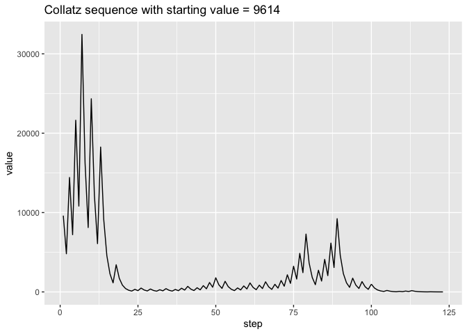<!-- -->

Glad that worked! Now let's plot the same data on a log-log figure:


```r
# semi-log plot
collatz_data %>% 
  filter(seed == seed_value)%>% 
  select(sequence) %>% 
  unnest(sequence) %>% 
  ggplot(aes(x = (1:length(sequence)), y = log(sequence))) +
  geom_line() +
  labs(x = "log(step)", y = "log(value)", title = print(paste0("Collatz sequence with starting value = ", seed_value)))
```

```
## [1] "Collatz sequence with starting value = 9614"
```

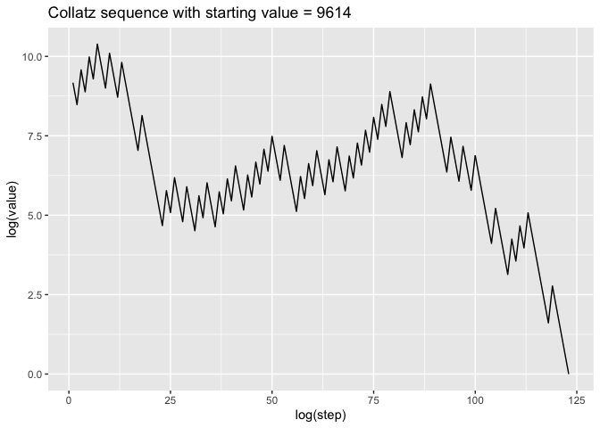<!-- -->

Excellent! How neat! Now let's try to plot all our computed trajectories together 
starting from their seed values:


```r
# preparing the data
collatz_sequences <- collatz_data %>% 
  select(seed, sequence, step_index) %>%
  unnest(c(sequence, step_index)) %>% 
  pivot_longer(cols = -c(step_index, seed), names_to = "variable", values_to = "values") %>% 
  select(-variable)
```

Let's plot the same two plots as above + a log-log plot, but with partly transparent 
lines so that we can detect overlaps in trajectories by looking at the opacity of 
the lines on the plots.


```r
# standard plot
collatz_sequences %>% 
  ggplot(aes(x = step_index, y = values, colour = as.factor(seed))) +
  geom_line() + theme(legend.position = "none") +
  labs(title = paste0("Collatz sequences for starting values in range: ", range(seeds)[1], " - ", range(seeds)[2]),
       x = "step", y = "value")
```

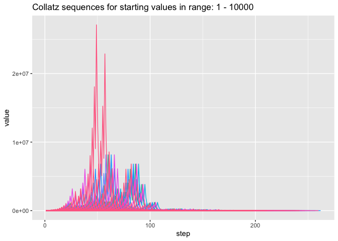<!-- -->

```r
# log-log plot
collatz_sequences %>% 
  ggplot(aes(x = (step_index), y = log(values), colour = as.factor(seed))) +
  geom_line(alpha = 0.1) + theme(legend.position = "none") +
  labs(title = paste0("Collatz sequences for starting values in range: ", range(seeds)[1], " - ", range(seeds)[2]),
       x = "log(step)", y = "log(value)")
```

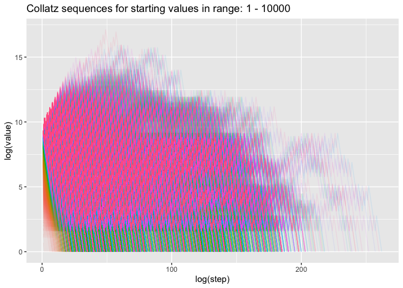<!-- -->

```r
# log-log plot
collatz_sequences %>% 
  ggplot(aes(x = log(step_index), y = log(values), colour = as.factor(seed))) +
  geom_line(alpha = 0.1) + theme(legend.position = "none") +
  labs(title = paste0("Collatz sequences for starting values in range: ", range(seeds)[1], " - ", range(seeds)[2]),
       x = "log(step)", y = "log(value)")
```

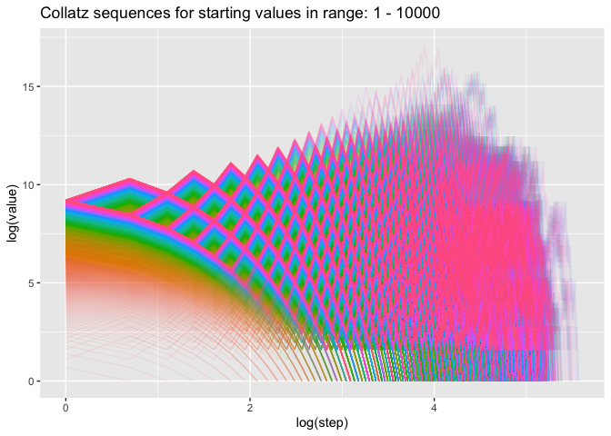<!-- -->

Look at that! Pretty cool huh! And interesting that on the third plot you can 
observe this fractal regularity in the variance of different lines!

You can see in the first and second plots that it looks like some sequence paths are repeated 
with an offset. Perhaps they line up at their ends. Let's get visual evidence by 
plotting the plots above with the steps reversed, starting at the bottom left of 
plots with the end of the sequences:


```r
# preparing the data
collatz_sequences_rev <- collatz_data %>% 
  select(seed, sequence, step_index) %>%
  rowwise() %>% 
  mutate(step_index = list(rev(step_index))) %>% 
  unnest(c(sequence, step_index)) %>% 
  pivot_longer(cols = -c(step_index, seed), names_to = "variable", values_to = "values") %>% 
  select(-variable) 

# standard plot
collatz_sequences_rev %>% 
  ggplot(aes(x = step_index, y = values, colour = as.factor(seed))) +
  geom_line(alpha = 0.4) + theme(legend.position = "none") +
  labs(title = paste0("Reversed Collatz sequences for starting values in range: ", range(seeds)[1], " - ", range(seeds)[2]),
       x = "step", y = "value")
```

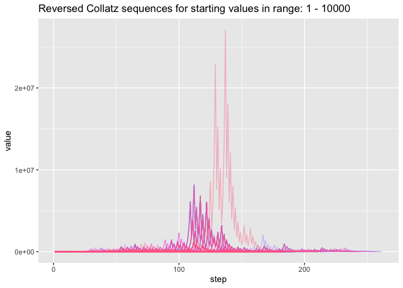<!-- -->

```r
# semi-log plot
collatz_sequences_rev %>% 
  ggplot(aes(x = step_index, y = log(values), colour = as.factor(seed))) +
  geom_line(alpha = 0.1) + theme(legend.position = "none") +
  labs(title = paste0("Reversed Collatz sequences for starting values in range: ", range(seeds)[1], " - ", range(seeds)[2]),
       x = "step", y = "log(value)")
```

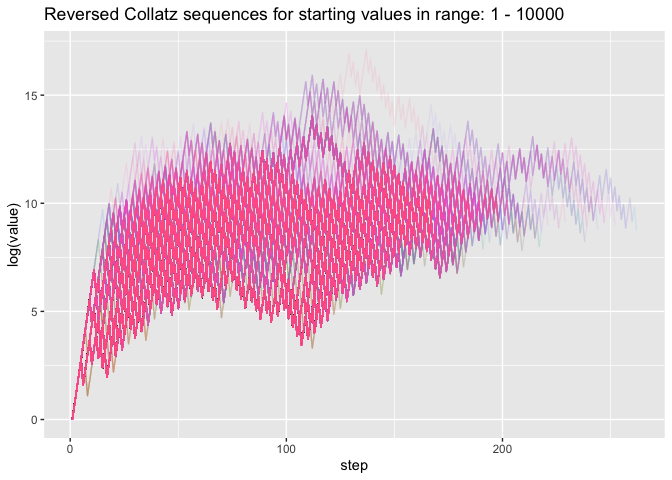<!-- -->

```r
# log-log plot
collatz_sequences_rev %>% 
  ggplot(aes(x = log(step_index), y = log(values), colour = as.factor(seed))) +
  geom_line(alpha = 0.1) + theme(legend.position = "none") +
  labs(title = paste0("Reversed Collatz sequences for starting values in range: ", range(seeds)[1], " - ", range(seeds)[2]),
       x = "log(step)", y = "log(value)")
```

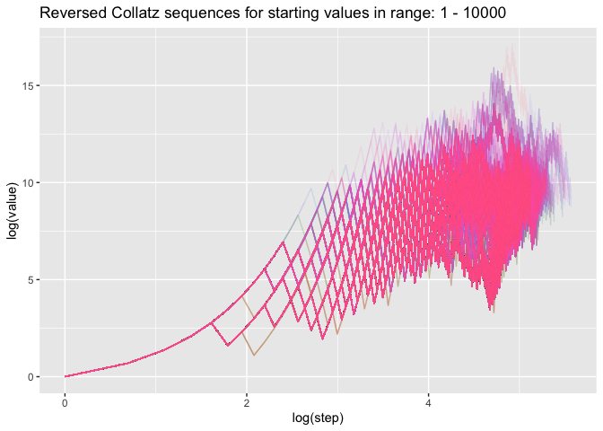<!-- -->

Looks like we were right! Okay, now before we start messing around and relax our 
conformity to the conditions of the Collatz conjecture, let's make a couple other 
exploratory plots.


```r
collatz_data %>% 
  ggplot(aes(x = seed, y = n_steps, colour = log(max_val))) +
  geom_point(size = .6) +

  labs(title = paste0("Steps to 1 for Collatz sequences with starting values in range: ", 
                      range(seeds)[1], " - ", range(seeds)[2]),
       x = "starting value", y = "number of steps to 1", colour = "log(highest reached point)") +
  theme(legend.position="bottom") +
  scale_color_gradientn(colours = rainbow(2))
```

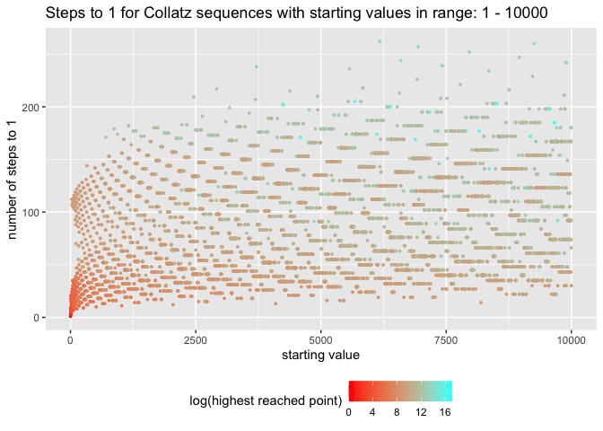<!-- -->

```r
collatz_data %>% 
  ggplot(aes(x = log(seed), y = log(max_val), colour = n_steps)) +
  geom_point() + 
  labs(title = paste0("Highest reached points \nfor Collatz sequences with starting values in range: ", 
                      range(seeds)[1], " - ", range(seeds)[2]),
       x = "log(starting value)", y = "log(highest point)", colour = "n steps to 1") +
  scale_color_gradientn(colours = rainbow(2))
```

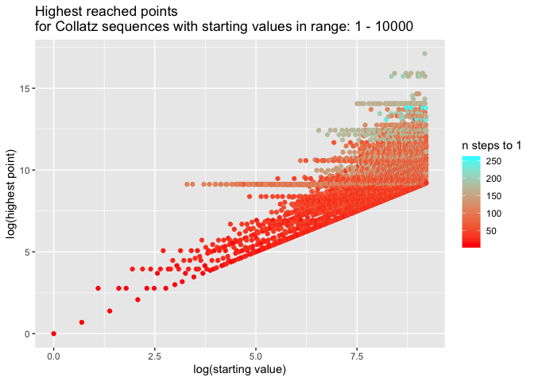<!-- -->

```r
collatz_data %>% 
  ggplot(aes(x = log(seed), y = log(max_val-seed), colour = n_steps)) +
  geom_point() +
  labs(title = paste0("Highest reached points above initial value \nfor Collatz sequences with starting values in range: ", range(seeds)[1], " - ", range(seeds)[2]),
       x = "log(starting value)", y = "log(highest point - starting value)", colour = "n steps to 1") +
  scale_color_gradientn(colours = rainbow(2))
```

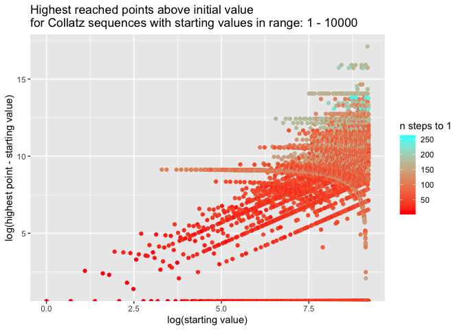<!-- -->

What do all these cool patterns mean? I have no idea, I'm not a mathematician (yet).
But they are sure fun to compute! 
