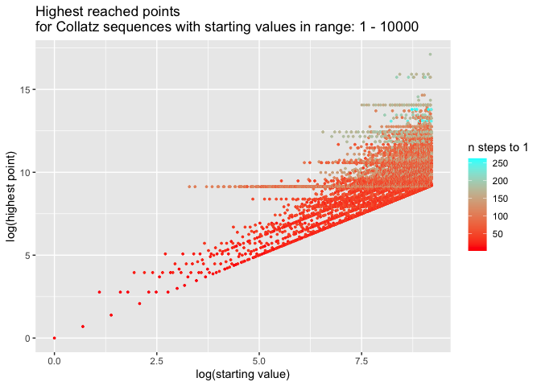

# Overview:

This repository contains a fun little R exploration of Collatz sequences and the Collatz conjecture. I don't get very far in my exploration, and my goal is not to prove or disprove it (nor, I suspect, would I get close if I tried, and besides, we know it must be true for almost all values, and is true for all values that I have the time and dedication to compute on my laptop), but I still had fun playing around with sequences and graphs, and I might revisit this project later and mess around with it more, who knows? :) 

You can consult my original exploration markdown file [here](3x+1.md).

## Exploration excerpts:

### Plots (respecting the rules)

A plot of a random Collatz Sequence between 1 and 10000:

The same data on a semi-log figure:

Excellent! How neat! Now let’s try to plot all our computed trajectories
together starting from their seed values:

Let’s plot the same two plots as above + a log-log plot, but with partly
transparent lines so that we can detect overlaps in trajectories by
looking at the opacity of the lines on the plots.

Look at that! Pretty cool huh! And interesting that on the third plot
you can observe this fractal regularity in the variance of different
lines!

You can see in the first and second plots that it looks like some
sequence paths are repeated with an offset. Perhaps they line up at
their ends. Let’s get visual evidence by plotting the plots above with
the steps reversed, starting at the bottom left of plots with the end of
the sequences:

Looks like we were right! Okay, let’s make a couple other exploratory plots.

What do all these cool patterns mean? I have no idea, but they are sure fun to compute!

----------------------------------------------------------------------------------------------

Shield: [![CC BY-NC-SA 4.0][cc-by-nc-sa-shield]][cc-by-nc-sa]

This work is licensed under a
[Creative Commons Attribution-NonCommercial-ShareAlike 4.0 International License][cc-by-nc-sa].

[![CC BY-NC-SA 4.0][cc-by-nc-sa-image]][cc-by-nc-sa]

[cc-by-nc-sa]: http://creativecommons.org/licenses/by-nc-sa/4.0/
[cc-by-nc-sa-image]: https://licensebuttons.net/l/by-nc-sa/4.0/88x31.png
[cc-by-nc-sa-shield]: https://img.shields.io/badge/License-CC%20BY--NC--SA%204.0-lightgrey.svg
